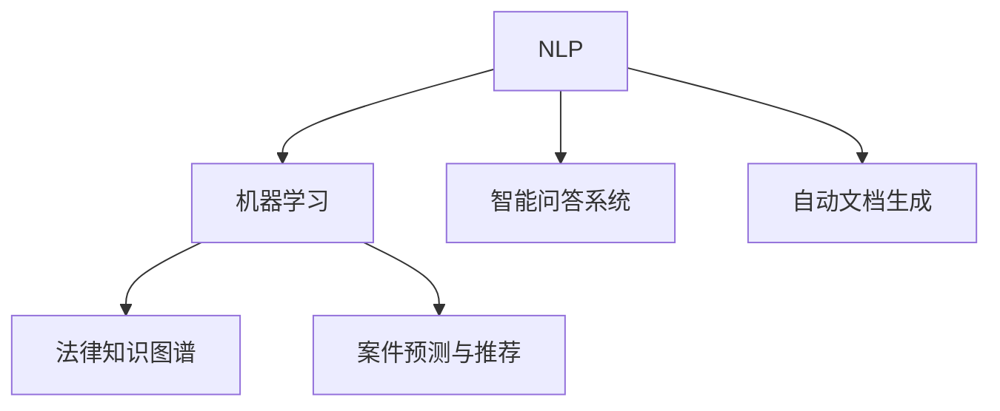

                 

# AI辅助法律服务：提高效率与公平

## 1. 背景介绍

### 1.1 问题由来

近年来，随着法律信息量的爆炸性增长和法律服务需求的急剧增加，传统的法律服务行业面临前所未有的挑战。传统的法律服务需要大量的人力投入，如律师、法律助理等，工作量巨大且容易出错。同时，法律服务的收费昂贵，许多普通民众因为费用问题难以获得专业的法律咨询。如何利用先进的技术手段，提升法律服务的效率和可及性，是一个亟待解决的问题。

人工智能（AI）技术的兴起，为解决上述问题提供了新的思路。AI可以通过自动化处理法律文件、预测法律案件结果、生成法律意见书等方式，辅助法律服务，大幅提升工作效率，降低服务成本，使得更多普通民众能够享受到专业的法律服务。

### 1.2 问题核心关键点

AI辅助法律服务的核心关键点在于如何利用AI技术提升法律服务的效率和公平性。具体来说，包括以下几个方面：

- **自动化处理**：利用自然语言处理（NLP）技术，自动处理法律文档，如合同审查、案件文书撰写等，节省人力和时间。
- **智能问答系统**：构建智能问答系统，用户可以通过自然语言查询法律问题，AI可以快速提供精准的法律意见。
- **案件预测和推荐**：通过数据分析和机器学习模型，预测案件结果，辅助法官和律师进行决策，提升案件处理的准确性和效率。
- **法律知识图谱**：构建法律知识图谱，存储法律文档和规则，辅助法律服务提供者快速检索和应用相关知识。
- **可解释性和可控性**：确保AI在提供法律服务时具有可解释性和可控性，避免偏见和歧视，确保服务公平。

这些关键点共同构成了AI辅助法律服务的核心需求，也是本文聚焦的研究方向。

## 2. 核心概念与联系

### 2.1 核心概念概述

为了更好地理解AI辅助法律服务的原理和应用，本节将介绍几个密切相关的核心概念：

- **自然语言处理（NLP）**：是指让计算机理解和处理自然语言的技术，包括分词、词性标注、命名实体识别、语义分析等。
- **机器学习（ML）**：是指利用算法和模型，让计算机从数据中学习和改进的技术，可以用于分类、回归、预测等任务。
- **法律知识图谱**：是指将法律知识、规则和案例等结构化存储，形成图谱形式，方便检索和应用。
- **智能问答系统**：是指通过AI技术，构建能够理解自然语言并给出精确回答的系统。
- **自动文档生成**：是指利用AI技术，自动生成法律文书、合同等文档，提高文书处理效率。
- **案件预测与推荐**：是指通过数据分析和机器学习模型，预测案件结果，辅助法官和律师进行决策。

这些核心概念之间的逻辑关系可以通过以下Mermaid流程图来展示：



这个流程图展示了NLP、机器学习、法律知识图谱等技术在AI辅助法律服务中的作用和联系。通过这些技术，AI可以处理法律文档、回答法律问题、预测案件结果，提高法律服务的效率和公平性。

## 3. 核心算法原理 & 具体操作步骤
### 3.1 算法原理概述

AI辅助法律服务的基础是自然语言处理（NLP）和机器学习（ML）技术。具体来说，NLP技术用于处理法律文本，提取法律知识和信息，而ML技术则用于基于这些知识进行预测和决策。

### 3.2 算法步骤详解

AI辅助法律服务通常包括以下几个关键步骤：

**Step 1: 数据准备**

1. 收集和整理法律领域的文本数据，如法律条文、司法判例、法律意见书等。
2. 清洗和标注这些文本数据，去除无关信息，进行关键词提取和实体识别。
3. 构建法律知识图谱，将法律条文、规则和案例等存储在图谱中，方便检索和应用。

**Step 2: 模型训练**

1. 选择合适的NLP模型，如BERT、GPT等，作为初始化参数。
2. 根据法律领域的特定需求，设计并训练NLP模型，如合同审查、案情分析、法律文书生成等任务。
3. 选择机器学习算法，如决策树、随机森林、神经网络等，根据特定任务进行训练，如案件结果预测、法律关系推理等。

**Step 3: 模型微调**

1. 在已有预训练模型基础上，使用少量标注数据进行微调，优化模型性能。
2. 针对特定任务，添加任务适配层，如分类层、生成层等，进行微调。
3. 设置合适的超参数，如学习率、批大小、迭代轮数等，进行模型训练。

**Step 4: 部署与测试**

1. 将训练好的模型部署到实际应用场景中，如智能问答系统、自动文档生成器等。
2. 收集用户反馈，不断调整和优化模型。
3. 定期更新法律知识和案例，保持模型的时效性。

**Step 5: 维护与迭代**

1. 定期维护和更新模型，修复bug，提升性能。
2. 根据新的法律条文、规则和案例，进行模型迭代和优化。
3. 引入新的技术，如AI伦理、可解释性、隐私保护等，确保服务公平和可控。

### 3.3 算法优缺点

AI辅助法律服务具有以下优点：

1. **效率提升**：通过自动化处理法律文档、智能问答系统、案件预测与推荐等，大幅提升法律服务的效率。
2. **成本降低**：减少人工处理文档、提供咨询服务的需求，降低法律服务的成本。
3. **服务可及性提高**：通过AI技术，使得法律服务更加便捷，更多人能够获得专业的法律服务。
4. **决策支持**：利用数据分析和机器学习模型，提供精准的法律预测和决策支持，提升案件处理的质量。

同时，该方法也存在一些局限性：

1. **数据依赖**：模型的性能很大程度上依赖于标注数据的质量和数量。
2. **偏见和歧视**：模型可能继承数据的偏见，导致不公平的决策结果。
3. **解释性不足**：AI模型在法律服务中的应用，往往缺乏足够的解释性，难以解释其决策过程。
4. **隐私保护**：处理法律文档和案例涉及隐私问题，需要加强数据保护措施。

尽管存在这些局限性，但AI辅助法律服务仍然是大势所趋，未来必将得到更广泛的应用。

### 3.4 算法应用领域

AI辅助法律服务的核心技术在多个领域得到了广泛应用：

- **合同审查**：利用NLP技术，自动审查合同条款，提取关键信息和风险点，提高审查效率。
- **智能问答系统**：构建智能问答系统，用户可以通过自然语言查询法律问题，AI可以快速提供精准的法律意见。
- **案件预测**：通过数据分析和机器学习模型，预测案件结果，辅助法官和律师进行决策，提升案件处理的准确性和效率。
- **法律文书生成**：利用AI技术，自动生成法律文书、合同等文档，提高文书处理效率。
- **法律知识图谱**：构建法律知识图谱，存储法律条文、规则和案例，辅助法律服务提供者快速检索和应用。

这些应用领域展示了AI辅助法律服务的广泛前景，未来还将有更多的创新和突破。

## 4. 数学模型和公式 & 详细讲解
### 4.1 数学模型构建

为了更好地理解AI辅助法律服务的数学模型，我们以案件预测为例，进行详细的数学建模。

假设我们有N个历史案件，每个案件包含M个特征，记为 $(x_i, y_i)$，其中 $x_i$ 为案件特征向量，$y_i$ 为案件结果标签。我们的目标是构建一个预测模型，根据新案件的特征向量 $x$，预测其案件结果 $y$。

### 4.2 公式推导过程

假设我们使用决策树算法进行模型训练。决策树的构建过程可以概括为以下几个步骤：

1. **特征选择**：从M个特征中选择一个最优特征，将其作为当前节点的分裂依据。
2. **分裂节点**：根据最优特征的分裂点，将数据集划分为多个子集。
3. **递归构建**：对每个子集递归构建决策树，直到达到终止条件。

最终得到的决策树模型可以表示为：

$$
T = \{R, Y, \{l_k\}_{k=1}^{K}\}
$$

其中，$R$ 为决策树的根节点，$Y$ 为叶子节点集，$l_k$ 为叶子节点 $k$ 的标签。

### 4.3 案例分析与讲解

以合同审查为例，我们可以构建一个基于NLP技术的合同审查系统。系统将输入的合同文本自动处理，提取出合同关键信息，如合同金额、违约条件等，并进行风险评估和审核。具体步骤如下：

1. **文本预处理**：对合同文本进行分词、去停用词、命名实体识别等预处理操作。
2. **特征提取**：利用NLP技术，提取合同文本的关键信息，如金额、条款、违约条件等。
3. **风险评估**：基于提取出的特征，使用机器学习模型（如决策树、随机森林等）进行风险评估，判断合同是否存在风险。
4. **审核建议**：根据风险评估结果，生成审核建议，如修改条款、建议第三方审核等。

## 5. 项目实践：代码实例和详细解释说明
### 5.1 开发环境搭建

在进行AI辅助法律服务项目开发前，我们需要准备好开发环境。以下是使用Python进行PyTorch开发的环境配置流程：

1. 安装Anaconda：从官网下载并安装Anaconda，用于创建独立的Python环境。

2. 创建并激活虚拟环境：
```bash
conda create -n pytorch-env python=3.8 
conda activate pytorch-env
```

3. 安装PyTorch：根据CUDA版本，从官网获取对应的安装命令。例如：
```bash
conda install pytorch torchvision torchaudio cudatoolkit=11.1 -c pytorch -c conda-forge
```

4. 安装相关库：
```bash
pip install scikit-learn pandas numpy transformers
```

完成上述步骤后，即可在`pytorch-env`环境中开始AI辅助法律服务的开发。

### 5.2 源代码详细实现

下面以智能问答系统为例，给出使用Transformers库进行开发的PyTorch代码实现。

```python
from transformers import BertForQuestionAnswering, BertTokenizer
from sklearn.metrics import precision_recall_fscore_support
from sklearn.model_selection import train_test_split
import torch
import torch.nn as nn
import pandas as pd

# 数据准备
data = pd.read_csv('legal_questions.csv')

# 分词器
tokenizer = BertTokenizer.from_pretrained('bert-base-cased')

# 构建特征提取器
class LegalFeatureExtractor(nn.Module):
    def __init__(self):
        super().__init__()
        self.tokenizer = tokenizer
        self.max_len = 128

    def forward(self, question, context):
        encoded = self.tokenizer(question, context, max_length=self.max_len, return_tensors='pt')
        return encoded['input_ids'], encoded['attention_mask']

# 模型训练
model = BertForQuestionAnswering.from_pretrained('bert-base-cased')
extractor = LegalFeatureExtractor()
optimizer = torch.optim.Adam(model.parameters(), lr=1e-5)
device = torch.device('cuda' if torch.cuda.is_available() else 'cpu')
model.to(device)

# 训练过程
def train_epoch(model, extractor, optimizer, data_loader):
    model.train()
    loss = 0
    for batch in data_loader:
        input_ids, attention_mask, start_positions, end_positions = batch
        input_ids = input_ids.to(device)
        attention_mask = attention_mask.to(device)
        start_positions = start_positions.to(device)
        end_positions = end_positions.to(device)
        outputs = model(input_ids, attention_mask=attention_mask, start_positions=start_positions, end_positions=end_positions)
        loss += outputs.loss
        optimizer.zero_grad()
        outputs.loss.backward()
        optimizer.step()
    return loss / len(data_loader)

# 评估过程
def evaluate(model, extractor, data_loader):
    model.eval()
    total_count = 0
    total_correct = 0
    for batch in data_loader:
        input_ids, attention_mask, start_positions, end_positions = batch
        input_ids = input_ids.to(device)
        attention_mask = attention_mask.to(device)
        start_positions = start_positions.to(device)
        end_positions = end_positions.to(device)
        outputs = model(input_ids, attention_mask=attention_mask, start_positions=start_positions, end_positions=end_positions)
        start_logits = outputs.start_logits
        end_logits = outputs.end_logits
        labels = start_positions.to(device), end_positions.to(device)
        start_positions = start_logits.argmax(dim=-1).cpu().tolist()
        end_positions = end_logits.argmax(dim=-1).cpu().tolist()
        total_count += len(labels[0])
        total_correct += (start_positions == labels[0]).sum() + (end_positions == labels[1]).sum()
    return total_correct / total_count

# 训练和评估
train_data, dev_data = train_test_split(data, test_size=0.2)
train_loader = DataLoader(train_data, batch_size=32, shuffle=True)
dev_loader = DataLoader(dev_data, batch_size=32, shuffle=False)
for epoch in range(5):
    loss = train_epoch(model, extractor, optimizer, train_loader)
    print(f'Epoch {epoch+1}, loss: {loss:.3f}')
    accuracy = evaluate(model, extractor, dev_loader)
    print(f'Epoch {epoch+1}, accuracy: {accuracy:.3f}')
```

以上就是使用PyTorch进行智能问答系统开发的完整代码实现。可以看到，利用Transformers库，我们可以很方便地构建和训练基于BERT模型的智能问答系统。

### 5.3 代码解读与分析

让我们再详细解读一下关键代码的实现细节：

**LegalFeatureExtractor类**：
- `__init__`方法：初始化分词器和最大序列长度。
- `forward`方法：将问题（question）和上下文（context）输入分词器，生成token ids和attention mask。

**模型训练过程**：
- 定义模型（BertForQuestionAnswering）和优化器（AdamW）。
- 将模型和数据加载器（data_loader）移动到GPU上。
- 使用`train_epoch`函数进行模型训练，计算loss并反向传播更新模型参数。

**模型评估过程**：
- 使用`evaluate`函数进行模型评估，计算准确率。
- 在每个epoch结束后输出训练loss和评估准确率。

**训练流程**：
- 定义总的epoch数，循环进行训练和评估。
- 在每个epoch内，先在训练集上训练，输出训练loss。
- 在验证集上评估，输出评估准确率。

可以看到，PyTorch配合Transformers库使得智能问答系统的开发变得简洁高效。开发者可以将更多精力放在数据处理、模型改进等高层逻辑上，而不必过多关注底层的实现细节。

当然，工业级的系统实现还需考虑更多因素，如模型的保存和部署、超参数的自动搜索、更灵活的任务适配层等。但核心的训练和评估流程基本与此类似。

## 6. 实际应用场景
### 6.1 智能问答系统

智能问答系统是AI辅助法律服务的重要应用场景。通过构建智能问答系统，用户可以通过自然语言查询法律问题，AI可以快速提供精准的法律意见。

在技术实现上，可以收集法律领域的常见问题及其答案，构建知识库。利用NLP技术处理用户输入的问题，通过匹配和推理，从知识库中提取相关答案，并返回给用户。同时，可以引入机器学习模型进行个性化推荐，提供更适合用户需求的回答。

智能问答系统可以广泛应用于法律咨询、合同审查、案件分析等环节，大大提升法律服务的效率和用户体验。

### 6.2 合同审查

合同审查是法律服务中常见的任务。利用NLP技术，可以快速处理大量的合同文本，提取关键信息，并进行风险评估和审核。

具体实现方式包括：
1. 对合同文本进行预处理，去除无关信息，提取关键条款。
2. 利用NLP技术，如命名实体识别、情感分析等，提取合同中的关键信息。
3. 根据提取的信息，使用机器学习模型进行风险评估，判断合同是否存在风险。
4. 生成审核建议，如修改条款、建议第三方审核等。

通过合同审查系统，可以大幅提升合同审核的效率和准确性，减少人工处理的成本和时间。

### 6.3 法律文书生成

法律文书是法律服务中的重要文档，包括合同、诉状、判决书等。利用AI技术，可以快速生成法律文书，提高文书处理效率。

具体实现方式包括：
1. 收集和整理各类法律文书的模板和格式要求。
2. 利用NLP技术，自动解析输入的数据，如合同金额、条款、违约条件等。
3. 根据输入数据，使用AI技术生成符合格式要求的文书。
4. 对生成的文书进行审核和优化，确保文书的准确性和完整性。

通过文书生成系统，可以大大提升文书处理的效率和质量，减少人工处理的工作量。

### 6.4 案件预测与推荐

利用数据分析和机器学习模型，可以预测案件结果，辅助法官和律师进行决策。通过构建案件预测与推荐系统，可以快速、准确地预测案件结果，提升案件处理的效率和质量。

具体实现方式包括：
1. 收集和整理历史案件数据，包括案件特征、结果等。
2. 利用机器学习模型，如决策树、随机森林等，训练案件预测模型。
3. 对新案件的特征进行提取和处理。
4. 使用训练好的模型进行案件预测，生成预测结果。

案件预测与推荐系统可以广泛应用于案件分析、判决辅助等领域，提高案件处理的准确性和效率。

### 6.5 法律知识图谱

法律知识图谱是将法律条文、规则和案例等结构化存储，形成图谱形式，方便检索和应用。利用知识图谱技术，可以快速检索和应用法律知识和案例，提高法律服务的效率和准确性。

具体实现方式包括：
1. 收集和整理法律条文、规则和案例等文本数据。
2. 利用NLP技术，对文本数据进行解析和结构化存储。
3. 构建法律知识图谱，将法律知识和案例等信息存储在图谱中。
4. 提供检索接口，方便法律服务提供者快速检索和应用法律知识。

通过法律知识图谱，可以大大提升法律服务的效率和准确性，提供更好的法律服务支持。

## 7. 工具和资源推荐
### 7.1 学习资源推荐

为了帮助开发者系统掌握AI辅助法律服务的技术基础和实践技巧，这里推荐一些优质的学习资源：

1. 《NLP基础与实践》系列博文：由NLP技术专家撰写，系统介绍了NLP技术的基础知识和应用实践。
2. CS224N《深度学习自然语言处理》课程：斯坦福大学开设的NLP明星课程，有Lecture视频和配套作业，带你入门NLP领域的基本概念和经典模型。
3. 《Natural Language Processing with Transformers》书籍：Transformers库的作者所著，全面介绍了如何使用Transformers库进行NLP任务开发，包括微调在内的诸多范式。
4. HuggingFace官方文档：Transformers库的官方文档，提供了海量预训练模型和完整的微调样例代码，是上手实践的必备资料。
5. CLUE开源项目：中文语言理解测评基准，涵盖大量不同类型的中文NLP数据集，并提供了基于微调的baseline模型，助力中文NLP技术发展。

通过对这些资源的学习实践，相信你一定能够快速掌握AI辅助法律服务的技术精髓，并用于解决实际的NLP问题。

### 7.2 开发工具推荐

高效的开发离不开优秀的工具支持。以下是几款用于AI辅助法律服务开发的常用工具：

1. PyTorch：基于Python的开源深度学习框架，灵活动态的计算图，适合快速迭代研究。大部分预训练语言模型都有PyTorch版本的实现。
2. TensorFlow：由Google主导开发的开源深度学习框架，生产部署方便，适合大规模工程应用。同样有丰富的预训练语言模型资源。
3. Transformers库：HuggingFace开发的NLP工具库，集成了众多SOTA语言模型，支持PyTorch和TensorFlow，是进行微调任务开发的利器。
4. Weights & Biases：模型训练的实验跟踪工具，可以记录和可视化模型训练过程中的各项指标，方便对比和调优。与主流深度学习框架无缝集成。
5. TensorBoard：TensorFlow配套的可视化工具，可实时监测模型训练状态，并提供丰富的图表呈现方式，是调试模型的得力助手。
6. Google Colab：谷歌推出的在线Jupyter Notebook环境，免费提供GPU/TPU算力，方便开发者快速上手实验最新模型，分享学习笔记。

合理利用这些工具，可以显著提升AI辅助法律服务开发的效率，加快创新迭代的步伐。

### 7.3 相关论文推荐

AI辅助法律服务的发展得益于学界的持续研究。以下是几篇奠基性的相关论文，推荐阅读：

1. Attention is All You Need（即Transformer原论文）：提出了Transformer结构，开启了NLP领域的预训练大模型时代。
2. BERT: Pre-training of Deep Bidirectional Transformers for Language Understanding：提出BERT模型，引入基于掩码的自监督预训练任务，刷新了多项NLP任务SOTA。
3. Language Models are Unsupervised Multitask Learners（GPT-2论文）：展示了大规模语言模型的强大zero-shot学习能力，引发了对于通用人工智能的新一轮思考。
4. Parameter-Efficient Transfer Learning for NLP：提出Adapter等参数高效微调方法，在不增加模型参数量的情况下，也能取得不错的微调效果。
5. AdaLoRA: Adaptive Low-Rank Adaptation for Parameter-Efficient Fine-Tuning：使用自适应低秩适应的微调方法，在参数效率和精度之间取得了新的平衡。

这些论文代表了大语言模型微调技术的发展脉络。通过学习这些前沿成果，可以帮助研究者把握学科前进方向，激发更多的创新灵感。

## 8. 总结：未来发展趋势与挑战

### 8.1 总结

本文对AI辅助法律服务进行了全面系统的介绍。首先阐述了AI辅助法律服务的背景和意义，明确了微调在提升法律服务效率和公平性方面的独特价值。其次，从原理到实践，详细讲解了AI辅助法律服务的数学模型和关键步骤，给出了AI辅助法律服务的完整代码实例。同时，本文还广泛探讨了AI辅助法律服务在智能问答、合同审查、法律文书生成、案件预测与推荐等众多领域的应用前景，展示了AI辅助法律服务的广阔前景。

通过本文的系统梳理，可以看到，AI辅助法律服务正在成为NLP领域的重要范式，极大地拓展了AI技术的应用边界，催生了更多的落地场景。受益于大规模语料的预训练和微调方法的不断进步，相信AI辅助法律服务必将在未来的法律服务行业中发挥越来越重要的作用。

### 8.2 未来发展趋势

展望未来，AI辅助法律服务的发展趋势包括：

1. **模型规模持续增大**：随着算力成本的下降和数据规模的扩张，预训练语言模型的参数量还将持续增长。超大规模语言模型蕴含的丰富语言知识，有望支撑更加复杂多变的法律服务任务。
2. **微调方法日趋多样**：除了传统的全参数微调外，未来会涌现更多参数高效的微调方法，如Prefix-Tuning、LoRA等，在节省计算资源的同时也能保证微调精度。
3. **持续学习成为常态**：随着数据分布的不断变化，微调模型也需要持续学习新知识以保持性能。如何在不遗忘原有知识的同时，高效吸收新样本信息，将成为重要的研究课题。
4. **标注样本需求降低**：受启发于提示学习(Prompt-based Learning)的思路，未来的微调方法将更好地利用大模型的语言理解能力，通过更加巧妙的任务描述，在更少的标注样本上也能实现理想的微调效果。
5. **多模态微调崛起**：当前的微调主要聚焦于纯文本数据，未来会进一步拓展到图像、视频、语音等多模态数据微调。多模态信息的融合，将显著提升语言模型对现实世界的理解和建模能力。
6. **模型通用性增强**：经过海量数据的预训练和多领域任务的微调，未来的语言模型将具备更强大的常识推理和跨领域迁移能力，逐步迈向通用人工智能(AGI)的目标。

以上趋势凸显了AI辅助法律服务的广阔前景。这些方向的探索发展，必将进一步提升法律服务的效率和公平性，为人类认知智能的进化带来深远影响。

### 8.3 面临的挑战

尽管AI辅助法律服务已经取得了瞩目成就，但在迈向更加智能化、普适化应用的过程中，它仍面临着诸多挑战：

1. **数据依赖**：模型的性能很大程度上依赖于标注数据的质量和数量。对于法律领域，获取高质量标注数据成本较高，存在数据瓶颈。
2. **偏见和歧视**：模型可能继承数据的偏见，导致不公平的决策结果。如何消除模型偏见，确保服务公平，还需要更多理论和实践的积累。
3. **解释性不足**：AI模型在法律服务中的应用，往往缺乏足够的解释性，难以解释其决策过程。对于医疗、金融等高风险应用，算法的可解释性和可审计性尤为重要。
4. **隐私保护**：处理法律文档和案例涉及隐私问题，需要加强数据保护措施。如何在提供服务的同时，保障数据隐私和安全，将是重要的研究方向。
5. **多领域适配**：不同法律领域的数据和规则差异较大，如何构建跨领域的适配机制，使得AI辅助法律服务能够覆盖更多法律领域，将是重要的挑战。

正视AI辅助法律服务面临的这些挑战，积极应对并寻求突破，将是大势所趋。相信随着学界和产业界的共同努力，这些挑战终将一一被克服，AI辅助法律服务必将在构建安全、可靠、可解释、可控的智能法律服务体系中扮演越来越重要的角色。

### 8.4 研究展望

面向未来，AI辅助法律服务的核心研究将聚焦以下几个方向：

1. **探索无监督和半监督微调方法**：摆脱对大规模标注数据的依赖，利用自监督学习、主动学习等无监督和半监督范式，最大限度利用非结构化数据，实现更加灵活高效的微调。
2. **研究参数高效和计算高效的微调范式**：开发更加参数高效的微调方法，在固定大部分预训练参数的同时，只更新极少量的任务相关参数。同时优化微调模型的计算图，减少前向传播和反向传播的资源消耗，实现更加轻量级、实时性的部署。
3. **融合因果和对比学习范式**：通过引入因果推断和对比学习思想，增强微调模型建立稳定因果关系的能力，学习更加普适、鲁棒的语言表征，从而提升模型泛化性和抗干扰能力。
4. **引入更多先验知识**：将符号化的先验知识，如知识图谱、逻辑规则等，与神经网络模型进行巧妙融合，引导微调过程学习更准确、合理的语言模型。同时加强不同模态数据的整合，实现视觉、语音等多模态信息与文本信息的协同建模。
5. **结合因果分析和博弈论工具**：将因果分析方法引入微调模型，识别出模型决策的关键特征，增强输出解释的因果性和逻辑性。借助博弈论工具刻画人机交互过程，主动探索并规避模型的脆弱点，提高系统稳定性。
6. **纳入伦理道德约束**：在模型训练目标中引入伦理导向的评估指标，过滤和惩罚有偏见、有害的输出倾向。同时加强人工干预和审核，建立模型行为的监管机制，确保输出符合人类价值观和伦理道德。

这些研究方向的探索，必将引领AI辅助法律服务技术迈向更高的台阶，为构建安全、可靠、可解释、可控的智能法律服务体系铺平道路。面向未来，AI辅助法律服务需要与其他人工智能技术进行更深入的融合，如知识表示、因果推理、强化学习等，多路径协同发力，共同推动法律服务行业的进步。只有勇于创新、敢于突破，才能不断拓展AI辅助法律服务的应用范围，让智能技术更好地造福人类社会。

## 9. 附录：常见问题与解答

**Q1：AI辅助法律服务是否适用于所有法律领域？**

A: AI辅助法律服务在大多数法律领域都有广泛的应用前景。对于数据量较大的法律领域，如合同法、劳动法等，AI辅助法律服务可以显著提升处理效率和质量。但对于一些数据量较小、规则复杂的法律领域，如刑法、税法等，AI辅助法律服务的效果可能相对有限，需要结合专家知识进行补充。

**Q2：AI辅助法律服务的核心技术是什么？**

A: AI辅助法律服务的核心技术主要包括自然语言处理（NLP）、机器学习（ML）和法律知识图谱等。NLP技术用于处理法律文本，提取法律知识和信息；ML技术用于基于这些知识进行预测和决策；法律知识图谱用于存储法律条文、规则和案例，方便检索和应用。

**Q3：AI辅助法律服务是否会带来新的法律风险？**

A: AI辅助法律服务在提供服务时，需要考虑数据隐私和模型偏见等问题。如果模型学习到了偏见和有害信息，可能会影响司法公正和决策的公平性。因此，需要在模型训练和应用过程中，加强数据保护和模型审查，确保服务公平和安全。

**Q4：AI辅助法律服务如何平衡效率和公平性？**

A: AI辅助法律服务需要在提高效率的同时，确保服务的公平性。可以通过引入多样化的训练数据、设置公平性约束、优化模型决策过程等手段，平衡效率和公平性。例如，引入法律领域专家的监督和反馈，确保AI辅助法律服务的公平性。

**Q5：AI辅助法律服务在落地应用时需要注意哪些问题？**

A: AI辅助法律服务在落地应用时，需要注意数据隐私、模型偏见、解释性、可控性等问题。需要在模型训练和应用过程中，加强数据保护和模型审查，确保服务公平和安全。同时，需要建立健全的监管机制，确保AI辅助法律服务符合法律法规和伦理要求。

通过本文的系统梳理，可以看到，AI辅助法律服务正在成为NLP领域的重要范式，极大地拓展了AI技术的应用边界，催生了更多的落地场景。受益于大规模语料的预训练和微调方法的不断进步，相信AI辅助法律服务必将在未来的法律服务行业中发挥越来越重要的作用。

