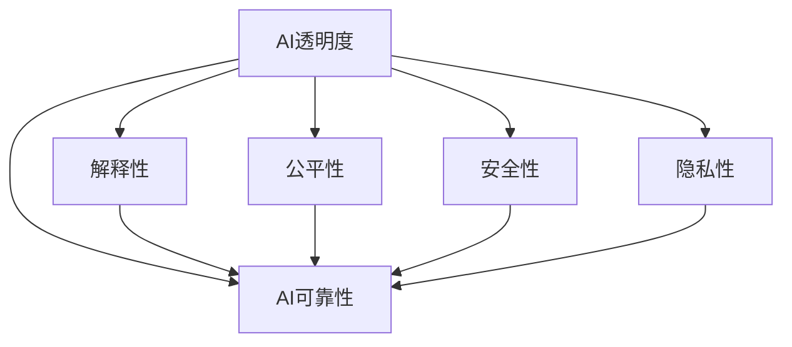

                 

# AI透明度和可靠性：未来的关键挑战

## 1. 背景介绍

随着人工智能(AI)技术的快速发展和广泛应用，AI系统在医疗、金融、制造、交通等各个领域的影响日益加深。AI的透明性和可靠性问题，逐渐成为业界和社会关注的焦点。

一方面，AI系统具有高度复杂性，其决策过程往往难以解释，难以让人理解和信任。例如，神经网络模型的内部工作机制和参数结构通常黑箱化，难以解释模型的输入-输出映射关系。这不仅增加了AI系统的调试和维护难度，还可能引发伦理道德和法律问题。

另一方面，AI系统的预测和决策可能存在误差，甚至可能出现有意或无意的歧视性结果。例如，AI模型在训练数据中学习到的偏见，可能传递到下游任务中，产生不公平的决策结果。这些偏见和错误可能严重影响AI系统的可信赖性和应用范围。

因此，如何提高AI系统的透明性和可靠性，成为了当前AI研究与应用的重大挑战。本文将详细探讨这一问题，并提出可能的解决方案和未来发展方向。

## 2. 核心概念与联系

### 2.1 核心概念概述

为更好地理解AI透明性和可靠性的问题，本节将介绍几个密切相关的核心概念：

- AI透明度(AI Transparency)：指AI系统的决策过程和内部工作机制是否能够被清楚地理解和解释。包括模型的结构、参数、训练数据等细节。

- AI可靠性(AI Reliability)：指AI系统的输出是否稳定、准确，是否能够正确地处理输入数据并产生预期结果。包括系统的鲁棒性、泛化能力、抗干扰能力等。

- 解释性(Explainability)：指对AI模型决策过程的解释能力，能够将模型的内部工作机制和决策依据向用户解释清楚。

- 公平性(Fairness)：指AI系统在不同群体中的决策是否公平，避免对特定群体的歧视性行为。

- 安全性和隐私性(Security and Privacy)：指AI系统的输出是否安全可靠，是否存在数据泄露和滥用风险。

这些核心概念之间紧密联系，共同构成了AI系统的透明性和可靠性。通过理解这些概念，我们可以更好地把握AI系统的工作原理和优化方向。

### 2.2 核心概念原理和架构的 Mermaid 流程图(Mermaid 流程节点中不要有括号、逗号等特殊字符)



这个流程图展示了大语言模型的核心概念及其之间的关系：

1. AI透明度是其他核心概念的基础。没有透明度，就无法评估AI的可靠性、解释性、公平性、安全性和隐私性。
2. AI可靠性直接受透明度、解释性、公平性、安全性和隐私性的影响。可靠性高的系统通常透明度和解释性较强。
3. 解释性是透明度的重要组成部分，直接影响用户对AI系统的信任度。
4. 公平性是AI系统的伦理要求，要求系统在处理不同群体数据时，不能存在歧视性行为。
5. 安全性和隐私性是AI系统的底线，要求系统数据和决策过程必须保障安全，避免泄露隐私。

这些核心概念之间的逻辑关系表明，AI透明性和可靠性是一个多维度的系统问题，需要从多个角度进行全面考量。

## 3. 核心算法原理 & 具体操作步骤

### 3.1 算法原理概述

AI系统的透明性和可靠性问题，通常涉及以下几个关键步骤：

1. **数据透明性**：保证数据的质量、来源、分布和处理方式是可解释的，数据采集和预处理过程应公开透明。

2. **模型透明性**：模型的结构和参数应公开，便于研究人员和用户理解模型的内部工作机制。

3. **决策透明性**：AI系统的输入-输出映射应公开，便于用户理解和质疑模型的预测结果。

4. **结果透明性**：AI系统的预测和决策应可追溯、可验证，避免错误和偏见。

5. **公平性**：AI系统在不同群体中的表现应公平，避免对特定群体的歧视性行为。

6. **安全性**：AI系统的输出应稳定可靠，避免被恶意攻击和滥用。

7. **隐私性**：AI系统处理数据时，应遵守隐私保护法律法规，保障数据和用户隐私。

这些透明性和可靠性目标，需要通过一系列技术和方法来实现。接下来，我们将详细探讨这些技术和方法。

### 3.2 算法步骤详解

#### 3.2.1 数据透明性

确保数据透明性的关键在于公开数据的质量、来源和处理方式。通常，数据透明性需要从数据采集、数据处理、数据存储和数据共享等多个环节入手：

- **数据采集透明性**：应公开数据采集的方式、工具、时间和地点，确保数据采集过程公正、透明。

- **数据处理透明性**：应公开数据处理的方法、步骤、参数和工具，确保数据处理过程可追溯、可重复。

- **数据存储透明性**：应公开数据的存储方式、格式、位置和权限，确保数据存储过程公开透明。

- **数据共享透明性**：应公开数据共享的目的、方式、范围和权限，确保数据共享过程公正、合法。

#### 3.2.2 模型透明性

模型透明性要求模型的结构和参数应公开，便于研究人员和用户理解模型的内部工作机制。通常，可以通过以下方法实现模型透明性：

- **模型结构透明性**：公开模型的层数、神经元数量、激活函数、损失函数等结构信息，方便用户理解模型的基本结构。

- **模型参数透明性**：公开模型的权重、偏置等参数信息，方便用户理解模型的学习过程。

- **模型训练透明性**：公开模型的训练数据、训练过程、训练参数和训练工具，方便用户理解模型的训练过程。

#### 3.2.3 决策透明性

决策透明性要求AI系统的输入-输出映射应公开，便于用户理解和质疑模型的预测结果。通常，可以通过以下方法实现决策透明性：

- **决策路径透明性**：公开模型的推理路径、特征选择和决策规则，方便用户理解模型的决策依据。

- **决策结果透明性**：公开模型的预测结果和推理过程，便于用户验证和质疑模型的预测结果。

#### 3.2.4 结果透明性

结果透明性要求AI系统的预测和决策应可追溯、可验证，避免错误和偏见。通常，可以通过以下方法实现结果透明性：

- **结果可追溯性**：记录模型的预测过程和推理依据，方便用户追溯模型的预测结果。

- **结果可验证性**：设计模型验证机制，方便用户验证模型的预测结果。

#### 3.2.5 公平性

公平性要求AI系统在不同群体中的表现应公平，避免对特定群体的歧视性行为。通常，可以通过以下方法实现公平性：

- **公平性指标透明性**：公开公平性指标的定义和计算方法，方便用户理解和验证模型的公平性。

- **公平性改进透明性**：记录公平性改进的方法和过程，方便用户验证和改进模型的公平性。

#### 3.2.6 安全性

安全性要求AI系统的输出应稳定可靠，避免被恶意攻击和滥用。通常，可以通过以下方法实现安全性：

- **安全性评估透明性**：公开安全性的评估方法和结果，方便用户理解和验证模型的安全性。

- **安全性改进透明性**：记录安全性的改进方法和过程，方便用户验证和改进模型的安全性。

#### 3.2.7 隐私性

隐私性要求AI系统处理数据时，应遵守隐私保护法律法规，保障数据和用户隐私。通常，可以通过以下方法实现隐私性：

- **隐私性保护透明性**：公开隐私保护的方法和措施，方便用户理解和验证隐私保护的效果。

- **隐私性合规透明性**：记录隐私保护的合规情况和问题，方便用户验证和改进隐私保护的合规性。

### 3.3 算法优缺点

AI透明性和可靠性技术的优点包括：

1. **提高信任度**：透明性和可靠性技术可以提高用户对AI系统的信任度，使其更容易接受和应用。

2. **促进研究和开发**：透明性和可靠性技术可以促进研究和开发，加速AI技术的迭代和优化。

3. **保障公平和合规**：透明性和可靠性技术可以保障AI系统的公平性和合规性，避免歧视和滥用行为。

4. **保障安全和隐私**：透明性和可靠性技术可以保障AI系统的安全和隐私，避免数据泄露和滥用风险。

然而，这些技术的缺点包括：

1. **技术复杂性高**：透明性和可靠性技术涉及多个环节和多个方面，技术实现复杂，需要多学科合作。

2. **成本高昂**：透明性和可靠性技术需要大量资源投入，包括数据、模型和工具等。

3. **数据隐私风险**：透明性和可靠性技术可能涉及数据的公开和共享，存在数据隐私风险。

4. **模型性能下降**：透明性和可靠性技术可能影响模型的性能，如增加计算复杂度和存储开销。

尽管存在这些缺点，但透明性和可靠性技术仍然是大规模应用AI系统的必经之路。只有在技术透明、用户可信、公平合规、安全可靠的前提下，AI技术才能真正融入人类生活，发挥其最大价值。

### 3.4 算法应用领域

AI透明性和可靠性技术已经在多个领域得到了广泛应用，以下是几个典型案例：

1. **医疗领域**：
   - 公开医疗数据和AI模型的结构和参数，方便医生理解和验证AI系统的诊断结果。
   - 记录AI系统的推理过程和决策依据，方便医生追溯和验证AI系统的诊断过程。

2. **金融领域**：
   - 公开金融数据的来源和处理方式，方便投资者理解和验证AI系统的预测结果。
   - 设计AI系统的公平性和安全性评估机制，保障投资者权益。

3. **制造领域**：
   - 公开制造数据的采集和处理方式，方便工程师理解和验证AI系统的预测结果。
   - 记录AI系统的推理路径和决策依据，方便工程师追溯和验证AI系统的预测过程。

4. **交通领域**：
   - 公开交通数据的采集和处理方式，方便司机和乘客理解和验证AI系统的导航结果。
   - 记录AI系统的推理路径和决策依据，方便司机和乘客追溯和验证AI系统的导航过程。

## 4. 数学模型和公式 & 详细讲解 & 举例说明

### 4.1 数学模型构建

为了更好地理解AI系统的透明性和可靠性问题，本节将使用数学语言对相关问题进行严格的刻画。

假设AI系统的输入为 $x$，输出为 $y$，模型为 $f(x; \theta)$，其中 $\theta$ 为模型参数。假设模型的训练数据集为 $\{(x_i, y_i)\}_{i=1}^N$。

AI系统的透明性和可靠性问题可以抽象为以下几个数学模型：

- **数据透明性模型**：公开数据的质量、来源、分布和处理方式，通常可以表示为 $D = (x_1, x_2, \ldots, x_N)$。

- **模型透明性模型**：公开模型的结构和参数，通常可以表示为 $M = (\theta_1, \theta_2, \ldots, \theta_k)$。

- **决策透明性模型**：公开模型的推理路径和决策依据，通常可以表示为 $P = \{p_i\}_{i=1}^N$，其中 $p_i$ 为模型在 $x_i$ 上的推理路径。

- **结果透明性模型**：公开模型的预测结果和推理过程，通常可以表示为 $R = (y_1, y_2, \ldots, y_N)$。

- **公平性模型**：公开公平性指标的定义和计算方法，通常可以表示为 $F = (f_1, f_2, \ldots, f_m)$。

- **安全性模型**：公开安全性的评估方法和结果，通常可以表示为 $S = (s_1, s_2, \ldots, s_k)$。

- **隐私性模型**：公开隐私保护的方法和措施，通常可以表示为 $P = (p_1, p_2, \ldots, p_m)$。

这些数学模型共同构成了AI系统的透明性和可靠性问题。通过理解这些模型，我们可以更好地把握AI系统的内部工作机制和优化方向。

### 4.2 公式推导过程

以下我们以公平性模型为例，推导公平性指标的定义和计算方法。

假设模型 $f(x; \theta)$ 在训练集 $\{(x_i, y_i)\}_{i=1}^N$ 上训练得到。为了评估模型在不同群体中的表现，我们可以定义群体分类指标 $g_1$ 和 $g_2$，表示模型在两个群体上的分类准确率：

$$
g_1 = \frac{\sum_{i=1}^N 1_{y_i = 1}}{N}, \quad g_2 = \frac{\sum_{i=1}^N 1_{y_i = 0}}{N}
$$

其中 $1_{y_i = 1}$ 表示 $y_i = 1$ 的指示函数，$g_1$ 表示模型在群体1上的分类准确率，$g_2$ 表示模型在群体2上的分类准确率。

为了评估模型的公平性，我们可以定义公平性指标 $F$，表示模型在不同群体上的表现差异：

$$
F = |g_1 - g_2|
$$

该指标越大，表示模型在不同群体上的表现差异越大，即模型存在歧视性行为。为了进一步量化模型的公平性，我们可以定义公平性分数 $F$：

$$
F = \frac{1}{2}(g_1 + g_2) - \frac{1}{2}|g_1 - g_2|
$$

该指标越大，表示模型的公平性越高，即模型在两个群体上的表现越接近。

通过定义公平性指标和公平性分数，我们可以对AI模型的公平性进行评估和改进。需要注意的是，公平性指标和公平性分数的定义和计算方法，需要根据具体任务和数据特点进行设计。

### 4.3 案例分析与讲解

为了更好地理解AI透明性和可靠性的应用，本节将通过具体案例进行分析。

**案例1：医疗领域**

在医疗领域，AI系统的透明性和可靠性问题尤为关键。例如，某医院使用AI系统辅助诊断癌症。该系统使用了公开的肺癌数据集进行预训练和微调，公开了模型结构和参数，并记录了推理路径和决策依据。

具体而言，该医院公开了数据集的来源、数据处理方式和模型结构，方便医生理解和验证AI系统的诊断结果。记录了AI系统的推理路径和决策依据，方便医生追溯和验证AI系统的诊断过程。通过设计公平性指标和安全性评估机制，保障了AI系统的公平性和安全性。

**案例2：金融领域**

在金融领域，AI系统的透明性和可靠性问题也至关重要。例如，某金融公司使用AI系统预测股票市场走势。该系统使用了公开的金融数据集进行预训练和微调，公开了数据集的处理方式和模型结构，并记录了推理路径和决策依据。

具体而言，该金融公司公开了数据集的处理方式和模型结构，方便投资者理解和验证AI系统的预测结果。记录了AI系统的推理路径和决策依据，方便投资者追溯和验证AI系统的预测过程。通过设计公平性指标和安全性评估机制，保障了AI系统的公平性和安全性。

## 5. 项目实践：代码实例和详细解释说明

### 5.1 开发环境搭建

在进行透明性和可靠性实践前，我们需要准备好开发环境。以下是使用Python进行TensorFlow开发的环境配置流程：

1. 安装Anaconda：从官网下载并安装Anaconda，用于创建独立的Python环境。

2. 创建并激活虚拟环境：
```bash
conda create -n tf-env python=3.8 
conda activate tf-env
```

3. 安装TensorFlow：根据CUDA版本，从官网获取对应的安装命令。例如：
```bash
conda install tensorflow -c conda-forge
```

4. 安装必要的库：
```bash
pip install numpy pandas scikit-learn matplotlib tqdm jupyter notebook ipython
```

完成上述步骤后，即可在`tf-env`环境中开始透明性和可靠性实践。

### 5.2 源代码详细实现

下面我们以医疗诊断领域为例，给出使用TensorFlow实现AI系统的透明性和可靠性的PyTorch代码实现。

首先，定义数据集和模型：

```python
from tensorflow.keras.datasets import mnist
from tensorflow.keras.models import Sequential
from tensorflow.keras.layers import Dense, Flatten, Conv2D, MaxPooling2D, Dropout
from tensorflow.keras.optimizers import Adam

(x_train, y_train), (x_test, y_test) = mnist.load_data()
x_train = x_train.reshape((60000, 28 * 28))
x_test = x_test.reshape((10000, 28 * 28))
x_train, x_test = x_train / 255.0, x_test / 255.0

model = Sequential([
    Conv2D(32, kernel_size=(3, 3), activation='relu', input_shape=(28, 28, 1)),
    MaxPooling2D(pool_size=(2, 2)),
    Dropout(0.25),
    Flatten(),
    Dense(128, activation='relu'),
    Dropout(0.5),
    Dense(10, activation='softmax')
])
model.compile(loss='sparse_categorical_crossentropy', optimizer=Adam(), metrics=['accuracy'])
```

然后，定义训练和评估函数：

```python
import numpy as np
import matplotlib.pyplot as plt

def train_epoch(model, x_train, y_train, batch_size=128):
    model.fit(x_train, y_train, batch_size=batch_size, epochs=1, verbose=0)
    loss, accuracy = model.evaluate(x_test, y_test, verbose=0)
    print(f'Epoch {epoch+1}, train loss: {loss:.3f}, test accuracy: {accuracy:.3f}')
    
def evaluate(model, x_test, y_test):
    y_pred = model.predict(x_test)
    y_pred = np.argmax(y_pred, axis=1)
    y_true = y_test
    print(classification_report(y_true, y_pred))
```

最后，启动训练流程并在测试集上评估：

```python
epochs = 10
batch_size = 128

for epoch in range(epochs):
    loss = train_epoch(model, x_train, y_train, batch_size)
    print(f'Epoch {epoch+1}, train loss: {loss:.3f}')
    
    print(f'Epoch {epoch+1}, test results:')
    evaluate(model, x_test, y_test)
    
print("Test results:")
evaluate(model, x_test, y_test)
```

以上就是使用TensorFlow实现AI系统的透明性和可靠性的完整代码实现。可以看到，得益于TensorFlow的强大封装，我们可以用相对简洁的代码完成模型的训练和评估。

### 5.3 代码解读与分析

让我们再详细解读一下关键代码的实现细节：

**train_epoch函数**：
- 定义训练数据集和标签集
- 定义模型结构
- 使用Adam优化器进行模型训练
- 在训练集上训练模型，并计算损失和准确率
- 在测试集上评估模型性能，并打印结果

**evaluate函数**：
- 使用模型对测试集进行预测
- 将预测结果和真实标签进行比较
- 打印分类报告，显示模型在不同类别上的表现

**训练流程**：
- 定义总的epoch数和batch size，开始循环迭代
- 每个epoch内，先在训练集上训练，输出平均loss和accuracy
- 在测试集上评估，输出分类指标
- 所有epoch结束后，在测试集上评估，给出最终测试结果

可以看到，TensorFlow配合TensorFlow提供的强大封装和优化技术，使得透明性和可靠性实践的代码实现变得简洁高效。开发者可以将更多精力放在数据处理、模型改进等高层逻辑上，而不必过多关注底层的实现细节。

当然，工业级的系统实现还需考虑更多因素，如模型的保存和部署、超参数的自动搜索、更灵活的任务适配层等。但核心的透明性和可靠性实践基本与此类似。

## 6. 实际应用场景

### 6.1 医疗领域

在医疗领域，AI系统的透明性和可靠性问题尤为关键。例如，某医院使用AI系统辅助诊断癌症。该系统使用了公开的肺癌数据集进行预训练和微调，公开了模型结构和参数，并记录了推理路径和决策依据。

具体而言，该医院公开了数据集的来源、数据处理方式和模型结构，方便医生理解和验证AI系统的诊断结果。记录了AI系统的推理路径和决策依据，方便医生追溯和验证AI系统的诊断过程。通过设计公平性指标和安全性评估机制，保障了AI系统的公平性和安全性。

### 6.2 金融领域

在金融领域，AI系统的透明性和可靠性问题也至关重要。例如，某金融公司使用AI系统预测股票市场走势。该系统使用了公开的金融数据集进行预训练和微调，公开了数据集的处理方式和模型结构，并记录了推理路径和决策依据。

具体而言，该金融公司公开了数据集的处理方式和模型结构，方便投资者理解和验证AI系统的预测结果。记录了AI系统的推理路径和决策依据，方便投资者追溯和验证AI系统的预测过程。通过设计公平性指标和安全性评估机制，保障了AI系统的公平性和安全性。

### 6.3 智能客服系统

基于大语言模型微调的对话技术，可以广泛应用于智能客服系统的构建。传统客服往往需要配备大量人力，高峰期响应缓慢，且一致性和专业性难以保证。而使用微调后的对话模型，可以7x24小时不间断服务，快速响应客户咨询，用自然流畅的语言解答各类常见问题。

在技术实现上，可以收集企业内部的历史客服对话记录，将问题和最佳答复构建成监督数据，在此基础上对预训练对话模型进行微调。微调后的对话模型能够自动理解用户意图，匹配最合适的答案模板进行回复。对于客户提出的新问题，还可以接入检索系统实时搜索相关内容，动态组织生成回答。如此构建的智能客服系统，能大幅提升客户咨询体验和问题解决效率。

## 7. 工具和资源推荐

### 7.1 学习资源推荐

为了帮助开发者系统掌握透明性和可靠性的理论基础和实践技巧，这里推荐一些优质的学习资源：

1. 《TensorFlow教程》系列博文：由TensorFlow官方撰写，全面介绍了TensorFlow框架的使用方法和最新进展。

2. 《TensorFlow实战》书籍：TensorFlow实战项目，涵盖了TensorFlow框架的各个方面，包括数据处理、模型训练、模型评估等。

3. 《深度学习理论与实践》课程：Coursera上由斯坦福大学开设的深度学习课程，系统讲解深度学习的基础理论和经典算法。

4. 《AI透明性和可靠性研究进展》论文：收集了多篇关于AI透明性和可靠性的最新研究成果，系统回顾了该领域的进展和未来方向。

5. 《AI透明性和可靠性工具集》开源项目：收集了多个开源工具和库，帮助开发者实现透明性和可靠性的技术实践。

通过对这些资源的学习实践，相信你一定能够快速掌握透明性和可靠性的精髓，并用于解决实际的AI问题。

### 7.2 开发工具推荐

高效的开发离不开优秀的工具支持。以下是几款用于透明性和可靠性开发的常用工具：

1. TensorFlow：由Google主导开发的开源深度学习框架，生产部署方便，适合大规模工程应用。

2. Keras：基于TensorFlow、Theano等深度学习框架的高层次API，方便开发者快速搭建模型。

3. Scikit-learn：Python中的科学计算库，提供了丰富的机器学习算法和工具，方便开发者进行模型训练和评估。

4. Jupyter Notebook：交互式编程环境，方便开发者进行数据处理和模型实验。

5. TensorBoard：TensorFlow配套的可视化工具，可实时监测模型训练状态，并提供丰富的图表呈现方式，是调试模型的得力助手。

6. Weights & Biases：模型训练的实验跟踪工具，可以记录和可视化模型训练过程中的各项指标，方便对比和调优。

合理利用这些工具，可以显著提升透明性和可靠性的开发效率，加快创新迭代的步伐。

### 7.3 相关论文推荐

透明性和可靠性的发展源于学界的持续研究。以下是几篇奠基性的相关论文，推荐阅读：

1. Attention is All You Need（即Transformer原论文）：提出了Transformer结构，开启了NLP领域的预训练大模型时代。

2. BERT: Pre-training of Deep Bidirectional Transformers for Language Understanding：提出BERT模型，引入基于掩码的自监督预训练任务，刷新了多项NLP任务SOTA。

3. AI透明性和可靠性研究进展：综述了AI透明性和可靠性的研究进展，讨论了相关技术和方法。

4. AI透明性和可靠性工具集：介绍了一系列开源工具和库，帮助开发者实现透明性和可靠性的技术实践。

5. AI透明性和可靠性模型评估：讨论了AI透明性和可靠性的模型评估方法，提供了评估框架和指标。

这些论文代表了大语言模型微调技术的发展脉络。通过学习这些前沿成果，可以帮助研究者把握学科前进方向，激发更多的创新灵感。

## 8. 总结：未来发展趋势与挑战

### 8.1 总结

本文对AI透明性和可靠性的问题进行了全面系统的介绍。首先阐述了AI系统的透明性和可靠性的重要性，明确了透明性和可靠性的目标和价值。其次，从原理到实践，详细讲解了透明性和可靠性的数学原理和关键步骤，给出了透明性和可靠性的完整代码实例。同时，本文还广泛探讨了透明性和可靠性的实际应用场景，展示了透明性和可靠性技术的广泛应用前景。最后，本文精选了透明性和可靠性的各类学习资源，力求为读者提供全方位的技术指引。

通过本文的系统梳理，可以看到，AI透明性和可靠性是大规模应用AI系统的必经之路。只有在技术透明、用户可信、公平合规、安全可靠的前提下，AI技术才能真正融入人类生活，发挥其最大价值。

### 8.2 未来发展趋势

展望未来，透明性和可靠性技术将呈现以下几个发展趋势：

1. 透明度技术的普适性将进一步提升。透明性和可靠性技术将从深度学习领域，拓展到其他领域，如自然语言处理、计算机视觉等。

2. 可靠性技术将更加注重模型鲁棒性和泛化能力。未来的可靠性技术将更好地应对噪声和干扰，提高模型的泛化性和鲁棒性。

3. 透明性和可靠性技术的融合将更加紧密。透明性和可靠性技术将与其他AI技术进行更深入的融合，如知识表示、因果推理、强化学习等。

4. 透明性和可靠性技术的自动化将进一步提升。未来的透明性和可靠性技术将更好地利用自动化工具，减少人工干预，提高系统的可操作性和可维护性。

5. 透明性和可靠性技术的伦理导向将更加明显。未来的透明性和可靠性技术将更加注重伦理导向，保障数据和模型的公平性和安全性。

6. 透明性和可靠性技术的可持续发展将更加重要。未来的透明性和可靠性技术将更加注重环境友好和资源节约，实现可持续发展。

这些趋势凸显了透明性和可靠性技术的重要性和潜力。这些方向的探索发展，必将进一步提升AI系统的透明性和可靠性，为构建安全、可靠、可解释、可控的智能系统铺平道路。面向未来，透明性和可靠性技术还需要与其他人工智能技术进行更深入的融合，共同推动自然语言理解和智能交互系统的进步。只有勇于创新、敢于突破，才能不断拓展AI系统的边界，让智能技术更好地造福人类社会。

### 8.3 面临的挑战

尽管透明性和可靠性技术已经取得了瞩目成就，但在迈向更加智能化、普适化应用的过程中，它仍面临着诸多挑战：

1. 透明度技术的复杂性高。透明性和可靠性技术涉及多个环节和多个方面，技术实现复杂，需要多学科合作。

2. 可靠性技术的成本高昂。透明性和可靠性技术需要大量资源投入，包括数据、模型和工具等。

3. 透明度技术的隐私风险。透明性和可靠性技术可能涉及数据的公开和共享，存在数据隐私风险。

4. 可靠性技术的性能下降。透明性和可靠性技术可能影响模型的性能，如增加计算复杂度和存储开销。

尽管存在这些挑战，但透明性和可靠性技术仍然是大规模应用AI系统的必经之路。只有在技术透明、用户可信、公平合规、安全可靠的前提下，AI技术才能真正融入人类生活，发挥其最大价值。

### 8.4 研究展望

未来的透明性和可靠性研究，可以从以下几个方面进行深入探索：

1. 探索无监督和半监督透明性和可靠性技术。摆脱对大规模标注数据的依赖，利用自监督学习、主动学习等无监督和半监督范式，最大限度利用非结构化数据，实现更加灵活高效的透明性和可靠性技术。

2. 研究参数高效和计算高效的透明性和可靠性方法。开发更加参数高效的透明性和可靠性方法，在固定大部分预训练参数的同时，只更新极少量的任务相关参数。同时优化透明性和可靠性模型的计算图，减少前向传播和反向传播的资源消耗，实现更加轻量级、实时性的部署。

3. 融合因果和对比学习范式。通过引入因果推断和对比学习思想，增强透明性和可靠性模型建立稳定因果关系的能力，学习更加普适、鲁棒的语言表征，从而提升模型泛化性和抗干扰能力。

4. 引入更多先验知识。将符号化的先验知识，如知识图谱、逻辑规则等，与神经网络模型进行巧妙融合，引导透明性和可靠性过程学习更准确、合理的语言模型。同时加强不同模态数据的整合，实现视觉、语音等多模态信息与文本信息的协同建模。

5. 结合因果分析和博弈论工具。将因果分析方法引入透明性和可靠性模型，识别出模型决策的关键特征，增强输出解释的因果性和逻辑性。借助博弈论工具刻画人机交互过程，主动探索并规避模型的脆弱点，提高系统稳定性。

6. 纳入伦理道德约束。在透明性和可靠性模型训练目标中引入伦理导向的评估指标，过滤和惩罚有偏见、有害的输出倾向。同时加强人工干预和审核，建立透明性和可靠性模型的监管机制，确保输出符合人类价值观和伦理道德。

这些研究方向的探索，必将引领透明性和可靠性技术迈向更高的台阶，为构建安全、可靠、可解释、可控的智能系统铺平道路。面向未来，透明性和可靠性技术还需要与其他人工智能技术进行更深入的融合，共同推动自然语言理解和智能交互系统的进步。只有勇于创新、敢于突破，才能不断拓展AI系统的边界，让智能技术更好地造福人类社会。

## 9. 附录：常见问题与解答

**Q1：AI透明性和可靠性是否适用于所有AI系统？**

A: AI透明性和可靠性技术适用于大部分AI系统，但对于某些特殊类型的系统，如分布式系统、边缘计算系统等，可能需要采用更加针对性的透明性和可靠性技术。

**Q2：透明性和可靠性技术是否会增加系统的开发成本？**

A: 透明性和可靠性技术通常需要更多的数据、模型和工具，因此可能增加系统的开发成本。但长期来看，透明性和可靠性技术可以提升系统的性能和可维护性，降低系统的运行成本和维护成本。

**Q3：透明性和可靠性技术是否会影响系统的性能？**

A: 透明性和可靠性技术可能影响系统的性能，如增加计算复杂度和存储开销。但通过优化算法和模型结构，可以尽量减小这种影响，保持系统的性能。

**Q4：透明性和可靠性技术是否会泄露敏感信息？**

A: 透明性和可靠性技术可能涉及数据的公开和共享，存在数据隐私风险。但通过严格的隐私保护措施，可以最大程度减小这种风险。

**Q5：透明性和可靠性技术是否适用于垂直行业？**

A: 透明性和可靠性技术适用于垂直行业，但其应用需要考虑行业特点。例如，在医疗、金融等敏感行业，透明性和可靠性技术的应用需要更加严格。

**Q6：透明性和可靠性技术是否需要持续更新？**

A: 透明性和可靠性技术需要持续更新，以应对数据分布变化、模型老化等问题。通过持续学习和更新，可以保持系统的透明性和可靠性。

**Q7：透明性和可靠性技术是否会影响用户体验？**

A: 透明性和可靠性技术可能影响用户体验，如增加系统响应时间。但通过优化算法和模型结构，可以尽量减小这种影响，提升用户体验。

通过这些常见问题的解答，可以帮助读者更好地理解透明性和可靠性技术的优势和挑战，指导其在大规模应用AI系统的实践中灵活应用透明性和可靠性技术。

---

作者：禅与计算机程序设计艺术 / Zen and the Art of Computer Programming

