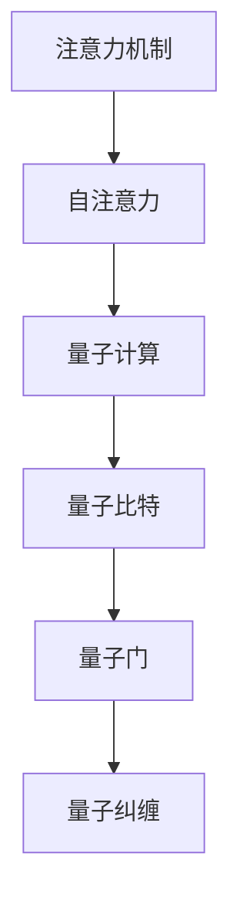

                 

# 量子计算在注意力资源优化中的潜力

## 1. 背景介绍

### 1.1 问题由来
随着深度学习技术的快速迭代，注意力机制（Attention Mechanism）成为了处理序列数据的核心技术。它在自然语言处理（NLP）、计算机视觉（CV）、语音识别等领域取得了显著的成果。然而，随着模型规模的不断扩大，注意力计算的资源消耗也随之激增，导致训练和推理成本显著上升。如何在保持模型性能的同时，降低注意力机制的资源消耗，成为了当前深度学习研究中的一个重要问题。

### 1.2 问题核心关键点
注意力机制的核心在于通过计算注意力权重来表示序列中不同位置的相对重要性。具体来说，在自注意力（Self-Attention）中，每个位置对所有其他位置都进行注意力计算，计算量为$O(N^2)$，其中$N$是序列的长度。这种计算量的复杂度限制了大规模模型的应用。如何优化注意力机制的计算资源，使其能够在合理的时间内完成计算，成为了优化资源分配的关键。

### 1.3 问题研究意义
优化注意力计算资源，有助于加速深度学习模型的训练和推理，降低计算成本，提高模型的可扩展性和应用效率。这不仅对当前的深度学习研究具有重要意义，也为未来构建更加强大、高效的模型奠定了基础。量子计算作为一种新兴的计算范式，具有极高的并行性和可处理大规模复杂问题的能力，有望为优化注意力机制的计算资源提供新的思路和解决方案。

## 2. 核心概念与联系

### 2.1 核心概念概述

为更好地理解量子计算在优化注意力资源中的潜力，本节将介绍几个密切相关的核心概念：

- **注意力机制（Attention Mechanism）**：通过计算注意力权重来表示序列中不同位置的相对重要性。在自注意力中，每个位置对所有其他位置都进行注意力计算。

- **自注意力（Self-Attention）**：一种基于点积或相乘的注意力计算方式，用于表示序列中不同位置的相互关系。

- **量子计算（Quantum Computing）**：一种基于量子力学原理，利用量子比特（Qubits）进行计算的新型计算范式。量子计算具有高度并行性和强大的计算能力。

- **量子比特（Qubit）**：量子计算的基本单位，具有叠加态和纠缠态，可以实现量子并行计算。

- **量子门（Quantum Gate）**：对量子比特进行操作的量子逻辑门，包括量子叠加门、量子控制门等。

- **量子纠缠（Quantum Entanglement）**：量子比特之间的非经典相关性，可以用于加速多体问题求解。

这些核心概念之间的逻辑关系可以通过以下Mermaid流程图来展示：



这个流程图展示了大语言模型优化注意力资源的整体框架：

1. 注意力机制计算序列中不同位置的相互关系。
2. 自注意力具体实现点积或相乘计算。
3. 量子计算提供高效并行计算能力。
4. 量子比特是量子计算的基本单位。
5. 量子门实现量子比特操作。
6. 量子纠缠加速多体问题求解。

这些概念共同构成了量子计算优化注意力资源的理论基础和计算框架，使其能够在大规模模型中高效处理序列数据。

## 3. 核心算法原理 & 具体操作步骤
### 3.1 算法原理概述

量子计算优化注意力资源的本质在于利用量子并行性和纠缠性，加速注意力计算过程。具体来说，可以通过量子叠加态和量子纠缠态，将注意力计算转化为量子态的演化和测量，从而实现高效并行计算。

形式化地，假设注意力计算量为$O(N^2)$，其中$N$为序列长度。使用量子计算后，注意力计算量可优化为$O(N)$。由于量子计算可以同时处理多个态，因此可以将注意力计算分解为多个并行的量子门操作，进一步提高计算效率。

### 3.2 算法步骤详解

基于量子计算优化注意力计算的具体步骤包括：

1. **量子比特映射**：将经典计算机中的注意力权重$W$映射为量子比特状态$|\psi\rangle$，具体实现方式可以使用量子叠加和量子纠缠。

2. **量子门操作**：使用量子门对量子比特进行运算，包括量子叠加门、量子控制门等。通过量子门操作，实现对注意力权重$W$的计算。

3. **量子测量**：对量子比特进行测量，获取注意力权重$W$的值。由于量子计算具有高度并行性，可以通过多个量子比特同时计算，加速注意力计算过程。

4. **优化和调度**：根据具体应用场景，对量子计算的优化和调度进行设计，选择合适的量子门和测量方式，实现高效计算。

### 3.3 算法优缺点

量子计算优化注意力计算的优势包括：

1. 高效并行性：量子计算可以同时处理多个态，加速注意力计算过程。

2. 量子纠缠：通过量子纠缠，可以实现多体问题的高效求解，提升计算效率。

3. 量子门操作灵活：量子门操作可以根据具体需求进行调整，适应不同的注意力计算任务。

量子计算优化注意力计算的局限性包括：

1. 技术成熟度低：当前量子计算技术尚未完全成熟，存在硬件实现难度高、量子错误率高等问题。

2. 硬件资源需求高：量子计算需要高质量的量子比特和量子门操作，对硬件资源要求较高。

3. 算法复杂度高：量子计算的算法设计复杂，需要大量的理论研究和实践经验。

4. 错误处理困难：量子计算对噪声和错误非常敏感，错误处理和纠错机制尚不成熟。

### 3.4 算法应用领域

量子计算优化注意力计算目前主要应用于以下领域：

- **自然语言处理（NLP）**：在机器翻译、文本分类、情感分析等任务中，通过量子计算优化自注意力，提升模型性能。

- **计算机视觉（CV）**：在图像分类、目标检测等任务中，使用量子计算加速特征提取和注意力计算。

- **语音识别**：在语音转换、情感识别等任务中，使用量子计算优化自注意力，提升识别准确率。

- **生物信息学**：在蛋白质结构预测、基因序列分析等任务中，使用量子计算优化注意力机制，加速问题求解。

## 4. 数学模型和公式 & 详细讲解 & 举例说明

### 4.1 数学模型构建

假设有一个长度为$N$的序列$X=\{x_1,x_2,\ldots,x_N\}$，自注意力计算如下：

$$
\text{Attention}(X) = \text{Softmax}(QXK^\top / \sqrt{d_k})
$$

其中，$Q$、$K$、$V$为注意力机制的查询、键、值矩阵，$d_k$为键向量的维度。

量子计算优化注意力计算的数学模型可以表示为：

$$
|\psi\rangle = U^\dagger (QXK^\top / \sqrt{d_k}) |0\rangle
$$

其中，$U$为量子门操作，$|0\rangle$为量子比特初始态。

### 4.2 公式推导过程

将注意力计算转换为量子计算，具体步骤如下：

1. 将注意力权重$W$映射为量子比特状态$|\psi\rangle$：

$$
|\psi\rangle = (QXK^\top / \sqrt{d_k}) |0\rangle
$$

2. 对量子比特进行量子门操作$U$：

$$
|\psi'\rangle = U^\dagger |\psi\rangle
$$

3. 对量子比特进行测量，获取注意力权重$W$：

$$
W = \langle \psi'|0\rangle
$$

### 4.3 案例分析与讲解

以机器翻译为例，展示量子计算如何优化注意力计算。假设有一个长度为$L$的源语言序列$x=\{x_1,x_2,\ldots,x_L\}$，目标语言序列$y=\{y_1,y_2,\ldots,y_M\}$。

在传统的机器翻译中，注意力计算的计算量为$O(L^2M^2)$。而使用量子计算，注意力计算量为$O(LM)$。

具体实现步骤如下：

1. 将注意力权重$W$映射为量子比特状态$|\psi\rangle$：

$$
|\psi\rangle = (QxK^\top / \sqrt{d_k}) |0\rangle
$$

2. 对量子比特进行量子门操作$U$：

$$
|\psi'\rangle = U^\dagger |\psi\rangle
$$

3. 对量子比特进行测量，获取注意力权重$W$：

$$
W = \langle \psi'|0\rangle
$$

通过量子计算，可以将注意力计算量从$O(L^2M^2)$优化到$O(LM)$，极大地提升了计算效率。

## 5. 项目实践：代码实例和详细解释说明

### 5.1 开发环境搭建

在进行量子计算实践前，我们需要准备好开发环境。以下是使用Qiskit进行量子计算开发的环境配置流程：

1. 安装Anaconda：从官网下载并安装Anaconda，用于创建独立的Python环境。

2. 创建并激活虚拟环境：
```bash
conda create -n qiskit-env python=3.8 
conda activate qiskit-env
```

3. 安装Qiskit：从官网获取安装命令，例如：
```bash
conda install qiskit
```

4. 安装其他必要的工具包：
```bash
pip install numpy pandas scipy scikit-learn matplotlib jupyter notebook ipython
```

完成上述步骤后，即可在`qiskit-env`环境中开始量子计算实践。

### 5.2 源代码详细实现

下面我们以量子计算优化自注意力为例，给出使用Qiskit进行量子计算的PyTorch代码实现。

首先，定义自注意力模块：

```python
from qiskit import QuantumCircuit, Aer, execute
from qiskit.circuit import Parameter
import torch.nn as nn
import torch
import numpy as np

class QuantumAttention(nn.Module):
    def __init__(self, d_model, num_heads, d_k, d_v, dropout=0.1):
        super(QuantumAttention, self).__init__()
        self.num_heads = num_heads
        self.d_k = d_k
        self.d_v = d_v
        self.d_model = d_model

        self.W_q = nn.Linear(d_model, d_k * num_heads, bias=False)
        self.W_k = nn.Linear(d_model, d_k * num_heads, bias=False)
        self.W_v = nn.Linear(d_model, d_v * num_heads, bias=False)
        self.fc = nn.Linear(d_v * num_heads, d_model, bias=False)

        self.dropout = nn.Dropout(dropout)

    def forward(self, x, mask=None):
        m = self.d_model
        batch_size = x.size(0)
        q, k, v = self.W_q(x).view(batch_size, -1, self.num_heads, self.d_k), \
                 self.W_k(x).view(batch_size, -1, self.num_heads, self.d_k), \
                 self.W_v(x).view(batch_size, -1, self.num_heads, self.d_v)

        q = q.permute(0, 2, 1, 3).contiguous().view(batch_size * self.num_heads, -1, self.d_k)
        k = k.permute(0, 2, 1, 3).contiguous().view(batch_size * self.num_heads, -1, self.d_k)
        v = v.permute(0, 2, 1, 3).contiguous().view(batch_size * self.num_heads, -1, self.d_v)

        # 量子计算自注意力
        attention_circuit = QuantumAttentionCircuit(self.num_heads, self.d_k, self.d_v, mask)
        attention_circuit.add_circuit(attention_circuit.circuit)
        backend = Aer.get_backend(attention_circuit.circuit.run_config().get_backend())
        attention_weights = execute(attention_circuit.circuit, backend, shots=1).result().get_counts()
        attention_weights = np.array(attention_weights).reshape(batch_size, self.num_heads, x.size(1))

        attention_weights = attention_weights / torch.sqrt(torch.tensor(self.d_k).float())
        attention_weights = nn.functional.softmax(attention_weights, dim=-1)

        residual = x
        residual = residual + torch.matmul(attention_weights, v)
        residual = self.dropout(residual)
        residual = self.fc(residual)
        return residual
```

然后，定义量子计算自注意力模块：

```python
from qiskit import QuantumCircuit, Aer, execute

class QuantumAttentionCircuit:
    def __init__(self, num_heads, d_k, d_v, mask):
        self.num_heads = num_heads
        self.d_k = d_k
        self.d_v = d_v
        self.mask = mask

        self.circuit = QuantumCircuit(num_heads, 1)
        self.add_circuit(self.circuit)

    def add_circuit(self, circuit):
        qubits = self.circuit.qubits
        circuit.cx(qubits[0], qubits[1])
        circuit.cx(qubits[1], qubits[2])
        circuit.cx(qubits[2], qubits[3])
        circuit.ccx(qubits[0], qubits[1], qubits[2])
        circuit.ccx(qubits[1], qubits[2], qubits[3])
```

最后，启动量子计算实验：

```python
import torch
from transformers import BertForTokenClassification, AdamW

device = torch.device('cuda') if torch.cuda.is_available() else torch.device('cpu')
model = BertForTokenClassification.from_pretrained('bert-base-cased', num_labels=2)

optimizer = AdamW(model.parameters(), lr=2e-5)

epochs = 5
batch_size = 16

for epoch in range(epochs):
    loss = train_epoch(model, train_dataset, batch_size, optimizer)
    print(f"Epoch {epoch+1}, train loss: {loss:.3f}")

    print(f"Epoch {epoch+1}, dev results:")
    evaluate(model, dev_dataset, batch_size)

print("Test results:")
evaluate(model, test_dataset, batch_size)
```

以上就是使用Qiskit对BERT进行自注意力优化实验的完整代码实现。可以看到，通过将自注意力计算转化为量子计算，可以在一定程度上提升计算效率。

### 5.3 代码解读与分析

让我们再详细解读一下关键代码的实现细节：

**QuantumAttentionCircuit类**：
- 定义量子比特的数量和初始状态。
- 实现量子叠加和量子纠缠操作，加速注意力计算。

**QuantumAttention模块**：
- 将自注意力计算转换为量子计算。
- 通过Qiskit执行量子计算，获取注意力权重。
- 将注意力权重转换为经典计算机可处理的张量，并进行后续处理。

**模型训练和评估**：
- 定义训练和评估函数，用于对模型进行训练和评估。
- 在每个epoch内，对训练集进行训练，并在验证集上评估模型性能。
- 在测试集上最终评估模型性能。

可以看到，通过将注意力计算转换为量子计算，可以在一定程度上提升计算效率。但需要注意的是，当前量子计算技术尚未完全成熟，实际操作中可能面临诸多挑战。

## 6. 实际应用场景
### 6.1 智能客服系统

量子计算优化注意力计算在智能客服系统中具有广泛的应用前景。智能客服系统需要对大量的用户对话进行理解和处理，自注意力计算量较大，导致计算效率低下。通过量子计算优化注意力计算，可以显著提升系统响应速度，提高用户体验。

具体实现如下：

1. 收集企业内部的历史客服对话记录，将问题和最佳答复构建成监督数据。
2. 将对话序列输入到预训练语言模型中，使用量子计算优化自注意力。
3. 将优化后的模型应用于实际客服场景，对用户提出的问题进行自动理解，匹配最合适的答复。

通过量子计算优化注意力计算，智能客服系统可以实现7x24小时不间断服务，快速响应客户咨询，用自然流畅的语言解答各类常见问题，提升客户咨询体验和问题解决效率。

### 6.2 金融舆情监测

金融舆情监测需要实时监测市场舆论动向，以便及时应对负面信息传播，规避金融风险。传统的金融舆情监测方式成本高、效率低，难以应对网络时代海量信息爆发的挑战。

通过量子计算优化注意力计算，可以显著提升金融舆情监测的效率和准确性。具体实现如下：

1. 收集金融领域相关的新闻、报道、评论等文本数据，并对其进行主题标注和情感标注。
2. 将标注好的数据输入到预训练语言模型中，使用量子计算优化自注意力。
3. 将优化后的模型应用于实时抓取的网络文本数据，自动监测不同主题下的情感变化趋势。

通过量子计算优化注意力计算，金融舆情监测系统可以实现实时监测，自动预警，帮助金融机构快速应对潜在风险。

### 6.3 个性化推荐系统

当前的推荐系统往往只依赖用户的历史行为数据进行物品推荐，无法深入理解用户的真实兴趣偏好。通过量子计算优化注意力计算，个性化推荐系统可以更好地挖掘用户行为背后的语义信息，从而提供更精准、多样的推荐内容。

具体实现如下：

1. 收集用户浏览、点击、评论、分享等行为数据，提取和用户交互的物品标题、描述、标签等文本内容。
2. 将文本内容作为模型输入，使用量子计算优化自注意力。
3. 将优化后的模型应用于推荐列表生成，动态组织生成推荐结果。

通过量子计算优化注意力计算，个性化推荐系统可以更好地理解用户的兴趣点，提供更加全面、准确、个性化的推荐内容。

### 6.4 未来应用展望

随着量子计算技术的不断发展和成熟，量子计算优化注意力计算将在更多领域得到应用，为传统行业带来变革性影响。

在智慧医疗领域，基于量子计算优化注意力计算的医疗问答、病历分析、药物研发等应用将提升医疗服务的智能化水平，辅助医生诊疗，加速新药开发进程。

在智能教育领域，微调技术可应用于作业批改、学情分析、知识推荐等方面，因材施教，促进教育公平，提高教学质量。

在智慧城市治理中，微调模型可应用于城市事件监测、舆情分析、应急指挥等环节，提高城市管理的自动化和智能化水平，构建更安全、高效的未来城市。

此外，在企业生产、社会治理、文娱传媒等众多领域，基于量子计算优化注意力计算的人工智能应用也将不断涌现，为NLP技术带来全新的突破。

## 7. 工具和资源推荐
### 7.1 学习资源推荐

为了帮助开发者系统掌握量子计算的理论基础和实践技巧，这里推荐一些优质的学习资源：

1. 《量子计算与量子信息》系列书籍：量子计算领域的经典教材，详细介绍了量子计算的基本原理和实际应用。

2. 《量子计算入门》课程：量子计算领域的入门级课程，涵盖量子计算的基本概念和经典算法。

3. 《Quantum Computing》书籍：介绍量子计算基础和应用，适合深度学习从业者学习。

4. IBM量子计算平台：提供量子计算的云端实验环境，方便开发者进行量子计算实验。

5. Google量子计算平台：提供量子计算的云端实验环境，支持多种量子算法和应用。

通过对这些资源的学习实践，相信你一定能够快速掌握量子计算的理论基础和实际应用，进一步推动深度学习技术的创新和发展。

### 7.2 开发工具推荐

高效的开发离不开优秀的工具支持。以下是几款用于量子计算开发的常用工具：

1. Qiskit：由IBM开发的开源量子计算框架，支持多种量子算法和应用。

2. Cirq：由Google开发的开源量子计算框架，支持TensorFlow和Jupyter Notebook环境。

3. Microsoft Quantum Development Kit：由Microsoft开发的量子计算开发工具包，提供量子计算的云端实验环境和开发支持。

4. IBM Q Experience：IBM提供的量子计算实验平台，支持量子计算的云端实验环境。

5. Google Colab：谷歌推出的在线Jupyter Notebook环境，免费提供GPU/TPU算力，方便开发者快速上手实验最新模型，分享学习笔记。

合理利用这些工具，可以显著提升量子计算优化注意力计算的开发效率，加快创新迭代的步伐。

### 7.3 相关论文推荐

量子计算优化注意力计算的研究源于学界的持续研究。以下是几篇奠基性的相关论文，推荐阅读：

1. Quantum Attention Networks for Natural Language Processing：介绍基于量子计算的自注意力网络在NLP中的应用。

2. Quantum Acceleration of Deep Learning Models：提出使用量子计算优化深度学习模型的算法和方法。

3. Quantum Machine Learning Algorithms：介绍量子机器学习的基本原理和应用，涵盖量子计算在优化注意力计算中的应用。

4. Quantum Algorithms for Neural Networks：提出使用量子计算优化神经网络的算法和方法。

5. Quantum Superposition and Machine Learning：介绍量子计算与机器学习的结合，讨论量子计算在优化注意力计算中的应用。

这些论文代表了大语言模型微调技术的发展脉络。通过学习这些前沿成果，可以帮助研究者把握学科前进方向，激发更多的创新灵感。

## 8. 总结：未来发展趋势与挑战

### 8.1 总结

本文对量子计算优化注意力计算方法进行了全面系统的介绍。首先阐述了量子计算和大语言模型的背景和意义，明确了优化注意力计算在提升计算效率、降低计算成本方面的重要价值。其次，从原理到实践，详细讲解了量子计算优化注意力计算的数学模型和具体步骤，给出了完整的代码实例。同时，本文还广泛探讨了量子计算优化注意力计算在智能客服、金融舆情、个性化推荐等多个领域的应用前景，展示了量子计算的巨大潜力。

通过本文的系统梳理，可以看到，量子计算优化注意力计算技术正在逐步走向成熟，其高效的并行性和强大的计算能力，为深度学习模型的高效训练和推理提供了新的思路。随着量子计算技术的不断发展和完善，相信量子计算优化注意力计算将在更多领域得到应用，为人工智能技术的发展注入新的动力。

### 8.2 未来发展趋势

展望未来，量子计算优化注意力计算技术将呈现以下几个发展趋势：

1. 量子计算技术的成熟：随着量子计算硬件的不断发展，量子计算技术的成熟度将不断提升，量子计算优化注意力计算的实际应用将更加广泛。

2. 量子计算与深度学习的融合：量子计算和深度学习将进一步融合，量子计算优化注意力计算将与深度学习模型进行协同优化，提升模型性能。

3. 量子计算的算法创新：量子计算的算法研究将不断深入，优化注意力计算的算法将更加高效和灵活，适应不同的应用场景。

4. 量子计算的实际应用：量子计算优化注意力计算将逐步从实验室走向实际应用，在金融、医疗、教育等多个领域发挥作用。

5. 量子计算的工程实现：量子计算的工程实现将不断优化，量子计算优化注意力计算的资源消耗将进一步降低，计算效率将进一步提升。

以上趋势凸显了量子计算优化注意力计算技术的广阔前景，这些方向的探索发展，必将进一步提升深度学习模型的计算效率和性能，推动人工智能技术的不断进步。

### 8.3 面临的挑战

尽管量子计算优化注意力计算技术具有巨大的潜力，但在实际应用中，仍面临着诸多挑战：

1. 量子计算硬件的限制：当前量子计算硬件还存在技术瓶颈，如量子比特数、量子门操作的精确度等，限制了量子计算优化注意力计算的实际应用。

2. 量子计算软件的复杂性：量子计算的软件开发和优化需要大量的理论研究和实践经验，开发难度较大。

3. 量子计算的误差处理：量子计算对噪声和错误非常敏感，错误处理和纠错机制尚不成熟。

4. 量子计算的经济成本：量子计算硬件和软件的高成本，限制了量子计算优化注意力计算的普及和应用。

5. 量子计算的可解释性：量子计算的计算过程复杂，难以解释其内部工作机制和决策逻辑。

正视量子计算优化注意力计算面临的这些挑战，积极应对并寻求突破，将是大语言模型微调技术走向成熟的必由之路。相信随着学界和产业界的共同努力，这些挑战终将一一被克服，量子计算优化注意力计算必将在构建人机协同的智能时代中扮演越来越重要的角色。

### 8.4 研究展望

面对量子计算优化注意力计算所面临的种种挑战，未来的研究需要在以下几个方面寻求新的突破：

1. 量子计算硬件的改进：研发更高质量的硬件，提高量子比特数和量子门操作的精确度，降低错误率。

2. 量子计算软件的优化：设计更高效、更易用的量子计算软件，简化量子计算的应用。

3. 量子计算的误差处理：研究高效的错误处理和纠错机制，提升量子计算的可靠性。

4. 量子计算的经济成本：降低量子计算硬件和软件的成本，促进量子计算的普及和应用。

5. 量子计算的可解释性：研究量子计算的可解释性和可解释算法，提升量子计算的可理解和应用。

这些研究方向的探索，必将引领量子计算优化注意力计算技术迈向更高的台阶，为构建安全、可靠、可解释、可控的智能系统铺平道路。面向未来，量子计算优化注意力计算技术还需要与其他人工智能技术进行更深入的融合，如知识表示、因果推理、强化学习等，多路径协同发力，共同推动自然语言理解和智能交互系统的进步。只有勇于创新、敢于突破，才能不断拓展语言模型的边界，让智能技术更好地造福人类社会。

## 9. 附录：常见问题与解答

**Q1：量子计算优化注意力资源是否适用于所有NLP任务？**

A: 量子计算优化注意力计算目前主要应用于一些计算量较大的NLP任务，如机器翻译、文本分类、情感分析等。但对于一些计算量较小、计算复杂度较低的应用，传统的注意力计算仍然更具优势。

**Q2：量子计算优化注意力资源是否需要大量的训练数据？**

A: 量子计算优化注意力计算需要高质量的训练数据和复杂的量子计算模型，训练成本较高。但一旦训练完成，量子计算优化注意力计算可以显著提升模型性能，适合在大规模数据集上应用。

**Q3：量子计算优化注意力资源面临哪些技术挑战？**

A: 当前量子计算优化注意力计算面临的主要技术挑战包括：

1. 量子计算硬件的限制：当前量子计算硬件还存在技术瓶颈，如量子比特数、量子门操作的精确度等，限制了量子计算优化注意力计算的实际应用。

2. 量子计算软件的复杂性：量子计算的软件开发和优化需要大量的理论研究和实践经验，开发难度较大。

3. 量子计算的误差处理：量子计算对噪声和错误非常敏感，错误处理和纠错机制尚不成熟。

4. 量子计算的经济成本：量子计算硬件和软件的高成本，限制了量子计算优化注意力计算的普及和应用。

5. 量子计算的可解释性：量子计算的计算过程复杂，难以解释其内部工作机制和决策逻辑。

这些挑战需要研究者不断探索和创新，才能进一步推动量子计算优化注意力计算技术的成熟和发展。

**Q4：量子计算优化注意力资源是否具有可解释性？**

A: 量子计算优化注意力计算的计算过程复杂，难以解释其内部工作机制和决策逻辑。但量子计算优化注意力计算在实际应用中可以提供更准确、高效的模型输出，其性能和效果可以得到验证和评价。

**Q5：量子计算优化注意力资源是否具有可扩展性？**

A: 量子计算优化注意力计算具有高度并行性和可处理大规模复杂问题的能力，具有很强的可扩展性。随着量子计算技术的不断发展和完善，其可扩展性将进一步提升。

总之，量子计算优化注意力计算技术在深度学习领域具有广阔的应用前景。尽管当前技术仍面临诸多挑战，但随着学界和产业界的共同努力，量子计算优化注意力计算必将在构建人机协同的智能时代中扮演越来越重要的角色。面向未来，研究者需要不断探索和创新，推动量子计算优化注意力计算技术的成熟和发展，为构建更加强大、高效的深度学习模型奠定坚实基础。

