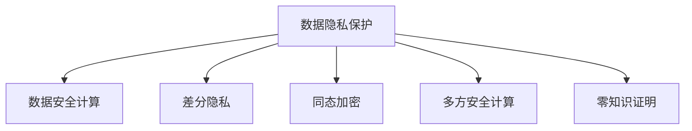

                 

# 隐私与安全：保护人类计算中的敏感信息

在信息化时代，计算技术的普及极大地提升了人们的生活质量和工作效率，但同时也带来了严峻的隐私安全挑战。如何在保障信息安全的同时，保护用户的隐私，成为技术研究的重要课题。本文将系统探讨隐私保护与安全计算的关键概念、算法原理及应用实践，提出一整套从数据采集、传输、存储到处理的隐私保护方案，并展望未来的研究方向和挑战。

## 1. 背景介绍

### 1.1 问题由来
随着云计算和大数据技术的飞速发展，越来越多的数据被收集、存储和处理。然而，数据的广泛使用也带来了隐私泄露、数据滥用等风险。用户对隐私的关注度不断提升，如何保障数据在计算过程中的安全性和隐私性，成为了一个备受关注的问题。

### 1.2 问题核心关键点
隐私保护和安全计算的核心在于如何在数据共享、计算和分析过程中，保障数据的机密性、完整性和可用性。隐私保护技术的核心在于如何实现对敏感信息的保护，避免数据被未授权访问或使用。而安全计算则更关注于如何构建安全的计算环境，使得数据能够在不被破坏的前提下进行传输和处理。

## 2. 核心概念与联系

### 2.1 核心概念概述
本节将介绍几个密切相关的核心概念：

- **数据隐私保护**：指在数据收集、存储、传输和处理等过程中，保障数据不被未经授权的访问和使用的技术手段。隐私保护技术通常包括数据加密、匿名化、差分隐私等方法。

- **数据安全计算**：指在数据处理和分析过程中，通过安全计算技术，保障数据在计算过程中的机密性和完整性。安全计算技术通常包括多方安全计算、同态加密、零知识证明等。

- **差分隐私**：指在数据集中的个体隐私信息无法被单独识别的前提下，对数据进行统计分析和挖掘的技术。差分隐私通过向数据中引入噪声，保护个体隐私的同时，仍能保留数据的统计特性。

- **同态加密**：指在加密数据上直接进行计算，结果解密后与直接在明文数据上计算结果一致的技术。同态加密可以使得数据在加密状态下进行处理，保护数据的机密性。

- **多方安全计算**：指多个参与者在不共享任何数据的前提下，共同完成计算任务的技术。多方安全计算保障了数据的安全性，同时实现了计算的协作性。

- **零知识证明**：指在不泄露任何信息的前提下，证明某个陈述为真的技术。零知识证明常用于隐私计算场景，如在不泄露用户信息的前提下验证用户身份。

这些核心概念之间的逻辑关系可以通过以下Mermaid流程图来展示：



这个流程图展示了隐私保护与安全计算的关键概念及其之间的关系：

1. 数据隐私保护是整个数据安全的基础，通过多种技术手段，确保数据的机密性和完整性。
2. 数据安全计算在隐私保护的基础上，通过安全的计算方法，保障数据在处理过程中的安全性。
3. 差分隐私、同态加密、多方安全计算、零知识证明等技术，都是隐私保护和安全计算的具体实现方式。

这些概念共同构成了数据隐私保护与安全计算的理论框架，为其在实际应用中的实现提供了坚实的基础。

## 3. 核心算法原理 & 具体操作步骤
### 3.1 算法原理概述

隐私保护和安全计算的算法原理主要集中在以下几个方面：

- **数据加密**：通过加密技术，将敏感数据转换为密文形式，保障数据在传输和存储过程中的机密性。

- **差分隐私**：通过向数据中添加噪声，保护个体隐私的同时，保留数据的统计特性，从而在分析过程中保护用户隐私。

- **同态加密**：在加密数据上直接进行计算，保护数据机密性的同时，使得计算结果解密后与明文计算结果一致。

- **多方安全计算**：多个参与者在不共享任何数据的前提下，共同完成计算任务，确保数据安全性同时实现计算协作。

- **零知识证明**：在不泄露任何信息的前提下，证明某个陈述为真，保障隐私的同时，实现验证功能。

### 3.2 算法步骤详解

以下我们将详细介绍隐私保护和安全计算中常用的几种算法步骤：

**差分隐私算法**：

1. **输入数据预处理**：对原始数据进行预处理，消除敏感信息。
2. **噪声引入**：向数据集中引入随机噪声，确保个体隐私无法被识别。
3. **数据统计分析**：在加入噪声后的数据集上进行统计分析和挖掘。
4. **结果解密**：将分析结果解密，得到最终结果。

**同态加密算法**：

1. **数据加密**：将原始数据进行加密，生成密文。
2. **加密计算**：在密文上进行计算，得到加密后的结果。
3. **结果解密**：将计算结果解密，得到最终结果。

**多方安全计算算法**：

1. **数据分割**：将原始数据进行分割，分配给不同参与者。
2. **计算协商**：参与者之间进行计算协商，确定计算方案。
3. **安全计算**：参与者在不共享数据的前提下，共同完成计算任务。
4. **结果汇总**：将各参与者的计算结果汇总，得到最终结果。

**零知识证明算法**：

1. **证明生成**：证明者生成证明，确保证明的正确性。
2. **证明验证**：验证者验证证明的有效性，判断是否为真。

### 3.3 算法优缺点

隐私保护和安全计算的算法各有优缺点：

**差分隐私**：

优点：
1. 提供了理论上的隐私保护保证。
2. 可以应用于各种统计分析任务。

缺点：
1. 引入的噪声可能影响分析结果的准确性。
2. 需要选择合适的噪声参数，确保隐私保护和分析结果之间的平衡。

**同态加密**：

优点：
1. 保障了数据的机密性。
2. 可以在加密状态下进行计算。

缺点：
1. 计算效率较低，难以处理大规模数据。
2. 加密和解密的计算开销较大。

**多方安全计算**：

优点：
1. 保障了数据的安全性。
2. 可以实现数据的分布式计算。

缺点：
1. 需要复杂的通信和计算协议。
2. 计算复杂度较高，难以处理复杂的计算任务。

**零知识证明**：

优点：
1. 保障了隐私性。
2. 可以在不泄露信息的情况下进行验证。

缺点：
1. 证明的生成和验证计算复杂度较高。
2. 适用范围较为局限，不适用于大规模数据验证。

### 3.4 算法应用领域

隐私保护和安全计算技术在多个领域得到了广泛应用：

- **金融行业**：金融机构在数据共享、交易记录保护等方面，需要隐私保护和安全计算技术，保障客户隐私同时实现数据安全。
- **医疗行业**：医疗机构在病人数据共享、隐私保护等方面，需要隐私保护和安全计算技术，保障患者隐私同时实现数据分析和医疗决策。
- **政府部门**：政府在数据共享、公民隐私保护等方面，需要隐私保护和安全计算技术，保障公民隐私同时实现数据共享和政策分析。
- **智能合约**：智能合约在执行和验证过程中，需要隐私保护和安全计算技术，保障交易隐私和合约安全性。
- **电子商务**：电子商务平台在用户数据保护、交易记录保护等方面，需要隐私保护和安全计算技术，保障用户隐私同时实现安全交易。

## 4. 数学模型和公式 & 详细讲解
### 4.1 数学模型构建

隐私保护和安全计算的核心数学模型包括以下几种：

- **差分隐私模型**：
  $$
  \epsilon-\text{DP} = \big\{\mathcal{D} \mid \forall x, y: |P_Q[x] - P_Q[y]| \leq \frac{\Delta}{\epsilon} \text{和} \Pr[Q(x) = y] \leq e^{\frac{\Delta}{\epsilon}}
  $$

- **同态加密模型**：
  $$
  E_k(m) \in \Sigma^* \rightarrow (\Sigma, \Sigma, e_k, d_k), \text{其中} E_k(m) = c \text{和} d_k(c) = m
  $$

- **多方安全计算模型**：
  $$
  P = \langle \Sigma^n, \Pi, \text{Comp}, \{B_k\}_{k=1}^n, \{\text{Inp}, \text{Comp}, \text{Out}\}
  $$

- **零知识证明模型**：
  $$
  \text{Prover} \rightarrow (\text{ZK}, \text{Prove}, \text{Verify}), \text{其中} \text{Prove}(ZK, w) \rightarrow (\text{Prover}, \text{Verifier})
  $$

### 4.2 公式推导过程

以下我们以差分隐私和同态加密为例，详细推导其数学模型和公式。

**差分隐私推导**：

$$
\epsilon-\text{DP} = \big\{\mathcal{D} \mid \forall x, y: |P_Q[x] - P_Q[y]| \leq \frac{\Delta}{\epsilon} \text{和} \Pr[Q(x) = y] \leq e^{\frac{\Delta}{\epsilon}}
$$

其中，$\epsilon$ 为隐私保护参数，$\Delta$ 为数据分布变化量，$P_Q$ 为查询结果概率分布。该公式表明，差分隐私要求查询结果的差异小于 $\frac{\Delta}{\epsilon}$，同时查询概率不能超过 $e^{\frac{\Delta}{\epsilon}}$。

**同态加密推导**：

$$
E_k(m) \in \Sigma^* \rightarrow (\Sigma, \Sigma, e_k, d_k), \text{其中} E_k(m) = c \text{和} d_k(c) = m
$$

其中，$\Sigma$ 为加密空间，$\Sigma^*$ 为解密空间，$e_k$ 为加密函数，$d_k$ 为解密函数，$m$ 为明文数据，$c$ 为密文数据。该公式表明，同态加密保证了在加密状态下，计算结果解密后与明文计算结果一致。

### 4.3 案例分析与讲解

**案例分析1：差分隐私在人口普查数据中的应用**

人口普查是各国政府进行人口统计和资源配置的重要手段，但在数据公布过程中，如果直接公布原始数据，可能泄露个人隐私信息。使用差分隐私可以保护个体隐私，同时统计出人口分布信息。

具体实现步骤如下：
1. 对原始人口普查数据进行预处理，去除敏感信息。
2. 向数据集中引入随机噪声，确保个体隐私无法被识别。
3. 在加入噪声后的数据集上进行统计分析，如人口分布、年龄分布等。
4. 将分析结果解密，得到最终结果。

**案例分析2：同态加密在医疗数据中的应用**

医疗数据涉及患者隐私，在使用过程中需要确保数据的安全性。同态加密可以在加密状态下进行计算，保护数据机密性的同时，使得计算结果解密后与明文计算结果一致。

具体实现步骤如下：
1. 将医疗数据进行加密，生成密文。
2. 在密文上进行计算，如数据分析、诊断等。
3. 将计算结果解密，得到最终结果。

## 5. 项目实践：代码实例和详细解释说明
### 5.1 开发环境搭建

在进行隐私保护和安全计算实践前，我们需要准备好开发环境。以下是使用Python进行PyTorch开发的环境配置流程：

1. 安装Anaconda：从官网下载并安装Anaconda，用于创建独立的Python环境。

2. 创建并激活虚拟环境：
```bash
conda create -n privacy-env python=3.8 
conda activate privacy-env
```

3. 安装PyTorch：根据CUDA版本，从官网获取对应的安装命令。例如：
```bash
conda install pytorch torchvision torchaudio cudatoolkit=11.1 -c pytorch -c conda-forge
```

4. 安装PySyft：一个用于安全计算的开源框架，支持差分隐私、同态加密、多方安全计算等技术。

```bash
pip install syft
```

5. 安装各类工具包：
```bash
pip install numpy pandas scikit-learn matplotlib tqdm jupyter notebook ipython
```

完成上述步骤后，即可在`privacy-env`环境中开始隐私保护和安全计算实践。

### 5.2 源代码详细实现

下面我们以差分隐私为例，给出使用PySyft进行差分隐私实践的PyTorch代码实现。

首先，定义差分隐私的参数：

```python
from syft import Privacy
from syft.settings import torch_library

library = torch_library()
privacy = Privacy(epsilon=1.0, delta=0.1)
```

然后，定义一个简单的统计分析函数：

```python
import torch
import torch.nn as nn
import torchvision
import torchvision.transforms as transforms

class MLP(nn.Module):
    def __init__(self, input_size, output_size):
        super(MLP, self).__init__()
        self.fc1 = nn.Linear(input_size, 64)
        self.fc2 = nn.Linear(64, 32)
        self.fc3 = nn.Linear(32, output_size)

    def forward(self, x):
        x = torch.relu(self.fc1(x))
        x = torch.relu(self.fc2(x))
        x = self.fc3(x)
        return x

model = MLP(10, 2)

# 使用差分隐私保护训练过程
with privacy.lock():
    loss_fn = nn.CrossEntropyLoss()
    optimizer = torch.optim.SGD(model.parameters(), lr=0.01)
    
    for epoch in range(10):
        for i, (x, y) in enumerate(train_loader):
            x = x.to(device)
            y = y.to(device)
            
            # 差分隐私保护
            with privacy.lock():
                output = model(x)
                loss = loss_fn(output, y)
                optimizer.zero_grad()
                loss.backward()
                optimizer.step()
```

最后，在验证集上评估模型的隐私保护效果：

```python
# 使用差分隐私保护评估过程
with privacy.lock():
    loss_fn = nn.CrossEntropyLoss()
    eval_loss = 0.0
    with torch.no_grad():
        for x, y in val_loader:
            x = x.to(device)
            y = y.to(device)
            
            output = model(x)
            eval_loss += loss_fn(output, y).item()
        
    print(f'Validation loss: {eval_loss / len(val_loader):.4f}')
```

以上就是使用PySyft进行差分隐私实践的完整代码实现。可以看到，通过简单的几行代码，我们便实现了差分隐私保护训练和评估的过程。

### 5.3 代码解读与分析

让我们再详细解读一下关键代码的实现细节：

**MLP模型**：
- `MLP` 类定义了一个简单的多层感知器模型，包含三个全连接层。

**隐私保护过程**：
- `with privacy.lock()` 语句：使用差分隐私保护锁，在保护范围内执行计算。
- `loss_fn = nn.CrossEntropyLoss()`：定义损失函数。
- `optimizer = torch.optim.SGD(model.parameters(), lr=0.01)`：定义优化器。
- `loss.backward()` 和 `optimizer.step()`：进行反向传播和参数更新。

**评估过程**：
- `with privacy.lock()` 语句：使用差分隐私保护锁，在保护范围内执行计算。
- `loss_fn = nn.CrossEntropyLoss()`：定义损失函数。
- `eval_loss += loss_fn(output, y).item()`：计算评估损失。

可以看出，差分隐私的实现主要通过`with privacy.lock()`语句，保护计算过程中的隐私信息，确保数据的安全性。

## 6. 实际应用场景
### 6.1 智能合约
智能合约在执行和验证过程中，需要隐私保护和安全计算技术，保障交易隐私和合约安全性。

具体应用场景包括：
1. 智能合约中涉及的各方数据需要保护隐私，避免数据泄露。
2. 智能合约的执行和验证过程需要保护各方数据的安全性，确保合约执行的正确性和公正性。

**案例分析**：
- 在智能合约中，各方需要共享的数据需要进行差分隐私处理，保护隐私信息。
- 在合约执行和验证过程中，各方需要利用同态加密进行计算，保护数据机密性。
- 通过多方安全计算，各参与者在不共享数据的情况下，共同验证合约执行结果，保障合约安全性。

### 6.2 医疗数据共享
医疗机构在病人数据共享、隐私保护等方面，需要隐私保护和安全计算技术，保障患者隐私同时实现数据分析和医疗决策。

具体应用场景包括：
1. 医院需要共享病人的诊断信息，用于医学研究、疾病预测等。
2. 在共享过程中，需要保护患者的隐私信息，避免数据滥用。

**案例分析**：
- 医院可以使用差分隐私保护共享病人数据，保护患者隐私。
- 在使用共享数据进行医疗决策时，可以通过同态加密保护数据机密性，避免数据泄露。
- 通过多方安全计算，医院和研究机构共同分析数据，提升医疗决策的准确性和效率。

### 6.3 金融数据保护
金融机构在数据共享、交易记录保护等方面，需要隐私保护和安全计算技术，保障客户隐私同时实现数据安全。

具体应用场景包括：
1. 金融机构需要共享客户交易记录，用于风险评估、客户分析等。
2. 在共享过程中，需要保护客户的隐私信息，避免数据滥用。

**案例分析**：
- 金融机构可以使用差分隐私保护共享客户数据，保护客户隐私。
- 在使用共享数据进行风险评估时，可以通过同态加密保护数据机密性，避免数据泄露。
- 通过多方安全计算，金融机构和监管机构共同分析数据，提升风险评估的准确性和效率。

### 6.4 未来应用展望

随着隐私保护和安全计算技术的不断发展，未来将在更多领域得到应用，为社会带来新的变革：

1. **智能城市**：智能城市中，数据共享和协同计算是关键，隐私保护和安全计算技术将保障数据的安全性和隐私性，提升城市管理的智能化水平。
2. **数字政府**：数字政府中，数据共享和开放是基础，隐私保护和安全计算技术将保障数据的机密性和完整性，提升政府决策的透明性和公正性。
3. **智慧医疗**：智慧医疗中，数据共享和分析是重要环节，隐私保护和安全计算技术将保障患者隐私和数据安全，提升医疗服务的质量和效率。
4. **数字金融**：数字金融中，数据共享和交易是核心，隐私保护和安全计算技术将保障客户隐私和数据安全，提升金融服务的可信度和安全性。
5. **智能制造**：智能制造中，数据共享和协同计算是关键，隐私保护和安全计算技术将保障数据的机密性和完整性，提升制造过程的智能化水平。

## 7. 工具和资源推荐
### 7.1 学习资源推荐

为了帮助开发者系统掌握隐私保护和安全计算的理论基础和实践技巧，这里推荐一些优质的学习资源：

1. **《隐私保护与数据安全》系列课程**：由顶尖大学和机构提供的隐私保护和安全计算课程，涵盖了差分隐私、同态加密、多方安全计算等核心概念。

2. **《隐私保护技术》书籍**：详细介绍了隐私保护技术的基本原理和应用场景，是隐私保护领域的重要参考书。

3. **《安全计算技术》课程**：介绍了同态加密、多方安全计算等安全计算技术的原理和实现方法，是安全计算领域的重要学习资源。

4. **《数据隐私保护与法律合规》课程**：结合法律和技术，介绍了数据隐私保护的基本原则和合规要求，适用于隐私保护领域的学习者和从业者。

5. **《智能合约技术》课程**：介绍了智能合约的基本原理和隐私保护技术，适用于智能合约领域的学习者和开发者。

通过学习这些资源，相信你一定能够系统掌握隐私保护和安全计算的理论基础和实践技巧，为未来的应用实践提供坚实的基础。

### 7.2 开发工具推荐

高效的开发离不开优秀的工具支持。以下是几款用于隐私保护和安全计算开发的常用工具：

1. **PySyft**：一个用于安全计算的开源框架，支持差分隐私、同态加密、多方安全计算等技术，提供丰富的API和工具支持。

2. **TensorFlow Privacy**：基于TensorFlow的隐私保护库，提供了差分隐私、安全差分隐私等技术支持，适用于大规模数据集的隐私保护。

3. **Clio**：一个用于多方安全计算的开源工具，支持多方安全计算的核心技术，提供了丰富的API和工具支持。

4. **SPlint**：一个用于同态加密的开源工具，支持同态加密的核心技术，提供了丰富的API和工具支持。

5. **Zcash**：一个采用零知识证明的加密货币，适用于金融领域的数据隐私保护和安全计算。

合理利用这些工具，可以显著提升隐私保护和安全计算的开发效率，加快创新迭代的步伐。

### 7.3 相关论文推荐

隐私保护和安全计算的研究始于学术界，经过多年的发展，已成为计算机科学的重要分支。以下是几篇奠基性的相关论文，推荐阅读：

1. **《Differential Privacy》**：Dwork等人提出的差分隐私算法，奠定了差分隐私理论的基础。

2. **《Fully Homomorphic Encryption》**：Gentry等人提出的同态加密算法，开创了同态加密技术的新纪元。

3. **《Secure Computation》**：Yao等人提出的多方安全计算算法，奠定了多方安全计算理论的基础。

4. **《ZK-Proofs in the Common Reference String Model》**：Sahai和Waters提出的零知识证明算法，为零知识证明技术提供了基础。

5. **《Practical Secure Two-Party Computation》**：Damgård和Poupard提出的安全计算算法，为实际应用提供了实用的指导。

这些论文代表了隐私保护和安全计算的发展脉络。通过学习这些前沿成果，可以帮助研究者把握学科前进方向，激发更多的创新灵感。

## 8. 总结：未来发展趋势与挑战
### 8.1 总结

本文对隐私保护和安全计算的关键概念、算法原理及应用实践进行了全面系统的介绍。首先阐述了隐私保护和安全计算的研究背景和意义，明确了其在保障数据安全和隐私保护方面的独特价值。其次，从原理到实践，详细讲解了隐私保护和安全计算的数学模型和核心算法，给出了隐私保护和安全计算任务开发的完整代码实例。同时，本文还广泛探讨了隐私保护和安全计算在智能合约、医疗数据共享、金融数据保护等实际应用场景中的应用，展示了其在各领域的广泛应用前景。

通过本文的系统梳理，可以看到，隐私保护和安全计算技术在保障数据安全和隐私保护方面具有重要的理论和实践意义。未来，随着隐私保护和安全计算技术的不断发展，其在数据共享、计算协同、隐私保护等领域的应用将更加广泛，为社会带来深远的影响。

### 8.2 未来发展趋势

展望未来，隐私保护和安全计算技术将呈现以下几个发展趋势：

1. **隐私保护算法的多样化**：随着隐私保护技术的不断发展，未来将出现更多多样化的隐私保护算法，如差分隐私、同态加密、多方安全计算等，将逐步拓展到更多的应用场景。

2. **隐私保护技术的集成化**：未来，隐私保护技术将与其他技术如区块链、人工智能等进行更深入的融合，形成更加全面、高效的隐私保护解决方案。

3. **隐私保护技术的安全化**：隐私保护技术的发展将更加注重安全性，避免技术漏洞被攻击利用，保障数据的安全性和隐私性。

4. **隐私保护技术的工程化**：隐私保护技术将更加注重工程实践，通过优化算法、提升性能、降低成本，使得隐私保护技术更加实用化、普及化。

5. **隐私保护技术的伦理化**：隐私保护技术的发展将更加注重伦理道德，避免技术滥用，保障数据使用的公正性和透明性。

### 8.3 面临的挑战

尽管隐私保护和安全计算技术已经取得了显著的进展，但在迈向更加智能化、普适化应用的过程中，仍面临着诸多挑战：

1. **技术复杂性**：隐私保护和安全计算技术涉及的算法复杂度高，实现难度大，需要跨学科的知识和技术支持。

2. **性能瓶颈**：隐私保护和安全计算技术在性能上仍面临挑战，如差分隐私的噪声引入、同态加密的计算复杂度等。

3. **资源需求高**：隐私保护和安全计算技术需要高性能的计算资源和存储资源，如GPU、TPU等，资源需求高。

4. **隐私保护和数据可用性的平衡**：隐私保护技术需要在保护隐私和数据可用性之间找到平衡，防止过度保护导致数据难以使用。

5. **隐私保护的动态性**：数据分布和应用场景的变化可能使得隐私保护方案失效，需要动态调整和优化隐私保护策略。

6. **隐私保护技术的普及度**：隐私保护技术在实际应用中的普及度仍有待提升，需要更多的技术推广和教育。

### 8.4 研究展望

面对隐私保护和安全计算技术面临的挑战，未来的研究需要在以下几个方面寻求新的突破：

1. **隐私保护算法的研究**：开发更加高效、灵活的隐私保护算法，适用于不同的应用场景和数据类型。

2. **隐私保护技术的应用研究**：将隐私保护技术与其他技术进行更深入的融合，形成更加全面、高效的隐私保护解决方案。

3. **隐私保护技术的伦理研究**：研究隐私保护技术的伦理道德问题，避免技术滥用，保障数据使用的公正性和透明性。

4. **隐私保护技术的工程研究**：优化隐私保护算法的性能和资源需求，提升隐私保护技术的应用效果和普及度。

5. **隐私保护技术的跨学科研究**：结合计算机科学、法律、伦理学等学科，深入研究隐私保护技术的应用和影响，推动隐私保护技术的可持续发展。

这些研究方向的探索，必将引领隐私保护和安全计算技术迈向更高的台阶，为构建安全、可靠、可解释、可控的智能系统铺平道路。面向未来，隐私保护和安全计算技术还需要与其他人工智能技术进行更深入的融合，如知识表示、因果推理、强化学习等，多路径协同发力，共同推动隐私保护技术的发展和应用。只有勇于创新、敢于突破，才能不断拓展隐私保护技术的应用边界，让隐私保护技术更好地造福人类社会。

## 9. 附录：常见问题与解答

**Q1：隐私保护和安全计算是否适用于所有数据集？**

A: 隐私保护和安全计算技术适用于各种数据集，包括结构化数据、非结构化数据、文本数据、图像数据等。但不同类型的数据集需要不同的隐私保护和安全计算方法，需要根据具体场景进行选择。

**Q2：隐私保护和安全计算对性能和资源需求有什么影响？**

A: 隐私保护和安全计算对性能和资源需求有较大影响，如差分隐私需要引入噪声，同态加密计算复杂度高，多方安全计算通信和计算开销较大。因此，实际应用中需要综合考虑隐私保护、性能和资源需求，选择合适的隐私保护方案。

**Q3：如何评估隐私保护和安全计算的效果？**

A: 隐私保护和安全计算的效果评估主要从隐私保护水平、数据可用性、计算效率等方面进行。隐私保护水平主要通过差分隐私、同态加密等技术实现，数据可用性主要通过隐私保护算法的设计和优化实现，计算效率主要通过算法优化和资源配置实现。

**Q4：隐私保护和安全计算技术如何应用于实际项目中？**

A: 隐私保护和安全计算技术可以应用于各种实际项目中，如智能合约、医疗数据共享、金融数据保护等。具体实现步骤包括：
1. 确定隐私保护目标和需求。
2. 选择合适的隐私保护算法和技术。
3. 实现隐私保护算法和技术的代码实现。
4. 在实际项目中测试和评估隐私保护和安全计算效果。
5. 优化和改进隐私保护算法和技术，确保其适用性和可靠性。

通过这些步骤，可以在实际项目中有效应用隐私保护和安全计算技术，保护数据的隐私和安全。

---

作者：禅与计算机程序设计艺术 / Zen and the Art of Computer Programming

