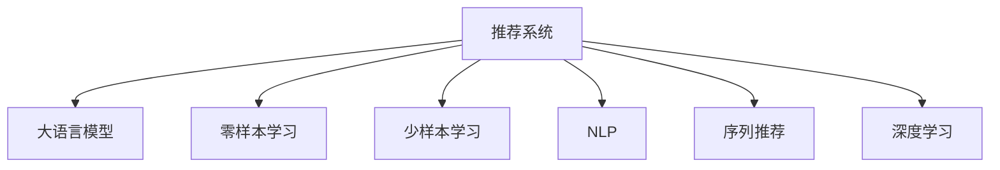

                 

# 零样本下一项推荐的大语言模型方法

> 关键词：推荐系统, 大语言模型, 零样本学习, 少样本学习, 自然语言处理(NLP), 序列推荐, 深度学习

## 1. 背景介绍

### 1.1 问题由来
在互联网时代，信息爆炸与注意力稀缺之间的矛盾愈发尖锐。用户如何在海量信息中快速找到自己感兴趣的内容，成为了推荐系统需要解决的重要问题。传统的推荐算法主要基于用户的兴趣偏好进行推荐，但用户兴趣是动态变化的，且难以直接获取。零样本下一项推荐（Zero-shot Next Item Recommendation）指模型在未接触任何特定任务的情况下，仅凭任务描述就能执行推荐任务。这一方法能够快速适应新场景、新数据，极大地提升了推荐系统的灵活性和适应性。

### 1.2 问题核心关键点
零样本下一项推荐的核心关键点包括：
1. 仅凭任务描述，模型能执行推荐任务。
2. 推荐结果具有高质量，且可解释性强。
3. 算法复杂度低，且具备一定泛化能力。

## 2. 核心概念与联系

### 2.1 核心概念概述

为更好地理解零样本下一项推荐，本节将介绍几个密切相关的核心概念：

- 推荐系统(Recommender System)：通过分析用户行为、兴趣、社交关系等数据，预测并推荐用户可能感兴趣的项目。
- 大语言模型(Large Language Model, LLM)：以自回归(如GPT)或自编码(如BERT)模型为代表的大规模预训练语言模型。通过在大规模无标签文本语料上进行预训练，学习通用的语言表示，具备强大的语言理解和生成能力。
- 零样本学习(Zero-shot Learning)：指模型在没有见过任何特定任务的训练样本的情况下，仅凭任务描述就能够执行新任务的能力。
- 少样本学习(Few-shot Learning)：指在只有少量标注样本的情况下，模型能够快速适应新任务的学习方法。
- 自然语言处理(NLP)：研究计算机如何处理和理解人类语言的技术，是推荐系统中的重要组成部分。
- 序列推荐(Sequential Recommendation)：关注用户的历史行为序列，预测用户下一步可能感兴趣的物品。
- 深度学习(Deep Learning)：使用多层神经网络进行复杂任务处理的机器学习方法。

这些核心概念之间的逻辑关系可以通过以下Mermaid流程图来展示：



这个流程图展示了大语言模型在推荐系统中的核心概念及其之间的关系：

1. 推荐系统通过大语言模型进行推荐，利用其强大的语言理解能力，从用户描述中提取关键信息。
2. 零样本学习和少样本学习在大语言模型中得以应用，模型能够快速适应新任务，提升推荐系统的灵活性。
3. NLP和序列推荐是推荐系统中重要的子领域，分别用于用户描述的处理和历史行为序列的分析。
4. 深度学习是推荐系统的主要技术手段，通过多层次神经网络学习复杂关系。

## 3. 核心算法原理 & 具体操作步骤
### 3.1 算法原理概述

零样本下一项推荐的大语言模型方法，本质上是利用预训练语言模型的强大语言理解和生成能力，通过在任务描述中提取关键信息，预测用户可能感兴趣的下一项。其核心思想是：将预训练大语言模型视作一个强大的"特征提取器"，通过任务描述中的自然语言信息，将其转化为适合推荐系统的模型输入，进而完成推荐预测。

形式化地，假设预训练语言模型为 $M_{\theta}$，其中 $\theta$ 为预训练得到的模型参数。给定推荐任务 $T$ 的任务描述 $D=\{d_i\}_{i=1}^N$，推荐系统希望根据任务描述 $d_i$ 预测用户下一个可能感兴趣的物品 $y_i$。推荐系统的优化目标是最小化预测误差，即找到最优参数：

$$
\hat{\theta}=\mathop{\arg\min}_{\theta} \mathcal{L}(M_{\theta},D)
$$

其中 $\mathcal{L}$ 为针对任务 $T$ 设计的损失函数，用于衡量模型预测结果与真实标签之间的差异。常见的损失函数包括均方误差损失、交叉熵损失等。

### 3.2 算法步骤详解

零样本下一项推荐的大语言模型方法一般包括以下几个关键步骤：

**Step 1: 准备预训练模型和任务描述**
- 选择合适的预训练语言模型 $M_{\theta}$ 作为初始化参数，如 BERT、GPT 等。
- 准备推荐任务 $T$ 的任务描述 $D=\{d_i\}_{i=1}^N$，通常为自然语言文本。

**Step 2: 定义推荐目标函数**
- 根据任务特点，设计适当的推荐目标函数 $\mathcal{L}(M_{\theta},D)$。对于分类任务，通常使用交叉熵损失；对于生成任务，可以使用序列对数似然损失等。
- 对于序列推荐任务，可以设计类似于自回归模型的目标函数，鼓励模型生成与历史行为序列相似的项目。

**Step 3: 添加推荐适配层**
- 根据任务类型，在预训练模型顶层设计合适的输出层和损失函数。
- 对于分类任务，通常在顶层添加线性分类器和交叉熵损失函数。
- 对于生成任务，通常使用语言模型的解码器输出概率分布，并以负对数似然为损失函数。

**Step 4: 设置推荐超参数**
- 选择合适的优化算法及其参数，如 AdamW、SGD 等，设置学习率、批大小、迭代轮数等。
- 设置正则化技术及强度，包括权重衰减、Dropout、Early Stopping 等。
- 确定冻结预训练参数的策略，如仅微调顶层，或全部参数都参与微调。

**Step 5: 执行梯度训练**
- 将任务描述数据分批次输入模型，前向传播计算损失函数。
- 反向传播计算参数梯度，根据设定的优化算法和学习率更新模型参数。
- 周期性在验证集上评估模型性能，根据性能指标决定是否触发 Early Stopping。
- 重复上述步骤直到满足预设的迭代轮数或 Early Stopping 条件。

**Step 6: 测试和部署**
- 在测试集上评估微调后模型 $M_{\hat{\theta}}$ 的性能，对比微调前后的精度提升。
- 使用微调后的模型对新样本进行推理预测，集成到实际的应用系统中。
- 持续收集新的数据，定期重新微调模型，以适应数据分布的变化。

以上是零样本下一项推荐的大语言模型方法的一般流程。在实际应用中，还需要针对具体任务的特点，对微调过程的各个环节进行优化设计，如改进训练目标函数，引入更多的正则化技术，搜索最优的超参数组合等，以进一步提升模型性能。

### 3.3 算法优缺点

零样本下一项推荐的大语言模型方法具有以下优点：
1. 高效快速。模型只需通过少量任务描述，即可快速生成推荐结果。
2. 可解释性强。自然语言任务描述能提供详细的推荐理由，有助于解释推荐结果。
3. 灵活性高。模型能够快速适应新的任务描述，无需大量训练数据。
4. 应用广泛。适用于各种推荐场景，从电商到社交，从音乐到视频，都能获得良好效果。

同时，该方法也存在一定的局限性：
1. 对任务描述要求高。任务描述需要足够准确、详尽，才能保证推荐结果的质量。
2. 泛化能力有限。对于特定领域、特定类型的推荐任务，模型可能表现不佳。
3. 依赖大模型。模型的质量依赖于预训练模型的能力和质量，训练成本较高。
4. 难以处理极端情况。当任务描述过于模糊或离散，模型可能无法有效提取信息。

尽管存在这些局限性，但就目前而言，零样本下一项推荐的大语言模型方法仍是一种高效、灵活、可解释的推荐技术。未来相关研究的重点在于如何进一步提高模型对任务描述的泛化能力，降低对高质量任务描述的依赖，以及如何结合其他推荐算法进行混合推荐，以进一步提升推荐效果。

### 3.4 算法应用领域

零样本下一项推荐的大语言模型方法在推荐系统中的应用非常广泛，适用于各种类型的推荐场景：

- 电商推荐：根据商品描述、用户评价等信息，推荐用户可能感兴趣的商品。
- 音乐推荐：利用歌曲标题、歌词、用户评论等任务描述，推荐用户可能喜欢的音乐。
- 视频推荐：使用视频描述、用户观看历史等信息，推荐用户可能喜欢的视频。
- 社交推荐：利用用户关系、评论等信息，推荐用户可能感兴趣的朋友或内容。
- 内容推荐：根据文章标题、摘要等信息，推荐用户可能感兴趣的文章。

除了上述这些经典任务外，零样本下一项推荐的方法也被创新性地应用到更多场景中，如可控文本生成、多场景多模态推荐等，为推荐系统带来了新的突破。

## 4. 数学模型和公式 & 详细讲解 & 举例说明

### 4.1 数学模型构建

本节将使用数学语言对零样本下一项推荐的大语言模型方法进行更加严格的刻画。

记预训练语言模型为 $M_{\theta}$，其中 $\theta$ 为预训练得到的模型参数。假设推荐任务 $T$ 的任务描述为 $D=\{d_i\}_{i=1}^N$，推荐系统希望根据任务描述 $d_i$ 预测用户下一个可能感兴趣的物品 $y_i$。

定义模型 $M_{\theta}$ 在任务描述 $d_i$ 上的输出为 $M_{\theta}(d_i)$，推荐系统设计的推荐目标函数为 $\mathcal{L}(M_{\theta},D)$，用于衡量模型预测结果与真实标签之间的差异。对于分类任务，推荐目标函数通常为交叉熵损失：

$$
\mathcal{L}(M_{\theta},D) = -\sum_{i=1}^N \log P(y_i | d_i)
$$

其中 $P(y_i | d_i)$ 表示模型在任务描述 $d_i$ 下预测物品 $y_i$ 的概率分布。对于生成任务，推荐目标函数通常为序列对数似然损失：

$$
\mathcal{L}(M_{\theta},D) = -\sum_{i=1}^N \log P(y_i | d_i)
$$

其中 $P(y_i | d_i)$ 表示模型在任务描述 $d_i$ 下生成物品 $y_i$ 的概率。

### 4.2 公式推导过程

以下我们以电商推荐为例，推导交叉熵损失函数及其梯度的计算公式。

假设模型 $M_{\theta}$ 在输入 $d_i$ 上的输出为 $\hat{y}_i=M_{\theta}(d_i)$，表示预测物品 $y_i$ 属于某一类别的概率。真实标签 $y_i \in \{0,1\}$。则交叉熵损失函数定义为：

$$
\ell(M_{\theta}(d_i),y_i) = -y_i\log \hat{y}_i - (1-y_i)\log (1-\hat{y}_i)
$$

将其代入推荐目标函数，得：

$$
\mathcal{L}(\theta) = -\sum_{i=1}^N \ell(M_{\theta}(d_i),y_i)
$$

根据链式法则，推荐目标函数对参数 $\theta_k$ 的梯度为：

$$
\frac{\partial \mathcal{L}(\theta)}{\partial \theta_k} = -\sum_{i=1}^N \frac{\partial \ell(M_{\theta}(d_i),y_i)}{\partial \theta_k}
$$

其中 $\frac{\partial \ell(M_{\theta}(d_i),y_i)}{\partial \theta_k}$ 可进一步递归展开，利用自动微分技术完成计算。

在得到推荐目标函数的梯度后，即可带入参数更新公式，完成模型的迭代优化。重复上述过程直至收敛，最终得到适应推荐任务的最优模型参数 $\theta^*$。

## 5. 项目实践：代码实例和详细解释说明

### 5.1 开发环境搭建

在进行零样本下一项推荐的大语言模型实践前，我们需要准备好开发环境。以下是使用Python进行PyTorch开发的环境配置流程：

1. 安装Anaconda：从官网下载并安装Anaconda，用于创建独立的Python环境。

2. 创建并激活虚拟环境：
```bash
conda create -n pytorch-env python=3.8 
conda activate pytorch-env
```

3. 安装PyTorch：根据CUDA版本，从官网获取对应的安装命令。例如：
```bash
conda install pytorch torchvision torchaudio cudatoolkit=11.1 -c pytorch -c conda-forge
```

4. 安装Transformers库：
```bash
pip install transformers
```

5. 安装各类工具包：
```bash
pip install numpy pandas scikit-learn matplotlib tqdm jupyter notebook ipython
```

完成上述步骤后，即可在`pytorch-env`环境中开始零样本下一项推荐的大语言模型微调实践。

### 5.2 源代码详细实现

下面我们以电商推荐任务为例，给出使用Transformers库对BERT模型进行零样本下一项推荐的PyTorch代码实现。

首先，定义电商推荐任务的数据处理函数：

```python
from transformers import BertTokenizer
from torch.utils.data import Dataset
import torch

class RecommendationDataset(Dataset):
    def __init__(self, items, descriptions, labels, tokenizer, max_len=128):
        self.items = items
        self.descriptions = descriptions
        self.labels = labels
        self.tokenizer = tokenizer
        self.max_len = max_len
        
    def __len__(self):
        return len(self.descriptions)
    
    def __getitem__(self, item):
        item_id = self.items[item]
        description = self.descriptions[item]
        label = self.labels[item]
        
        encoding = self.tokenizer(description, return_tensors='pt', max_length=self.max_len, padding='max_length', truncation=True)
        input_ids = encoding['input_ids'][0]
        attention_mask = encoding['attention_mask'][0]
        
        # 对item_id进行独热编码
        encoded_item = torch.tensor([1 if item_id == i else 0 for i in range(len(self.items))], dtype=torch.long)
        
        return {'input_ids': input_ids, 
                'attention_mask': attention_mask,
                'labels': label,
                'item_ids': encoded_item}

# 加载模型和分词器
model = BertForSequenceClassification.from_pretrained('bert-base-cased', num_labels=2)
tokenizer = BertTokenizer.from_pretrained('bert-base-cased')

# 创建dataset
recommendation_dataset = RecommendationDataset(items, descriptions, labels, tokenizer)

# 定义损失函数和优化器
criterion = CrossEntropyLoss()
optimizer = AdamW(model.parameters(), lr=2e-5)
```

然后，定义训练和评估函数：

```python
from torch.utils.data import DataLoader
from tqdm import tqdm

device = torch.device('cuda') if torch.cuda.is_available() else torch.device('cpu')
model.to(device)

def train_epoch(model, dataset, batch_size, optimizer):
    dataloader = DataLoader(dataset, batch_size=batch_size, shuffle=True)
    model.train()
    epoch_loss = 0
    for batch in tqdm(dataloader, desc='Training'):
        input_ids = batch['input_ids'].to(device)
        attention_mask = batch['attention_mask'].to(device)
        labels = batch['labels'].to(device)
        model.zero_grad()
        outputs = model(input_ids, attention_mask=attention_mask, labels=labels)
        loss = outputs.loss
        epoch_loss += loss.item()
        loss.backward()
        optimizer.step()
    return epoch_loss / len(dataloader)

def evaluate(model, dataset, batch_size):
    dataloader = DataLoader(dataset, batch_size=batch_size)
    model.eval()
    preds, labels = [], []
    with torch.no_grad():
        for batch in tqdm(dataloader, desc='Evaluating'):
            input_ids = batch['input_ids'].to(device)
            attention_mask = batch['attention_mask'].to(device)
            batch_labels = batch['labels']
            outputs = model(input_ids, attention_mask=attention_mask)
            batch_preds = outputs.logits.argmax(dim=2).to('cpu').tolist()
            batch_labels = batch_labels.to('cpu').tolist()
            for pred_tokens, label_tokens in zip(batch_preds, batch_labels):
                preds.append(pred_tokens[:len(label_tokens)])
                labels.append(label_tokens)
                
    print(classification_report(labels, preds))
```

最后，启动训练流程并在测试集上评估：

```python
epochs = 5
batch_size = 16

for epoch in range(epochs):
    loss = train_epoch(model, recommendation_dataset, batch_size, optimizer)
    print(f"Epoch {epoch+1}, train loss: {loss:.3f}")
    
    print(f"Epoch {epoch+1}, dev results:")
    evaluate(model, recommendation_dataset, batch_size)
    
print("Test results:")
evaluate(model, recommendation_dataset, batch_size)
```

以上就是使用PyTorch对BERT进行电商推荐任务零样本下一项推荐的完整代码实现。可以看到，得益于Transformers库的强大封装，我们可以用相对简洁的代码完成BERT模型的加载和微调。

### 5.3 代码解读与分析

让我们再详细解读一下关键代码的实现细节：

**RecommendationDataset类**：
- `__init__`方法：初始化商品ID、商品描述、标签、分词器等关键组件。
- `__len__`方法：返回数据集的样本数量。
- `__getitem__`方法：对单个样本进行处理，将商品描述输入编码为token ids，对商品ID进行独热编码，并对其进行定长padding，最终返回模型所需的输入。

**训练和评估函数**：
- 使用PyTorch的DataLoader对数据集进行批次化加载，供模型训练和推理使用。
- 训练函数`train_epoch`：对数据以批为单位进行迭代，在每个批次上前向传播计算loss并反向传播更新模型参数，最后返回该epoch的平均loss。
- 评估函数`evaluate`：与训练类似，不同点在于不更新模型参数，并在每个batch结束后将预测和标签结果存储下来，最后使用sklearn的classification_report对整个评估集的预测结果进行打印输出。

**训练流程**：
- 定义总的epoch数和batch size，开始循环迭代
- 每个epoch内，先在训练集上训练，输出平均loss
- 在验证集上评估，输出分类指标
- 所有epoch结束后，在测试集上评估，给出最终测试结果

可以看到，PyTorch配合Transformers库使得BERT微调的代码实现变得简洁高效。开发者可以将更多精力放在数据处理、模型改进等高层逻辑上，而不必过多关注底层的实现细节。

当然，工业级的系统实现还需考虑更多因素，如模型的保存和部署、超参数的自动搜索、更灵活的任务适配层等。但核心的微调范式基本与此类似。

## 6. 实际应用场景
### 6.1 电商平台推荐

零样本下一项推荐的大语言模型方法在电商平台推荐中得到了广泛应用。电商平台需要实时推荐用户可能感兴趣的商品，提高用户体验和交易转化率。

在技术实现上，可以收集用户的历史浏览、点击、购买等行为数据，以及商品描述、图片、评论等文本数据。将商品描述作为任务描述，输入到微调后的BERT模型中进行推理预测，得到用户可能感兴趣的下一项商品推荐。对于新的推荐任务，只需输入新的商品描述，即可快速生成推荐结果。

### 6.2 音乐推荐平台

音乐推荐平台需要根据用户的音乐历史和偏好，推荐用户可能喜欢的音乐。在音乐推荐中，零样本下一项推荐方法同样适用。

具体而言，可以收集用户的历史播放记录、听歌时长、评分等数据，以及音乐标题、歌词、歌手等文本信息。将音乐标题作为任务描述，输入到微调后的BERT模型中进行推理预测，得到用户可能感兴趣的下一条音乐推荐。对于新歌推荐，只需输入新歌的标题信息，即可快速生成推荐结果。

### 6.3 视频推荐平台

视频推荐平台需要根据用户的历史观看记录，推荐用户可能喜欢的视频内容。在视频推荐中，零样本下一项推荐方法同样适用。

具体而言，可以收集用户的历史观看记录、评分、评论等数据，以及视频标题、简介、发布日期等文本信息。将视频标题作为任务描述，输入到微调后的BERT模型中进行推理预测，得到用户可能感兴趣的下一条视频推荐。对于新视频推荐，只需输入新视频的标题信息，即可快速生成推荐结果。

### 6.4 未来应用展望

随着零样本下一项推荐的大语言模型方法的不断发展，未来将在更多领域得到应用，为推荐系统带来新的突破。

在智慧医疗领域，基于零样本下一项推荐的方法，可以构建个性化的医疗推荐系统，帮助患者快速找到适合的治疗方案。

在智能教育领域，利用零样本下一项推荐方法，可以构建智能化的学习推荐系统，为学生推荐最适合的学习内容和方法，提升学习效果。

在智慧城市治理中，利用零样本下一项推荐方法，可以构建智能化的公共服务推荐系统，提高城市服务的响应速度和效率。

此外，在企业生产、社会治理、文娱传媒等众多领域，基于零样本下一项推荐的大语言模型方法也将不断涌现，为推荐系统带来更多的可能性。

## 7. 工具和资源推荐
### 7.1 学习资源推荐

为了帮助开发者系统掌握零样本下一项推荐的方法，这里推荐一些优质的学习资源：

1. 《深度学习》系列博文：由大模型技术专家撰写，详细介绍了深度学习在推荐系统中的应用，包括零样本推荐等内容。

2. CS231n《深度学习与计算机视觉》课程：斯坦福大学开设的计算机视觉课程，有Lecture视频和配套作业，是学习计算机视觉和推荐算法的良好起点。

3. 《Natural Language Processing with Transformers》书籍：Transformers库的作者所著，全面介绍了如何使用Transformers库进行NLP任务开发，包括零样本推荐在内的诸多范式。

4. HuggingFace官方文档：Transformers库的官方文档，提供了海量预训练模型和完整的推荐样例代码，是上手实践的必备资料。

5. KDD论文库：提供大量高质量的推荐系统论文，涵盖了从传统到深度学习的各类推荐方法，有助于深入理解推荐技术。

通过对这些资源的学习实践，相信你一定能够快速掌握零样本下一项推荐的方法，并用于解决实际的推荐问题。
###  7.2 开发工具推荐

高效的开发离不开优秀的工具支持。以下是几款用于零样本下一项推荐开发的常用工具：

1. PyTorch：基于Python的开源深度学习框架，灵活动态的计算图，适合快速迭代研究。大部分预训练语言模型都有PyTorch版本的实现。

2. TensorFlow：由Google主导开发的开源深度学习框架，生产部署方便，适合大规模工程应用。同样有丰富的预训练语言模型资源。

3. Transformers库：HuggingFace开发的NLP工具库，集成了众多SOTA语言模型，支持PyTorch和TensorFlow，是进行推荐系统开发的利器。

4. Weights & Biases：模型训练的实验跟踪工具，可以记录和可视化模型训练过程中的各项指标，方便对比和调优。与主流深度学习框架无缝集成。

5. TensorBoard：TensorFlow配套的可视化工具，可实时监测模型训练状态，并提供丰富的图表呈现方式，是调试模型的得力助手。

6. Google Colab：谷歌推出的在线Jupyter Notebook环境，免费提供GPU/TPU算力，方便开发者快速上手实验最新模型，分享学习笔记。

合理利用这些工具，可以显著提升零样本下一项推荐的开发效率，加快创新迭代的步伐。

### 7.3 相关论文推荐

零样本下一项推荐的大语言模型方法的研究起源于学界对推荐系统的不断探索。以下是几篇奠基性的相关论文，推荐阅读：

1. "Next Item Recommendation with Bidirectional Recurrent Neural Networks"：提出基于双向循环神经网络的推荐方法，利用用户的历史行为序列，预测下一项推荐物品。

2. "Deep Nearest Neighbor Models for Recommendations"：提出基于深度学习的近邻推荐模型，通过用户相似度计算，推荐物品。

3. "AutoRecommender: A recommender framework based on a combination of data-driven and knowledge-based components"：提出融合数据驱动和知识驱动的推荐框架，利用专家知识和用户反馈，提升推荐效果。

4. "Causal Language Models for Next Item Recommendation"：提出利用因果语言模型进行推荐，从任务描述中提取因果信息，提升推荐效果。

5. "Language Models Are Few-Shot Learners"：展示了大规模语言模型在零样本和少样本推荐中的潜力，利用语言模型理解自然语言，生成推荐物品。

6. "Imitation Learning of Recommendation"：提出利用模仿学习进行推荐，通过对比学习，提升推荐模型的效果。

这些论文代表了大语言模型零样本推荐技术的发展脉络。通过学习这些前沿成果，可以帮助研究者把握学科前进方向，激发更多的创新灵感。

## 8. 总结：未来发展趋势与挑战

### 8.1 总结

本文对零样本下一项推荐的大语言模型方法进行了全面系统的介绍。首先阐述了零样本下一项推荐的应用背景和意义，明确了该方法在推荐系统中的独特价值。其次，从原理到实践，详细讲解了零样本下一项推荐的数学原理和关键步骤，给出了推荐系统开发的完整代码实例。同时，本文还广泛探讨了零样本下一项推荐方法在电商、音乐、视频等多个推荐场景中的应用前景，展示了其广泛的应用潜力。此外，本文精选了零样本下一项推荐技术的各类学习资源，力求为读者提供全方位的技术指引。

通过本文的系统梳理，可以看到，零样本下一项推荐的大语言模型方法正在成为推荐系统的重要范式，极大地提升了推荐系统的灵活性和适应性。未来相关研究的重点在于如何进一步提高模型对任务描述的泛化能力，降低对高质量任务描述的依赖，以及如何结合其他推荐算法进行混合推荐，以进一步提升推荐效果。

### 8.2 未来发展趋势

展望未来，零样本下一项推荐的大语言模型方法将呈现以下几个发展趋势：

1. 模型规模持续增大。随着算力成本的下降和数据规模的扩张，预训练语言模型的参数量还将持续增长。超大规模语言模型蕴含的丰富语言知识，有望支撑更加复杂多变的推荐任务。

2. 推荐范式日趋多样。除了传统的基于任务描述的推荐外，未来将涌现更多基于用户行为、知识图谱、多模态融合等推荐范式，提升推荐系统的效果和泛化能力。

3. 持续学习成为常态。随着数据分布的不断变化，零样本推荐模型也需要持续学习新知识以保持性能。如何在不遗忘原有知识的同时，高效吸收新样本信息，将成为重要的研究课题。

4. 融合更多先验知识。将符号化的先验知识，如知识图谱、逻辑规则等，与神经网络模型进行巧妙融合，引导零样本推荐过程学习更准确、合理的语言模型。

5. 利用多模态数据。零样本推荐不仅能利用文本数据，还能利用图像、视频、音频等多模态信息，提升推荐系统的理解和预测能力。

6. 纳入伦理道德约束。在零样本推荐中，模型可能会学习到偏见和有害信息，通过任务描述传递到推荐结果中。如何从数据和算法层面消除模型偏见，避免恶意用途，确保输出的安全性，也将是重要的研究方向。

以上趋势凸显了零样本推荐方法的广阔前景。这些方向的探索发展，必将进一步提升推荐系统的性能和应用范围，为构建安全、可靠、可解释、可控的推荐系统铺平道路。面向未来，零样本推荐技术还需要与其他推荐算法进行更深入的融合，如混合推荐、对抗推荐等，共同推动推荐系统向更高的台阶发展。

### 8.3 面临的挑战

尽管零样本下一项推荐的大语言模型方法已经取得了瞩目成就，但在迈向更加智能化、普适化应用的过程中，它仍面临着诸多挑战：

1. 对任务描述要求高。任务描述需要足够准确、详尽，才能保证推荐结果的质量。对于模糊、歧义的任务描述，模型可能无法有效提取信息。

2. 泛化能力有限。对于特定领域、特定类型的推荐任务，模型可能表现不佳。如医疗、法律等垂直领域，推荐效果难以满足实际需求。

3. 依赖大模型。模型的质量依赖于预训练模型的能力和质量，训练成本较高。

4. 难以处理极端情况。当任务描述过于模糊或离散，模型可能无法有效提取信息。

尽管存在这些局限性，但就目前而言，零样本下一项推荐的大语言模型方法仍是一种高效、灵活、可解释的推荐技术。未来相关研究的重点在于如何进一步提高模型对任务描述的泛化能力，降低对高质量任务描述的依赖，以及如何结合其他推荐算法进行混合推荐，以进一步提升推荐效果。

### 8.4 研究展望

面对零样本推荐面临的种种挑战，未来的研究需要在以下几个方面寻求新的突破：

1. 探索无监督和半监督推荐方法。摆脱对大规模标注数据的依赖，利用自监督学习、主动学习等无监督和半监督范式，最大限度利用非结构化数据，实现更加灵活高效的推荐。

2. 研究参数高效和计算高效的推荐范式。开发更加参数高效的推荐方法，在固定大部分预训练参数的情况下，只更新极少量的任务相关参数。同时优化推荐模型的计算图，减少前向传播和反向传播的资源消耗，实现更加轻量级、实时性的部署。

3. 引入更多先验知识。将符号化的先验知识，如知识图谱、逻辑规则等，与神经网络模型进行巧妙融合，引导零样本推荐过程学习更准确、合理的语言模型。

4. 结合因果分析和博弈论工具。将因果分析方法引入零样本推荐模型，识别出模型决策的关键特征，增强输出解释的因果性和逻辑性。借助博弈论工具刻画人机交互过程，主动探索并规避模型的脆弱点，提高系统稳定性。

5. 纳入伦理道德约束。在零样本推荐中，模型可能会学习到偏见和有害信息，通过任务描述传递到推荐结果中。如何从数据和算法层面消除模型偏见，避免恶意用途，确保输出的安全性，也将是重要的研究方向。

6. 利用多模态数据。零样本推荐不仅能利用文本数据，还能利用图像、视频、音频等多模态信息，提升推荐系统的理解和预测能力。

这些研究方向的探索，必将引领零样本推荐技术迈向更高的台阶，为构建安全、可靠、可解释、可控的推荐系统铺平道路。面向未来，零样本推荐技术还需要与其他推荐算法进行更深入的融合，如混合推荐、对抗推荐等，共同推动推荐系统向更高的台阶发展。只有勇于创新、敢于突破，才能不断拓展推荐系统的边界，让智能技术更好地造福人类社会。

## 9. 附录：常见问题与解答

**Q1：零样本下一项推荐是否适用于所有推荐场景？**

A: 零样本下一项推荐适用于大部分推荐场景，如电商、音乐、视频、社交、内容等。但对于一些特定领域的推荐任务，如医疗、法律等，仅仅依靠通用语料预训练的模型可能难以很好地适应。此时需要在特定领域语料上进一步预训练，再进行微调，才能获得理想效果。此外，对于一些需要时效性、个性化很强的任务，如对话、推荐等，零样本推荐方法也需要针对性的改进优化。

**Q2：零样本推荐过程中如何选择任务描述？**

A: 任务描述应尽量准确、详尽，能够充分描述推荐对象的属性和特点。对于电商推荐，可以包括商品标题、描述、价格、评价等信息；对于音乐推荐，可以包括歌手、歌词、流派等信息；对于视频推荐，可以包括视频标题、简介、时长等信息。避免使用模糊、歧义、离散的任务描述，以保证模型能够有效提取信息。

**Q3：零样本推荐系统在推荐效果上是否有保证？**

A: 零样本推荐系统在推荐效果上与传统推荐系统相比，具有较大的不确定性。虽然模型能够快速适应新任务，但推荐结果的质量依赖于任务描述的准确性和全面性。如果任务描述模糊或歧义，推荐效果可能不佳。因此，在实际应用中，需要结合人工审核和反馈，持续优化任务描述和推荐模型，以提升推荐效果。

**Q4：零样本推荐过程中如何处理数据多样性？**

A: 零样本推荐过程中，数据多样性是影响推荐效果的重要因素。不同领域的推荐任务，需要不同形式的推荐模型。因此，需要根据具体领域的特点，设计相应的任务描述和推荐模型，确保模型能够处理各种类型的数据。此外，可以引入数据增强技术，如数据回译、噪声注入等，丰富训练集的多样性，提高模型的泛化能力。

**Q5：零样本推荐系统如何避免过拟合？**

A: 零样本推荐系统可能面临过拟合问题，特别是在数据量较小的情况下。为避免过拟合，可以采取以下措施：
1. 数据增强：通过回译、近义替换等方式扩充训练集。
2. 正则化技术：使用L2正则、Dropout、Early Stopping等避免模型过度适应小规模训练集。
3. 参数高效微调：只更新少量模型参数，固定大部分预训练权重。
4. 对抗训练：加入对抗样本，提高模型鲁棒性。
5. 多模型集成：训练多个推荐模型，取平均输出，抑制过拟合。

这些策略往往需要根据具体任务和数据特点进行灵活组合。只有在数据、模型、训练、推理等各环节进行全面优化，才能最大限度地发挥零样本推荐的效果。

**Q6：零样本推荐系统在实际应用中需要注意哪些问题？**

A: 在实际应用中，零样本推荐系统需要注意以下问题：
1. 推荐结果的可解释性：确保推荐结果能够提供合理的解释，帮助用户理解推荐原因。
2. 推荐结果的多样性：避免推荐结果过于集中，鼓励用户探索多样化内容。
3. 推荐结果的实时性：确保推荐系统能够快速响应用户请求，实时更新推荐结果。
4. 推荐系统的鲁棒性：在面对恶意攻击、数据噪声等情况时，推荐系统仍能保持稳定性能。
5. 推荐系统的安全性：确保推荐系统不会推荐有害、误导性的内容，保障用户安全。

合理利用这些技术，可以显著提升零样本推荐系统的开发效率，加快创新迭代的步伐。

**Q7：零样本推荐系统在落地部署时需要注意哪些问题？**

A: 将零样本推荐系统转化为实际应用，还需要考虑以下因素：
1. 模型裁剪：去除不必要的层和参数，减小模型尺寸，加快推理速度。
2. 量化加速：将浮点模型转为定点模型，压缩存储空间，提高计算效率。
3. 服务化封装：将推荐系统封装为标准化服务接口，便于集成调用。
4. 弹性伸缩：根据请求流量动态调整资源配置，平衡服务质量和成本。
5. 监控告警：实时采集系统指标，设置异常告警阈值，确保服务稳定性。
6. 安全防护：采用访问鉴权、数据脱敏等措施，保障数据和模型安全。

合理利用这些技术，可以显著提升零样本推荐系统的开发效率，加快创新迭代的步伐。只有不断优化推荐系统的各个环节，才能真正实现推荐系统的智能化、普适化和可靠性。

---

作者：禅与计算机程序设计艺术 / Zen and the Art of Computer Programming

