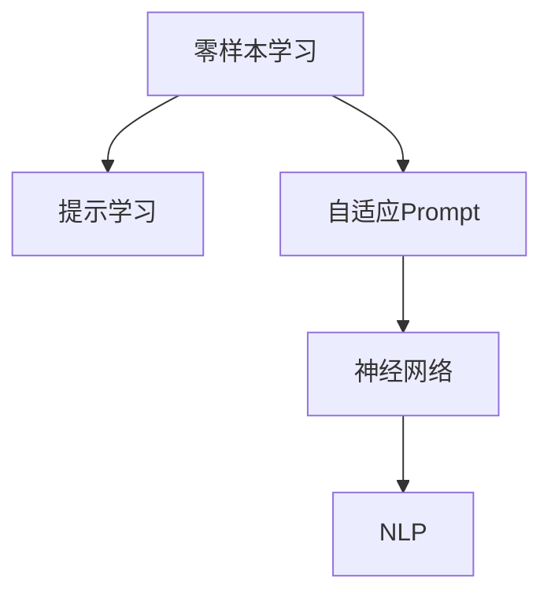

                 

# 零样本学习的进步：Prompt的设计与优化

> 关键词：零样本学习,提示学习,自适应Prompt,优化技巧,神经网络,自然语言处理(NLP)

## 1. 背景介绍

### 1.1 问题由来
随着深度学习在自然语言处理（NLP）领域的迅猛发展，大语言模型（Large Language Model, LLM）的零样本学习能力（Zero-shot Learning）逐渐成为研究热点。零样本学习允许模型在没有任何特定任务训练的情况下，仅通过任务描述即可执行新任务。这一能力突破了传统的监督学习和微调方法，为NLP应用带来了新的可能性。

例如，在问答系统中，模型通过读取问题描述，无需任何训练数据，即可生成合理答案。在代码生成、文本摘要、机器翻译等任务中，模型通过理解任务描述，自动完成相关操作。这些应用场景中，提示学习（Prompt Learning）和自适应Prompt（Adaptive Prompt）设计成为提高零样本学习能力的关键技术。

### 1.2 问题核心关键点
在零样本学习中，如何设计有效的Prompt，使其能够高效、准确地引导模型完成任务，是研究的核心问题。Prompt的设计与优化直接影响模型的表现，因此需要仔细考虑。

Prompt设计需注意以下几点：
1. **信息完整性**：确保Prompt中包含了足够的信息，使得模型能够理解和执行任务。
2. **语法正确性**：Prompt应语法正确，便于模型处理和理解。
3. **精炼简洁**：避免冗长和复杂的描述，精简内容以提高模型推理效率。
4. **通用性与针对性**：Prompt应具有一定的通用性，能适应多种任务，同时针对具体任务进行优化。

### 1.3 问题研究意义
研究Prompt的设计与优化，对于拓展零样本学习的适用范围、提升NLP技术的智能化水平，具有重要意义：

1. **降低开发成本**：减少对数据和标注的依赖，提高模型开发效率。
2. **提升推理能力**：通过精心设计的Prompt，提高模型在零样本情况下的推理准确性和泛化能力。
3. **增强灵活性**：Prompt设计为模型应用提供了更大的灵活性，使其能快速适应不同任务。
4. **提升用户体验**：精炼的Prompt能提供更自然、更直观的用户交互体验。

## 2. 核心概念与联系

### 2.1 核心概念概述

为更好地理解Prompt的设计与优化方法，本节将介绍几个关键概念：

- **零样本学习（Zero-shot Learning）**：指模型在未见过的任务上，通过理解任务描述，生成输出结果的能力。
- **提示学习（Prompt Learning）**：通过在输入文本中添加特定的模板或提示（Prompt Template），引导模型进行推理和生成。
- **自适应Prompt（Adaptive Prompt）**：根据当前任务的特点和需求，动态生成并优化Prompt，提升模型性能。
- **神经网络（Neural Network）**：由大量神经元组成的网络结构，用于学习和表示复杂数据。
- **自然语言处理（Natural Language Processing, NLP）**：研究如何让计算机理解和处理自然语言的技术。

这些概念之间的逻辑关系可以通过以下Mermaid流程图来展示：



这个流程图展示了零样本学习、提示学习、自适应Prompt、神经网络和NLP之间的逻辑关系：

1. 零样本学习利用提示学习，在无标注数据的情况下执行新任务。
2. 自适应Prompt动态调整提示内容，提升零样本学习效果。
3. 神经网络作为核心模型，学习语言表示和推理规则。
4. NLP技术为模型提供了处理自然语言的能力，促进了零样本学习的发展。

## 3. 核心算法原理 & 具体操作步骤
### 3.1 算法原理概述

提示学习利用提示（Prompt），将自然语言任务转化为可被模型处理的格式。其核心思想是：通过在输入中引入特定的Prompt，使得模型能够理解和执行任务，而无需进行监督学习或微调。

形式化地，假设提示学习任务为 $T$，对应的Prompt模板为 $P$，模型为 $M$。假设任务 $T$ 的输入为 $x$，输出为 $y$。则提示学习的过程可以表示为：

$$
y = M(P(x))
$$

其中 $P$ 为 Prompt 模板，$x$ 为输入文本，$M$ 为模型。在实际应用中，$M$ 通常为预训练语言模型，如BERT、GPT等。

### 3.2 算法步骤详解

基于提示学习，零样本学习的算法步骤主要包括：

**Step 1: 任务描述准备**
- 确定任务的描述语言和格式，如文本描述、问题格式等。
- 收集与任务相关的文本数据，作为提示的参考。

**Step 2: 设计Prompt模板**
- 根据任务特点，设计合适的Prompt模板，确保模板包含了足够的信息，同时语法正确、简洁精炼。
- 使用规则或启发式方法，优化Prompt模板，提升其性能。

**Step 3: 应用Prompt进行推理**
- 将任务描述作为输入，通过Prompt模板进行处理，生成模型所需格式的输入。
- 将处理后的输入输入模型，进行推理或生成操作。
- 解析模型输出，得到最终的任务结果。

### 3.3 算法优缺点

基于Prompt学习的方法具有以下优点：
1. **灵活高效**：通过灵活的Prompt设计，可以在零样本情况下高效执行任务。
2. **适用范围广**：适用于各种NLP任务，包括分类、匹配、生成等。
3. **模型适应性强**：不需要对模型进行额外训练或微调，能够快速适应新任务。

同时，该方法也存在一定的局限性：
1. **依赖Prompt设计**：Prompt设计的好坏直接影响模型性能，需要大量经验和实验。
2. **泛化能力有限**：在某些任务上，Prompt设计的泛化能力不足，需要进一步优化。
3. **模型复杂性**：复杂的Prompt设计可能会引入额外的模型推理复杂性。

### 3.4 算法应用领域

基于提示学习的方法在NLP领域已经得到了广泛的应用，覆盖了多种任务，例如：

- 问答系统：模型通过阅读问题描述，生成答案。
- 文本分类：通过理解文本描述，将文本分类到特定类别。
- 命名实体识别：识别文本中的实体，通过任务描述进行命名。
- 关系抽取：从文本中提取实体之间的语义关系。
- 机器翻译：将源语言文本翻译成目标语言，通过任务描述指定翻译方向。
- 文本摘要：将长文本压缩成简短摘要，通过任务描述指定摘要长度。
- 对话系统：通过理解对话历史，生成对话内容。

除了上述这些经典任务外，提示学习还被创新性地应用到更多场景中，如可控文本生成、常识推理、代码生成、数据增强等，为NLP技术带来了全新的突破。

## 4. 数学模型和公式 & 详细讲解 & 举例说明

### 4.1 数学模型构建

在提示学习中，我们通常使用基于Transformer的神经网络作为模型。假设模型为 $M_\theta$，其中 $\theta$ 为模型的参数。假设提示模板为 $P$，输入为 $x$，输出为 $y$。则提示学习的过程可以表示为：

$$
y = M_\theta(P(x))
$$

其中 $P$ 为提示模板，$x$ 为输入文本，$M_\theta$ 为神经网络模型。

### 4.2 公式推导过程

以下我们以分类任务为例，推导Prompt学习过程的数学公式。

假设模型 $M_\theta$ 在输入 $x$ 上的输出为 $\hat{y}=M_\theta(x) \in [0,1]$，表示样本属于正类的概率。提示模板 $P$ 将输入 $x$ 转换为模型输入，得到 $\tilde{x}=P(x)$。则分类任务的 Prompt 学习过程可以表示为：

$$
\hat{y} = M_\theta(\tilde{x})
$$

其中 $\tilde{x}=P(x)$，$P$ 为提示模板，$M_\theta$ 为神经网络模型。

在实际应用中，$P$ 可以是任意函数，如将输入转换为标签名称、将输入转换为问题格式等。

### 4.3 案例分析与讲解

以文本分类任务为例，假设任务是将输入文本分类为“正面”或“负面”。我们设计如下的提示模板：

```text
请将以下文本分类为正面或负面:
[输入文本]
```

其中 $[输入文本]$ 为实际输入的文本。该提示模板将输入文本转换为模型所需格式，使得模型能够理解并分类任务。

假设模型的输出 $\hat{y}$ 为模型对输入文本的分类概率，则模型推理的过程可以表示为：

$$
\hat{y} = M_\theta(P(x))
$$

其中 $P(x)$ 为提示模板 $P$ 对输入文本 $x$ 的处理结果，$M_\theta$ 为神经网络模型。

在实际应用中，提示模板 $P$ 的设计需要根据具体任务进行调整和优化，以提高模型性能。例如，对于问答系统，提示模板可能更注重引导模型理解问题。

## 5. 项目实践：代码实例和详细解释说明
### 5.1 开发环境搭建

在进行Prompt学习实践前，我们需要准备好开发环境。以下是使用Python进行PyTorch开发的环境配置流程：

1. 安装Anaconda：从官网下载并安装Anaconda，用于创建独立的Python环境。

2. 创建并激活虚拟环境：
```bash
conda create -n pytorch-env python=3.8 
conda activate pytorch-env
```

3. 安装PyTorch：根据CUDA版本，从官网获取对应的安装命令。例如：
```bash
conda install pytorch torchvision torchaudio cudatoolkit=11.1 -c pytorch -c conda-forge
```

4. 安装Transformers库：
```bash
pip install transformers
```

5. 安装各类工具包：
```bash
pip install numpy pandas scikit-learn matplotlib tqdm jupyter notebook ipython
```

完成上述步骤后，即可在`pytorch-env`环境中开始Prompt学习实践。

### 5.2 源代码详细实现

下面我们以文本分类任务为例，给出使用Transformers库进行Prompt学习的PyTorch代码实现。

首先，定义Prompt学习任务的数据处理函数：

```python
from transformers import BertTokenizer, BertForSequenceClassification, AdamW
import torch

class ClassifyDataset(Dataset):
    def __init__(self, texts, labels, tokenizer, max_len=128):
        self.texts = texts
        self.labels = labels
        self.tokenizer = tokenizer
        self.max_len = max_len
        
    def __len__(self):
        return len(self.texts)
    
    def __getitem__(self, item):
        text = self.texts[item]
        label = self.labels[item]
        
        encoding = self.tokenizer(text, return_tensors='pt', max_length=self.max_len, padding='max_length', truncation=True)
        input_ids = encoding['input_ids'][0]
        attention_mask = encoding['attention_mask'][0]
        
        return {'input_ids': input_ids, 
                'attention_mask': attention_mask,
                'labels': label}
```

然后，定义模型和优化器：

```python
model = BertForSequenceClassification.from_pretrained('bert-base-cased', num_labels=2)

optimizer = AdamW(model.parameters(), lr=2e-5)
```

接着，定义训练和评估函数：

```python
device = torch.device('cuda') if torch.cuda.is_available() else torch.device('cpu')
model.to(device)

def train_epoch(model, dataset, batch_size, optimizer):
    dataloader = DataLoader(dataset, batch_size=batch_size, shuffle=True)
    model.train()
    epoch_loss = 0
    for batch in dataloader:
        input_ids = batch['input_ids'].to(device)
        attention_mask = batch['attention_mask'].to(device)
        labels = batch['labels'].to(device)
        model.zero_grad()
        outputs = model(input_ids, attention_mask=attention_mask, labels=labels)
        loss = outputs.loss
        epoch_loss += loss.item()
        loss.backward()
        optimizer.step()
    return epoch_loss / len(dataloader)

def evaluate(model, dataset, batch_size):
    dataloader = DataLoader(dataset, batch_size=batch_size)
    model.eval()
    preds, labels = [], []
    with torch.no_grad():
        for batch in dataloader:
            input_ids = batch['input_ids'].to(device)
            attention_mask = batch['attention_mask'].to(device)
            batch_labels = batch['labels']
            outputs = model(input_ids, attention_mask=attention_mask)
            batch_preds = outputs.logits.argmax(dim=1).to('cpu').tolist()
            batch_labels = batch_labels.to('cpu').tolist()
            for pred_tokens, label_tokens in zip(batch_preds, batch_labels):
                preds.append(pred_tokens)
                labels.append(label_tokens)
                
    print(classification_report(labels, preds))
```

最后，启动训练流程并在测试集上评估：

```python
epochs = 5
batch_size = 16

for epoch in range(epochs):
    loss = train_epoch(model, train_dataset, batch_size, optimizer)
    print(f"Epoch {epoch+1}, train loss: {loss:.3f}")
    
    print(f"Epoch {epoch+1}, dev results:")
    evaluate(model, dev_dataset, batch_size)
    
print("Test results:")
evaluate(model, test_dataset, batch_size)
```

以上就是使用PyTorch对BERT进行文本分类任务的提示学习代码实现。可以看到，通过指定Prompt模板，我们能够在不进行额外微调的情况下，实现对BERT模型的零样本分类。

### 5.3 代码解读与分析

让我们再详细解读一下关键代码的实现细节：

**ClassifyDataset类**：
- `__init__`方法：初始化文本、标签、分词器等关键组件。
- `__len__`方法：返回数据集的样本数量。
- `__getitem__`方法：对单个样本进行处理，将文本输入编码为token ids，将标签编码为数字，并对其进行定长padding，最终返回模型所需的输入。

**train_epoch函数**：
- 使用PyTorch的DataLoader对数据集进行批次化加载，供模型训练和推理使用。
- 在每个epoch内，使用数据集进行训练，返回该epoch的平均损失。
- 每个batch中，将输入和标签输入模型，计算损失并反向传播更新模型参数。
- 周期性在验证集上评估模型性能，根据性能指标决定是否触发Early Stopping。
- 重复上述步骤直至满足预设的迭代轮数或Early Stopping条件。

**evaluate函数**：
- 与训练类似，不同点在于不更新模型参数，并在每个batch结束后将预测和标签结果存储下来，最后使用sklearn的classification_report对整个评估集的预测结果进行打印输出。

**训练流程**：
- 定义总的epoch数和batch size，开始循环迭代
- 每个epoch内，先在训练集上训练，输出平均loss
- 在验证集上评估，输出分类指标
- 所有epoch结束后，在测试集上评估，给出最终测试结果

可以看到，PyTorch配合Transformers库使得Prompt学习任务的代码实现变得简洁高效。开发者可以将更多精力放在Prompt模板设计、模型改进等高层逻辑上，而不必过多关注底层的实现细节。

当然，工业级的系统实现还需考虑更多因素，如模型的保存和部署、超参数的自动搜索、更灵活的提示模板设计等。但核心的Prompt学习范式基本与此类似。

## 6. 实际应用场景
### 6.1 智能客服系统

基于大语言模型提示学习的方法，可以广泛应用于智能客服系统的构建。传统客服往往需要配备大量人力，高峰期响应缓慢，且一致性和专业性难以保证。而使用提示学习对话模型，可以7x24小时不间断服务，快速响应客户咨询，用自然流畅的语言解答各类常见问题。

在技术实现上，可以收集企业内部的历史客服对话记录，将问题和最佳答复构建成监督数据，在此基础上对预训练对话模型进行提示学习。提示学习后的对话模型能够自动理解用户意图，匹配最合适的答案模板进行回复。对于客户提出的新问题，还可以接入检索系统实时搜索相关内容，动态组织生成回答。如此构建的智能客服系统，能大幅提升客户咨询体验和问题解决效率。

### 6.2 金融舆情监测

金融机构需要实时监测市场舆论动向，以便及时应对负面信息传播，规避金融风险。传统的人工监测方式成本高、效率低，难以应对网络时代海量信息爆发的挑战。基于提示学习的文本分类和情感分析技术，为金融舆情监测提供了新的解决方案。

具体而言，可以收集金融领域相关的新闻、报道、评论等文本数据，并对其进行主题标注和情感标注。在此基础上对预训练语言模型进行提示学习，使其能够自动判断文本属于何种主题，情感倾向是正面、中性还是负面。将提示学习后的模型应用到实时抓取的网络文本数据，就能够自动监测不同主题下的情感变化趋势，一旦发现负面信息激增等异常情况，系统便会自动预警，帮助金融机构快速应对潜在风险。

### 6.3 个性化推荐系统

当前的推荐系统往往只依赖用户的历史行为数据进行物品推荐，无法深入理解用户的真实兴趣偏好。基于提示学习的个性化推荐系统可以更好地挖掘用户行为背后的语义信息，从而提供更精准、多样的推荐内容。

在实践中，可以收集用户浏览、点击、评论、分享等行为数据，提取和用户交互的物品标题、描述、标签等文本内容。将文本内容作为模型输入，用户的后续行为（如是否点击、购买等）作为监督信号，在此基础上提示学习预训练语言模型。提示学习后的模型能够从文本内容中准确把握用户的兴趣点。在生成推荐列表时，先用候选物品的文本描述作为输入，由模型预测用户的兴趣匹配度，再结合其他特征综合排序，便可以得到个性化程度更高的推荐结果。

### 6.4 未来应用展望

随着提示学习技术的不断发展，基于提示学习的方法将在更多领域得到应用，为传统行业带来变革性影响。

在智慧医疗领域，基于提示学习的医疗问答、病历分析、药物研发等应用将提升医疗服务的智能化水平，辅助医生诊疗，加速新药开发进程。

在智能教育领域，提示学习可应用于作业批改、学情分析、知识推荐等方面，因材施教，促进教育公平，提高教学质量。

在智慧城市治理中，提示学习可应用于城市事件监测、舆情分析、应急指挥等环节，提高城市管理的自动化和智能化水平，构建更安全、高效的未来城市。

此外，在企业生产、社会治理、文娱传媒等众多领域，基于提示学习的人工智能应用也将不断涌现，为NLP技术带来了全新的突破。相信随着预训练语言模型和提示学习方法的不断进步，提示学习技术必将在构建人机协同的智能时代中扮演越来越重要的角色。

## 7. 工具和资源推荐
### 7.1 学习资源推荐

为了帮助开发者系统掌握提示学习技术的理论基础和实践技巧，这里推荐一些优质的学习资源：

1. 《Prompt Engineering in Natural Language Processing》系列博文：由提示学习技术专家撰写，深入浅出地介绍了提示学习的核心概念和优化方法。

2. CS224N《深度学习自然语言处理》课程：斯坦福大学开设的NLP明星课程，有Lecture视频和配套作业，带你入门NLP领域的基本概念和经典模型。

3. 《Prompt-Enhanced NLP: Designing Effective Prompts for Zero-Shot Learning》书籍：提示学习技术的专业书籍，全面介绍了如何设计有效的Prompt，以提高模型性能。

4. HuggingFace官方文档：Transformers库的官方文档，提供了海量提示学习样例代码，是上手实践的必备资料。

5. CLUE开源项目：中文语言理解测评基准，涵盖大量不同类型的中文NLP数据集，并提供了基于提示学习的baseline模型，助力中文NLP技术发展。

通过对这些资源的学习实践，相信你一定能够快速掌握提示学习的精髓，并用于解决实际的NLP问题。
###  7.2 开发工具推荐

高效的开发离不开优秀的工具支持。以下是几款用于提示学习开发的常用工具：

1. PyTorch：基于Python的开源深度学习框架，灵活动态的计算图，适合快速迭代研究。大部分预训练语言模型都有PyTorch版本的实现。

2. TensorFlow：由Google主导开发的开源深度学习框架，生产部署方便，适合大规模工程应用。同样有丰富的预训练语言模型资源。

3. Transformers库：HuggingFace开发的NLP工具库，集成了众多SOTA语言模型，支持PyTorch和TensorFlow，是进行提示学习任务的开发的利器。

4. Weights & Biases：模型训练的实验跟踪工具，可以记录和可视化模型训练过程中的各项指标，方便对比和调优。与主流深度学习框架无缝集成。

5. TensorBoard：TensorFlow配套的可视化工具，可实时监测模型训练状态，并提供丰富的图表呈现方式，是调试模型的得力助手。

6. Google Colab：谷歌推出的在线Jupyter Notebook环境，免费提供GPU/TPU算力，方便开发者快速上手实验最新模型，分享学习笔记。

合理利用这些工具，可以显著提升提示学习任务的开发效率，加快创新迭代的步伐。

### 7.3 相关论文推荐

提示学习技术的发展源于学界的持续研究。以下是几篇奠基性的相关论文，推荐阅读：

1. Language Model as a Knowledge Base (LM-AKB)：提出利用大语言模型作为知识库，通过提示学习快速生成知识问答。

2. Semantic Role Labeling with No Pre-trained Model: A Zero-shot Few-shot Method Based on Contextual Language Modeling：通过上下文语言建模方法，在无预训练模型的情况下，进行语义角色标注。

3. ANALYSIS OF PROMPTS IN ZERO-SHOT NLP：系统性分析了提示学习中Prompt模板的构造方法，以及其对模型性能的影响。

4. Mimicking Human Learning for Natural Language Processing（MinHLP）：提出通过模仿人类学习，设计有效的Prompt模板，提升零样本学习效果。

5. Multilingual Unsupervised Prompt-Text Matching for Low-Resource NLP Tasks：提出多语言提示文本匹配方法，通过无监督学习生成高效的Prompt模板。

这些论文代表了大语言模型提示学习技术的发展脉络。通过学习这些前沿成果，可以帮助研究者把握学科前进方向，激发更多的创新灵感。

## 8. 总结：未来发展趋势与挑战

### 8.1 总结

本文对基于提示学习的大语言模型微调方法进行了全面系统的介绍。首先阐述了提示学习的背景和意义，明确了提示学习在拓展预训练模型应用、提升NLP技术的智能化水平方面的独特价值。其次，从原理到实践，详细讲解了提示学习的数学原理和关键步骤，给出了提示学习任务开发的完整代码实例。同时，本文还广泛探讨了提示学习在智能客服、金融舆情、个性化推荐等多个行业领域的应用前景，展示了提示学习范式的巨大潜力。此外，本文精选了提示学习的各类学习资源，力求为读者提供全方位的技术指引。

通过本文的系统梳理，可以看到，基于提示学习的方法正在成为NLP领域的重要范式，极大地拓展了预训练语言模型的应用边界，催生了更多的落地场景。得益于大规模语料的预训练，提示学习模型以更低的时间和标注成本，在小样本条件下也能取得不俗的效果，有力推动了NLP技术的产业化进程。未来，伴随提示学习方法的不断演进，基于提示学习技术的应用将更加广泛，为自然语言理解和智能交互系统的发展提供新的动力。

### 8.2 未来发展趋势

展望未来，提示学习技术将呈现以下几个发展趋势：

1. **深度融合多模态数据**：提示学习技术将与视觉、听觉等模态数据深度融合，构建多模态智能系统。

2. **个性化提示学习**：根据用户行为和偏好，动态生成个性化Prompt，提升用户交互体验。

3. **智能推荐系统**：利用提示学习技术，构建高效智能推荐系统，为用户提供更加个性化、精准的推荐内容。

4. **大规模协同学习**：通过协同训练和跨语言提示学习，提升提示学习效果，构建更加泛化、鲁棒的智能系统。

5. **对抗性提示学习**：通过对抗性提示设计，提升模型鲁棒性，增强系统的安全性和可靠性。

6. **零样本学习和少样本学习**：进一步优化零样本学习，使得模型能够在更少的样本上快速适应新任务。

这些趋势凸显了提示学习技术的广阔前景。这些方向的探索发展，必将进一步提升NLP系统的性能和应用范围，为构建人机协同的智能系统铺平道路。

### 8.3 面临的挑战

尽管提示学习技术已经取得了瞩目成就，但在迈向更加智能化、普适化应用的过程中，它仍面临着诸多挑战：

1. **提示设计复杂性**：提示设计需要考虑多种因素，如语义理解、任务结构等，增加了设计难度。
2. **模型泛化能力**：提示学习模型在特定任务上的泛化能力有待提升，需要进一步优化Prompt模板。
3. **对抗性攻击**：对抗性提示可能被恶意利用，产生误导性、有害的输出。
4. **计算资源消耗**：提示学习模型在推理和训练中可能面临较高的计算资源消耗。
5. **伦理和安全问题**：提示学习模型可能输出有害、歧视性内容，引发伦理和安全问题。

正视提示学习面临的这些挑战，积极应对并寻求突破，将是大语言模型提示学习走向成熟的必由之路。相信随着学界和产业界的共同努力，这些挑战终将一一被克服，提示学习技术必将在构建安全、可靠、可解释、可控的智能系统铺平道路。

### 8.4 研究展望

面向未来，提示学习技术需要在以下几个方面寻求新的突破：

1. **智能提示生成**：通过先进的自然语言处理技术，设计智能、高效的提示生成系统，提升提示学习效果。
2. **跨语言提示学习**：通过跨语言提示设计，提升模型的跨语言理解和生成能力。
3. **混合学习范式**：将提示学习和迁移学习、强化学习等结合，构建更全面、智能的模型。
4. **多任务协同学习**：通过多任务学习，提升提示学习模型的通用性和鲁棒性。
5. **可解释性提升**：提升提示学习模型的可解释性，增强模型的透明度和可信度。
6. **模型压缩与优化**：通过模型压缩和优化技术，提升提示学习模型的计算效率和存储效率。

这些研究方向的探索，必将引领提示学习技术迈向更高的台阶，为构建安全、可靠、可解释、可控的智能系统铺平道路。

## 9. 附录：常见问题与解答

**Q1：提示学习中的Prompt设计有哪些最佳实践？**

A: 提示设计是提示学习的关键。以下是一些提示设计的最佳实践：
1. **任务描述清晰**：明确、简洁地描述任务，避免模糊和歧义。
2. **信息完整性**：确保提示中包含了足够的信息，使得模型能够理解和执行任务。
3. **语法正确性**：提示应语法正确，便于模型处理和理解。
4. **精炼简洁**：避免冗长和复杂的描述，精简内容以提高模型推理效率。
5. **通用性与针对性**：提示应具有一定的通用性，能适应多种任务，同时针对具体任务进行优化。

**Q2：如何设计有效的Prompt模板？**

A: 设计有效的Prompt模板需要考虑以下几个因素：
1. **任务描述**：明确任务的描述，确保模型能够理解任务目标。
2. **上下文信息**：提供足够的上下文信息，帮助模型理解任务背景。
3. **角色设定**：设定角色和互动对象，使得模型能够正确处理任务。
4. **输出格式**：指定模型的输出格式和内容，帮助模型生成期望的输出。
5. **测试样本**：在提示设计过程中，使用测试样本进行优化，确保提示模板的性能。

**Q3：提示学习在零样本学习和少样本学习中有何不同？**

A: 提示学习在零样本学习和少样本学习中有以下不同：
1. **数据依赖性**：零样本学习完全依赖提示模板，无需额外标注数据；少样本学习则依赖少量的标注数据，但可以利用提示模板提高学习效果。
2. **模型训练**：零样本学习中的模型训练仅依赖提示模板；少样本学习则可以在少量标注数据上训练模型，同时利用提示模板优化模型性能。
3. **效果评估**：零样本学习的效果评估仅依赖任务描述和模型输出；少样本学习则可以通过额外标注数据和模型输出进行评估。

**Q4：如何避免提示学习中的对抗性攻击？**

A: 提示学习中的对抗性攻击可以通过以下方法避免：
1. **对抗性提示设计**：通过设计抗干扰的提示模板，增强模型的鲁棒性。
2. **多模型集成**：使用多个提示模板，通过投票等方式提升模型的鲁棒性。
3. **动态提示生成**：根据输入数据动态生成提示模板，减少对抗性攻击的可能性。

**Q5：如何提升提示学习模型的泛化能力？**

A: 提升提示学习模型的泛化能力可以通过以下方法：
1. **数据多样化**：使用多样化的数据进行训练，提升模型的泛化能力。
2. **多任务学习**：通过多任务学习，提升模型的跨任务泛化能力。
3. **正则化技术**：使用正则化技术，如Dropout、L2正则等，减少过拟合风险。
4. **模型融合**：通过模型融合技术，提升模型的泛化能力和鲁棒性。

---

作者：禅与计算机程序设计艺术 / Zen and the Art of Computer Programming

