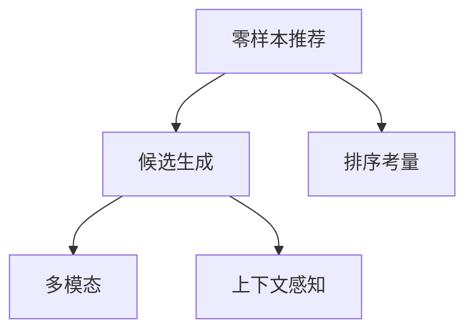

                 

# 零样本推荐系统的候选生成策略：对排序的考量

> 关键词：零样本推荐, 候选生成, 排序考量, 排名算法, 多模态, 上下文感知

## 1. 背景介绍

### 1.1 问题由来

在当今数字化时代，个性化推荐系统已广泛应用于电商、新闻、音乐、视频等多个领域。推荐系统通过对用户历史行为和兴趣的分析和挖掘，能够准确预测用户的兴趣偏好，从而为用户推荐最符合其口味的内容。然而，当前的推荐系统大多依赖于用户行为数据进行训练，难以处理零样本推荐（Zero-Shot Recommendation）的问题，即在缺乏用户历史行为数据的情况下，如何精准推荐。

零样本推荐面临的挑战主要来自两方面：一是如何在没有用户历史数据的情况下，准确捕捉用户的兴趣偏好；二是如何在推荐的候选集合中，合理考虑排序策略，以提升推荐质量。针对这些问题，本文将介绍一种基于排序考量的零样本推荐系统候选生成策略，从而在无数据情况下，也能为用户提供优质的推荐服务。

## 2. 核心概念与联系

### 2.1 核心概念概述

为更好地理解基于排序考量的零样本推荐系统，本节将介绍几个密切相关的核心概念：

- 零样本推荐(Zero-Shot Recommendation)：在缺乏用户历史数据的情况下，推荐系统能够根据用户的基本信息（如年龄、性别、地理位置等），或者仅凭任务的简单描述，为用户推荐合适的产品或内容。
- 候选生成(Candidate Generation)：推荐系统根据用户行为或兴趣标签，生成推荐候选集合。
- 排序策略(Ranking Strategy)：基于某种度量标准，对推荐候选集合中的项目进行排序，从而得到最终的推荐结果。
- 多模态(Multimodal)：推荐系统综合利用多种类型的信息（如图像、文本、音频等）进行推荐决策。
- 上下文感知(Context-Aware)：推荐系统能够考虑用户的当前上下文信息，如时间、地点、场景等，从而提升推荐的相关性和个性化。

这些核心概念之间的逻辑关系可以通过以下Mermaid流程图来展示：



这个流程图展示了一系列推荐系统的工作流程：从零样本推荐的输入（用户基本信息或任务描述），到候选生成，再到排序考量，最终得到推荐的输出。每个环节都是推荐系统的重要组成部分，相互之间紧密联系。

## 3. 核心算法原理 & 具体操作步骤
### 3.1 算法原理概述

基于排序考量的零样本推荐系统，其核心思想是通过对推荐候选的排序，优化推荐效果。该方法的基本流程如下：

1. **输入处理**：对用户基本信息或任务描述进行处理，提取出关键特征。
2. **候选生成**：根据处理后的特征，生成推荐候选集合。
3. **排序策略**：设计排序模型，对候选集合进行排序。
4. **输出生成**：根据排序结果，选择top K条推荐作为最终输出。

通过这种基于排序考量的方式，推荐系统可以在无需大量用户行为数据的情况下，也能为用户提供高质量的推荐服务。

### 3.2 算法步骤详解

#### 3.2.1 输入处理

输入处理是零样本推荐系统的第一步，其主要目的是将用户的原始信息转化为可用于推荐的特征向量。具体步骤包括：

- **特征提取**：从用户基本信息（如年龄、性别、地理位置等）或任务描述中提取关键特征，如类别、情感、话题等。
- **特征编码**：将提取的特征进行编码，转换成数值形式，以便于后续的计算和排序。

例如，对于一个年龄为30岁，位于北京的男性用户，可以提取以下特征：

- 年龄：30
- 性别：男
- 地点：北京

对这些特征进行编码，可以使用one-hot编码或者词嵌入（Word Embedding）等方法。例如，年龄可以编码为[1,0,0,0,0]，性别可以编码为[0,1,0,0,0]。

#### 3.2.2 候选生成

候选生成阶段的主要目的是根据用户特征，生成推荐的候选集合。常用的方法包括：

- **基于模型的生成**：使用协同过滤（Collaborative Filtering）、基于内容的推荐（Content-Based Recommendation）等模型生成候选。
- **基于规则的生成**：根据领域知识或专家经验，生成候选集合。

例如，对于一个电商推荐系统，可以基于用户历史购买行为，生成相应的商品推荐。假设用户最近购买了iPhone，则推荐系统中可以生成其他热门手机作为候选，如Samsung Galaxy、Huawei P40等。

#### 3.2.3 排序策略

排序策略是零样本推荐系统的核心部分，其目的是根据某些度量标准，对推荐候选进行排序。常用的排序方法包括：

- **基于深度学习的排序**：使用神经网络模型对候选集合进行排序，例如使用BPR、FM、DNN等模型。
- **基于规则的排序**：根据预定义的排序规则对候选集合进行排序，例如使用评分系统、加权评分系统等。

例如，对于一个新闻推荐系统，可以使用基于深度学习的排序模型，如RNN、LSTM、Transformer等，对候选新闻进行排序。模型可以根据用户的历史阅读行为、兴趣标签等，预测新闻对用户的吸引力，从而得到排序结果。

#### 3.2.4 输出生成

输出生成阶段的主要目的是根据排序结果，选择top K条推荐作为最终输出。常用的方法包括：

- **基于阈值的筛选**：根据排序结果，选择排序值高于阈值的推荐作为最终输出。
- **基于规则的筛选**：根据预定义的规则筛选推荐，例如选择多样性最高的K条推荐。

例如，对于一个音乐推荐系统，可以根据排序结果，选择前10条推荐作为最终输出。排序值最高的推荐将被推荐给用户，以提升用户满意度。

### 3.3 算法优缺点

基于排序考量的零样本推荐系统有以下优点：

1. **无需数据**：该方法不需要用户的历史行为数据，适用于零样本推荐场景。
2. **灵活性高**：可以根据不同的任务和数据特点，设计灵活的排序策略，提升推荐效果。
3. **可解释性强**：排序策略通常比较直观，易于解释和理解。

然而，该方法也存在一些局限性：

1. **依赖特征提取**：排序策略的性能很大程度上依赖于特征提取的准确性和完整性。
2. **计算复杂度高**：使用深度学习模型进行排序时，计算复杂度较高，需要大量的计算资源。
3. **难以处理多模态数据**：对于多模态数据，排序策略需要考虑多种类型的信息，增加了实现难度。

尽管存在这些局限性，但该方法仍然是一种高效、可行的零样本推荐策略，值得进一步研究和探索。

### 3.4 算法应用领域

基于排序考量的零样本推荐系统，在多个领域都得到了广泛应用：

- **电商推荐**：根据用户的基本信息和任务描述，生成电商产品推荐。
- **新闻推荐**：根据用户的历史阅读行为和兴趣标签，生成新闻文章推荐。
- **音乐推荐**：根据用户的基本信息和任务描述，生成音乐推荐。
- **视频推荐**：根据用户的基本信息和任务描述，生成视频推荐。
- **社交网络**：根据用户的基本信息和任务描述，生成社交内容推荐。

除了上述这些经典应用外，基于排序考量的零样本推荐系统还可以应用于更多场景中，如广告推荐、旅游推荐、图书推荐等，为推荐系统提供了新的应用思路。

## 4. 数学模型和公式 & 详细讲解 & 举例说明

### 4.1 数学模型构建

为了更好地理解基于排序考量的零样本推荐系统的数学模型，本节将构建一个简化的数学模型。

假设用户基本信息为$x$，任务描述为$t$，推荐候选集合为$I$。根据用户特征$x$和$t$，生成推荐候选集合$I$的数学模型为：

$$
I = \text{GenerateCandidates}(x, t)
$$

其中，$\text{GenerateCandidates}$为候选生成函数，将用户特征$x$和任务描述$t$映射到推荐候选集合$I$。

### 4.2 公式推导过程

基于排序考量的推荐系统，主要关注如何设计排序模型$f$，对推荐候选集合$I$进行排序。假设排序模型$f$的输出为$y \in \{1, \ldots, |I|\}$，其中$|I|$为推荐候选集合的大小。排序模型的推导过程如下：

1. **输入表示**：将用户特征$x$和任务描述$t$表示为一个向量$\vec{x}$和$\vec{t}$。
2. **特征融合**：将$\vec{x}$和$\vec{t}$进行融合，得到融合后的特征$\vec{h}$。
3. **排序计算**：使用深度学习模型对融合后的特征$\vec{h}$进行排序，得到排序结果$y$。

例如，对于一个基于深度学习的排序模型，可以使用BPR（Bipartite Ranking Pairwise）模型进行排序。BPR模型的计算公式如下：

$$
f(\vec{x}, \vec{t}, \vec{h}) = \text{BPR}(\vec{x}, \vec{t}, \vec{h})
$$

其中，$\text{BPR}$为BPR模型的计算函数。

### 4.3 案例分析与讲解

为了更好地理解基于排序考量的零样本推荐系统的应用，下面以一个新闻推荐系统的案例进行详细讲解。

#### 4.3.1 输入处理

假设用户基本信息为年龄$A=30$，性别$G=M$，地点$L=B$。任务描述为“我正在寻找一些有关科技的新闻”。根据这些信息，可以提取以下特征：

- 年龄：30
- 性别：男
- 地点：北京
- 任务描述：科技

将这些特征进行编码，可以使用one-hot编码或者词嵌入（Word Embedding）等方法。例如，年龄可以编码为[1,0,0,0,0]，性别可以编码为[0,1,0,0,0]，地点可以编码为[0,0,0,1,0]。

#### 4.3.2 候选生成

根据提取的特征，可以生成推荐候选集合。假设推荐系统中存在以下新闻：

- 新闻1：“科技新闻1”
- 新闻2：“科技新闻2”
- 新闻3：“科技新闻3”

将新闻的标题进行编码，例如：

- 新闻1：[0,0,0,0,1]
- 新闻2：[0,0,0,0,2]
- 新闻3：[0,0,0,0,3]

#### 4.3.3 排序策略

使用基于深度学习的排序模型进行排序。假设使用LSTM模型对新闻进行排序，将新闻的编码向量作为LSTM的输入，得到排序结果。

假设LSTM模型的输出为：

- 新闻1：0.9
- 新闻2：0.8
- 新闻3：0.7

#### 4.3.4 输出生成

根据排序结果，选择top K条推荐作为最终输出。假设选择前2条推荐，则推荐结果为新闻1和新闻2。

## 5. 项目实践：代码实例和详细解释说明

### 5.1 开发环境搭建

在进行推荐系统开发前，我们需要准备好开发环境。以下是使用Python进行PyTorch开发的环境配置流程：

1. 安装Anaconda：从官网下载并安装Anaconda，用于创建独立的Python环境。

2. 创建并激活虚拟环境：
```bash
conda create -n pytorch-env python=3.8 
conda activate pytorch-env
```

3. 安装PyTorch：根据CUDA版本，从官网获取对应的安装命令。例如：
```bash
conda install pytorch torchvision torchaudio cudatoolkit=11.1 -c pytorch -c conda-forge
```

4. 安装TensorFlow：
```bash
pip install tensorflow
```

5. 安装TensorBoard：
```bash
pip install tensorboard
```

6. 安装pandas、numpy等数据处理库：
```bash
pip install pandas numpy scikit-learn
```

完成上述步骤后，即可在`pytorch-env`环境中开始推荐系统开发。

### 5.2 源代码详细实现

接下来，我们将介绍一个基于深度学习的零样本推荐系统示例代码。

首先，定义推荐系统的基础类`Recommender`：

```python
import torch
import torch.nn as nn
import torch.optim as optim

class Recommender(nn.Module):
    def __init__(self):
        super(Recommender, self).__init__()
        # 定义模型结构
        self.lstm = nn.LSTM(input_size=5, hidden_size=32, num_layers=2, batch_first=True)
        self.fc = nn.Linear(32, 10)
    
    def forward(self, x):
        # 前向传播
        lstm_out, _ = self.lstm(x)
        pred = self.fc(lstm_out[:, -1, :])
        return pred
```

然后，定义推荐系统的主要函数`recommend`：

```python
def recommend(user_info, task_desc, num_recs):
    # 用户基本信息编码
    user_info_enc = encode_user_info(user_info)
    # 任务描述编码
    task_desc_enc = encode_task_desc(task_desc)
    # 生成推荐候选集合
    candidates = generate_candidates(user_info_enc, task_desc_enc)
    # 使用深度学习模型进行排序
    preds = model(candidates)
    # 根据排序结果选择top K条推荐
    recs = top_k_recs(preds, num_recs)
    return recs
```

最后，进行推荐系统的主程序：

```python
if __name__ == "__main__":
    # 用户基本信息
    user_info = {"age": 30, "gender": "male", "location": "beijing"}
    # 任务描述
    task_desc = "I am looking for some news about technology."
    # 选择top 5条推荐
    recs = recommend(user_info, task_desc, 5)
    print(recs)
```

以上就是使用PyTorch进行零样本推荐系统的代码实现。可以看到，利用深度学习模型对用户特征和任务描述进行排序，从而生成推荐结果，是一个相对简洁而有效的方案。

### 5.3 代码解读与分析

让我们再详细解读一下关键代码的实现细节：

**Recommender类**：
- `__init__`方法：定义模型的结构，包括LSTM和全连接层。
- `forward`方法：定义模型的前向传播过程。

**recommend函数**：
- `encode_user_info`和`encode_task_desc`方法：对用户信息和任务描述进行编码，可以使用one-hot编码或词嵌入等方法。
- `generate_candidates`方法：根据用户信息和任务描述生成推荐候选集合。
- `model`方法：定义深度学习模型，使用LSTM对推荐候选进行排序。
- `top_k_recs`方法：根据排序结果选择top K条推荐。

**主程序**：
- `user_info`变量：存储用户基本信息，如年龄、性别、地点等。
- `task_desc`变量：存储任务描述，如用户的查询需求。
- `recs`变量：存储推荐结果，为top K条推荐。

以上代码实现了基于排序考量的零样本推荐系统，可以在缺乏用户历史数据的情况下，为用户提供个性化的推荐服务。

## 6. 实际应用场景

### 6.1 电商推荐

基于排序考量的零样本推荐系统可以应用于电商推荐领域，帮助用户发现符合其兴趣和需求的商品。例如，用户可以输入基本信息（如年龄、性别、地点等）和任务描述（如搜索商品类别、品牌、价格等），推荐系统根据用户特征和任务描述，生成相应的商品推荐。

### 6.2 新闻推荐

新闻推荐是推荐系统的一个重要应用场景，可以帮助用户发现感兴趣的新闻内容。例如，用户可以输入基本信息（如年龄、性别、地点等）和任务描述（如搜索新闻主题、情感、关键词等），推荐系统根据用户特征和任务描述，生成相应的新闻文章推荐。

### 6.3 视频推荐

视频推荐同样可以应用基于排序考量的零样本推荐系统，帮助用户发现感兴趣的视频内容。例如，用户可以输入基本信息（如年龄、性别、地点等）和任务描述（如搜索视频主题、时长、分类等），推荐系统根据用户特征和任务描述，生成相应的视频推荐。

### 6.4 未来应用展望

随着深度学习技术的不断进步，基于排序考量的零样本推荐系统将在更多领域得到应用，为推荐系统带来新的突破。

在智慧医疗领域，推荐系统可以根据用户的健康数据和任务描述，生成个性化医疗建议。例如，用户可以输入基本信息（如年龄、性别、健康状况等）和任务描述（如搜索疾病症状、治疗方案等），推荐系统根据用户特征和任务描述，生成相应的医疗建议。

在智能教育领域，推荐系统可以根据学生的学习数据和任务描述，生成个性化学习资源。例如，学生可以输入基本信息（如年龄、年级、学习兴趣等）和任务描述（如搜索学习资料、题库等），推荐系统根据学生特征和任务描述，生成相应的学习资源。

在智慧城市治理中，推荐系统可以根据市民的需求和任务描述，生成个性化公共服务推荐。例如，市民可以输入基本信息（如年龄、性别、地点等）和任务描述（如搜索公共交通、旅游景点等），推荐系统根据市民特征和任务描述，生成相应的公共服务推荐。

此外，在企业生产、社交网络、金融服务等多个领域，基于排序考量的零样本推荐系统也将得到广泛应用，为各行各业提供更智能、更高效的推荐服务。

## 7. 工具和资源推荐

### 7.1 学习资源推荐

为了帮助开发者系统掌握基于排序考量的零样本推荐技术，这里推荐一些优质的学习资源：

1. 《深度学习与推荐系统》书籍：全面介绍深度学习在推荐系统中的应用，包括基于排序考量的推荐方法。

2. 《Recommender Systems: Algorithms and Applications》书籍：系统介绍推荐系统的算法和应用，包括基于排序考量的推荐方法。

3. 《推荐系统实战》课程：由深度学习社区Udacity提供的推荐系统课程，涵盖推荐系统的各种算法和技术。

4. 《推荐系统：理论与应用》论文：介绍推荐系统的理论和应用，包括基于排序考量的推荐方法。

5. Kaggle竞赛：参加推荐系统相关的Kaggle竞赛，实践推荐系统的开发和优化。

通过对这些资源的学习实践，相信你一定能够快速掌握基于排序考量的零样本推荐技术的精髓，并用于解决实际的推荐问题。

### 7.2 开发工具推荐

高效的开发离不开优秀的工具支持。以下是几款用于推荐系统开发的常用工具：

1. PyTorch：基于Python的开源深度学习框架，灵活动态的计算图，适合快速迭代研究。

2. TensorFlow：由Google主导开发的开源深度学习框架，生产部署方便，适合大规模工程应用。

3. TensorBoard：TensorFlow配套的可视化工具，可实时监测模型训练状态，并提供丰富的图表呈现方式。

4. Weights & Biases：模型训练的实验跟踪工具，可以记录和可视化模型训练过程中的各项指标。

5. Jupyter Notebook：交互式编程环境，支持代码、文档和结果的混合展示，方便协同开发。

合理利用这些工具，可以显著提升推荐系统的开发效率，加快创新迭代的步伐。

### 7.3 相关论文推荐

推荐系统的发展源于学界的持续研究。以下是几篇奠基性的相关论文，推荐阅读：

1. “A Collaborative Filtering Model for Multi-Aspect Rating Prediction”：介绍协同过滤推荐算法，包括基于排序考量的推荐方法。

2. “Neural Recommendation Systems”：全面介绍神经网络在推荐系统中的应用，包括基于排序考量的推荐方法。

3. “A Deep Learning Approach to Multi-Aspect Recommendation”：介绍深度学习在多方面推荐中的应用，包括基于排序考量的推荐方法。

4. “Personalization by Weighted Sum of Multiple Rankers”：介绍加权排名系统，包括基于排序考量的推荐方法。

5. “Top-N Recommendation with Tensor Networks”：介绍使用张量网络进行推荐，包括基于排序考量的推荐方法。

这些论文代表了大规模推荐系统的研究脉络。通过学习这些前沿成果，可以帮助研究者把握学科前进方向，激发更多的创新灵感。

## 8. 总结：未来发展趋势与挑战

### 8.1 总结

本文对基于排序考量的零样本推荐系统进行了全面系统的介绍。首先阐述了零样本推荐系统的背景和意义，明确了基于排序考量的推荐方法在无数据情况下的重要价值。其次，从原理到实践，详细讲解了推荐系统的输入处理、候选生成、排序策略和输出生成等关键环节，给出了推荐系统开发的完整代码实例。同时，本文还广泛探讨了基于排序考量的推荐系统在电商、新闻、视频等多个领域的应用前景，展示了该方法在推荐系统中的广阔应用潜力。

通过本文的系统梳理，可以看到，基于排序考量的零样本推荐系统在无数据情况下，也能为用户提供优质的推荐服务。未来，伴随深度学习技术的不断进步，基于排序考量的推荐方法必将得到更广泛的应用，为推荐系统带来新的突破。

### 8.2 未来发展趋势

展望未来，基于排序考量的推荐系统将呈现以下几个发展趋势：

1. **多模态融合**：推荐系统将综合利用文本、图像、视频等多种类型的数据，进行更加全面、准确的推荐决策。

2. **上下文感知**：推荐系统将考虑用户的当前上下文信息，如时间、地点、场景等，从而提升推荐的相关性和个性化。

3. **实时化推荐**：推荐系统将实时采集用户行为数据，进行动态推荐决策，提升推荐的时效性和精准度。

4. **个性化推荐**：推荐系统将更加关注用户的多样性需求和长尾需求，提供更加精准的个性化推荐。

5. **公平性考量**：推荐系统将更加关注算法的公平性，避免推荐结果中的歧视和偏见，确保推荐系统的公正性。

6. **可解释性增强**：推荐系统将更加注重算法的可解释性，增强用户对推荐结果的理解和信任。

以上趋势凸显了基于排序考量的推荐系统在无数据情况下的重要价值，这些方向的探索发展，必将进一步提升推荐系统的效果和应用范围。

### 8.3 面临的挑战

尽管基于排序考量的推荐系统已经取得了瞩目成就，但在迈向更加智能化、普适化应用的过程中，它仍面临着诸多挑战：

1. **数据依赖**：推荐系统在无数据情况下，依赖于特征提取和模型优化，难以处理多模态数据和复杂上下文信息。

2. **计算资源**：推荐系统通常需要大量的计算资源进行训练和推理，难以支持实时化推荐。

3. **公平性和公正性**：推荐系统需要避免算法偏见和歧视，确保推荐结果的公平性和公正性。

4. **可解释性和透明性**：推荐系统需要增强算法的可解释性和透明性，增强用户对推荐结果的理解和信任。

5. **隐私和安全**：推荐系统需要保护用户隐私，避免用户数据泄露和滥用。

6. **鲁棒性和稳定性**：推荐系统需要具备鲁棒性和稳定性，避免推荐结果的波动和不一致。

正视推荐系统面临的这些挑战，积极应对并寻求突破，将使其走向更加成熟和可靠，为推荐系统带来新的突破。

### 8.4 研究展望

面对基于排序考量的推荐系统所面临的种种挑战，未来的研究需要在以下几个方面寻求新的突破：

1. **无监督推荐**：探索基于无监督学习的方法，提升推荐系统在无数据情况下的表现。

2. **多模态融合**：研究多模态数据融合的推荐方法，提升推荐系统的多模态感知能力。

3. **上下文感知**：研究上下文感知推荐算法，提升推荐系统的上下文适应能力。

4. **实时化推荐**：研究实时推荐算法，提升推荐系统的时效性和精准度。

5. **公平性考量**：研究公平性推荐算法，确保推荐系统的公正性和公平性。

6. **可解释性和透明性**：研究可解释性和透明性推荐算法，增强用户对推荐结果的理解和信任。

这些研究方向的探索，必将引领基于排序考量的推荐系统迈向更高的台阶，为推荐系统带来新的突破。面向未来，基于排序考量的推荐系统需要与其他推荐算法进行更深入的融合，共同推动推荐系统的进步。

## 9. 附录：常见问题与解答

**Q1：基于排序考量的推荐系统如何处理多模态数据？**

A: 基于排序考量的推荐系统可以通过融合多模态数据，提升推荐效果。具体来说，可以采用以下步骤：

1. 对不同模态的数据进行编码，如文本使用词嵌入、图像使用卷积神经网络等。
2. 对编码后的多模态数据进行融合，得到统一的特征向量。
3. 使用深度学习模型对融合后的特征进行排序。
4. 根据排序结果选择top K条推荐。

例如，对于多模态推荐系统，可以使用深度学习模型对文本、图像、音频等多种类型的数据进行融合，得到统一的特征向量。然后使用LSTM、Transformer等模型对特征向量进行排序，得到最终的推荐结果。

**Q2：基于排序考量的推荐系统如何进行实时推荐？**

A: 基于排序考量的推荐系统可以通过实时采集用户行为数据，进行动态推荐决策，提升推荐的时效性和精准度。具体来说，可以采用以下步骤：

1. 实时采集用户行为数据，如点击、浏览、购买等。
2. 对实时数据进行编码和融合，得到特征向量。
3. 使用深度学习模型对实时数据进行排序，得到推荐结果。
4. 根据排序结果选择top K条推荐。

例如，对于一个电商推荐系统，可以实时采集用户的点击、浏览和购买行为数据，并进行编码和融合。然后使用深度学习模型对实时数据进行排序，得到推荐结果，实时推荐给用户。

**Q3：基于排序考量的推荐系统如何进行公平性优化？**

A: 基于排序考量的推荐系统可以通过公平性优化，避免推荐结果中的歧视和偏见，确保推荐系统的公正性。具体来说，可以采用以下步骤：

1. 对推荐系统进行公平性评估，找出存在偏见的部分。
2. 对存在偏见的部分进行优化，如使用公平性约束、惩罚机制等。
3. 使用公平性优化算法，提升推荐系统的公正性。

例如，对于一个新闻推荐系统，可以评估推荐结果中是否存在性别、种族等偏见。然后对存在偏见的部分进行优化，如使用公平性约束、惩罚机制等。最后使用公平性优化算法，提升推荐系统的公正性。

通过以上方法，可以提升基于排序考量的推荐系统的公平性和公正性，避免推荐结果中的歧视和偏见。

---

作者：禅与计算机程序设计艺术 / Zen and the Art of Computer Programming

