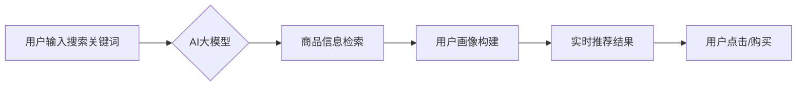

                 

## AI 大模型在电商搜索推荐中的实时推荐策略：抓住用户需求的瞬时变化

> 关键词：电商搜索推荐、AI大模型、实时推荐、用户需求、个性化推荐、推荐算法、深度学习、Transformer模型

## 1. 背景介绍

在当今数字经济时代，电商平台已成为人们获取商品和服务的首选渠道。搜索推荐作为电商平台的核心功能之一，直接影响着用户体验和商业转化率。传统的搜索推荐系统主要依赖于基于规则的匹配和协同过滤算法，但这些方法难以捕捉用户需求的复杂性和瞬时变化。

随着人工智能技术的快速发展，特别是深度学习技术的突破，AI大模型在电商搜索推荐领域展现出巨大的潜力。AI大模型能够学习海量用户行为数据和商品信息，构建更精准的用户画像和商品理解模型，从而实现更个性化、更智能的实时推荐。

## 2. 核心概念与联系

### 2.1  电商搜索推荐

电商搜索推荐是指在用户输入搜索关键词或浏览商品页面时，根据用户的历史行为、偏好和上下文信息，推荐相关商品或服务，引导用户发现感兴趣的产品，提升用户体验和转化率。

### 2.2  AI大模型

AI大模型是指在海量数据上训练的深度学习模型，拥有强大的泛化能力和学习能力。常见的AI大模型包括Transformer模型、BERT模型、GPT模型等。

### 2.3  实时推荐

实时推荐是指根据用户实时行为和上下文信息，动态调整推荐结果，提供更及时、更精准的推荐服务。

**核心概念与联系流程图**



## 3. 核心算法原理 & 具体操作步骤

### 3.1  算法原理概述

实时推荐算法的核心是利用AI大模型学习用户行为数据和商品信息，构建用户画像和商品理解模型，并根据用户的实时行为和上下文信息，动态调整推荐结果。常用的算法包括：

* **基于用户的协同过滤:** 根据用户的历史行为数据，推荐与用户兴趣相似的其他用户的商品。
* **基于物品的协同过滤:** 根据商品之间的相似度，推荐与用户之前浏览过的商品相似的商品。
* **深度学习推荐:** 利用深度学习模型，学习用户行为数据和商品信息之间的复杂关系，进行更精准的推荐。

### 3.2  算法步骤详解

1. **数据收集和预处理:** 收集用户行为数据、商品信息数据等，并进行清洗、转换、特征提取等预处理工作。
2. **用户画像构建:** 利用机器学习算法，构建用户的兴趣偏好、购买习惯、浏览历史等特征，形成用户画像。
3. **商品理解模型训练:** 利用深度学习模型，学习商品的类别、属性、描述等信息，构建商品理解模型。
4. **实时推荐模型训练:** 利用用户画像和商品理解模型，训练实时推荐模型，例如基于Transformer模型的推荐模型。
5. **实时推荐结果生成:** 当用户进行搜索或浏览商品时，根据用户的实时行为和上下文信息，利用实时推荐模型生成推荐结果。

### 3.3  算法优缺点

**优点:**

* **个性化推荐:** 能够根据用户的个性化需求，提供更精准的推荐结果。
* **实时更新:** 可以根据用户的实时行为和上下文信息，动态调整推荐结果，提供更及时、更准确的推荐服务。
* **数据驱动:** 基于海量用户行为数据和商品信息，能够不断优化推荐算法，提升推荐效果。

**缺点:**

* **数据依赖:** 需要大量的用户行为数据和商品信息进行训练，否则推荐效果会下降。
* **模型复杂:** 深度学习模型的训练和部署需要较高的技术水平和计算资源。
* **冷启动问题:** 对新用户和新商品的推荐效果可能较差。

### 3.4  算法应用领域

实时推荐算法广泛应用于电商平台、社交媒体、内容平台等领域，例如：

* **商品推荐:** 根据用户的搜索历史、浏览记录、购买行为等信息，推荐相关的商品。
* **内容推荐:** 根据用户的阅读习惯、点赞记录、评论行为等信息，推荐相关的文章、视频、音频等内容。
* **广告推荐:** 根据用户的兴趣偏好、浏览习惯等信息，推荐相关的广告。

## 4. 数学模型和公式 & 详细讲解 & 举例说明

### 4.1  数学模型构建

在电商搜索推荐中，常用的数学模型包括协同过滤模型、深度学习模型等。

**协同过滤模型:**

协同过滤模型基于用户的行为相似度进行推荐。例如，基于用户的协同过滤模型可以利用以下公式计算用户u和用户v之间的相似度:

$$
Sim(u,v) = \frac{\sum_{i=1}^{n} r_{ui} * r_{vi}}{\sqrt{\sum_{i=1}^{n} r_{ui}^2} * \sqrt{\sum_{i=1}^{n} r_{vi}^2}}
$$

其中，$r_{ui}$表示用户u对商品i的评分，$n$表示商品总数。

**深度学习模型:**

深度学习模型可以利用多层神经网络学习用户行为数据和商品信息之间的复杂关系。例如，基于Transformer模型的推荐模型可以利用以下公式计算用户对商品的评分:

$$
Score(u,i) = \text{Transformer}(user\_embedding(u), item\_embedding(i))
$$

其中，$user\_embedding(u)$和$item\_embedding(i)$分别表示用户u和商品i的嵌入向量，$\text{Transformer}$表示Transformer模型。

### 4.2  公式推导过程

协同过滤模型的相似度公式是基于余弦相似度的计算，其原理是计算两个向量的夹角，夹角越小，相似度越高。

深度学习模型的评分公式是基于Transformer模型的注意力机制，其原理是通过学习用户和商品之间的上下文关系，计算用户对商品的评分。

### 4.3  案例分析与讲解

**案例:**

假设有一个电商平台，用户A和用户B都购买了商品1和商品2，但用户A对商品3没有评分，用户B对商品3评分为5。

**协同过滤模型:**

根据用户A和用户B的评分数据，可以计算出他们的相似度。由于用户A和用户B都购买了商品1和商品2，因此他们的相似度较高。

**深度学习模型:**

深度学习模型可以学习到用户A和用户B的购买习惯，并预测用户A对商品3的评分。由于用户B对商品3评分为5，并且用户A和用户B的相似度较高，因此深度学习模型可能会预测用户A对商品3的评分也为5。

## 5. 项目实践：代码实例和详细解释说明

### 5.1  开发环境搭建

* **操作系统:** Linux/macOS
* **编程语言:** Python
* **深度学习框架:** TensorFlow/PyTorch
* **数据存储:** MySQL/MongoDB

### 5.2  源代码详细实现

```python
# 导入必要的库
import tensorflow as tf

# 定义用户和商品的嵌入向量
user_embedding = tf.keras.layers.Embedding(input_dim=1000, output_dim=64)
item_embedding = tf.keras.layers.Embedding(input_dim=1000, output_dim=64)

# 定义Transformer模型
transformer = tf.keras.Sequential([
    user_embedding,
    item_embedding,
    # ... Transformer模型层
])

# 训练模型
transformer.compile(optimizer='adam', loss='mse')
transformer.fit(user_data, item_data, epochs=10)

# 生成推荐结果
user_id = 123
item_ids = transformer.predict(user_id)
```

### 5.3  代码解读与分析

* **用户和商品嵌入:** 使用Embedding层将用户ID和商品ID映射到低维向量空间，方便模型学习用户和商品之间的关系。
* **Transformer模型:** 使用Transformer模型学习用户和商品之间的上下文关系，并预测用户对商品的评分。
* **模型训练:** 使用Adam优化器和均方误差损失函数训练模型。
* **推荐结果生成:** 根据用户的ID，利用训练好的模型预测用户对商品的评分，并排序推荐结果。

### 5.4  运行结果展示

运行代码后，可以得到用户对商品的评分预测结果，并根据评分排序推荐商品。

## 6. 实际应用场景

### 6.1  电商平台商品推荐

* **个性化商品推荐:** 根据用户的浏览历史、购买记录、收藏列表等信息，推荐个性化的商品。
* **新品推荐:** 推送新上市的商品，吸引用户关注。
* **关联推荐:** 根据用户浏览的商品，推荐相关的商品，例如“顾客也购买了”。

### 6.2  内容平台内容推荐

* **个性化内容推荐:** 根据用户的阅读习惯、点赞记录、评论行为等信息，推荐个性化的文章、视频、音频等内容。
* **热点内容推荐:** 推送当前热门的内容，吸引用户关注。
* **内容分类推荐:** 根据用户的兴趣偏好，推荐相关的分类内容。

### 6.3  社交媒体好友推荐

* **兴趣相投好友推荐:** 根据用户的兴趣爱好、好友关系等信息，推荐兴趣相投的好友。
* **共同好友推荐:** 推荐与用户有共同好友的朋友。
* **地理位置推荐:** 推荐附近的用户。

### 6.4  未来应用展望

随着AI技术的不断发展，实时推荐算法将在更多领域得到应用，例如：

* **医疗保健:** 根据患者的病史、症状、基因信息等数据，推荐个性化的医疗方案。
* **教育:** 根据学生的学习进度、兴趣爱好、学习风格等数据，推荐个性化的学习资源。
* **金融:** 根据用户的财务状况、风险偏好等数据，推荐个性化的理财产品。

## 7. 工具和资源推荐

### 7.1  学习资源推荐

* **书籍:**
    * 《深度学习》
    * 《自然语言处理》
    * 《推荐系统》
* **在线课程:**
    * Coursera
    * edX
    * Udacity

### 7.2  开发工具推荐

* **深度学习框架:** TensorFlow, PyTorch
* **数据处理工具:** Pandas, NumPy
* **云计算平台:** AWS, Azure, GCP

### 7.3  相关论文推荐

* **BERT:** Devlin, J., Chang, M. W., Lee, K., & Toutanova, K. (2018). BERT: Pre-training of deep bidirectional transformers for language understanding. arXiv preprint arXiv:1810.04805.
* **Transformer:** Vaswani, A., Shazeer, N., Parmar, N., Uszkoreit, J., Jones, L., Gomez, A. N., ... & Polosukhin, I. (2017). Attention is all you need. In Advances in neural information processing systems (pp. 5998-6008).

## 8. 总结：未来发展趋势与挑战

### 8.1  研究成果总结

AI大模型在电商搜索推荐领域取得了显著的成果，能够提供更个性化、更精准的推荐服务，提升用户体验和商业转化率。

### 8.2  未来发展趋势

* **模型更深更广:** 探索更深层次、更广范围的AI大模型，例如多模态大模型，能够融合文本、图像、音频等多种数据信息，提供更全面的用户理解和商品推荐。
* **个性化更精准:** 利用更先进的机器学习算法和数据分析技术，实现更精准的个性化推荐，满足用户多样化的需求。
* **实时性更强:** 利用实时数据流和边缘计算技术，实现更实时、更动态的推荐服务，及时捕捉用户需求的变化。

### 8.3  面临的挑战

* **数据安全和隐私:** AI大模型需要大量用户数据进行训练，如何保障用户数据安全和隐私是重要的挑战。
* **模型解释性和可控性:** 深度学习模型的决策过程往往难以解释，如何提高模型的解释性和可控性，避免模型偏差和歧视，是需要解决的关键问题。
* **计算资源和成本:** 训练和部署大型AI模型需要大量的计算资源和成本，如何降低模型训练和部署成本，是需要探索的方向。

### 8.4  研究展望

未来，AI大模型在电商搜索推荐领域将继续发挥重要作用，推动电商平台的智能化发展。研究者需要不断探索新的算法、模型和技术，解决面临的挑战，为用户提供更智能、更便捷的购物体验。

## 9. 附录：常见问题与解答

**Q1: 如何评估实时推荐算法的效果？**

**A1:** 实时推荐算法的效果可以评估指标包括点击率（CTR）、转化率（CVR）、用户满意度等。

**Q2: 如何处理冷启动问题？**

**A2:** 冷启动问题可以通过以下方法解决：

* 利用用户画像和商品特征进行推荐。
* 利用协同过滤算法，从已有的用户数据中挖掘相似用户或商品。
* 利用知识图谱和商品属性信息进行推荐。

**Q3: 如何保障用户数据安全和隐私？**

**A3:** 保障用户数据安全和隐私可以通过以下方法实现：

* 使用加密技术保护用户数据。
*  anonymize用户数据，去除敏感信息。
* 遵守数据隐私法规，获得用户的同意。


作者：禅与计算机程序设计艺术 / Zen and the Art of Computer Programming 
<end_of_turn>

