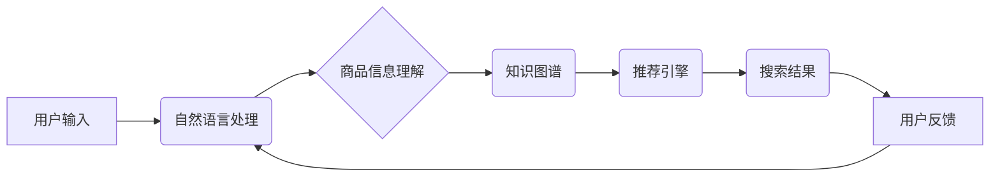

                 

## AI+电商搜索大盘点：资本集中下注的细分赛道

> 关键词：电商搜索、人工智能、推荐系统、自然语言处理、深度学习、信息检索、机器学习、知识图谱

## 1. 背景介绍

电商行业作为数字经济的重要组成部分，其发展速度惊人。随着电商平台的规模不断扩大，用户搜索需求日益复杂，传统的基于关键词匹配的搜索引擎已难以满足用户多样化的需求。因此，人工智能技术在电商搜索领域的应用成为必然趋势。

AI+电商搜索是指利用人工智能技术，例如自然语言处理（NLP）、深度学习、机器学习等，对电商平台的搜索引擎进行升级改造，提升搜索结果的精准度、相关性和用户体验。

近年来，资本市场对AI+电商搜索领域表现出浓厚的兴趣，众多知名投资机构纷纷加大投资力度。这表明AI+电商搜索已经成为电商行业发展的重要方向，其市场潜力巨大。

## 2. 核心概念与联系

**2.1 核心概念**

* **电商搜索:** 指用户在电商平台上输入关键词或商品信息，平台根据算法匹配并返回相关商品的搜索结果。
* **人工智能 (AI):** 指能够模拟人类智能行为的计算机系统，例如学习、推理、决策等。
* **自然语言处理 (NLP):** 指让计算机能够理解、处理和生成人类语言的技术。
* **深度学习 (DL):** 指一种机器学习算法，通过多层神经网络模拟人类大脑的学习过程。
* **推荐系统:** 指根据用户的历史行为、偏好等信息，推荐用户可能感兴趣的商品或内容的系统。

**2.2 架构关系**



**2.3 核心联系**

电商搜索的核心是将用户需求与商品信息进行匹配。AI技术可以帮助电商平台更好地理解用户的搜索意图，并根据用户的历史行为、偏好等信息，推荐更精准、更相关的商品。

## 3. 核心算法原理 & 具体操作步骤

**3.1 算法原理概述**

AI+电商搜索的核心算法主要包括：

* **信息检索算法:** 用于从海量商品数据中检索出与用户搜索关键词相关的商品。
* **推荐算法:** 用于根据用户的历史行为、偏好等信息，推荐用户可能感兴趣的商品。
* **自然语言处理算法:** 用于理解用户的搜索意图，例如识别关键词、实体、情感等。

**3.2 算法步骤详解**

1. **用户输入:** 用户在电商平台上输入搜索关键词或商品信息。
2. **预处理:** 对用户输入进行预处理，例如去除停用词、 stemming、 lemmatization 等。
3. **关键词提取:** 使用NLP算法提取用户搜索关键词。
4. **信息检索:** 使用信息检索算法从商品数据库中检索出与关键词相关的商品。
5. **排序:** 使用推荐算法对检索结果进行排序，将与用户需求最匹配的商品排在前面。
6. **结果展示:** 将排序后的商品信息展示给用户。

**3.3 算法优缺点**

* **优点:** 能够提升搜索结果的精准度、相关性和用户体验。
* **缺点:** 需要大量的训练数据和计算资源，算法模型的更新和维护需要持续投入。

**3.4 算法应用领域**

* **电商搜索:** 提升电商平台的搜索引擎效果，提高用户购物体验。
* **内容推荐:** 推荐用户可能感兴趣的新闻、视频、文章等内容。
* **个性化服务:** 根据用户的行为和偏好，提供个性化的产品推荐、服务和广告。

## 4. 数学模型和公式 & 详细讲解 & 举例说明

**4.1 数学模型构建**

电商搜索的推荐算法通常基于协同过滤或内容过滤的数学模型。

* **协同过滤:** 基于用户的历史行为和商品的相似度进行推荐。
* **内容过滤:** 基于商品的特征和用户的偏好进行推荐。

**4.2 公式推导过程**

协同过滤算法中常用的公式包括：

* **余弦相似度:** 用于计算两个用户的行为向量之间的相似度。

$$
\text{相似度} = \frac{\mathbf{u} \cdot \mathbf{v}}{\|\mathbf{u}\| \|\mathbf{v}\|}
$$

其中，$\mathbf{u}$ 和 $\mathbf{v}$ 分别表示两个用户的行为向量，$\cdot$ 表示点积，$\|\mathbf{u}\|$ 和 $\|\mathbf{v}\|$ 分别表示两个向量的模长。

**4.3 案例分析与讲解**

假设有两个用户A和B，他们的行为向量分别为：

* $\mathbf{u} = [1, 0, 1, 0]$
* $\mathbf{v} = [0, 1, 1, 0]$

则它们的余弦相似度为：

$$
\text{相似度} = \frac{(1 \times 0) + (0 \times 1) + (1 \times 1) + (0 \times 0)}{\sqrt{1^2 + 0^2 + 1^2 + 0^2} \sqrt{0^2 + 1^2 + 1^2 + 0^2}} = \frac{1}{\sqrt{2} \sqrt{2}} = \frac{1}{2}
$$

该结果表明用户A和B的行为向量之间存在一定的相似度。

## 5. 项目实践：代码实例和详细解释说明

**5.1 开发环境搭建**

* Python 3.x
* TensorFlow 或 PyTorch
* Numpy
* Pandas

**5.2 源代码详细实现**

```python
import numpy as np
from sklearn.metrics.pairwise import cosine_similarity

# 用户行为数据
user_data = np.array([
    [1, 0, 1, 0],  # 用户A
    [0, 1, 1, 0],  # 用户B
    [1, 1, 0, 1]   # 用户C
])

# 计算用户之间的余弦相似度
similarity_matrix = cosine_similarity(user_data)

# 打印相似度矩阵
print(similarity_matrix)
```

**5.3 代码解读与分析**

* 该代码首先定义了用户行为数据，每个用户行为向量表示用户对不同商品的评分或购买行为。
* 然后使用Scikit-learn库中的`cosine_similarity`函数计算用户之间的余弦相似度。
* 最后打印出相似度矩阵，其中每个元素表示两个用户之间的相似度。

**5.4 运行结果展示**

运行该代码后，会输出一个相似度矩阵，例如：

```
[[1.         0.5        0.70710678]
 [0.5        1.         0.70710678]
 [0.70710678 0.70710678 1.        ]]
```

该矩阵表明用户A和B之间的相似度为0.5，用户A和C之间的相似度为0.707，用户B和C之间的相似度也为0.707。

## 6. 实际应用场景

**6.1 个性化推荐:**

AI+电商搜索可以根据用户的历史购买记录、浏览记录、收藏记录等信息，推荐用户可能感兴趣的商品。例如，如果用户经常购买运动鞋，电商平台可以推荐用户其他运动品牌或运动服饰。

**6.2 搜索结果优化:**

AI+电商搜索可以根据用户的搜索关键词和历史行为，优化搜索结果的排序和展示。例如，如果用户搜索“手机”，AI+电商搜索可以根据用户的品牌偏好、价格偏好等信息，优先展示用户可能感兴趣的手机品牌和型号。

**6.3 智能客服:**

AI+电商搜索可以用于构建智能客服系统，帮助用户解决购物过程中遇到的问题。例如，用户可以通过语音或文本输入询问商品信息、配送时间、退换货政策等问题，智能客服系统可以根据用户的需求提供相应的答案。

**6.4 未来应用展望**

* **多模态搜索:** 将文本、图像、语音等多种数据类型融合在一起，实现更全面的商品搜索。
* **场景化推荐:** 根据用户的购物场景，例如节日、生日、旅行等，提供更精准的商品推荐。
* **虚拟试衣间:** 利用AR/VR技术，让用户在虚拟空间中试穿商品，提升购物体验。

## 7. 工具和资源推荐

**7.1 学习资源推荐**

* **书籍:**
    * 《深度学习》
    * 《机器学习实战》
    * 《自然语言处理入门》
* **在线课程:**
    * Coursera
    * edX
    * Udacity

**7.2 开发工具推荐**

* **Python:** 
    * TensorFlow
    * PyTorch
    * Scikit-learn
* **云平台:**
    * AWS
    * Azure
    * Google Cloud

**7.3 相关论文推荐**

* **BERT:** Devlin et al. (2018)
* **Transformer:** Vaswani et al. (2017)
* **Recurrent Neural Networks for Sequence Learning:** Hochreiter & Schmidhuber (1997)

## 8. 总结：未来发展趋势与挑战

**8.1 研究成果总结**

AI+电商搜索技术取得了显著进展，例如推荐算法的精度不断提升，搜索结果的个性化程度不断增强。

**8.2 未来发展趋势**

* **多模态搜索:** 将文本、图像、语音等多种数据类型融合在一起，实现更全面的商品搜索。
* **场景化推荐:** 根据用户的购物场景，例如节日、生日、旅行等，提供更精准的商品推荐。
* **个性化定制:** 利用AI技术，为用户提供个性化的商品设计和定制服务。

**8.3 面临的挑战**

* **数据质量:** AI算法的性能依赖于高质量的数据，电商平台需要不断收集和清洗用户数据。
* **算法解释性:** 许多AI算法的决策过程难以解释，这可能会导致用户对搜索结果的信任度降低。
* **隐私保护:** AI+电商搜索需要处理大量用户隐私数据，平台需要采取有效的措施保护用户隐私。

**8.4 研究展望**

未来，AI+电商搜索领域的研究将更加注重算法的解释性、隐私保护和可持续发展。


## 9. 附录：常见问题与解答

**9.1 如何提高搜索结果的精准度？**

* 丰富用户数据，例如用户购买记录、浏览记录、收藏记录等。
* 使用更先进的推荐算法，例如深度学习算法。
* 优化搜索引擎的架构和算法，例如使用知识图谱技术。

**9.2 如何解决算法的解释性问题？**

* 使用可解释性AI算法，例如LIME、SHAP等。
* 开发可视化工具，帮助用户理解算法的决策过程。
* 建立透明的算法评估机制，公开算法的优缺点。

**9.3 如何保护用户隐私？**

* 采用数据加密技术，保护用户敏感数据。
* 使用匿名化技术，隐藏用户的个人信息。
* 遵循数据隐私法规，例如GDPR、CCPA等。


作者：禅与计算机程序设计艺术 / Zen and the Art of Computer Programming 
<end_of_turn>

