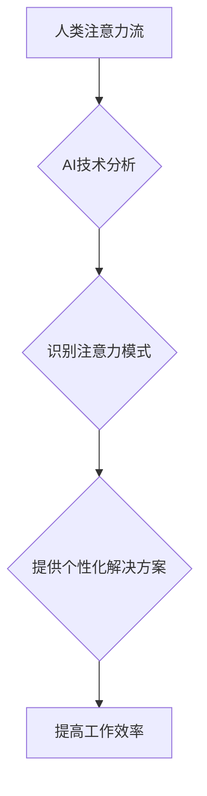

                 

## 关键词：人工智能、注意力流、工作模式、技能发展、注意力管理、未来趋势

## 1. 背景介绍

在信息爆炸的时代，人类的注意力成为了稀缺资源。我们每天被来自各种渠道的信息轰炸，从手机通知到社交媒体推送，从电子邮件到新闻网站，无处不在的干扰不断拉扯着我们的注意力。在这种情况下，人工智能（AI）技术应运而生，它不仅能够帮助我们处理海量信息，更能深刻地理解人类注意力流的运作机制，并提供针对性的解决方案。

随着AI技术的不断发展，它在各个领域都展现出强大的应用潜力，从自动驾驶到医疗诊断，从个性化教育到智能客服，AI正在改变着我们的生活方式。然而，AI的发展也带来了新的挑战，其中之一就是如何与人类注意力流相协调。

## 2. 核心概念与联系

### 2.1 人类注意力流

人类注意力流是一个复杂而动态的过程，它涉及到认知、情感和行为等多个方面。简单来说，注意力流是指我们对特定信息或任务的集中和持续关注。它是一个有限的资源，容易受到干扰和分散。

### 2.2 人工智能与注意力流

AI技术能够通过分析大量数据，识别和预测人类注意力流的模式。例如，AI算法可以分析用户的浏览历史、点击行为、阅读时长等数据，从而了解用户的兴趣偏好和注意力集中程度。

基于对注意力流的理解，AI可以提供个性化的信息推荐、智能提醒、注意力管理工具等，帮助用户更好地集中注意力，提高工作效率。

**Mermaid 流程图**



## 3. 核心算法原理 & 具体操作步骤

### 3.1 算法原理概述

目前，在AI与注意力流领域，常用的算法包括：

* **深度学习算法**: 能够学习复杂的非线性关系，用于预测用户注意力流的模式。
* **强化学习算法**: 通过奖励机制，训练AI模型学习如何引导用户注意力，提高任务完成效率。
* **自然语言处理算法**: 用于分析用户文本数据，识别用户的情绪、意图和注意力焦点。

### 3.2 算法步骤详解

以深度学习算法为例，其具体操作步骤如下：

1. **数据收集**: 收集用户浏览历史、点击行为、阅读时长等数据，构建用户注意力流数据集。
2. **数据预处理**: 对数据进行清洗、转换、特征提取等操作，使其适合深度学习模型训练。
3. **模型构建**: 选择合适的深度学习模型架构，例如循环神经网络（RNN）或Transformer，并进行参数初始化。
4. **模型训练**: 使用训练数据训练深度学习模型，调整模型参数，使其能够准确预测用户注意力流的模式。
5. **模型评估**: 使用测试数据评估模型的性能，例如准确率、召回率等指标。
6. **模型部署**: 将训练好的模型部署到实际应用场景中，例如个性化信息推荐系统或注意力管理工具。

### 3.3 算法优缺点

**优点**:

* 能够学习复杂的注意力流模式。
* 具有较高的预测精度。
* 可以根据用户行为进行动态调整。

**缺点**:

* 需要大量的数据进行训练。
* 模型训练过程复杂，需要专业的技术人员。
* 存在隐私安全问题。

### 3.4 算法应用领域

* **个性化信息推荐**: 根据用户的注意力流模式，推荐更符合其兴趣的内容。
* **注意力管理工具**: 提供提醒、屏蔽干扰等功能，帮助用户集中注意力。
* **教育领域**: 根据学生的注意力流模式，提供个性化的学习方案。
* **医疗诊断**: 分析患者的注意力流模式，辅助医生进行诊断。

## 4. 数学模型和公式 & 详细讲解 & 举例说明

### 4.1 数学模型构建

我们可以用一个简单的数学模型来描述用户对特定内容的注意力流：

$$
Attention(t) = \frac{e^{Relevance(t)}}{\sum_{i=1}^{N} e^{Relevance(i)}}
$$

其中：

* $Attention(t)$ 表示用户在时间 $t$ 对特定内容的注意力分数。
* $Relevance(t)$ 表示用户对特定内容在时间 $t$ 的相关性得分。
* $N$ 表示所有内容的数量。

### 4.2 公式推导过程

该公式基于softmax函数，将所有内容的注意力分数归一化到0到1之间。

* $e^{Relevance(t)}$ 表示用户对特定内容的兴趣程度，通过指数函数放大相关性得分。
* $\sum_{i=1}^{N} e^{Relevance(i)}$ 表示所有内容的兴趣总和。

通过softmax函数，我们可以得到每个内容在用户注意力中的占比。

### 4.3 案例分析与讲解

假设用户正在阅读一篇文章，文章包含三个段落。

* 段落1的Relevance得分是2，段落2的Relevance得分是1，段落3的Relevance得分是3。

根据公式，我们可以计算出用户对每个段落的注意力分数：

* $Attention(1) = \frac{e^{2}}{e^{2} + e^{1} + e^{3}} \approx 0.55$
* $Attention(2) = \frac{e^{1}}{e^{2} + e^{1} + e^{3}} \approx 0.22$
* $Attention(3) = \frac{e^{3}}{e^{2} + e^{1} + e^{3}} \approx 0.23$

由此可见，用户对段落3的注意力最高，其次是段落1，最后是段落2。

## 5. 项目实践：代码实例和详细解释说明

### 5.1 开发环境搭建

* Python 3.x
* TensorFlow 或 PyTorch 深度学习框架
* Jupyter Notebook 或 VS Code 开发环境

### 5.2 源代码详细实现

```python
import tensorflow as tf

# 定义模型架构
model = tf.keras.Sequential([
    tf.keras.layers.Embedding(input_dim=vocab_size, output_dim=embedding_dim),
    tf.keras.layers.LSTM(units=128),
    tf.keras.layers.Dense(units=1, activation='sigmoid')
])

# 编译模型
model.compile(optimizer='adam', loss='binary_crossentropy', metrics=['accuracy'])

# 训练模型
model.fit(x_train, y_train, epochs=10, batch_size=32)

# 评估模型
loss, accuracy = model.evaluate(x_test, y_test)
print('Loss:', loss)
print('Accuracy:', accuracy)
```

### 5.3 代码解读与分析

* 该代码示例展示了使用TensorFlow框架构建一个简单的深度学习模型，用于预测用户对特定内容的注意力流。
* 模型架构包含嵌入层、LSTM层和全连接层。
* 嵌入层将单词转换为向量表示。
* LSTM层能够学习文本序列中的长短时依赖关系。
* 全连接层输出用户对特定内容的注意力分数。
* 模型使用Adam优化器、二元交叉熵损失函数和准确率作为评估指标。

### 5.4 运行结果展示

训练完成后，我们可以使用测试数据评估模型的性能，并根据模型输出的注意力分数，对用户进行个性化推荐或提供注意力管理建议。

## 6. 实际应用场景

### 6.1 个性化信息推荐

AI可以根据用户的注意力流模式，推荐更符合其兴趣的内容，例如新闻、视频、商品等。

### 6.2 智能客服

AI可以分析用户的聊天记录，识别用户的意图和问题，并提供更精准的回复，提高客服效率。

### 6.3 教育领域

AI可以根据学生的注意力流模式，提供个性化的学习方案，例如调整学习节奏、推荐学习资源等。

### 6.4 未来应用展望

* **沉浸式体验**: AI可以根据用户的注意力流模式，提供更沉浸式的游戏、虚拟现实和增强现实体验。
* **脑机接口**: AI可以与脑机接口技术结合，直接读取用户的注意力流信息，实现更直观的交互方式。
* **健康监测**: AI可以分析用户的注意力流模式，辅助医生监测用户的健康状况，例如抑郁症、焦虑症等。

## 7. 工具和资源推荐

### 7.1 学习资源推荐

* **书籍**:
    * 《深度学习》
    * 《强化学习：原理、算法和应用》
* **在线课程**:
    * Coursera
    * edX
    * Udacity

### 7.2 开发工具推荐

* **TensorFlow**: 开源深度学习框架
* **PyTorch**: 开源深度学习框架
* **Jupyter Notebook**: 交互式编程环境

### 7.3 相关论文推荐

* **Attention Is All You Need**: https://arxiv.org/abs/1706.03762
* **BERT**: https://arxiv.org/abs/1810.04805

## 8. 总结：未来发展趋势与挑战

### 8.1 研究成果总结

AI与注意力流的研究取得了显著进展，已经能够有效地预测和管理用户的注意力流。

### 8.2 未来发展趋势

* **更精准的注意力预测**: 利用更先进的深度学习算法和神经网络架构，提高注意力预测的精度。
* **更个性化的注意力管理**: 根据用户的不同需求和习惯，提供更个性化的注意力管理方案。
* **跨模态注意力流**: 研究不同模态（文本、图像、音频等）之间的注意力流关系，实现更全面的注意力理解。

### 8.3 面临的挑战

* **数据隐私**: AI模型训练需要大量用户数据，如何保护用户隐私是一个重要的挑战。
* **算法解释性**: 深度学习模型的决策过程往往难以解释，如何提高算法的透明度和可解释性是一个关键问题。
* **伦理问题**: AI技术可能会被用于操控用户注意力，因此需要制定相应的伦理规范和监管机制。

### 8.4 研究展望

未来，AI与注意力流的研究将继续深入，为我们提供更智能、更个性化的体验，同时也需要我们认真思考AI技术带来的伦理和社会影响，确保其健康发展。

## 9. 附录：常见问题与解答

### 9.1 如何提高注意力集中度？

* **创造安静的工作环境**: 减少外界干扰，专注于眼前的任务。
* **使用番茄工作法**: 将工作时间划分为25分钟的间隔，每间隔后休息5分钟，提高工作效率。
* **练习冥想**: 培养专注力和自我意识，增强注意力控制能力。

### 9.2 AI会取代人类吗？

AI技术的发展会改变一些工作模式，但不会完全取代人类。人类拥有创造力、情感智力和复杂问题解决能力，这些都是AI难以替代的。


作者：禅与计算机程序设计艺术 / Zen and the Art of Computer Programming 
<end_of_turn>

