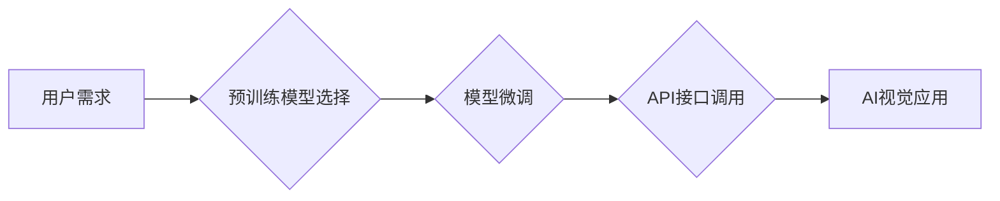

                 

## AI创业的风险与机遇：Lepton AI的案例分析

> 关键词：人工智能创业、Lepton AI、风险评估、机遇分析、商业模式、技术创新、伦理挑战

## 1. 背景介绍

人工智能（AI）技术近年来发展迅速，其广泛的应用潜力吸引了众多创业者和投资者。AI创业公司涌现，致力于将AI技术应用于各个领域，从医疗保健到金融科技，再到自动驾驶和个性化教育。然而，AI创业也面临着诸多风险和挑战，需要创业者谨慎评估和应对。本文将以Lepton AI为例，分析AI创业的风险与机遇，并探讨其背后的核心概念、算法原理、项目实践以及未来发展趋势。

Lepton AI是一家专注于开发基于深度学习的计算机视觉解决方案的创业公司。其核心产品是Lepton AI平台，该平台提供了一系列预训练模型和工具，帮助开发者快速构建和部署AI视觉应用。Lepton AI的客户涵盖了多个行业，包括零售、制造、医疗保健和交通运输。

## 2. 核心概念与联系

Lepton AI的核心技术是深度学习，特别是卷积神经网络（CNN）。CNN是一种专门用于处理图像数据的网络结构，能够学习图像特征并进行分类、识别和检测等任务。

Lepton AI平台基于以下核心概念：

* **预训练模型:** Lepton AI提供了一系列预训练的CNN模型，这些模型已经经过大量图像数据的训练，具备强大的图像识别能力。开发者可以利用这些预训练模型，快速构建自己的AI视觉应用，无需从头训练模型。
* **微调机制:** 开发者可以根据自己的特定应用需求，对预训练模型进行微调，进一步提高模型的性能。
* **API接口:** Lepton AI平台提供了一套完善的API接口，方便开发者将AI视觉功能集成到自己的应用程序中。

**Mermaid 流程图:**



## 3. 核心算法原理 & 具体操作步骤

### 3.1  算法原理概述

Lepton AI平台的核心算法是基于CNN的图像识别算法。CNN由多个卷积层、池化层和全连接层组成。卷积层负责提取图像特征，池化层负责降低特征维度，全连接层负责进行分类或识别。

### 3.2  算法步骤详解

1. **数据预处理:** 将图像数据预处理，例如调整大小、归一化等。
2. **卷积层:** 使用卷积核对图像进行卷积运算，提取图像特征。
3. **池化层:** 对卷积层的输出进行池化运算，降低特征维度。
4. **全连接层:** 将池化层的输出连接到全连接层，进行分类或识别。
5. **输出层:** 输出分类结果或识别结果。

### 3.3  算法优缺点

**优点:**

* **高识别精度:** CNN能够学习到图像的复杂特征，从而实现高识别精度。
* **自动化学习:** CNN能够自动学习图像特征，无需人工特征工程。
* **可移植性:** 预训练模型可以应用于不同的图像识别任务。

**缺点:**

* **计算资源消耗:** CNN训练需要大量的计算资源。
* **数据依赖性:** CNN的性能依赖于训练数据的质量和数量。
* **可解释性差:** CNN的决策过程难以解释。

### 3.4  算法应用领域

Lepton AI平台的图像识别算法应用于多个领域，包括：

* **零售:** 商品识别、库存管理、顾客行为分析。
* **制造:** 产品缺陷检测、质量控制、自动导引车。
* **医疗保健:** 病灶检测、图像分割、辅助诊断。
* **交通运输:** 车辆识别、行人检测、自动驾驶。

## 4. 数学模型和公式 & 详细讲解 & 举例说明

### 4.1  数学模型构建

Lepton AI平台的图像识别算法基于CNN，其数学模型可以概括为以下公式：

$$
y = f(W_L * ReLU(W_{L-1} * ... * ReLU(W_1 * x)) + b_L)
$$

其中：

* $x$ 是输入图像数据。
* $W_i$ 是第 $i$ 层的卷积核。
* $ReLU$ 是ReLU激活函数。
* $b_i$ 是第 $i$ 层的偏置项。
* $f$ 是输出层的激活函数。
* $y$ 是输出结果。

### 4.2  公式推导过程

CNN的数学模型推导过程涉及到卷积运算、池化运算、激活函数和全连接运算等多个步骤。

* **卷积运算:** 卷积运算通过卷积核对图像进行滑动计算，提取图像特征。卷积运算的数学公式如下：

$$
y_{ij} = \sum_{m=0}^{M-1} \sum_{n=0}^{N-1} x_{i+m, j+n} * W_{m,n}
$$

其中：

* $x_{i+m, j+n}$ 是图像数据中的像素值。
* $W_{m,n}$ 是卷积核中的权重值。
* $y_{ij}$ 是卷积运算后的特征值。

* **池化运算:** 池化运算对卷积层的输出进行降维，减少计算量。常用的池化方法包括最大池化和平均池化。

* **激活函数:** 激活函数引入非线性，使CNN能够学习到更复杂的特征。常用的激活函数包括ReLU、Sigmoid和Tanh。

* **全连接运算:** 全连接层将池化层的输出连接到全连接层，进行分类或识别。全连接层的数学公式如下：

$$
z_i = \sum_{j=1}^{N} w_{ij} * a_j + b_i
$$

其中：

* $a_j$ 是池化层的输出值。
* $w_{ij}$ 是全连接层的权重值。
* $b_i$ 是全连接层的偏置项。
* $z_i$ 是全连接层的输出值。

### 4.3  案例分析与讲解

Lepton AI平台可以用于识别不同类型的水果。例如，可以训练一个CNN模型，使其能够识别苹果、香蕉和橙子。

训练过程如下：

1. 收集大量苹果、香蕉和橙子的图像数据。
2. 将图像数据预处理，例如调整大小、归一化等。
3. 使用CNN模型对图像数据进行训练，学习识别水果的特征。
4. 对训练好的模型进行测试，评估其识别精度。

## 5. 项目实践：代码实例和详细解释说明

### 5.1  开发环境搭建

Lepton AI平台可以使用Python语言开发。开发环境需要安装Python、TensorFlow或PyTorch等深度学习框架以及必要的库。

### 5.2  源代码详细实现

Lepton AI平台的源代码示例如下：

```python
import tensorflow as tf

# 定义CNN模型
model = tf.keras.models.Sequential([
    tf.keras.layers.Conv2D(32, (3, 3), activation='relu', input_shape=(224, 224, 3)),
    tf.keras.layers.MaxPooling2D((2, 2)),
    tf.keras.layers.Conv2D(64, (3, 3), activation='relu'),
    tf.keras.layers.MaxPooling2D((2, 2)),
    tf.keras.layers.Flatten(),
    tf.keras.layers.Dense(10, activation='softmax')
])

# 编译模型
model.compile(optimizer='adam',
              loss='sparse_categorical_crossentropy',
              metrics=['accuracy'])

# 训练模型
model.fit(x_train, y_train, epochs=10)

# 评估模型
loss, accuracy = model.evaluate(x_test, y_test)
print('Test loss:', loss)
print('Test accuracy:', accuracy)
```

### 5.3  代码解读与分析

这段代码定义了一个简单的CNN模型，并使用TensorFlow框架进行训练和评估。

* `tf.keras.models.Sequential` 创建了一个顺序模型，即层级结构。
* `tf.keras.layers.Conv2D` 定义了卷积层，用于提取图像特征。
* `tf.keras.layers.MaxPooling2D` 定义了最大池化层，用于降低特征维度。
* `tf.keras.layers.Flatten` 将多维特征转换为一维向量。
* `tf.keras.layers.Dense` 定义了全连接层，用于分类或识别。
* `model.compile` 编译模型，指定优化器、损失函数和评价指标。
* `model.fit` 训练模型，使用训练数据进行训练。
* `model.evaluate` 评估模型，使用测试数据进行评估。

### 5.4  运行结果展示

训练完成后，可以将模型应用于新的图像数据进行识别。例如，可以将一张新的苹果图像输入到模型中，模型会输出苹果的识别结果。

## 6. 实际应用场景

Lepton AI平台的图像识别算法在多个实际应用场景中发挥着重要作用。

### 6.1  零售行业

* **商品识别:** Lepton AI可以帮助零售商识别商品，自动生成商品标签和价格信息，提高商品管理效率。
* **库存管理:** Lepton AI可以帮助零售商实时监控库存，自动补货，避免缺货和积压。
* **顾客行为分析:** Lepton AI可以分析顾客在店内行为，例如浏览商品、停留时间等，帮助零售商了解顾客需求，优化店内布局和营销策略。

### 6.2  制造行业

* **产品缺陷检测:** Lepton AI可以帮助制造商检测产品缺陷，提高产品质量。
* **质量控制:** Lepton AI可以帮助制造商监控生产过程，确保产品符合质量标准。
* **自动导引车:** Lepton AI可以帮助制造商实现自动导引车，提高生产效率。

### 6.3  医疗保健行业

* **病灶检测:** Lepton AI可以帮助医生检测图像中的病灶，提高诊断准确率。
* **图像分割:** Lepton AI可以帮助医生分割图像中的不同器官或组织，方便医生进行分析和治疗。
* **辅助诊断:** Lepton AI可以帮助医生辅助诊断疾病，提供更精准的治疗方案。

### 6.4  未来应用展望

Lepton AI平台的图像识别算法在未来将有更广泛的应用场景。例如，可以应用于自动驾驶、人脸识别、视频监控等领域。随着AI技术的不断发展，Lepton AI平台将不断更新和迭代，为用户提供更强大的图像识别解决方案。

## 7. 工具和资源推荐

### 7.1  学习资源推荐

* **深度学习书籍:**

    * 《深度学习》 by Ian Goodfellow, Yoshua Bengio, and Aaron Courville
    * 《动手学深度学习》 by Aurélien Géron

* **在线课程:**

    * Coursera: Deep Learning Specialization
    * Udacity: Deep Learning Nanodegree

### 7.2  开发工具推荐

* **深度学习框架:** TensorFlow, PyTorch, Keras
* **图像处理库:** OpenCV, Pillow

### 7.3  相关论文推荐

* **AlexNet:** ImageNet Classification with Deep Convolutional Neural Networks
* **VGGNet:** Very Deep Convolutional Networks for Large-Scale Image Recognition
* **ResNet:** Deep Residual Learning for Image Recognition

## 8. 总结：未来发展趋势与挑战

### 8.1  研究成果总结

Lepton AI平台的图像识别算法取得了显著的成果，在多个实际应用场景中发挥着重要作用。其核心技术是基于CNN的深度学习，能够学习到图像的复杂特征，实现高识别精度。

### 8.2  未来发展趋势

Lepton AI平台的未来发展趋势包括：

* **模型更深更广:** 探索更深层次和更广阔的网络结构，提高模型的识别能力。
* **数据更丰富更精准:** 收集更多高质量的图像数据，并进行数据增强和标注，提高模型的训练效果。
* **应用场景更广泛:** 将图像识别算法应用于更多领域，例如自动驾驶、人脸识别、视频监控等。
* **边缘计算:** 将图像识别算法部署到边缘设备，实现实时识别和处理。

### 8.3  面临的挑战

Lepton AI平台也面临着一些挑战，例如：

* **计算资源消耗:** 训练深度学习模型需要大量的计算资源，成本较高。
* **数据依赖性:** 模型的性能依赖于训练数据的质量和数量，数据获取和标注成本较高。
* **可解释性差:** 深度学习模型的决策过程难以解释，缺乏透明度。
* **伦理挑战:** 图像识别算法可能存在偏见和歧视问题，需要进行伦理评估和监管。

### 8.4  研究展望

Lepton AI平台将继续致力于解决这些挑战，不断提升图像识别算法的性能和可靠性，为用户提供更强大的图像识别解决方案。

## 9. 附录：常见问题与解答

**Q1: Lepton AI平台的图像识别算法是否适用于所有类型的图像？**

A1: Lepton AI平台的图像识别算法主要适用于自然图像，例如人脸、物体、场景等。对于一些特殊类型的图像，例如医学图像或卫星图像，可能需要进行专门的训练和调整。

**Q2: Lepton AI平台的图像识别算法需要多少数据才能训练？**

A2: 训练深度学习模型需要大量的图像数据，数量通常在数千到数百万级别。具体的数据量取决于模型的复杂度和任务的难度。

**Q3: Lepton AI平台的图像识别算法是否可以部署到移动设备？**

A3: 

Lepton AI平台的图像识别算法可以部署到移动设备，但需要进行模型压缩和优化，以降低模型大小和计算资源消耗。

**Q4: Lepton AI平台的图像识别算法是否可以识别特定类型的物体？**

A4: 

是的，Lepton AI平台可以识别特定类型的物体。可以通过对预训练模型进行微调，使其能够识别特定的物体类别。

**Q5: Lepton AI平台的图像识别算法是否可以进行视频分析？**

A5: 

Lepton AI平台的图像识别算法可以应用于视频分析，例如物体跟踪、行为识别等。

作者：禅与计算机程序设计艺术 / Zen and the Art of Computer Programming


<end_of_turn>

