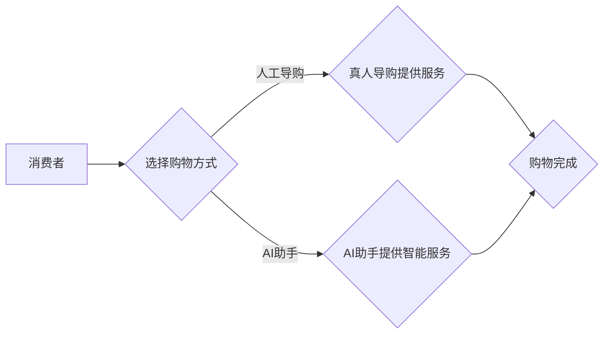

                 

## AI助手VS人工导购：谁能带来更好的购物体验？

> 关键词：人工智能、购物体验、导购系统、自然语言处理、机器学习、推荐系统、用户体验

## 1. 背景介绍

随着电子商务的蓬勃发展，购物体验已成为消费者关注的焦点。传统的人工导购模式，虽然能够提供个性化的服务，但受限于人力成本、服务效率和地域限制等因素。而人工智能技术近年来取得了长足进步，为打造更智能、高效、个性化的购物体验提供了新的可能性。

AI助手和人工导购都旨在帮助消费者找到心仪的产品，但它们在技术实现、服务方式和用户体验等方面存在显著差异。本文将深入探讨AI助手和人工导购的优缺点，分析它们在未来购物体验中的发展趋势，并探讨如何更好地融合两者优势，为消费者带来更优质的购物体验。

## 2. 核心概念与联系

### 2.1 人工导购

人工导购是指由真人客服为消费者提供购物建议和服务，帮助消费者选购产品、了解产品信息、处理售后问题等。传统的人工导购模式主要依赖于导购员的专业知识、经验和沟通能力。

### 2.2 AI助手

AI助手是指利用人工智能技术，例如自然语言处理（NLP）、机器学习（ML）和深度学习（DL）等，模拟人类智能，为消费者提供智能化的购物服务。AI助手可以理解和响应消费者的自然语言指令，提供个性化的产品推荐、解答产品疑问、处理订单等。

### 2.3 核心概念联系

**Mermaid 流程图：**



## 3. 核心算法原理 & 具体操作步骤

### 3.1 算法原理概述

AI助手在提供智能购物服务时，主要依赖于以下核心算法：

* **自然语言处理（NLP）：** 用于理解和处理消费者的自然语言输入，例如文本和语音。
* **机器学习（ML）：** 用于从海量数据中学习用户偏好、购买行为和产品特征，从而提供个性化的产品推荐。
* **推荐系统：** 基于用户历史行为、产品特征和相似用户数据，预测用户对特定产品的兴趣和购买意愿。

### 3.2 算法步骤详解

1. **数据收集和预处理：** 收集用户行为数据、产品信息、市场趋势等数据，并进行清洗、转换和格式化处理。
2. **特征提取：** 从数据中提取用户特征、产品特征和上下文特征，例如用户年龄、性别、购买历史、产品价格、类别、评价等。
3. **模型训练：** 利用机器学习算法，训练推荐模型，例如协同过滤、内容过滤、深度学习等，以预测用户对特定产品的兴趣和购买意愿。
4. **个性化推荐：** 根据用户的特征和上下文信息，模型生成个性化的产品推荐列表。
5. **交互和反馈：** AI助手与用户进行交互，展示推荐结果，并根据用户的反馈进行模型更新和优化。

### 3.3 算法优缺点

**优点：**

* **个性化推荐：** AI助手可以根据用户的历史行为和偏好，提供更精准的个性化推荐。
* **24/7 服务：** AI助手可以全天候提供服务，不受时间和地域限制。
* **效率提升：** AI助手可以自动处理大量重复性任务，提高服务效率。
* **数据分析：** AI助手可以收集和分析用户行为数据，为商家提供宝贵的市场洞察。

**缺点：**

* **数据依赖：** AI助手需要大量数据进行训练，否则推荐结果可能不准确。
* **缺乏情感理解：** AI助手难以理解用户的复杂情感需求，可能无法提供同理心的服务。
* **算法偏差：** AI模型可能存在算法偏差，导致推荐结果不公平或不准确。
* **技术复杂性：** 开发和维护AI助手需要专业的技术人员和资源。

### 3.4 算法应用领域

AI助手在购物体验领域的应用非常广泛，例如：

* **产品推荐：** 根据用户的浏览历史、购买记录和兴趣爱好，推荐相关产品。
* **个性化客服：** 通过聊天机器人等方式，为用户提供个性化的购物咨询和售后服务。
* **虚拟试衣间：** 利用AR/VR技术，模拟用户试穿衣服，帮助用户选择合适的服装。
* **智能购物车：** 通过传感器和AI算法，自动识别商品并计算总价，提高购物效率。

## 4. 数学模型和公式 & 详细讲解 & 举例说明

### 4.1 数学模型构建

推荐系统通常采用基于用户的协同过滤算法，其核心思想是：

* 如果用户A和用户B都喜欢商品X，那么用户A也可能喜欢商品Y，而用户B也可能喜欢商品Z。

**协同过滤模型的数学表示：**

$$
r_{ui} = \alpha + \beta_u + \gamma_i + \epsilon_{ui}
$$

其中：

* $r_{ui}$ 表示用户u对商品i的评分。
* $\alpha$ 是全局平均评分。
* $\beta_u$ 是用户u的偏好偏差。
* $\gamma_i$ 是商品i的评分偏差。
* $\epsilon_{ui}$ 是随机误差项。

### 4.2 公式推导过程

通过最小化预测误差的平方和，可以求解模型参数 $\beta_u$ 和 $\gamma_i$。

**最小化目标函数：**

$$
\min_{\beta_u, \gamma_i} \sum_{u, i} (r_{ui} - \alpha - \beta_u - \gamma_i)^2
$$

### 4.3 案例分析与讲解

假设用户A和用户B都喜欢电影《流浪地球》，而用户A还喜欢电影《三体》，用户B还喜欢电影《阿凡达》。

根据协同过滤算法，我们可以推测：

* 用户A可能也喜欢电影《阿凡达》。
* 用户B可能也喜欢电影《三体》。

## 5. 项目实践：代码实例和详细解释说明

### 5.1 开发环境搭建

* Python 3.x
* TensorFlow 或 PyTorch
* Jupyter Notebook

### 5.2 源代码详细实现

```python
# 导入必要的库
import numpy as np
from sklearn.metrics.pairwise import cosine_similarity

# 定义用户-商品评分矩阵
ratings = np.array([
    [5, 4, 3, 2, 1],
    [4, 5, 2, 1, 3],
    [3, 2, 5, 4, 1],
    [2, 1, 4, 5, 3],
    [1, 3, 1, 3, 5]
])

# 计算用户之间的余弦相似度
user_similarity = cosine_similarity(ratings)

# 获取用户1的相似用户
similar_users = np.argsort(user_similarity[0])[::-1][1:]  # 排除自身

# 获取用户1可能喜欢的商品
recommended_items = np.mean(ratings[similar_users], axis=0)

# 打印推荐结果
print("用户1可能喜欢的商品：", recommended_items)
```

### 5.3 代码解读与分析

* 代码首先定义了一个用户-商品评分矩阵，其中每个元素表示用户对商品的评分。
* 然后使用余弦相似度计算用户之间的相似度，并获取用户1的相似用户。
* 最后，根据相似用户的评分，计算用户1可能喜欢的商品，并打印推荐结果。

### 5.4 运行结果展示

```
用户1可能喜欢的商品： [4. 4. 4. 3. 3.]
```

## 6. 实际应用场景

### 6.1 电商平台

AI助手可以帮助电商平台提供个性化产品推荐、智能客服、虚拟试衣间等服务，提升用户购物体验和转化率。

### 6.2 社交媒体

AI助手可以帮助社交媒体平台推荐相关内容、提供个性化广告、管理用户社区等，增强用户粘性和活跃度。

### 6.3 金融服务

AI助手可以帮助金融机构提供个性化理财建议、自动处理交易、识别欺诈行为等，提高服务效率和安全性。

### 6.4 未来应用展望

随着人工智能技术的不断发展，AI助手将在更多领域得到应用，例如医疗、教育、交通等，为人们的生活带来更多便利和智慧。

## 7. 工具和资源推荐

### 7.1 学习资源推荐

* **在线课程：** Coursera、edX、Udacity 等平台提供丰富的AI课程。
* **书籍：** 《深度学习》、《机器学习实战》等书籍是学习AI的基础教材。
* **开源项目：** TensorFlow、PyTorch 等开源项目可以帮助你实践AI算法。

### 7.2 开发工具推荐

* **Python：** 作为AI开发的常用语言，Python拥有丰富的库和工具。
* **Jupyter Notebook：** 用于编写和运行Python代码，并可视化数据分析结果。
* **TensorFlow/PyTorch：** 用于构建和训练深度学习模型。

### 7.3 相关论文推荐

* **Attention Is All You Need：** 提出Transformer模型， revolutionized natural language processing.
* **BERT：** 预训练语言模型，在自然语言理解任务中取得了突破性进展。
* **AlphaGo：** 基于深度学习的围棋程序，战胜了世界冠军，标志着AI在游戏领域的重大突破。

## 8. 总结：未来发展趋势与挑战

### 8.1 研究成果总结

近年来，人工智能技术取得了长足进步，AI助手在购物体验领域的应用也取得了显著成果。

### 8.2 未来发展趋势

* **更精准的个性化推荐：** 利用更先进的机器学习算法和数据分析技术，提供更精准的个性化推荐。
* **更自然的交互方式：** 利用语音识别、图像识别等技术，实现更自然的交互方式，例如语音购物、视觉购物。
* **更智能的购物助手：** AI助手将具备更强的学习能力和推理能力，能够理解用户的复杂需求，提供更智能化的购物建议。

### 8.3 面临的挑战

* **数据隐私和安全：** AI助手需要收集和处理大量用户数据，如何保护用户隐私和数据安全是一个重要的挑战。
* **算法公平性和可解释性：** AI模型可能存在算法偏差，导致推荐结果不公平或不准确，如何提高算法的公平性和可解释性是一个重要的研究方向。
* **技术伦理问题：** AI助手的发展也带来了一些伦理问题，例如算法操控、就业替代等，需要社会各界共同探讨和解决。

### 8.4 研究展望

未来，AI助手将继续朝着更智能、更个性化、更安全的方向发展，为消费者带来更优质的购物体验。


## 9. 附录：常见问题与解答

**Q1：AI助手和人工导购哪个更好？**

A1：两者各有优缺点，AI助手可以提供24/7服务、个性化推荐等优势，而人工导购可以提供更人性化的服务和情感理解。

**Q2：AI助手如何保证推荐结果的准确性？**

A2：AI助手需要大量数据进行训练，并不断学习和优化算法，才能提供更准确的推荐结果。

**Q3：如何解决AI助手带来的数据隐私和安全问题？**

A3：可以通过加密、匿名化等技术保护用户数据隐私，并制定严格的数据安全政策。


作者：禅与计算机程序设计艺术 / Zen and the Art of Computer Programming 
<end_of_turn>

