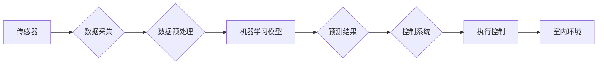

                 

## AI在智能空气质量管理中的应用：改善室内环境

> 关键词：人工智能、空气质量、室内环境、传感器、机器学习、预测模型、优化控制

## 1. 背景介绍

随着全球环境污染加剧，空气质量问题日益突出，室内空气污染也成为人们关注的焦点。传统空气质量监测方法往往依赖于固定监测点的数据，无法实时、全面地反映室内空气质量状况。而人工智能技术的快速发展为智能空气质量管理提供了新的解决方案。

智能空气质量管理系统利用传感器、机器学习算法和控制系统等技术，能够实时监测室内空气质量，并根据监测数据进行分析和预测，从而实现对室内环境的智能控制和优化。

## 2. 核心概念与联系

### 2.1  核心概念

* **空气质量监测:** 通过传感器采集室内空气中的各种污染物浓度数据，例如PM2.5、CO2、TVOC等。
* **机器学习:** 利用算法从历史数据中学习模式，预测未来空气质量变化趋势。
* **智能控制:** 根据预测结果，自动调节室内环境参数，例如通风、净化、温度等，以维持良好的空气质量。

### 2.2  架构图



## 3. 核心算法原理 & 具体操作步骤

### 3.1  算法原理概述

智能空气质量管理系统通常采用以下机器学习算法：

* **回归算法:** 用于预测空气质量指标的数值变化趋势，例如线性回归、支持向量回归等。
* **分类算法:** 用于判断空气质量等级，例如决策树、随机森林、神经网络等。

### 3.2  算法步骤详解

1. **数据采集:** 使用传感器采集室内空气质量数据，包括污染物浓度、温度、湿度、光照等。
2. **数据预处理:** 对采集到的数据进行清洗、转换、归一化等处理，去除噪声和异常值，以便于模型训练。
3. **模型训练:** 选择合适的机器学习算法，利用预处理后的数据训练模型，学习空气质量变化的规律。
4. **模型评估:** 使用测试数据评估模型的性能，例如准确率、召回率、F1-score等。
5. **模型部署:** 将训练好的模型部署到智能空气质量管理系统中，用于实时预测空气质量变化趋势。
6. **控制策略:** 根据预测结果，制定相应的控制策略，例如开启通风系统、启动空气净化器、调节温度湿度等。

### 3.3  算法优缺点

* **优点:**

    * 能够实时、准确地预测空气质量变化趋势。
    * 可以根据预测结果自动调节室内环境参数，维持良好的空气质量。
    * 能够提供个性化的空气质量管理方案。

* **缺点:**

    * 需要大量的历史数据进行模型训练。
    * 模型的准确性受数据质量和算法选择的影响。
    * 系统的成本相对较高。

### 3.4  算法应用领域

* **家庭:** 智能空气净化器、智能家居系统。
* **办公场所:** 智能办公环境管理系统。
* **医疗机构:** 智能病房环境控制系统。
* **学校:** 智能教室环境管理系统。

## 4. 数学模型和公式 & 详细讲解 & 举例说明

### 4.1  数学模型构建

智能空气质量管理系统通常采用以下数学模型：

* **线性回归模型:** 用于预测空气质量指标的数值变化趋势。
* **多元线性回归模型:** 用于预测多个空气质量指标的数值变化趋势。
* **时间序列模型:** 用于预测空气质量指标的未来变化趋势，例如ARIMA模型、SARIMA模型等。

### 4.2  公式推导过程

**线性回归模型:**

假设空气质量指标 $y$ 与时间 $t$ 和其他因素 $x_1, x_2, ..., x_n$ 的关系可以用线性方程表示：

$$y = \beta_0 + \beta_1 t + \beta_2 x_1 + \beta_3 x_2 + ... + \beta_n x_n + \epsilon$$

其中:

* $\beta_0, \beta_1, \beta_2, ..., \beta_n$ 是模型参数，需要通过最小二乘法估计。
* $\epsilon$ 是误差项。

**多元线性回归模型:**

与线性回归模型类似，多元线性回归模型可以预测多个空气质量指标的数值变化趋势。

### 4.3  案例分析与讲解

假设我们想要预测室内PM2.5浓度的变化趋势，并已收集到以下数据：

* 时间 $t$ (小时)
* 温度 $x_1$ (°C)
* 湿度 $x_2$ (%)
* 通风次数 $x_3$ (次/小时)
* PM2.5浓度 $y$ (μg/m³)

我们可以使用多元线性回归模型来建立预测模型，并根据模型结果预测未来PM2.5浓度。

## 5. 项目实践：代码实例和详细解释说明

### 5.1  开发环境搭建

* 操作系统: Ubuntu 20.04
* Python 版本: 3.8
* 必要的库: pandas, numpy, scikit-learn, matplotlib

### 5.2  源代码详细实现

```python
import pandas as pd
from sklearn.linear_model import LinearRegression
from sklearn.model_selection import train_test_split
from sklearn.metrics import mean_squared_error

# 导入数据
data = pd.read_csv('indoor_air_quality.csv')

# 选择特征和目标变量
X = data[['time', 'temperature', 'humidity', 'ventilation']]
y = data['pm25']

# 将数据分为训练集和测试集
X_train, X_test, y_train, y_test = train_test_split(X, y, test_size=0.2, random_state=42)

# 创建线性回归模型
model = LinearRegression()

# 训练模型
model.fit(X_train, y_train)

# 预测测试集数据
y_pred = model.predict(X_test)

# 计算模型性能
mse = mean_squared_error(y_test, y_pred)
print(f'Mean Squared Error: {mse}')

# 可视化预测结果
import matplotlib.pyplot as plt
plt.scatter(y_test, y_pred)
plt.xlabel('Actual PM2.5')
plt.ylabel('Predicted PM2.5')
plt.title('Linear Regression Model Performance')
plt.show()
```

### 5.3  代码解读与分析

* 代码首先导入必要的库，并读取室内空气质量数据。
* 然后选择特征和目标变量，将数据分为训练集和测试集。
* 创建线性回归模型，并使用训练集训练模型。
* 使用训练好的模型预测测试集数据，并计算模型性能。
* 最后使用 matplotlib 库可视化预测结果。

### 5.4  运行结果展示

运行代码后，会输出模型的均方误差值，以及预测结果与实际值的散点图。

## 6. 实际应用场景

### 6.1  家庭应用

智能空气净化器可以根据室内空气质量监测数据，自动调节净化效率，并提供空气质量指数和污染物来源分析等信息，帮助用户更好地了解和管理室内空气质量。

### 6.2  办公场所应用

智能办公环境管理系统可以根据办公室人员数量、活动情况等因素，自动调节通风、温度、湿度等参数，营造舒适健康的办公环境，提高员工的工作效率和健康水平。

### 6.3  医疗机构应用

智能病房环境控制系统可以根据患者的病情和生理指标，自动调节病房内的空气质量、温度、湿度等参数，为患者提供更舒适、更安全的治疗环境。

### 6.4  未来应用展望

随着人工智能技术的不断发展，智能空气质量管理系统将更加智能化、个性化和高效化。未来，我们可以期待以下应用场景：

* 基于用户健康状况和生活习惯的个性化空气质量管理方案。
* 预防性空气质量控制，通过预测空气污染趋势，提前采取措施避免空气污染。
* 集成式空气质量管理平台，将家庭、办公场所、医疗机构等不同场景的空气质量数据进行整合和分析，实现全面的空气质量管理。

## 7. 工具和资源推荐

### 7.1  学习资源推荐

* **书籍:**

    * 《机器学习》 - 周志华
    * 《深度学习》 - Ian Goodfellow, Yoshua Bengio, Aaron Courville

* **在线课程:**

    * Coursera: Machine Learning
    * edX: Artificial Intelligence

### 7.2  开发工具推荐

* **Python:** 广泛应用于人工智能开发，拥有丰富的库和工具。
* **TensorFlow:** 开源深度学习框架，用于构建和训练神经网络模型。
* **PyTorch:** 开源深度学习框架，灵活易用，适合研究和开发。

### 7.3  相关论文推荐

* **Air Quality Forecasting Using Machine Learning: A Review**
* **Deep Learning for Air Quality Prediction: A Comprehensive Survey**
* **A Hybrid Approach for Indoor Air Quality Prediction Using Machine Learning and Sensor Data**

## 8. 总结：未来发展趋势与挑战

### 8.1  研究成果总结

人工智能技术在智能空气质量管理领域取得了显著进展，能够有效预测和控制室内空气质量，为人们提供更健康舒适的居住和工作环境。

### 8.2  未来发展趋势

* **模型精度提升:** 探索更先进的机器学习算法和模型架构，提高空气质量预测的精度和可靠性。
* **数据融合:** 将来自不同来源的数据，例如传感器数据、天气预报、人口密度等，进行融合分析，构建更全面的空气质量模型。
* **个性化定制:** 基于用户的健康状况、生活习惯等信息，提供个性化的空气质量管理方案。
* **边缘计算:** 将模型部署到边缘设备，实现实时、本地化的空气质量监测和控制。

### 8.3  面临的挑战

* **数据质量:** 确保传感器数据准确可靠，并进行有效的数据清洗和预处理。
* **模型解释性:** 提高机器学习模型的解释性，帮助用户理解模型的预测结果。
* **隐私保护:** 确保用户隐私数据安全，防止数据泄露和滥用。
* **成本控制:** 降低智能空气质量管理系统的成本，使其更易于普及。

### 8.4  研究展望

未来，人工智能技术将继续推动智能空气质量管理的发展，为人们创造更健康、更舒适的居住和工作环境。


## 9. 附录：常见问题与解答

* **Q1: 如何选择合适的传感器？**

    * A1: 选择传感器时需要考虑其精度、灵敏度、响应时间、测量范围等因素。

* **Q2: 如何处理传感器数据中的噪声和异常值？**

    * A2: 可以使用数据滤波、异常值检测等方法处理传感器数据中的噪声和异常值。

* **Q3: 如何评估机器学习模型的性能？**

    * A3: 可以使用均方误差、R-squared等指标评估机器学习模型的性能。

* **Q4: 如何部署机器学习模型？**

    * A4: 可以将模型部署到云服务器、边缘设备等平台。

* **Q5: 如何确保用户隐私数据安全？**

    * A5: 可以采用数据加密、匿名化等技术保护用户隐私数据。


作者：禅与计算机程序设计艺术 / Zen and the Art of Computer Programming 
<end_of_turn>

