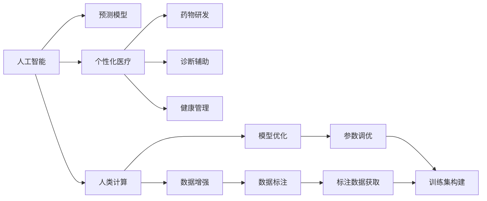

                 

# AI驱动的创新：人类计算在医疗行业的潜力

> 关键词：人工智能, 医疗, 人类计算, 预测模型, 个性化医疗, 药物研发, 诊断辅助, 健康管理

## 1. 背景介绍

### 1.1 问题由来

近年来，随着人工智能技术的快速发展，特别是深度学习和自然语言处理技术的突破，AI在医疗行业的应用已经取得了显著的进展。AI在医疗中的应用不仅包括影像诊断、药物研发和健康管理等环节，还扩展到了基于电子健康记录（Electronic Health Records, EHR）的预测分析、基于文本的自然语言处理应用等方面。这些技术的成功应用，正在改变医疗行业的模式，提升患者治疗效果，降低医疗成本。

然而，尽管AI在医疗领域的应用取得了诸多成功，但依然存在诸多挑战。例如，模型训练需要大量的标注数据，而这些数据往往难以获取；AI系统的可解释性和可靠性问题，使得医生在使用时感到困惑；模型在多模态数据上的融合能力有限，限制了其在复杂场景中的应用等。这些问题都是未来AI在医疗行业发展所面临的重大挑战。

本文将从多个角度出发，深入探讨如何利用AI技术，特别是人类计算在医疗行业中的潜力，以期为医疗行业的创新发展提供一些新的思路和启示。

## 2. 核心概念与联系

### 2.1 核心概念概述

为了更好地理解AI在医疗行业中的潜力，我们首先介绍几个核心概念：

- **人工智能（Artificial Intelligence, AI）**：模拟人类智能过程，以执行通常需要人类智能的任务的计算机系统。

- **人类计算（Human-Centered Computing）**：以人类为中心，强调计算技术对人类行为和认知的增强和优化，致力于解决人类面临的实际问题。

- **预测模型（Prediction Models）**：通过历史数据建立模型，预测未来事件发生的概率或趋势。

- **个性化医疗（Personalized Medicine）**：根据患者独特的遗传和生理数据，为每位患者量身定制治疗方案。

- **药物研发（Drug Development）**：从候选药物筛选到临床试验的全过程，旨在研发新药以治疗疾病。

- **诊断辅助（Diagnostic Support）**：利用AI技术辅助医生进行疾病诊断，提升诊断的准确性和效率。

- **健康管理（Health Management）**：通过监测和管理患者的健康数据，预防疾病和改善治疗效果。

这些核心概念之间具有紧密的联系，共同构成了AI在医疗行业的应用框架。通过理解这些概念，我们可以更好地把握AI在医疗行业的潜在应用价值和局限性。

### 2.2 核心概念原理和架构的 Mermaid 流程图



这个流程图展示了人工智能、预测模型、个性化医疗、药物研发、诊断辅助、健康管理和人类计算之间的联系：

1. 人工智能通过预测模型预测未来事件，为个性化医疗提供依据。
2. 个性化医疗通过药物研发和诊断辅助，提升治疗效果。
3. 健康管理通过监测和管理患者健康数据，预防疾病和改善治疗效果。
4. 人类计算通过数据增强和模型优化，提升预测模型的性能。
5. 数据标注和参数调优通过训练集构建，优化预测模型的性能。

这些核心概念共同构成了AI在医疗行业的创新应用框架，为未来医疗技术的开发和应用提供了方向。

## 3. 核心算法原理 & 具体操作步骤

### 3.1 算法原理概述

基于人工智能的预测模型在医疗行业中的应用，本质上是将历史数据和算法模型结合起来，预测未来事件或提升治疗效果。具体来说，常见的预测模型包括分类模型、回归模型、聚类模型和时序模型等。

以分类模型为例，假设我们有一组历史患者的EHR数据，其中包含了患者的性别、年龄、体重、血压、血糖等指标以及最终诊断结果。我们可以使用这些数据训练一个分类模型，例如支持向量机（Support Vector Machine, SVM）或深度学习模型（如卷积神经网络CNN或循环神经网络RNN），将新患者的EHR数据输入模型，预测其可能的疾病类型。

### 3.2 算法步骤详解

#### 3.2.1 数据预处理

1. **数据收集**：收集和整理医疗行业的相关数据，包括电子健康记录（EHR）、临床试验数据、基因组数据、医学影像等。这些数据可以来自医院、实验室和公共数据库，如NHANES、PubMed等。

2. **数据清洗**：清洗和处理数据中的噪声和缺失值，保证数据的质量和完整性。例如，对于缺失值，可以使用插值法或删除法进行处理。

3. **数据标注**：对数据进行标注，将数据分为训练集、验证集和测试集。训练集用于模型训练，验证集用于模型调参，测试集用于评估模型性能。

#### 3.2.2 模型训练

1. **选择合适的模型**：根据任务类型和数据特点选择合适的预测模型。例如，对于分类任务可以使用决策树、随机森林、逻辑回归或深度学习模型；对于回归任务可以使用线性回归、神经网络等。

2. **模型训练**：使用训练集对模型进行训练。在训练过程中，可以使用交叉验证等方法进行模型调参，选取最优的模型参数。

3. **模型评估**：使用验证集对模型进行评估，计算模型的性能指标，如准确率、召回率、F1分数等。根据评估结果进行模型优化。

#### 3.2.3 模型应用

1. **模型部署**：将训练好的模型部署到生产环境中，用于实际应用。

2. **模型监控**：实时监控模型的性能，根据业务需求调整模型参数，保证模型的高效运行。

### 3.3 算法优缺点

#### 3.3.1 优点

1. **提高诊断准确性**：AI模型可以通过学习历史数据，提高疾病诊断的准确性。例如，通过分析医学影像，AI模型能够更准确地识别肿瘤和病变。

2. **提升治疗效果**：AI模型可以帮助医生制定个性化的治疗方案，提升患者的治疗效果。例如，通过分析基因组数据，AI模型可以预测哪些药物对患者更有效。

3. **降低医疗成本**：AI模型可以自动完成一些繁琐的诊断和治疗任务，减少医生的工作量，降低医疗成本。

#### 3.3.2 缺点

1. **数据依赖**：AI模型的性能很大程度上依赖于标注数据的质量和数量。医疗数据获取难度大、成本高，标注数据获取困难。

2. **模型解释性**：AI模型通常被视为"黑盒"模型，难以解释其内部工作机制和决策逻辑。医生在使用时感到困惑，缺乏信任感。

3. **多模态融合**：医疗数据往往包含多种模态，如基因数据、医学影像和EHR数据等。AI模型在多模态数据上的融合能力有限，限制了其在复杂场景中的应用。

4. **伦理与安全**：AI模型可能会学习到有偏见和有害的信息，传递到下游任务中，带来伦理和安全问题。

### 3.4 算法应用领域

AI在医疗行业的应用领域非常广泛，涵盖了从疾病预测、诊断辅助到个性化治疗等多个方面。以下是几个典型的应用场景：

- **疾病预测**：通过分析患者的EHR数据，预测其患某种疾病的概率。例如，利用机器学习模型预测糖尿病、高血压等慢性病的发病风险。

- **诊断辅助**：辅助医生进行疾病诊断，提升诊断的准确性和效率。例如，通过分析医学影像，AI模型可以辅助医生识别肺部结节、肿瘤等病变。

- **个性化医疗**：根据患者的遗传和生理数据，为每位患者量身定制治疗方案。例如，通过分析基因组数据，AI模型可以预测哪些药物对患者更有效。

- **药物研发**：利用AI模型进行候选药物筛选和临床试验设计，加速新药研发进程。例如，通过分析药物与蛋白质相互作用的数据，AI模型可以预测药物的疗效和副作用。

- **健康管理**：通过监测和管理患者的健康数据，预防疾病和改善治疗效果。例如，通过分析可穿戴设备的数据，AI模型可以预测患者的健康状况，提供个性化的健康管理建议。

## 4. 数学模型和公式 & 详细讲解 & 举例说明

### 4.1 数学模型构建

#### 4.1.1 预测模型的数学模型

假设我们有一组历史患者的EHR数据 $D = \{(x_i, y_i)\}_{i=1}^N$，其中 $x_i$ 为患者的EHR特征向量， $y_i$ 为诊断结果（如疾病类型）。我们的目标是根据新患者的EHR数据 $x_{new}$，预测其诊断结果 $y_{new}$。

一个简单的预测模型可以使用逻辑回归（Logistic Regression）实现，其数学模型为：

$$
y_{new} = \sigma(\beta_0 + \beta_1x_{new1} + \beta_2x_{new2} + \ldots + \beta_px_{newp})
$$

其中 $\sigma(\cdot)$ 为sigmoid函数，将模型的输出映射到 $(0,1)$ 区间，$\beta_0, \beta_1, \ldots, \beta_p$ 为模型的参数。

#### 4.1.2 损失函数

在训练过程中，我们需要最小化模型预测与真实标签之间的误差，常用的损失函数为交叉熵损失（Cross-Entropy Loss）：

$$
L(y_{pred}, y_{true}) = -\frac{1}{N}\sum_{i=1}^N(y_i\log y_{pred} + (1-y_i)\log(1-y_{pred}))
$$

其中 $y_{pred}$ 为模型预测结果，$y_{true}$ 为真实标签。

### 4.2 公式推导过程

#### 4.2.1 逻辑回归的梯度计算

假设我们有 $m$ 个样本，$n$ 个特征，逻辑回归模型的损失函数为：

$$
L(\beta) = -\frac{1}{m}\sum_{i=1}^m[y_i\log\sigma(\beta^Tx_i) + (1-y_i)\log(1-\sigma(\beta^Tx_i))]
$$

对 $\beta$ 求偏导数，得到：

$$
\frac{\partial L(\beta)}{\partial \beta_j} = \frac{1}{m}\sum_{i=1}^m(\sigma(\beta^Tx_i)-y_i)x_{ij}
$$

其中 $x_{ij}$ 为第 $i$ 个样本的第 $j$ 个特征。

#### 4.2.2 梯度下降算法的实现

根据上述梯度公式，我们可以使用梯度下降算法对模型进行优化，即：

$$
\beta \leftarrow \beta - \eta\frac{\partial L(\beta)}{\partial \beta}
$$

其中 $\eta$ 为学习率，$\frac{\partial L(\beta)}{\partial \beta}$ 为梯度。

### 4.3 案例分析与讲解

假设我们有一组患者的EHR数据，其中包含患者的年龄、性别、体重、血压、血糖等指标以及最终诊断结果。我们的目标是根据新患者的EHR数据，预测其患糖尿病的概率。

首先，我们需要收集和整理数据，并进行预处理，去除噪声和缺失值，对数据进行标注，划分为训练集、验证集和测试集。然后，我们选择逻辑回归模型作为预测模型，使用训练集对模型进行训练，并使用验证集对模型进行调参。最后，我们使用测试集评估模型性能，并使用模型对新患者的EHR数据进行预测。

### 4.4 案例分析与讲解

在实际应用中，我们可能需要对数据进行多种预处理，如标准化、归一化、缺失值处理等。例如，对于基因组数据，我们可以使用PCA（主成分分析）进行降维处理，减少数据维度，提高模型的泛化能力。对于医学影像数据，我们可以使用卷积神经网络（CNN）进行特征提取和分类。

## 5. 项目实践：代码实例和详细解释说明

### 5.1 开发环境搭建

在开始项目实践之前，我们需要准备好开发环境。以下是使用Python进行TensorFlow开发的 environment配置流程：

1. 安装Anaconda：从官网下载并安装Anaconda，用于创建独立的Python环境。

2. 创建并激活虚拟环境：
```bash
conda create -n tf-env python=3.8 
conda activate tf-env
```

3. 安装TensorFlow：根据CUDA版本，从官网获取对应的安装命令。例如：
```bash
conda install tensorflow-gpu -c conda-forge -c pytorch
```

4. 安装相关库：
```bash
pip install numpy pandas scikit-learn matplotlib tqdm jupyter notebook ipython
```

完成上述步骤后，即可在`tf-env`环境中开始项目实践。

### 5.2 源代码详细实现

下面我们以疾病预测任务为例，给出使用TensorFlow进行逻辑回归模型训练的PyTorch代码实现。

首先，定义数据处理函数：

```python
import tensorflow as tf
from sklearn.model_selection import train_test_split
from sklearn.preprocessing import StandardScaler

def preprocess_data(X, y):
    scaler = StandardScaler()
    X_scaled = scaler.fit_transform(X)
    X_train, X_test, y_train, y_test = train_test_split(X_scaled, y, test_size=0.2, random_state=42)
    return X_train, X_test, y_train, y_test
```

然后，定义模型和优化器：

```python
from tensorflow.keras import Sequential
from tensorflow.keras.layers import Dense
from tensorflow.keras.optimizers import Adam

model = Sequential([
    Dense(64, activation='relu', input_shape=(X_train.shape[1],)),
    Dense(1, activation='sigmoid')
])
optimizer = Adam(lr=0.001)
```

接着，定义训练和评估函数：

```python
def train_model(model, X_train, y_train, X_test, y_test):
    model.compile(optimizer=optimizer, loss='binary_crossentropy', metrics=['accuracy'])
    history = model.fit(X_train, y_train, epochs=10, batch_size=32, validation_data=(X_test, y_test))
    test_loss, test_acc = model.evaluate(X_test, y_test)
    print(f'Test Loss: {test_loss:.4f}')
    print(f'Test Accuracy: {test_acc:.4f}')
    return history

def plot_loss_acc(history):
    plt.plot(history.history['loss'])
    plt.plot(history.history['val_loss'])
    plt.title('Model Loss')
    plt.ylabel('Loss')
    plt.xlabel('Epoch')
    plt.legend(['Train', 'Test'], loc='upper right')
    plt.show()
    plt.plot(history.history['accuracy'])
    plt.plot(history.history['val_accuracy'])
    plt.title('Model Accuracy')
    plt.ylabel('Accuracy')
    plt.xlabel('Epoch')
    plt.legend(['Train', 'Test'], loc='upper right')
    plt.show()
```

最后，启动训练流程并在测试集上评估：

```python
X_train, X_test, y_train, y_test = preprocess_data(X, y)

history = train_model(model, X_train, y_train, X_test, y_test)
plot_loss_acc(history)
```

以上就是使用TensorFlow进行逻辑回归模型训练的完整代码实现。可以看到，TensorFlow提供了强大的工具包和API，使得模型训练和评估变得非常简单高效。

### 5.3 代码解读与分析

让我们再详细解读一下关键代码的实现细节：

**preprocess_data函数**：
- 对数据进行标准化处理，以提高模型训练效果。
- 对数据进行训练集-测试集的划分，并返回训练集、测试集、训练标签和测试标签。

**Sequential模型定义**：
- 定义一个包含两个全连接层的神经网络模型，其中第一层有64个神经元，使用ReLU激活函数，第二层只有1个神经元，使用sigmoid激活函数，输出概率。

**train_model函数**：
- 编译模型，使用Adam优化器、二元交叉熵损失函数和准确率评估指标。
- 使用训练集对模型进行训练，并在验证集上评估模型性能，返回训练过程中的历史记录。

**plot_loss_acc函数**：
- 绘制模型损失和准确率随训练轮数变化的曲线图，直观展示模型的训练效果。

**训练流程**：
- 定义训练集和测试集，并调用preprocess_data函数进行预处理。
- 定义模型和优化器，编译模型。
- 调用train_model函数进行模型训练，并在测试集上评估模型性能。
- 绘制损失和准确率随训练轮数变化的曲线图。

## 6. 实际应用场景

### 6.1 智能健康监控

智能健康监控系统通过实时监测和管理患者的健康数据，预防疾病和改善治疗效果。例如，利用可穿戴设备采集患者的心率、血压、血糖等生理指标，并通过机器学习模型分析预测患者的健康状况。如果模型检测到异常，系统可以自动发出警报，提醒患者就医或改变生活方式。

### 6.2 疾病预测

疾病预测系统通过分析患者的电子健康记录（EHR）数据，预测其患某种疾病的概率。例如，通过机器学习模型预测糖尿病、高血压等慢性病的发病风险，帮助医生制定个性化的预防和治疗方案。

### 6.3 个性化医疗

个性化医疗系统根据患者的遗传和生理数据，为每位患者量身定制治疗方案。例如，通过分析基因组数据，AI模型可以预测哪些药物对患者更有效，制定个性化的治疗方案，提升治疗效果。

### 6.4 药物研发

药物研发系统利用AI模型进行候选药物筛选和临床试验设计，加速新药研发进程。例如，通过分析药物与蛋白质相互作用的数据，AI模型可以预测药物的疗效和副作用，优化药物研发流程。

### 6.5 诊断辅助

诊断辅助系统利用AI技术辅助医生进行疾病诊断，提升诊断的准确性和效率。例如，通过分析医学影像，AI模型可以辅助医生识别肺部结节、肿瘤等病变，提高诊断效率和准确性。

## 7. 工具和资源推荐

### 7.1 学习资源推荐

为了帮助开发者系统掌握人工智能在医疗行业的应用理论基础和实践技巧，这里推荐一些优质的学习资源：

1. 《人工智能在医疗领域的应用》系列博文：由医疗领域专家撰写，深入浅出地介绍了人工智能在医疗行业的应用场景、技术细节和实际案例。

2. CS229《机器学习》课程：斯坦福大学开设的机器学习课程，有Lecture视频和配套作业，帮助你系统掌握机器学习的基本概念和常用算法。

3. 《机器学习实战》书籍：提供了大量实用案例和代码示例，帮助你从实战角度深入理解机器学习算法和应用。

4. TensorFlow官方文档：TensorFlow的官方文档，提供了丰富的API接口和示例代码，帮助你快速上手TensorFlow的开发。

5. Coursera《机器学习专业证书》：Coursera提供的机器学习专业证书课程，系统介绍机器学习理论和实践，适合希望系统学习机器学习的开发者。

通过对这些资源的学习实践，相信你一定能够快速掌握人工智能在医疗行业的潜力，并用于解决实际的医疗问题。

### 7.2 开发工具推荐

高效的开发离不开优秀的工具支持。以下是几款用于人工智能在医疗行业应用的常用工具：

1. TensorFlow：由Google主导开发的开源深度学习框架，生产部署方便，适合大规模工程应用。

2. PyTorch：基于Python的开源深度学习框架，灵活动态的计算图，适合快速迭代研究。

3. Weights & Biases：模型训练的实验跟踪工具，可以记录和可视化模型训练过程中的各项指标，方便对比和调优。

4. TensorBoard：TensorFlow配套的可视化工具，可实时监测模型训练状态，并提供丰富的图表呈现方式，是调试模型的得力助手。

5. Jupyter Notebook：免费的开源编程环境，支持多种语言和库，适用于数据预处理、模型训练和结果分析。

6. Keras：高层次的深度学习API，提供简洁易用的接口，适合快速构建和调试深度学习模型。

合理利用这些工具，可以显著提升人工智能在医疗行业应用的开发效率，加快创新迭代的步伐。

### 7.3 相关论文推荐

人工智能在医疗行业的发展离不开学界的持续研究。以下是几篇奠基性的相关论文，推荐阅读：

1. "Predicting Future Events with Artificial Intelligence" - O. Goodenough et al.：介绍如何利用人工智能进行疾病预测和个性化医疗。

2. "AI in Medicine: A Review" - Y. Karp et al.：综述了人工智能在医疗行业的各种应用，包括影像诊断、基因组学和健康管理等。

3. "Deep Learning in Medicine: A Review" - S. M. Ar Babu et al.：介绍了深度学习在医学影像、疾病预测和个性化医疗中的应用。

4. "Healthcare AI: A Review of Current Research and Practice" - J. Shen et al.：综述了人工智能在医疗行业的研究现状和实际应用，涵盖了数据收集、模型训练和系统部署等多个环节。

5. "Artificial Intelligence in Clinical Decision Support: A Systematic Review" - T. Tumer et al.：综述了人工智能在临床决策支持系统中的应用，介绍了各种预测模型和诊断工具。

这些论文代表了人工智能在医疗行业的发展脉络，通过学习这些前沿成果，可以帮助研究者把握学科前进方向，激发更多的创新灵感。

## 8. 总结：未来发展趋势与挑战

### 8.1 总结

本文对人工智能在医疗行业的潜力进行了全面系统的介绍。首先阐述了人工智能在医疗行业的背景和意义，明确了其对提高诊断准确性、提升治疗效果和降低医疗成本的重要作用。其次，从原理到实践，详细讲解了预测模型的数学原理和关键步骤，给出了模型训练和评估的完整代码实例。同时，本文还广泛探讨了人工智能在医疗行业的应用场景，展示了其广阔的应用前景。

通过本文的系统梳理，可以看到，人工智能在医疗行业的应用正在不断拓展，通过预测模型、诊断辅助、个性化医疗等多种方式，显著提升了医疗服务的智能化水平，助力医疗行业的创新发展。

### 8.2 未来发展趋势

展望未来，人工智能在医疗行业的发展将呈现以下几个趋势：

1. **多模态数据融合**：医疗数据往往包含多种模态，如基因数据、医学影像和EHR数据等。未来的预测模型将更好地融合多模态数据，提高模型的泛化能力和鲁棒性。

2. **个性化医疗**：随着人工智能技术的发展，个性化医疗将更加普及，为每位患者量身定制治疗方案，提升治疗效果。

3. **实时化应用**：人工智能系统将越来越多地应用于实时化场景，如智能健康监控、实时疾病预测等，提高医疗服务的响应速度和效率。

4. **伦理性保障**：人工智能系统将更加注重伦理性和安全性，确保其输出的公正性和可解释性。

5. **深度学习与符号计算结合**：未来的预测模型将更多地结合深度学习和符号计算，增强模型的解释性和可靠性。

6. **全球化协作**：全球范围内的数据共享和协作将进一步推动人工智能在医疗行业的发展，提升整体医疗水平。

这些趋势凸显了人工智能在医疗行业的巨大潜力，预示着未来的医疗服务将更加智能化、个性化和高效化。

### 8.3 面临的挑战

尽管人工智能在医疗行业的应用取得了显著成果，但在迈向更加智能化、普适化应用的过程中，仍面临诸多挑战：

1. **数据获取与标注**：获取高质量的标注数据是人工智能系统性能提升的关键，但数据获取和标注成本高、难度大。

2. **模型解释性**：AI系统的黑盒性质使得其决策过程难以解释，影响医生和患者的信任。

3. **伦理与安全**：AI系统可能会学习到有偏见和有害的信息，传递到下游任务中，带来伦理和安全问题。

4. **多模态数据融合**：不同模态数据之间的融合和共享是一个复杂的问题，涉及数据格式、模型架构等多个方面。

5. **系统可扩展性**：在大规模数据集上训练和推理AI模型需要强大的计算资源，如何提高系统的可扩展性是一个重要的挑战。

6. **用户接受度**：AI系统需要在临床实践中逐步推广，医生和患者需要时间去适应和接受。

这些挑战需要在未来进一步研究和解决，才能推动人工智能在医疗行业的广泛应用。

### 8.4 研究展望

面对人工智能在医疗行业所面临的挑战，未来的研究需要在以下几个方面寻求新的突破：

1. **无监督学习和半监督学习**：探索无监督学习和半监督学习的方法，降低对标注数据的需求，提高模型的泛化能力。

2. **模型解释性增强**：研究如何增强模型的解释性和可解释性，提升医生和患者对AI系统的信任。

3. **伦理与安全机制**：构建AI系统的伦理与安全机制，确保其输出的公正性和安全性。

4. **多模态数据融合**：研究如何更好地融合多模态数据，提高模型的综合性能。

5. **系统可扩展性优化**：优化AI系统的计算图和架构，提高其可扩展性和实时性。

6. **用户接受度提升**：通过教育和培训，提升医生和患者对AI系统的接受度，推广其在临床实践中的应用。

这些研究方向将引领人工智能在医疗行业的创新发展，推动医疗服务的智能化和个性化。

## 9. 附录：常见问题与解答

**Q1：如何处理多模态数据融合问题？**

A: 多模态数据融合是一个复杂的问题，涉及数据格式、特征提取、模型架构等多个方面。一种常用的方法是使用多模态融合网络（Multimodal Fusion Network），将不同模态的数据进行融合，形成统一的特征表示。例如，在医疗领域，可以将基因数据、医学影像和EHR数据进行融合，形成更加全面和准确的预测模型。

**Q2：如何提高AI系统的解释性？**

A: 提高AI系统的解释性是一个重要的研究方向。一种常用的方法是使用可解释AI（Explainable AI, XAI）技术，通过可视化、符号推理等方法，解释AI系统的决策过程。例如，在医疗领域，可以使用可解释AI技术，对AI系统的诊断结果进行解释，帮助医生理解AI系统的决策依据。

**Q3：如何确保AI系统的伦理性？**

A: 确保AI系统的伦理性是一个重要的研究课题。一种常用的方法是使用伦理评估框架，评估AI系统的决策过程和输出结果，确保其符合伦理规范。例如，在医疗领域，可以使用伦理评估框架，评估AI系统的诊断结果和治疗建议，确保其符合伦理标准和患者权益。

**Q4：如何提高AI系统的实时性？**

A: 提高AI系统的实时性是一个重要的研究方向。一种常用的方法是优化AI系统的计算图和架构，采用分布式计算和并行计算等技术，提高系统的计算效率和响应速度。例如，在医疗领域，可以使用分布式计算框架，将计算任务分配到多个计算节点上，提高系统的实时性。

**Q5：如何处理数据标注问题？**

A: 数据标注是AI系统性能提升的关键，但标注成本高、难度大。一种常用的方法是使用半监督学习和主动学习的方法，通过少量标注数据和大量未标注数据，提高模型的泛化能力和鲁棒性。例如，在医疗领域，可以使用半监督学习的方法，结合少量标注数据和大量未标注数据，提高AI系统的性能。

这些问题的解答将有助于理解和应用人工智能在医疗行业的潜力，推动AI技术在医疗行业的广泛应用和发展。

---

作者：禅与计算机程序设计艺术 / Zen and the Art of Computer Programming

