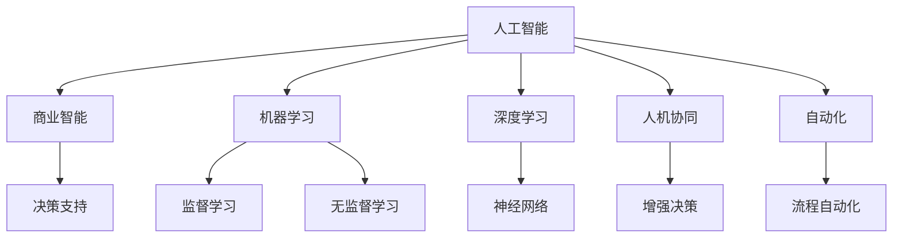

                 

# AI驱动的创新：人类计算在商业中的未来发展

> 关键词：人工智能,商业智能,机器学习,深度学习,数据分析,人机协同,商业决策,自动化

## 1. 背景介绍

### 1.1 问题由来
进入21世纪以来，人工智能（AI）技术的迅猛发展对各行各业产生了深远影响。随着大数据时代的到来，企业正面临着前所未有的机遇与挑战。如何利用AI技术来驱动商业创新，成为全球企业共同的课题。

### 1.2 问题核心关键点
当前，AI技术在商业领域的应用主要体现在以下几个方面：
- **商业智能（Business Intelligence, BI）**：通过数据分析和挖掘，为商业决策提供数据支持。
- **机器学习（Machine Learning, ML）**：使用统计学、优化等方法，训练模型预测未来趋势和行为。
- **深度学习（Deep Learning, DL）**：运用神经网络模型，处理复杂非线性关系，优化商业决策。
- **人机协同（Human-Machine Collaboration, HMC）**：利用AI增强人类能力，实现更好、更快、更准的决策和执行。
- **自动化（Automation）**：采用机器人和AI工具，实现流程自动化，提升效率。

然而，尽管AI技术已广泛应用于商业中，但仍然存在诸多挑战：
- **数据质量问题**：商业智能依赖于大量高质量数据，而数据采集、存储、清洗过程繁琐复杂。
- **算法可解释性不足**：深度学习模型黑箱化严重，难以解释内部机制和决策逻辑。
- **用户接受度低**：用户对AI替代传统的商业决策和操作存在抵触心理，习惯于传统方法。
- **伦理与安全问题**：AI在应用中可能存在偏见、侵犯隐私、破坏公平等伦理和安全风险。

为解决这些挑战，本文将聚焦于AI技术在商业中的未来发展方向，探讨其如何推动商业创新。

## 2. 核心概念与联系

### 2.1 核心概念概述

为了更好地理解AI在商业中的未来发展，本节将介绍几个关键概念及其相互联系：

- **人工智能（AI）**：指通过模拟人类智能，使机器具备感知、学习、推理、自我修正等能力的技术体系。
- **商业智能（BI）**：利用数据分析工具，从大量商业数据中提取有价值信息，支持决策过程的技术。
- **机器学习（ML）**：研究如何使机器通过数据学习和提升性能，包括监督学习、无监督学习和强化学习。
- **深度学习（DL）**：一种基于神经网络的机器学习技术，具有强大的数据建模和预测能力。
- **人机协同（HMC）**：通过AI增强人类能力，实现人机共生，提升工作效率和决策质量。
- **自动化（Automation）**：利用机器人、AI工具等实现业务流程自动化，减少人为干预，提高效率。

这些概念之间的逻辑关系可以通过以下Mermaid流程图来展示：



此图展示了AI技术在商业中的主要应用方向及其相互关系。

## 3. 核心算法原理 & 具体操作步骤
### 3.1 算法原理概述

AI技术在商业中的未来发展，本质上是通过对大量数据的分析和挖掘，实现智能决策和业务自动化。其核心算法包括：

- **监督学习（Supervised Learning）**：从标注数据中学习输入与输出之间的关系，可用于分类、回归等任务。
- **无监督学习（Unsupervised Learning）**：利用未标注数据，通过聚类、降维等技术，发现数据中的潜在模式。
- **强化学习（Reinforcement Learning）**：通过与环境的交互，不断优化策略，提升性能。
- **神经网络（Neural Networks）**：由大量神经元构成的非线性模型，可用于图像、语音、文本等多种数据处理。

这些算法在商业智能、机器学习、深度学习等具体场景下得到应用。

### 3.2 算法步骤详解

以监督学习为例，其在商业智能中的应用步骤如下：

**Step 1: 数据预处理**
- 收集和清洗商业数据，去除异常值和噪声。
- 对数据进行特征工程，提取和选择有用的特征。

**Step 2: 模型选择与训练**
- 选择适合的监督学习算法，如逻辑回归、支持向量机、决策树等。
- 使用训练集进行模型训练，优化参数和模型结构。

**Step 3: 模型评估与优化**
- 使用验证集评估模型性能，调整超参数。
- 利用测试集评估模型泛化能力，进行实际应用。

**Step 4: 部署与监控**
- 将训练好的模型部署到实际应用中，如客户关系管理系统（CRM）、供应链管理系统（SCM）等。
- 实时监控模型表现，及时更新和优化模型。

### 3.3 算法优缺点

监督学习在商业智能中的应用具有以下优点：
- 通过标注数据进行训练，模型能够更精准地预测和分类。
- 适用于分类、回归等常见商业任务。
- 模型性能可控，通过调整超参数和优化算法，容易优化。

同时，其也存在一些缺点：
- 需要大量标注数据，数据收集和处理复杂。
- 存在过拟合风险，模型泛化能力有限。
- 模型训练过程复杂，需要较高的计算资源。

### 3.4 算法应用领域

监督学习在商业智能中的应用非常广泛，涵盖以下领域：

- **客户关系管理（CRM）**：通过预测客户行为，优化客户服务和营销策略。
- **供应链管理（SCM）**：预测供应链环节，优化库存和物流管理。
- **风险管理**：预测金融风险，规避不良资产。
- **市场分析**：预测市场趋势，优化市场营销策略。
- **营销自动化**：通过预测客户反应，优化广告投放策略。

## 4. 数学模型和公式 & 详细讲解 & 举例说明

### 4.1 数学模型构建

商业智能中的监督学习模型通常为分类模型，如逻辑回归、支持向量机、随机森林等。以逻辑回归为例，构建数学模型如下：

设训练数据集为 $\{(x_i, y_i)\}_{i=1}^N$，其中 $x_i \in \mathbb{R}^n$ 为输入特征向量，$y_i \in \{0, 1\}$ 为输出标签。

逻辑回归模型的目标是最小化损失函数：
$$
\mathcal{L}(\theta) = -\frac{1}{N}\sum_{i=1}^N y_i\log \sigma(\theta^Tx_i) + (1-y_i)\log(1-\sigma(\theta^Tx_i))
$$

其中，$\sigma(x) = \frac{1}{1+e^{-x}}$ 为sigmoid函数，$\theta$ 为模型参数。

### 4.2 公式推导过程

对于逻辑回归模型，其梯度下降公式为：
$$
\theta \leftarrow \theta - \eta\nabla_{\theta}\mathcal{L}(\theta)
$$

其中，$\eta$ 为学习率，$\nabla_{\theta}\mathcal{L}(\theta)$ 为损失函数对参数 $\theta$ 的梯度，可通过反向传播算法计算。

### 4.3 案例分析与讲解

以客户流失预测为例，假设公司拥有10万名客户，历史数据中包含客户流失与否的标签和若干特征，如年龄、性别、消费金额等。使用逻辑回归模型，进行训练和预测，步骤如下：

1. **数据预处理**：清洗数据，提取和选择特征，如年龄、性别、消费金额等。
2. **模型训练**：使用训练集，通过梯度下降算法训练逻辑回归模型，优化参数。
3. **模型评估**：使用验证集评估模型性能，调整超参数，确保模型泛化能力。
4. **模型部署**：将训练好的模型部署到实际应用中，如CRM系统，实时预测客户流失风险。

## 5. 项目实践：代码实例和详细解释说明

### 5.1 开发环境搭建

为进行项目实践，需要以下开发环境：

- **Python 3.7以上**：安装Anaconda或Miniconda，创建虚拟环境。
- **NumPy 1.19以上**：用于数值计算。
- **Pandas 1.2以上**：用于数据处理和清洗。
- **scikit-learn 0.24以上**：用于构建和训练监督学习模型。
- **TensorFlow 2.4以上**：用于深度学习和模型部署。

### 5.2 源代码详细实现

以下是使用scikit-learn构建逻辑回归模型的Python代码示例：

```python
import numpy as np
from sklearn.linear_model import LogisticRegression
from sklearn.model_selection import train_test_split
from sklearn.metrics import accuracy_score

# 数据预处理
data = np.loadtxt('data.txt', delimiter=',')
X = data[:, :-1]  # 特征数据
y = data[:, -1]   # 标签数据
X_train, X_test, y_train, y_test = train_test_split(X, y, test_size=0.3)

# 模型训练
model = LogisticRegression()
model.fit(X_train, y_train)

# 模型评估
y_pred = model.predict(X_test)
accuracy = accuracy_score(y_test, y_pred)
print('Accuracy:', accuracy)

# 模型部署
# 将训练好的模型保存为模型文件，并进行模型部署
model.save('model.pkl')
```

### 5.3 代码解读与分析

**数据预处理**：使用`numpy.loadtxt`函数加载数据，并将其分割为特征数据和标签数据。使用`train_test_split`函数将数据集划分为训练集和测试集。

**模型训练**：使用`LogisticRegression`类创建逻辑回归模型，并调用`fit`方法进行训练，优化参数。

**模型评估**：使用测试集评估模型性能，计算准确率。

**模型部署**：使用`model.save`方法保存训练好的模型，并进行模型部署。

## 6. 实际应用场景

### 6.1 智能客服系统

智能客服系统通过使用机器学习技术，能够自动理解客户语义，提供快速准确的解答。其应用步骤如下：

1. **数据收集**：收集客户与客服的对话数据，包括客户问题和客服回答。
2. **数据预处理**：清洗和格式化数据，提取和选择有用的特征，如时间、客户类型、问题类型等。
3. **模型训练**：使用监督学习模型，如随机森林、神经网络等，训练生成客户意图分类器。
4. **模型部署**：将训练好的模型部署到智能客服系统中，实时预测客户意图并匹配最佳回答。

### 6.2 供应链管理

供应链管理通过使用机器学习技术，可以预测物流和库存情况，优化供应链决策。其应用步骤如下：

1. **数据收集**：收集供应链各环节的数据，如订单、库存、物流等。
2. **数据预处理**：清洗和格式化数据，提取和选择有用的特征，如时间、地点、物流状态等。
3. **模型训练**：使用监督学习模型，如回归模型、时间序列模型等，预测物流和库存情况。
4. **模型部署**：将训练好的模型部署到供应链管理系统中，实时优化供应链决策。

### 6.3 金融风险管理

金融风险管理通过使用机器学习技术，可以预测金融风险，规避不良资产。其应用步骤如下：

1. **数据收集**：收集历史金融数据，如股票价格、交易量、财务报表等。
2. **数据预处理**：清洗和格式化数据，提取和选择有用的特征，如时间、公司规模、财务指标等。
3. **模型训练**：使用监督学习模型，如随机森林、神经网络等，预测金融风险。
4. **模型部署**：将训练好的模型部署到金融风险管理系统中，实时预测金融风险。

### 6.4 未来应用展望

未来，AI在商业中的应用将更加广泛和深入，主要趋势包括：

- **自动化程度提升**：通过AI技术，实现更多业务流程自动化，减少人为干预。
- **人机协同增强**：通过AI增强人类能力，提升决策和执行效率。
- **数据质量提升**：通过AI技术，提升数据采集、处理和清洗效率，降低数据质量问题。
- **模型可解释性增强**：通过AI技术，提升模型的可解释性，增强用户接受度。
- **伦理与安全保障**：通过AI技术，提升系统的公平性和安全性，保障数据隐私和伦理。

## 7. 工具和资源推荐

### 7.1 学习资源推荐

为了帮助开发者系统掌握AI技术在商业中的应用，这里推荐一些优质的学习资源：

1. **机器学习课程**：如Coursera的《机器学习》课程，由Andrew Ng主讲，系统介绍机器学习的基本概念和常用算法。
2. **深度学习框架**：如TensorFlow、PyTorch等深度学习框架，提供强大的计算能力和丰富的API。
3. **商业智能工具**：如Tableau、Power BI等商业智能工具，提供直观的数据可视化功能。
4. **大数据技术**：如Hadoop、Spark等大数据技术，提供海量数据的处理和分析能力。
5. **开源项目**：如TensorFlow、PyTorch等开源项目，提供丰富的预训练模型和工具支持。

通过对这些资源的学习实践，相信你一定能够快速掌握AI技术在商业中的应用，并用于解决实际的商业问题。

### 7.2 开发工具推荐

高效的开发离不开优秀的工具支持。以下是几款用于AI项目开发的常用工具：

1. **Jupyter Notebook**：轻量级交互式编程环境，支持Python、R等多种编程语言。
2. **Google Colab**：基于Jupyter Notebook的云端编程环境，提供免费GPU资源。
3. **TensorFlow**：由Google主导开发的深度学习框架，支持分布式计算和GPU加速。
4. **PyTorch**：由Facebook主导开发的深度学习框架，提供动态计算图和灵活的API。
5. **Keras**：基于TensorFlow和Theano的高级API，简化深度学习模型构建。
6. **scikit-learn**：基于Python的机器学习库，提供丰富的机器学习算法和工具。

合理利用这些工具，可以显著提升AI项目开发的效率，加快创新迭代的步伐。

### 7.3 相关论文推荐

AI技术在商业中的未来发展，源于学界的持续研究。以下是几篇奠基性的相关论文，推荐阅读：

1. **《人工智能的未来》**：讨论AI技术在商业中的应用前景和挑战，提供丰富的应用案例。
2. **《机器学习在商业中的应用》**：介绍机器学习在商业智能、风险管理等领域的应用，提供详细的实现过程。
3. **《深度学习在商业中的应用》**：讨论深度学习在图像、语音、自然语言处理等领域的应用，提供大量的实践案例。
4. **《人机协同的未来》**：探讨人机协同在商业中的应用前景，提供丰富的应用场景和实现方法。
5. **《商业智能技术的发展》**：介绍商业智能技术的演进和未来趋势，提供丰富的实现方法和工具支持。

这些论文代表了大规模机器学习在商业中的应用发展，通过学习这些前沿成果，可以帮助研究者把握学科前进方向，激发更多的创新灵感。

## 8. 总结：未来发展趋势与挑战

### 8.1 总结

本文对AI技术在商业中的应用进行了全面系统的介绍。首先阐述了AI技术在商业智能、机器学习、深度学习等领域的应用，明确了AI技术在商业中的独特价值。其次，从原理到实践，详细讲解了AI在商业中的应用步骤，给出了完整的项目实现代码示例。同时，本文还广泛探讨了AI在商业中的未来发展趋势和应用场景，展示了AI技术在商业中的广阔前景。

通过本文的系统梳理，可以看到，AI技术在商业中的应用正迎来快速发展期，极大地推动了商业创新和效率提升。未来，伴随AI技术在商业中的持续深入，必将在更多领域发挥重要作用，带来颠覆性变革。

### 8.2 未来发展趋势

展望未来，AI技术在商业中的未来发展趋势包括：

1. **自动化程度提升**：通过AI技术，实现更多业务流程自动化，减少人为干预。
2. **人机协同增强**：通过AI增强人类能力，提升决策和执行效率。
3. **数据质量提升**：通过AI技术，提升数据采集、处理和清洗效率，降低数据质量问题。
4. **模型可解释性增强**：通过AI技术，提升模型的可解释性，增强用户接受度。
5. **伦理与安全保障**：通过AI技术，提升系统的公平性和安全性，保障数据隐私和伦理。

这些趋势凸显了AI技术在商业中的巨大潜力和应用前景。未来，AI技术将在更多领域深入应用，为商业创新提供更强大的技术支撑。

### 8.3 面临的挑战

尽管AI技术在商业中的应用已取得了显著成果，但在迈向更加智能化、普适化应用的过程中，仍面临诸多挑战：

1. **数据质量瓶颈**：数据采集、处理和清洗繁琐复杂，数据质量问题难以彻底解决。
2. **算法可解释性不足**：深度学习模型黑箱化严重，难以解释内部机制和决策逻辑。
3. **用户接受度低**：用户对AI替代传统的商业决策和操作存在抵触心理，习惯于传统方法。
4. **伦理与安全问题**：AI在应用中可能存在偏见、侵犯隐私、破坏公平等伦理和安全风险。

### 8.4 研究展望

面对AI技术在商业中的挑战，未来的研究需要在以下几个方面寻求新的突破：

1. **探索无监督和半监督学习**：摆脱对大量标注数据的依赖，利用自监督学习、主动学习等无监督和半监督范式，最大限度利用非结构化数据。
2. **研究参数高效和计算高效的微调范式**：开发更加参数高效的微调方法，在固定大部分预训练参数的同时，只更新极少量的任务相关参数。
3. **融合因果和对比学习范式**：通过引入因果推断和对比学习思想，增强模型建立稳定因果关系的能力，学习更加普适、鲁棒的语言表征。
4. **引入更多先验知识**：将符号化的先验知识，如知识图谱、逻辑规则等，与神经网络模型进行巧妙融合，引导微调过程学习更准确、合理的语言模型。
5. **结合因果分析和博弈论工具**：将因果分析方法引入微调模型，识别出模型决策的关键特征，增强输出解释的因果性和逻辑性。
6. **纳入伦理道德约束**：在模型训练目标中引入伦理导向的评估指标，过滤和惩罚有偏见、有害的输出倾向，加强人工干预和审核。

这些研究方向的探索，必将引领AI技术在商业中的应用迈向更高的台阶，为构建安全、可靠、可解释、可控的智能系统铺平道路。面向未来，AI技术还需要与其他人工智能技术进行更深入的融合，如知识表示、因果推理、强化学习等，多路径协同发力，共同推动商业智能系统的进步。

## 9. 附录：常见问题与解答

**Q1: AI技术在商业中的应用主要体现在哪些方面？**

A: AI技术在商业中的应用主要体现在以下几个方面：

1. **商业智能（BI）**：通过数据分析和挖掘，为商业决策提供数据支持。
2. **机器学习（ML）**：使用统计学、优化等方法，训练模型预测未来趋势和行为。
3. **深度学习（DL）**：运用神经网络模型，处理复杂非线性关系，优化商业决策。
4. **人机协同（HMC）**：通过AI增强人类能力，实现人机共生，提升工作效率和决策质量。
5. **自动化（Automation）**：利用机器人、AI工具等实现业务流程自动化，减少人为干预。

**Q2: AI技术在商业中面临的主要挑战有哪些？**

A: AI技术在商业中面临的主要挑战包括：

1. **数据质量问题**：商业智能依赖于大量高质量数据，数据采集、存储、清洗过程繁琐复杂。
2. **算法可解释性不足**：深度学习模型黑箱化严重，难以解释内部机制和决策逻辑。
3. **用户接受度低**：用户对AI替代传统的商业决策和操作存在抵触心理，习惯于传统方法。
4. **伦理与安全问题**：AI在应用中可能存在偏见、侵犯隐私、破坏公平等伦理和安全风险。

**Q3: AI技术在商业中的应用趋势有哪些？**

A: AI技术在商业中的应用趋势包括：

1. **自动化程度提升**：通过AI技术，实现更多业务流程自动化，减少人为干预。
2. **人机协同增强**：通过AI增强人类能力，提升决策和执行效率。
3. **数据质量提升**：通过AI技术，提升数据采集、处理和清洗效率，降低数据质量问题。
4. **模型可解释性增强**：通过AI技术，提升模型的可解释性，增强用户接受度。
5. **伦理与安全保障**：通过AI技术，提升系统的公平性和安全性，保障数据隐私和伦理。

**Q4: 如何提升AI模型在商业中的可解释性？**

A: 提升AI模型在商业中的可解释性，可以从以下几个方面入手：

1. **数据可解释性**：通过清洗和标注数据，提升数据的可解释性，减少模型的歧义。
2. **模型可解释性**：使用可解释性较强的模型，如决策树、逻辑回归等，减少模型的黑箱化。
3. **特征可解释性**：通过特征工程，提取和选择有用的特征，提升模型的可解释性。
4. **模型解释工具**：使用LIME、SHAP等模型解释工具，生成可解释的特征权重和预测过程。
5. **用户教育**：通过培训和教育，提升用户对AI技术的理解和接受度，增强模型的可解释性。

**Q5: 如何应对AI技术在商业中的伦理与安全问题？**

A: 应对AI技术在商业中的伦理与安全问题，可以从以下几个方面入手：

1. **数据伦理**：保护用户隐私，确保数据来源合法，避免数据滥用。
2. **算法伦理**：确保算法公平，避免偏见和歧视，保障模型公正性。
3. **用户权益**：尊重用户选择，提供透明的使用说明，增强用户信任。
4. **安全防护**：采用访问鉴权、数据脱敏等措施，保障数据和模型安全。
5. **伦理审查**：建立伦理审查机制，确保AI应用符合伦理道德标准。

---

作者：禅与计算机程序设计艺术 / Zen and the Art of Computer Programming

