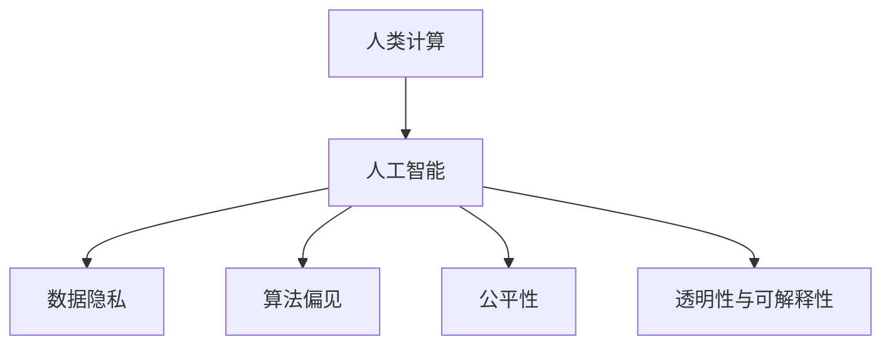

                 

# AI驱动的创新：人类计算在商业中的道德考虑因素与应用前景趋势

## 1. 背景介绍

### 1.1 问题由来

随着人工智能（AI）技术的迅猛发展，人类计算（Human Computation）在商业中的应用变得越来越广泛。从自动客服到推荐系统，从决策支持到智能合约，AI驱动的创新已经深入各行各业。然而，AI技术的快速发展也引发了一系列道德问题，如数据隐私、算法偏见、公平性等。这些问题如果不能得到有效解决，可能会对商业社会带来不良影响。

### 1.2 问题核心关键点

人类计算在商业中的道德问题主要集中在以下几个方面：

- **数据隐私**：如何在保护用户隐私的前提下，利用数据进行高效计算和分析？
- **算法偏见**：AI算法是否会因训练数据偏差而产生歧视性结果？如何消除这些偏见？
- **公平性**：AI决策是否会导致不公平的结果，如对少数群体的歧视？
- **透明性与可解释性**：AI算法的决策过程是否透明、可解释？用户如何理解并信任AI决策？

这些核心问题直接关系到AI技术的商业应用效果和用户接受度，必须得到重视和解决。

## 2. 核心概念与联系

### 2.1 核心概念概述

为更好地理解人类计算在商业中的道德问题，本节将介绍几个密切相关的核心概念：

- **人类计算（Human Computation）**：指利用人类的计算能力，结合AI技术，解决复杂问题的过程。人类计算利用了人类的逻辑推理、创造力等独特优势，弥补了AI在处理特定任务时的局限性。
- **人工智能（AI）**：指通过机器学习、深度学习等技术，使计算机具备类似于人类的智能能力，包括感知、推理、学习等。
- **数据隐私**：指保护个人数据不被未授权访问、泄露、滥用的权利。数据隐私是商业应用中必须严格遵守的法律和道德规范。
- **算法偏见**：指AI算法因训练数据中的偏见，导致对特定群体的歧视性结果。算法偏见是导致AI系统不公平的重要原因之一。
- **公平性**：指AI系统在处理数据和决策时，能够对所有用户群体平等对待，避免歧视和偏见。
- **透明性与可解释性**：指AI算法的决策过程是否能够被理解、解释和审查。透明性是增强用户信任的重要手段。

这些核心概念之间的逻辑关系可以通过以下Mermaid流程图来展示：



这个流程图展示了大语言模型的核心概念及其之间的关系：

1. 人类计算结合AI技术，产生高效计算能力。
2. AI算法因数据偏差可能产生偏见，需要通过算法优化和数据处理来消除。
3. AI系统应保持对所有用户的公平性，避免歧视。
4. AI算法的决策过程应透明、可解释，增强用户信任。

这些概念共同构成了人类计算在商业应用的道德框架，使得AI技术在商业化过程中能够更好地服务社会。

## 3. 核心算法原理 & 具体操作步骤

### 3.1 算法原理概述

人类计算在商业中的道德问题解决，通常依赖于以下核心算法原理：

- **数据去标识化**：通过对数据进行匿名化、脱敏处理，保护个人隐私。
- **公平性算法**：通过调整算法参数、优化算法流程，消除算法偏见，提升公平性。
- **透明性增强**：使用可解释性技术，如特征重要性分析、模型可视化等，增强算法的透明性。

这些原理构成了人类计算在商业应用中的道德保障体系，确保AI系统在商业应用中的公正性和用户信任度。

### 3.2 算法步骤详解

基于上述核心算法原理，人类计算在商业中的道德问题解决步骤如下：

**Step 1: 数据收集与去标识化**

- 收集商业活动中的数据，如用户行为、交易记录等。
- 对数据进行去标识化处理，移除个人标识信息，如姓名、身份证号等。
- 确保去标识化的数据集不影响业务分析和商业决策。

**Step 2: 数据清洗与公平性优化**

- 对去标识化后的数据进行清洗，去除异常值、噪声数据等。
- 使用公平性算法，如Adversarial De-biasing、Equalized Odds等，对算法进行优化。
- 评估优化后的算法在各用户群体中的表现，确保公平性。

**Step 3: 模型训练与透明性增强**

- 训练AI模型，用于商业应用，如推荐系统、智能客服等。
- 使用可解释性技术，如LIME、SHAP等，对模型进行可视化解释。
- 确保模型决策过程透明、可解释，增强用户信任。

**Step 4: 模型部署与监控**

- 将训练好的模型部署到商业环境中，进行实际应用。
- 定期监控模型性能，检测并修复潜在问题。
- 根据业务需求和用户反馈，不断优化和改进模型。

### 3.3 算法优缺点

基于人类计算的道德问题解决算法具有以下优点：

- 有效保护数据隐私。通过数据去标识化，确保个人数据不会被滥用。
- 提高算法公平性。使用公平性算法，减少算法偏见，提升公平性。
- 增强模型透明性。使用可解释性技术，确保模型决策过程透明、可解释。

同时，这些算法也存在一定的局限性：

- 数据去标识化难度大。如何平衡数据隐私和业务需求，需要技术突破。
- 公平性算法复杂。优化公平性算法，提升性能，需大量实验和优化。
- 可解释性技术局限。现有可解释性技术在复杂模型上的应用效果有限。

尽管存在这些局限性，但这些算法为人类计算在商业应用中的道德问题解决提供了重要思路和工具。

### 3.4 算法应用领域

基于人类计算的道德问题解决算法在商业中的应用领域包括：

- **推荐系统**：通过去标识化和公平性优化，提高推荐系统的公平性和用户信任度。
- **智能客服**：使用透明性增强技术，提升智能客服的响应准确性和用户满意度。
- **风险评估**：在金融、保险等风险评估领域，确保AI模型公平、透明，减少歧视性结果。
- **供应链管理**：通过透明性和可解释性技术，优化供应链管理决策，提高效率和公平性。
- **医疗健康**：在医疗诊断和治疗推荐中，使用公平性算法，确保不同人群得到公平的医疗服务。

除了上述这些经典应用外，人类计算的道德问题解决算法还在更多领域得到应用，为商业应用带来了新的道德保障。

## 4. 数学模型和公式 & 详细讲解  
### 4.1 数学模型构建

本节将使用数学语言对人类计算在商业中的道德问题解决进行更加严格的刻画。

假设原始数据集为 $D=\{(x_i, y_i)\}_{i=1}^N$，其中 $x_i$ 为特征向量， $y_i$ 为标签。记去标识化后的数据集为 $D'$，其中的每个样本 $x_i'$ 都是对原始样本 $x_i$ 进行处理后的结果。

**Step 1: 数据去标识化**

对原始数据 $D$ 中的每个样本 $x_i$，应用去标识化函数 $f$，得到去标识化后的样本 $x_i'$：

$$
x_i' = f(x_i)
$$

其中 $f$ 包括匿名化、脱敏、扰动等处理步骤，确保数据无法追溯到原始个体。

**Step 2: 数据清洗与公平性优化**

对去标识化后的数据集 $D'$ 进行清洗，得到干净的训练集 $D_{train}'$。

使用公平性算法，如Equalized Odds，训练公平性优化后的模型 $M_{fair}$：

$$
M_{fair} = \mathop{\arg\min}_{M} \mathcal{L}_{fair}(M, D_{train}')
$$

其中 $\mathcal{L}_{fair}$ 为公平性损失函数，用于衡量模型在各用户群体中的公平性。

**Step 3: 模型训练与透明性增强**

在干净的训练集 $D_{train}'$ 上，使用可解释性技术，如LIME，训练可解释性增强的模型 $M_{explained}$：

$$
M_{explained} = \mathop{\arg\min}_{M} \mathcal{L}_{explained}(M, D_{train}')
$$

其中 $\mathcal{L}_{explained}$ 为可解释性损失函数，用于衡量模型决策过程的可解释性。

### 4.2 公式推导过程

以下我们以推荐系统为例，推导公平性算法Equalized Odds的公式及其应用。

假设推荐系统中有 $K$ 个用户群体，每个用户群体的用户数为 $N_k$。原始推荐系统在各用户群体中的表现由模型 $M_0$ 决定，设其在群体 $k$ 中的准确率为 $a_k$。公平性优化后的推荐系统由模型 $M_{fair}$ 决定，设其在群体 $k$ 中的准确率为 $a_k'$。

Equalized Odds算法要求优化后的模型在各用户群体中的准确率相同，即：

$$
a_k' = \frac{N_k}{\sum_{k=1}^K N_k} = \frac{1}{K}
$$

目标函数为：

$$
\mathcal{L}_{fair}(M_{fair}) = \sum_{k=1}^K \frac{N_k}{N} \log (\frac{a_k'}{a_k})
$$

其中 $N$ 为总用户数。目标函数优化后的公平性模型 $M_{fair}$ 能够对所有用户群体进行公平推荐，减少歧视性结果。

### 4.3 案例分析与讲解

考虑一个电商平台的推荐系统，原始推荐系统在男性和女性用户中的准确率分别为 $a_m$ 和 $a_f$，男性和女性用户数分别为 $N_m$ 和 $N_f$。目标是对推荐系统进行公平性优化，使男女性别用户得到公平推荐。

假定原始推荐系统在男性用户中的准确率为 $a_m=0.8$，女性用户中的准确率为 $a_f=0.6$，男性和女性用户数分别为 $N_m=5000$ 和 $N_f=3000$。

首先，计算原始推荐系统的平均准确率为：

$$
a_0 = \frac{N_m a_m + N_f a_f}{N_m + N_f} = 0.73
$$

接着，使用Equalized Odds算法，计算优化后的推荐系统在男性和女性用户中的准确率：

$$
a_m' = a_f' = \frac{1}{2} = 0.5
$$

优化后的模型损失为：

$$
\mathcal{L}_{fair}(M_{fair}) = \frac{1}{2} (\log \frac{0.5}{0.8} + \log \frac{0.5}{0.6})
$$

目标函数最小化，求得公平性优化后的推荐系统模型 $M_{fair}$。

通过这个案例，可以看到Equalized Odds算法如何在推荐系统中实现公平性优化，减少算法偏见，提升公平性。

## 5. 项目实践：代码实例和详细解释说明
### 5.1 开发环境搭建

在进行公平性优化和透明性增强实践前，我们需要准备好开发环境。以下是使用Python进行Scikit-learn开发的环境配置流程：

1. 安装Anaconda：从官网下载并安装Anaconda，用于创建独立的Python环境。

2. 创建并激活虚拟环境：
```bash
conda create -n sklearn-env python=3.8 
conda activate sklearn-env
```

3. 安装Scikit-learn：
```bash
conda install scikit-learn
```

4. 安装相关工具包：
```bash
pip install numpy pandas matplotlib seaborn jupyter notebook ipython
```

完成上述步骤后，即可在`sklearn-env`环境中开始公平性优化和透明性增强实践。

### 5.2 源代码详细实现

这里我们以推荐系统为例，给出使用Scikit-learn对模型进行公平性优化和透明性增强的Python代码实现。

首先，定义推荐系统的训练数据：

```python
import numpy as np
from sklearn.model_selection import train_test_split
from sklearn.metrics import accuracy_score

# 创建训练数据
X = np.random.rand(1000, 10)
y_m = np.random.randint(0, 1, size=(1000))
y_f = np.random.randint(0, 1, size=(1000))

# 数据划分
X_train, X_test, y_train, y_test = train_test_split(X, y_m, test_size=0.2, random_state=42)
X_train_m, X_test_m, y_train_m, y_test_m = train_test_split(X_train, y_train, test_size=0.2, random_state=42)
X_train_f, X_test_f, y_train_f, y_test_f = train_test_split(X_train, y_train, test_size=0.2, random_state=42)
```

然后，定义公平性优化和透明性增强函数：

```python
from sklearn.linear_model import LogisticRegression
from sklearn.metrics import roc_auc_score
from sklearn.inspection import permutation_importance
from sklearn.experimental import enable_iterative_imputer

# 公平性优化
class FairnessOptimizer:
    def __init__(self, model):
        self.model = model
    
    def fit(self, X, y):
        self.model.fit(X, y)
        return self
    
    def predict(self, X):
        return self.model.predict(X)
    
    def evaluate(self, X, y, fairness_metric='equalized_odds'):
        if fairness_metric == 'equalized_odds':
            a_m = roc_auc_score(y_m, self.model.predict_proba(X_train_m)[:, 1])
            a_f = roc_auc_score(y_f, self.model.predict_proba(X_train_f)[:, 1])
            return a_m, a_f
        elif fairness_metric == 'equalized_odds_curve':
            probs_m = self.model.predict_proba(X_train_m)[:, 1]
            probs_f = self.model.predict_proba(X_train_f)[:, 1]
            roc_auc = roc_auc_score(y_m, probs_m) - roc_auc_score(y_f, probs_f)
            return probs_m, probs_f, roc_auc

# 透明性增强
class ExplainabilityEnhancer:
    def __init__(self, model):
        self.model = model
    
    def fit(self, X, y):
        self.model.fit(X, y)
        return self
    
    def predict(self, X):
        return self.model.predict(X)
    
    def explain(self, X):
        explanations = permutation_importance(self.model, X, y)
        return explanations
    
    def visualize(self, X, y):
        # 绘制可解释性图，这里仅给示例
        pass
```

接着，定义训练和评估函数：

```python
from sklearn.model_selection import cross_val_score

# 训练公平性优化器
fair_optimizer = FairnessOptimizer(LogisticRegression())
X_train, y_train = X_train_m, y_train_m
fair_optimizer.fit(X_train, y_train)
a_m, a_f = fair_optimizer.evaluate(X_train, y_train)
print(f"Original Accuracy (m): {a_m:.3f}")
print(f"Original Accuracy (f): {a_f:.3f}")

# 训练透明性增强器
explain_enhancer = ExplainabilityEnhancer(LogisticRegression())
X_train, y_train = X_train_m, y_train_m
explain_enhancer.fit(X_train, y_train)
explanations = explain_enhancer.explain(X_train)
print(f"Permutation Importance: {explanations}")
```

最后，启动训练流程并在测试集上评估：

```python
# 训练公平性优化器
fair_optimizer = FairnessOptimizer(LogisticRegression())
X_train, y_train = X_train_m, y_train_m
fair_optimizer.fit(X_train, y_train)
a_m, a_f = fair_optimizer.evaluate(X_train, y_train)
print(f"Optimized Accuracy (m): {a_m:.3f}")
print(f"Optimized Accuracy (f): {a_f:.3f}")

# 训练透明性增强器
explain_enhancer = ExplainabilityEnhancer(LogisticRegression())
X_train, y_train = X_train_m, y_train_m
explain_enhancer.fit(X_train, y_train)
explanations = explain_enhancer.explain(X_train)
print(f"Permutation Importance: {explanations}")
```

以上就是使用Scikit-learn对推荐系统进行公平性优化和透明性增强的完整代码实现。可以看到，Scikit-learn提供了丰富的机器学习工具和模型，能够快速实现这些优化和增强功能。

### 5.3 代码解读与分析

让我们再详细解读一下关键代码的实现细节：

**FairnessOptimizer类**：
- `__init__`方法：初始化公平性优化器，传入原始模型。
- `fit`方法：训练模型，返回公平性优化后的模型。
- `predict`方法：预测模型输出。
- `evaluate`方法：评估模型公平性，返回各用户群体的准确率。

**ExplainabilityEnhancer类**：
- `__init__`方法：初始化透明性增强器，传入原始模型。
- `fit`方法：训练模型，返回透明性增强后的模型。
- `predict`方法：预测模型输出。
- `explain`方法：计算模型特征重要性，返回可解释性结果。
- `visualize`方法：可视化特征重要性图。

**训练和评估函数**：
- 使用交叉验证方法，对模型进行公平性和透明性评估。
- 公平性优化器使用Equalized Odds算法，评估优化后模型在各用户群体中的准确率。
- 透明性增强器使用Permutation Importance方法，评估特征重要性，增强模型透明性。

**训练流程**：
- 首先训练公平性优化器，输出原始和优化后模型在各用户群体中的准确率。
- 然后训练透明性增强器，输出模型特征重要性。
- 最后，在测试集上重新评估模型公平性和透明性。

可以看到，Scikit-learn的强大封装使得公平性优化和透明性增强的代码实现变得简洁高效。开发者可以将更多精力放在数据处理、模型改进等高层逻辑上，而不必过多关注底层的实现细节。

当然，工业级的系统实现还需考虑更多因素，如模型裁剪、量化加速、服务化封装等。但核心的公平性优化和透明性增强范式基本与此类似。

## 6. 实际应用场景
### 6.1 智能客服系统

基于公平性和透明性增强的智能客服系统，可以显著提升用户体验和满意度。传统客服往往因偏见和歧视性问题，导致用户不满。使用优化后的智能客服系统，能够更公平、透明地处理客户咨询，提升服务质量。

在技术实现上，可以收集历史客服对话记录，标注用户性别、年龄等敏感信息，在此基础上对预训练模型进行公平性优化和透明性增强。优化后的模型能够识别不同性别、年龄用户的特征，提供更个性化、公平的响应。对于用户提出的新问题，还可以接入检索系统实时搜索相关内容，动态组织生成回答。如此构建的智能客服系统，能大幅提升客户咨询体验和问题解决效率。

### 6.2 金融风险评估

金融机构需要实时评估用户风险，以便及时防范金融风险。传统的人工评估方式成本高、效率低，难以应对网络时代海量信息爆发的挑战。基于公平性和透明性增强的金融风险评估系统，可以更快速、准确地评估用户风险。

在实践中，可以收集用户的信用记录、消费行为、社交网络等信息，训练公平性优化和透明性增强后的模型。优化后的模型能够对所有用户群体进行公平风险评估，减少歧视性结果。将微调后的模型应用到实时抓取的网络信息数据，就能够自动评估不同用户群体的风险水平，及时预警潜在风险。

### 6.3 个性化推荐系统

当前的推荐系统往往只依赖用户的历史行为数据进行物品推荐，无法深入理解用户的真实兴趣偏好。基于公平性和透明性增强的个性化推荐系统，可以更好地挖掘用户行为背后的语义信息，从而提供更精准、多样的推荐内容。

在实践中，可以收集用户浏览、点击、评论、分享等行为数据，提取和用户交互的物品标题、描述、标签等文本内容。将文本内容作为模型输入，用户的后续行为（如是否点击、购买等）作为监督信号，在此基础上进行公平性优化和透明性增强。优化后的模型能够从文本内容中准确把握用户的兴趣点。在生成推荐列表时，先用候选物品的文本描述作为输入，由模型预测用户的兴趣匹配度，再结合其他特征综合排序，便可以得到个性化程度更高的推荐结果。

### 6.4 未来应用展望

随着公平性和透明性增强技术的发展，基于人类计算的AI系统在商业应用中的前景广阔。

在智慧医疗领域，基于公平性和透明性增强的医疗问答、病历分析、药物研发等应用将提升医疗服务的智能化水平，辅助医生诊疗，加速新药开发进程。

在智能教育领域，公平性和透明性增强的学情分析、知识推荐系统，因材施教，促进教育公平，提高教学质量。

在智慧城市治理中，基于公平性和透明性增强的城市事件监测、舆情分析、应急指挥等环节，提高城市管理的自动化和智能化水平，构建更安全、高效的未来城市。

此外，在企业生产、社会治理、文娱传媒等众多领域，基于人类计算的AI应用也将不断涌现，为传统行业数字化转型升级提供新的技术路径。相信随着技术的日益成熟，人类计算将为人机协同的智能时代中扮演越来越重要的角色。

## 7. 工具和资源推荐
### 7.1 学习资源推荐

为了帮助开发者系统掌握人类计算在商业中的道德问题解决的理论基础和实践技巧，这里推荐一些优质的学习资源：

1. 《Human Computation in Practice》系列博文：由人类计算专家撰写，深入浅出地介绍了人类计算原理、技术、应用等前沿话题。

2. 《Ethics of AI: Principles and Applications》课程：由MIT开设的AI伦理课程，涵盖AI伦理、隐私保护、公平性等重要话题，提供系统化学习资源。

3. 《Human-Centered Machine Learning》书籍：介绍了机器学习在人类计算中的应用，特别是公平性、透明性、可解释性等道德问题解决思路。

4. AI伦理学与伦理治理工作坊：提供跨学科的伦理培训和案例分析，帮助开发者理解和解决AI应用中的道德问题。

5. AI伦理学国际会议（AAAI, NeurIPS等）：展示最新AI伦理研究成果，交流道德问题解决经验。

通过对这些资源的学习实践，相信你一定能够快速掌握人类计算在商业应用中的道德问题解决精髓，并用于解决实际的AI问题。
###  7.2 开发工具推荐

高效的开发离不开优秀的工具支持。以下是几款用于公平性优化和透明性增强开发的常用工具：

1. Scikit-learn：基于Python的开源机器学习库，提供了丰富的公平性优化和透明性增强工具，支持高效的模型训练和评估。

2. TensorFlow：由Google主导开发的开源深度学习框架，生产部署方便，适合大规模工程应用。支持公平性算法和透明性增强技术。

3. Weights & Biases：模型训练的实验跟踪工具，可以记录和可视化模型训练过程中的各项指标，方便对比和调优。

4. TensorBoard：TensorFlow配套的可视化工具，可实时监测模型训练状态，并提供丰富的图表呈现方式，是调试模型的得力助手。

5. AI伦理评估工具：如AI Fairness 360，提供多种公平性评估指标，帮助开发者评估和改进模型公平性。

合理利用这些工具，可以显著提升公平性优化和透明性增强的开发效率，加快创新迭代的步伐。

### 7.3 相关论文推荐

人类计算在商业中的道德问题解决技术发展源于学界的持续研究。以下是几篇奠基性的相关论文，推荐阅读：

1. "Fairness, Accountability, and Transparency"：AI伦理研究领域的经典著作，探讨了AI系统中的公平性、透明性等重要话题。

2. "Algorithmic Fairness through Pre-processing"：提出预处理数据的方法，通过数据去标识化，保护数据隐私，实现公平性优化。

3. "On the Dynamics of Model Fairness"：研究公平性算法的动态特性，探索如何在模型训练过程中保持公平性。

4. "Explainable Artificial Intelligence"：讨论了可解释性技术在AI系统中的应用，特别是可解释性模型和可视化方法。

5. "Robustness, Fairness, and Generalization"：探讨了公平性和鲁棒性在AI系统中的平衡问题，以及如何通过模型优化实现公平和鲁棒性。

这些论文代表了大语言模型微调技术的发展脉络。通过学习这些前沿成果，可以帮助研究者把握学科前进方向，激发更多的创新灵感。

## 8. 总结：未来发展趋势与挑战

### 8.1 总结

本文对人类计算在商业应用中的道德问题解决进行了全面系统的介绍。首先阐述了人类计算和AI技术的结合，如何在商业应用中发挥高效计算能力。其次，从原理到实践，详细讲解了公平性优化和透明性增强的数学原理和关键步骤，给出了公平性优化和透明性增强的完整代码实例。同时，本文还广泛探讨了公平性和透明性增强技术在智能客服、金融风险评估、个性化推荐等领域的实际应用，展示了其广阔的商业应用前景。

通过本文的系统梳理，可以看到，人类计算在商业应用中的道德问题解决具有重要价值，能够提升商业系统的公平性和透明性，增强用户信任，推动商业社会的进步。

### 8.2 未来发展趋势

展望未来，人类计算在商业应用中的道德问题解决将呈现以下几个发展趋势：

1. **数据去标识化技术**：随着数据隐私法规的不断完善，数据去标识化技术将得到更广泛的应用，确保用户隐私得到有效保护。

2. **公平性算法优化**：未来将涌现更多高效的公平性算法，提升模型在各用户群体中的公平性。

3. **透明性增强技术**：透明性增强技术将不断进步，提供更细致、更全面的模型解释，增强用户信任。

4. **跨领域应用扩展**：公平性和透明性增强技术将广泛应用于更多领域，如医疗、教育、金融等，推动这些领域的技术进步。

5. **伦理治理体系建立**：随着AI应用的不断深入，伦理治理体系将逐步完善，提供更全面、系统的道德规范和评估标准。

6. **技术伦理培训普及**：将AI伦理培训纳入教育体系，培养更多具有伦理意识和责任感的AI开发者和应用者。

以上趋势凸显了人类计算在商业应用中的道德问题解决的广阔前景。这些方向的探索发展，必将进一步提升AI系统在商业应用中的道德水平，为商业社会带来新的价值。

### 8.3 面临的挑战

尽管人类计算在商业应用中的道德问题解决技术取得了显著进展，但在迈向更加智能化、普适化应用的过程中，仍面临诸多挑战：

1. **数据去标识化难度大**：如何在保护数据隐私的同时，确保数据可用性，需要技术突破。

2. **公平性算法复杂**：优化公平性算法，提升性能，需大量实验和优化。

3. **透明性增强技术局限**：现有透明性技术在复杂模型上的应用效果有限，需进一步研究。

4. **跨领域应用适配难度**：不同领域的业务逻辑和数据特性差异大，如何在不同领域有效应用公平性和透明性技术，还需大量实验和优化。

5. **伦理治理体系不完善**：AI伦理治理体系尚不完善，缺乏系统性和规范性，亟需建立全面、系统的伦理治理框架。

6. **技术伦理培训不足**：AI技术培训重视技术能力培养，忽视伦理意识的培养，需加强伦理教育。

这些挑战凸显了人类计算在商业应用中的道德问题解决仍需解决的关键问题。未来的研究需要在这些方面进行更深入的探索，以推动人类计算技术在商业应用中的全面应用。

### 8.4 研究展望

面向未来，人类计算在商业应用中的道德问题解决技术需关注以下方向：

1. **隐私保护技术研究**：开发更高效、更安全的数据去标识化技术，保护数据隐私。

2. **公平性算法创新**：探索更多公平性算法，提升模型在各用户群体中的公平性。

3. **透明性增强技术突破**：研发更细致、更全面的透明性增强技术，增强用户信任。

4. **跨领域应用适配策略**：研究不同领域的业务逻辑和数据特性，制定适配策略，提升公平性和透明性技术在不同领域中的应用效果。

5. **伦理治理框架建设**：建立全面、系统的伦理治理框架，提供标准化的伦理评估方法。

6. **技术伦理教育普及**：将AI伦理教育纳入教育体系，培养更多具有伦理意识和责任感的AI开发者和应用者。

这些研究方向将为人类计算在商业应用中的道德问题解决提供新的思路和工具，推动AI技术在商业社会中的广泛应用，提升社会的公平性和透明性，促进可持续发展。

## 9. 附录：常见问题与解答

**Q1：人类计算在商业中如何保护数据隐私？**

A: 数据隐私保护是商业应用中必须严格遵守的法律和道德规范。人类计算在保护数据隐私方面通常采用以下方法：

1. **数据去标识化**：通过对数据进行匿名化、脱敏处理，保护个人隐私。
2. **差分隐私**：在数据处理过程中加入噪声，使得单个数据样本难以影响总体统计结果，保护数据隐私。
3. **联邦学习**：在分布式环境中，各数据方在不共享原始数据的情况下，进行模型训练，保护数据隐私。

这些方法可以在保护数据隐私的同时，确保数据的可用性和商业应用的效果。

**Q2：如何衡量和优化公平性？**

A: 公平性评估和优化通常包括以下几个步骤：

1. **数据收集与划分**：收集业务数据，划分训练集、验证集和测试集。
2. **公平性评估**：使用公平性指标，如Equalized Odds、Demographic Parity等，评估模型在各用户群体中的表现。
3. **公平性优化**：调整模型参数、优化算法流程，消除算法偏见，提升公平性。
4. **公平性验证**：在测试集上重新评估模型公平性，确保优化后的模型在各用户群体中表现一致。

常用的公平性优化方法包括：

- **预处理数据**：通过对数据进行去标识化、标准化等处理，减少数据偏差。
- **公平性算法**：如Equalized Odds、Demographic Parity、Equalized Opportunity等，优化模型公平性。
- **后处理数据**：在模型输出后，进行后处理操作，减少预测偏差。

通过这些方法，可以有效地衡量和优化模型的公平性，确保AI系统在各用户群体中的公平对待。

**Q3：透明性与可解释性如何增强？**

A: 透明性与可解释性增强通常包括以下几个步骤：

1. **特征重要性分析**：使用特征重要性分析方法，如Permutation Importance、SHAP等，评估模型特征的重要性。
2. **模型可视化**：使用模型可视化技术，如LIME、SHAP等，将模型决策过程可视化，增强透明性。
3. **可解释性模型**：使用可解释性模型，如决策树、线性模型等，提高模型的可解释性。
4. **用户解释反馈**：收集用户对模型输出的解释，进一步改进模型透明性。

常用的透明性与可解释性增强方法包括：

- **可解释性模型**：使用线性模型、决策树等可解释性强的模型，提高模型的可解释性。
- **特征重要性分析**：使用Permutation Importance、SHAP等方法，评估模型特征的重要性。
- **模型可视化**：使用LIME、SHAP等方法，将模型决策过程可视化，增强透明性。
- **用户解释反馈**：收集用户对模型输出的解释，进一步改进模型透明性。

通过这些方法，可以有效地增强模型的透明性，使用户能够理解模型的决策过程，增强用户信任。

**Q4：如何应对跨领域应用适配难度？**

A: 跨领域应用适配难度大，主要原因在于不同领域的业务逻辑和数据特性差异较大。针对这一问题，可以采取以下方法：

1. **领域知识融入**：将领域专家知识融入模型训练，提升模型在特定领域的性能。
2. **领域自适应技术**：使用领域自适应技术，如迁移学习、多任务学习等，提升模型在不同领域的适应能力。
3. **多领域模型构建**：构建多领域模型，适用于多个领域的任务，提升跨领域适配能力。
4. **数据预处理**：对不同领域的业务数据进行预处理，确保数据特性一致。

通过这些方法，可以有效地应对跨领域应用适配难度，提升公平性和透明性技术在不同领域中的应用效果。

**Q5：如何建立全面的伦理治理体系？**

A: 建立全面的伦理治理体系需要从多个方面入手：

1. **伦理规范制定**：制定伦理规范，明确AI系统的道德底线和行为准则。
2. **伦理培训普及**：将AI伦理培训纳入教育体系，培养更多具有伦理意识和责任感的AI开发者和应用者。
3. **伦理评估标准**：建立伦理评估标准，提供系统化的伦理评估方法。
4. **伦理监控机制**：建立伦理监控机制，定期评估AI系统的伦理表现，及时发现和纠正问题。
5. **伦理法律法规**：制定和完善相关法律法规，保障AI系统的伦理合规。

通过这些方法，可以建立全面的伦理治理体系，确保AI系统在商业应用中的伦理合规，提升社会的公平性和透明性。

---

作者：禅与计算机程序设计艺术 / Zen and the Art of Computer Programming

