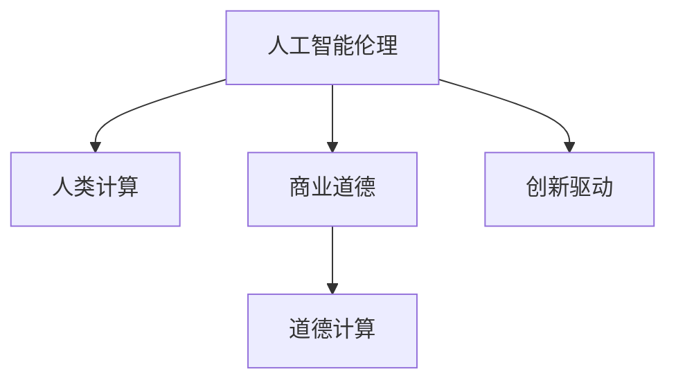

                 

# AI驱动的创新：人类计算在商业中的道德考虑因素展望挑战

> 关键词：人工智能伦理, 人类计算, 商业道德, 创新驱动, 道德计算

## 1. 背景介绍

### 1.1 问题由来
随着人工智能技术的迅猛发展，AI正成为推动商业创新和社会进步的重要引擎。AI驱动的企业正逐步拓展其市场份额，并引导着商业模式的演进。然而，随着人工智能在各个领域的深入应用，一系列伦理和道德问题逐渐浮现，引发了广泛的讨论和争议。如何在推动AI商业化的同时，保障其伦理道德的底线，成为当前业界亟待解决的关键问题。

### 1.2 问题核心关键点
当前，AI在商业中的道德挑战主要集中在以下几个方面：
- **算法透明度和可解释性**：许多商业AI模型作为“黑盒”存在，缺乏必要的可解释性，难以解释其决策过程，这给监管和公正性带来了挑战。
- **数据隐私和安全**：商业AI系统通常需要收集和处理大量个人数据，这涉及到数据隐私保护、数据滥用风险等重要问题。
- **算法偏见和歧视**：AI模型的训练数据可能存在偏见，导致模型输出在性别、种族、年龄等方面的歧视。
- **伦理决策的制定**：在AI决策过程中如何融入伦理原则，确保AI行为符合人类价值观和社会规范。
- **工作替代与就业冲击**：AI自动化可能替代传统工作，引发对就业市场的冲击，需要考虑社会稳定性和就业转型。

这些核心问题，是AI在商业化进程中面临的重大道德挑战。如何平衡创新与道德，是每个AI从业者、开发者、决策者和监管者必须面对的课题。

### 1.3 问题研究意义
研究和应对AI在商业中的道德挑战，具有重要的现实意义：
1. **促进健康创新**：明确AI伦理道德底线，确保AI技术在商业应用中的良性发展，避免滥用和负面影响。
2. **保护用户权益**：确保AI系统在数据处理和决策过程中，尊重和保护用户隐私和权益，构建信任关系。
3. **防范风险**：通过道德考虑，提前识别和规避AI系统中的偏见和歧视，减少社会不公和伦理风险。
4. **推动就业转型**：制定合理的伦理准则，促进AI与人类协作，减少工作替代风险，帮助劳动者转型升级。
5. **支撑社会治理**：借助AI伦理原则，辅助社会治理决策，提升社会治理的智能化水平，保障社会公正和稳定。

## 2. 核心概念与联系

### 2.1 核心概念概述

为更好地理解AI在商业中的伦理道德挑战，本节将介绍几个密切相关的核心概念：

- **人工智能伦理(Artificial Intelligence Ethics)**：指在AI设计和应用过程中，需考虑的伦理道德问题。包括数据隐私、算法透明度、算法偏见、伦理决策等。
- **人类计算(Human-Computer Interaction)**：研究人与计算机系统之间的交互和沟通，强调人机协作和用户体验的重要性。
- **商业道德(Business Ethics)**：企业在其商业活动中所遵循的伦理规范，确保企业行为的合法性和道德性。
- **创新驱动(Innovation-Driven)**：利用AI技术，通过技术创新驱动商业发展，提升企业竞争力。
- **道德计算(Ethical Computing)**：在计算技术的设计和应用中，融入伦理道德原则，确保技术行为的公平性、透明性和负责任性。

这些核心概念之间的逻辑关系可以通过以下Mermaid流程图来展示：



这个流程图展示了一系列概念之间的关系：

1. 人工智能伦理通过人类计算和商业道德的应用，指导AI系统的设计和实施。
2. 人类计算促进了与AI的互动，增强了用户体验，从而推动商业模式的创新。
3. 商业道德在AI应用过程中，确保商业行为符合伦理规范，维护社会公平。
4. 创新驱动利用AI技术提升商业竞争力，同时需考虑道德计算原则，确保技术进步的健康发展。

这些概念共同构成了AI在商业化进程中需考虑的伦理道德框架，确保技术创新与社会道德规范相协调。

## 3. 核心算法原理 & 具体操作步骤

### 3.1 算法原理概述

在商业化应用中，AI系统通常涉及大量的数据处理和决策过程。这些过程中，必须遵循特定的伦理原则，确保数据的隐私保护、算法的透明度和公平性。AI系统的设计必须考虑以下关键点：

1. **数据隐私**：确保用户数据在收集和处理过程中的隐私保护。
2. **算法透明**：提高算法决策过程的透明度，确保决策逻辑可解释。
3. **公平性**：避免算法偏见，确保决策公平。
4. **伦理决策**：在AI决策中融入伦理原则，确保行为符合社会规范。

### 3.2 算法步骤详解

基于上述原则，AI在商业中的道德考虑因素包括以下详细步骤：

**Step 1: 数据隐私保护**
- 设计隐私保护方案，确保用户数据在采集、存储和传输过程中的安全性。
- 遵循数据最小化原则，仅收集必要的数据。
- 使用数据匿名化和加密技术，防止数据滥用和泄露。

**Step 2: 算法透明度提升**
- 设计可解释性模型，如使用决策树、规则集等可解释性强的模型。
- 提供详细的模型说明文档，解释模型输入和输出的逻辑。
- 使用可视化工具展示模型决策过程。

**Step 3: 算法公平性验证**
- 使用公平性指标评估模型输出，如性别、种族、年龄等。
- 进行数据偏差分析，找出潜在偏见并加以修正。
- 设计多种评估指标，确保模型在不同数据集上的公平性。

**Step 4: 伦理决策融入**
- 在模型设计中融入伦理决策机制，确保模型行为符合人类价值观。
- 制定伦理准则和规范，约束AI系统的行为。
- 建立伦理审查机制，对AI决策进行监督和审核。

**Step 5: 持续优化**
- 定期对AI系统进行伦理审查，确保系统符合最新的道德要求。
- 对用户反馈进行收集和分析，持续优化AI系统。

### 3.3 算法优缺点

基于道德考虑因素的AI系统，具有以下优点：
1. **增强用户信任**：通过透明的算法和隐私保护措施，增强用户对AI系统的信任。
2. **减少偏见和歧视**：通过公平性评估和修正，减少算法中的偏见和歧视，提高系统公平性。
3. **保障决策透明**：提高算法透明度，便于用户理解和监督AI系统。
4. **支持伦理决策**：在决策过程中融入伦理原则，保障系统行为符合社会规范。

然而，该方法也存在一定的局限性：
1. **技术复杂性**：设计可解释性和公平性的算法，需要较高的技术复杂性。
2. **隐私保护挑战**：数据匿名化和加密技术可能影响系统性能。
3. **伦理准则制定**：伦理准则的制定和执行可能存在争议，需多方协商。
4. **用户接受度**：部分用户可能对AI系统的可解释性要求较高，而对某些算法的复杂性难以接受。

### 3.4 算法应用领域

AI系统在商业中的道德考虑因素，可以应用于以下多个领域：

- **金融领域**：在风险评估、贷款审批、投资决策等场景中，确保数据的隐私保护和算法的公平性，保障金融市场的健康发展。
- **医疗健康**：在诊断、治疗、药物研发等场景中，确保数据隐私和算法透明，提高医疗服务的质量和公平性。
- **零售行业**：在推荐系统、价格优化、库存管理等场景中，确保算法透明和公平，提升用户体验和满意度。
- **人力资源**：在招聘、培训、绩效评估等场景中，确保算法透明和公平，保障就业机会的公平性。
- **教育领域**：在个性化推荐、作业批改、学习分析等场景中，确保数据隐私和算法公平，提升教育质量。

此外，AI在安全监控、城市管理、能源管理等领域的应用，也需要考虑伦理道德因素，确保AI系统的行为符合社会规范，保障公众利益。

## 4. 数学模型和公式 & 详细讲解  
### 4.1 数学模型构建

本节将使用数学语言对AI在商业中的伦理道德考虑因素进行更加严格的刻画。

假设AI系统用于处理商业数据 $D=\{x_i,y_i\}_{i=1}^N$，其中 $x_i$ 为输入，$y_i$ 为输出标签。系统在训练集 $D$ 上的损失函数为 $\ell(\theta,x_i,y_i)$，在测试集上的损失函数为 $\ell(\theta,x_i,y_i)$。其中 $\theta$ 为模型参数。

定义系统在数据集 $D$ 上的平均损失函数为：

$$
\mathcal{L}(\theta,D) = \frac{1}{N}\sum_{i=1}^N \ell(\theta,x_i,y_i)
$$

系统在训练过程中，需最小化上述损失函数：

$$
\theta^* = \mathop{\arg\min}_{\theta} \mathcal{L}(\theta,D)
$$

### 4.2 公式推导过程

以下我们以性别偏见为例，推导一个简单的公平性评估指标：

假设性别数据集 $D$ 分为男性 $M$ 和女性 $F$ 两组，系统输出 $\hat{y}=M_{\theta}(x)$ 为正例的概率。定义性别公平性指标为：

$$
\text{FPR} = \frac{\text{False Positive Rate}}{\text{False Negative Rate}} = \frac{P(\hat{y}=1|x\in F)}{P(\hat{y}=1|x\in M)}
$$

其中 $P(\hat{y}=1|x\in F)$ 表示在女性数据上，系统将女性误判为正例的概率；$P(\hat{y}=1|x\in M)$ 表示在男性数据上，系统将男性误判为正例的概率。

性别公平性指标衡量了系统在男性和女性数据上的误判概率，如果指标为 1，则系统在性别上无偏见；如果指标大于 1，则系统存在性别偏见；如果指标小于 1，则系统对女性存在偏见。

通过这一指标，可以评估AI系统的公平性，并进行相应的优化，确保系统在性别数据上的公平表现。

## 5. 项目实践：代码实例和详细解释说明

### 5.1 开发环境搭建

在进行道德考虑因素的项目实践前，我们需要准备好开发环境。以下是使用Python进行PyTorch开发的环境配置流程：

1. 安装Anaconda：从官网下载并安装Anaconda，用于创建独立的Python环境。

2. 创建并激活虚拟环境：
```bash
conda create -n ai-ethics python=3.8 
conda activate ai-ethics
```

3. 安装PyTorch：根据CUDA版本，从官网获取对应的安装命令。例如：
```bash
conda install pytorch torchvision torchaudio cudatoolkit=11.1 -c pytorch -c conda-forge
```

4. 安装TensorFlow：使用pip安装TensorFlow，方便进行深度学习实验。
```bash
pip install tensorflow
```

5. 安装TensorBoard：安装TensorFlow配套的可视化工具，方便监测训练过程。
```bash
pip install tensorboard
```

6. 安装相关库：
```bash
pip install pandas numpy matplotlib jupyter notebook scikit-learn
```

完成上述步骤后，即可在`ai-ethics`环境中开始道德考虑因素的项目实践。

### 5.2 源代码详细实现

以下是使用PyTorch和TensorFlow进行性别偏见评估的代码实现。

首先，定义数据处理函数：

```python
import pandas as pd
import numpy as np

def load_data(filename):
    data = pd.read_csv(filename)
    x = data['features'].tolist()
    y = data['label'].tolist()
    return x, y
```

然后，定义模型和损失函数：

```python
import torch
import torch.nn as nn
from sklearn.metrics import roc_auc_score

class BinaryClassifier(nn.Module):
    def __init__(self, input_dim):
        super(BinaryClassifier, self).__init__()
        self.fc1 = nn.Linear(input_dim, 64)
        self.fc2 = nn.Linear(64, 1)
    
    def forward(self, x):
        x = torch.tensor(x, dtype=torch.float)
        x = torch.relu(self.fc1(x))
        x = torch.sigmoid(self.fc2(x))
        return x
    
def compute Fairness Score(y_pred, y_true, threshold):
    y_pred_binary = y_pred > threshold
    y_true_binary = y_true > threshold
    fp = y_pred_binary[y_true_binary == 0].sum()
    fn = y_pred_binary[y_true_binary == 1].sum()
    tp = y_pred_binary[y_true_binary == 1].sum()
    tn = y_pred_binary[y_true_binary == 0].sum()
    return fp / fn
```

接着，加载数据并训练模型：

```python
def train_model(model, train_x, train_y, epochs, batch_size):
    model.train()
    optimizer = torch.optim.Adam(model.parameters(), lr=0.001)
    for epoch in range(epochs):
        for i in range(0, len(train_x), batch_size):
            x_batch = torch.tensor(train_x[i:i+batch_size], dtype=torch.float)
            y_batch = torch.tensor(train_y[i:i+batch_size], dtype=torch.float)
            optimizer.zero_grad()
            y_pred = model(x_batch)
            loss = nn.BCELoss()(y_pred, y_batch)
            loss.backward()
            optimizer.step()
```

最后，在测试集上评估模型：

```python
def evaluate_model(model, test_x, test_y, threshold):
    model.eval()
    y_pred = model(test_x)
    y_pred_binary = y_pred > threshold
    y_true_binary = test_y > threshold
    fpr = compute Fairness Score(y_pred_binary, y_true_binary, threshold)
    return fpr
```

### 5.3 代码解读与分析

让我们再详细解读一下关键代码的实现细节：

**load_data函数**：
- 从CSV文件中加载数据集，将特征和标签分别存储为列表。

**BinaryClassifier类**：
- 定义一个简单的二分类模型，包括两个全连接层。

**compute Fairness Score函数**：
- 计算公平性指标，使用True Positive、False Positive、True Negative、False Negative进行计算。

**train_model函数**：
- 使用Adam优化器训练模型，设置学习率为0.001，在训练集上进行梯度下降更新。

**evaluate_model函数**：
- 在测试集上评估模型，计算性别偏见指标。

以上代码实现了基于PyTorch的性别偏见评估模型，并通过TensorBoard进行可视化。实践中，该模型可以应用于商业场景，帮助评估AI系统的性别公平性，并进行相应的优化。

## 6. 实际应用场景

### 6.1 智能招聘系统

AI在智能招聘系统中可以发挥重要作用，通过自动化简历筛选、面试安排、人才推荐等环节，提升招聘效率和质量。然而，在智能招聘过程中，存在明显的性别偏见问题，特别是对于求职者背景信息的筛选，可能存在对特定性别的歧视。

实际应用中，通过收集不同性别的历史招聘数据，训练一个基于公平性指标的模型，可以动态调整招聘标准，避免性别歧视。同时，系统可以通过提示用户注意偏见问题，降低招聘过程中的性别偏见。

### 6.2 智能健康管理

AI在智能健康管理中的应用，如疾病预测、治疗方案推荐、个性化健康管理等，具有巨大的潜力。但在使用AI过程中，必须考虑患者数据的隐私保护和算法公平性，以避免数据滥用和算法偏见。

实践中，可以通过收集大量多源患者数据，设计可解释性模型，并设置伦理准则，确保AI系统在疾病预测和治疗推荐中，尊重患者的隐私，避免数据滥用和算法偏见，从而提升医疗服务的公平性和质量。

### 6.3 智能金融风控

AI在金融领域的应用，如风险评估、信用评分、欺诈检测等，能够显著提升金融机构的业务效率。但在使用AI过程中，必须考虑数据隐私、算法透明和公平性，以确保金融市场的健康发展。

实际应用中，可以通过设计隐私保护方案、提高算法透明性，确保AI系统在风险评估和信用评分中，不泄露用户隐私，不出现算法偏见，从而提升金融服务的公平性和透明度。

### 6.4 未来应用展望

随着AI技术的不断进步，AI在商业中的道德考虑因素将更加深入和广泛。未来，AI系统将在更多领域应用，其道德伦理问题也将变得更加复杂。

- **自主决策系统的普及**：未来的AI系统将具备更强的自主决策能力，如何在决策过程中融入伦理原则，确保系统行为符合社会规范，将是重要的课题。
- **隐私保护技术的创新**：未来的数据保护技术将更加复杂和多样化，如何在确保隐私保护的同时，实现数据的高效利用，将是新的挑战。
- **伦理准则的全球化**：随着AI应用的国际化，如何制定和执行统一的伦理准则，确保AI系统在全球范围内的公平性和透明度，将是重要的方向。
- **多模态融合技术的成熟**：未来的AI系统将更多地融合语音、图像、文本等多种模态信息，如何在多模态融合过程中，保持伦理道德原则的一致性，将是新的研究热点。

## 7. 工具和资源推荐

### 7.1 学习资源推荐

为了帮助开发者系统掌握AI在商业中的伦理道德问题，这里推荐一些优质的学习资源：

1. **《人工智能伦理导论》**：系统介绍了AI伦理的基本理论和实际应用，适合初学者和高级开发者。
2. **《数据隐私保护》**：详细讲解了数据隐私保护的最新技术和法规，适合从事数据保护工作的从业者。
3. **《公平性算法》**：介绍了公平性指标和算法，帮助开发者设计和优化公平性模型。
4. **《人类计算导论》**：探讨了人机协作在商业中的应用，强调用户体验的重要性。
5. **《商业伦理》**：介绍了商业伦理的基本原则和应用，帮助企业制定伦理决策。

通过对这些资源的学习实践，相信你一定能够全面理解AI在商业中的道德伦理问题，并用于解决实际的AI应用问题。

### 7.2 开发工具推荐

高效的开发离不开优秀的工具支持。以下是几款用于AI在商业中伦理道德问题开发的常用工具：

1. **PyTorch**：基于Python的开源深度学习框架，灵活动态的计算图，适合快速迭代研究。
2. **TensorFlow**：由Google主导开发的开源深度学习框架，生产部署方便，适合大规模工程应用。
3. **TensorBoard**：TensorFlow配套的可视化工具，可实时监测模型训练状态，提供丰富的图表呈现方式。
4. **Weights & Biases**：模型训练的实验跟踪工具，可以记录和可视化模型训练过程中的各项指标。
5. **Jupyter Notebook**：开源的交互式笔记本环境，方便开发和分享代码，支持Python、R等多种语言。
6. **Scikit-learn**：Python中的机器学习库，包含多种模型和评估指标，方便进行公平性评估。

合理利用这些工具，可以显著提升AI在商业中的伦理道德问题开发的效率，加快创新迭代的步伐。

### 7.3 相关论文推荐

AI在商业中的伦理道德问题的发展源于学界的持续研究。以下是几篇奠基性的相关论文，推荐阅读：

1. **《AI伦理：挑战与未来》**：探讨了AI伦理的基本原则和应用，强调伦理在AI系统设计中的重要性。
2. **《数据隐私保护的最新进展》**：详细介绍了数据隐私保护的最新技术，包括差分隐私、联邦学习等。
3. **《公平性算法研究综述》**：总结了公平性算法的最新进展，提供了多种公平性评估指标和算法。
4. **《人类计算与AI的协作》**：探讨了人机协作在商业中的应用，强调用户体验的重要性。
5. **《商业伦理与AI的协同发展》**：分析了商业伦理与AI协同发展的趋势，提出了具体的伦理准则和应用建议。

这些论文代表了大AI伦理道德问题的发展脉络。通过学习这些前沿成果，可以帮助研究者把握学科前进方向，激发更多的创新灵感。

## 8. 总结：未来发展趋势与挑战

### 8.1 研究成果总结

本文对AI在商业中的伦理道德问题进行了全面系统的介绍。首先阐述了AI伦理道德问题的重要性，明确了商业化应用中的关键伦理原则。其次，从原理到实践，详细讲解了AI系统设计、数据处理、算法优化和伦理决策的详细步骤，给出了具体的代码实现。同时，本文还广泛探讨了AI在多个商业领域的应用场景，展示了AI伦理道德问题的广泛影响。

通过本文的系统梳理，可以看到，AI在商业化进程中，必须考虑数据隐私、算法透明、公平性、伦理决策等多个方面，确保技术创新与社会道德规范相协调。AI伦理道德问题已经成为推动AI技术健康发展的关键课题。

### 8.2 未来发展趋势

展望未来，AI在商业中的伦理道德问题将呈现以下几个发展趋势：

1. **伦理原则的全球化**：随着AI应用的国际化，全球统一伦理准则的制定和执行将成为重要课题。
2. **多模态数据融合**：未来的AI系统将更多地融合语音、图像、文本等多种模态信息，如何在多模态融合过程中，保持伦理道德原则的一致性，将是新的研究方向。
3. **自主决策系统的普及**：未来的AI系统将具备更强的自主决策能力，如何在决策过程中融入伦理原则，确保系统行为符合社会规范，将是重要的课题。
4. **隐私保护技术的创新**：未来的数据保护技术将更加复杂和多样化，如何在确保隐私保护的同时，实现数据的高效利用，将是新的挑战。
5. **公平性算法的优化**：未来的公平性算法将更加复杂和多样，如何设计高效公平的算法，确保AI系统在各种场景下的公平性，将是重要的方向。

这些趋势凸显了AI在商业化进程中，伦理道德问题的复杂性和重要性。AI伦理道德问题的深入研究和应用，将推动AI技术向更加健康、可持续的方向发展。

### 8.3 面临的挑战

尽管AI在商业中的伦理道德问题已经取得了一定的进展，但在迈向更加智能化、普适化应用的过程中，它仍面临诸多挑战：

1. **数据隐私保护**：如何在大数据环境下，有效保护用户隐私，防止数据滥用和泄露。
2. **算法透明度和解释性**：如何在保持算法高效性的同时，提高其透明度和可解释性，方便用户理解和监督。
3. **伦理准则的制定和执行**：如何在不同文化和社会背景下，制定和执行统一的伦理准则，确保AI系统的行为符合社会规范。
4. **公平性评估的全面性**：如何评估AI系统在性别、种族、年龄等方面的公平性，确保系统在多种场景下的公平表现。
5. **伦理计算的普适性**：如何在不同应用场景中，设计和实现伦理计算的普适性，确保伦理原则在不同环境下的有效应用。

这些挑战表明，AI伦理道德问题需要跨学科的合作和持续的研究，才能解决复杂的伦理困境，确保AI技术在商业中的健康发展。

### 8.4 研究展望

面对AI伦理道德问题所面临的种种挑战，未来的研究需要在以下几个方面寻求新的突破：

1. **跨学科研究**：结合伦理学、社会学、心理学等多学科知识，深入研究AI伦理道德问题，提出符合社会规范的解决方案。
2. **国际合作**：加强国际合作，制定统一的伦理准则，确保AI技术在全球范围内的公平性和透明度。
3. **技术创新**：开发更加高效、可解释的AI算法，确保算法在保持高效性的同时，具备良好的伦理道德表现。
4. **伦理教育**：加强AI伦理道德教育，提高从业者和公众的伦理意识，促进AI技术在社会中的应用。
5. **法规建设**：制定和完善相关法规，规范AI技术的开发和应用，保障用户权益和社会公正。

这些研究方向的探索，必将引领AI伦理道德问题走向更高的台阶，为构建安全、可靠、可解释、可控的智能系统铺平道路。面向未来，AI伦理道德问题还需要与其他人工智能技术进行更深入的融合，如知识表示、因果推理、强化学习等，多路径协同发力，共同推动自然语言理解和智能交互系统的进步。只有勇于创新、敢于突破，才能不断拓展AI伦理道德问题的边界，让智能技术更好地造福人类社会。

## 9. 附录：常见问题与解答

**Q1：如何评估AI系统的公平性？**

A: 评估AI系统的公平性，通常需要计算多种公平性指标，如FPR（False Positive Rate）、TPR（True Positive Rate）、FP率、FN率等。此外，还可以使用回归模型、分类模型等多种算法，进行公平性评估。实践中，可以使用Scikit-learn等工具，进行模型训练和评估。

**Q2：如何提高AI系统的透明性？**

A: 提高AI系统的透明性，可以从以下几个方面入手：
1. 使用可解释性模型，如决策树、规则集等。
2. 提供详细的模型说明文档，解释模型输入和输出的逻辑。
3. 使用可视化工具展示模型决策过程。
4. 在用户界面提供透明度控制，让用户可以查看和调整模型的透明度。

**Q3：如何在AI系统中融入伦理原则？**

A: 在AI系统中融入伦理原则，可以从以下几个方面入手：
1. 制定明确的伦理准则，确保AI系统行为符合社会规范。
2. 在模型设计中融入伦理约束，如公平性、隐私保护等。
3. 建立伦理审查机制，对AI决策进行监督和审核。
4. 通过用户反馈和数据分析，持续优化AI系统的伦理表现。

这些方法可以帮助AI系统在设计和应用中，融入伦理原则，确保系统的行为符合社会规范，保障用户权益。

**Q4：如何处理AI系统中的数据隐私问题？**

A: 处理AI系统中的数据隐私问题，可以从以下几个方面入手：
1. 设计隐私保护方案，确保用户数据在采集、存储和传输过程中的安全性。
2. 遵循数据最小化原则，仅收集必要的数据。
3. 使用数据匿名化和加密技术，防止数据滥用和泄露。
4. 在使用数据时，确保透明度，让用户了解数据的用途和保护措施。

这些方法可以有效保护用户数据隐私，确保AI系统的合法性和道德性。

**Q5：AI系统中的算法偏见问题如何解决？**

A: 解决AI系统中的算法偏见问题，可以从以下几个方面入手：
1. 收集多样化的训练数据，避免数据偏见。
2. 使用公平性指标评估模型输出，找出潜在偏见并进行修正。
3. 引入对抗样本，增强模型鲁棒性，减少偏见影响。
4. 使用公平性算法，如重新加权、基于公平性的模型优化等。

这些方法可以帮助AI系统减少算法偏见，提升系统的公平性，确保其在各种场景下的公正表现。

---

作者：禅与计算机程序设计艺术 / Zen and the Art of Computer Programming

