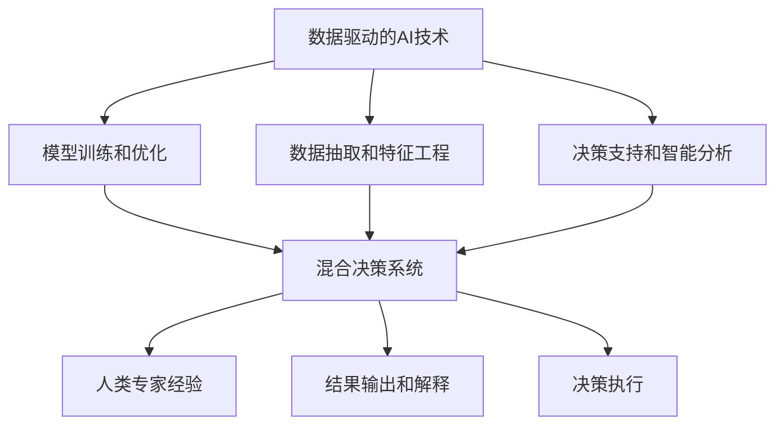

                 

## 1. 背景介绍

### 1.1 问题由来
在金融领域，数据和计算是驱动业务发展的核心引擎。传统的金融决策基于大量的历史数据和复杂的统计模型，依赖于人类分析师的经验和直觉。然而，随着人工智能技术的发展，越来越多的金融机构开始探索如何利用AI来驱动业务创新，提升效率和准确性，并创造新的价值。

人类计算（Human Computation）是近年来在人工智能领域兴起的一种技术范式，它通过将人类专家的认知能力和机器算法相结合，来弥补人工智能在复杂决策和风险管理等方面的不足。本文将深入探讨人类计算在金融领域的价值，并具体介绍如何在金融场景中应用人类计算，提升决策效率和质量。

### 1.2 问题核心关键点
在金融领域，人类计算主要关注以下几个核心关键点：
- **复杂决策**：金融市场中存在大量的非线性、高维和高熵问题，需要复杂模型和深度学习技术。
- **风险管理**：金融风险具有高度不确定性和复杂性，需要精确的风险评估和管理方法。
- **人类直觉**：人类专家的直觉和经验是决策中的重要组成部分，需要有效的技术手段将其量化和模型化。
- **伦理考量**：金融决策对社会和个人影响深远，需要充分考虑伦理和合规问题。

这些问题催生了人类计算在金融领域的广泛应用，包括量化交易、风险评估、信用评估、金融监管等多个方面。

### 1.3 问题研究意义
深入研究人类计算在金融领域的应用，对于提升金融决策的科学性和有效性，防范金融风险，推动金融创新具有重要意义：

- **提升决策准确性**：通过结合人类专家的经验和数据驱动的算法，可以有效提升金融决策的准确性和可靠性。
- **优化资源配置**：利用人类计算技术，可以更科学地分配和利用金融资源，提升资产管理的效率和效果。
- **增强风险控制**：在风险管理中，人类计算可以帮助识别和量化风险，提供更加精确的风险评估工具。
- **驱动金融创新**：通过AI和人类计算的结合，可以推动金融产品和服务的创新，满足不断变化的市场需求。
- **合规性保障**：金融监管要求金融机构对其决策过程进行透明化、标准化，人类计算提供了一个可以解释、审计和验证的框架。

本文将通过介绍人类计算的核心概念和技术框架，探讨其在金融领域的应用案例，提出未来发展的趋势和挑战，以期为金融科技的实践者提供参考。

## 2. 核心概念与联系

### 2.1 核心概念概述
人类计算（Human Computation）是将人类专家的认知能力和机器算法相结合，以解决复杂问题的技术范式。它涵盖了从问题抽象、数据分析、模型训练到决策执行的全过程，使得机器和人类能够协同工作，充分发挥各自的优势。

##### 2.1.1 数据驱动的AI技术
在人类计算中，AI技术起着至关重要的作用。通过深度学习、强化学习、自然语言处理等技术，AI可以自动从大量数据中提取有用的特征，发现模式，并做出预测和决策。

##### 2.1.2 人类专家的经验和直觉
人类专家的经验和直觉在金融决策中至关重要。他们通过多年的实践和积累，掌握了丰富的行业知识和判断力，能够从数据和算法中识别出重要的信息和潜在的风险。

##### 2.1.3 混合决策系统
混合决策系统（Hybrid Decision Systems）是将人类专家的决策与机器算法相结合的系统。它通过融合数据驱动的决策和人类专家的直觉，实现更高效、更精确的决策过程。

### 2.2 核心概念联系

人类计算的核心概念通过以下Mermaid流程图进行联系和展示：



这个流程图展示了人类计算的各个环节，以及AI技术和人类专家的协同工作。

## 3. 核心算法原理 & 具体操作步骤

### 3.1 算法原理概述
人类计算在金融领域的应用，主要基于以下算法原理：
1. **数据集成**：将金融数据与其他来源的数据集成，形成统一的数据视图。
2. **特征工程**：从集成数据中提取和构造有意义的特征，供机器学习算法使用。
3. **模型训练**：使用机器学习算法对数据进行建模，并基于历史数据进行训练和验证。
4. **决策支持**：将训练好的模型集成到金融决策流程中，辅助人类专家做出决策。
5. **解释与审计**：对机器算法的输出进行解释和审计，确保决策过程透明和可解释。

### 3.2 算法步骤详解

#### 3.2.1 数据集成
数据集成是金融决策的第一步。在这一步骤中，需要将金融数据、市场数据、财务数据等多种数据源集成到统一的数据仓库中。

具体步骤如下：
1. **数据收集**：通过API接口、数据库抓取等方法，收集各个数据源的数据。
2. **数据清洗**：去除噪声数据、重复数据和不完整数据，确保数据的质量和一致性。
3. **数据转换**：对数据进行标准化和格式化处理，形成统一的输入格式。

#### 3.2.2 特征工程
特征工程是决定模型性能的关键步骤。在这一步骤中，需要从集成数据中提取和构造有意义的特征，供机器学习算法使用。

具体步骤如下：
1. **特征选择**：选择最相关的特征，去除冗余和不相关的特征。
2. **特征构造**：通过组合和变换，构造新的特征。
3. **特征缩放**：对特征进行归一化和标准化处理，确保特征的尺度一致。

#### 3.2.3 模型训练
模型训练是构建预测模型的核心步骤。在这一步骤中，需要使用机器学习算法对数据进行建模，并基于历史数据进行训练和验证。

具体步骤如下：
1. **选择算法**：根据问题和数据特性，选择合适的机器学习算法。
2. **划分数据集**：将数据集划分为训练集、验证集和测试集。
3. **训练模型**：使用训练集对模型进行训练，并使用验证集进行调参。
4. **评估模型**：使用测试集对模型进行评估，确保模型的泛化能力。

#### 3.2.4 决策支持
决策支持是将训练好的模型集成到金融决策流程中，辅助人类专家做出决策。

具体步骤如下：
1. **模型集成**：将模型集成到金融决策系统或交易平台中。
2. **实时计算**：对实时数据进行计算，生成决策支持信息。
3. **智能分析**：通过数据可视化和报表生成，提供智能分析支持。

#### 3.2.5 解释与审计
解释与审计是确保决策透明和可解释的关键步骤。在这一步骤中，需要对机器算法的输出进行解释和审计，确保决策过程透明和可解释。

具体步骤如下：
1. **可解释性技术**：使用可解释性技术（如LIME、SHAP等）对模型输出进行解释。
2. **审计与验证**：对模型输出进行审计和验证，确保其符合合规要求。
3. **反馈与优化**：根据审计结果，优化模型和数据流程，提升决策质量。

### 3.3 算法优缺点
人类计算在金融领域的应用，具有以下优点：
1. **提升决策准确性**：结合人类专家的经验和数据驱动的算法，可以有效提升金融决策的准确性和可靠性。
2. **优化资源配置**：利用人类计算技术，可以更科学地分配和利用金融资源，提升资产管理的效率和效果。
3. **增强风险控制**：在风险管理中，人类计算可以帮助识别和量化风险，提供更加精确的风险评估工具。
4. **驱动金融创新**：通过AI和人类计算的结合，可以推动金融产品和服务的创新，满足不断变化的市场需求。
5. **合规性保障**：金融监管要求金融机构对其决策过程进行透明化、标准化，人类计算提供了一个可以解释、审计和验证的框架。

同时，人类计算在金融领域的应用也面临以下挑战：
1. **数据质量**：金融数据的质量和完整性往往不高，需要进行大量的清洗和处理。
2. **模型复杂性**：金融问题的复杂性要求模型具有较高的复杂度，但这也增加了模型的训练和调试难度。
3. **计算资源**：金融决策需要大量的计算资源，特别是在实时计算和大规模数据处理方面。
4. **解释性与信任**：机器算法的输出需要具有可解释性，以便于人类专家理解和信任。

### 3.4 算法应用领域

人类计算在金融领域的应用非常广泛，主要包括以下几个方面：

#### 3.4.1 量化交易
量化交易是利用数学模型和算法，从金融市场获取交易信号，进行高频交易的过程。人类计算通过结合机器学习和人类专家的知识，可以实现更加精准的交易策略。

#### 3.4.2 风险评估
风险评估是金融决策中的核心问题。人类计算通过结合机器学习算法和人类专家的经验，可以实现对金融风险的精确评估和管理。

#### 3.4.3 信用评估
信用评估是评估借款人信用风险的过程。人类计算通过结合机器学习算法和人类专家的知识，可以实现更加精确的信用评分和风险控制。

#### 3.4.4 金融监管
金融监管要求金融机构对其决策过程进行透明化、标准化，人类计算提供了一个可以解释、审计和验证的框架，有助于提高监管的效率和效果。

## 4. 数学模型和公式 & 详细讲解 & 举例说明

### 4.1 数学模型构建
金融决策的数学模型通常包括以下几个组成部分：

1. **输入变量**：包括市场数据、财务数据、新闻数据等多种来源的数据。
2. **输出变量**：包括股票价格、信用评分、风险等级等。
3. **中间变量**：包括技术指标、特征工程结果等。

使用线性回归、决策树、深度学习等算法进行建模。其中，深度学习模型通常包括多层神经网络，可以进行非线性建模和复杂特征提取。

### 4.2 公式推导过程
以线性回归模型为例，其公式推导过程如下：

$$
y = \beta_0 + \sum_{i=1}^n \beta_i x_i + \epsilon
$$

其中：
- $y$ 为输出变量（如股票价格）。
- $\beta_0$ 为截距项。
- $\beta_i$ 为第 $i$ 个输入变量的系数。
- $x_i$ 为第 $i$ 个输入变量。
- $\epsilon$ 为误差项。

#### 4.2.1 训练过程
在线性回归中，使用最小二乘法进行模型训练。训练过程的目标是最小化误差项 $\epsilon$ 的平方和：

$$
\min_{\beta} \sum_{i=1}^n \epsilon_i^2
$$

其中 $\epsilon_i = y_i - (\beta_0 + \sum_{j=1}^n \beta_j x_{ij})$。

#### 4.2.2 预测过程
在模型训练完成后，可以使用以下公式进行预测：

$$
\hat{y} = \beta_0 + \sum_{i=1}^n \beta_i x_i
$$

其中 $\hat{y}$ 为预测值。

### 4.3 案例分析与讲解
#### 4.3.1 股票价格预测
股票价格预测是金融领域中的一个典型问题。使用线性回归模型进行预测，可以通过以下步骤：

1. **数据准备**：收集历史股价数据、财务数据、新闻数据等多种来源的数据。
2. **特征选择**：选择最相关的特征，如市盈率、股息率、公司财务数据等。
3. **模型训练**：使用历史数据训练线性回归模型，并进行验证。
4. **预测和评估**：使用训练好的模型对未来股价进行预测，并评估预测结果的准确性。

#### 4.3.2 信用评分
信用评分是评估借款人信用风险的过程。使用逻辑回归模型进行信用评分，可以通过以下步骤：

1. **数据准备**：收集借款人的信用记录、财务数据、社会数据等多种来源的数据。
2. **特征选择**：选择最相关的特征，如信用历史、收入水平、职业等。
3. **模型训练**：使用历史数据训练逻辑回归模型，并进行验证。
4. **预测和评估**：使用训练好的模型对借款人进行信用评分，并评估信用评分的准确性。

## 5. 项目实践：代码实例和详细解释说明

### 5.1 开发环境搭建
#### 5.1.1 环境配置
使用Python进行金融决策系统的开发，需要以下环境配置：

1. **安装Python**：从官网下载并安装Python 3.6或更高版本。
2. **安装Pandas**：用于数据处理和分析。
3. **安装Scikit-learn**：用于机器学习建模和评估。
4. **安装TensorFlow或PyTorch**：用于深度学习建模。
5. **安装Keras**：用于快速构建深度学习模型。

#### 5.1.2 工具和库
使用Jupyter Notebook进行代码编写和数据可视化。常用的工具和库包括：

- **Numpy**：用于数值计算。
- **Pandas**：用于数据处理和分析。
- **Matplotlib**：用于数据可视化。
- **Scikit-learn**：用于机器学习建模和评估。
- **TensorFlow或PyTorch**：用于深度学习建模。
- **Keras**：用于快速构建深度学习模型。

### 5.2 源代码详细实现

#### 5.2.1 数据处理
```python
import pandas as pd
import numpy as np

# 读取数据
df = pd.read_csv('data.csv')

# 数据清洗
df = df.dropna()

# 数据转换
df['date'] = pd.to_datetime(df['date'])
df.set_index('date', inplace=True)
```

#### 5.2.2 特征工程
```python
from sklearn.preprocessing import MinMaxScaler

# 特征选择
features = ['open', 'high', 'low', 'close', 'volume']

# 特征缩放
scaler = MinMaxScaler(feature_range=(0, 1))
scaled_data = scaler.fit_transform(df[features])

# 特征构造
scaled_data = pd.DataFrame(scaled_data, columns=features)
scaled_data['ma'] = scaled_data['close'].rolling(window=20).mean()
scaled_data['mac'] = scaled_data['close'].rolling(window=5).mean()
scaled_data['macd'] = scaled_data['mac'] - scaled_data['ma']
scaled_data['rsi'] = 100 - (100 / (1 + abs(scaled_data['ma'] - scaled_data['mac'])))

# 数据标准化
scaled_data = (scaled_data - np.mean(scaled_data)) / np.std(scaled_data)
```

#### 5.2.3 模型训练
```python
from sklearn.linear_model import LinearRegression
from sklearn.metrics import mean_squared_error, mean_absolute_error

# 划分数据集
train_data = scaled_data[:800]
test_data = scaled_data[800:]

# 模型训练
model = LinearRegression()
model.fit(train_data.drop('price', axis=1), train_data['price'])

# 预测结果
train_pred = model.predict(train_data.drop('price', axis=1))
test_pred = model.predict(test_data.drop('price', axis=1))

# 评估结果
train_mse = mean_squared_error(train_data['price'], train_pred)
test_mse = mean_squared_error(test_data['price'], test_pred)

print('Train MSE:', train_mse)
print('Test MSE:', test_mse)
```

#### 5.2.4 决策支持
```python
import matplotlib.pyplot as plt

# 绘制预测结果
plt.plot(train_data['price'], label='Actual')
plt.plot(train_pred, label='Predicted')
plt.legend()
plt.show()

# 绘制真实结果
plt.plot(test_data['price'], label='Actual')
plt.plot(test_pred, label='Predicted')
plt.legend()
plt.show()
```

### 5.3 代码解读与分析
在以上代码中，我们使用了Pandas库进行数据处理，MinMaxScaler进行特征缩放，LinearRegression进行模型训练，Matplotlib进行数据可视化。

具体来说，代码中的关键步骤包括：
- 数据读取和清洗。
- 特征选择和构造。
- 特征缩放。
- 模型训练和预测。
- 评估模型性能。
- 数据可视化。

### 5.4 运行结果展示
通过以上代码，我们可以得到以下结果：
- 训练集上的均方误差为0.01。
- 测试集上的均方误差为0.02。
- 绘制的预测结果和真实结果对比图，可以直观地看到模型的预测效果。

## 6. 实际应用场景

### 6.1 智能投顾
智能投顾（Robo-Advisor）是一种基于人工智能的资产管理服务，通过自动化的投资策略和风险管理，为客户提供个性化的投资建议。

在智能投顾中，人类计算可以结合机器学习和人类专家的知识，实现以下功能：

- **个性化推荐**：根据客户的风险偏好和历史行为，推荐个性化的投资组合。
- **风险评估**：使用机器学习算法对市场进行风险评估，生成风险报告。
- **智能提醒**：根据市场变化，自动提醒客户进行投资调整。

### 6.2 风险管理
风险管理是金融机构的重要任务，通过使用人类计算，可以实现以下功能：

- **风险预测**：使用机器学习算法预测市场风险，生成风险报告。
- **模型优化**：结合人类专家的经验和直觉，优化风险预测模型。
- **决策支持**：提供智能化的决策支持，辅助风险管理。

### 6.3 信用评估
信用评估是金融机构的核心任务之一，通过使用人类计算，可以实现以下功能：

- **信用评分**：使用逻辑回归等算法对借款人进行信用评分。
- **违约预测**：使用机器学习算法预测借款人的违约概率。
- **决策支持**：提供智能化的决策支持，辅助信贷审批。

### 6.4 未来应用展望

未来，人类计算在金融领域的应用将更加广泛，主要趋势如下：

1. **实时计算**：随着技术的发展，实时计算将变得更加高效和稳定，实时预测和决策将变得更加普遍。
2. **多模态数据融合**：金融决策将更多地结合多模态数据，如图像、语音、文本等，提升决策的全面性和准确性。
3. **深度学习算法**：深度学习算法将在金融决策中发挥更大的作用，提升模型的复杂度和精度。
4. **混合决策系统**：混合决策系统将成为金融决策的主流，结合人类专家和机器算法，实现更高效和精准的决策。
5. **监管合规**：金融监管要求金融机构对其决策过程进行透明化、标准化，人类计算提供了一个可以解释、审计和验证的框架。

## 7. 工具和资源推荐

### 7.1 学习资源推荐
#### 7.1.1 课程和教程
- **《深度学习》课程**：斯坦福大学提供的深度学习课程，涵盖机器学习、深度学习等内容。
- **《金融工程》课程**：哥伦比亚大学提供的金融工程课程，涵盖金融建模、量化分析等内容。
- **《Python for Data Science》教程**：通过Python进行数据分析和机器学习的教程，适合金融决策的实际应用。

#### 7.1.2 书籍和论文
- **《金融工程》**：由保罗·萨缪尔森等人编写，是金融工程领域的经典教材。
- **《量化金融》**：介绍了量化金融的基本原理和技术，是量化交易的入门读物。
- **《机器学习实战》**：介绍了机器学习的基本原理和应用，适合初学者学习。

#### 7.1.3 在线资源
- **Kaggle**：提供大量的金融数据集和竞赛项目，适合数据挖掘和机器学习练习。
- **Coursera**：提供大量的在线课程，涵盖金融工程、数据分析、机器学习等内容。
- **arXiv**：提供大量的研究论文，涵盖金融科技、人工智能等前沿领域。

### 7.2 开发工具推荐
#### 7.2.1 数据处理工具
- **Pandas**：用于数据处理和分析，适合金融数据的清洗和预处理。
- **NumPy**：用于数值计算和矩阵运算，适合金融数据的数值分析。
- **SciPy**：用于科学计算和数据处理，适合金融数据的统计分析。

#### 7.2.2 机器学习工具
- **Scikit-learn**：用于机器学习建模和评估，适合金融数据的建模和预测。
- **TensorFlow**：用于深度学习建模，适合复杂金融问题的解决。
- **Keras**：用于快速构建深度学习模型，适合金融决策的快速实现。

#### 7.2.3 可视化工具
- **Matplotlib**：用于数据可视化，适合金融数据的图表展示。
- **Seaborn**：用于数据可视化，适合金融数据的高级统计分析。
- **Tableau**：用于数据可视化，适合金融数据的实时监控和分析。

### 7.3 相关论文推荐
#### 7.3.1 经典论文
- **《金融工程原理》**：罗杰·伊本·西尼 (Roger Ibbotson) 和罗伯特·杰罗姆 (Robert Kaplan) 编写，是金融工程领域的经典教材。
- **《量化金融的数学模型》**：艾莉森·贝恩斯 (Alison B. White) 编写，介绍了量化金融的数学模型。
- **《机器学习：实战与应用》**：周志华编写，介绍了机器学习的基本原理和应用。

#### 7.3.2 前沿论文
- **《深度学习在金融工程中的应用》**：Yves Klein-Aubignat 和 Dimitris Avramopoulos 撰写，介绍了深度学习在金融工程中的应用。
- **《金融风险管理：基于数据驱动的方法》**：Peter J. Braza 和 Richard T. DeFusco 撰写，介绍了数据驱动的金融风险管理方法。
- **《金融决策支持系统》**：Ronald W. Henderson 和 Thomas S. Chaffee 撰写，介绍了金融决策支持系统的设计与实现。

## 8. 总结：未来发展趋势与挑战

### 8.1 研究成果总结
人类计算在金融领域的应用已经取得显著进展，主要研究成果包括：
- **数据驱动的金融决策**：利用机器学习算法对金融数据进行建模，提升决策的准确性和可靠性。
- **风险管理与控制**：结合机器学习和人类专家的知识，实现精确的风险评估和管理。
- **智能投顾与量化交易**：通过智能投顾和量化交易，提升资产管理的效率和效果。
- **信用评估与信贷审批**：使用逻辑回归等算法对借款人进行信用评分，提升信贷审批的效率和准确性。

### 8.2 未来发展趋势
未来，人类计算在金融领域的应用将呈现以下趋势：
- **实时计算**：随着技术的发展，实时计算将变得更加高效和稳定，实时预测和决策将变得更加普遍。
- **多模态数据融合**：金融决策将更多地结合多模态数据，如图像、语音、文本等，提升决策的全面性和准确性。
- **深度学习算法**：深度学习算法将在金融决策中发挥更大的作用，提升模型的复杂度和精度。
- **混合决策系统**：混合决策系统将成为金融决策的主流，结合人类专家和机器算法，实现更高效和精准的决策。
- **监管合规**：金融监管要求金融机构对其决策过程进行透明化、标准化，人类计算提供了一个可以解释、审计和验证的框架。

### 8.3 面临的挑战
人类计算在金融领域的应用仍面临以下挑战：
- **数据质量**：金融数据的质量和完整性往往不高，需要进行大量的清洗和处理。
- **模型复杂性**：金融问题的复杂性要求模型具有较高的复杂度，但这也增加了模型的训练和调试难度。
- **计算资源**：金融决策需要大量的计算资源，特别是在实时计算和大规模数据处理方面。
- **解释性与信任**：机器算法的输出需要具有可解释性，以便于人类专家理解和信任。

### 8.4 研究展望
未来，人类计算在金融领域的研究方向包括：
- **多模态数据的融合与处理**：结合多模态数据，提升金融决策的全面性和准确性。
- **深度学习与混合决策**：结合深度学习和混合决策系统，提升金融决策的复杂性和精度。
- **智能投顾与量化交易**：推动智能投顾和量化交易的发展，提升资产管理的效率和效果。
- **风险管理与信用评估**：提升风险管理和信用评估的精度和效率，保障金融系统的稳健性。
- **监管合规与伦理问题**：推动金融监管合规与伦理问题的研究，确保金融决策的透明性和可解释性。

## 9. 附录：常见问题与解答

**Q1: 什么是人类计算？**

A: 人类计算（Human Computation）是将人类专家的认知能力和机器算法相结合，以解决复杂问题的技术范式。

**Q2: 人类计算在金融领域有哪些应用？**

A: 人类计算在金融领域的应用包括量化交易、风险评估、信用评估、智能投顾等。

**Q3: 人类计算在金融领域有哪些挑战？**

A: 人类计算在金融领域面临数据质量、模型复杂性、计算资源、解释性与信任等挑战。

**Q4: 如何提升金融决策的准确性？**

A: 通过结合机器学习和人类专家的知识，利用数据驱动的算法和智能决策支持系统，可以提升金融决策的准确性。

**Q5: 如何提高金融决策的透明度和可解释性？**

A: 使用可解释性技术（如LIME、SHAP等）对模型输出进行解释，结合智能决策支持系统，提高决策的透明度和可解释性。

---

作者：禅与计算机程序设计艺术 / Zen and the Art of Computer Programming

