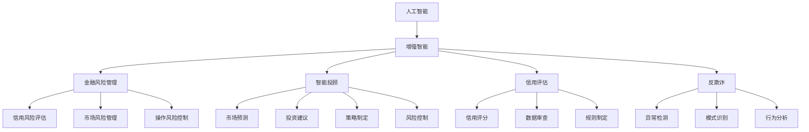

                 

## 1. 背景介绍

### 1.1 问题由来

随着人工智能(AI)技术的迅猛发展，其在金融领域的广泛应用日益显现。金融行业的业务复杂度高、数据量大、实时性要求高，使其成为AI技术应用的重要场景。AI不仅能够显著提升金融业务的效率和安全性，还能为投资者提供更精准的市场预测和风险评估，助力金融机构的决策过程。

在金融领域，AI的应用涉及风险管理、智能投顾、信用评估、反欺诈等多个方向，几乎涵盖了金融业务的全流程。金融行业的特殊性使得其在AI应用上具备独特的要求：高数据安全、高实时性、高准确性和高可解释性。因此，开发适用于金融领域的AI算法和技术，必须充分考虑这些特性，并结合金融业务逻辑进行精细化的设计和优化。

### 1.2 问题核心关键点

金融领域的AI应用中，“人类计算”是一个重要的概念。人类计算指的是利用人类的逻辑、直觉、经验等“软计算能力”，辅助和补充AI在金融决策中的不足。金融领域的决策往往涉及复杂的规则、风险权衡和伦理考量，这些AI难以独立处理，需要与人类计算相结合。因此，本文聚焦于AI在金融领域中的作用，探讨人类计算如何在AI驱动下发挥更大价值。

## 2. 核心概念与联系

### 2.1 核心概念概述

为更好地理解AI在金融领域的应用，本节将介绍几个关键概念：

- **人工智能(AI)**：利用计算机科学和数据分析技术，使机器能够模仿人类智能的决策过程，包括学习、推理、规划等。AI在金融领域的应用包括机器学习、自然语言处理、计算机视觉等方向。

- **人类计算(Human Computation)**：利用人类的逻辑、直觉、经验等软计算能力，辅助机器进行复杂决策。人类计算在金融风险评估、投资策略制定、伦理审查等方面具有独特优势。

- **增强智能(Enhanced Intelligence)**：结合AI与人类计算的优势，使AI能够更好利用人类的知识、经验进行决策。增强智能在金融领域的应用包括智能投顾、信用评估、反欺诈等。

- **金融风险管理**：利用AI和人类计算，进行金融资产的风险评估和风险控制，如信用风险、市场风险、操作风险等。

- **智能投顾**：利用AI进行市场预测和投资建议，结合人类计算进行策略制定和风险控制，帮助投资者做出更优的决策。

- **信用评估**：利用AI和大数据分析，对个人或企业的信用风险进行评估，结合人类计算对数据和规则进行深入审查。

- **反欺诈**：利用AI进行异常检测和模式识别，结合人类计算对可疑行为进行深入分析，确保金融交易的安全性。

这些核心概念之间的逻辑关系可以通过以下Mermaid流程图来展示：



这个流程图展示了一系列核心概念及其之间的关系：

1. AI在增强智能中发挥核心作用，通过机器学习和大数据分析，提供基础决策支持。
2. 增强智能涵盖金融风险管理、智能投顾、信用评估和反欺诈等多个方向。
3. 金融风险管理、智能投顾、信用评估和反欺诈各自涉及的子任务，如信用风险评估、市场风险管理等，需要结合AI和人类计算进行深入分析和决策。

这些概念共同构成了AI在金融领域的应用框架，使其能够充分发挥其在金融决策中的作用。

## 3. 核心算法原理 & 具体操作步骤
### 3.1 算法原理概述

AI在金融领域的应用，往往涉及复杂的决策过程和多维度的数据融合。以信用评估为例，信用评估模型需要对大量的财务数据、行为数据进行综合分析，考虑多种风险因素，如信用历史、收入水平、职业稳定性等。AI可以通过学习历史数据，构建复杂的决策树、神经网络等模型，预测客户的信用风险。然而，这些模型往往难以充分考虑人类计算的独特优势，如对规则、伦理、情感等因素的深度理解和处理。

因此，结合AI与人类计算的增强智能方法，成为当前金融领域AI应用的主流。具体来说，AI在信用评估中主要起到数据处理和模型训练的作用，而人类计算在规则制定、伦理审查、情感分析等方面发挥关键作用。

### 3.2 算法步骤详解

AI在金融领域的具体算法步骤包括以下几个关键环节：

1. **数据收集与预处理**：收集金融领域的数据，如财务报表、交易记录、社交媒体等，并对数据进行清洗、标准化等预处理。

2. **特征工程**：根据任务需求，选择或设计关键特征，如信用评分、收入水平、职业稳定性等。特征工程是模型性能的关键，需要根据业务场景进行精细化设计和优化。

3. **模型训练与优化**：选择合适的机器学习算法（如逻辑回归、随机森林、神经网络等），利用标注数据进行模型训练，并根据性能指标进行优化。

4. **模型评估与部署**：在测试集上评估模型性能，使用评估指标如准确率、召回率、F1-score等，确定最佳模型。将模型部署到生产环境，进行实时预测和决策支持。

5. **反馈与迭代**：根据业务反馈和模型效果，不断迭代和优化模型，提升决策准确性和稳定性。

### 3.3 算法优缺点

结合AI与人类计算的增强智能方法，具有以下优点：

1. **决策效率高**：AI通过数据处理和模型训练，能够快速提供决策支持，提高金融业务处理效率。
2. **准确性高**：AI通过大量数据学习，可以提供准确的预测和评估，降低人为错误。
3. **覆盖面广**：AI能够处理多维度数据，涵盖复杂的金融业务逻辑。
4. **实时性好**：AI可以实时处理大量交易数据，确保金融业务的高实时性要求。

然而，该方法也存在一些缺点：

1. **复杂性高**：AI模型构建和优化需要复杂的算法和技术，且对数据质量要求较高。
2. **可解释性差**：AI模型往往是"黑盒"系统，难以解释其决策逻辑和依据。
3. **依赖数据**：AI模型性能受数据质量和特征设计的影响较大，数据偏差可能带来模型偏差。
4. **需要持续维护**：AI模型需要定期更新和维护，以应对数据分布变化和业务需求变更。

### 3.4 算法应用领域

AI在金融领域的应用覆盖了多个方向，以下是几个主要领域：

1. **风险管理**：利用AI进行信用风险、市场风险、操作风险等评估和控制。
2. **智能投顾**：通过AI进行市场预测和投资建议，结合人类计算进行策略制定和风险控制。
3. **信用评估**：利用AI和大数据分析，对个人或企业信用风险进行评估，结合人类计算对数据和规则进行深入审查。
4. **反欺诈**：利用AI进行异常检测和模式识别，结合人类计算对可疑行为进行深入分析，确保金融交易的安全性。
5. **金融市场分析**：通过AI进行大数据分析，发现市场趋势和投资机会，结合人类计算进行策略制定。

这些应用领域展示了AI在金融业务中的广泛应用，同时也凸显了人类计算在增强智能中的重要性。

## 4. 数学模型和公式 & 详细讲解 & 举例说明
### 4.1 数学模型构建

以信用评分模型为例，构建数学模型：

设信用评分模型为 $y = f(x)$，其中 $x$ 为输入特征向量，$y$ 为信用评分。假设 $f(x)$ 为线性回归模型，则有：

$$
y = w_0 + \sum_{i=1}^n w_i x_i
$$

其中 $w_0$ 为截距，$w_i$ 为第 $i$ 个特征的权重。

### 4.2 公式推导过程

在信用评分模型的训练过程中，利用梯度下降等优化算法进行模型参数的更新。设 $L$ 为损失函数，如均方误差，则有：

$$
L = \frac{1}{N} \sum_{i=1}^N (y_i - w_0 - \sum_{j=1}^n w_j x_{ij})^2
$$

利用梯度下降算法，更新模型参数 $w_0, w_1, \cdots, w_n$ 的过程为：

$$
w_j \leftarrow w_j - \eta \frac{\partial L}{\partial w_j}
$$

其中 $\eta$ 为学习率。

### 4.3 案例分析与讲解

以美国Zillow公司开发的信用评分模型为例，该公司利用AI和大数据分析，构建了基于Zillow数据的信用评分模型。该模型通过学习Zillow平台上用户的信用记录、财务数据等，对用户的信用风险进行评估。

在模型构建过程中，Zillow公司采用了线性回归模型，并结合特征工程、数据预处理等技术，对模型进行了优化。模型训练完成后，Zillow公司将其部署到生产环境，实现了实时信用评分服务。同时，Zillow公司还利用人类计算，对模型输出结果进行深度审查和解释，确保决策的合理性和公正性。

## 5. 项目实践：代码实例和详细解释说明
### 5.1 开发环境搭建

在进行金融领域AI项目开发前，我们需要准备好开发环境。以下是使用Python进行PyTorch开发的环境配置流程：

1. 安装Anaconda：从官网下载并安装Anaconda，用于创建独立的Python环境。

2. 创建并激活虚拟环境：
```bash
conda create -n pytorch-env python=3.8 
conda activate pytorch-env
```

3. 安装PyTorch：根据CUDA版本，从官网获取对应的安装命令。例如：
```bash
conda install pytorch torchvision torchaudio cudatoolkit=11.1 -c pytorch -c conda-forge
```

4. 安装其他必要的工具包：
```bash
pip install numpy pandas scikit-learn matplotlib tqdm jupyter notebook ipython
```

完成上述步骤后，即可在`pytorch-env`环境中开始AI项目开发。

### 5.2 源代码详细实现

下面以信用评分模型为例，给出使用PyTorch进行模型训练和评估的代码实现。

```python
import torch
import torch.nn as nn
import torch.optim as optim
from torch.utils.data import DataLoader, Dataset
from sklearn.model_selection import train_test_split
import pandas as pd

class CreditDataset(Dataset):
    def __init__(self, data, target):
        self.data = data
        self.target = target
        
    def __len__(self):
        return len(self.data)
    
    def __getitem__(self, index):
        return self.data.iloc[index], self.target.iloc[index]

def train_model(model, data, target, batch_size, num_epochs, learning_rate):
    train_data, val_data, train_target, val_target = train_test_split(data, target, test_size=0.2, random_state=42)
    train_loader = DataLoader(train_data, train_target, batch_size=batch_size, shuffle=True)
    val_loader = DataLoader(val_data, val_target, batch_size=batch_size)
    
    criterion = nn.MSELoss()
    optimizer = optim.Adam(model.parameters(), lr=learning_rate)
    
    for epoch in range(num_epochs):
        model.train()
        running_loss = 0.0
        for inputs, targets in train_loader:
            optimizer.zero_grad()
            outputs = model(inputs)
            loss = criterion(outputs, targets)
            loss.backward()
            optimizer.step()
            running_loss += loss.item()
        print(f"Epoch {epoch+1}, loss: {running_loss/len(train_loader)}")
    
    model.eval()
    running_loss = 0.0
    with torch.no_grad():
        for inputs, targets in val_loader:
            outputs = model(inputs)
            loss = criterion(outputs, targets)
            running_loss += loss.item()
    print(f"Validation loss: {running_loss/len(val_loader)}")

# 假设已经收集到以下数据
data = pd.read_csv('credit_data.csv')
target = data['default'].apply(lambda x: 1 if x else 0)

# 假设模型参数为随机初始化
model = nn.Linear(8, 1)

# 定义训练参数
num_epochs = 10
batch_size = 32
learning_rate = 0.001

# 训练模型
train_model(model, data.drop('default', axis=1), target, batch_size, num_epochs, learning_rate)
```

以上代码实现了简单的线性回归信用评分模型的训练和评估。在实际应用中，还需要根据具体任务需求，选择和设计更复杂的模型和特征工程策略。

### 5.3 代码解读与分析

**CreditDataset类**：
- `__init__`方法：初始化数据集，接受数据和标签作为输入。
- `__len__`方法：返回数据集的样本数量。
- `__getitem__`方法：对单个样本进行处理，返回数据和标签。

**train_model函数**：
- 对数据集进行切分，创建训练集和验证集。
- 定义损失函数、优化器和模型。
- 在每个epoch中，对训练集进行前向传播、反向传播和模型参数更新。
- 在每个epoch结束后，计算验证集上的损失并打印输出。

**数据预处理**：
- 使用`pd.read_csv`读取CSV文件，提取数据和标签。
- 对数据进行特征选择和归一化处理。
- 对标签进行二值化处理，生成训练集和验证集。

**模型构建**：
- 定义简单的线性回归模型，将8个特征映射到一个输出。
- 使用随机初始化的权重和偏置进行模型构建。

**训练过程**：
- 定义训练参数，包括epoch数、batch大小和学习率。
- 调用`train_model`函数，进行模型训练。
- 在训练过程中，对模型进行前向传播、损失计算和参数更新。
- 在每个epoch结束后，计算验证集上的损失并打印输出。

## 6. 实际应用场景
### 6.1 智能投顾系统

智能投顾系统是AI在金融领域的重要应用方向之一。通过AI分析市场数据，预测股票价格和投资趋势，结合人类计算进行策略制定和风险控制，智能投顾系统可以为投资者提供个性化投资建议。

智能投顾系统的核心在于结合AI和人类计算的优势，使系统能够更好地理解投资者的需求和风险偏好，同时提供合理的投资建议。例如，系统可以根据用户的历史交易记录和风险偏好，利用AI进行市场预测，并结合人类计算对预测结果进行解释和调整。在系统设计中，可以使用机器学习模型进行市场分析，使用自然语言处理技术对用户反馈进行情感分析，确保系统输出的合理性和可解释性。

### 6.2 反欺诈检测系统

金融欺诈是金融业务中的重大风险，利用AI进行反欺诈检测是金融行业的重要应用。AI可以通过学习历史欺诈数据，识别出异常交易行为和可疑模式。然而，AI在复杂欺诈模式识别和决策过程中，仍需结合人类计算进行深入分析和判断。

例如，当AI检测到可疑交易行为时，反欺诈系统可以进一步引入人类计算，对可疑行为进行深度审查和分析。人类计算可以结合金融知识和领域经验，对AI检测结果进行人工复核，确保欺诈检测的准确性和可靠性。在系统设计中，可以使用异常检测算法进行初步筛选，使用规则引擎对可疑行为进行进一步审查，并结合专家知识库进行决策。

### 6.3 信用评分系统

信用评分系统是金融风险管理的重要工具，利用AI进行信用评估和风险控制。然而，AI在信用评分过程中仍需结合人类计算，对模型输出结果进行审查和解释。

例如，当AI模型评估客户的信用风险时，信用评分系统可以进一步引入人类计算，对模型输出结果进行深度审查和解释。人类计算可以结合金融知识和领域经验，对AI评估结果进行解释和调整，确保评分的合理性和公正性。在系统设计中，可以使用线性回归、逻辑回归等机器学习算法进行信用评分，使用规则引擎对评分结果进行进一步审查，并结合专家知识库进行决策。

### 6.4 未来应用展望

随着AI技术的不断发展，其在金融领域的应用将更加广泛和深入。未来，AI将结合人类计算，推动金融业务的全面智能化。

1. **自动化交易**：利用AI进行市场预测和交易策略制定，结合人类计算进行风险控制和决策。自动化交易系统可以显著提高交易效率和收益。

2. **区块链金融**：利用AI进行区块链数据的分析和管理，结合人类计算进行智能合约的设计和执行。区块链金融技术可以提高金融交易的透明性和安全性。

3. **智能合约**：利用AI进行智能合约的设计和执行，结合人类计算进行风险管理和伦理审查。智能合约可以提高金融交易的自动化和智能化水平。

4. **金融监管**：利用AI进行金融数据的分析和监控，结合人类计算进行法规和政策的制定和执行。金融监管技术可以提高金融系统的规范性和稳定性。

以上应用场景展示了AI在金融领域的多样化和深远影响，未来AI和人类计算的结合将进一步提升金融业务的智能化水平，为金融业带来新的突破。

## 7. 工具和资源推荐
### 7.1 学习资源推荐

为了帮助开发者系统掌握AI在金融领域的应用，这里推荐一些优质的学习资源：

1. 《金融科技：人工智能与金融业务融合》系列博文：由金融科技专家撰写，深入浅出地介绍了AI在金融业务中的应用，包括风险管理、智能投顾等方向。

2. CS50《金融技术》课程：哈佛大学开设的金融科技课程，涵盖金融科技的基础知识和前沿技术，适合对金融科技感兴趣的学生和从业者。

3. 《机器学习在金融中的应用》书籍：详细介绍了机器学习在金融领域的应用，包括信用评分、市场预测等方向。

4. Kaggle金融数据集：提供大量金融领域的数据集，涵盖股票价格、市场数据、信用记录等，适合进行AI项目实践和竞赛。

通过对这些资源的学习实践，相信你一定能够快速掌握AI在金融领域的应用方法，并用于解决实际的金融问题。

### 7.2 开发工具推荐

高效的开发离不开优秀的工具支持。以下是几款用于金融领域AI项目开发的常用工具：

1. PyTorch：基于Python的开源深度学习框架，灵活动态的计算图，适合快速迭代研究。在金融领域，常用的金融数据处理库包括Pandas、NumPy等。

2. TensorFlow：由Google主导开发的开源深度学习框架，生产部署方便，适合大规模工程应用。在金融领域，常用的金融数据处理库包括TensorFlow、TensorFlow-estimator等。

3. Weights & Biases：模型训练的实验跟踪工具，可以记录和可视化模型训练过程中的各项指标，方便对比和调优。与主流深度学习框架无缝集成。

4. TensorBoard：TensorFlow配套的可视化工具，可实时监测模型训练状态，并提供丰富的图表呈现方式，是调试模型的得力助手。

5. Jupyter Notebook：交互式编程环境，适合进行数据分析和模型训练。

合理利用这些工具，可以显著提升金融领域AI项目开发效率，加快创新迭代的步伐。

### 7.3 相关论文推荐

AI在金融领域的应用源于学界的持续研究。以下是几篇奠基性的相关论文，推荐阅读：

1. Predicting Customer Credit Risk with Deep Learning（机器学习在信用评分中的应用）：利用深度学习模型进行信用评分，展示了AI在金融风险管理中的应用。

2. Financial Time Series Forecasting with Deep Learning（深度学习在金融市场预测中的应用）：利用深度学习模型进行金融市场预测，展示了AI在智能投顾中的应用。

3. Detecting Financial Fraud with Deep Learning（深度学习在金融欺诈检测中的应用）：利用深度学习模型进行金融欺诈检测，展示了AI在反欺诈中的应用。

4. Blockchain Technology in Finance（区块链技术在金融中的应用）：介绍了区块链在金融领域的创新应用，展示了AI与区块链技术的结合。

这些论文代表了大语言模型微调技术的发展脉络。通过学习这些前沿成果，可以帮助研究者把握学科前进方向，激发更多的创新灵感。

## 8. 总结：未来发展趋势与挑战
### 8.1 总结

本文对AI在金融领域的应用进行了全面系统的介绍。首先阐述了AI在金融业务中的重要性，明确了AI在金融决策中的核心作用。其次，从原理到实践，详细讲解了AI在金融领域的具体应用，包括智能投顾、反欺诈、信用评估等方向。最后，本文还探讨了未来AI在金融领域的发展趋势和面临的挑战。

通过本文的系统梳理，可以看到，AI在金融领域的应用具有广阔的前景。AI与人类计算的结合，将在智能投顾、风险管理、反欺诈等多个方向发挥重要作用。未来，伴随AI技术的不断进步，AI在金融领域的应用将更加广泛和深入，为金融业务带来新的变革。

### 8.2 未来发展趋势

展望未来，AI在金融领域的应用将呈现以下几个发展趋势：

1. **自动化交易**：利用AI进行市场预测和交易策略制定，结合人类计算进行风险控制和决策。自动化交易系统将显著提高交易效率和收益。

2. **区块链金融**：利用AI进行区块链数据的分析和管理，结合人类计算进行智能合约的设计和执行。区块链金融技术将提高金融交易的透明性和安全性。

3. **智能合约**：利用AI进行智能合约的设计和执行，结合人类计算进行风险管理和伦理审查。智能合约将提高金融交易的自动化和智能化水平。

4. **金融监管**：利用AI进行金融数据的分析和监控，结合人类计算进行法规和政策的制定和执行。金融监管技术将提高金融系统的规范性和稳定性。

以上趋势凸显了AI在金融领域的应用前景。这些方向的探索发展，将进一步提升金融业务的智能化水平，为金融业带来新的突破。

### 8.3 面临的挑战

尽管AI在金融领域的应用已经取得了显著进展，但在迈向更加智能化、普适化应用的过程中，仍面临诸多挑战：

1. **数据隐私和安全**：金融数据涉及敏感信息，如何保护数据隐私和安全，防止数据泄露和滥用，是AI应用中的重大挑战。

2. **模型透明性和可解释性**：AI模型往往是"黑盒"系统，难以解释其决策逻辑和依据。如何在保证模型性能的同时，提高模型的可解释性，是AI应用中的重要问题。

3. **伦理和合规性**：AI在金融决策过程中，需要考虑伦理和合规性问题，避免算法偏见和歧视性输出。如何在设计和使用AI时，遵循伦理和法规，是AI应用中的关键挑战。

4. **计算资源和成本**：AI模型训练和推理需要大量的计算资源，如何降低计算成本，提高资源利用率，是AI应用中的实际问题。

5. **用户接受度**：AI在金融决策中的介入，可能带来新的用户体验问题，如何提高用户接受度和满意度，是AI应用中的重要考量。

这些挑战凸显了AI在金融领域应用的复杂性和多样性，需要在技术、法律、伦理等多个维度进行综合考虑和优化。

### 8.4 研究展望

面对AI在金融领域面临的诸多挑战，未来的研究需要在以下几个方面寻求新的突破：

1. **数据隐私保护技术**：开发更为先进的数据隐私保护技术，如差分隐私、联邦学习等，保护金融数据的安全性和隐私性。

2. **模型透明性和可解释性**：引入可解释性技术，如LIME、SHAP等，提高AI模型的透明性和可解释性，确保决策过程的合理性和公正性。

3. **伦理和合规性**：构建伦理和合规性框架，建立AI决策的伦理审查机制，确保AI应用的合理性和安全性。

4. **计算资源优化**：开发高效的模型压缩和优化技术，降低计算成本，提高资源利用率，支持大规模AI模型的训练和部署。

5. **用户接受度提升**：设计友好的用户体验界面，提供易于理解和使用的AI应用，提高用户接受度和满意度。

这些研究方向的探索，将引领AI在金融领域的应用走向成熟，为金融业务带来新的突破和创新。

## 9. 附录：常见问题与解答

**Q1：AI在金融领域的应用是否存在数据隐私和安全风险？**

A: AI在金融领域的应用确实面临数据隐私和安全的风险。金融数据涉及敏感信息，如用户交易记录、信用评分等，一旦泄露可能带来严重的经济损失和隐私侵害。为防范这些风险，可以采用数据加密、差分隐私、联邦学习等技术，保护数据隐私和安全。

**Q2：AI在金融决策中的决策过程是否具有透明性和可解释性？**

A: 目前大部分AI模型，如深度学习模型，往往缺乏透明性和可解释性，难以解释其决策逻辑和依据。这使得AI在金融决策中的应用面临伦理和合规性问题。为解决这一问题，可以引入可解释性技术，如LIME、SHAP等，提高AI模型的透明性和可解释性。

**Q3：AI在金融领域的应用是否需要考虑伦理和合规性问题？**

A: AI在金融决策中需要考虑伦理和合规性问题，确保AI应用的合理性和安全性。例如，AI在信用评分、市场预测、反欺诈等任务中，需要避免算法偏见和歧视性输出，确保决策的公正性和透明性。

**Q4：AI在金融领域的应用是否需要考虑计算资源和成本？**

A: AI在金融领域的应用需要大量的计算资源，如GPU、TPU等。为降低计算成本，提高资源利用率，可以采用模型压缩、稀疏化存储等技术，优化AI模型的计算图和推理过程。同时，可以采用分布式训练和推理技术，降低单机计算压力。

**Q5：AI在金融领域的应用是否需要考虑用户接受度？**

A: AI在金融决策中的应用，可能带来新的用户体验问题。例如，自动化交易系统可能缺乏灵活性和人性化，反欺诈系统可能带来不便和担忧。为提高用户接受度，可以设计友好的用户体验界面，提供易于理解和使用的AI应用，确保用户体验的合理性和友好性。

这些问题的回答展示了AI在金融领域应用的复杂性和多样性，需要在技术、法律、伦理等多个维度进行综合考虑和优化，以确保AI应用的合理性和安全性。

---

作者：禅与计算机程序设计艺术 / Zen and the Art of Computer Programming

