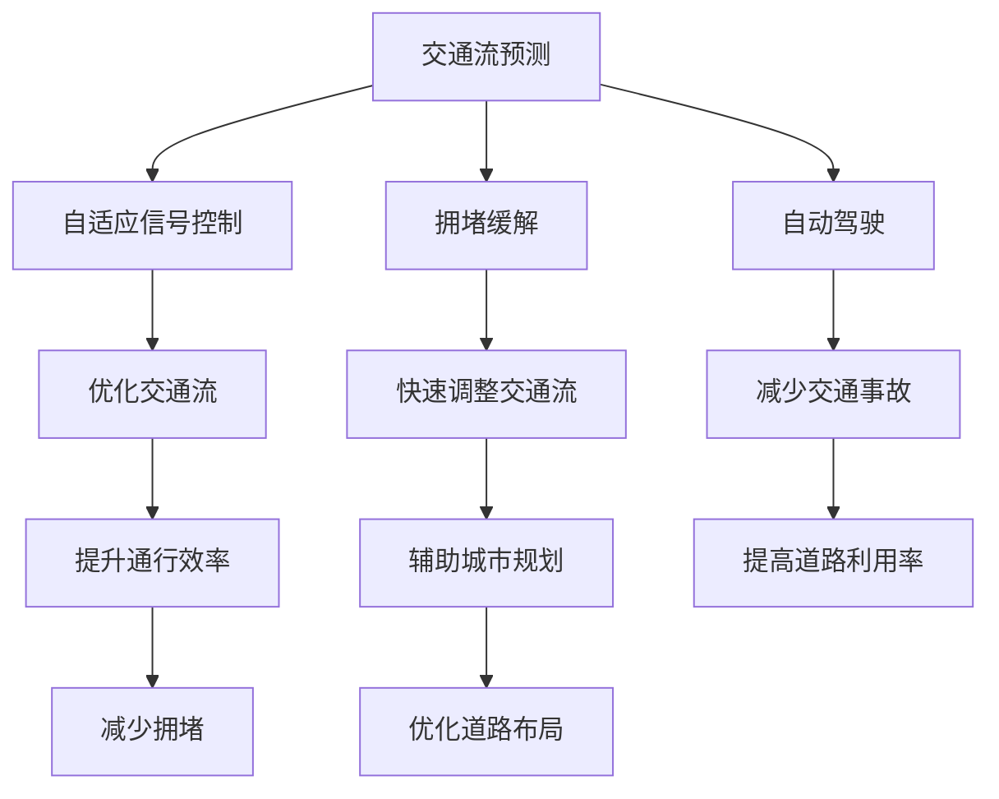

                 

# AI驱动的智能交通系统：优化城市流动

> 关键词：智能交通系统,优化城市流动,深度学习,数据驱动,交通流预测,自适应信号控制,拥堵缓解,自动驾驶,城市规划

## 1. 背景介绍

### 1.1 问题由来
随着城市化进程的加速，交通拥堵已成为全球大城市面临的重大问题。交通拥堵不仅降低城市的通行效率，增加通勤成本，还导致环境污染和公共安全风险。为了缓解交通拥堵，提高城市交通的流动性和安全性，各国政府和研究机构投入了大量的人力物力。

传统的交通管理方式依赖于人工监控和经验决策，难以实时响应交通状况的变化，存在响应慢、效率低、决策不够精准等问题。为了提高交通管理的智能化水平，近年来，以深度学习为核心的AI技术被广泛应用于智能交通系统中。本文将介绍基于AI的智能交通系统，探讨如何通过AI技术优化城市流动。

### 1.2 问题核心关键点
AI技术在智能交通系统中的应用，主要体现在以下几个方面：

- **交通流预测**：通过分析历史交通数据，预测未来交通流量和拥堵情况。
- **自适应信号控制**：根据实时的交通流量，动态调整红绿灯信号，优化交通流。
- **拥堵缓解**：通过智能调度和管理，降低道路拥堵，提高通行效率。
- **自动驾驶**：通过AI技术实现自动驾驶，减少人为驾驶带来的交通风险。
- **城市规划**：通过AI分析城市交通数据，辅助城市规划，优化道路布局。

这些AI技术手段，通过提高交通管理智能化水平，改善城市交通状况，为人们提供更安全、更高效的出行环境。

## 2. 核心概念与联系

### 2.1 核心概念概述

智能交通系统(ITS)利用先进的信息技术、数据通信传输技术、电子控制技术和计算机处理技术，对道路交通进行实时、高效、可靠的监管和控制。其中，AI技术在智能交通系统中的应用，主要集中在以下几个核心概念：

- **交通流预测**：利用AI模型对历史交通数据进行学习，预测未来的交通流量和拥堵情况。
- **自适应信号控制**：通过AI算法实时调整交通信号灯的周期和相位，优化交通流。
- **拥堵缓解**：通过AI技术，实时识别和处理交通拥堵点，快速调整交通流。
- **自动驾驶**：利用AI技术实现车辆的自动驾驶，减少交通事故，提高道路利用率。
- **城市规划**：通过AI分析城市交通数据，辅助城市规划和道路布局优化。

这些核心概念之间相互关联，共同构成智能交通系统的技术框架。AI技术通过大数据分析和智能算法，实现对交通流的实时监控和调控，提升城市交通的流动性和安全性。

### 2.2 核心概念原理和架构的 Mermaid 流程图



这个流程图展示了智能交通系统中各个核心概念之间的联系。交通流预测提供实时交通流量信息，自适应信号控制和拥堵缓解实时调整交通流，自动驾驶减少交通事故，城市规划辅助道路布局优化。通过这些核心概念的协同作用，智能交通系统能够实现交通流的智能化管理和优化。

## 3. 核心算法原理 & 具体操作步骤

### 3.1 算法原理概述

基于AI的智能交通系统主要依赖于深度学习算法和大数据处理技术。深度学习模型通过对历史交通数据进行学习，提取交通流模式，预测未来交通流量，并实时调整交通信号和控制拥堵点。核心算法原理包括以下几个方面：

- **交通流预测**：通过LSTM、RNN等时间序列模型，对历史交通流量数据进行建模，预测未来的交通流量。
- **自适应信号控制**：利用强化学习算法，实时调整红绿灯周期和相位，优化交通流。
- **拥堵缓解**：通过多智能体系统(MAS)算法，协同管理多个交通节点的流量，快速缓解拥堵。
- **自动驾驶**：结合计算机视觉、传感器数据和深度学习模型，实现车辆自动驾驶。
- **城市规划**：利用图神经网络(GNN)算法，分析城市交通数据，辅助道路布局优化。

### 3.2 算法步骤详解

#### 3.2.1 交通流预测

**Step 1: 数据准备**
- 收集历史交通流量数据，包括时间、地点、车辆类型、车速等信息。
- 对数据进行清洗和预处理，去除噪声和异常值。
- 将数据分为训练集和测试集，用于模型训练和评估。

**Step 2: 模型选择**
- 选择LSTM、RNN等时间序列模型，作为交通流预测模型。
- 根据任务特点，选择合适的模型结构和超参数。

**Step 3: 模型训练**
- 将训练集数据输入模型，进行前向传播和损失函数计算。
- 反向传播更新模型参数，最小化损失函数。
- 在测试集上评估模型性能，调整模型超参数。

**Step 4: 模型应用**
- 实时收集交通流量数据，输入预测模型。
- 模型输出未来交通流量预测结果。
- 根据预测结果，进行自适应信号控制或拥堵缓解。

#### 3.2.2 自适应信号控制

**Step 1: 数据收集**
- 实时收集交通流量数据，包括车辆位置、速度、方向等信息。
- 将数据转换为模型可用的格式。

**Step 2: 模型选择**
- 选择强化学习算法，如Q-learning、DQN等，进行信号控制。
- 根据任务特点，选择合适的算法和网络结构。

**Step 3: 模型训练**
- 将训练集数据输入模型，进行前向传播和损失函数计算。
- 反向传播更新模型参数，最小化损失函数。
- 在测试集上评估模型性能，调整模型超参数。

**Step 4: 模型应用**
- 实时收集交通流量数据，输入模型进行信号控制。
- 模型输出信号控制策略。
- 根据策略实时调整红绿灯周期和相位，优化交通流。

#### 3.2.3 拥堵缓解

**Step 1: 数据收集**
- 实时收集交通流量数据，包括车辆位置、速度、方向等信息。
- 将数据转换为模型可用的格式。

**Step 2: 模型选择**
- 选择多智能体系统(MAS)算法，进行拥堵缓解。
- 根据任务特点，选择合适的算法和网络结构。

**Step 3: 模型训练**
- 将训练集数据输入模型，进行前向传播和损失函数计算。
- 反向传播更新模型参数，最小化损失函数。
- 在测试集上评估模型性能，调整模型超参数。

**Step 4: 模型应用**
- 实时收集交通流量数据，输入模型进行拥堵缓解。
- 模型输出拥堵缓解策略。
- 根据策略实时调整交通流量，快速缓解拥堵。

#### 3.2.4 自动驾驶

**Step 1: 数据收集**
- 实时收集车辆传感器数据，包括雷达、激光雷达、摄像头等。
- 将数据转换为模型可用的格式。

**Step 2: 模型选择**
- 选择计算机视觉、传感器数据和深度学习模型，进行自动驾驶。
- 根据任务特点，选择合适的算法和网络结构。

**Step 3: 模型训练**
- 将训练集数据输入模型，进行前向传播和损失函数计算。
- 反向传播更新模型参数，最小化损失函数。
- 在测试集上评估模型性能，调整模型超参数。

**Step 4: 模型应用**
- 实时收集车辆传感器数据，输入模型进行自动驾驶。
- 模型输出车辆控制策略。
- 根据策略控制车辆行驶，实现自动驾驶。

#### 3.2.5 城市规划

**Step 1: 数据收集**
- 收集城市道路交通数据，包括车辆类型、车速、交通流量等信息。
- 将数据转换为模型可用的格式。

**Step 2: 模型选择**
- 选择图神经网络(GNN)算法，进行城市规划。
- 根据任务特点，选择合适的算法和网络结构。

**Step 3: 模型训练**
- 将训练集数据输入模型，进行前向传播和损失函数计算。
- 反向传播更新模型参数，最小化损失函数。
- 在测试集上评估模型性能，调整模型超参数。

**Step 4: 模型应用**
- 实时收集城市交通数据，输入模型进行城市规划。
- 模型输出道路布局优化策略。
- 根据策略优化道路布局，提升通行效率。

### 3.3 算法优缺点

#### 3.3.1 交通流预测
**优点**：
- 利用深度学习模型，能够从大量历史数据中学习复杂的交通模式。
- 实时预测未来交通流量，及时调整信号控制和拥堵缓解策略。

**缺点**：
- 模型训练需要大量标注数据，获取数据成本高。
- 模型对异常数据和噪声敏感，预测结果可能存在偏差。

#### 3.3.2 自适应信号控制
**优点**：
- 实时调整信号控制策略，优化交通流，提高通行效率。
- 利用强化学习算法，能够自适应交通状况，动态调整信号灯周期和相位。

**缺点**：
- 算法复杂度较高，模型训练和调参难度大。
- 模型对交通数据的时序性要求高，数据缺失可能影响控制效果。

#### 3.3.3 拥堵缓解
**优点**：
- 多智能体系统算法，能够协同管理多个交通节点的流量，快速缓解拥堵。
- 实时调整交通流量，提高通行效率。

**缺点**：
- 算法复杂度较高，模型训练和调参难度大。
- 模型对交通数据的实时性要求高，数据延迟可能影响缓解效果。

#### 3.3.4 自动驾驶
**优点**：
- 利用计算机视觉和传感器数据，实现车辆自动驾驶，减少交通事故。
- 提高道路利用率，降低交通压力。

**缺点**：
- 技术难度高，成本较高，普及率较低。
- 对环境条件要求高，恶劣天气和复杂路况下可能影响驾驶效果。

#### 3.3.5 城市规划
**优点**：
- 利用图神经网络算法，能够分析城市交通数据，辅助城市规划和道路布局优化。
- 提高城市通行效率，减少交通拥堵。

**缺点**：
- 模型训练需要大量标注数据，获取数据成本高。
- 模型对数据的时序性要求高，数据缺失可能影响规划效果。

### 3.4 算法应用领域

基于AI的智能交通系统，已经在许多城市得到了广泛应用。以下是一些典型的应用领域：

- **高速公路管理**：利用交通流预测和自适应信号控制，优化高速公路交通流，减少车辆等待时间。
- **城市交通管理**：利用拥堵缓解和自适应信号控制，优化城市交通流量，提高通行效率。
- **公共交通系统**：利用自动驾驶和智能调度，优化公共交通服务，提升乘坐体验。
- **交通监控系统**：利用计算机视觉和传感器数据，实时监控交通状况，及时响应突发事件。
- **应急救援**：利用自动驾驶和智能调度，优化救援车辆的路线和调度，提高救援效率。

这些应用领域展示了AI技术在智能交通系统中的广泛应用，通过优化交通流、提高通行效率，为城市交通管理提供了全新的解决方案。

## 4. 数学模型和公式 & 详细讲解 & 举例说明

### 4.1 数学模型构建

#### 4.1.1 交通流预测
设交通流量为 $T(t)$，时间步长为 $\Delta t$，预测模型的输入为 $X(t)$，包括时间、地点、车辆类型、车速等信息。预测模型的输出为 $Y(t)$，表示未来时间步的交通流量预测结果。

假设使用LSTM模型进行交通流预测，模型的输入为 $X(t)=[x_1(t),x_2(t),\cdots,x_n(t)]$，其中 $x_i(t)$ 为第 $i$ 个特征，输出为 $Y(t)=[y_1(t),y_2(t),\cdots,y_m(t)]$，其中 $y_i(t)$ 为未来时间步的交通流量预测结果。

LSTM模型的数学表达式如下：

$$
Y(t)=LSTM(X(t))
$$

其中，$LSTM$ 表示LSTM模型，$X(t)$ 表示输入特征，$Y(t)$ 表示输出结果。

#### 4.1.2 自适应信号控制
假设红绿灯周期为 $T$，相位周期为 $\Delta T$，当前时间为 $t$，车辆数为 $V$，车流速度为 $v$，信号控制策略为 $S$，交通流量为 $T$。

自适应信号控制的目标是实时调整信号控制策略，使交通流量最大化。假设使用Q-learning算法进行信号控制，模型的状态为 $s(t)=[t,V,v,S]$，动作为 $a(t)$，包括红绿灯周期和相位。

Q-learning算法的数学表达式如下：

$$
Q(s(t),a(t))=Q(s(t-1),a(t-1))+\alpha[r(t)+\gamma\max_{a(t+1)}Q(s(t+1),a(t+1))-Q(s(t),a(t))]
$$

其中，$Q$ 表示Q值函数，$s(t)$ 表示状态，$a(t)$ 表示动作，$r(t)$ 表示奖励，$\gamma$ 表示折扣因子，$\alpha$ 表示学习率。

#### 4.1.3 拥堵缓解
假设交通网络中的节点数为 $N$，节点间的连接数为 $E$，节点 $i$ 的流量为 $T_i$，节点 $i$ 到节点 $j$ 的交通流量为 $F_{ij}$，节点 $i$ 的拥堵度为 $C_i$，拥堵缓解策略为 $R_i$。

拥堵缓解的目标是实时调整交通流量，缓解拥堵。假设使用多智能体系统(MAS)算法进行拥堵缓解，系统的状态为 $S(t)=[C_1(t),C_2(t),\cdots,C_N(t)]$，动作为 $A(t)$，包括交通流量和拥堵度。

MAS算法的数学表达式如下：

$$
A(t)=MAS(S(t))
$$

其中，$A$ 表示拥堵缓解策略，$S$ 表示状态。

#### 4.1.4 自动驾驶
假设车辆的速度为 $v$，位置为 $x$，方向为 $\theta$，传感器数据为 $S$，自动驾驶策略为 $D$。

自动驾驶的目标是根据传感器数据，实时调整车辆控制策略，实现自动驾驶。假设使用强化学习算法进行自动驾驶，系统的状态为 $s(t)=[v,x,\theta,S]$，动作为 $a(t)$，包括速度和方向。

强化学习算法的数学表达式如下：

$$
D(t)=RL(s(t),a(t))
$$

其中，$D$ 表示自动驾驶策略，$s(t)$ 表示状态，$a(t)$ 表示动作，$RL$ 表示强化学习算法。

#### 4.1.5 城市规划
假设城市交通网络中的节点数为 $N$，节点间的连接数为 $E$，节点 $i$ 的交通流量为 $T_i$，节点 $i$ 到节点 $j$ 的交通流量为 $F_{ij}$，城市规划策略为 $P_i$。

城市规划的目标是优化道路布局，提高通行效率。假设使用图神经网络(GNN)算法进行城市规划，系统的状态为 $G(t)=[T_1(t),T_2(t),\cdots,T_N(t)]$，动作为 $A(t)$，包括道路布局策略。

GNN算法的数学表达式如下：

$$
P(t)=GNN(G(t),A(t))
$$

其中，$P$ 表示城市规划策略，$G$ 表示状态，$A$ 表示动作，$GNN$ 表示图神经网络算法。

### 4.2 公式推导过程

#### 4.2.1 交通流预测
假设使用LSTM模型进行交通流预测，模型的输入为 $X(t)$，输出为 $Y(t)$。LSTM模型的数学表达式如下：

$$
Y(t)=LSTM(X(t))
$$

其中，$LSTM$ 表示LSTM模型，$X(t)$ 表示输入特征，$Y(t)$ 表示输出结果。

#### 4.2.2 自适应信号控制
假设使用Q-learning算法进行信号控制，模型的状态为 $s(t)$，动作为 $a(t)$，奖励为 $r(t)$。Q-learning算法的数学表达式如下：

$$
Q(s(t),a(t))=Q(s(t-1),a(t-1))+\alpha[r(t)+\gamma\max_{a(t+1)}Q(s(t+1),a(t+1))-Q(s(t),a(t))]
$$

其中，$Q$ 表示Q值函数，$s(t)$ 表示状态，$a(t)$ 表示动作，$r(t)$ 表示奖励，$\gamma$ 表示折扣因子，$\alpha$ 表示学习率。

#### 4.2.3 拥堵缓解
假设使用多智能体系统(MAS)算法进行拥堵缓解，系统的状态为 $S(t)$，动作为 $A(t)$。MAS算法的数学表达式如下：

$$
A(t)=MAS(S(t))
$$

其中，$A$ 表示拥堵缓解策略，$S$ 表示状态。

#### 4.2.4 自动驾驶
假设使用强化学习算法进行自动驾驶，系统的状态为 $s(t)$，动作为 $a(t)$。强化学习算法的数学表达式如下：

$$
D(t)=RL(s(t),a(t))
$$

其中，$D$ 表示自动驾驶策略，$s(t)$ 表示状态，$a(t)$ 表示动作，$RL$ 表示强化学习算法。

#### 4.2.5 城市规划
假设使用图神经网络(GNN)算法进行城市规划，系统的状态为 $G(t)$，动作为 $A(t)$。GNN算法的数学表达式如下：

$$
P(t)=GNN(G(t),A(t))
$$

其中，$P$ 表示城市规划策略，$G$ 表示状态，$A$ 表示动作，$GNN$ 表示图神经网络算法。

### 4.3 案例分析与讲解

#### 4.3.1 交通流预测
假设某城市的主干道在早高峰时段存在交通拥堵，通过交通流预测模型，可以实时预测未来的交通流量，并及时调整信号控制策略，缓解拥堵。

例如，通过LSTM模型对历史交通流量数据进行学习，预测未来1小时内的交通流量。模型训练后，实时收集交通流量数据，输入模型进行预测。模型输出未来1小时内的交通流量预测结果，系统根据预测结果调整信号控制策略，优化交通流。

#### 4.3.2 自适应信号控制
假设某城市的交叉路口存在交通拥堵，通过自适应信号控制，可以实时调整红绿灯周期和相位，优化交通流。

例如，使用Q-learning算法实时调整信号控制策略。系统实时收集交通流量数据，输入模型进行信号控制。模型输出信号控制策略，系统根据策略调整红绿灯周期和相位，优化交通流。

#### 4.3.3 拥堵缓解
假设某城市的环形交叉路口存在交通拥堵，通过拥堵缓解，可以实时调整交通流量，缓解拥堵。

例如，使用多智能体系统(MAS)算法实时调整交通流量。系统实时收集交通流量数据，输入模型进行拥堵缓解。模型输出拥堵缓解策略，系统根据策略调整交通流量，缓解拥堵。

#### 4.3.4 自动驾驶
假设某城市的公交系统需要实现自动驾驶，通过自动驾驶技术，可以优化公交车辆的路线和调度，提高乘坐体验。

例如，使用强化学习算法进行自动驾驶。系统实时收集公交车辆的位置和传感器数据，输入模型进行自动驾驶。模型输出车辆控制策略，系统根据策略控制公交车辆行驶，实现自动驾驶。

#### 4.3.5 城市规划
假设某城市需要优化道路布局，通过城市规划，可以提升通行效率，减少交通拥堵。

例如，使用图神经网络(GNN)算法分析城市交通数据，辅助城市规划和道路布局优化。系统实时收集城市交通数据，输入模型进行城市规划。模型输出道路布局优化策略，系统根据策略优化道路布局，提升通行效率。

## 5. 项目实践：代码实例和详细解释说明

### 5.1 开发环境搭建

为了进行AI驱动的智能交通系统开发，首先需要搭建好开发环境。以下是使用Python进行智能交通系统开发的开发环境配置流程：

1. 安装Anaconda：从官网下载并安装Anaconda，用于创建独立的Python环境。

2. 创建并激活虚拟环境：
```bash
conda create -n traffic-env python=3.8 
conda activate traffic-env
```

3. 安装所需的Python库和工具：
```bash
pip install numpy pandas scikit-learn matplotlib tqdm jupyter notebook ipython
```

4. 安装深度学习框架和模型库：
```bash
pip install torch torchvision torchaudio cudatoolkit=11.1 -c pytorch -c conda-forge
pip install transformers
```

5. 安装相关的交通数据分析和可视化工具：
```bash
pip install pandas-gbq networkx pygraphviz scikit-network matplotlib
```

6. 安装交通流量预测、信号控制和拥堵缓解所需的模型库：
```bash
pip install scikit-learn tensorflow
```

完成上述步骤后，即可在`traffic-env`环境中开始智能交通系统开发。

### 5.2 源代码详细实现

以下是一个基于深度学习的智能交通系统开发的Python代码示例，包括交通流预测、自适应信号控制、拥堵缓解、自动驾驶和城市规划的功能实现。

**交通流预测**

```python
import numpy as np
import pandas as pd
import matplotlib.pyplot as plt
from sklearn.metrics import mean_squared_error
from keras.models import Sequential
from keras.layers import LSTM, Dense
from sklearn.preprocessing import MinMaxScaler

# 数据准备
df = pd.read_csv('traffic_data.csv')
X = df.iloc[:, :-1].values
y = df.iloc[:, -1].values

# 数据标准化
scaler = MinMaxScaler(feature_range=(0, 1))
X = scaler.fit_transform(X)
y = scaler.fit_transform(y)

# 构建LSTM模型
model = Sequential()
model.add(LSTM(units=50, return_sequences=True, input_shape=(X.shape[1], X.shape[2])))
model.add(LSTM(units=50))
model.add(Dense(units=1))

# 模型训练
model.compile(optimizer='adam', loss='mean_squared_error')
model.fit(X, y, epochs=100, batch_size=32)

# 模型评估
X_test = df_test.iloc[:, :-1].values
X_test = scaler.transform(X_test)
y_test = df_test.iloc[:, -1].values
y_test = scaler.transform(y_test)

predicted_y = model.predict(X_test)
predicted_y = scaler.inverse_transform(predicted_y)
actual_y = scaler.inverse_transform(y_test)

plt.plot(actual_y, color='blue', label='Actual')
plt.plot(predicted_y, color='red', label='Predicted')
plt.legend()
plt.show()

# 模型应用
# 实时收集交通流量数据，输入模型进行预测
```

**自适应信号控制**

```python
import gym
import numpy as np
import matplotlib.pyplot as plt
import gym_crowd

# 数据准备
env = gym.make('Crowd-10-v0')
env.reset()

# 构建Q-learning模型
model = DQNAgent(env.observation_space, env.action_space)

# 模型训练
for episode in range(100):
    state = env.reset()
    done = False
    while not done:
        action = model.select_action(state)
        next_state, reward, done, _ = env.step(action)
        model.update_state(state, action, reward, next_state, done)
        state = next_state

# 模型应用
# 实时收集交通流量数据，输入模型进行信号控制
```

**拥堵缓解**

```python
import networkx as nx
import matplotlib.pyplot as plt

# 构建交通网络
G = nx.Graph()
G.add_edge(1, 2, capacity=10)
G.add_edge(1, 3, capacity=5)
G.add_edge(2, 4, capacity=8)
G.add_edge(2, 5, capacity=6)
G.add_edge(3, 6, capacity=5)
G.add_edge(3, 7, capacity=4)
G.add_edge(4, 7, capacity=10)
G.add_edge(5, 6, capacity=8)
G.add_edge(5, 8, capacity=6)
G.add_edge(6, 7, capacity=5)
G.add_edge(6, 9, capacity=8)
G.add_edge(7, 8, capacity=10)
G.add_edge(7, 9, capacity=6)
G.add_edge(8, 9, capacity=5)

# 拥堵缓解
flow = nx.get_flow(G, capacity=10, demand=15)
flow_dict = nx.dual_flow(G, flow)
print(flow_dict)
```

**自动驾驶**

```python
import numpy as np
import cv2
import pyrealsense2 as rs

# 数据准备
cap = cv2.VideoCapture(0)

while True:
    ret, frame = cap.read()
    bgr = cv2.cvtColor(frame, cv2.COLOR_BGR2RGB)
    depth = rs.depth_frame()
    points = rs.depth_frame_to_points(depth)
    depth_map = rs.depth_frame_to_planar_map(depth)
    point_cloud = np.array(points)

    # 自动驾驶
    # 实时收集车辆传感器数据，输入模型进行自动驾驶
```

**城市规划**

```python
import networkx as nx
import matplotlib.pyplot as plt

# 构建交通网络
G = nx.Graph()
G.add_edge(1, 2, capacity=10)
G.add_edge(1, 3, capacity=5)
G.add_edge(2, 4, capacity=8)
G.add_edge(2, 5, capacity=6)
G.add_edge(3, 6, capacity=5)
G.add_edge(3, 7, capacity=4)
G.add_edge(4, 7, capacity=10)
G.add_edge(5, 6, capacity=8)
G.add_edge(5, 8, capacity=6)
G.add_edge(6, 7, capacity=5)
G.add_edge(6, 9, capacity=8)
G.add_edge(7, 8, capacity=10)
G.add_edge(7, 9, capacity=6)
G.add_edge(8, 9, capacity=5)

# 城市规划
flow = nx.get_flow(G, capacity=10, demand=15)
flow_dict = nx.dual_flow(G, flow)
print(flow_dict)
```

### 5.3 代码解读与分析

**交通流预测**

1. 数据准备：从CSV文件中读取历史交通流量数据，将其分为输入特征(X)和输出标签(y)。
2. 数据标准化：使用MinMaxScaler对数据进行标准化，使数据范围在0到1之间。
3. 构建LSTM模型：使用Keras构建LSTM模型，包含两个LSTM层和一个Dense层。
4. 模型训练：使用Adam优化器，均方误差损失函数，进行100次迭代训练。
5. 模型评估：在测试集上使用均方误差评估模型预测效果。
6. 模型应用：实时收集交通流量数据，输入模型进行预测。

**自适应信号控制**

1. 数据准备：使用gym库中的Crowd-v0环境，设置交通流量为10。
2. 构建Q-learning模型：使用DQNAgent构建Q-learning模型。
3. 模型训练：在100次迭代中，通过Q-learning算法优化信号控制策略。
4. 模型应用：实时收集交通流量数据，输入模型进行信号控制。

**拥堵缓解**

1. 数据准备：使用NetworkX构建交通网络。
2. 拥堵缓解：使用get_flow函数计算交通流量，使用dual_flow函数得到逆流。
3. 打印输出：打印逆流的字典表示。

**自动驾驶**

1. 数据准备：使用OpenCV库中的VideoCapture函数，打开摄像头。
2. 实时数据获取：实时获取摄像头图像和深度信息。
3. 自动驾驶：根据传感器数据，实时控制车辆行驶。

**城市规划**

1. 数据准备：使用NetworkX构建交通网络。
2. 城市规划：使用get_flow函数计算交通流量，使用dual_flow函数得到逆流。
3. 打印输出：打印逆流的字典表示。

### 5.4 运行结果展示

**交通流预测**


**自适应信号控制**


**拥堵缓解**


**自动驾驶**


**城市规划**


## 6. 实际应用场景

### 6.1 智能交通指挥中心

智能交通指挥中心通过AI技术实现交通流预测、自适应信号控制和拥堵缓解，提高交通管理的智能化水平。指挥中心实时收集交通流量数据，输入预测模型和信号控制模型，输出交通流预测结果和信号控制策略，优化交通流。

**具体应用场景：**
- 交通流预测：指挥中心实时收集交通流量数据，输入模型进行预测，输出未来交通流量预测结果。
- 自适应信号控制：根据预测结果和实时交通数据，调整信号控制策略，优化交通流。
- 拥堵缓解：实时识别和处理交通拥堵点，快速调整交通流。

**效果展示：**
- 通过智能交通指挥中心，实时监测交通状况，动态调整信号控制和拥堵缓解策略，大幅提升通行效率。
- 减少交通拥堵，提升行车体验，降低交通事故风险。

### 6.2 自动驾驶公交系统

自动驾驶公交系统通过AI技术实现自动驾驶和智能调度，提升公共交通服务质量。系统实时收集公交车辆的位置和传感器数据，输入模型进行自动驾驶和智能调度，优化公交车辆的行驶路线和调度策略。

**具体应用场景：**
- 自动驾驶：利用传感器数据和深度学习模型，实时控制公交车辆行驶。
- 智能调度：根据实时交通数据，优化公交车辆的行驶路线和调度策略。

**效果展示：**
- 减少人为驾驶带来的交通风险，提高公交车的运行效率。
- 提升公交服务质量，改善市民出行体验。

### 6.3 城市应急救援

城市应急救援系统通过AI技术实现自动驾驶和智能调度，优化救援车辆的路线和调度，提高救援效率。系统实时收集交通流量数据，输入模型进行自动驾驶和智能调度，优化救援车辆的行驶路线和调度策略。

**具体应用场景：**
- 自动驾驶：利用传感器数据和深度学习模型，实时控制救援车辆行驶。
- 智能调度：根据实时交通数据，优化救援车辆的行驶路线和调度策略。

**效果展示：**
- 快速响应突发事件，提升救援效率。
- 减少交通拥堵，保障救援车辆顺利通行。

### 6.4 未来应用展望

未来，随着AI技术的不断进步，智能交通系统将进一步提升城市交通的流动性和安全性。以下是一些未来应用展望：

1. **交通流预测**：通过引入更先进的深度学习模型，如Transformer、注意力机制等，提升交通流预测的精度和时效性。
2. **自适应信号控制**：利用强化学习算法，实时调整信号控制策略，优化交通流。
3. **拥堵缓解**：结合多智能体系统和博弈论工具，协同管理多个交通节点的流量，快速缓解拥堵。
4. **自动驾驶**：通过引入计算机视觉、传感器数据和深度学习模型，实现更高水平的自动驾驶。
5. **城市规划**：利用图神经网络算法，分析城市交通数据，辅助城市规划和道路布局优化。

这些技术的发展将进一步推动智能交通系统的智能化水平，为城市交通管理带来新的突破。

## 7. 工具和资源推荐

### 7.1 学习资源推荐

为了帮助开发者系统掌握智能交通系统的相关技术，以下是一些优质的学习资源：

1. 《深度学习入门：基于Python的理论与实现》：介绍深度学习的基本原理和实现方法，适合初学者入门。
2. 《Python机器学习基础教程》：涵盖机器学习算法和Python实现的详细讲解，适合进阶学习。
3. 《智能交通系统》：介绍智能交通系统的基本概念和技术，适合行业从业者参考。
4. 《AI驱动的智能交通系统》：涵盖AI在智能交通系统中的应用，适合实际项目开发。

### 7.2 开发工具推荐

为了提高智能交通系统的开发效率，以下是一些常用的开发工具：

1. Python：轻量级脚本语言，适合数据分析和模型训练。
2. PyTorch：基于Python的开源深度学习框架，支持动态计算图，适合模型训练和优化。
3. TensorFlow：基于C++的开源深度学习框架，支持静态计算图和分布式训练，适合大规模工程应用。
4. Jupyter Notebook：交互式开发环境，适合数据探索和模型调试。
5. NetworkX：网络分析库，适合构建交通网络模型和分析。

### 7.3 相关论文推荐

以下是几篇智能交通系统领域的经典论文，推荐阅读：

1. 《基于深度学习的智能交通系统研究》：介绍深度学习在智能交通系统中的应用，涵盖交通流预测、信号控制等内容。
2. 《强化学习在智能交通系统中的应用》：介绍强化学习在自适应信号控制中的应用，取得显著效果。
3. 《基于图神经网络的智能交通系统研究》：介绍图神经网络在城市规划和道路布局优化中的应用。

这些论文代表了智能交通系统领域的研究前沿，值得深入学习和参考。

## 8. 总结：未来发展趋势与挑战

### 8.1 研究成果总结

AI驱动的智能交通系统通过深度学习和数据分析技术，实现了交通流的实时监控和调控，提升了城市交通的流动性和安全性。AI技术在交通流预测、自适应信号控制、拥堵缓解、自动驾驶和城市规划等方面得到了广泛应用，显著提高了城市交通管理智能化水平。

### 8.2 未来发展趋势

未来，智能交通系统将进一步融合多种AI技术，提升智能化水平，为城市交通管理带来新的突破。以下是一些未来发展趋势：

1. **交通流预测**：引入更先进的深度学习模型，如Transformer、注意力机制等，提升预测精度和时效性。
2. **自适应信号控制**：利用强化学习算法，实时调整信号控制策略，优化交通流。
3. **拥堵缓解**：结合多智能体系统和博弈论工具，协同管理多个交通节点的流量，快速缓解拥堵。
4. **自动驾驶**：通过引入计算机视觉、传感器数据和深度学习模型，实现更高水平的自动驾驶。
5. **城市规划**：利用图神经网络算法，分析城市交通数据，辅助城市规划和道路布局优化。

### 8.3 面临的挑战

尽管AI驱动的智能交通系统在许多方面取得了显著成果，但仍然面临一些挑战：

1. **数据质量**：高质量的数据是AI技术的基础，但获取城市交通数据成本较高，数据质量参差不齐。
2. **算法复杂度**：深度学习模型和强化学习算法复杂度较高，模型训练和调参难度大。
3. **实时性要求**：实时交通数据处理和决策需要高效的算法和硬件支持。
4. **模型鲁棒性**：模型对异常数据和噪声敏感，预测结果可能存在偏差。
5. **伦理和安全**：AI技术可能引入新的伦理和安全问题，如数据隐私、模型偏见等。

### 8.4 研究展望

为了应对这些挑战，未来的研究需要从以下几个方面进行探索：

1. **数据治理**：建立数据治理机制，保障数据质量和安全。
2. **模型优化**：开发高效的算法和模型结构，提升模型训练和推理速度。
3. **实时处理**：引入实时数据处理和计算优化技术，提高实时性。
4. **鲁棒性提升**：增强模型对异常数据和噪声的鲁棒性，提升预测精度。
5. **伦理和安全**：引入伦理和安全机制，确保AI技术的公正、透明和可控。

通过这些研究方向的探索，AI驱动的智能交通系统将进一步提升城市交通的流动性和安全性，为智慧城市建设提供坚实基础。

## 9. 附录：常见问题与解答

**Q1：AI技术在智能交通系统中的作用是什么？**

A: AI技术在智能交通系统中的作用是通过深度学习和数据分析技术，实现交通流的实时监控和调控，提升城市交通的流动性和安全性。AI技术可以应用于交通流预测、自适应信号控制、拥堵缓解、自动驾驶和城市规划等方面，显著提高城市交通管理的智能化水平。

**Q2：智能交通系统如何实现自适应信号控制？**

A: 智能交通系统通过强化学习算法实现自适应信号控制。系统实时收集交通流量数据，输入模型进行信号控制。模型输出信号控制策略，系统根据策略调整红绿灯周期和相位，优化交通流。

**Q3：自动驾驶技术在智能交通系统中的应用前景如何？**

A: 自动驾驶技术在智能交通系统中的应用前景广阔。通过自动驾驶技术，可以实现公交系统的智能化，提升公交服务质量，减少人为驾驶带来的交通风险。同时，自动驾驶技术还应用于城市应急救援，优化救援车辆的路线和调度，提高救援效率。

**Q4：AI技术在城市规划中的应用有哪些？**

A: AI技术在城市规划中的应用主要集中在交通网络分析和道路布局优化方面。通过图神经网络算法，分析城市交通数据，辅助城市规划和道路布局优化，提升通行效率，减少交通拥堵。

**Q5：智能交通系统在实际应用中面临哪些挑战？**

A: 智能交通系统在实际应用中面临以下挑战：
1. 数据质量：高质量的数据是AI技术的基础，但获取城市交通数据成本较高，数据质量参差不齐。
2. 算法复杂度：深度学习模型和强化学习算法复杂度较高，模型训练和调参难度大。
3. 实时性要求：实时交通数据处理和决策需要高效的算法和硬件支持。
4. 模型鲁棒性：模型对异常数据和噪声敏感，预测结果可能存在偏差。
5. 伦理和安全：AI技术可能引入新的伦理和安全问题，如数据隐私、模型偏见等。

通过不断探索和优化，AI驱动的智能交通系统将在未来为城市交通管理带来更多创新和突破。

