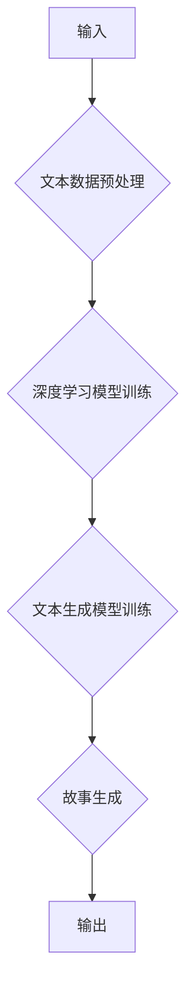

                 

## AI故事创作：算法与人类创意的碰撞

> 关键词：人工智能、故事创作、算法、创意、自然语言处理、深度学习、文本生成、叙事结构、人物塑造、情节设计

### 1. 背景介绍

故事，是人类文明中永恒的主题。从古老的寓言到现代的畅销小说，故事承载着我们的情感、智慧和对世界的理解。随着人工智能技术的飞速发展，一个令人兴奋的问题逐渐浮出水面：能否利用算法的力量，创作出具有感染力和深度的故事？

传统的文学创作依赖于人类的想象力和经验，是一个充满灵性和创造力的过程。而人工智能，作为一种基于数据和算法的智能系统，能否真正理解和模拟人类的创造力，并将其应用于故事创作领域？

### 2. 核心概念与联系

故事创作的核心在于构建一个引人入胜的叙事结构，塑造鲜活的人物形象，设计跌宕起伏的情节，并用语言将这些元素巧妙地融合在一起。

**AI故事创作的核心概念包括：**

* **自然语言处理 (NLP):**  NLP是人工智能领域的一个重要分支，致力于使计算机能够理解、生成和处理人类语言。在故事创作中，NLP技术可以帮助AI理解故事的语法结构、语义关系和情感表达，并生成符合自然语言规律的文本。
* **深度学习 (Deep Learning):** 深度学习是一种机器学习的子领域，它利用多层神经网络来学习复杂的模式和关系。在故事创作中，深度学习可以帮助AI学习大量的文本数据，识别故事的结构模式、人物类型和情节发展规律，从而生成更具创意和连贯性的故事。
* **文本生成:** 文本生成是AI故事创作的关键技术之一，它指让AI能够根据给定的提示或输入，生成新的文本内容。文本生成模型可以学习不同的写作风格和语调，并根据故事的需要生成不同的类型文本，例如人物对话、场景描述、情节推进等。

**AI故事创作的流程:**



### 3. 核心算法原理 & 具体操作步骤

#### 3.1 算法原理概述

AI故事创作的核心算法通常基于深度学习模型，例如循环神经网络 (RNN) 和 transformers。这些模型能够学习文本序列的上下文关系，并根据学习到的知识生成新的文本。

* **循环神经网络 (RNN):** RNN是一种能够处理序列数据的深度学习模型，它具有记忆功能，可以记住之前输入的文本信息，并将其用于生成后续文本。

* **Transformers:** Transformers是一种更先进的深度学习模型，它利用注意力机制来学习文本序列中的长距离依赖关系，能够生成更流畅、更连贯的文本。

#### 3.2 算法步骤详解

1. **文本数据预处理:** 收集大量文本数据，例如小说、剧本、诗歌等，并进行预处理，例如分词、去停用词、词向量化等。

2. **深度学习模型训练:** 使用预处理后的文本数据训练深度学习模型，例如RNN或Transformers。训练过程需要大量的计算资源和时间。

3. **文本生成模型训练:** 使用训练好的深度学习模型，进一步训练文本生成模型。文本生成模型可以根据给定的提示或输入，生成新的文本内容。

4. **故事生成:**  输入故事的主题、人物、场景等信息，让文本生成模型根据这些信息生成故事的文本内容。

#### 3.3 算法优缺点

**优点:**

* **自动化创作:** AI可以自动化故事创作过程，节省人类的时间和精力。
* **创意灵感:** AI可以根据学习到的数据，生成一些意想不到的创意，为人类提供新的灵感。
* **个性化定制:** AI可以根据用户的喜好，生成个性化的故事内容。

**缺点:**

* **缺乏情感理解:** AI目前还无法完全理解人类的情感，生成的文本可能缺乏情感共鸣。
* **故事深度有限:** AI生成的文本通常比较肤浅，缺乏人类创作的深度和复杂性。
* **原创性问题:** AI生成的文本可能存在抄袭或重复性的问题。

#### 3.4 算法应用领域

* **娱乐产业:** 生成小说、剧本、游戏剧情等。
* **教育领域:** 生成互动式故事，帮助学生学习和理解知识。
* **营销领域:** 生成个性化的广告文案和营销故事。
* **艺术创作:** 生成诗歌、剧本、音乐等艺术作品。

### 4. 数学模型和公式 & 详细讲解 & 举例说明

#### 4.1 数学模型构建

在AI故事创作中，常用的数学模型包括：

* **词嵌入模型:** 将单词映射到向量空间，捕捉单词之间的语义关系。例如Word2Vec和GloVe。
* **语言模型:** 预测下一个词出现的概率，用于生成文本。例如RNN和Transformers。
* **生成对抗网络 (GAN):** 训练两个神经网络，一个生成器生成文本，另一个鉴别器判断文本的真实性，通过对抗训练生成更逼真的文本。

#### 4.2 公式推导过程

由于篇幅限制，这里只列举一个简单的词嵌入模型的公式：

**词向量表示:**

$$
\mathbf{w}_i = \mathbf{V}_i
$$

其中：

* $\mathbf{w}_i$ 是单词 $i$ 的词向量表示。
* $\mathbf{V}_i$ 是词嵌入矩阵中的第 $i$ 行向量。

#### 4.3 案例分析与讲解

**词嵌入模型的应用:**

假设我们有一个词嵌入模型，已经训练好了词向量表示。我们可以使用这个模型来计算两个单词之间的语义相似度。例如，我们可以计算 "猫" 和 "狗" 之间的语义相似度，如果这两个单词的词向量表示相近，则它们的语义相似度较高。

### 5. 项目实践：代码实例和详细解释说明

#### 5.1 开发环境搭建

* Python 3.x
* TensorFlow 或 PyTorch 深度学习框架
* NLTK 自然语言处理库

#### 5.2 源代码详细实现

```python
# 使用 TensorFlow 训练一个简单的文本生成模型

import tensorflow as tf

# 定义模型结构
model = tf.keras.Sequential([
    tf.keras.layers.Embedding(input_dim=vocab_size, output_dim=embedding_dim),
    tf.keras.layers.LSTM(units=128),
    tf.keras.layers.Dense(units=vocab_size, activation='softmax')
])

# 编译模型
model.compile(optimizer='adam', loss='sparse_categorical_crossentropy', metrics=['accuracy'])

# 训练模型
model.fit(x_train, y_train, epochs=10)

# 生成文本
seed_text = "The quick brown fox"
for _ in range(10):
    predictions = model.predict(tf.expand_dims(seed_text, 0))
    predicted_index = tf.argmax(predictions[0]).numpy()
    predicted_word = vocabulary[predicted_index]
    seed_text += " " + predicted_word
```

#### 5.3 代码解读与分析

* **词嵌入层:** 将单词映射到向量空间，捕捉单词之间的语义关系。
* **LSTM层:** 能够处理序列数据，学习文本的上下文关系。
* **全连接层:** 将 LSTM 层的输出映射到每个单词的概率分布。
* **softmax激活函数:** 将概率分布归一化到 0 到 1 之间。

#### 5.4 运行结果展示

运行代码后，模型会根据输入的种子文本生成新的文本内容。

### 6. 实际应用场景

#### 6.1  小说创作辅助工具

AI可以帮助作家克服写作瓶颈，生成故事的开头、结尾、情节转折等，并提供不同的写作风格和语调选择。

#### 6.2  游戏剧本生成

AI可以根据游戏设定，生成游戏角色的对话、剧情事件、任务目标等，为游戏开发提供丰富的素材。

#### 6.3  个性化教育故事

AI可以根据学生的年龄、兴趣和学习目标，生成个性化的故事内容，提高学生的学习兴趣和效果。

#### 6.4 未来应用展望

随着人工智能技术的不断发展，AI故事创作将有更广泛的应用场景，例如：

* 生成电影剧本和电视剧剧本
* 生成虚拟现实和增强现实故事体验
* 生成个性化新闻和信息故事
* 生成跨文化和跨语言的故事

### 7. 工具和资源推荐

#### 7.1 学习资源推荐

* **书籍:**

    * 《深度学习》 by Ian Goodfellow, Yoshua Bengio, and Aaron Courville
    * 《自然语言处理入门》 by Jacob Eisenstein

* **在线课程:**

    * Coursera: Deep Learning Specialization
    * Udacity: Natural Language Processing Nanodegree

#### 7.2 开发工具推荐

* **TensorFlow:** https://www.tensorflow.org/
* **PyTorch:** https://pytorch.org/
* **NLTK:** https://www.nltk.org/

#### 7.3 相关论文推荐

* **Attention Is All You Need:** https://arxiv.org/abs/1706.03762
* **Generative Pre-trained Transformer 2:** https://arxiv.org/abs/1905.03122

### 8. 总结：未来发展趋势与挑战

#### 8.1 研究成果总结

AI故事创作是一个充满挑战和机遇的领域。近年来，随着深度学习技术的进步，AI已经能够生成一些具有创意和连贯性的故事。

#### 8.2 未来发展趋势

* **更强大的模型:** 研究人员将继续开发更强大的深度学习模型，例如Transformer的升级版，以生成更逼真、更富有情感的故事。
* **多模态故事创作:** 将文本、图像、音频等多种模态信息融合到故事创作中，创造更沉浸式的体验。
* **个性化定制:** 基于用户的喜好和需求，生成更个性化的故事内容。

#### 8.3 面临的挑战

* **情感理解:** AI目前还无法完全理解人类的情感，生成的文本可能缺乏情感共鸣。
* **故事深度:** AI生成的文本通常比较肤浅，缺乏人类创作的深度和复杂性。
* **原创性问题:** AI生成的文本可能存在抄袭或重复性的问题。

#### 8.4 研究展望

未来，AI故事创作将继续朝着更智能、更具创意的方向发展。相信随着技术的进步，AI将成为人类创作的强大伙伴，帮助我们创造出更多精彩的故事。

### 9. 附录：常见问题与解答

* **AI生成的文本是否原创？**

AI生成的文本可能存在抄袭或重复性的问题，因为它们是基于学习到的数据生成的。

* **AI能否真正理解故事的含义？**

目前，AI还无法完全理解故事的含义，它只能识别故事的结构模式和情节发展规律。

* **AI故事创作会取代人类作家吗？**

AI故事创作可以帮助作家提高效率和激发创意，但它不会完全取代人类作家。人类的想象力和情感表达是AI无法替代的。


作者：禅与计算机程序设计艺术 / Zen and the Art of Computer Programming 
<end_of_turn>

