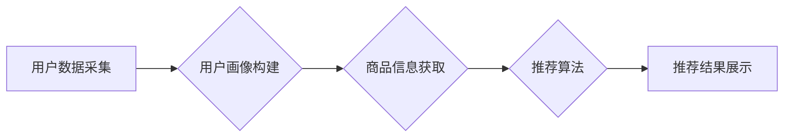

                 

## AI时尚推荐引擎：根据用户的购买历史、浏览行为和社交媒体数据推荐产品

> 关键词：人工智能、推荐系统、时尚电商、用户画像、协同过滤、深度学习、自然语言处理

## 1. 背景介绍

在当今数据爆炸的时代，时尚电商行业面临着激烈的竞争。消费者每天接触着海量商品信息，难以从中找到真正符合自己需求和品味的商品。因此，精准的商品推荐系统成为了时尚电商平台的核心竞争力之一。传统的推荐系统主要基于用户的购买历史或浏览记录，但这种方法往往缺乏个性化和针对性。

近年来，人工智能技术的发展为时尚电商推荐系统带来了新的机遇。AI时尚推荐引擎能够通过分析用户的购买历史、浏览行为、社交媒体数据等多维度信息，构建用户的个性化画像，并根据用户的兴趣偏好和需求，推荐更精准、更符合用户期待的时尚商品。

## 2. 核心概念与联系

**2.1 核心概念**

* **用户画像:** 通过分析用户的购买历史、浏览行为、社交媒体数据等信息，构建用户的兴趣爱好、消费习惯、生活方式等多维度的画像。
* **协同过滤:** 基于用户的相似性，推荐用户喜欢的商品。
* **内容过滤:** 基于商品的特征和用户偏好，推荐用户可能感兴趣的商品。
* **深度学习:** 利用神经网络模型，从海量数据中学习用户偏好和商品特征，实现更精准的推荐。
* **自然语言处理:** 分析用户的文本数据，例如评论、评价、社交媒体帖子等，挖掘用户的意图和需求。

**2.2 架构图**



## 3. 核心算法原理 & 具体操作步骤

**3.1 算法原理概述**

AI时尚推荐引擎通常采用基于用户的协同过滤算法和基于内容的过滤算法相结合的方式进行推荐。

* **协同过滤算法:** 
    * 基于用户的相似性，推荐用户喜欢的商品。
    * 算法原理：如果用户A和用户B在购买商品方面有相似的偏好，那么用户A喜欢的商品，用户B也可能喜欢。
* **内容过滤算法:** 
    * 基于商品的特征和用户的偏好，推荐用户可能感兴趣的商品。
    * 算法原理：如果用户喜欢购买A类商品，那么用户也可能喜欢购买与A类商品特征相似的商品。

**3.2 算法步骤详解**

1. **数据收集:** 收集用户的购买历史、浏览记录、社交媒体数据等信息。
2. **数据预处理:** 对收集到的数据进行清洗、转换、格式化等处理，使其适合算法训练。
3. **用户画像构建:** 利用机器学习算法，从用户的购买历史、浏览记录、社交媒体数据等信息中，构建用户的兴趣爱好、消费习惯、生活方式等多维度的画像。
4. **商品信息获取:** 收集商品的特征信息，例如商品类别、品牌、价格、颜色、尺码等。
5. **推荐算法训练:** 利用协同过滤算法和内容过滤算法，对用户画像和商品信息进行训练，构建推荐模型。
6. **推荐结果生成:** 根据用户的当前状态和偏好，利用训练好的推荐模型，生成个性化的商品推荐结果。
7. **推荐结果展示:** 将推荐结果以用户友好的方式展示给用户，例如推荐列表、商品卡片等。

**3.3 算法优缺点**

* **协同过滤算法:**
    * **优点:** 可以发现用户之间的隐性关联，推荐更精准的商品。
    * **缺点:** 数据稀疏性问题，当用户购买历史或浏览记录较少时，难以准确推荐商品。
* **内容过滤算法:**
    * **优点:** 不受数据稀疏性问题影响，可以推荐与用户偏好相似的商品。
    * **缺点:** 难以发现用户之间的隐性关联，推荐结果可能缺乏个性化。

**3.4 算法应用领域**

* **电商平台:** 推荐商品、个性化营销、用户画像分析。
* **社交媒体平台:** 推荐好友、推荐内容、个性化广告。
* **音乐平台:** 推荐歌曲、推荐音乐人、个性化播放列表。
* **视频平台:** 推荐视频、推荐用户、个性化内容推荐。

## 4. 数学模型和公式 & 详细讲解 & 举例说明

**4.1 数学模型构建**

协同过滤算法的核心是计算用户之间的相似度。常用的相似度度量方法包括余弦相似度、皮尔逊相关系数、马氏距离等。

**4.2 公式推导过程**

* **余弦相似度:**

$$
\text{相似度} = \frac{\mathbf{u} \cdot \mathbf{v}}{\|\mathbf{u}\| \|\mathbf{v}\|}
$$

其中，$\mathbf{u}$ 和 $\mathbf{v}$ 分别表示两个用户的向量表示，$\cdot$ 表示点积，$\|\mathbf{u}\|$ 和 $\|\mathbf{v}\|$ 分别表示两个向量的模长。

* **皮尔逊相关系数:**

$$
\text{相似度} = \frac{\sum_{i=1}^{n}(u_i - \bar{u})(v_i - \bar{v})}{\sqrt{\sum_{i=1}^{n}(u_i - \bar{u})^2} \sqrt{\sum_{i=1}^{n}(v_i - \bar{v})^2}}
$$

其中，$u_i$ 和 $v_i$ 分别表示两个用户在第 $i$ 个商品上的评分，$\bar{u}$ 和 $\bar{v}$ 分别表示两个用户的平均评分。

**4.3 案例分析与讲解**

假设有两个用户A和B，他们在以下三个商品上的评分如下：

| 商品 | 用户A评分 | 用户B评分 |
|---|---|---|
| 商品1 | 5 | 4 |
| 商品2 | 3 | 2 |
| 商品3 | 4 | 5 |

我们可以使用余弦相似度计算用户A和用户B之间的相似度：

1. 将用户A和用户B的评分向量表示为：

$$
\mathbf{u} = [5, 3, 4]
$$

$$
\mathbf{v} = [4, 2, 5]
$$

2. 计算两个向量的点积：

$$
\mathbf{u} \cdot \mathbf{v} = (5 \times 4) + (3 \times 2) + (4 \times 5) = 20 + 6 + 20 = 46
$$

3. 计算两个向量的模长：

$$
\|\mathbf{u}\| = \sqrt{5^2 + 3^2 + 4^2} = \sqrt{50}
$$

$$
\|\mathbf{v}\| = \sqrt{4^2 + 2^2 + 5^2} = \sqrt{45}
$$

4. 计算余弦相似度：

$$
\text{相似度} = \frac{46}{\sqrt{50} \sqrt{45}} \approx 0.83
$$

因此，用户A和用户B之间的余弦相似度约为0.83，说明他们具有较高的相似度。

## 5. 项目实践：代码实例和详细解释说明

**5.1 开发环境搭建**

* Python 3.x
* TensorFlow 或 PyTorch
* Scikit-learn
* Pandas
* Numpy

**5.2 源代码详细实现**

```python
# 导入必要的库
import pandas as pd
from sklearn.metrics.pairwise import cosine_similarity

# 加载用户购买历史数据
data = pd.read_csv('user_purchase_history.csv')

# 创建用户商品交互矩阵
user_item_matrix = data.pivot_table(index='user_id', columns='product_id', values='purchase_count', fill_value=0)

# 计算用户之间的余弦相似度
user_similarity = cosine_similarity(user_item_matrix)

# 获取用户A的ID
user_a_id = 1

# 获取与用户A相似度最高的K个用户
k = 5
similar_users = user_similarity[user_a_id].argsort()[:-k-1:-1]

# 推荐给用户A的商品
recommended_products = []
for user_id in similar_users:
    # 获取与用户A相似用户的购买历史
    similar_user_purchases = user_item_matrix.loc[user_id].nonzero()[0]
    # 推荐用户A没有购买过的商品
    for product_id in similar_user_purchases:
        if user_item_matrix.loc[user_a_id, product_id] == 0:
            recommended_products.append(product_id)

# 打印推荐结果
print(f'推荐给用户{user_a_id}的商品：{recommended_products}')
```

**5.3 代码解读与分析**

* 代码首先加载用户购买历史数据，并创建用户商品交互矩阵。
* 然后，使用余弦相似度计算用户之间的相似度。
* 获取用户A的ID，并根据相似度排序，选择与用户A相似度最高的K个用户。
* 最后，遍历相似用户的购买历史，推荐用户A没有购买过的商品。

**5.4 运行结果展示**

运行代码后，将输出用户A推荐的商品列表。

## 6. 实际应用场景

AI时尚推荐引擎在电商平台、社交媒体平台、音乐平台、视频平台等领域都有广泛的应用场景。

* **电商平台:** 
    * **个性化商品推荐:** 根据用户的购买历史、浏览记录、兴趣爱好等信息，推荐用户可能感兴趣的商品。
    * **精准营销:** 根据用户的画像，精准推送广告和促销信息。
    * **用户画像分析:** 分析用户的购买行为、浏览习惯等数据，构建用户的个性化画像，帮助商家了解用户的需求和偏好。
* **社交媒体平台:** 
    * **好友推荐:** 根据用户的兴趣爱好和社交关系，推荐新的好友。
    * **内容推荐:** 根据用户的浏览记录和兴趣爱好，推荐用户可能感兴趣的内容。
    * **个性化广告:** 根据用户的兴趣爱好和行为数据，推送个性化的广告。

## 7. 工具和资源推荐

**7.1 学习资源推荐**

* **书籍:**
    * 《推荐系统实践》
    * 《深度学习》
* **在线课程:**
    * Coursera: Recommender Systems Specialization
    * Udacity: Deep Learning Nanodegree

**7.2 开发工具推荐**

* **Python:** 
    * TensorFlow
    * PyTorch
    * Scikit-learn
* **数据处理工具:**
    * Pandas
    * Numpy

**7.3 相关论文推荐**

* **协同过滤:**
    * "Collaborative Filtering: A User-Based Approach"
    * "Item-Based Collaborative Filtering Recommendation Algorithms"
* **内容过滤:**
    * "Content-Based Recommendation Systems"
    * "A Survey of Content-Based Recommendation Systems"
* **深度学习推荐:**
    * "Deep Learning for Recommender Systems"
    * "Neural Collaborative Filtering"

## 8. 总结：未来发展趋势与挑战

**8.1 研究成果总结**

AI时尚推荐引擎在提高用户体验、提升电商转化率等方面取得了显著成果。

**8.2 未来发展趋势**

* **个性化推荐:** 更加精准、个性化的推荐，满足用户的多样化需求。
* **跨平台推荐:** 将用户数据整合，实现跨平台的个性化推荐。
* **多模态推荐:** 利用文本、图像、视频等多模态数据，构建更全面的用户画像，实现更精准的推荐。
* **解释性推荐:** 为推荐结果提供解释，提高用户对推荐结果的信任度。

**8.3 面临的挑战**

* **数据稀疏性:** 用户购买历史和浏览记录数据往往稀疏，难以准确推荐商品。
* **冷启动问题:** 新用户和新商品难以获得准确的推荐。
* **用户隐私保护:** 用户数据安全和隐私保护是需要重点关注的问题。

**8.4 研究展望**

未来，AI时尚推荐引擎的研究将更加注重个性化、跨平台、多模态、解释性等方面的提升，同时也要更加重视数据安全和隐私保护。


## 9. 附录：常见问题与解答

* **Q1: 如何解决数据稀疏性问题？**

    * **A1:** 可以使用矩阵分解、协同过滤算法等方法，从稀疏的数据中挖掘潜在的模式。

* **Q2: 如何解决冷启动问题？**

    * **A2:** 可以利用用户的社交关系、商品的类别信息、用户浏览历史等数据，对新用户和新商品进行初步的推荐。

* **Q3: 如何保证用户数据安全和隐私保护？**

    * **A3:** 可以采用数据加密、匿名化等技术，保护用户的隐私信息。

作者：禅与计算机程序设计艺术 / Zen and the Art of Computer Programming 


<end_of_turn>

