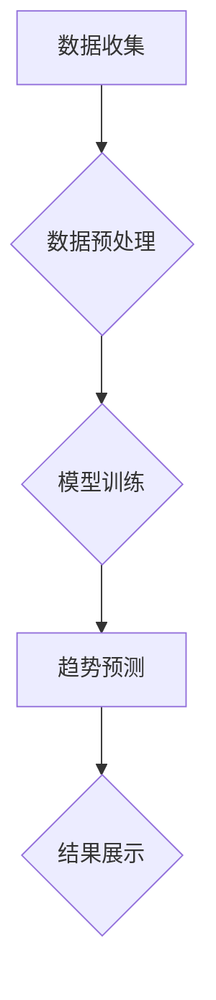

                 

## AI时尚预测工具：为时尚行业提供数据驱动的预测

> 关键词：人工智能、时尚预测、数据驱动、机器学习、深度学习、时装趋势、市场分析、预测模型

## 1. 背景介绍

时尚行业是一个充满创意和变革的领域，它对时事、文化和社会趋势高度敏感。传统的时尚预测方法往往依赖于设计师的经验和市场调研，但这些方法往往缺乏数据支撑，难以准确预测未来的趋势。随着人工智能技术的快速发展，数据驱动型预测工具逐渐成为时尚行业的重要趋势。

AI时尚预测工具利用机器学习和深度学习算法，从海量的数据中挖掘出隐藏的模式和趋势，为时尚品牌提供更准确、更有效的预测结果。这些工具可以帮助时尚品牌更好地了解消费者需求，优化产品设计和生产计划，提高市场竞争力。

## 2. 核心概念与联系

### 2.1  数据驱动

数据驱动型预测的核心是数据。AI时尚预测工具需要大量的历史数据作为训练素材，这些数据可以包括销售记录、消费者偏好、社交媒体趋势、天气数据等。

### 2.2  机器学习

机器学习是人工智能的一个分支，它通过算法训练模型，使模型能够从数据中学习并做出预测。常用的机器学习算法包括线性回归、逻辑回归、决策树、支持向量机、神经网络等。

### 2.3  深度学习

深度学习是机器学习的一个子领域，它使用多层神经网络来模拟人类大脑的学习过程。深度学习算法能够处理更复杂的数据，并提取更深层次的特征，因此在图像识别、自然语言处理等领域取得了突破性进展。

### 2.4  时装趋势预测

时装趋势预测是利用机器学习和深度学习算法，从历史数据中识别出时尚趋势的演变规律，并预测未来的时尚趋势。

**核心概念与架构流程图**



## 3. 核心算法原理 & 具体操作步骤

### 3.1  算法原理概述

AI时尚预测工具通常采用以下几种核心算法：

* **聚类算法**: 将具有相似特征的时尚元素进行分组，识别出不同的时尚风格和趋势。
* **关联规则挖掘**: 发现时尚元素之间的关联关系，例如哪些服装搭配在一起更受欢迎。
* **时间序列分析**: 分析历史数据中的趋势变化，预测未来的时尚元素流行程度。
* **深度学习**: 使用卷积神经网络或循环神经网络，从图像数据中学习时尚元素的特征，并预测未来的时尚趋势。

### 3.2  算法步骤详解

1. **数据收集**: 收集各种类型的时尚数据，包括销售记录、消费者偏好、社交媒体趋势、天气数据、时装秀信息等。
2. **数据预处理**: 清洗、转换和格式化数据，使其适合机器学习算法的训练。
3. **特征工程**: 从原始数据中提取有价值的特征，例如颜色、款式、材质、价格等。
4. **模型训练**: 选择合适的机器学习算法，并使用训练数据训练模型。
5. **模型评估**: 使用测试数据评估模型的预测准确率，并进行调参优化。
6. **趋势预测**: 将训练好的模型应用于新的数据，预测未来的时尚趋势。
7. **结果展示**: 将预测结果以图表、报告等形式展示给用户。

### 3.3  算法优缺点

**优点**:

* 数据驱动，预测结果更准确。
* 可以处理海量数据，发现隐藏的趋势。
* 可以自动化预测流程，提高效率。

**缺点**:

* 需要大量的训练数据。
* 模型训练需要专业知识和技术。
* 预测结果可能受到数据偏差的影响。

### 3.4  算法应用领域

* **服装设计**: 预测未来的服装款式和流行趋势。
* **产品开发**: 优化产品设计和生产计划，满足消费者需求。
* **市场营销**: 定位目标客户，制定精准的营销策略。
* **库存管理**: 预测商品需求，优化库存水平。

## 4. 数学模型和公式 & 详细讲解 & 举例说明

### 4.1  数学模型构建

AI时尚预测工具通常使用以下数学模型：

* **线性回归**: 用于预测连续变量，例如销售额。

$$
y = mx + c
$$

其中：

* $y$ 是预测值
* $x$ 是输入特征
* $m$ 是斜率
* $c$ 是截距

* **逻辑回归**: 用于预测分类变量，例如商品是否畅销。

$$
P(y=1) = \frac{1}{1 + e^{-(wx + b)}}
$$

其中：

* $P(y=1)$ 是预测商品畅销的概率
* $x$ 是输入特征
* $w$ 是权重
* $b$ 是偏置

* **神经网络**: 用于处理复杂数据，例如图像数据。

神经网络由多个层组成，每层包含多个神经元。每个神经元接收来自上一层的输入，并通过激活函数进行处理，输出到下一层。

### 4.2  公式推导过程

神经网络的训练过程是通过反向传播算法来实现的。反向传播算法通过计算误差，并根据误差调整神经元的权重和偏置，使得模型的预测结果越来越准确。

### 4.3  案例分析与讲解

例如，可以使用深度学习模型来预测服装的流行趋势。训练数据可以包括服装的图片、颜色、款式、材质等信息。模型可以学习到服装的特征，并预测未来哪些服装风格会更受欢迎。

## 5. 项目实践：代码实例和详细解释说明

### 5.1  开发环境搭建

* Python 3.x
* TensorFlow 或 PyTorch
* Jupyter Notebook

### 5.2  源代码详细实现

```python
# 导入必要的库
import tensorflow as tf

# 定义模型结构
model = tf.keras.models.Sequential([
    tf.keras.layers.Conv2D(32, (3, 3), activation='relu', input_shape=(224, 224, 3)),
    tf.keras.layers.MaxPooling2D((2, 2)),
    tf.keras.layers.Conv2D(64, (3, 3), activation='relu'),
    tf.keras.layers.MaxPooling2D((2, 2)),
    tf.keras.layers.Flatten(),
    tf.keras.layers.Dense(10, activation='softmax')
])

# 编译模型
model.compile(optimizer='adam',
              loss='sparse_categorical_crossentropy',
              metrics=['accuracy'])

# 训练模型
model.fit(x_train, y_train, epochs=10)

# 评估模型
loss, accuracy = model.evaluate(x_test, y_test)
print('Loss:', loss)
print('Accuracy:', accuracy)
```

### 5.3  代码解读与分析

* 代码首先导入必要的库，包括 TensorFlow 库。
* 然后定义了一个简单的卷积神经网络模型。
* 模型包含两个卷积层、两个最大池化层、一个扁平化层和一个全连接层。
* 模型使用 Adam 优化器、交叉熵损失函数和准确率指标进行训练。
* 训练完成后，使用测试数据评估模型的性能。

### 5.4  运行结果展示

运行结果会显示模型的训练损失和准确率。

## 6. 实际应用场景

AI时尚预测工具已经在时尚行业得到广泛应用，例如：

* **Zara**: 使用 AI 预测服装需求，优化库存管理。
* **Gucci**: 使用 AI 分析社交媒体趋势，设计符合消费者喜好的产品。
* **Net-a-Porter**: 使用 AI 建立个性化推荐系统，提高用户体验。

### 6.4  未来应用展望

未来，AI时尚预测工具将更加智能化、个性化和精准化。例如：

* **个性化预测**: 根据用户的购买历史、喜好和行为数据，提供个性化的时尚预测。
* **虚拟试衣**: 使用 AR/VR 技术，让用户在虚拟环境中试穿衣服，并根据预测结果选择最适合自己的服装。
* **智能设计**: 使用 AI 辅助设计师进行服装设计，创造出更具创意和创新性的产品。

## 7. 工具和资源推荐

### 7.1  学习资源推荐

* **Coursera**: 提供机器学习和深度学习课程。
* **Udacity**: 提供人工智能和数据科学课程。
* **Kaggle**: 提供数据科学竞赛和学习资源。

### 7.2  开发工具推荐

* **TensorFlow**: 开源深度学习框架。
* **PyTorch**: 开源深度学习框架。
* **Jupyter Notebook**: 用于编写和运行 Python 代码的交互式环境。

### 7.3  相关论文推荐

* **Fashion-MNIST**: https://github.com/zalandoresearch/fashion-mnist
* **DeepFashion**: https://arxiv.org/abs/1606.06215

## 8. 总结：未来发展趋势与挑战

### 8.1  研究成果总结

AI时尚预测工具已经取得了显著的成果，能够帮助时尚品牌更好地了解消费者需求，优化产品设计和生产计划，提高市场竞争力。

### 8.2  未来发展趋势

未来，AI时尚预测工具将更加智能化、个性化和精准化，并与其他技术融合，例如 AR/VR、大数据分析、物联网等。

### 8.3  面临的挑战

* 数据质量和可用性
* 模型解释性和可信度
* 算法的公平性和伦理问题

### 8.4  研究展望

未来研究将重点关注以下几个方面：

* 开发更强大的 AI 算法，提高预测准确率。
* 构建更完善的数据集，提高模型的泛化能力。
* 研究模型的解释性和可信度，增强用户对预测结果的信任。
* 探索 AI 时尚预测工具与其他技术的融合，创造更具创新性的应用场景。

## 9. 附录：常见问题与解答

* **Q: AI时尚预测工具的准确率如何？**

A: AI时尚预测工具的准确率取决于多种因素，例如训练数据质量、模型复杂度和预测目标。一般来说，经过充分训练的模型能够达到较高的预测准确率。

* **Q: 如何选择合适的 AI时尚预测工具？**

A: 选择合适的 AI时尚预测工具需要根据具体的业务需求和数据情况进行评估。可以考虑工具的算法类型、功能特性、易用性、价格等因素。

* **Q: AI时尚预测工具会取代设计师吗？**

A: AI时尚预测工具可以帮助设计师更好地了解消费者需求和趋势，但不会取代设计师的创意和设计能力。AI工具更像是设计师的助手，可以帮助他们更高效地完成工作。


作者：禅与计算机程序设计艺术 / Zen and the Art of Computer Programming 
<end_of_turn>

