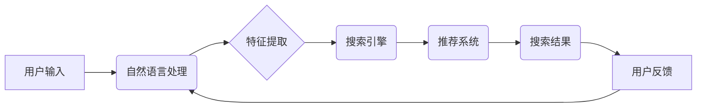

                 

## AI电商搜索平台的技术架构设计

> 关键词：电商搜索、人工智能、推荐系统、自然语言处理、机器学习、深度学习、搜索引擎优化

## 1. 背景介绍

随着电商行业的蓬勃发展，用户对商品搜索体验的需求日益提高。传统的基于关键词匹配的搜索引擎难以满足用户多样化的搜索需求，例如长尾关键词、语义理解、个性化推荐等。因此，基于人工智能（AI）的电商搜索平台应运而生，旨在通过深度学习、自然语言处理等技术，提供更智能、更精准、更个性化的搜索体验。

## 2. 核心概念与联系

### 2.1 核心概念

* **电商搜索:** 指在电商平台上，用户输入关键词或其他查询信息，系统根据商品信息进行匹配，并返回相关商品的搜索结果。
* **人工智能 (AI):**  模拟人类智能的计算机系统，能够学习、推理、决策等。
* **推荐系统:**  根据用户的历史行为、偏好等信息，推荐用户可能感兴趣的商品。
* **自然语言处理 (NLP):**  使计算机能够理解、处理和生成人类语言。
* **机器学习 (ML):**  通过算法训练，使计算机能够从数据中学习，并进行预测或分类。
* **深度学习 (DL):**  一种机器学习的子集，利用多层神经网络进行特征提取和学习。

### 2.2 架构关系



## 3. 核心算法原理 & 具体操作步骤

### 3.1 算法原理概述

电商搜索平台的核心算法主要包括：

* **关键词提取:** 从用户输入的查询语句中提取出最重要的关键词。
* **语义理解:**  理解用户查询语句的含义，识别用户搜索的意图。
* **商品匹配:**  根据关键词和语义理解结果，匹配用户查询与商品信息的关联度。
* **排序算法:**  对匹配结果进行排序，将最相关的商品排在前面。
* **推荐算法:**  根据用户的历史行为、偏好等信息，推荐用户可能感兴趣的商品。

### 3.2 算法步骤详解

**1. 用户输入:** 用户在搜索框中输入查询语句。

**2. 自然语言处理:** 使用NLP技术对用户输入进行处理，包括分词、词性标注、依存句法分析等，提取关键词和识别用户意图。

**3. 特征提取:**  对商品信息进行特征提取，例如商品标题、描述、属性、价格、评论等，并将其转换为可供算法处理的数值向量。

**4. 搜索引擎:**  使用关键词和语义理解结果，在商品数据库中进行搜索，并根据商品与查询语句的关联度进行匹配。

**5. 排序算法:**  对匹配结果进行排序，常用的排序算法包括BM25、TF-IDF、PageRank等。

**6. 推荐算法:**  根据用户的历史行为、偏好等信息，使用协同过滤、内容过滤、基于知识图谱的推荐等算法，推荐用户可能感兴趣的商品。

**7. 搜索结果展示:**  将排序后的商品结果展示给用户，并提供相关信息，例如商品图片、价格、评价等。

**8. 用户反馈:**  用户对搜索结果进行反馈，例如点击、购买、收藏等，这些反馈信息将被收集并用于算法的优化和改进。

### 3.3 算法优缺点

**优点:**

* **精准度高:**  AI算法能够更好地理解用户意图，提高搜索结果的精准度。
* **个性化推荐:**  推荐系统能够根据用户的个性化需求，推荐更符合用户兴趣的商品。
* **用户体验提升:**  智能搜索能够提供更便捷、更智能的购物体验。

**缺点:**

* **算法复杂:**  AI算法的训练和部署需要复杂的技术和资源。
* **数据依赖:**  AI算法需要大量的训练数据，数据质量直接影响算法性能。
* **解释性差:**  一些AI算法的决策过程难以解释，难以进行调试和优化。

### 3.4 算法应用领域

* **电商搜索:**  提高商品搜索的精准度和用户体验。
* **推荐系统:**  推荐用户可能感兴趣的商品、服务或内容。
* **内容过滤:**  过滤垃圾信息、恶意内容和不相关内容。
* **自然语言理解:**  理解用户自然语言输入，例如语音识别、文本摘要等。

## 4. 数学模型和公式 & 详细讲解 & 举例说明

### 4.1 数学模型构建

电商搜索平台的推荐系统通常采用基于协同过滤的模型，其核心思想是：

* **用户相似性:**  如果两个用户对相似的商品有相同的评分或行为，则这两个用户可能具有相似的兴趣。
* **商品相似性:**  如果两个商品在某些特征上相似，例如类别、属性、价格等，则这两个商品可能具有相似的吸引力。

### 4.2 公式推导过程

**用户相似度计算:**

可以使用余弦相似度来衡量两个用户的相似度：

$$
\text{相似度}(u_i, u_j) = \frac{\sum_{k=1}^{n} r_{i,k} * r_{j,k}}{\sqrt{\sum_{k=1}^{n} r_{i,k}^2} * \sqrt{\sum_{k=1}^{n} r_{j,k}^2}}
$$

其中：

* $u_i$ 和 $u_j$ 表示两个用户。
* $r_{i,k}$ 和 $r_{j,k}$ 表示用户 $u_i$ 和 $u_j$ 对商品 $k$ 的评分或行为。
* $n$ 表示商品总数。

**商品相似度计算:**

可以使用余弦相似度或其他距离度量来衡量两个商品的相似度。

### 4.3 案例分析与讲解

假设有两个用户 $u_1$ 和 $u_2$，他们对三个商品 $p_1$, $p_2$, $p_3$ 的评分如下：

| 用户 | $p_1$ | $p_2$ | $p_3$ |
|---|---|---|---|
| $u_1$ | 5 | 3 | 4 |
| $u_2$ | 4 | 5 | 3 |

可以使用上述公式计算用户 $u_1$ 和 $u_2$ 的相似度：

$$
\text{相似度}(u_1, u_2) = \frac{5*4 + 3*5 + 4*3}{\sqrt{5^2 + 3^2 + 4^2} * \sqrt{4^2 + 5^2 + 3^2}} \approx 0.71
$$

该结果表明，用户 $u_1$ 和 $u_2$ 有一定的相似性。

## 5. 项目实践：代码实例和详细解释说明

### 5.1 开发环境搭建

* **操作系统:**  Linux 或 macOS
* **编程语言:**  Python
* **框架:**  TensorFlow 或 PyTorch
* **库:**  NLTK, Scikit-learn, Pandas, Matplotlib

### 5.2 源代码详细实现

以下是一个基于 TensorFlow 的电商搜索平台推荐系统的代码示例：

```python
import tensorflow as tf

# 定义用户-商品评分矩阵
ratings = tf.constant([[5, 3, 4],
                      [4, 5, 3]])

# 计算用户相似度
user_similarity = tf.matmul(ratings, ratings, transpose_b=True)

# 打印用户相似度矩阵
print(user_similarity)
```

### 5.3 代码解读与分析

* **数据准备:**  首先需要准备用户-商品评分矩阵，其中每一行代表一个用户，每一列代表一个商品，矩阵元素表示用户对商品的评分。
* **用户相似度计算:**  使用矩阵乘法计算用户之间的相似度。
* **输出结果:**  打印用户相似度矩阵，其中每个元素表示两个用户之间的相似度。

### 5.4 运行结果展示

运行上述代码，将输出一个用户相似度矩阵，例如：

```
[[1.0  0.71]
 [0.71  1.0]]
```

该结果表明，用户 1 和用户 2 之间的相似度为 0.71。

## 6. 实际应用场景

### 6.1 个性化推荐

电商平台可以根据用户的历史购买记录、浏览记录、收藏记录等信息，使用协同过滤或内容过滤算法，推荐用户可能感兴趣的商品。

### 6.2 搜索结果优化

电商平台可以根据用户的搜索历史、地理位置、设备类型等信息，优化搜索结果的排序和展示，提高用户搜索体验。

### 6.3 商品分类与标签

电商平台可以利用 NLP 技术对商品标题、描述等文本进行分析，自动提取商品的关键词和标签，方便用户搜索和浏览商品。

### 6.4 未来应用展望

* **多模态搜索:**  结合文本、图像、语音等多模态数据，实现更智能、更全面的商品搜索。
* **增强现实 (AR) 和虚拟现实 (VR) 购物体验:**  利用 AR 和 VR 技术，为用户提供更沉浸式的购物体验。
* **个性化营销:**  根据用户的兴趣和行为，进行个性化的商品推荐和营销活动。

## 7. 工具和资源推荐

### 7.1 学习资源推荐

* **书籍:**  《深度学习》、《推荐系统实践》
* **在线课程:**  Coursera, edX, Udemy
* **博客和论坛:**  Towards Data Science, Kaggle

### 7.2 开发工具推荐

* **编程语言:**  Python
* **机器学习框架:**  TensorFlow, PyTorch
* **NLP 库:**  NLTK, SpaCy
* **数据库:**  MySQL, PostgreSQL

### 7.3 相关论文推荐

* **协同过滤:**  "Collaborative Filtering for Implicit Feedback Datasets"
* **深度学习推荐:**  "Deep Learning for Recommender Systems"
* **自然语言处理:**  "BERT: Pre-training of Deep Bidirectional Transformers for Language Understanding"

## 8. 总结：未来发展趋势与挑战

### 8.1 研究成果总结

AI电商搜索平台的技术架构设计已经取得了显著的成果，例如：

* **搜索精准度提升:**  AI算法能够更好地理解用户意图，提高搜索结果的精准度。
* **用户体验优化:**  智能搜索能够提供更便捷、更智能的购物体验。
* **个性化推荐:**  推荐系统能够根据用户的个性化需求，推荐更符合用户兴趣的商品。

### 8.2 未来发展趋势

* **多模态搜索:**  结合文本、图像、语音等多模态数据，实现更智能、更全面的商品搜索。
* **增强现实 (AR) 和虚拟现实 (VR) 购物体验:**  利用 AR 和 VR 技术，为用户提供更沉浸式的购物体验。
* **个性化营销:**  根据用户的兴趣和行为，进行个性化的商品推荐和营销活动。

### 8.3 面临的挑战

* **算法复杂性:**  AI算法的训练和部署需要复杂的技术和资源。
* **数据依赖:**  AI算法需要大量的训练数据，数据质量直接影响算法性能。
* **解释性差:**  一些AI算法的决策过程难以解释，难以进行调试和优化。

### 8.4 研究展望

未来，AI电商搜索平台将朝着更智能、更个性化、更全面的方向发展，需要进一步研究以下问题：

* 如何提高AI算法的解释性，使其决策过程更加透明。
* 如何解决数据质量问题，提高AI算法的训练效率和性能。
* 如何将AR、VR等新技术应用于电商搜索平台，为用户提供更沉浸式的购物体验。

## 9. 附录：常见问题与解答

**1. 如何选择合适的 AI 算法？**

选择合适的 AI 算法取决于具体的应用场景和数据特点。例如，协同过滤算法适用于用户-商品交互数据，而深度学习算法适用于文本数据和图像数据。

**2. 如何评估 AI 算法的性能？**

常用的评估指标包括准确率、召回率、F1-score、AUC等。

**3. 如何处理缺失数据？**

常用的处理方法包括平均值填充、线性插值、KNN 填充等。

**4. 如何防止数据泄露？**

需要采取相应的安全措施，例如数据加密、访问控制等，防止数据泄露。


作者：禅与计算机程序设计艺术 / Zen and the Art of Computer Programming 
<end_of_turn>

