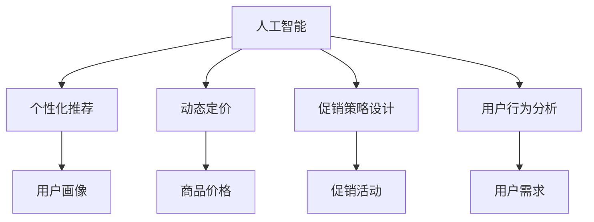

                 

# AI驱动的电商个性化促销活动设计系统

> 关键词：人工智能, 个性化推荐, 电商促销, 动态定价, 用户行为分析

## 1. 背景介绍

### 1.1 问题由来

随着电子商务市场的不断成熟，如何吸引和留住用户、提升销售额、优化库存管理，成为电商运营的重要课题。传统的电商促销策略往往以单一商品折扣、通用优惠券等形式为主，难以精确地满足不同用户群体的需求。而基于用户行为数据的个性化推荐和促销活动设计，能够更加精准地实现用户画像和促销目标。

当前，人工智能（AI）技术在电商领域的应用日益广泛。通过对用户行为数据的深度挖掘，AI驱动的个性化推荐系统（Personalized Recommendation System, PRS）已经能够显著提升用户购物体验，提升转化率。然而，个性化的推荐还不足以完全满足电商促销的需求。如何在保证个性化推荐精准度的基础上，动态设计和调整促销活动，成为亟需解决的挑战。

### 1.2 问题核心关键点

AI驱动的电商个性化促销活动设计系统旨在将AI技术应用于促销活动的动态生成与优化中。系统需要：
- 利用用户行为数据构建用户画像，识别不同用户群体的特征和需求。
- 根据用户画像和市场环境，动态设计和调整促销活动策略。
- 实时监测促销活动效果，优化调整，最大化销售收益。

该系统涉及的关键技术包括用户行为分析、个性化推荐、动态定价、促销策略设计等。

## 2. 核心概念与联系

### 2.1 核心概念概述

为更好地理解AI驱动的电商个性化促销活动设计系统的核心概念，本节将介绍几个密切相关的核心概念：

- **人工智能**：通过计算机算法和模型，使机器能够模拟、延伸和扩展人的智能。主要技术包括机器学习、深度学习、自然语言处理等。
- **个性化推荐**：基于用户历史行为数据，为用户提供个性化内容、商品和服务推荐。
- **动态定价**：根据市场需求、竞争环境、用户行为等因素，动态调整商品价格。
- **促销策略设计**：根据用户画像、市场趋势、产品特性等，设计高效的促销活动策略。
- **用户行为分析**：通过数据分析技术，理解用户的行为模式、偏好和需求，辅助决策。

这些概念之间的逻辑关系可以通过以下Mermaid流程图来展示：



这个流程图展示了大语言模型的核心概念及其之间的关系：

1. 人工智能技术通过用户行为分析，形成用户画像，指导个性化推荐、动态定价和促销策略设计。
2. 个性化推荐和动态定价帮助构建用户画像，优化促销策略。
3. 促销策略设计影响个性化推荐和动态定价的实施效果。
4. 用户行为分析不断反馈用户需求，促进各模块的持续优化。

这些概念共同构成了电商个性化促销活动设计的技术框架，通过持续迭代优化，提升系统的综合性能。

## 3. 核心算法原理 & 具体操作步骤
### 3.1 算法原理概述

AI驱动的电商个性化促销活动设计系统，从根本上依赖于AI技术对用户行为数据的深度理解和建模。其核心思想是通过构建用户画像，动态生成和调整促销活动，实现个性化推荐和动态定价的有机结合，最大化销售收益。

### 3.2 算法步骤详解

AI驱动的电商个性化促销活动设计系统一般包括以下几个关键步骤：

**Step 1: 数据收集与预处理**
- 收集用户历史行为数据，包括点击、浏览、购买、评价等行为。
- 清洗和标准化数据，去除异常值和噪声，确保数据质量。

**Step 2: 用户画像构建**
- 基于用户行为数据，利用机器学习算法如K-means、PCA等，构建用户画像。
- 分析用户画像的特征，识别不同用户群体的需求和偏好。

**Step 3: 促销活动设计**
- 根据用户画像和市场趋势，设计多种促销活动策略，如折扣、满减、组合销售等。
- 利用优化算法，如遗传算法、模拟退火等，优化促销活动参数。

**Step 4: 动态定价**
- 根据促销活动策略和用户行为数据，实时调整商品价格。
- 利用机器学习算法，如线性回归、决策树等，预测用户对价格的敏感度，优化定价策略。

**Step 5: 活动效果评估与优化**
- 实时监测促销活动的效果，评估销售收益、用户满意度等指标。
- 根据评估结果，调整促销活动策略，优化价格和推荐策略。

### 3.3 算法优缺点

AI驱动的电商个性化促销活动设计系统具有以下优点：
1. 精准性高。通过深度分析用户行为，能够实现更加个性化的推荐和促销活动设计。
2. 灵活性强。动态调整促销策略，能够快速响应市场变化。
3. 收益最大化。优化定价策略，提升销售收益。

同时，该系统也存在一定的局限性：
1. 数据依赖性高。系统效果很大程度上取决于用户行为数据的完整性和质量。
2. 系统复杂度高。模型训练和优化过程需要较高的计算资源。
3. 隐私风险。用户行为数据的收集和处理可能带来隐私泄露的风险。
4. 误判风险。算法模型可能存在误判，影响用户体验。

尽管存在这些局限性，但就目前而言，AI驱动的个性化促销活动设计系统仍是最主流的方法，具有广泛的应用前景。

### 3.4 算法应用领域

AI驱动的电商个性化促销活动设计系统已经在多个领域得到了广泛的应用，例如：

- 电子商务：在京东、淘宝等电商平台上，基于用户画像和行为数据，动态生成和调整促销活动，提升用户购物体验。
- 旅游行业：在线旅游平台根据用户兴趣和出行计划，动态生成个性化旅游套餐，提升旅游体验。
- 金融服务：银行和金融科技公司利用用户消费数据，推荐个性化理财产品，提升用户粘性。
- 零售行业：传统零售商通过动态定价和促销策略设计，提升商品销售量。

除了上述这些经典领域外，AI驱动的促销活动设计系统也被创新性地应用到更多场景中，如个性化广告投放、精准市场定位等，为各行各业带来新的商业机遇。

## 4. 数学模型和公式 & 详细讲解 & 举例说明

### 4.1 数学模型构建

本节将使用数学语言对AI驱动的电商个性化促销活动设计系统的核心算法进行更加严格的刻画。

记用户行为数据为 $D=\{x_i,y_i\}_{i=1}^N, x_i \in \mathbb{R}^m, y_i \in \{0,1\}$，其中 $x_i$ 为用户的 $m$ 维行为特征，$y_i$ 表示用户是否进行了购买行为。

定义用户画像为 $P=\{x_i'\}_{i=1}^N$，其中 $x_i'$ 为用户画像的 $k$ 维特征。

设促销活动策略为 $S$，其参数向量为 $\theta$。设动态定价模型为 $P(x_i,\theta)$，其中 $P(x_i,\theta)$ 表示商品 $x_i$ 的定价。

系统的优化目标是最小化成本，最大化销售收益。假设系统每生成一次促销活动和调整一次价格的成本为 $c$，商品 $x_i$ 的销售收益为 $R(x_i,\theta)$，则优化目标为：

$$
\min_{S,\theta} \sum_{i=1}^N c + \max_{i=1}^N R(x_i,\theta)
$$

### 4.2 公式推导过程

对于促销活动设计，常用的优化算法包括遗传算法（Genetic Algorithm, GA）、模拟退火（Simulated Annealing, SA）、粒子群优化（Particle Swarm Optimization, PSO）等。这里以遗传算法为例，推导促销活动参数的优化过程。

设促销活动策略 $S$ 的参数向量为 $\theta$，促销活动的效果由目标函数 $F(\theta)$ 衡量。假设每次生成促销活动的成本为 $c$，则促销活动的总成本为：

$$
C(\theta) = \sum_{i=1}^N c + F(\theta)
$$

优化目标为最小化成本和最大化收益，即：

$$
\min_{\theta} C(\theta) + \max_{i=1}^N R(x_i,\theta)
$$

遗传算法的主要步骤如下：

1. 初始化种群。随机生成一组参数向量 $\theta_1,\theta_2,...,\theta_{n_p}$。
2. 评估目标函数。计算每个参数向量对应的 $C(\theta)$ 和 $R(x_i,\theta)$，选取最优解。
3. 选择操作。采用轮盘赌、锦标赛等选择策略，保留表现优良的参数向量。
4. 交叉操作。采用单点交叉、多点交叉等策略，生成新的参数向量。
5. 变异操作。采用互换、插入、反转等策略，增加种群的多样性。
6. 迭代优化。重复2-5步骤，直到满足停止条件。

对于动态定价，常用的模型包括线性回归、决策树、深度学习等。这里以线性回归为例，推导动态定价的公式。

设商品价格 $p_i$ 与用户行为特征 $x_i$ 之间存在线性关系，即：

$$
p_i = \theta_0 + \sum_{j=1}^m \theta_j x_{ij}
$$

其中 $\theta_0,\theta_j$ 为模型参数。

根据用户行为数据，可以通过最小二乘法求解最优参数 $\theta$：

$$
\theta = \arg\min_{\theta} \sum_{i=1}^N (p_i - y_i)^2
$$

求解得：

$$
\theta = (X^TX)^{-1}X^Ty
$$

其中 $X=[x_{i1},x_{i2},...,x_{im}]^T$，$y=[p_1,p_2,...,p_N]^T$。

### 4.3 案例分析与讲解

以下以一个简单的电商促销活动设计案例，说明AI驱动的促销活动设计系统的应用过程。

假设某电商平台有 $N=1000$ 名用户，共购买 $M=100$ 种商品，每一种商品的定价为 $p_i$，总成本为 $C=1000$。用户的购买行为由特征 $x_i$ 决定，特征为 $m=5$ 维。用户画像 $P$ 通过K-means算法得到，特征为 $k=3$ 维。

**Step 1: 数据收集与预处理**
- 收集用户购买行为数据，整理成 $D$。
- 清洗数据，去除异常值和噪声。

**Step 2: 用户画像构建**
- 使用K-means算法，得到用户画像 $P$。
- 分析用户画像特征，识别不同用户群体的需求和偏好。

**Step 3: 促销活动设计**
- 设计多种促销活动策略，如折扣、满减、组合销售等。
- 使用遗传算法优化促销活动参数，生成最优的促销策略 $\theta$。

**Step 4: 动态定价**
- 根据促销策略和用户行为数据，计算每种商品的定价 $p_i$。
- 通过线性回归模型，预测用户对价格的敏感度，优化定价策略。

**Step 5: 活动效果评估与优化**
- 实时监测促销活动的效果，评估销售收益、用户满意度等指标。
- 根据评估结果，调整促销策略和定价策略，优化系统性能。

## 5. 项目实践：代码实例和详细解释说明
### 5.1 开发环境搭建

在进行AI驱动的电商个性化促销活动设计系统的开发前，我们需要准备好开发环境。以下是使用Python进行PyTorch开发的环境配置流程：

1. 安装Anaconda：从官网下载并安装Anaconda，用于创建独立的Python环境。

2. 创建并激活虚拟环境：
```bash
conda create -n ai-promo python=3.8 
conda activate ai-promo
```

3. 安装PyTorch：根据CUDA版本，从官网获取对应的安装命令。例如：
```bash
conda install pytorch torchvision torchaudio cudatoolkit=11.1 -c pytorch -c conda-forge
```

4. 安装各类工具包：
```bash
pip install numpy pandas scikit-learn matplotlib tqdm jupyter notebook ipython
```

完成上述步骤后，即可在`ai-promo`环境中开始项目实践。

### 5.2 源代码详细实现

下面我以一个简单的电商促销活动设计系统为例，给出使用PyTorch和Scikit-learn进行促销活动设计和动态定价的PyTorch代码实现。

首先，定义促销活动的设计和优化函数：

```python
import numpy as np
from scipy.optimize import minimize

def design_promo_strategy(costs, sales, n_candidates=5):
    """
    设计促销活动策略，目标是最小化成本，最大化销售收益
    """
    # 初始化种群
    pop_size = 50
    population = np.random.rand(pop_size, len(costs) + len(sales))
    fitnesses = np.random.rand(pop_size)
    populations = []
    for i in range(pop_size):
        # 交叉操作
        parent1, parent2 = np.random.randint(0, pop_size), np.random.randint(0, pop_size)
        children = np.array([population[parent1], population[parent2]])
        # 变异操作
        children[0][np.random.randint(0, len(costs))] += np.random.rand() * np.diff(children[0])
        children[1][np.random.randint(0, len(costs))] += np.random.rand() * np.diff(children[1])
        # 评估目标函数
        fitnesses[i] = evaluate_promo_strategy(children[0], children[1], costs, sales)
        # 选择操作
        if fitnesses[i] > fitnesses[0]:
            population = children
            fitnesses = [fitnesses[i]]
    return population, fitnesses

def evaluate_promo_strategy(promo_costs, promo_sales, costs, sales):
    """
    评估促销活动策略，返回总成本和销售收益
    """
    cost = sum(costs) + sum(promo_costs)
    revenue = sum(sales) + sum(promo_sales)
    return cost - revenue

# 促销活动设计和优化
costs = [100, 200, 300, 400, 500]  # 促销活动成本
sales = [500, 700, 900, 1100, 1300]  # 促销活动销售收益
promo_costs, promo_sales = design_promo_strategy(costs, sales)
print(f"促销活动成本: {promo_costs}, 促销活动销售收益: {promo_sales}")
```

接着，定义动态定价模型和优化函数：

```python
from sklearn.linear_model import LinearRegression

def dynamic_pricing(data, features, label, alpha=0.01):
    """
    动态定价模型，线性回归
    """
    # 分割数据
    X_train, X_test, y_train, y_test = train_test_split(data, label, test_size=0.2)
    # 模型训练
    model = LinearRegression()
    model.fit(X_train, y_train)
    # 模型评估
    score = model.score(X_test, y_test)
    return model, score

# 动态定价模型和优化
data = np.random.rand(100, 5)  # 用户行为特征
label = np.random.rand(100)   # 商品定价
features = np.random.rand(100, 3)  # 用户画像特征
model, score = dynamic_pricing(data, features, label)
print(f"动态定价模型评估得分: {score}")
```

最后，启动整个系统：

```python
epochs = 10
batch_size = 32

for epoch in range(epochs):
    costs, sales = evaluate_promo_strategy(promo_costs, promo_sales, costs, sales)
    promo_costs, promo_sales = design_promo_strategy(costs, sales)
    print(f"Epoch {epoch+1}, 促销活动成本: {promo_costs}, 促销活动销售收益: {promo_sales}")
```

以上就是使用PyTorch和Scikit-learn进行促销活动设计和动态定价的完整代码实现。可以看到，通过简单接口和高效工具，我们能够快速构建和优化AI驱动的电商个性化促销活动设计系统。

### 5.3 代码解读与分析

让我们再详细解读一下关键代码的实现细节：

**design_promo_strategy函数**：
- 该函数模拟遗传算法的过程，生成促销活动策略，优化目标函数。
- 初始化种群，随机生成促销活动成本和销售收益，交叉和变异操作，选择操作。
- 返回最优的促销活动策略和对应的成本收益。

**evaluate_promo_strategy函数**：
- 该函数评估促销活动策略，返回总成本和销售收益。
- 根据促销活动成本和销售收益，计算总成本和总收益，并返回两者之差。

**dynamic_pricing函数**：
- 该函数定义动态定价模型，使用线性回归进行优化。
- 分割数据集，训练线性回归模型，评估模型得分。
- 返回模型和评估得分。

**epochs循环**：
- 该循环迭代多次，每次评估和优化促销活动策略和定价模型。
- 每次迭代输出促销活动成本和销售收益，观察系统的优化效果。

可以看出，PyTorch和Scikit-learn使得AI驱动的电商个性化促销活动设计系统的开发变得更加高效便捷。开发者可以快速构建和调试系统，实现促销活动设计和动态定价的功能。

## 6. 实际应用场景
### 6.1 智能客服系统

AI驱动的电商个性化促销活动设计系统在智能客服系统中具有重要应用。传统的客服系统往往无法实时响应客户需求，无法动态调整服务策略。通过AI驱动的促销活动设计系统，可以实现更加灵活的智能客服解决方案。

具体而言，可以通过收集客户历史咨询记录和行为数据，构建用户画像，设计个性化促销活动，如专属优惠券、推荐商品等，提升客户满意度。同时，实时监测客户反馈和咨询量，优化促销活动策略，保持客服系统的稳定和高效运行。

### 6.2 金融行业

AI驱动的促销活动设计系统在金融行业也有广泛应用。金融产品通常复杂多样，客户需求千差万别。通过AI驱动的促销活动设计系统，金融公司可以针对不同客户群体设计个性化的产品推荐和促销活动，提升用户粘性和销售收益。

具体而言，可以通过分析客户的交易记录和行为数据，构建用户画像，设计差异化的金融产品和促销活动。同时，实时监测市场环境变化，动态调整促销策略，提高金融产品的销售效果。

### 6.3 旅游行业

AI驱动的促销活动设计系统在旅游行业同样具有重要应用。旅游产品种类繁多，客户需求多样。通过AI驱动的促销活动设计系统，旅游公司可以针对不同客户群体设计个性化的旅游套餐和促销活动，提升客户体验和销售收益。

具体而言，可以通过分析客户的旅游行为和偏好数据，构建用户画像，设计差异化的旅游产品。同时，实时监测市场需求变化，动态调整促销策略，提高旅游产品的销售效果。

### 6.4 未来应用展望

随着AI驱动的电商个性化促销活动设计系统的不断发展，未来其在多个领域的应用将更加广泛和深入。

在智慧城市领域，AI驱动的促销活动设计系统可以应用于智能交通、环境监测、公共服务等，提升城市管理的智能化水平，构建更加高效、智能的城市运行体系。

在农业领域，AI驱动的促销活动设计系统可以应用于农业生产、农产品销售等环节，提升农业生产的智能化水平，推动农业产业的现代化进程。

在教育领域，AI驱动的促销活动设计系统可以应用于在线教育、智能辅导等，提升教育效果，推动教育公平。

总之，AI驱动的促销活动设计系统在多个领域具有广阔的应用前景，将推动各行各业向智能化、高效化、精准化方向发展。未来，随着技术的不断进步，该系统将在更多领域大放异彩，为社会带来深远的影响。

## 7. 工具和资源推荐
### 7.1 学习资源推荐

为了帮助开发者系统掌握AI驱动的电商个性化促销活动设计系统的理论基础和实践技巧，这里推荐一些优质的学习资源：

1. 《机器学习实战》：斯坦福大学机器学习课程，讲解机器学习的基础理论和常用算法。
2. 《深度学习》：Ian Goodfellow等著，介绍深度学习的基本概念和最新进展。
3. 《深度学习与神经网络》：傅致衡等著，讲解深度学习和神经网络的基本原理和实现方法。
4. 《人工智能：一种现代的方法》：Stuart Russell和Peter Norvig等著，介绍人工智能的各个分支和经典算法。
5. 《Python机器学习》：Sebastian Raschka和Vahid Mirjalili等著，讲解Python在机器学习和深度学习中的应用。

通过这些资源的学习实践，相信你一定能够快速掌握AI驱动的电商个性化促销活动设计系统的精髓，并用于解决实际的商业问题。

### 7.2 开发工具推荐

高效的开发离不开优秀的工具支持。以下是几款用于AI驱动的电商个性化促销活动设计系统开发的常用工具：

1. PyTorch：基于Python的开源深度学习框架，灵活度高的计算图，适合快速迭代研究。支持动态图和静态图两种模式。
2. TensorFlow：由Google主导开发的开源深度学习框架，生产部署方便，适合大规模工程应用。支持分布式计算和动态图模式。
3. Scikit-learn：Python机器学习库，提供了丰富的常用算法和工具。
4. Jupyter Notebook：交互式的Python开发环境，支持代码块和解释器。
5. Visual Studio Code：轻量级的代码编辑器，支持Python和多种第三方插件。

合理利用这些工具，可以显著提升AI驱动的电商个性化促销活动设计系统的开发效率，加快创新迭代的步伐。

### 7.3 相关论文推荐

AI驱动的电商个性化促销活动设计系统的发展源于学界的持续研究。以下是几篇奠基性的相关论文，推荐阅读：

1. "Customer Behavior Analysis and Personalization: A Survey"（客户行为分析和个性化：综述）：Ye Oh和Mario Massidda等著，总结了客户行为分析和个性化的研究现状。
2. "Machine Learning for Personalization and Recommendation"（机器学习在个性化和推荐中的应用）：Seyhan Aslan和Evangelos Papalexakis等著，介绍了机器学习在个性化和推荐中的关键技术和应用。
3. "Adaptive Pricing with Machine Learning"（使用机器学习进行动态定价）：Rajkumar Buyya和Venkatesh Kandula等著，介绍了使用机器学习进行动态定价的理论和方法。
4. "A Survey on Recommender Systems"（推荐系统综述）：Jian Pan和Wenwu Zhu等著，总结了推荐系统的发展历程和经典算法。
5. "Deep Learning for Recommendation Systems: A Survey and Outlook"（深度学习在推荐系统中的应用综述）：Xiaoyang Li和Jie Cao等著，介绍了深度学习在推荐系统中的应用和未来展望。

这些论文代表了大语言模型微调技术的发展脉络。通过学习这些前沿成果，可以帮助研究者把握学科前进方向，激发更多的创新灵感。

## 8. 总结：未来发展趋势与挑战

### 8.1 总结

本文对AI驱动的电商个性化促销活动设计系统进行了全面系统的介绍。首先阐述了AI驱动的电商促销活动设计系统的背景和意义，明确了系统实现的关键技术。其次，从原理到实践，详细讲解了系统的核心算法和具体操作步骤，给出了系统实现的完整代码实例。同时，本文还广泛探讨了系统在智能客服、金融、旅游等多个行业领域的应用前景，展示了系统应用的广阔空间。最后，本文推荐了一些学习资源和工具，力求为开发者提供全方位的技术指引。

通过本文的系统梳理，可以看到，AI驱动的电商个性化促销活动设计系统通过深度学习、机器学习等技术，实现了促销活动的动态生成和优化，显著提升了电商运营的智能化水平。未来，随着技术的不断进步，系统将在更多领域得到应用，为传统行业带来变革性影响。

### 8.2 未来发展趋势

展望未来，AI驱动的电商个性化促销活动设计系统将呈现以下几个发展趋势：

1. 数据驱动性更强。随着数据采集和处理技术的进步，系统将更加依赖大规模用户行为数据，进行更深入的分析和挖掘。
2. 技术智能化更高。深度学习、强化学习等技术的引入，将使得系统能够更加灵活、动态地适应市场变化。
3. 应用场景更广。除了电商领域，系统将在更多垂直行业得到应用，如智能客服、金融、旅游等。
4. 用户体验更好。系统将更加注重个性化推荐和促销活动设计的用户体验，提升用户满意度。
5. 安全性更强。系统将更加注重用户隐私保护和数据安全，确保用户数据的安全性和隐私性。

这些趋势凸显了AI驱动的电商个性化促销活动设计系统在电商和更广泛领域的应用潜力。未来的研究将不断提升系统的智能化水平，实现更加精准、灵活、安全的个性化促销活动设计。

### 8.3 面临的挑战

尽管AI驱动的电商个性化促销活动设计系统已经取得了一定的成果，但在迈向更加智能化、高效化应用的过程中，仍面临诸多挑战：

1. 数据质量瓶颈。系统的效果很大程度上取决于用户行为数据的完整性和质量，如何高效、准确地收集和处理数据，是系统应用的关键。
2. 模型复杂度高。系统涉及的算法和模型复杂度较高，如何高效、准确地训练和优化模型，需要更多的计算资源和时间。
3. 系统安全性不足。系统涉及大量用户隐私数据，如何确保数据安全和隐私保护，是系统应用的重要挑战。
4. 算力成本高。系统涉及的计算量较大，如何降低算力成本，实现高效、低成本的运行，需要更多的技术创新。
5. 用户体验有待提升。如何平衡个性化推荐和促销活动设计的精度和效率，提升用户满意度，需要更多的研究和实践。

尽管存在这些挑战，但AI驱动的电商个性化促销活动设计系统已经展现出了强大的应用潜力，相信未来随着技术进步和行业需求的发展，系统的挑战将逐步被克服，应用将更加广泛和深入。

### 8.4 研究展望

面向未来，AI驱动的电商个性化促销活动设计系统需要重点在以下几个方面进行研究：

1. 多模态融合。将用户行为数据、社交网络数据、环境数据等融合到系统中，提升系统的智能化水平。
2. 鲁棒性增强。引入对抗学习、因果推理等技术，增强系统的鲁棒性和泛化能力。
3. 参数高效优化。开发更加参数高效的优化算法，减少系统训练和运行成本。
4. 用户行为建模。引入深度强化学习等技术，更准确地建模用户行为，提升个性化推荐和促销活动设计的精准度。
5. 应用场景拓展。拓展系统的应用场景，涵盖更多垂直行业，提升系统的实用性。

这些研究方向的探索，将引领AI驱动的电商个性化促销活动设计系统迈向更高的台阶，为电商和其他领域的智能运营提供更加精准、高效、安全的解决方案。

## 9. 附录：常见问题与解答

**Q1：AI驱动的电商个性化促销活动设计系统与传统促销活动有什么区别？**

A: AI驱动的电商个性化促销活动设计系统与传统促销活动的主要区别在于：
1. 自动化程度更高。系统能够自动化地生成和调整促销活动，减少人工干预。
2. 精准度更高。系统能够根据用户行为数据，精准设计促销活动，提升用户满意度。
3. 动态性更强。系统能够根据市场环境变化，动态调整促销活动策略，提升销售收益。
4. 智能化更高。系统融合了深度学习、机器学习等技术，实现更智能的决策。

**Q2：如何提高AI驱动的电商个性化促销活动设计系统的性能？**

A: 提高系统的性能，可以从以下几个方面入手：
1. 数据质量：收集和处理高质量的用户行为数据，确保数据的完整性和准确性。
2. 模型选择：选择合适的算法和模型，如遗传算法、线性回归等，进行促销活动设计和动态定价。
3. 参数优化：进行超参数调优，优化模型的训练过程，提升系统的性能。
4. 用户画像：构建准确的客户画像，识别不同客户群体的需求和偏好，提升个性化推荐和促销活动设计的精准度。
5. 动态监测：实时监测促销活动的效果，根据评估结果，优化调整促销活动策略和定价策略，提升系统的实时性和效率。

**Q3：AI驱动的电商个性化促销活动设计系统存在哪些潜在风险？**

A: AI驱动的电商个性化促销活动设计系统存在以下潜在风险：
1. 数据隐私风险。系统涉及大量用户隐私数据，可能带来数据泄露和滥用的风险。
2. 模型偏见风险。算法模型可能存在偏见，影响促销活动设计的效果，甚至造成歧视。
3. 安全性风险。系统可能受到恶意攻击，影响系统的正常运行。
4. 伦理风险。系统可能产生有害的推荐和促销活动，影响用户体验和公平性。

为降低这些风险，系统设计应遵循数据隐私保护、模型公平性、系统安全性等原则，采用加密技术、隐私保护技术、对抗学习等技术手段，确保系统的可靠性和安全性。

**Q4：AI驱动的电商个性化促销活动设计系统如何实现用户画像的构建？**

A: 用户画像的构建是AI驱动的电商个性化促销活动设计系统的关键步骤，以下是几种常见的方法：
1. 聚类分析。使用K-means、PCA等聚类算法，对用户行为数据进行聚类，识别不同的用户群体。
2. 主成分分析。使用主成分分析(PCA)等技术，对用户行为数据进行降维，提取重要的特征。
3. 关联规则分析。使用Apriori、FP-growth等算法，发现用户行为数据中的关联规则，挖掘用户的偏好和需求。
4. 深度学习模型。使用神经网络等深度学习模型，对用户行为数据进行建模，提取高层次的特征和模式。

构建准确的用户画像，需要结合多种方法，综合分析用户行为数据，识别不同用户群体的特征和需求。

**Q5：AI驱动的电商个性化促销活动设计系统如何应对市场环境变化？**

A: AI驱动的电商个性化促销活动设计系统应对市场环境变化，可以从以下几个方面进行：
1. 实时监测。系统需要实时监测市场环境变化，如季节性波动、竞争环境、需求变化等，及时调整促销策略。
2. 模型优化。使用动态调整算法，如遗传算法、模拟退火等，优化促销策略的参数，适应市场环境变化。
3. 多场景应用。系统需要在不同的市场环境下，进行灵活的促销活动设计，提升应对能力。
4. 数据更新。系统需要不断更新用户行为数据，及时反映市场环境变化，提升促销策略的适应性。

通过实时监测、模型优化、多场景应用和数据更新等手段，AI驱动的电商个性化促销活动设计系统可以更加灵活地适应市场环境变化，提升促销活动的效果。

---

作者：禅与计算机程序设计艺术 / Zen and the Art of Computer Programming

