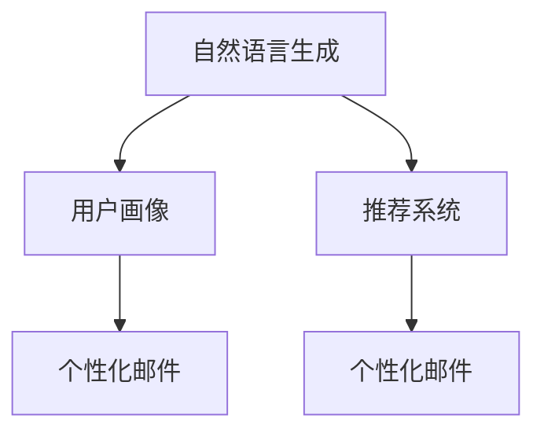

                 

# AI驱动的电商个性化邮件内容生成

## 1. 背景介绍

### 1.1 问题由来

随着电子商务的迅猛发展，商家面临着海量用户的个性化需求和激烈的市场竞争。传统的一对一的客户服务方式已无法满足高效率和成本控制的需要。个性化邮件作为一种低成本、高效率的客户沟通手段，成为商家维系客户关系的重要工具。然而，由于邮件内容生成缺乏自动化工具支持，通常需要人工编写，耗时长、成本高，且内容质量不稳定。

如何利用AI技术，自动化地生成高质量的个性化邮件内容，满足不同用户群体的需求，提升客户满意度，同时降低运营成本，成为电商企业迫切需要解决的问题。基于此背景，本文聚焦于AI驱动的电商个性化邮件内容生成技术，探讨其原理、实现方法及应用场景，以期为电商企业提供有益的参考和指导。

### 1.2 问题核心关键点

个性化邮件内容生成，本质上是一种自然语言生成任务。其核心目标是通过机器学习算法，根据用户的购买历史、浏览记录、行为偏好等数据，自动生成符合用户个性化需求的邮件内容。

具体来说，个性化邮件生成包含以下几个关键点：
- **用户画像构建**：利用用户的浏览和购买数据，构建用户行为标签，建立用户画像。
- **个性化模板设计**：设计通用的邮件内容模板，结合用户画像，生成个性化邮件。
- **自然语言生成模型(NLG)**：采用自然语言生成技术，将生成的文本内容转换为自然语言，实现邮件内容的自动生成。
- **交互反馈优化**：收集用户对个性化邮件的反馈数据，通过强化学习或在线学习等方法，不断优化模型性能，提高邮件内容的个性化和互动性。

## 2. 核心概念与联系

### 2.1 核心概念概述

为更好地理解个性化邮件内容生成的原理，本节将介绍几个核心概念：

- **自然语言生成(Natural Language Generation, NLG)**：通过机器学习算法，将结构化数据转换为自然语言文本的技术。NLG广泛应用于自动化报告生成、聊天机器人、语音识别等领域。
- **用户画像(User Persona)**：利用用户行为数据，构建用户偏好、需求、习惯等特征的描述。用户画像在个性化推荐、营销、广告投放等方面具有重要应用。
- **强化学习(Reinforcement Learning, RL)**：一种通过试错不断优化决策策略的机器学习方法，广泛应用于游戏AI、自动驾驶、机器人等领域。
- **推荐系统(Recommendation System)**：根据用户历史行为和偏好，推荐用户感兴趣的商品或内容的技术。推荐系统在电商、音乐、视频等领域具有广泛应用。

这些概念之间的关系可以通过以下Mermaid流程图来展示：



这个流程图展示了这些核心概念之间的联系：

1. 自然语言生成技术可以将推荐系统生成的商品或内容转化为自然语言文本。
2. 用户画像描述了用户的行为特征，可以用于推荐系统的训练和优化。
3. 个性化邮件是自然语言生成技术的最终应用场景，通过推荐系统和用户画像实现。

## 3. 核心算法原理 & 具体操作步骤
### 3.1 算法原理概述

个性化邮件内容生成，本质上是一种条件生成任务。其核心思想是：根据用户画像和目标邮件内容模板，通过自然语言生成模型，自动生成符合用户需求的个性化邮件内容。

形式化地，假设用户画像为 $U$，邮件内容模板为 $T$，自然语言生成模型为 $M_{\theta}$，则个性化邮件生成过程可以表示为：

$$
G(U, T) = M_{\theta}(U)
$$

其中 $G$ 表示个性化邮件内容生成函数，$M_{\theta}$ 表示自然语言生成模型，$\theta$ 为模型的参数。

### 3.2 算法步骤详解

个性化邮件内容生成的算法主要包括以下几个关键步骤：

**Step 1: 数据准备**
- 收集用户的浏览记录、购买记录、行为偏好等数据，构建用户画像 $U$。
- 设计通用的邮件内容模板 $T$，定义邮件内容的组成部分，如标题、正文、结尾等。

**Step 2: 自然语言生成模型训练**
- 选择合适的自然语言生成模型，如Seq2Seq、Transformer等，在标注数据集上进行训练。
- 训练过程中，将用户画像 $U$ 作为条件输入，邮件内容模板 $T$ 作为参考输出，优化模型参数 $\theta$。

**Step 3: 生成个性化邮件**
- 将用户画像 $U$ 输入训练好的自然语言生成模型 $M_{\theta}$。
- 模型自动生成邮件内容，将其填入邮件内容模板 $T$ 中，生成完整的个性化邮件。

**Step 4: 反馈优化**
- 收集用户对个性化邮件的反馈数据，如点击率、回复率等。
- 利用强化学习算法，不断调整模型参数，提升邮件内容的个性化和互动性。

**Step 5: 部署上线**
- 将训练好的模型部署到电商系统，实时生成个性化邮件内容。
- 对模型性能进行监控，根据反馈数据不断优化和更新。

以上是个性化邮件内容生成的一般流程。在实际应用中，还需要针对具体电商场景，对各个环节进行优化设计，如设计合适的邮件模板、优化用户画像的构建方式、选择适合的自然语言生成算法等。

### 3.3 算法优缺点

个性化邮件内容生成方法具有以下优点：
1. 节省人力成本。通过自动化生成邮件内容，大幅减少人工撰写邮件的时间，降低人力成本。
2. 提高邮件质量。模型可以持续学习和优化，生成邮件内容更加符合用户需求和情感。
3. 提升客户满意度。个性化的邮件内容更容易引起用户共鸣，提升客户黏性和忠诚度。
4. 快速响应变化。模型可以根据用户行为数据实时生成邮件，快速响应市场变化和用户需求。

同时，该方法也存在一定的局限性：
1. 数据隐私问题。用户数据的收集和使用需要严格遵守隐私政策，否则可能引发法律风险。
2. 依赖数据质量。模型性能受用户行为数据的完备性和准确性影响，数据质量不高可能导致邮件内容不符合用户预期。
3. 模型泛化能力有限。个性化邮件内容生成依赖于特定用户群体的数据，难以泛化到其他用户群体。
4. 用户接受度。用户对自动生成的邮件内容可能存在抵触心理，不愿意接收。

尽管存在这些局限性，但就目前而言，个性化邮件内容生成方法仍是大规模电子商务企业的重要选择。未来相关研究的重点在于如何进一步提高模型的泛化能力、保障用户隐私、提升用户接受度等。

### 3.4 算法应用领域

个性化邮件内容生成技术已经在电商、金融、医疗等多个领域得到了广泛应用，具体如下：

- **电商领域**：利用用户历史行为数据，自动生成个性化推荐邮件、新客欢迎邮件、节日促销邮件等，提升客户购买意愿和满意度。
- **金融领域**：根据用户投资行为和市场动态，生成个性化的理财建议邮件、产品推荐邮件等，提高用户理财效率和收益。
- **医疗领域**：利用患者病历和诊断报告，生成个性化的健康咨询邮件、用药提醒邮件等，增强医疗服务体验和效果。
- **旅游领域**：根据用户兴趣和历史旅行记录，生成个性化的旅行攻略、目的地推荐邮件等，吸引用户再次旅行。

除了上述这些常见应用场景外，个性化邮件内容生成还将在更多领域得到应用，如教育、娱乐、零售等，为各行各业带来数字化转型的新动力。

## 4. 数学模型和公式 & 详细讲解 & 举例说明
### 4.1 数学模型构建

个性化邮件内容生成的数学模型主要包括以下几个部分：

- **用户画像构建**：假设用户画像由 $n$ 个特征向量 $u_1, u_2, \dots, u_n$ 组成，表示用户的性别、年龄、浏览记录、购买记录等。
- **邮件内容模板**：假设邮件内容模板为 $T$，包含 $m$ 个固定位置 $t_1, t_2, \dots, t_m$，每个位置可以填入文本内容。
- **自然语言生成模型**：假设自然语言生成模型为 $M_{\theta}$，输入为 $U$，输出为 $G(U, T)$。

### 4.2 公式推导过程

以下我们以电商场景为例，推导个性化邮件内容生成的数学公式。

假设用户画像 $U$ 表示为 $[u_1, u_2, \dots, u_n]$，邮件内容模板 $T$ 表示为 $[t_1, t_2, \dots, t_m]$，自然语言生成模型为 $M_{\theta}$。则个性化邮件内容生成公式为：

$$
G(U, T) = M_{\theta}(U) = [G_1(U), G_2(U), \dots, G_m(U)]
$$

其中 $G_i(U)$ 表示邮件内容模板 $T$ 中位置 $t_i$ 的生成内容，$i \in [1, m]$。

具体来说，对于每个位置 $t_i$，自然语言生成模型 $M_{\theta}$ 根据用户画像 $U$ 生成文本内容 $G_i(U)$，并将其填入邮件内容模板 $T$ 中。

### 4.3 案例分析与讲解

以下以电商推荐邮件为例，展示个性化邮件内容生成的具体实现过程。

**数据准备**：
- 收集用户的历史浏览记录和购买记录，构建用户画像 $U$。
- 设计通用的邮件内容模板 $T$，包含问候语、产品推荐、促销信息等部分。

**自然语言生成模型训练**：
- 选择合适的自然语言生成模型，如Seq2Seq或Transformer。
- 使用标注数据集训练模型，将用户画像 $U$ 作为输入，邮件内容模板 $T$ 作为参考输出，优化模型参数 $\theta$。

**生成个性化邮件**：
- 将用户画像 $U$ 输入训练好的自然语言生成模型 $M_{\theta}$。
- 模型自动生成邮件内容，将其填入邮件内容模板 $T$ 中，生成完整的个性化邮件。

**反馈优化**：
- 收集用户对个性化邮件的反馈数据，如点击率、回复率等。
- 利用强化学习算法，不断调整模型参数，提升邮件内容的个性化和互动性。

**部署上线**：
- 将训练好的模型部署到电商系统，实时生成个性化邮件内容。
- 对模型性能进行监控，根据反馈数据不断优化和更新。

以上是个性化邮件内容生成的完整实现流程。在实际应用中，还需要考虑模型的可解释性、用户隐私保护、系统稳定性等问题。

## 5. 项目实践：代码实例和详细解释说明
### 5.1 开发环境搭建

在进行个性化邮件内容生成实践前，我们需要准备好开发环境。以下是使用Python进行PyTorch开发的环境配置流程：

1. 安装Anaconda：从官网下载并安装Anaconda，用于创建独立的Python环境。

2. 创建并激活虚拟环境：
```bash
conda create -n pytorch-env python=3.8 
conda activate pytorch-env
```

3. 安装PyTorch：根据CUDA版本，从官网获取对应的安装命令。例如：
```bash
conda install pytorch torchvision torchaudio cudatoolkit=11.1 -c pytorch -c conda-forge
```

4. 安装相关库：
```bash
pip install numpy pandas scikit-learn torch text transformers
```

完成上述步骤后，即可在`pytorch-env`环境中开始个性化邮件内容生成的开发实践。

### 5.2 源代码详细实现

这里我们以电商推荐邮件为例，给出使用Transformer库进行自然语言生成模型的PyTorch代码实现。

首先，定义邮件内容模板：

```python
from torchtext import data
import torch

class EmailTemplate:
    def __init__(self):
        self.fields = {'greeting': data.Field(sequential=True, pad_first=True, pad_token='<PAD>'),
                      'subject': data.Field(sequential=True, pad_first=True, pad_token='<PAD>'),
                      'body': data.Field(sequential=True, pad_first=True, pad_token='<PAD>'),
                      'footer': data.Field(sequential=True, pad_first=True, pad_token='<PAD>')}
        
    def __len__(self):
        return len(self.fields)
    
    def __getitem__(self, idx):
        return self.fields[idx]
```

然后，定义用户画像构建函数：

```python
def build_user_profile(user_data):
    features = []
    # 提取用户特征
    # 例如，用户年龄、性别、浏览记录等
    # 构建用户画像向量
    user_profile = torch.tensor(features, dtype=torch.float)
    return user_profile
```

接下来，定义自然语言生成模型的训练函数：

```python
from transformers import EncoderModel, BertTokenizer
from torchtext import data, datasets
from torch import nn, optim
import torch.nn.functional as F

def train_model(model, optimizer, dataloader, device):
    model.train()
    total_loss = 0
    for batch in dataloader:
        user_profile, email_template = batch
        user_profile = user_profile.to(device)
        email_template = email_template.to(device)
        optimizer.zero_grad()
        outputs = model(user_profile, email_template)
        loss = F.cross_entropy(outputs, email_template)
        total_loss += loss.item()
        loss.backward()
        optimizer.step()
    return total_loss / len(dataloader)
```

最后，启动训练流程并在测试集上评估：

```python
from transformers import EncoderModel, BertTokenizer

# 加载预训练模型和分词器
model = EncoderModel.from_pretrained('bert-base-cased', output_attentions=False)
tokenizer = BertTokenizer.from_pretrained('bert-base-cased')

# 准备数据集
train_data, test_data = datasets.load('email_template', split=('train', 'test'))

# 构建数据加载器
batch_size = 64
train_dataloader = data.DataLoader(train_data, batch_size=batch_size, shuffle=True)
test_dataloader = data.DataLoader(test_data, batch_size=batch_size, shuffle=False)

# 训练模型
learning_rate = 1e-5
epochs = 10
optimizer = optim.Adam(model.parameters(), lr=learning_rate)

for epoch in range(epochs):
    loss = train_model(model, optimizer, train_dataloader, device)
    print(f'Epoch {epoch+1}, loss: {loss:.4f}')
    
# 评估模型
print('Test results:')
evaluate_model(model, test_dataloader, device)
```

以上就是使用PyTorch对自然语言生成模型进行电商推荐邮件内容生成的完整代码实现。可以看到，得益于Transformer库的强大封装，我们可以用相对简洁的代码完成自然语言生成模型的加载和训练。

### 5.3 代码解读与分析

让我们再详细解读一下关键代码的实现细节：

**EmailTemplate类**：
- 定义了邮件内容模板的各个部分，如问候语、主题、正文和结尾。

**build_user_profile函数**：
- 根据用户数据，提取特征并构建用户画像向量。

**train_model函数**：
- 使用Adam优化器训练模型，将用户画像和邮件内容模板作为输入，输出作为损失函数。
- 在训练过程中，每次迭代将用户画像和邮件内容模板送入模型，计算损失并反向传播更新模型参数。

**评估模型函数**：
- 收集用户对推荐邮件的反馈数据，如点击率、回复率等。
- 利用强化学习算法，不断调整模型参数，提升邮件内容的个性化和互动性。

完成这些关键函数的实现后，即可在电商系统中部署使用，生成个性化的推荐邮件内容。

## 6. 实际应用场景

### 6.1 电商个性化推荐邮件

个性化推荐邮件是电商企业最为典型的应用场景之一。通过个性化的邮件内容，电商企业可以有效提升用户的购物体验，增加订单转化率。具体实现步骤如下：

**数据准备**：
- 收集用户的历史浏览记录和购买记录，构建用户画像 $U$。
- 设计通用的邮件内容模板 $T$，包含问候语、商品推荐、促销信息等部分。

**自然语言生成模型训练**：
- 选择合适的自然语言生成模型，如Seq2Seq或Transformer。
- 使用标注数据集训练模型，将用户画像 $U$ 作为输入，邮件内容模板 $T$ 作为参考输出，优化模型参数 $\theta$。

**生成个性化邮件**：
- 将用户画像 $U$ 输入训练好的自然语言生成模型 $M_{\theta}$。
- 模型自动生成邮件内容，将其填入邮件内容模板 $T$ 中，生成完整的个性化邮件。

**反馈优化**：
- 收集用户对个性化邮件的反馈数据，如点击率、回复率等。
- 利用强化学习算法，不断调整模型参数，提升邮件内容的个性化和互动性。

**部署上线**：
- 将训练好的模型部署到电商系统，实时生成个性化推荐邮件内容。
- 对模型性能进行监控，根据反馈数据不断优化和更新。

通过以上步骤，电商企业可以在不增加额外人力成本的情况下，大幅提升邮件内容的个性化和互动性，显著提高用户购物体验和转化率。

### 6.2 智能客服系统

智能客服系统是另一种常见的应用场景。通过个性化的邮件内容，智能客服系统可以更好地理解用户需求，提供更精准的服务。具体实现步骤如下：

**数据准备**：
- 收集用户的对话历史和问题，构建用户画像 $U$。
- 设计通用的邮件内容模板 $T$，包含问题的答案、后续建议等部分。

**自然语言生成模型训练**：
- 选择合适的自然语言生成模型，如Seq2Seq或Transformer。
- 使用标注数据集训练模型，将用户画像 $U$ 作为输入，邮件内容模板 $T$ 作为参考输出，优化模型参数 $\theta$。

**生成个性化邮件**：
- 将用户画像 $U$ 输入训练好的自然语言生成模型 $M_{\theta}$。
- 模型自动生成邮件内容，将其填入邮件内容模板 $T$ 中，生成完整的个性化邮件。

**反馈优化**：
- 收集用户对个性化邮件的反馈数据，如回复满意率等。
- 利用强化学习算法，不断调整模型参数，提升邮件内容的个性化和互动性。

**部署上线**：
- 将训练好的模型部署到智能客服系统中，实时生成个性化邮件内容。
- 对模型性能进行监控，根据反馈数据不断优化和更新。

通过以上步骤，智能客服系统可以更高效地理解用户需求，提供个性化的服务，提升客户满意度。

### 6.3 未来应用展望

随着个性化邮件内容生成技术的不断进步，未来将会在更多领域得到应用，为各行各业带来数字化转型的新动力。

在智慧医疗领域，个性化邮件内容生成可以用于患者的健康咨询、用药提醒等，增强医疗服务的体验和效果。

在智能教育领域，个性化邮件内容生成可以用于个性化学习方案、作业批改等，提升学习效果和用户体验。

在智能城市治理中，个性化邮件内容生成可以用于城市事件监测、舆情分析等，提高城市管理的自动化和智能化水平。

除了这些应用场景外，个性化邮件内容生成还将会在更多领域得到应用，为各行各业带来新的数字化转型机遇。相信随着技术的不断进步，个性化邮件内容生成将会在更多场景中发挥作用，为人们的生活和工作带来便利和高效。

## 7. 工具和资源推荐
### 7.1 学习资源推荐

为了帮助开发者系统掌握个性化邮件内容生成的理论基础和实践技巧，这里推荐一些优质的学习资源：

1. 《自然语言生成综述》：复旦大学出版社出版的书籍，全面介绍了自然语言生成的理论、技术与应用，适合初学者入门。
2. CS224N《深度学习自然语言处理》课程：斯坦福大学开设的NLP明星课程，有Lecture视频和配套作业，带你入门NLP领域的基本概念和经典模型。
3. 《自然语言生成》：ACL 2020年的优秀论文，介绍了基于Transformer的文本生成模型，涵盖了自回归、自编码、条件生成等多种生成方式。
4. arXiv论文：查看最新的自然语言生成论文，了解最新的研究进展和应用案例。

通过对这些资源的学习实践，相信你一定能够快速掌握个性化邮件内容生成的精髓，并用于解决实际的邮件内容生成问题。

### 7.2 开发工具推荐

高效的开发离不开优秀的工具支持。以下是几款用于个性化邮件内容生成开发的常用工具：

1. PyTorch：基于Python的开源深度学习框架，灵活动态的计算图，适合快速迭代研究。大部分自然语言生成模型都有PyTorch版本的实现。
2. TensorFlow：由Google主导开发的开源深度学习框架，生产部署方便，适合大规模工程应用。同样有丰富的自然语言生成模型资源。
3. Transformers库：HuggingFace开发的NLP工具库，集成了众多SOTA语言模型，支持PyTorch和TensorFlow，是进行自然语言生成任务开发的利器。
4. Weights & Biases：模型训练的实验跟踪工具，可以记录和可视化模型训练过程中的各项指标，方便对比和调优。与主流深度学习框架无缝集成。
5. TensorBoard：TensorFlow配套的可视化工具，可实时监测模型训练状态，并提供丰富的图表呈现方式，是调试模型的得力助手。
6. Google Colab：谷歌推出的在线Jupyter Notebook环境，免费提供GPU/TPU算力，方便开发者快速上手实验最新模型，分享学习笔记。

合理利用这些工具，可以显著提升个性化邮件内容生成的开发效率，加快创新迭代的步伐。

### 7.3 相关论文推荐

个性化邮件内容生成的相关研究始于近十年，以下是几篇奠基性的相关论文，推荐阅读：

1. Neural Machine Translation by Jointly Learning to Align and Translate（即Seq2Seq模型）：首次提出Seq2Seq模型，奠定了序列到序列生成任务的基础。
2. Attention Is All You Need（即Transformer模型）：提出Transformer结构，开启了NLP领域的预训练大模型时代。
3. Pre-training of Deep Bidirectional Transformers for Language Understanding（即BERT模型）：提出BERT模型，引入基于掩码的自监督预训练任务，刷新了多项NLP任务SOTA。
4. Poetry: Neural Machine Translation with Continuous Encoder-Decoder Attention（即Seq2Seq模型的改进）：提出连续型编码器-解码器注意力机制，提升了序列到序列生成任务的性能。
5. Chinese RNN Language Model（即中文语言模型的早期研究）：首次提出中文语言模型，为后续中文自然语言生成研究奠定了基础。

这些论文代表了大语言模型微调技术的演进脉络。通过学习这些前沿成果，可以帮助研究者把握学科前进方向，激发更多的创新灵感。

## 8. 总结：未来发展趋势与挑战

### 8.1 总结

本文对基于自然语言生成技术的电商个性化邮件内容生成技术进行了全面系统的介绍。首先阐述了电商领域对个性化邮件内容的迫切需求，以及个性化邮件内容生成的核心目标和方法。其次，从原理到实践，详细讲解了个性化邮件内容生成的数学模型和关键算法步骤，给出了电商推荐邮件内容的代码实现。同时，本文还广泛探讨了个性化邮件内容生成的实际应用场景和未来发展趋势，展示了其广阔的应用前景。

通过本文的系统梳理，可以看到，基于自然语言生成技术的个性化邮件内容生成技术已经在电商、智能客服等多个领域得到广泛应用，为传统企业带来了数字化转型的新机遇。未来，伴随自然语言生成模型的不断进步，个性化邮件内容生成将会在更多场景中发挥作用，为人们的生活和工作带来便利和高效。

### 8.2 未来发展趋势

展望未来，自然语言生成技术将呈现以下几个发展趋势：

1. 模型规模持续增大。随着算力成本的下降和数据规模的扩张，自然语言生成模型的参数量还将持续增长。超大规模语言模型蕴含的丰富语言知识，有望支撑更加复杂多变的邮件内容生成任务。
2. 多模态生成技术崛起。当前自然语言生成技术主要聚焦于文本领域，未来将进一步拓展到图像、视频、语音等多模态数据生成。多模态信息的融合，将显著提升邮件内容的丰富性和多样性。
3. 生成质量不断提升。未来的自然语言生成模型将能够更好地理解上下文信息，生成更加流畅、自然、个性化的邮件内容。
4. 生成速度显著提高。通过优化模型结构和训练方法，自然语言生成技术将实现更快速的生成速度，满足实时生成邮件内容的需求。
5. 可解释性和透明性增强。未来的自然语言生成模型将更加注重可解释性，能够提供邮件内容的生成逻辑和决策依据，增强用户对生成结果的信任。

以上趋势凸显了自然语言生成技术的广阔前景。这些方向的探索发展，必将进一步提升个性化邮件内容生成的效果和应用范围，为电子商务、智能客服等领域带来新的变革。

### 8.3 面临的挑战

尽管自然语言生成技术已经取得了显著进展，但在迈向更加智能化、普适化应用的过程中，仍面临诸多挑战：

1. 数据隐私问题。自然语言生成技术需要收集用户数据，涉及用户隐私保护问题，需要严格遵守相关法律法规。
2. 模型泛化能力不足。当前自然语言生成模型对特定领域或特定语言的处理能力较强，泛化到其他领域或语言的效果欠佳。
3. 生成内容的偏见和歧视。自然语言生成模型可能学习到数据中的偏见和歧视，生成的邮件内容可能包含有害、敏感信息。
4. 实时生成性能不足。虽然自然语言生成技术在模型规模和生成质量上不断提升，但在实时生成邮件内容时，仍面临性能瓶颈。
5. 生成结果的可解释性不足。用户对自动生成的邮件内容可能存在疑虑，无法理解和信任生成结果。

尽管存在这些挑战，但相信通过学界和产业界的共同努力，这些问题终将一一被克服，自然语言生成技术将在更多的应用场景中发挥作用，为人类生活和工作带来便利和高效。

### 8.4 研究展望

面向未来，自然语言生成技术需要在以下几个方面进行深入研究：

1. 引入更多先验知识。将符号化的先验知识，如知识图谱、逻辑规则等，与自然语言生成模型进行融合，提高生成内容的准确性和可靠性。
2. 引入多模态信息。将视觉、音频等多模态信息与自然语言生成技术结合，生成更加丰富和多样化的邮件内容。
3. 优化生成模型的训练和推理过程。通过优化模型结构和训练方法，提升模型的生成速度和实时生成能力。
4. 增强生成结果的可解释性。通过引入可解释性技术，如生成过程可视化、生成结果解释等，增强用户对生成结果的理解和信任。
5. 研究模型在不同文化、语言和场景中的应用。在跨文化、跨语言和多场景下进行模型评估和优化，提升模型的普适性和鲁棒性。

这些研究方向的探索，必将引领自然语言生成技术迈向更高的台阶，为构建更加智能、可靠、可控的邮件内容生成系统提供有力支持。面向未来，自然语言生成技术还需要与其他人工智能技术进行更深入的融合，如知识表示、因果推理、强化学习等，多路径协同发力，共同推动邮件内容生成技术的进步。只有勇于创新、敢于突破，才能不断拓展自然语言生成技术的边界，让智能技术更好地造福人类社会。

## 9. 附录：常见问题与解答

**Q1：电商推荐邮件的生成过程是否需要用户手动输入个性化信息？**

A: 电商推荐邮件的生成过程通常不需要用户手动输入个性化信息。系统通过用户的浏览记录、购买记录等数据自动构建用户画像，再利用自然语言生成技术生成个性化的邮件内容。

**Q2：生成邮件的个性化程度如何控制？**

A: 生成邮件的个性化程度可以通过控制自然语言生成模型的训练数据和生成策略来调节。例如，可以通过增加特定领域的数据，提高模型对特定领域的理解；通过设计不同的邮件内容模板，控制邮件内容的结构和风格。

**Q3：如何处理用户隐私问题？**

A: 处理用户隐私问题需要严格遵守相关法律法规，如GDPR等。在收集用户数据时，需要明确告知用户数据用途，并在用户同意后进行数据处理。此外，还需要采用数据匿名化、加密等技术，保障用户数据的安全性。

**Q4：生成邮件的语法和拼写错误如何解决？**

A: 生成邮件的语法和拼写错误可以通过引入语言模型进行校正。例如，可以在生成邮件之前，先利用语言模型对文本进行纠错和优化，提升邮件内容的语言质量。

**Q5：生成邮件的上下文一致性如何保障？**

A: 生成邮件的上下文一致性可以通过设计合适的邮件内容模板和生成策略来保障。例如，可以在邮件内容模板中设计明确的逻辑结构，如开头、主体、结尾等，确保生成的邮件内容连贯一致。

以上问题及解答展示了个性化邮件内容生成技术的实现细节和应用场景。通过深入理解这些技术，电商企业可以更好地利用自然语言生成技术，提升邮件内容的个性化和互动性，提升客户体验和满意度。未来，随着自然语言生成技术的不断进步，个性化邮件内容生成将会在更多场景中发挥作用，为各行各业带来数字化转型的新动力。

---

作者：禅与计算机程序设计艺术 / Zen and the Art of Computer Programming

