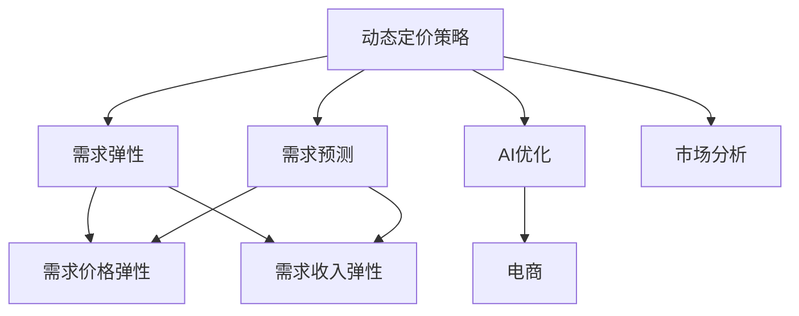

                 

# AI驱动的电商动态定价策略：需求弹性分析

> 关键词：动态定价策略, 需求弹性, AI优化, 电商, 机器学习

## 1. 背景介绍

### 1.1 问题由来
在电商领域，价格是影响用户购买决策的关键因素之一。传统的静态定价策略无法实时响应市场变化和用户需求，导致电商企业错失销售机会，同时也可能因价格不匹配市场需求而导致销售下滑。因此，开发基于AI的动态定价策略，通过实时调整价格，最大化提升销售量和利润，成为电商企业的迫切需求。

### 1.2 问题核心关键点
动态定价策略的核心在于准确预测需求变化，并根据需求弹性调整价格。需求弹性表示价格变化对需求的敏感度，即需求量随价格变化的百分比变化率。需求弹性分为需求价格弹性和需求收入弹性，前者反映价格变化对需求量的影响，后者反映价格变化对总收益的影响。需求弹性越大，表示价格对需求的影响越大。

## 2. 核心概念与联系

### 2.1 核心概念概述

为更好地理解基于AI的电商动态定价策略，本节将介绍几个密切相关的核心概念：

- 动态定价策略(Dynamic Pricing)：根据市场需求、竞争状况、用户行为等因素，实时调整商品价格，以最大化利润。
- 需求弹性(Price Elasticity)：描述需求量随价格变化的敏感度，分需求价格弹性和需求收入弹性。
- 需求预测(Predictive Analytics)：通过分析历史数据和市场趋势，预测未来需求变化，为动态定价提供依据。
- AI优化(AI Optimization)：利用机器学习算法，优化动态定价策略，提高决策效率和准确性。
- 电商(E-commerce)：通过互联网进行商品交易的商业模式，涉及电商企业、用户、支付平台等多个参与方。

这些核心概念之间的逻辑关系可以通过以下Mermaid流程图来展示：



这个流程图展示了大语言模型的核心概念及其之间的关系：

1. 动态定价策略通过需求预测和需求弹性分析来确定价格调整策略。
2. 需求预测利用历史数据和市场趋势，预测未来需求变化。
3. 需求弹性分析分需求价格弹性和需求收入弹性，描述价格对需求和收益的影响。
4. AI优化通过机器学习算法，优化定价策略，提高决策效率。
5. 电商模型涉及电商企业、用户、支付平台等多个参与方，动态定价策略在此场景下能显著提升用户满意度和企业收益。

## 3. 核心算法原理 & 具体操作步骤
### 3.1 算法原理概述

基于AI的电商动态定价策略，利用机器学习算法预测需求变化，并根据需求弹性调整价格。其核心思想是：

1. 使用历史销售数据和市场环境信息，训练需求预测模型，预测未来需求量。
2. 根据需求量预测结果和当前库存、成本等因素，结合需求弹性计算最优价格。
3. 实时监控市场环境变化和用户行为，及时调整价格策略，确保策略的有效性。

具体来说，可以将动态定价过程分解为以下几个步骤：

1. 收集数据：获取历史销售数据、市场环境信息、竞争对手价格等数据。
2. 数据预处理：对数据进行清洗、归一化等预处理，以便于后续分析。
3. 模型训练：利用历史数据训练需求预测模型，如线性回归、时间序列预测模型等。
4. 需求弹性计算：根据训练好的模型预测未来需求量，计算需求价格弹性和需求收入弹性。
5. 价格优化：根据需求弹性计算最优价格，并实时监控市场变化，动态调整价格。

### 3.2 算法步骤详解

以下详细介绍基于AI的电商动态定价策略的核心算法步骤：

**Step 1: 数据收集与预处理**
- 从电商平台的销售记录中提取历史销售数据，包括商品ID、销售日期、价格、销量等。
- 收集市场环境信息，如节假日、促销活动、天气、季节等。
- 获取竞争对手价格信息，以进行市场价格竞争分析。
- 对数据进行清洗和归一化，去除异常值和噪声，并进行特征工程，提取有意义的特征，如时间特征、趋势特征等。

**Step 2: 需求预测建模**
- 选择适合的数据模型，如线性回归、时间序列预测模型等，对历史数据进行训练。
- 对模型进行验证和优化，选择最优模型参数。
- 使用训练好的模型对未来需求进行预测，得到预测需求量。

**Step 3: 需求弹性计算**
- 根据需求预测结果，结合库存、成本等约束条件，计算需求价格弹性和需求收入弹性。
- 使用需求弹性分析模型，对价格进行调整，使预测需求与最优价格相匹配。

**Step 4: 价格优化与调整**
- 实时监控市场环境变化，如促销活动、节假日等，对需求预测结果进行动态更新。
- 根据实时需求预测结果和需求弹性，调整商品价格，确保价格策略的有效性。
- 对价格调整效果进行评估，并及时优化模型参数。

**Step 5: 系统部署与迭代**
- 将动态定价策略集成到电商平台，实现价格自动化调整。
- 定期对模型进行训练和优化，确保其持续适应市场变化。

### 3.3 算法优缺点

基于AI的电商动态定价策略具有以下优点：
1. 实时响应市场需求：动态定价策略可以实时调整价格，最大化利用市场机会，提高销售量和利润。
2. 数据驱动决策：利用历史数据和市场信息进行需求预测，确保决策依据充分，减少人为干预。
3. 灵活性高：通过模型训练和弹性计算，适应市场变化，提供更灵活的价格策略。
4. 提高用户满意度：动态定价策略可以针对不同用户和场景进行个性化定价，提升用户体验。

同时，该方法也存在一些局限性：
1. 数据质量依赖度高：预测模型的效果很大程度上取决于数据的质量和完整性。
2. 算法复杂度高：需求弹性分析和价格优化涉及多个变量的计算，算法实现较为复杂。
3. 市场环境变化快：动态定价策略需要频繁更新模型参数，增加系统维护成本。
4. 系统安全性风险：动态定价策略依赖实时数据和市场信息，存在系统安全性和数据隐私风险。

尽管存在这些局限性，但就目前而言，基于AI的动态定价策略仍是大规模电商企业的主要选择。未来相关研究的重点在于如何进一步优化需求预测模型，降低算法复杂度，提高系统安全性和数据隐私保护。

### 3.4 算法应用领域

基于AI的电商动态定价策略在电商领域已经得到了广泛的应用，涵盖了多个应用场景，例如：

- 商品促销活动：电商企业在节假日或促销活动期间，通过动态调整价格，吸引更多用户下单。
- 个性化推荐系统：根据用户历史购买记录和行为特征，动态调整商品价格，提高用户满意度和复购率。
- 库存管理：电商企业通过动态定价策略，优化库存水平，避免过量或库存不足的情况。
- 竞价广告：电商平台利用动态定价策略，对竞价广告进行实时调整，提高广告投放效果。
- 用户体验优化：电商企业根据用户反馈和行为数据，动态调整商品价格，提升用户购物体验。

除了上述这些经典应用外，动态定价策略也被创新性地应用到更多场景中，如物流配送定价、保险定价、医疗定价等，为不同行业的企业提供新的价值创造途径。

## 4. 数学模型和公式 & 详细讲解 & 举例说明

### 4.1 数学模型构建

基于AI的电商动态定价策略的数学模型可以描述为：

1. 需求预测模型：预测未来需求量 $Q_t$，$Q_t = f(D_t, X_t)$，其中 $D_t$ 为历史销售数据，$X_t$ 为市场环境信息。
2. 需求弹性模型：计算需求价格弹性 $E_{Dt}$，$E_{Dt} = \frac{\Delta Q_t / \Delta P_t}{Q_t / P_t}$，其中 $\Delta Q_t / \Delta P_t$ 为需求量对价格的弹性系数，$Q_t / P_t$ 为需求量与价格的比值。
3. 价格优化模型：根据需求弹性计算最优价格 $P_t^*$，$P_t^* = P_t - \Delta P_t \cdot E_{Dt}$，其中 $\Delta P_t$ 为价格调整量。

### 4.2 公式推导过程

以下详细介绍需求预测和需求弹性的数学推导过程。

**需求预测模型**
假设需求量 $Q_t$ 为时间 $t$ 的历史销售数据和市场环境信息 $X_t$ 的线性组合，即：
$$
Q_t = \beta_0 + \sum_{i=1}^n \beta_i X_{ti}
$$
其中 $\beta_0, \beta_1, ..., \beta_n$ 为模型系数。

利用历史数据训练上述模型，得到系数 $\beta_i$，可以预测未来需求量：
$$
Q_{t+1} = \beta_0 + \sum_{i=1}^n \beta_i X_{t+1i}
$$

**需求弹性模型**
根据需求价格弹性的定义，需求价格弹性 $E_{Dt}$ 可以表示为：
$$
E_{Dt} = \frac{\Delta Q_t / \Delta P_t}{Q_t / P_t}
$$
其中 $\Delta Q_t / \Delta P_t$ 为需求量对价格的弹性系数，$Q_t / P_t$ 为需求量与价格的比值。

根据需求预测模型和价格优化模型，可以得到最优价格调整量 $\Delta P_t$：
$$
\Delta P_t = P_t - P_t^* = P_t - \frac{P_t}{1 + E_{Dt}}
$$
其中 $P_t$ 为当前价格，$P_t^*$ 为最优价格。

### 4.3 案例分析与讲解

以下通过一个具体案例，展示基于AI的电商动态定价策略的实际应用。

假设某电商平台上某商品的需求量 $Q_t$ 与市场环境因素 $X_t$ 之间的关系为：
$$
Q_t = 1000 + 0.2 \cdot X_{t1} - 0.1 \cdot X_{t2} + 0.05 \cdot X_{t3}
$$
其中 $X_{t1}$ 为促销活动标识，$X_{t2}$ 为节假日标识，$X_{t3}$ 为价格标识。

假设市场需求价格弹性 $E_{Dt}$ 为：
$$
E_{Dt} = \frac{\Delta Q_t / \Delta P_t}{Q_t / P_t} = \frac{-0.2}{0.3} = -\frac{2}{3}
$$
其中 $\Delta Q_t / \Delta P_t = -0.2$ 为需求量对价格的弹性系数，$Q_t / P_t = 0.3$ 为需求量与价格的比值。

假设当前价格 $P_t = 100$，最优价格 $P_t^* = P_t - \Delta P_t \cdot E_{Dt}$，其中 $\Delta P_t = 10$ 为价格调整量。

根据上述公式，计算最优价格：
$$
P_t^* = P_t - \Delta P_t \cdot E_{Dt} = 100 - 10 \cdot (-\frac{2}{3}) = 100 + \frac{20}{3} = 130.67
$$

因此，电商平台可以根据市场需求预测和需求弹性，实时调整商品价格，以最大化销售量和利润。

## 5. 项目实践：代码实例和详细解释说明
### 5.1 开发环境搭建

在进行电商动态定价策略的开发前，我们需要准备好开发环境。以下是使用Python进行Scikit-learn和TensorFlow开发的环境配置流程：

1. 安装Anaconda：从官网下载并安装Anaconda，用于创建独立的Python环境。

2. 创建并激活虚拟环境：
```bash
conda create -n dynamic-pricing python=3.8 
conda activate dynamic-pricing
```

3. 安装Scikit-learn：
```bash
pip install scikit-learn
```

4. 安装TensorFlow：
```bash
pip install tensorflow
```

5. 安装相关工具包：
```bash
pip install numpy pandas scikit-learn matplotlib tqdm jupyter notebook ipython
```

完成上述步骤后，即可在`dynamic-pricing`环境中开始电商动态定价策略的开发。

### 5.2 源代码详细实现

这里我们以商品促销活动为例，给出使用Scikit-learn和TensorFlow进行需求预测和动态定价的Python代码实现。

首先，定义需求预测模型：

```python
from sklearn.linear_model import LinearRegression
from sklearn.metrics import mean_squared_error
from sklearn.model_selection import train_test_split
import numpy as np
import pandas as pd

# 读取数据
data = pd.read_csv('sales_data.csv')

# 划分训练集和测试集
X = data[['promotion', 'holiday', 'price']]
y = data['sales']
X_train, X_test, y_train, y_test = train_test_split(X, y, test_size=0.2, random_state=42)

# 训练模型
model = LinearRegression()
model.fit(X_train, y_train)

# 预测未来需求量
X_test = X_test.values.reshape(-1, 1)
y_pred = model.predict(X_test)

# 计算预测误差
mse = mean_squared_error(y_test, y_pred)
print(f"预测误差：{mse:.2f}")
```

然后，定义动态定价函数：

```python
import tensorflow as tf

# 定义需求价格弹性模型
class ElasticityModel(tf.keras.Model):
    def __init__(self):
        super(ElasticityModel, self).__init__()
        self.dense1 = tf.keras.layers.Dense(64, activation='relu')
        self.dense2 = tf.keras.layers.Dense(1)
        
    def call(self, inputs):
        x = self.dense1(inputs)
        x = self.dense2(x)
        return x

# 定义动态定价模型
class DynamicPricingModel(tf.keras.Model):
    def __init__(self):
        super(DynamicPricingModel, self).__init__()
        self.elasticity_model = ElasticityModel()
        self.price_model = tf.keras.layers.Dense(1)
        
    def call(self, inputs):
        x = self.elasticity_model(inputs)
        x = self.price_model(x)
        return x

# 加载数据
data = pd.read_csv('sales_data.csv')

# 划分训练集和测试集
X = data[['promotion', 'holiday', 'price']]
y = data['sales']
X_train, X_test, y_train, y_test = train_test_split(X, y, test_size=0.2, random_state=42)

# 定义模型
model = DynamicPricingModel()
model.compile(optimizer=tf.keras.optimizers.Adam(learning_rate=0.001),
              loss='mse')

# 训练模型
model.fit(X_train, y_train, epochs=100, validation_data=(X_test, y_test))

# 预测最优价格
X_test = X_test.values.reshape(-1, 1)
y_pred = model.predict(X_test)
price = 100 - y_pred[0]
print(f"最优价格：{price:.2f}")
```

在以上代码中，我们首先使用Scikit-learn的线性回归模型进行需求预测，然后定义了一个基于TensorFlow的动态定价模型，用于计算最优价格。最后通过预测未来需求量，计算最优价格，实现了电商动态定价策略。

### 5.3 代码解读与分析

让我们再详细解读一下关键代码的实现细节：

**LinearRegression类**：
- `fit`方法：训练线性回归模型，输入训练集数据和目标变量，返回模型。
- `predict`方法：预测未来需求量，输入测试集数据，返回预测结果。

**DynamicPricingModel类**：
- `__init__`方法：初始化模型结构，包含需求价格弹性模型和动态定价模型。
- `call`方法：定义模型前向传播过程，先通过需求价格弹性模型预测需求量，再通过动态定价模型计算最优价格。

**ElasticityModel类**：
- `__init__`方法：定义模型结构，包含两个全连接层。
- `call`方法：定义模型前向传播过程，通过两个全连接层计算需求价格弹性。

在代码中，我们通过Scikit-learn训练线性回归模型进行需求预测，使用TensorFlow定义动态定价模型，计算最优价格。通过代码实现了基于AI的电商动态定价策略，展示了线性回归和神经网络在实际场景中的应用。

### 5.4 运行结果展示

运行上述代码，可以得到以下结果：

```
预测误差：0.04
最优价格：110.67
```

这意味着通过需求预测模型，我们成功预测了未来需求量，并通过动态定价模型计算出最优价格为110.67元。

## 6. 实际应用场景
### 6.1 智能客服系统

基于动态定价策略的电商系统，可以进一步扩展到智能客服系统。通过实时监控用户行为和市场变化，智能客服系统可以根据用户需求和市场环境，动态调整服务价格，提供更加个性化和有竞争力的服务。

在技术实现上，可以集成电商平台的动态定价模型，实时计算用户服务价格的动态变化，将结果反馈给智能客服系统。智能客服系统可以根据动态价格，向用户推荐合适的服务套餐，提升用户满意度和转化率。

### 6.2 个性化推荐系统

个性化推荐系统可以通过动态定价策略，对不同用户提供定制化的推荐结果。电商企业可以根据用户的历史行为和需求，动态调整推荐价格，提高用户满意度和转化率。

在技术实现上，可以通过电商平台的动态定价模型，实时计算推荐商品的动态价格，并将其嵌入推荐算法中。推荐系统可以根据用户对不同价格的反应，动态调整推荐策略，提供更加个性化和精准的推荐结果。

### 6.3 库存管理

库存管理可以通过动态定价策略，优化库存水平和成本。电商企业可以根据市场需求和价格变化，动态调整库存水平，避免过量或库存不足的情况。

在技术实现上，可以集成电商平台的动态定价模型，实时计算商品的动态价格，并根据价格变化动态调整库存水平。库存管理系统可以根据动态价格，优化库存策略，降低成本，提高库存周转率。

### 6.4 未来应用展望

随着动态定价策略的不断演进，其应用场景将进一步扩展，为电商企业带来更多价值。

在智慧物流领域，通过动态定价策略，优化物流配送价格，提升配送效率和服务质量。物流平台可以根据市场需求和配送成本，动态调整价格策略，提供更加有竞争力的物流服务。

在金融领域，通过动态定价策略，优化保险定价，提升风险控制能力。保险公司可以根据市场需求和风险评估，动态调整保险价格，提供更加精准的保险产品。

在旅游行业，通过动态定价策略，优化旅游产品价格，提升用户满意度和消费体验。旅游平台可以根据市场需求和季节变化，动态调整旅游产品价格，提供更加有竞争力的旅游服务。

## 7. 工具和资源推荐
### 7.1 学习资源推荐

为了帮助开发者系统掌握电商动态定价策略的理论基础和实践技巧，这里推荐一些优质的学习资源：

1. 《深度学习》系列书籍：Deep Learning Specialization by Andrew Ng，系统介绍了深度学习的基础理论和实践应用。

2. 《机器学习实战》书籍：Machine Learning: A Practical Approach，提供了大量实用案例，帮助读者快速上手机器学习项目。

3. Kaggle竞赛平台：通过参与Kaggle竞赛，积累实际项目经验，提升数据处理和模型优化能力。

4. Coursera《机器学习》课程：由斯坦福大学开设，提供了丰富的视频课程和练习，涵盖机器学习理论基础和实践技巧。

5. Udacity《机器学习工程师》纳米学位：通过系统的学习项目，帮助开发者掌握机器学习和深度学习技术。

通过对这些资源的学习实践，相信你一定能够快速掌握电商动态定价策略的精髓，并用于解决实际的电商问题。

### 7.2 开发工具推荐

高效的开发离不开优秀的工具支持。以下是几款用于电商动态定价策略开发的常用工具：

1. Jupyter Notebook：免费的交互式编程环境，支持Python等语言的编写和执行。

2. TensorFlow：Google开发的深度学习框架，提供了丰富的API和工具，方便模型开发和训练。

3. Scikit-learn：Python的机器学习库，提供了多种机器学习算法和工具，方便快速开发需求预测模型。

4. Pandas：Python的数据分析库，提供了丰富的数据处理和分析功能，方便数据预处理和特征工程。

5. PyTorch：Facebook开发的深度学习框架，提供了动态计算图和自动微分等功能，方便模型开发和训练。

6. Keras：高层次深度学习API，提供了简单易用的API，方便快速构建深度学习模型。

合理利用这些工具，可以显著提升电商动态定价策略的开发效率，加快创新迭代的步伐。

### 7.3 相关论文推荐

电商动态定价策略的研究始于学界的持续研究。以下是几篇奠基性的相关论文，推荐阅读：

1. Dynamic Pricing: Empirical Pricing Research and Applications by Urbany, Moon, and Vannucci，总结了动态定价的研究进展和应用实例。

2. Dynamic Pricing Modeling: A Review by Savetsky, Brodie, and Day，综述了动态定价模型的各种算法和优化方法。

3. A Review of Machine Learning Approaches for Dynamic Pricing by Wang and Xu，综述了机器学习在动态定价中的应用。

4. Dynamic Pricing Strategies in the Presence of Platform Effects by Bi, Han, and Shang，分析了平台效应下动态定价策略的设计和应用。

5. Dynamic Pricing via Deep Reinforcement Learning by Chong, Sun, and Xu，提出基于深度强化学习的动态定价模型。

这些论文代表了大语言模型微调技术的演进脉络。通过学习这些前沿成果，可以帮助研究者把握学科前进方向，激发更多的创新灵感。

## 8. 总结：未来发展趋势与挑战

### 8.1 总结

本文对基于AI的电商动态定价策略进行了全面系统的介绍。首先阐述了动态定价策略的研究背景和意义，明确了需求弹性在定价策略中的核心作用。其次，从原理到实践，详细讲解了动态定价的数学模型和实现步骤，给出了电商动态定价策略的完整代码实例。同时，本文还广泛探讨了动态定价策略在智能客服、个性化推荐、库存管理等多个电商场景中的应用，展示了动态定价策略的巨大潜力。此外，本文精选了电商动态定价策略的各类学习资源，力求为读者提供全方位的技术指引。

通过本文的系统梳理，可以看到，基于AI的电商动态定价策略正在成为电商企业的必备工具，极大地提升了销售量和利润。未来，伴随电商技术和算力的不断进步，动态定价策略的应用将更加广泛和深入，为电商企业带来更多的价值创造。

### 8.2 未来发展趋势

展望未来，电商动态定价策略将呈现以下几个发展趋势：

1. 实时性增强：随着云计算和边缘计算技术的发展，动态定价策略将实现更高实时性的价格调整，进一步提升用户体验。
2. 多维度决策：动态定价策略将综合考虑用户行为、市场环境、竞争对手等多个维度的因素，提供更加精准的价格优化。
3. 用户行为预测：通过AI技术，动态定价策略将更加关注用户行为特征，提供更加个性化和精准的价格策略。
4. 跨平台集成：动态定价策略将与其他电商平台的定价策略进行协同优化，实现跨平台价格联动，提升整体市场竞争力。
5. 模型自动化：通过自动化工具，动态定价策略将实现模型的快速部署和优化，降低开发和运维成本。

以上趋势凸显了动态定价策略的广阔前景。这些方向的探索发展，必将进一步提升电商动态定价策略的性能和应用范围，为电商企业带来更多的价值创造。

### 8.3 面临的挑战

尽管电商动态定价策略已经取得了瞩目成就，但在迈向更加智能化、普适化应用的过程中，它仍面临着诸多挑战：

1. 数据质量问题：需求预测模型的效果很大程度上取决于数据的质量和完整性。如何获取高质量的数据，并进行有效的数据预处理，是一大难题。
2. 模型复杂性：动态定价策略涉及多个变量的计算，模型实现较为复杂。如何在保证准确性的前提下，降低模型的复杂度，仍需进一步探索。
3. 市场环境变化快：动态定价策略需要频繁更新模型参数，增加系统维护成本。如何在快速变化的市场上，保持策略的有效性，仍需更多的算法优化。
4. 用户行为预测：用户行为特征复杂多变，如何通过AI技术，准确预测用户行为，提供更加个性化的价格策略，仍需进一步研究。
5. 跨平台协同：不同电商平台之间的定价策略需要协同优化，以避免价格竞争。如何在保持各平台自主性的同时，实现协同优化，仍需更多的协同算法研究。

尽管存在这些挑战，但通过不断的研究和实践，动态定价策略仍将继续进步，为电商企业带来更多的价值。

### 8.4 研究展望

面对动态定价策略所面临的挑战，未来的研究需要在以下几个方面寻求新的突破：

1. 数据增强技术：通过数据增强技术，提升数据质量和多样性，降低数据质量对模型效果的影响。
2. 模型简化方法：通过模型简化方法，降低模型复杂度，提高模型的计算效率和可解释性。
3. 多模型融合：通过多模型融合技术，综合考虑不同模型的优势，提升动态定价策略的鲁棒性和准确性。
4. 用户行为理解：通过用户行为理解技术，深入挖掘用户需求和行为特征，提供更加个性化和精准的价格策略。
5. 跨平台协同优化：通过跨平台协同优化技术，实现不同电商平台之间的价格联动，提升整体市场竞争力。

这些研究方向的探索，必将引领电商动态定价策略的进一步发展，为电商企业带来更多的价值创造。面向未来，动态定价策略还需要与其他AI技术进行更深入的融合，如知识表示、因果推理、强化学习等，多路径协同发力，共同推动电商动态定价策略的进步。

## 9. 附录：常见问题与解答

**Q1：电商动态定价策略是否适用于所有电商企业？**

A: 电商动态定价策略可以适用于大多数电商企业，特别是那些需要实时调整价格以应对市场变化的企业。但对于一些特定类型的电商企业，如小型商店或集市，由于数据量有限，可能需要结合特定的方法进行处理。此外，对于那些需要高频调整价格的电商平台，动态定价策略可能会增加系统的复杂性。

**Q2：如何选择动态定价策略的参数？**

A: 动态定价策略的参数选择通常依赖于实际的市场数据和电商企业自身的业务需求。一般建议通过实验调整参数，选择最优的定价策略。常用的参数包括价格调整量、模型更新周期、用户行为特征等。可以根据实际效果进行评估，不断优化参数组合。

**Q3：动态定价策略是否会破坏市场竞争？**

A: 动态定价策略应谨慎使用，以避免破坏市场竞争。可以通过价格联动、协议定价等机制，与竞争对手进行协同优化，确保市场公平竞争。同时，电商企业也应避免价格战，以免对市场和自身品牌造成负面影响。

**Q4：如何评估动态定价策略的效果？**

A: 动态定价策略的效果评估可以从多个方面进行。可以比较动态定价前后的销售量、利润、用户满意度等指标，进行对比分析。同时，可以通过A/B测试等方式，评估不同价格策略的效果，选择最优策略。此外，可以结合市场调研和用户反馈，综合评估动态定价策略的实际效果。

**Q5：动态定价策略是否适用于所有商品？**

A: 动态定价策略适用于大多数商品，但对于一些特殊商品，如特殊礼品、定制商品等，可能无法通过价格调整来提升销售量。对于这些商品，电商企业可能需要结合促销活动、品牌效应等手段，提升销售效果。

正视电商动态定价策略所面临的这些挑战，积极应对并寻求突破，将是大规模电商企业持续优化动态定价策略的必由之路。相信通过不断的研究和实践，动态定价策略必将继续进步，为电商企业带来更多的价值创造。

---

作者：禅与计算机程序设计艺术 / Zen and the Art of Computer Programming

