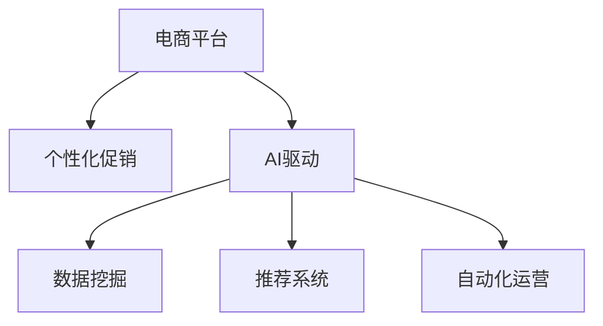

                 

# AI驱动的电商平台个性化促销策略

## 1. 背景介绍

### 1.1 问题由来
随着电子商务的迅猛发展，各大电商平台通过多元化的促销手段吸引消费者，而个性化促销策略因其高转化率、低运营成本的优势，逐渐成为电商行业的新宠。个性化促销能够根据用户的历史行为和兴趣，推送定制化的促销信息，提升用户体验和销售额。然而，传统的基于规则的促销策略无法满足复杂的用户需求，且难以高效地进行动态调整。

与此同时，人工智能（AI）技术的崛起为电商个性化促销带来了新机遇。AI通过分析用户数据，挖掘用户的潜在需求，智能推荐个性化的促销活动，实现了促销的自动化、精准化。因此，本文将深入探讨AI如何驱动电商平台个性化促销策略，提高促销效果和用户满意度。

### 1.2 问题核心关键点
本文将从以下几个关键点切入：
- 个性化促销策略的核心原理是什么？
- AI如何在电商促销中发挥作用？
- 实现AI驱动个性化促销的关键技术有哪些？
- 目前AI驱动个性化促销的主要应用场景有哪些？
- AI驱动个性化促销面临的挑战是什么？
- AI驱动个性化促销的未来趋势和研究展望。

通过回答上述问题，我们将构建出AI驱动电商平台个性化促销策略的完整框架，帮助电商平台优化促销策略，提升市场竞争力。

## 2. 核心概念与联系

### 2.1 核心概念概述

为更好地理解AI驱动电商个性化促销策略，本节将介绍几个密切相关的核心概念：

- **电商平台**：指通过互联网进行商品销售的虚拟平台，包括淘宝、京东、亚马逊等。
- **个性化促销**：根据用户的行为和兴趣，推送定制化的促销信息，如优惠券、限时折扣等，以提升用户购买意愿和销售额。
- **AI驱动**：指利用人工智能技术，特别是机器学习、深度学习等方法，分析和处理电商数据，自动生成和优化个性化促销策略。
- **数据挖掘**：通过分析用户数据，挖掘出用户的行为模式和潜在需求，为个性化促销提供数据支持。
- **推荐系统**：通过用户行为数据，推荐用户可能感兴趣的商品和促销活动，提高用户的购买意愿。
- **自动化运营**：利用AI技术，实现促销策略的自动化生成和调整，减少人工干预，提高运营效率。

这些核心概念之间的逻辑关系可以通过以下Mermaid流程图来展示：



这个流程图展示了个电商平台的个性化促销策略的核心概念及其之间的关系：

1. 电商平台通过AI驱动的方式，实现个性化促销。
2. AI驱动下，数据挖掘和推荐系统发挥了关键作用。
3. 自动化运营技术则保证了促销策略的持续优化。

这些概念共同构成了电商个性化促销策略的基础框架，使得AI能够在电商促销中发挥出更大的作用。

## 3. 核心算法原理 & 具体操作步骤

### 3.1 算法原理概述

AI驱动的电商平台个性化促销策略，其核心原理是通过数据挖掘和机器学习等技术，分析和预测用户的购买意愿，然后根据预测结果生成个性化的促销信息。具体来说，包括以下几个步骤：

1. **数据采集**：收集用户的浏览历史、购买记录、评价等信息。
2. **数据预处理**：清洗和归一化数据，构建特征向量。
3. **用户画像构建**：通过聚类、分类等技术，刻画用户的兴趣和行为特征。
4. **促销生成**：利用回归、分类等机器学习模型，预测用户的购买行为，生成个性化促销策略。
5. **效果评估**：通过A/B测试等方法，评估促销策略的效果，不断优化和调整。

### 3.2 算法步骤详解

#### 数据采集
- **用户行为数据**：包括用户的浏览记录、购买记录、评价信息等。
- **商品信息数据**：包括商品的类别、价格、库存等信息。
- **促销数据**：包括优惠券、折扣码、限时活动等信息。

#### 数据预处理
- **清洗**：去除重复、缺失、异常数据。
- **归一化**：将数据转换为标准范围，如0-1、0-100等。
- **特征提取**：将原始数据转换为模型可以处理的特征向量。

#### 用户画像构建
- **聚类**：通过K-Means、DBSCAN等算法，将用户分为不同的群体。
- **分类**：通过决策树、随机森林等算法，预测用户的行为和偏好。
- **降维**：使用PCA、LDA等技术，减少特征维度，提高模型效率。

#### 促销生成
- **回归模型**：如线性回归、岭回归等，预测用户购买概率。
- **分类模型**：如逻辑回归、SVM等，分类用户购买意愿。
- **强化学习**：通过Q-Learning等算法，优化促销策略。

#### 效果评估
- **A/B测试**：将促销策略随机分配给不同用户，评估效果差异。
- **用户反馈**：通过问卷调查、用户评价等方式，收集用户反馈，优化策略。
- **转化率分析**：计算促销带来的订单转化率，评估策略效果。

### 3.3 算法优缺点

AI驱动的电商平台个性化促销策略具有以下优点：

1. **精准度提升**：利用AI技术，能够更精准地预测用户行为和需求，生成个性化的促销信息。
2. **运营效率提高**：通过自动化运营技术，实现了促销策略的快速生成和调整，减少了人工干预。
3. **效果显著**：AI驱动的个性化促销策略在实际应用中，能够显著提升用户的购买意愿和销售额。
4. **灵活性强**：可以根据实时数据和用户反馈，动态调整促销策略，适应市场变化。

然而，该方法也存在一些局限性：

1. **数据依赖**：AI驱动策略依赖高质量、全面的用户数据，数据缺失或偏差会影响策略效果。
2. **模型复杂**：实现个性化促销需要构建复杂的数据模型，需要较高的技术门槛。
3. **用户隐私**：处理用户数据时需注意隐私保护，避免数据泄露风险。
4. **计算成本**：大规模数据处理和模型训练需要大量的计算资源。
5. **技术局限**：AI模型无法完全模拟人类行为，有时会出现误判或偏差。

尽管存在这些局限性，但就目前而言，AI驱动的个性化促销策略仍是最为高效和精准的营销手段之一。未来相关研究的方向在于如何进一步提升数据质量、优化模型性能、保护用户隐私，同时兼顾计算效率和技术可解释性。

### 3.4 算法应用领域

AI驱动的电商平台个性化促销策略，已经在多个领域得到了广泛应用，包括但不限于：

- **商品推荐**：根据用户的历史购买记录和浏览行为，推荐用户可能感兴趣的商品。
- **促销活动**：生成个性化的优惠券、限时折扣等促销活动，提升用户购买意愿。
- **价格优化**：根据市场竞争和用户反馈，动态调整商品价格。
- **库存管理**：通过用户需求预测，优化库存水平，避免断货或积压。
- **市场细分**：通过数据分析，识别不同的用户群体，实施精准的促销策略。

除了上述这些经典应用外，AI驱动的个性化促销策略还被创新性地应用于广告投放、用户流失预测、推荐系统改进等更多场景中，为电商平台提供了更多的创新空间。

## 4. 数学模型和公式 & 详细讲解 & 举例说明

### 4.1 数学模型构建

为了更好地理解AI驱动的个性化促销策略，本节将构建一个简化的数学模型。

设电商平台有 $N$ 个用户 $U=\{u_1,u_2,...,u_N\}$，每个用户有 $M$ 个特征 $F=\{f_1,f_2,...,f_M\}$，促销活动有 $K$ 种 $T=\{t_1,t_2,...,t_K\}$。设用户 $u_i$ 对促销活动 $t_k$ 的反应为 $y_{ik}$，$y_{ik} \in \{0,1\}$，表示用户是否购买了促销活动。

目标是根据用户特征 $f_{im}$ 和促销活动 $t_k$，预测用户是否购买该促销活动。我们可以使用逻辑回归模型来构建数学模型：

$$
\hat{y}_{ik} = \sigma(\eta_{ik}) = \sigma(\sum_{m=1}^M \beta_{mk}f_{im} + \gamma_k)
$$

其中 $\sigma(z) = \frac{1}{1+e^{-z}}$ 为逻辑回归的sigmoid函数，$\eta_{ik}$ 为线性回归模型的输出，$\beta_{mk}$ 和 $\gamma_k$ 为模型参数。

### 4.2 公式推导过程

在逻辑回归模型中，输入特征 $f_{im}$ 和促销活动 $t_k$ 的关系为：

$$
\eta_{ik} = \sum_{m=1}^M \beta_{mk}f_{im} + \gamma_k
$$

根据最大似然估计，我们可以通过以下公式求解模型参数：

$$
\hat{\beta}_{mk} = \frac{1}{N_k}\sum_{i=1}^{N_k}\frac{y_{ik}(f_{im}-\bar{f}_k)}{\hat{p}_{ik}(1-\hat{p}_{ik})}
$$

$$
\hat{\gamma}_k = \log \left( \frac{\sum_{i=1}^{N_k}y_{ik}}{N_k - \sum_{i=1}^{N_k}y_{ik}} \right)
$$

其中 $N_k$ 表示促销活动 $t_k$ 的样本数量，$\bar{f}_k$ 表示促销活动 $t_k$ 的用户特征均值。

### 4.3 案例分析与讲解

假设某电商平台有10000个用户，每个用户有10个特征，促销活动有5种。我们随机选取其中1000个用户，生成如下数据：

| UserID | Feature1 | Feature2 | Feature3 | ... | Promotion1 | Promotion2 | Promotion3 | Promotion4 | Promotion5 |
|--------|----------|----------|----------|------|------------|------------|------------|------------|------------|
| 1      | 0.3      | 0.4      | 0.2      | ...  | 1          | 0          | 0          | 0          | 1          |
| 2      | 0.4      | 0.3      | 0.5      | ...  | 0          | 0          | 1          | 0          | 1          |
| ...    | ...      | ...      | ...      | ...  | ...        | ...        | ...        | ...        | ...        |

设用户ID为1的用户购买了促销活动1和促销活动3，我们希望预测用户2是否购买了促销活动3。根据模型公式，我们可以计算出用户2对促销活动3的反应概率为：

$$
\hat{y}_{23} = \sigma(\eta_{23}) = \sigma(\sum_{m=1}^{10} \beta_{3m}f_{2m} + \gamma_3)
$$

假设 $\beta_{3m}$ 和 $\gamma_3$ 已经通过前1000个用户的训练数据求得，带入公式计算 $\hat{y}_{23}$ 即可得到用户2购买促销活动3的概率。

## 5. 项目实践：代码实例和详细解释说明

### 5.1 开发环境搭建

在进行项目实践前，我们需要准备好开发环境。以下是使用Python进行PyTorch开发的环境配置流程：

1. 安装Anaconda：从官网下载并安装Anaconda，用于创建独立的Python环境。

2. 创建并激活虚拟环境：
```bash
conda create -n pytorch-env python=3.8 
conda activate pytorch-env
```

3. 安装PyTorch：根据CUDA版本，从官网获取对应的安装命令。例如：
```bash
conda install pytorch torchvision torchaudio cudatoolkit=11.1 -c pytorch -c conda-forge
```

4. 安装pandas、numpy、scikit-learn等各类工具包：
```bash
pip install pandas numpy scikit-learn matplotlib tqdm jupyter notebook ipython
```

完成上述步骤后，即可在`pytorch-env`环境中开始项目实践。

### 5.2 源代码详细实现

下面以一个简单的AI驱动电商促销策略为例，给出使用PyTorch和Scikit-learn进行开发的代码实现。

```python
import pandas as pd
import numpy as np
from sklearn.model_selection import train_test_split
from sklearn.linear_model import LogisticRegression
from sklearn.metrics import accuracy_score

# 数据读取
data = pd.read_csv('user_promotion_data.csv')

# 数据预处理
features = data.drop(['UserID', 'Promotion'], axis=1)
labels = data['Promotion']
X_train, X_test, y_train, y_test = train_test_split(features, labels, test_size=0.2, random_state=42)

# 构建逻辑回归模型
model = LogisticRegression(solver='liblinear', C=1.0)

# 训练模型
model.fit(X_train, y_train)

# 预测并评估模型
y_pred = model.predict(X_test)
accuracy = accuracy_score(y_test, y_pred)
print(f'Accuracy: {accuracy:.2f}')
```

### 5.3 代码解读与分析

让我们再详细解读一下关键代码的实现细节：

**数据读取和预处理**：
- 使用pandas读取CSV格式的数据集。
- 使用Scikit-learn的train_test_split方法进行数据划分，构建训练集和测试集。

**模型构建和训练**：
- 使用Scikit-learn的LogisticRegression模型，设置超参数。
- 通过fit方法训练模型，使用训练集数据进行拟合。

**模型预测和评估**：
- 使用predict方法对测试集进行预测，得到预测结果。
- 使用accuracy_score方法计算预测结果与真实标签之间的准确率。

## 6. 实际应用场景

### 6.1 智能客服
智能客服是AI驱动电商促销策略的重要应用场景之一。智能客服系统可以自动解答用户咨询，提供个性化的购物建议，提升用户体验。

在实际应用中，智能客服系统可以通过分析用户的历史行为和兴趣，生成个性化的促销信息。例如，用户在某商品页面停留时间较长，但没有进行购买，智能客服系统可以根据用户的行为特征，推荐用户购买该商品，并提供相应的优惠券或限时折扣。

### 6.2 个性化推荐
个性化推荐系统通过分析用户的历史行为和兴趣，推荐用户可能感兴趣的商品和促销活动，提高用户的购买意愿。

例如，用户经常浏览运动类商品，但没有进行购买。推荐系统可以根据用户的行为数据，预测用户对某运动鞋的购买意愿，生成相应的优惠券，吸引用户进行购买。

### 6.3 动态定价
动态定价系统可以根据市场需求和用户行为，动态调整商品价格，提升销售效果。

例如，某一商品库存紧张，动态定价系统可以根据用户的购买意愿，提高该商品的价格，吸引用户进行购买。

## 7. 工具和资源推荐

### 7.1 学习资源推荐

为了帮助开发者系统掌握AI驱动电商促销策略的理论基础和实践技巧，这里推荐一些优质的学习资源：

1. **《Python机器学习》**：通过这本书，可以系统学习机器学习的基本概念和算法，如线性回归、逻辑回归、决策树等，为理解AI驱动促销策略打下基础。

2. **Kaggle竞赛**：Kaggle是一个数据科学竞赛平台，通过参加相关的促销策略竞赛，可以实践机器学习算法，积累实战经验。

3. **Coursera课程**：Coursera提供了多门机器学习相关的课程，如《机器学习》、《深度学习》等，通过在线学习，可以深入理解机器学习算法的原理和应用。

4. **GitHub代码库**：GitHub是一个开源代码库，可以通过搜索相关的AI驱动促销策略项目，学习他人的实现方法和经验。

5. **AI驱动促销策略论文**：通过阅读相关领域的论文，可以了解最新的研究方向和技术进展。

### 7.2 开发工具推荐

高效的开发离不开优秀的工具支持。以下是几款用于AI驱动电商促销策略开发的常用工具：

1. **Jupyter Notebook**：Jupyter Notebook是一个交互式的开发环境，支持Python、R等多种编程语言，适合进行数据分析和模型训练。

2. **PyTorch**：基于Python的开源深度学习框架，灵活动态的计算图，适合快速迭代研究。

3. **Scikit-learn**：一个基于Python的机器学习库，提供了丰富的模型算法，包括回归、分类、聚类等，适合进行数据挖掘和模型训练。

4. **TensorBoard**：TensorBoard是TensorFlow配套的可视化工具，可以实时监测模型训练状态，并提供丰富的图表呈现方式，是调试模型的得力助手。

5. **AWS SageMaker**：AWS SageMaker是一个云端的机器学习平台，提供自动化的模型训练和部署功能，适合进行大规模模型训练和应用。

### 7.3 相关论文推荐

AI驱动的电商促销策略的发展源于学界的持续研究。以下是几篇奠基性的相关论文，推荐阅读：

1. **《个性化推荐系统：算法与实现》**：介绍了个性化推荐系统的基本原理和实现方法，为理解AI驱动促销策略提供了理论支持。

2. **《基于深度学习的电商个性化推荐系统》**：使用深度学习模型，对电商用户的浏览和购买行为进行建模，生成个性化推荐。

3. **《强化学习在电商促销中的应用》**：探讨了强化学习在电商促销策略中的作用，通过模拟用户行为，优化促销效果。

4. **《基于协同过滤的电商推荐系统》**：使用协同过滤算法，分析用户和商品之间的关系，生成个性化推荐。

5. **《电商促销策略的优化》**：通过实验对比，评估了不同促销策略的效果，为优化电商促销提供了实践经验。

这些论文代表了大数据和人工智能在电商促销领域的最新研究成果，通过学习这些前沿成果，可以帮助研究者把握学科前进方向，激发更多的创新灵感。

## 8. 总结：未来发展趋势与挑战

### 8.1 总结

本文对AI驱动的电商平台个性化促销策略进行了全面系统的介绍。首先阐述了AI驱动促销策略的核心原理和应用场景，明确了AI在电商促销中的重要性和价值。其次，从数据挖掘、推荐系统、自动化运营等技术角度，详细讲解了AI驱动促销策略的实现过程。同时，本文还探讨了AI驱动促销策略在智能客服、个性化推荐、动态定价等多个领域的应用前景，展示了其广阔的发展空间。此外，本文精选了AI驱动促销策略的学习资源和工具推荐，力求为读者提供全方位的技术指引。

通过本文的系统梳理，可以看到，AI驱动的个性化促销策略正在成为电商平台优化促销策略的重要手段，极大地提升了用户的购买意愿和销售额。未来，伴随AI技术的发展和应用场景的拓展，AI驱动促销策略必将在电商行业中扮演越来越重要的角色。

### 8.2 未来发展趋势

展望未来，AI驱动的电商平台个性化促销策略将呈现以下几个发展趋势：

1. **数据多样性提升**：AI驱动策略将更多地利用多模态数据，如文本、图片、音频等，增强用户画像的全面性和准确性。
2. **算法优化**：通过引入深度学习、强化学习等技术，优化推荐系统和促销策略，提高用户满意度和转化率。
3. **实时性增强**：通过实时数据处理和动态调整，实现个性化促销策略的快速生成和优化，适应市场变化。
4. **跨平台协同**：实现不同电商平台之间的数据共享和策略协同，提升整体促销效果。
5. **用户隐私保护**：在数据处理和策略生成过程中，注重用户隐私保护，确保数据安全。
6. **自动化管理**：通过自动化管理平台，实现促销策略的自动化生成、调整和监控，提高运营效率。

以上趋势凸显了AI驱动电商促销策略的广阔前景。这些方向的探索发展，必将进一步提升电商平台的市场竞争力，带来更多的用户和收益。

### 8.3 面临的挑战

尽管AI驱动的电商促销策略已经取得了显著成果，但在实际应用中仍面临以下挑战：

1. **数据质量**：电商数据质量参差不齐，数据缺失、噪声等问题会影响策略效果。
2. **模型复杂度**：实现高精度的推荐和促销策略需要构建复杂的算法模型，需要较高的技术门槛。
3. **用户隐私**：在数据处理和策略生成过程中，需注意用户隐私保护，避免数据泄露风险。
4. **计算成本**：大规模数据处理和模型训练需要大量的计算资源。
5. **技术可解释性**：AI模型往往是"黑盒"系统，难以解释其内部工作机制和决策逻辑。

尽管存在这些挑战，但通过不断优化算法、改进数据处理、保护用户隐私，AI驱动的电商促销策略必将在电商行业中发挥更大的作用。未来相关研究的方向在于如何进一步提升数据质量、优化模型性能、保护用户隐私，同时兼顾计算效率和技术可解释性。

### 8.4 研究展望

面对AI驱动电商促销策略面临的挑战，未来的研究需要在以下几个方面寻求新的突破：

1. **多模态数据融合**：探索如何融合文本、图片、音频等多模态数据，增强用户画像的全面性和准确性。
2. **实时数据处理**：研究如何实时处理用户数据，动态生成和调整个性化促销策略。
3. **用户隐私保护**：开发隐私保护算法，确保用户数据在处理和传输过程中的安全性。
4. **计算资源优化**：研究如何优化计算资源，提升模型训练和推理的效率。
5. **算法可解释性**：探索如何增强AI模型的可解释性，提供用户和决策者信任的基础。
6. **跨平台协同**：研究如何实现不同电商平台之间的数据共享和策略协同，提升整体促销效果。

这些研究方向将引领AI驱动电商促销策略的持续进步，为电商平台提供更精准、高效的促销解决方案，带来更多的市场机会。

## 9. 附录：常见问题与解答

**Q1：AI驱动的促销策略是否适用于所有电商平台？**

A: AI驱动的促销策略可以应用于大多数电商平台，特别是数据量较大、用户行为数据较丰富的平台。对于数据量较小的平台，由于数据质量问题，效果可能不尽如人意。

**Q2：如何选择适合电商平台的AI驱动促销策略？**

A: 选择适合的AI驱动促销策略需要考虑电商平台的规模、数据特点、用户行为等多种因素。一般而言，数据量较大、用户行为较为复杂的平台，适合使用深度学习模型进行推荐和促销生成。而对于数据量较小、用户行为较为简单的平台，可以考虑使用逻辑回归、决策树等传统机器学习模型。

**Q3：AI驱动的促销策略是否会影响用户隐私？**

A: 在数据处理和策略生成过程中，需注意用户隐私保护，确保数据安全。一般而言，可以采用数据匿名化、加密传输等技术，保护用户隐私。

**Q4：AI驱动的促销策略在实际应用中是否会带来负面影响？**

A: 在实际应用中，AI驱动的促销策略需注意避免过度促销和误导用户，导致用户反感和投诉。可以通过设置合理的促销频率和阈值，平衡促销效果和用户满意度。

**Q5：AI驱动的促销策略未来有哪些发展方向？**

A: AI驱动的促销策略未来的发展方向包括：多模态数据融合、实时数据处理、用户隐私保护、计算资源优化、算法可解释性等。通过不断优化算法、改进数据处理、保护用户隐私，AI驱动的电商促销策略必将在电商行业中发挥更大的作用。

---

作者：禅与计算机程序设计艺术 / Zen and the Art of Computer Programming

