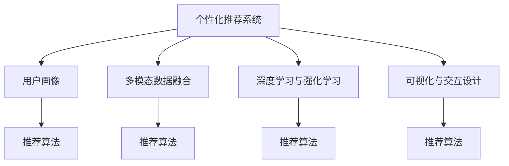

                 

# AI驱动的电商平台个性化首页设计与优化

## 1. 背景介绍

### 1.1 问题由来
在数字化转型的浪潮中，电商平台已成为连接商家与消费者的重要桥梁。然而，传统的“一刀切”的首页展示方式已无法满足用户多样化的需求。个性化首页设计的初衷是通过精准匹配用户兴趣，提供更加贴合用户需求的内容推荐，提升用户满意度和平台转化率。

随着大数据和AI技术的兴起，个性化首页设计成为电商平台运营的重要手段之一。智能推荐系统通过对用户行为数据的分析，学习用户兴趣特征，并动态调整首页内容，实现真正的“一人一首页”。然而，在技术实现上，这一目标面临着诸多挑战，如推荐算法性能、推荐内容的多样性、用户的参与度等。

### 1.2 问题核心关键点
基于此，本文聚焦于如何利用AI技术设计出高性能、高效率、高粘性的电商平台个性化首页，力求通过技术创新提升用户体验和平台转化率。具体来说，本文将重点探讨以下几个问题：

1. **推荐算法的选择与优化**：如何根据平台特性和用户需求，选择合适的推荐算法，并针对性地进行优化。
2. **用户行为数据的处理与分析**：如何高效处理用户行为数据，挖掘出用户的兴趣特征，形成用户画像。
3. **推荐内容的多样性与相关性**：如何在个性化推荐的同时，保证推荐内容的多样性，提升用户点击率和满意度。
4. **用户参与度的提升与维护**：如何设计互动元素，提升用户对个性化首页的粘性，并维持其长期使用。
5. **技术框架的搭建与优化**：如何将推荐算法、数据处理、用户交互等技术组件有机整合，形成一个高效的个性化首页技术框架。

### 1.3 问题研究意义
在当前电商竞争激烈的背景下，个性化首页设计不仅能显著提升用户体验，还能增强用户粘性，提升平台转化率。通过AI技术的深度应用，可以最大化地发挥数据的价值，实现用户的精准匹配，从而在竞争中脱颖而出。因此，深入研究和优化个性化首页设计，对于电商平台来说具有重要的战略意义。

## 2. 核心概念与联系

### 2.1 核心概念概述

在探讨个性化首页设计时，需要明确几个核心概念及其相互关系：

- **个性化推荐系统**：通过分析用户行为数据，学习用户兴趣特征，并根据这些特征为用户推荐可能感兴趣的内容的系统。
- **用户画像**：基于用户行为数据和交互信息，形成用户兴趣、行为、偏好等方面的全面描述。
- **多模态数据融合**：结合文本、图像、视频等多种形式的数据，提升推荐系统的全面性和准确性。
- **深度学习与强化学习**：通过深度神经网络模型和强化学习算法，不断优化推荐算法，提升推荐效果。
- **可视化与交互设计**：利用图形化界面和多模态交互元素，提升用户的使用体验和满意度。

这些概念之间的联系可以通过以下Mermaid流程图来展示：



这个流程图展示了个性化首页设计的核心概念及其相互关系：

1. 个性化推荐系统通过多模态数据融合和深度学习算法，形成用户画像。
2. 用户画像和推荐算法相互影响，共同决定推荐内容的生成。
3. 深度学习与强化学习不断优化推荐算法，提升推荐效果。
4. 可视化与交互设计提升用户体验，增加用户粘性。

这些概念共同构成了个性化首页设计的技术框架，使得推荐系统能够更加智能、全面、高效地服务于用户。

## 3. 核心算法原理 & 具体操作步骤
### 3.1 算法原理概述

个性化推荐系统设计依赖于多种算法和技术手段，核心原理可以概括为：

1. **协同过滤算法**：通过分析用户行为数据，寻找与目标用户兴趣相似的用户，并推荐这些用户喜欢的物品。
2. **基于内容的推荐算法**：分析物品的特征，如类别、属性、描述等，找到与目标用户兴趣相关的物品。
3. **深度学习推荐算法**：使用深度神经网络模型，学习用户和物品的隐含表示，预测用户对物品的兴趣。
4. **强化学习推荐算法**：通过奖励机制和反馈信息，不断优化推荐策略，提升推荐效果。

这些算法通过不同的方式，对用户兴趣进行建模和预测，并动态调整推荐内容，提升用户满意度。

### 3.2 算法步骤详解

以下是构建个性化推荐系统的主要步骤：

1. **数据采集与预处理**：
   - 收集用户行为数据，如浏览记录、购买记录、搜索历史等。
   - 对数据进行清洗、去重、归一化等预处理操作，保证数据质量。

2. **用户画像建模**：
   - 基于用户行为数据，使用协同过滤算法或深度学习算法，学习用户兴趣特征，形成用户画像。
   - 用户画像通常包含用户的兴趣、行为偏好、历史互动等综合信息。

3. **推荐内容生成**：
   - 根据用户画像和推荐算法，生成个性化推荐列表。
   - 推荐内容可以包括商品、广告、活动等。

4. **动态调整与反馈机制**：
   - 实时监测用户对推荐内容的反馈，如点击率、购买率等。
   - 根据反馈信息，动态调整推荐算法和推荐内容，提升推荐效果。

5. **技术架构搭建与优化**：
   - 设计推荐系统架构，包括数据存储、处理、计算等组件。
   - 采用分布式计算、负载均衡等技术，提升系统性能和稳定性。

### 3.3 算法优缺点

个性化推荐系统的优势包括：

1. **提升用户体验**：通过精准匹配用户兴趣，推荐更加贴合用户需求的内容。
2. **增加用户粘性**：个性化首页设计增强了用户的参与度和满意度，提升了用户留存率。
3. **提升转化率**：推荐内容能够有效刺激用户购买，增加平台收益。

同时，个性化推荐系统也存在以下局限：

1. **数据隐私与安全问题**：用户行为数据的收集和处理涉及隐私和安全问题，需严格遵守数据保护法规。
2. **推荐冷启动问题**：新用户没有足够的历史数据，难以进行有效的推荐。
3. **推荐内容多样性问题**：过度个性化可能导致推荐内容同质化，降低用户体验。

### 3.4 算法应用领域

个性化推荐系统在电商、新闻、社交网络等领域有广泛应用。例如：

1. **电商推荐**：为每个用户推荐可能感兴趣的商品，提升购买转化率。
2. **新闻推荐**：根据用户阅读习惯，推荐新闻文章，提升用户点击率。
3. **社交推荐**：根据用户社交行为，推荐可能感兴趣的朋友或内容，提升平台活跃度。

## 4. 数学模型和公式 & 详细讲解
### 4.1 数学模型构建

推荐系统的数学模型主要基于用户兴趣与物品特征之间的相似度计算，常见模型包括：

- **协同过滤模型**：使用用户-物品评分矩阵，计算用户和物品之间的相似度。
- **基于内容的推荐模型**：分析物品的特征，构建物品-特征矩阵，计算用户对物品的兴趣。
- **深度学习推荐模型**：使用神经网络学习用户和物品的隐含表示，预测用户对物品的评分。

以协同过滤算法为例，推荐系统的主要目标是通过相似度计算，找到与目标用户兴趣相似的用户，并推荐这些用户喜欢的物品。常用的相似度计算方法包括：

- **余弦相似度**：计算用户-物品评分矩阵中的相似度值。
- **皮尔逊相关系数**：计算用户和物品之间的相关性。
- **欧氏距离**：计算用户和物品之间的距离。

### 4.2 公式推导过程

以余弦相似度为例，其计算公式为：

$$
similarity(u, i) = \cos(\theta) = \frac{\mathbf{u} \cdot \mathbf{i}}{\|\mathbf{u}\|_2 \|\mathbf{i}\|_2}
$$

其中，$\mathbf{u}$ 和 $\mathbf{i}$ 分别表示用户和物品的评分向量，$\|\cdot\|_2$ 表示向量的欧几里得范数。

对于基于内容的推荐模型，其目标是根据物品的特征向量，预测用户对物品的评分。设物品的特征向量为 $\mathbf{f_i}$，用户的特征向量为 $\mathbf{u}$，推荐模型为 $F$，则预测用户对物品 $i$ 的评分为：

$$
\hat{r}_{ui} = F(\mathbf{u}, \mathbf{f_i})
$$

常用的推荐模型包括：

- **线性模型**：$\hat{r}_{ui} = \mathbf{w} \cdot (\mathbf{u} \odot \mathbf{f_i}) + b$
- **神经网络模型**：$\hat{r}_{ui} = \sigma(W \cdot (\mathbf{u} \odot \mathbf{f_i}) + b)$

其中，$\odot$ 表示向量点乘，$W$ 和 $b$ 为模型参数，$\sigma$ 为激活函数。

### 4.3 案例分析与讲解

以电商推荐系统为例，假设用户 $u$ 对物品 $i$ 的评分向量为 $\mathbf{u}$，物品 $i$ 的特征向量为 $\mathbf{f_i}$。基于协同过滤的推荐模型，推荐系统首先计算用户 $u$ 与物品 $i$ 的相似度 $similarity(u,i)$，然后根据相似度排序，选择与用户兴趣相似的物品推荐给用户。例如，对于电商网站，可以根据用户浏览历史、购买历史等行为数据，学习用户画像，并结合商品属性、类别等信息，动态调整推荐列表，实现个性化推荐。

## 5. 项目实践：代码实例和详细解释说明
### 5.1 开发环境搭建

构建个性化首页的开发环境需要以下工具：

1. **Python 3**：推荐系统通常使用 Python 进行开发，支持常用的科学计算库和机器学习库。
2. **Scikit-learn**：用于数据处理和特征工程。
3. **TensorFlow 或 PyTorch**：用于深度学习模型的实现和训练。
4. **Flask 或 Django**：用于构建推荐系统的 Web 应用接口。
5. **Redis 或 Elasticsearch**：用于存储用户行为数据和推荐结果。

### 5.2 源代码详细实现

以下是一个使用 PyTorch 和 TensorFlow 构建电商推荐系统的代码示例：

```python
import torch
import torch.nn as nn
import torch.optim as optim
import tensorflow as tf

# 定义深度学习推荐模型
class RecommenderNet(nn.Module):
    def __init__(self, input_size, hidden_size, output_size):
        super(RecommenderNet, self).__init__()
        self.fc1 = nn.Linear(input_size, hidden_size)
        self.fc2 = nn.Linear(hidden_size, output_size)
        self.activation = nn.ReLU()
    
    def forward(self, x):
        x = self.fc1(x)
        x = self.activation(x)
        x = self.fc2(x)
        return x

# 加载用户行为数据
user_behavior = pd.read_csv('user_behavior.csv')
user_past = user_behavior[['item_id', 'timestamp']]
item_features = pd.read_csv('item_features.csv')

# 构建用户画像
user_past = user_past.pivot(index='user_id', columns='timestamp', values='item_id')
user_past = user_past.fillna(0)
user_past = user_past.sum()

# 构建物品特征矩阵
item_features = item_features.pivot(index='item_id', columns='feature_name', values='value')

# 训练推荐模型
model = RecommenderNet(len(user_past.columns), 64, len(item_features.columns))
optimizer = optim.Adam(model.parameters(), lr=0.01)
criterion = nn.MSELoss()

for epoch in range(10):
    optimizer.zero_grad()
    output = model(user_past)
    loss = criterion(output, target)
    loss.backward()
    optimizer.step()

# 推荐新物品
user_new = pd.read_csv('user_new.csv')
user_new_past = user_new.pivot(index='user_id', columns='timestamp', values='item_id')
user_new_past = user_new_past.fillna(0)
user_new_past = user_new_past.sum()

recommender = RecommenderNet(len(user_new_past.columns), 64, len(item_features.columns))
recommender.load_state_dict(torch.load('model.pth'))

# 构建推荐列表
recommender.eval()
with torch.no_grad():
    recommended_items = recommender(user_new_past)

# 可视化推荐结果
display(recommended_items)
```

### 5.3 代码解读与分析

上述代码实现了基于深度学习模型的电商推荐系统，主要包含以下几个步骤：

1. **数据加载与预处理**：从 CSV 文件中加载用户行为数据和物品特征数据，并进行预处理操作，如归一化、缺失值填充、矩阵转换等。
2. **模型定义与训练**：定义深度学习推荐模型，并使用用户行为数据进行训练，优化模型参数。
3. **模型加载与推荐**：加载训练好的模型，根据新用户的浏览历史，生成推荐列表。
4. **结果可视化**：使用可视化工具展示推荐结果，方便查看和分析。

### 5.4 运行结果展示

运行上述代码后，推荐系统将根据用户的新行为数据，生成个性化的推荐列表，并在可视化界面中展示。用户可以通过点击推荐列表中的商品，进入商品详情页面，进行进一步的互动操作。

## 6. 实际应用场景

### 6.1 智能客服系统

个性化首页设计在智能客服系统中也有广泛应用。智能客服系统通过分析用户的历史对话记录和行为数据，生成个性化的交互内容，提升用户体验和问题解决效率。例如，电商平台可以通过个性化首页推荐商品，引导用户购买，同时提供智能客服解答常见问题，提升用户满意度。

### 6.2 金融推荐系统

金融推荐系统是另一个典型应用场景。金融平台可以通过个性化首页推荐投资产品、理财方案等，帮助用户制定个性化的金融规划。同时，智能客服系统可以解答用户关于金融产品的疑问，提供专业的投资建议。

### 6.3 医疗推荐系统

医疗平台可以通过个性化首页推荐医生、药品、诊疗方案等，帮助患者选择合适的医疗资源。智能客服系统可以解答患者的疑问，提供医疗建议，提升患者满意度。

## 7. 工具和资源推荐
### 7.1 学习资源推荐

为了深入学习和掌握个性化首页设计的技术，推荐以下学习资源：

1. **《推荐系统实战》一书**：详细介绍了推荐系统的基本原理和实现方法，包含深度学习推荐系统、协同过滤算法等。
2. **Coursera 的《Recommender Systems》课程**：由斯坦福大学教授主讲，涵盖推荐系统的理论基础和实践技巧。
3. **Kaggle 的推荐系统竞赛**：通过实际数据集竞赛，学习推荐系统的设计思路和优化方法。

### 7.2 开发工具推荐

推荐系统开发常用的工具包括：

1. **TensorFlow 或 PyTorch**：用于深度学习模型的实现和训练。
2. **Scikit-learn**：用于数据处理和特征工程。
3. **Spark**：用于分布式计算和大规模数据处理。
4. **Elasticsearch**：用于存储和检索大规模用户行为数据。
5. **Jupyter Notebook**：用于数据探索和模型调试。

### 7.3 相关论文推荐

推荐系统相关的经典论文包括：

1. **《The Bellkinaussian Collaborative Filtering Model》**：提出了协同过滤算法的经典模型，至今仍被广泛应用。
2. **《Matrix Factorization Techniques for Recommender Systems》**：介绍了矩阵分解等常用的推荐系统方法。
3. **《Deep Neural Networks for Recommender Systems: A Review and New Perspectives》**：总结了深度学习在推荐系统中的应用，提出了新的推荐模型。

## 8. 总结：未来发展趋势与挑战
### 8.1 研究成果总结

本文介绍了个性化推荐系统在电商平台中的应用，并详细探讨了推荐算法的设计和优化。通过数据处理、深度学习、强化学习等技术手段，实现了精准的个性化推荐。

### 8.2 未来发展趋势

未来个性化推荐系统将呈现以下发展趋势：

1. **推荐模型的多样化**：除了深度学习，更多基于规则和知识图谱的推荐模型将被引入，提升推荐系统的全面性和可靠性。
2. **数据的多模态融合**：结合图像、视频、文本等多种形式的数据，提升推荐系统的准确性和多样性。
3. **推荐系统的实时化**：通过实时数据分析和机器学习模型，动态调整推荐内容，提升用户体验。
4. **推荐系统的个性化**：更细粒度的用户画像和推荐模型将带来更个性化的推荐效果。
5. **推荐系统的可解释性**：推荐系统的决策过程将更加透明和可解释，提升用户信任度。

### 8.3 面临的挑战

个性化推荐系统面临以下挑战：

1. **数据隐私问题**：用户行为数据的收集和处理涉及隐私和安全问题，需严格遵守数据保护法规。
2. **推荐冷启动问题**：新用户没有足够的历史数据，难以进行有效的推荐。
3. **推荐内容的多样性问题**：过度个性化可能导致推荐内容同质化，降低用户体验。
4. **推荐系统的实时性问题**：实时推荐系统需要高效的数据处理和算法优化，提升系统性能。
5. **推荐系统的可解释性问题**：推荐系统的决策过程需要透明和可解释，提升用户信任度。

### 8.4 研究展望

未来推荐系统的发展方向包括：

1. **推荐模型的解释性增强**：通过可解释性技术，如注意力机制、规则化等，提升推荐系统的透明性和可解释性。
2. **多模态数据融合技术**：结合图像、视频、文本等多种形式的数据，提升推荐系统的全面性和准确性。
3. **推荐系统的实时化**：通过实时数据分析和机器学习模型，动态调整推荐内容，提升用户体验。
4. **推荐系统的冷启动技术**：通过社交网络、兴趣调查等方式，获取新用户的兴趣信息，提升推荐效果。
5. **推荐系统的隐私保护**：通过数据匿名化、差分隐私等技术，保护用户隐私，提升数据安全性。

## 9. 附录：常见问题与解答

**Q1：如何优化推荐算法性能？**

A: 推荐算法性能优化可以从以下几个方面入手：
1. **数据质量提升**：清洗、归一化、去重等预处理操作可以提升数据质量，降低模型误差。
2. **模型参数优化**：使用正则化、Dropout、学习率调优等技术，提升模型泛化能力。
3. **模型结构优化**：使用更先进的神经网络结构，如Transformer、Graph Network等，提升模型效果。
4. **特征工程改进**：通过特征选择、特征融合等技术，提升特征的有效性。

**Q2：如何设计多模态推荐系统？**

A: 多模态推荐系统设计需要考虑以下几点：
1. **数据融合技术**：通过特征拼接、加权融合等技术，将不同模态的数据融合到推荐模型中。
2. **模型架构设计**：设计多模态神经网络模型，将图像、文本、音频等多种形式的数据作为输入，生成综合推荐结果。
3. **推荐策略优化**：设计多模态推荐策略，如基于内容的推荐、协同过滤推荐、深度学习推荐等，提升推荐效果。

**Q3：如何提升推荐系统的实时性？**

A: 提升推荐系统的实时性需要从以下几个方面入手：
1. **数据流处理**：使用实时数据流处理技术，如Kafka、Spark Streaming等，保证数据实时更新。
2. **分布式计算**：使用分布式计算框架，如Hadoop、Spark等，提升计算性能。
3. **算法优化**：使用高效的数据处理算法和模型优化技术，提升算法效率。
4. **缓存技术**：使用缓存技术，如Redis、Memcached等，减少重复计算和数据查询。

**Q4：如何设计推荐系统的可视化界面？**

A: 推荐系统的可视化界面设计需要考虑以下几点：
1. **简洁直观**：界面设计应简洁直观，易于用户操作。
2. **交互性强**：通过互动元素，如悬浮窗口、多选模式等，增强用户互动。
3. **反馈机制**：根据用户反馈，动态调整推荐内容，提升用户体验。
4. **个性化推荐**：根据用户行为数据，动态生成个性化推荐内容，提升用户满意度。

**Q5：如何设计推荐系统的冷启动策略？**

A: 推荐系统的冷启动策略可以采用以下几种方法：
1. **用户画像构建**：通过兴趣调查、社交网络等方式，获取新用户的兴趣信息。
2. **推荐策略调整**：调整推荐策略，推荐通用性较强的商品或内容，帮助新用户快速建立兴趣。
3. **数据关联学习**：通过关联学习，将新用户的数据与相似用户的数据关联，提升推荐效果。
4. **模型优化**：优化推荐模型，引入迁移学习、零样本学习等技术，提升推荐效果。

---

作者：禅与计算机程序设计艺术 / Zen and the Art of Computer Programming

