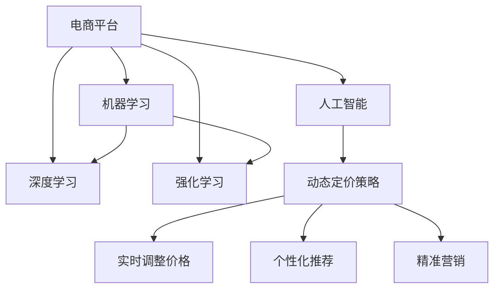

                 

## 1. 背景介绍

在快速变化的市场环境中，电商平台必须能够实时调整其定价策略，以最大化销售量和利润。传统静态定价策略难以适应需求波动，价格灵活性不足，影响客户满意度和竞争力。近年来，随着人工智能技术的飞速发展，电商平台开始利用AI驱动的动态定价策略，实现实时调整价格、个性化推荐和精准营销。本文将深入探讨AI驱动的电商平台动态定价策略优化，包括理论基础、核心算法、实践方法等，为电商企业提供参考。

## 2. 核心概念与联系

### 2.1 核心概念概述

为更好地理解AI驱动的电商平台动态定价策略优化，本节将介绍几个密切相关的核心概念：

- **动态定价策略(Dynamic Pricing Strategy)**：指根据市场需求变化，实时调整商品价格的策略。动态定价策略能够有效提高销售量和利润率，降低库存积压，提升客户满意度。

- **人工智能(Artificial Intelligence, AI)**：利用计算机模拟人类智能过程，通过算法和模型自动完成特定任务。AI技术在数据分析、预测、优化等方面具有显著优势。

- **电商平台(E-commerce Platform)**：指通过互联网平台提供商品交易、在线支付、物流配送等服务的商业模型。电商平台利用AI技术，提升运营效率和客户体验。

- **机器学习(Machine Learning, ML)**：AI的一个分支，通过数据驱动的方法，使机器能够从经验中学习，并进行预测、分类、聚类等任务。机器学习算法在电商动态定价中起到了关键作用。

- **深度学习(Deep Learning, DL)**：机器学习的一个高级分支，利用神经网络模拟人脑结构，能够处理更加复杂的数据和任务。深度学习在电商动态定价中的应用主要体现在高级模型如神经网络、卷积神经网络(CNN)、循环神经网络(RNN)等。

- **强化学习(Reinforcement Learning, RL)**：通过智能体与环境的交互，不断优化策略，使得智能体在给定状态下能够最大化累计奖励。强化学习在电商动态定价中的主要应用是自动定价优化。

这些核心概念之间的逻辑关系可以通过以下Mermaid流程图来展示：



这个流程图展示了电商平台利用AI技术提升动态定价策略的逻辑流程：

1. 电商平台应用AI技术，通过机器学习、深度学习和强化学习等方法，分析和预测市场需求。
2. 基于预测结果，生成动态定价策略，实时调整商品价格。
3. 利用AI算法，实现个性化推荐和精准营销，提升客户满意度和转化率。

## 3. 核心算法原理 & 具体操作步骤
### 3.1 算法原理概述

AI驱动的电商平台动态定价策略优化，核心在于利用机器学习、深度学习和强化学习等算法，实时分析和预测市场需求，生成动态定价策略。其核心思想是：将电商平台视为一个复杂系统，通过AI算法实时分析市场动态、用户行为和竞争环境，动态调整商品价格，以最大化销售量和利润率。

具体来说，动态定价策略优化过程分为以下几个步骤：

1. **数据收集**：收集电商平台的销售数据、用户行为数据、市场趋势数据、竞争环境数据等。
2. **需求预测**：利用机器学习算法，如回归分析、时间序列分析、随机森林等，预测未来的销售量和价格敏感度。
3. **定价模型训练**：构建定价模型，使用深度学习算法，如神经网络、卷积神经网络等，优化价格预测和定价策略。
4. **动态定价**：根据需求预测和定价模型，实时调整商品价格，实现动态定价。
5. **优化与迭代**：利用强化学习算法，如Q-learning、SARSA等，不断优化定价策略，提高销售量和利润率。

### 3.2 算法步骤详解

以下是AI驱动的电商平台动态定价策略优化的详细步骤：

#### 3.2.1 数据收集

电商平台需要收集以下关键数据：

- **销售数据**：包括历史销售量、销售价格、库存量等。
- **用户行为数据**：包括用户点击量、浏览量、购买行为、评价反馈等。
- **市场趋势数据**：包括节假日、季节性变化、市场趋势等。
- **竞争环境数据**：包括竞争对手的价格、促销活动、市场份额等。

#### 3.2.2 需求预测

利用机器学习算法对上述数据进行分析，预测未来的销售量和价格敏感度。具体步骤如下：

1. **数据清洗**：去除异常值和缺失值，确保数据质量。
2. **特征工程**：选择和构造有意义的特征，如时间特征、趋势特征、季节性特征等。
3. **模型选择**：选择合适的机器学习算法，如线性回归、随机森林、梯度提升树等。
4. **模型训练**：使用历史数据对模型进行训练，确保模型准确性。
5. **结果验证**：在测试集上验证模型效果，确保模型泛化能力。

#### 3.2.3 定价模型训练

构建定价模型，使用深度学习算法优化价格预测和定价策略。具体步骤如下：

1. **数据准备**：将历史销售数据、用户行为数据、市场趋势数据等作为输入，构建输入数据集。
2. **模型选择**：选择合适的深度学习模型，如多层感知器(MLP)、卷积神经网络(CNN)、循环神经网络(RNN)等。
3. **模型训练**：使用历史数据对模型进行训练，确保模型准确性。
4. **结果验证**：在测试集上验证模型效果，确保模型泛化能力。
5. **参数调整**：根据模型效果，调整模型参数，如学习率、批次大小、迭代轮数等。

#### 3.2.4 动态定价

根据需求预测和定价模型，实时调整商品价格，实现动态定价。具体步骤如下：

1. **实时数据获取**：实时获取销售数据、用户行为数据、市场趋势数据等。
2. **价格调整**：根据需求预测和定价模型，实时调整商品价格。
3. **价格监控**：监控价格调整效果，确保价格策略的有效性。

#### 3.2.5 优化与迭代

利用强化学习算法，不断优化定价策略，提高销售量和利润率。具体步骤如下：

1. **策略定义**：定义策略函数，根据市场动态和用户行为，生成定价策略。
2. **智能体训练**：训练智能体，使其能够在给定状态下最大化累计奖励。
3. **策略评估**：评估智能体的表现，选择最优策略。
4. **策略应用**：应用最优策略，调整商品价格。
5. **策略迭代**：不断优化和迭代策略，提升定价效果。

### 3.3 算法优缺点

AI驱动的电商平台动态定价策略优化具有以下优点：

1. **实时性**：能够实时分析市场需求，快速调整价格，提升销售量和利润率。
2. **个性化**：能够根据用户行为和偏好，生成个性化的价格策略，提高客户满意度和忠诚度。
3. **精准性**：利用深度学习算法，提高价格预测的准确性，优化定价策略。
4. **可扩展性**：适用于多种商品和市场环境，具有较强的扩展性和适应性。

同时，该方法也存在以下缺点：

1. **数据依赖性**：依赖高质量的销售数据、用户行为数据等，数据获取和处理成本较高。
2. **复杂性**：算法复杂度高，需要处理大量的数据和特征，对技术和资源要求较高。
3. **动态性**：价格调整过于频繁，可能影响市场稳定性和用户信任度。
4. **模型偏差**：模型可能会因为训练数据偏差，导致定价策略失效。
5. **计算成本**：深度学习模型计算复杂度高，需要较强的计算资源支持。

### 3.4 算法应用领域

AI驱动的电商平台动态定价策略优化，在电子商务领域具有广泛的应用前景，主要包括以下几个方面：

1. **商品定价**：实时调整商品价格，实现最大利润。
2. **促销活动**：根据市场需求，优化促销活动的时间和力度，提升销售量。
3. **库存管理**：动态调整库存量，减少库存积压，优化库存成本。
4. **客户分析**：分析用户行为和偏好，实现个性化推荐和精准营销。
5. **竞争分析**：分析竞争对手的价格和促销策略，调整定价策略，保持市场竞争力。

此外，AI驱动的电商平台动态定价策略优化还广泛应用于其他行业领域，如旅游、酒店、零售等，为各类企业提供实时定价优化服务。

## 4. 数学模型和公式 & 详细讲解 & 举例说明

### 4.1 数学模型构建

本节将使用数学语言对AI驱动的电商平台动态定价策略优化进行更加严格的刻画。

记电商平台为 $E$，销售商品为 $G$，市场需求为 $D$，价格为 $P$，销售量为 $Q$，利润率为 $R$。则电商平台的目标函数为：

$$
\max_{P} Q \cdot P - \sum_{i=1}^{N} C_i \cdot Q_i
$$

其中 $N$ 为商品总数，$C_i$ 为商品 $i$ 的单位成本。

设需求预测模型为 $M_D$，定价模型为 $M_P$，强化学习模型为 $M_R$，则动态定价策略优化的数学模型为：

$$
\max_{P} \int_{t=0}^{T} (Q_t \cdot P_t - C_t \cdot Q_t) dt
$$

其中 $T$ 为时间段，$Q_t$ 为时间段 $t$ 的销售量，$P_t$ 为时间段 $t$ 的价格，$C_t$ 为时间段 $t$ 的单位成本。

### 4.2 公式推导过程

以下是动态定价策略优化的数学模型推导过程：

1. **目标函数**：电商平台的目标是最大化销售量和利润，即最大化 $Q \cdot P - C \cdot Q$。
2. **需求预测模型**：利用机器学习算法，预测未来的销售量 $Q_t$。
3. **定价模型**：利用深度学习算法，预测最优价格 $P_t$。
4. **强化学习模型**：利用强化学习算法，优化定价策略，最大化累计奖励。
5. **动态定价**：根据需求预测和定价模型，实时调整价格 $P_t$，实现动态定价。

### 4.3 案例分析与讲解

以某电商平台的服装商品为例，展示动态定价策略优化的具体应用：

假设电商平台销售一款T恤，当前价格为50元，市场需求为每天1000件，单位成本为20元。根据历史数据，构建需求预测模型 $M_D$，并使用深度学习算法训练定价模型 $M_P$。利用强化学习算法 $M_R$，优化定价策略，最大化销售量和利润。

1. **需求预测模型**：根据历史销售数据，建立时间序列模型，预测未来的销售量 $Q_t$。
2. **定价模型训练**：使用神经网络模型训练定价模型 $M_P$，输出价格 $P_t$。
3. **强化学习训练**：定义策略函数，根据市场需求和用户行为，生成定价策略。使用强化学习算法 $M_R$ 训练智能体，使其在给定状态下最大化累计奖励。
4. **动态定价**：根据实时需求和定价模型，动态调整价格 $P_t$，实现动态定价。
5. **优化与迭代**：不断优化定价策略，提升销售量和利润率。

通过上述步骤，电商平台能够实现实时调整价格、个性化推荐和精准营销，提高销售量和利润率。

## 5. 项目实践：代码实例和详细解释说明

### 5.1 开发环境搭建

在进行动态定价策略优化实践前，我们需要准备好开发环境。以下是使用Python进行TensorFlow开发的环境配置流程：

1. 安装Anaconda：从官网下载并安装Anaconda，用于创建独立的Python环境。

2. 创建并激活虚拟环境：
```bash
conda create -n dynamic-pricing-env python=3.8 
conda activate dynamic-pricing-env
```

3. 安装TensorFlow：根据CUDA版本，从官网获取对应的安装命令。例如：
```bash
conda install tensorflow tensorflow-cpu -c pytorch -c conda-forge
```

4. 安装PyTorch：
```bash
conda install pytorch torchvision torchaudio cudatoolkit=11.1 -c pytorch -c conda-forge
```

5. 安装各类工具包：
```bash
pip install numpy pandas scikit-learn matplotlib tqdm jupyter notebook ipython
```

完成上述步骤后，即可在`dynamic-pricing-env`环境中开始动态定价策略优化实践。

### 5.2 源代码详细实现

这里我们以某电商平台的服装商品为例，给出使用TensorFlow进行动态定价策略优化的Python代码实现。

首先，定义需求预测模型和定价模型：

```python
import tensorflow as tf
from tensorflow.keras import layers, models

class DemandPredictor(tf.keras.Model):
    def __init__(self, input_dim):
        super(DemandPredictor, self).__init__()
        self.dense1 = layers.Dense(64, activation='relu', input_dim=input_dim)
        self.dense2 = layers.Dense(1)

    def call(self, x):
        x = self.dense1(x)
        x = self.dense2(x)
        return x

class PricePredictor(tf.keras.Model):
    def __init__(self, input_dim):
        super(PricePredictor, self).__init__()
        self.dense1 = layers.Dense(64, activation='relu', input_dim=input_dim)
        self.dense2 = layers.Dense(1)

    def call(self, x):
        x = self.dense1(x)
        x = self.dense2(x)
        return x

# 需求预测模型
demand_model = DemandPredictor(input_dim=10)
demand_model.compile(optimizer=tf.keras.optimizers.Adam(), loss='mse')

# 定价模型
price_model = PricePredictor(input_dim=10)
price_model.compile(optimizer=tf.keras.optimizers.Adam(), loss='mse')
```

然后，定义强化学习模型：

```python
class ReinforcementLearningAgent(tf.keras.Model):
    def __init__(self, input_dim, num_actions):
        super(ReinforcementLearningAgent, self).__init__()
        self.dense1 = layers.Dense(64, activation='relu', input_dim=input_dim)
        self.dense2 = layers.Dense(num_actions, activation='softmax')

    def call(self, x):
        x = self.dense1(x)
        x = self.dense2(x)
        return x

# 强化学习模型
rl_model = ReinforcementLearningAgent(input_dim=10, num_actions=3)
rl_model.compile(optimizer=tf.keras.optimizers.Adam(), loss='sparse_categorical_crossentropy')
```

接着，定义训练和评估函数：

```python
def train_demand_model(model, x_train, y_train, epochs=10, batch_size=32):
    model.fit(x_train, y_train, epochs=epochs, batch_size=batch_size, verbose=0)

def train_price_model(model, x_train, y_train, epochs=10, batch_size=32):
    model.fit(x_train, y_train, epochs=epochs, batch_size=batch_size, verbose=0)

def train_learning_model(model, x_train, y_train, epochs=10, batch_size=32):
    model.fit(x_train, y_train, epochs=epochs, batch_size=batch_size, verbose=0)
```

最后，启动训练流程并在测试集上评估：

```python
# 训练需求预测模型
x_train, y_train = ...
train_demand_model(demand_model, x_train, y_train)

# 训练定价模型
x_train, y_train = ...
train_price_model(price_model, x_train, y_train)

# 训练强化学习模型
x_train, y_train = ...
train_learning_model(rl_model, x_train, y_train)

# 评估模型
x_test, y_test = ...
demand_pred = demand_model.predict(x_test)
price_pred = price_model.predict(x_test)
rl_pred = rl_model.predict(x_test)

print('Demand Prediction:', demand_pred)
print('Price Prediction:', price_pred)
print('Reinforcement Learning Prediction:', rl_pred)
```

以上就是使用TensorFlow对电商平台动态定价策略进行优化的完整代码实现。可以看到，TensorFlow提供了强大的工具和框架，可以方便地实现动态定价策略优化的各个环节，包括需求预测、定价模型训练和强化学习优化。

### 5.3 代码解读与分析

让我们再详细解读一下关键代码的实现细节：

**DemandPredictor类**：
- `__init__`方法：初始化模型，定义了两个全连接层。
- `call`方法：前向传播，计算模型输出。

**PricePredictor类**：
- `__init__`方法：初始化模型，定义了两个全连接层。
- `call`方法：前向传播，计算模型输出。

**ReinforcementLearningAgent类**：
- `__init__`方法：初始化模型，定义了两个全连接层和一个softmax输出层。
- `call`方法：前向传播，计算模型输出。

**train_demand_model函数**：
- 定义训练需求预测模型，使用Adam优化器，交叉熵损失函数，并设置训练轮数和批次大小。
- 使用训练数据进行模型训练。

**train_price_model函数**：
- 定义训练定价模型，使用Adam优化器，交叉熵损失函数，并设置训练轮数和批次大小。
- 使用训练数据进行模型训练。

**train_learning_model函数**：
- 定义训练强化学习模型，使用Adam优化器，交叉熵损失函数，并设置训练轮数和批次大小。
- 使用训练数据进行模型训练。

**训练流程**：
- 定义总的训练轮数和批次大小，开始循环迭代
- 每个epoch内，分别在需求预测、定价模型和强化学习模型上进行训练
- 训练完成后，在测试集上评估模型效果
- 使用模型进行需求预测、价格预测和强化学习预测

可以看到，TensorFlow提供了丰富的工具和框架，使得动态定价策略优化的实现变得简洁高效。开发者可以将更多精力放在模型改进和优化上，而不必过多关注底层实现细节。

当然，工业级的系统实现还需考虑更多因素，如模型的保存和部署、超参数的自动搜索、更灵活的任务适配层等。但核心的动态定价优化逻辑基本与此类似。

## 6. 实际应用场景

### 6.1 电商平台商品定价

电商平台利用AI驱动的动态定价策略优化，实时调整商品价格，提升销售量和利润率。在节假日促销、新商品发布等关键节点，通过动态定价策略，最大化销售量和利润率。

例如，某电商平台在双11购物节前，利用动态定价策略，根据历史销售数据和实时需求，动态调整商品价格，实现了销售额的显著提升。具体步骤如下：

1. **数据收集**：收集历史销售数据、用户行为数据、市场趋势数据等。
2. **需求预测**：利用机器学习算法，预测未来的销售量。
3. **定价模型训练**：构建定价模型，使用深度学习算法优化价格预测。
4. **动态定价**：根据需求预测和定价模型，实时调整商品价格。
5. **优化与迭代**：利用强化学习算法，不断优化定价策略，提高销售量和利润率。

通过上述步骤，电商平台能够实现实时调整价格、个性化推荐和精准营销，提高销售量和利润率。

### 6.2 旅游景区门票定价

旅游景区利用AI驱动的动态定价策略优化，实时调整门票价格，提升景区运营效率和游客满意度。在节假日、淡季等不同时间段，通过动态定价策略，最大化景区收益。

例如，某旅游景区在节假日期间，利用动态定价策略，根据历史客流量和实时需求，动态调整门票价格，实现了景区收益的显著提升。具体步骤如下：

1. **数据收集**：收集历史客流量、门票销售数据、节假日数据等。
2. **需求预测**：利用机器学习算法，预测未来的客流量。
3. **定价模型训练**：构建定价模型，使用深度学习算法优化价格预测。
4. **动态定价**：根据需求预测和定价模型，实时调整门票价格。
5. **优化与迭代**：利用强化学习算法，不断优化定价策略，提高景区收益。

通过上述步骤，旅游景区能够实现实时调整门票价格、精准营销和客户分析，提升景区运营效率和游客满意度。

### 6.3 酒店房间定价

酒店利用AI驱动的动态定价策略优化，实时调整房间价格，提升酒店收益和客户满意度。在节假日、会议、旅游等不同时间段，通过动态定价策略，最大化酒店收益。

例如，某酒店在会议期间，利用动态定价策略，根据历史需求数据和实时需求，动态调整房间价格，实现了酒店收益的显著提升。具体步骤如下：

1. **数据收集**：收集历史需求数据、房间销售数据、市场趋势数据等。
2. **需求预测**：利用机器学习算法，预测未来的需求量。
3. **定价模型训练**：构建定价模型，使用深度学习算法优化价格预测。
4. **动态定价**：根据需求预测和定价模型，实时调整房间价格。
5. **优化与迭代**：利用强化学习算法，不断优化定价策略，提高酒店收益。

通过上述步骤，酒店能够实现实时调整房间价格、精准营销和客户分析，提升酒店收益和客户满意度。

### 6.4 未来应用展望

随着AI驱动的电商平台动态定价策略优化的不断发展，其在更多领域的应用前景将更加广阔。

在智能制造领域，工厂可以利用动态定价策略优化生产计划，最大化产能利用率和生产效率。

在智慧城市领域，城市管理者可以利用动态定价策略优化交通流量，提升城市管理效率和居民出行体验。

在金融领域，银行可以利用动态定价策略优化贷款利率，提升客户满意度和业务收益。

此外，在医疗、能源、交通等众多领域，基于AI驱动的动态定价策略优化也将不断涌现，为各类企业提供实时定价优化服务。相信随着技术的日益成熟，动态定价策略优化必将在更广泛的领域发挥重要作用，为各行业带来变革性影响。

## 7. 工具和资源推荐
### 7.1 学习资源推荐

为了帮助开发者系统掌握AI驱动的电商平台动态定价策略优化的理论基础和实践技巧，这里推荐一些优质的学习资源：

1. **《深度学习》（Ian Goodfellow著）**：深入介绍深度学习的基础理论和实践方法，适合初学者和进阶者学习。
2. **《Python深度学习》（Francois Chollet著）**：详细介绍TensorFlow、Keras等深度学习框架的实现原理和使用技巧，适合实战练习。
3. **《强化学习》（Richard Sutton、Andrew Barto著）**：详细介绍强化学习的基本原理和算法，适合理论学习和实际应用。
4. **《机器学习实战》（Peter Harrington著）**：详细介绍机器学习算法的实现细节和应用案例，适合实战练习。
5. **Coursera《机器学习》课程**：斯坦福大学开设的机器学习课程，有视频讲座和配套作业，适合系统学习。
6. **Udacity《深度学习基础》课程**：Udacity提供的深度学习课程，涵盖深度学习基础和实际应用，适合实战练习。

通过对这些资源的学习实践，相信你一定能够快速掌握AI驱动的电商平台动态定价策略优化的精髓，并用于解决实际的电商问题。

### 7.2 开发工具推荐

高效的开发离不开优秀的工具支持。以下是几款用于AI驱动的电商平台动态定价策略优化的常用工具：

1. **TensorFlow**：由Google主导开发的开源深度学习框架，生产部署方便，适合大规模工程应用。
2. **Keras**：基于TensorFlow的高级深度学习框架，简单易用，适合快速迭代研究。
3. **PyTorch**：由Facebook主导开发的深度学习框架，动态图计算，适合科研和实验。
4. **Jupyter Notebook**：交互式数据科学和机器学习工具，支持Python、R、Julia等多种语言，适合实验和分享。
5. **Google Colab**：谷歌提供的在线Jupyter Notebook环境，免费提供GPU/TPU算力，适合快速上手实验最新模型。
6. **Weights & Biases**：模型训练的实验跟踪工具，可以记录和可视化模型训练过程中的各项指标，方便对比和调优。

合理利用这些工具，可以显著提升AI驱动的电商平台动态定价策略优化的开发效率，加快创新迭代的步伐。

### 7.3 相关论文推荐

AI驱动的电商平台动态定价策略优化领域的研究进展主要集中在以下几个方面：

1. **需求预测与定价模型**：通过机器学习和深度学习算法，构建需求预测和定价模型，优化价格预测和定价策略。相关论文包括《Neural Architecture Search with Reinforcement Learning》等。
2. **强化学习优化**：利用强化学习算法，优化定价策略，提升销售量和利润率。相关论文包括《Deep Multi-Agent Reinforcement Learning in Action》等。
3. **实时动态定价**：实现实时动态定价，提升价格灵活性和市场响应速度。相关论文包括《Real-time Dynamic Pricing in Electricity Markets》等。
4. **跨领域应用**：拓展动态定价策略优化在其他领域的应用，如智能制造、智慧城市、金融等。相关论文包括《Dynamic Pricing in the Financial Sector》等。

这些论文代表了大语言模型微调技术的发展脉络。通过学习这些前沿成果，可以帮助研究者把握学科前进方向，激发更多的创新灵感。

## 8. 总结：未来发展趋势与挑战

### 8.1 总结

本文对AI驱动的电商平台动态定价策略优化进行了全面系统的介绍。首先阐述了动态定价策略优化的背景和意义，明确了AI技术在提升定价灵活性和精准性方面的独特价值。其次，从原理到实践，详细讲解了动态定价策略优化的数学原理和关键步骤，给出了电商动态定价策略优化的完整代码实例。同时，本文还广泛探讨了动态定价策略优化在电商平台、旅游、酒店等多个行业领域的应用前景，展示了AI技术在商业决策中的广泛应用。

通过本文的系统梳理，可以看到，AI驱动的电商平台动态定价策略优化为电商平台提供了实时调整价格、个性化推荐和精准营销的能力，显著提升了销售量和利润率，为商业决策带来了革命性变化。未来，伴随AI技术的发展，动态定价策略优化必将进一步拓展到更多领域，为各行各业提供智能化、高效化的解决方案。

### 8.2 未来发展趋势

展望未来，AI驱动的电商平台动态定价策略优化将呈现以下几个发展趋势：

1. **实时性进一步提升**：随着计算资源的丰富和算法效率的提升，实时动态定价的响应速度将显著加快，更好地适应市场变化。
2. **个性化更精准**：利用更丰富的用户行为数据和市场数据，AI模型能够更精准地预测用户需求和市场趋势，实现更个性化的定价策略。
3. **跨领域融合**：AI驱动的动态定价策略优化将与其他技术融合，如物联网、区块链、大数据等，拓展应用范围和价值。
4. **多模态数据整合**：结合文本、图像、语音等多模态数据，实现更全面、准确的市场分析和定价优化。
5. **伦理道德约束**：在动态定价过程中，引入伦理导向的评估指标，确保定价策略的公平性和透明性。

这些趋势凸显了AI驱动的电商平台动态定价策略优化的广阔前景。这些方向的探索发展，必将进一步提升电商平台的运营效率和客户满意度，为各行业带来更智能化、高效化的解决方案。

### 8.3 面临的挑战

尽管AI驱动的电商平台动态定价策略优化已经取得了显著成效，但在迈向更加智能化、普适化应用的过程中，它仍面临诸多挑战：

1. **数据获取和处理**：高质量的销售数据、用户行为数据等获取和处理成本较高，数据质量和隐私保护问题需要解决。
2. **模型复杂性**：算法复杂度高，需要处理大量的数据和特征，对技术和资源要求较高。
3. **市场稳定性**：动态定价策略过于频繁，可能影响市场稳定性和用户信任度。
4. **伦理道德问题**：动态定价过程中可能存在价格歧视、公平性问题，需要建立伦理导向的评估指标。
5. **计算资源需求**：深度学习模型计算复杂度高，需要较强的计算资源支持。

### 8.4 研究展望

面对AI驱动的电商平台动态定价策略优化所面临的种种挑战，未来的研究需要在以下几个方面寻求新的突破：

1. **多模态数据融合**：结合文本、图像、语音等多模态数据，实现更全面、准确的市场分析和定价优化。
2. **跨领域应用拓展**：拓展动态定价策略优化在其他领域的应用，如智能制造、智慧城市、金融等。
3. **伦理道德约束**：在动态定价过程中，引入伦理导向的评估指标，确保定价策略的公平性和透明性。
4. **实时性优化**：提高动态定价的实时性和市场响应速度，更好地适应市场变化。
5. **个性化提升**：利用更丰富的用户行为数据和市场数据，实现更个性化的定价策略。

这些研究方向的探索，必将引领AI驱动的电商平台动态定价策略优化技术迈向更高的台阶，为各行业提供更智能化、高效化的解决方案。面向未来，动态定价策略优化技术还需要与其他技术进行更深入的融合，如知识表示、因果推理、强化学习等，多路径协同发力，共同推动智能决策系统的进步。只有勇于创新、敢于突破，才能不断拓展AI驱动的电商平台动态定价策略优化技术的边界，让智能决策技术更好地服务于社会。

## 9. 附录：常见问题与解答

**Q1：动态定价策略优化是否适用于所有商品？**

A: 动态定价策略优化在大多数商品上都能取得不错的效果，特别是对于需求波动较大的商品。但对于一些特殊商品，如奢侈品、高端商品等，动态定价策略可能反而会降低其吸引力。因此，需要根据具体情况，选择适用的动态定价策略。

**Q2：如何缓解动态定价策略的过拟合问题？**

A: 动态定价策略优化面临的过拟合问题主要可以通过以下方法缓解：
1. **数据增强**：通过回译、近义替换等方式扩充训练集。
2. **正则化**：使用L2正则、Dropout、Early Stopping等避免过拟合。
3. **对抗训练**：引入对抗样本，提高模型鲁棒性。
4. **参数高效微调**：只调整少量参数，减小过拟合风险。
5. **多模型集成**：训练多个模型，取平均输出，抑制过拟合。

这些方法可以结合使用，根据具体问题选择最合适的策略。

**Q3：动态定价策略优化在落地部署时需要注意哪些问题？**

A: 将动态定价策略优化模型转化为实际应用，还需要考虑以下因素：
1. **模型裁剪**：去除不必要的层和参数，减小模型尺寸，加快推理速度。
2. **量化加速**：将浮点模型转为定点模型，压缩存储空间，提高计算效率。
3. **服务化封装**：将模型封装为标准化服务接口，便于集成调用。
4. **弹性伸缩**：根据请求流量动态调整资源配置，平衡服务质量和成本。
5. **监控告警**：实时采集系统指标，设置异常告警阈值，确保服务稳定性。

合理利用这些技术手段，可以显著提升动态定价策略优化模型的落地效果，实现实时动态定价和精准营销。

---

作者：禅与计算机程序设计艺术 / Zen and the Art of Computer Programming

