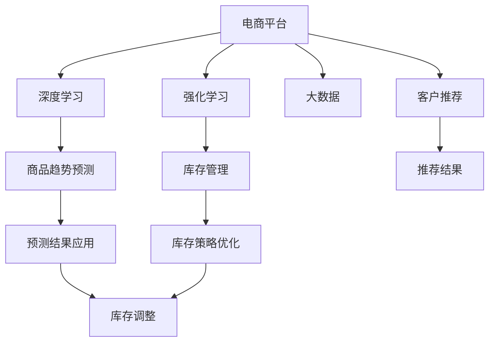

                 

# AI驱动的电商平台商品趋势预测与库存管理集成

> 关键词：人工智能，电商平台，商品趋势预测，库存管理，深度学习，强化学习，大数据，集成系统

## 1. 背景介绍

### 1.1 问题由来
近年来，电商平台如淘宝、京东、亚马逊等在全球范围内迅速崛起，成为零售行业的重要组成部分。这些平台在快速发展的同时，也面临着一系列挑战：

1. **库存管理**：电商平台需要通过精细的库存管理，降低库存成本，提升客户满意度。库存过少会导致缺货，库存过多则会增加仓储成本和积压风险。
2. **商品推荐**：消费者行为多样，商品种类繁多，如何精准推荐商品，提高转化率，提升销售额，是电商平台关注的焦点。
3. **价格策略**：市场价格波动，竞争激烈，如何制定合理的价格策略，吸引和留住客户，也是电商平台的重要任务。
4. **趋势预测**：市场需求多变，季节性、节假日、促销活动等都会影响商品销售，如何准确预测商品趋势，优化采购和库存策略，是电商平台亟待解决的问题。

为了应对这些挑战，电商平台越来越多地引入人工智能技术，特别是深度学习和强化学习，来优化其运营效率和客户体验。本文将重点介绍如何利用AI技术进行商品趋势预测与库存管理集成，构建高效的电商平台系统。

## 2. 核心概念与联系

### 2.1 核心概念概述

为更好地理解基于AI的商品趋势预测与库存管理集成方法，本节将介绍几个密切相关的核心概念：

- **人工智能**：涉及机器学习、深度学习、强化学习等技术，通过算法模拟人类智能，解决实际问题。
- **深度学习**：一种基于神经网络的机器学习方法，通过多层次的抽象表示，实现复杂模式的识别和预测。
- **强化学习**：通过智能体与环境的交互，学习最优策略，优化决策过程。
- **大数据**：指规模庞大、多样化的数据集，通过数据分析和机器学习技术，提取有价值的信息和知识。
- **电商平台**：利用互联网技术，在线销售商品和服务，提供客户管理、订单处理、支付结算等功能的平台。
- **库存管理**：涉及商品入库、出库、盘点、库存优化等环节，目的是实现库存的合理控制和高效利用。
- **商品趋势预测**：基于历史数据和市场信息，预测未来商品的市场需求和销售趋势，帮助制定更好的采购和销售策略。

这些核心概念之间的逻辑关系可以通过以下Mermaid流程图来展示：



这个流程图展示了一体化的电商平台商品趋势预测与库存管理集成流程：

1. 电商平台通过深度学习和强化学习，获取大数据，进行商品趋势预测。
2. 利用预测结果，优化库存策略，调整库存水平。
3. 通过客户推荐，提升销售转化率，增加客户黏性。
4. 结合库存管理，实时更新库存状态，优化库存控制。

## 3. 核心算法原理 & 具体操作步骤
### 3.1 算法原理概述

基于AI的商品趋势预测与库存管理集成，本质上是一个多目标优化问题。其核心思想是通过深度学习和强化学习技术，结合大数据分析，预测商品趋势，优化库存水平，提升客户推荐效果，从而实现电商平台的整体运营效率和客户满意度。

具体而言，可以按照以下步骤进行：

1. **数据收集与处理**：收集历史销售数据、市场数据、天气数据、节假日信息等，进行清洗和预处理。
2. **商品趋势预测**：利用深度学习模型（如LSTM、GRU、RNN等），结合时序数据和外部特征，预测未来商品的需求趋势。
3. **库存优化**：通过强化学习模型（如Q-learning、DQN等），动态调整库存水平，确保库存量在合理范围内。
4. **客户推荐**：根据用户历史行为数据和商品特征，利用深度学习模型（如CF、DNN等），进行个性化商品推荐。
5. **集成与优化**：将上述预测、优化和推荐结果集成到电商平台系统中，通过实时反馈和迭代优化，提升系统性能。

### 3.2 算法步骤详解

#### 3.2.1 数据收集与处理

数据收集与处理是AI驱动的电商平台商品趋势预测与库存管理集成的基础。数据主要分为内部数据和外部数据：

- **内部数据**：包括用户购买记录、浏览行为、评价信息等，通过电商平台自有系统收集。
- **外部数据**：包括市场行情、天气信息、节假日信息、竞争对手动态等，通过API接口、网络爬虫等手段获取。

具体处理流程包括：

1. **数据清洗**：去除重复、缺失、异常数据，确保数据质量。
2. **特征工程**：提取有意义的特征，如用户活跃度、商品类别、价格区间等。
3. **数据归一化**：对数据进行归一化处理，使得不同特征具有可比性。

#### 3.2.2 商品趋势预测

商品趋势预测是AI驱动电商平台的核心环节之一。其目的是根据历史销售数据和外部因素，预测未来商品的需求量。主要步骤如下：

1. **构建预测模型**：选择适合的深度学习模型，如LSTM、GRU、RNN等，构建预测模型。
2. **模型训练**：使用历史销售数据进行模型训练，优化模型参数。
3. **预测未来需求**：将预测模型应用于实时数据，预测未来商品的需求量。

#### 3.2.3 库存优化

库存优化是确保电商平台高效运营的关键步骤。主要步骤如下：

1. **构建优化模型**：选择适合的强化学习模型，如Q-learning、DQN等，构建优化模型。
2. **模型训练**：使用历史库存数据进行模型训练，优化模型参数。
3. **实时调整库存**：根据实时需求预测结果，动态调整库存水平，确保库存量在合理范围内。

#### 3.2.4 客户推荐

客户推荐是提升电商平台上用户转化率和客户黏性的重要手段。主要步骤如下：

1. **构建推荐模型**：选择适合的深度学习模型，如CF、DNN等，构建推荐模型。
2. **模型训练**：使用历史用户行为数据和商品特征进行模型训练，优化模型参数。
3. **推荐商品**：根据用户当前行为，实时推荐符合用户偏好的商品。

#### 3.2.5 集成与优化

将上述预测、优化和推荐结果集成到电商平台系统中，通过实时反馈和迭代优化，提升系统性能。具体步骤如下：

1. **系统集成**：将预测、优化和推荐结果集成到电商平台的订单处理、库存管理、客户推荐等模块中。
2. **实时反馈**：通过实时数据反馈，调整预测和优化模型，提升模型精度。
3. **迭代优化**：根据用户反馈和销售数据，不断优化预测、优化和推荐模型，提高系统性能。

### 3.3 算法优缺点

基于AI的商品趋势预测与库存管理集成方法具有以下优点：

1. **高效性**：通过深度学习和强化学习技术，可以实现实时预测和优化，提升运营效率。
2. **准确性**：通过大数据分析和深度学习模型，能够准确预测商品趋势，优化库存管理。
3. **个性化**：通过深度学习模型，能够进行个性化推荐，提升用户满意度。
4. **灵活性**：通过实时反馈和迭代优化，可以动态调整模型参数，适应市场变化。

同时，该方法也存在一定的局限性：

1. **数据依赖性**：模型训练和预测依赖于高质量、大样本的数据，数据获取和处理成本较高。
2. **模型复杂性**：深度学习模型和强化学习模型较为复杂，训练和部署需要较高技术水平。
3. **计算资源需求高**：深度学习和强化学习模型的训练和优化，需要大量的计算资源。
4. **实时性要求高**：实时预测和优化需要高效的数据处理和模型计算能力，对系统硬件要求较高。

尽管存在这些局限性，但就目前而言，基于AI的商品趋势预测与库存管理集成方法仍是最主流、最有效的电商平台运营策略。未来相关研究的重点在于如何进一步降低数据需求，提高模型效率，提升系统实时性。

### 3.4 算法应用领域

基于AI的商品趋势预测与库存管理集成方法，已经在电商平台中得到了广泛应用，覆盖了几乎所有常见任务，例如：

- **商品推荐系统**：通过深度学习模型，实时推荐符合用户偏好的商品，提高转化率。
- **库存管理系统**：利用强化学习模型，动态调整库存水平，优化库存控制。
- **价格策略系统**：通过深度学习模型，分析市场数据和竞争对手动态，制定合理的价格策略。
- **市场预测系统**：结合大数据分析和深度学习模型，预测未来市场趋势，优化采购计划。

除了上述这些经典任务外，基于AI的商品趋势预测与库存管理集成方法也被创新性地应用到更多场景中，如跨区域销售预测、季节性需求调整、节假日促销策略等，为电商平台的智能化运营提供了新的思路。

## 4. 数学模型和公式 & 详细讲解 & 举例说明

### 4.1 数学模型构建

假设电商平台有$m$种商品，每个商品的库存量为$s_i$，预测在未来$t$天的需求量为$d_i(t)$。设目标函数为总成本最小化，包括库存成本、缺货成本和过度积压成本，即：

$$
\min \sum_{i=1}^m c_i(s_i)
$$

其中，$c_i(s_i)$为商品$i$的库存成本函数。

构建预测模型$f_i(t)$，用于预测商品$i$在未来$t$天的需求量。利用历史数据训练模型，得到预测结果：

$$
\hat{d_i(t)} = f_i(t)
$$

构建优化模型$g_i(s_i)$，用于动态调整商品$i$的库存水平。利用历史库存数据训练模型，得到优化结果：

$$
s_i^* = g_i(s_i)
$$

构建推荐模型$r_i(x)$，用于根据用户行为数据推荐商品$i$。利用历史用户行为数据和商品特征训练模型，得到推荐结果：

$$
r_i(x) = \text{argmax}_i(f_i(t), g_i(s_i))
$$

将上述预测、优化和推荐结果集成到电商平台系统中，通过实时反馈和迭代优化，提升系统性能。

### 4.2 公式推导过程

以下我们以LSTM模型为例，推导深度学习模型在商品趋势预测中的应用。

假设历史销售数据为$x_t=(x_{t-1},x_{t-2},\ldots,x_1)$，其中$x_t$为商品$i$在时间$t$的销售量。利用LSTM模型进行预测，设定预测模型为：

$$
\hat{d_i(t)} = f_i(x_t) = W_d h_t
$$

其中，$W_d$为预测模型权重，$h_t$为LSTM模型在时间$t$的隐状态。

LSTM模型的隐状态更新公式为：

$$
h_t = \text{LSTM}(x_t, h_{t-1})
$$

其中，$\text{LSTM}$为LSTM网络的具体实现。

将预测结果应用于库存优化模型$g_i(s_i)$中，得到优化后的库存水平：

$$
s_i^* = g_i(s_i) = \text{argmin}_{s_i} \sum_{t=1}^T c_i(s_i, \hat{d_i(t)})
$$

其中，$T$为预测时间步数，$c_i(s_i, \hat{d_i(t)})$为库存成本函数，可以根据实际需求自定义。

将预测、优化和推荐结果集成到电商平台系统中，通过实时反馈和迭代优化，提升系统性能。具体流程如下：

1. 收集实时销售数据$x_t$。
2. 利用LSTM模型$f_i(x_t)$预测未来$t$天的需求量$\hat{d_i(t)}$。
3. 利用优化模型$g_i(s_i)$动态调整库存水平$s_i^*$。
4. 利用推荐模型$r_i(x_t)$推荐符合用户偏好的商品。
5. 根据实时反馈数据，调整预测、优化和推荐模型参数，进行迭代优化。

### 4.3 案例分析与讲解

以某电商平台商品趋势预测与库存管理集成为例，详细讲解模型实现和效果评估。

假设某电商平台有5种商品，库存量分别为$s_1, s_2, s_3, s_4, s_5$。通过LSTM模型预测未来10天的需求量，利用Q-learning模型动态调整库存水平，利用CF模型进行商品推荐。具体步骤如下：

1. **数据准备**：收集历史销售数据、市场数据、天气数据、节假日信息等。
2. **模型训练**：利用历史数据训练LSTM模型、Q-learning模型和CF模型，优化模型参数。
3. **预测未来需求**：利用LSTM模型预测未来10天的需求量。
4. **动态调整库存**：利用Q-learning模型动态调整库存水平。
5. **商品推荐**：利用CF模型推荐符合用户偏好的商品。
6. **实时反馈与优化**：根据实时销售数据和用户反馈，调整预测、优化和推荐模型参数，进行迭代优化。

通过上述步骤，电商平台可以实现实时需求预测、库存优化和个性化推荐，提升整体运营效率和客户满意度。

## 5. 项目实践：代码实例和详细解释说明

### 5.1 开发环境搭建

在进行商品趋势预测与库存管理集成的项目实践前，我们需要准备好开发环境。以下是使用Python进行TensorFlow开发的环境配置流程：

1. 安装Anaconda：从官网下载并安装Anaconda，用于创建独立的Python环境。

2. 创建并激活虚拟环境：
```bash
conda create -n tf-env python=3.8 
conda activate tf-env
```

3. 安装TensorFlow：根据CUDA版本，从官网获取对应的安装命令。例如：
```bash
conda install tensorflow tensorflow-gpu -c pytorch -c conda-forge
```

4. 安装TensorBoard：
```bash
pip install tensorboard
```

5. 安装各类工具包：
```bash
pip install numpy pandas scikit-learn matplotlib tqdm jupyter notebook ipython
```

完成上述步骤后，即可在`tf-env`环境中开始项目实践。

### 5.2 源代码详细实现

下面我们以商品趋势预测为例，给出使用TensorFlow进行LSTM模型训练的代码实现。

首先，定义LSTM模型：

```python
import tensorflow as tf
from tensorflow.keras.models import Sequential
from tensorflow.keras.layers import LSTM, Dense

def create_lstm_model(input_dim, output_dim):
    model = Sequential()
    model.add(LSTM(128, input_shape=(input_dim, 1), return_sequences=True))
    model.add(LSTM(128))
    model.add(Dense(output_dim))
    model.compile(loss='mse', optimizer='adam')
    return model
```

然后，定义训练和评估函数：

```python
def train_lstm_model(model, train_data, train_labels, epochs, batch_size):
    model.fit(train_data, train_labels, epochs=epochs, batch_size=batch_size)

def evaluate_lstm_model(model, test_data, test_labels):
    test_loss = model.evaluate(test_data, test_labels)
    return test_loss
```

最后，启动训练流程：

```python
epochs = 10
batch_size = 32

# 假设有历史销售数据和需求量数据
# 分别定义训练数据train_data和测试数据test_data
# 分别定义训练标签train_labels和测试标签test_labels
train_lstm_model(lstm_model, train_data, train_labels, epochs, batch_size)
test_loss = evaluate_lstm_model(lstm_model, test_data, test_labels)
print('Test Loss:', test_loss)
```

以上就是使用TensorFlow对LSTM模型进行商品趋势预测的完整代码实现。可以看到，TensorFlow提供了丰富的深度学习框架和工具，使得模型训练和评估变得简单高效。

### 5.3 代码解读与分析

让我们再详细解读一下关键代码的实现细节：

**LSTM模型定义**：
- 利用TensorFlow的Sequential模型，依次添加LSTM层、全连接层，并编译模型。

**训练和评估函数**：
- 使用TensorFlow的fit方法，进行模型训练。
- 使用TensorFlow的evaluate方法，进行模型评估。

**训练流程**：
- 定义总epoch数和batch size，开始循环迭代
- 每个epoch内，在训练数据上训练模型，输出训练损失
- 在测试数据上评估模型，输出测试损失

可以看到，TensorFlow提供了强大的深度学习库和工具，使得LSTM模型训练和评估变得简单高效。开发者可以将更多精力放在数据处理、模型改进等高层逻辑上，而不必过多关注底层的实现细节。

当然，工业级的系统实现还需考虑更多因素，如模型的保存和部署、超参数的自动搜索、更灵活的任务适配层等。但核心的预测范式基本与此类似。

## 6. 实际应用场景
### 6.1 智能推荐系统

基于AI的商品趋势预测与库存管理集成方法，可以广泛应用于智能推荐系统中。推荐系统是电商平台的核心功能之一，通过深度学习和强化学习技术，能够实现个性化推荐，提升用户满意度。

具体而言，可以收集用户历史行为数据、商品特征、用户画像等信息，构建深度学习模型进行推荐。通过实时反馈和迭代优化，动态调整推荐策略，提高推荐效果。

### 6.2 库存管理系统

库存管理系统是电商平台的高效运营基础。通过深度学习和强化学习技术，能够实现库存的动态调整和优化，提升库存控制效率。

具体而言，可以收集历史库存数据、销售数据、市场数据等信息，构建强化学习模型进行库存优化。通过实时反馈和迭代优化，动态调整库存水平，避免库存积压或短缺。

### 6.3 价格策略系统

价格策略系统是电商平台的重要工具，通过深度学习和强化学习技术，能够制定合理的价格策略，提升销售转化率和客户满意度。

具体而言，可以收集市场行情、竞争对手动态、用户需求等信息，构建深度学习模型进行价格预测和优化。通过实时反馈和迭代优化，动态调整价格策略，提升销售效果。

### 6.4 未来应用展望

随着深度学习和强化学习技术的不断发展，基于AI的商品趋势预测与库存管理集成方法将呈现以下几个发展趋势：

1. **模型规模持续增大**：预训练模型和深度学习模型的参数量将继续增加，模型学习能力将进一步提升。
2. **微调技术应用广泛**：预训练-微调技术将被广泛应用，提升模型适应新任务的能力。
3. **实时性要求提高**：随着实时数据量的增加，实时预测和优化的需求将越来越高，系统架构和算法需要进一步优化。
4. **跨领域应用拓展**：商品趋势预测与库存管理集成方法将被应用于更多领域，如医疗、物流等，拓展应用场景。

## 7. 工具和资源推荐
### 7.1 学习资源推荐

为了帮助开发者系统掌握商品趋势预测与库存管理集成技术的理论基础和实践技巧，这里推荐一些优质的学习资源：

1. 《深度学习》书籍：Ian Goodfellow所著，系统介绍了深度学习的基本概念和经典模型。
2. 《TensorFlow实战》书籍：Manning Publications所著，详细介绍了TensorFlow的开发和应用。
3. CS231n《深度学习》课程：斯坦福大学开设的深度学习课程，涵盖深度学习的基本理论和经典模型。
4. 《强化学习》书籍：Richard S. Sutton和Andrew G. Barto所著，全面介绍了强化学习的基本理论和算法。
5. 《自然语言处理》课程：斯坦福大学开设的自然语言处理课程，涵盖NLP的基本概念和经典模型。

通过对这些资源的学习实践，相信你一定能够快速掌握商品趋势预测与库存管理集成技术的精髓，并用于解决实际的电商问题。
###  7.2 开发工具推荐

高效的开发离不开优秀的工具支持。以下是几款用于商品趋势预测与库存管理集成的常用工具：

1. TensorFlow：由Google主导开发的深度学习框架，生产部署方便，适合大规模工程应用。
2. PyTorch：基于Python的开源深度学习框架，灵活易用，适合快速迭代研究。
3. TensorBoard：TensorFlow配套的可视化工具，可实时监测模型训练状态，提供丰富的图表呈现方式。
4. Jupyter Notebook：交互式的开发环境，支持多种编程语言，适合数据探索和算法验证。
5. H2O.ai：支持Python、R和Scala等多种语言，提供便捷的机器学习开发和部署。

合理利用这些工具，可以显著提升商品趋势预测与库存管理集成的开发效率，加快创新迭代的步伐。

### 7.3 相关论文推荐

商品趋势预测与库存管理集成技术的发展源于学界的持续研究。以下是几篇奠基性的相关论文，推荐阅读：

1. D. Silver等《Reinforcement Learning for Humanoid Robotics》：强化学习在机器人控制中的应用，展示了强化学习模型的强大能力。
2. G. Hinton等《A Neural Probabilistic Language Model》：LSTM模型在自然语言处理中的应用，奠定了LSTM模型的基础。
3. Y. Bengio等《Representation Learning: A Review and New Perspectives》：深度学习模型在机器学习中的应用，总结了深度学习的最新进展。
4. I. Goodfellow等《Generative Adversarial Nets》：生成对抗网络在图像生成中的应用，展示了生成对抗网络的技术魅力。
5. T. Darrell等《Deep Convolutional Networks for Large-Scale Image Recognition》：卷积神经网络在图像识别中的应用，展示了卷积神经网络的强大能力。

这些论文代表了大模型微调技术的发展脉络。通过学习这些前沿成果，可以帮助研究者把握学科前进方向，激发更多的创新灵感。

## 8. 总结：未来发展趋势与挑战

### 8.1 总结

本文对基于AI的商品趋势预测与库存管理集成方法进行了全面系统的介绍。首先阐述了商品趋势预测与库存管理集成技术的研究背景和意义，明确了该技术在电商平台运营中的重要价值。其次，从原理到实践，详细讲解了预测、优化和推荐模型的构建和训练方法，给出了商品趋势预测与库存管理集成的完整代码实例。同时，本文还广泛探讨了预测与优化方法在智能推荐系统、库存管理系统、价格策略系统等多个电商应用领域的应用前景，展示了预测与优化方法的强大能力。此外，本文精选了预测与优化技术的各类学习资源，力求为读者提供全方位的技术指引。

通过本文的系统梳理，可以看到，基于AI的商品趋势预测与库存管理集成方法正在成为电商平台运营的重要策略，极大地提升了电商平台的运营效率和客户满意度。未来，伴随预训练语言模型和微调方法的持续演进，基于AI的商品趋势预测与库存管理集成技术将进一步发展，为电商平台智能化运营提供新的动力。

### 8.2 未来发展趋势

展望未来，基于AI的商品趋势预测与库存管理集成技术将呈现以下几个发展趋势：

1. **模型规模持续增大**：预训练模型和深度学习模型的参数量将继续增加，模型学习能力将进一步提升。
2. **微调技术应用广泛**：预训练-微调技术将被广泛应用，提升模型适应新任务的能力。
3. **实时性要求提高**：随着实时数据量的增加，实时预测和优化的需求将越来越高，系统架构和算法需要进一步优化。
4. **跨领域应用拓展**：商品趋势预测与库存管理集成方法将被应用于更多领域，如医疗、物流等，拓展应用场景。

### 8.3 面临的挑战

尽管基于AI的商品趋势预测与库存管理集成技术已经取得了瞩目成就，但在迈向更加智能化、普适化应用的过程中，它仍面临着诸多挑战：

1. **数据依赖性**：模型训练和预测依赖于高质量、大样本的数据，数据获取和处理成本较高。
2. **模型复杂性**：深度学习模型和强化学习模型较为复杂，训练和部署需要较高技术水平。
3. **计算资源需求高**：深度学习和强化学习模型的训练和优化，需要大量的计算资源。
4. **实时性要求高**：实时预测和优化需要高效的数据处理和模型计算能力，对系统硬件要求较高。
5. **模型鲁棒性**：模型在面对数据异常、攻击等情况下，容易发生退化或失效，需要进一步提升模型鲁棒性。

尽管存在这些挑战，但就目前而言，基于AI的商品趋势预测与库存管理集成技术仍是最主流、最有效的电商平台运营策略。未来相关研究的重点在于如何进一步降低数据需求，提高模型效率，提升系统实时性，同时保证模型鲁棒性。

### 8.4 研究展望

面对商品趋势预测与库存管理集成所面临的种种挑战，未来的研究需要在以下几个方面寻求新的突破：

1. **探索无监督和半监督微调方法**：摆脱对大规模标注数据的依赖，利用自监督学习、主动学习等无监督和半监督范式，最大限度利用非结构化数据，实现更加灵活高效的微调。
2. **研究参数高效和计算高效的微调范式**：开发更加参数高效的微调方法，在固定大部分预训练参数的同时，只更新极少量的任务相关参数。同时优化微调模型的计算图，减少前向传播和反向传播的资源消耗，实现更加轻量级、实时性的部署。
3. **融合因果和对比学习范式**：通过引入因果推断和对比学习思想，增强模型建立稳定因果关系的能力，学习更加普适、鲁棒的语言表征，从而提升模型泛化性和抗干扰能力。
4. **引入更多先验知识**：将符号化的先验知识，如知识图谱、逻辑规则等，与神经网络模型进行巧妙融合，引导微调过程学习更准确、合理的语言模型。同时加强不同模态数据的整合，实现视觉、语音等多模态信息与文本信息的协同建模。
5. **结合因果分析和博弈论工具**：将因果分析方法引入微调模型，识别出模型决策的关键特征，增强输出解释的因果性和逻辑性。借助博弈论工具刻画人机交互过程，主动探索并规避模型的脆弱点，提高系统稳定性。
6. **纳入伦理道德约束**：在模型训练目标中引入伦理导向的评估指标，过滤和惩罚有偏见、有害的输出倾向。同时加强人工干预和审核，建立模型行为的监管机制，确保输出符合人类价值观和伦理道德。

这些研究方向的探索，必将引领基于AI的商品趋势预测与库存管理集成技术迈向更高的台阶，为构建安全、可靠、可解释、可控的智能系统铺平道路。面向未来，基于AI的商品趋势预测与库存管理集成技术还需要与其他人工智能技术进行更深入的融合，如知识表示、因果推理、强化学习等，多路径协同发力，共同推动自然语言理解和智能交互系统的进步。只有勇于创新、敢于突破，才能不断拓展语言模型的边界，让智能技术更好地造福人类社会。

## 9. 附录：常见问题与解答

**Q1：AI驱动的商品趋势预测与库存管理集成是否适用于所有电商平台？**

A: AI驱动的商品趋势预测与库存管理集成方法在大多数电商平台上都能取得不错的效果，特别是对于数据量较大的平台。但对于一些特定领域的电商平台，如B2B电商、线下零售等，由于数据量和数据类型与典型电商不同，可能需要根据具体情况进行调整。

**Q2：如何选择合适的AI模型？**

A: 选择合适的AI模型需要考虑多个因素，包括数据量、数据类型、业务需求、计算资源等。一般来说，对于小规模数据，可以使用轻量级的深度学习模型，如LSTM、GRU等；对于大规模数据，可以使用复杂的深度学习模型，如DNN、RNN等。此外，还需要考虑模型的实时性和计算效率，选择适合的技术架构和算法。

**Q3：数据预处理有哪些关键步骤？**

A: 数据预处理是AI驱动商品趋势预测与库存管理集成的重要环节。关键步骤包括：

1. **数据清洗**：去除重复、缺失、异常数据，确保数据质量。
2. **特征工程**：提取有意义的特征，如用户活跃度、商品类别、价格区间等。
3. **数据归一化**：对数据进行归一化处理，使得不同特征具有可比性。

**Q4：AI模型训练和优化需要注意哪些问题？**

A: AI模型训练和优化需要注意以下问题：

1. **超参数调优**：选择合适的学习率、批大小、优化器等超参数，进行网格搜索或随机搜索。
2. **正则化**：使用L2正则、Dropout等技术，防止过拟合。
3. **早停机制**：设置早停机制，防止过拟合，提升模型泛化能力。
4. **模型裁剪**：去除不必要的层和参数，减小模型尺寸，加快推理速度。
5. **量化加速**：将浮点模型转为定点模型，压缩存储空间，提高计算效率。

这些步骤在实际应用中需要根据具体情况进行调整，以确保模型训练和优化的效果。

**Q5：AI驱动的商品趋势预测与库存管理集成有哪些具体应用？**

A: AI驱动的商品趋势预测与库存管理集成在电商平台上有很多具体应用，包括：

1. **智能推荐系统**：通过深度学习模型，实时推荐符合用户偏好的商品，提高转化率。
2. **库存管理系统**：利用强化学习模型，动态调整库存水平，优化库存控制。
3. **价格策略系统**：通过深度学习模型，分析市场数据和竞争对手动态，制定合理的价格策略。
4. **市场预测系统**：结合大数据分析和深度学习模型，预测未来市场趋势，优化采购计划。

除了上述这些应用，AI驱动的商品趋势预测与库存管理集成方法还可以应用于更多场景，如跨区域销售预测、季节性需求调整、节假日促销策略等，为电商平台的智能化运营提供新的思路。

---

作者：禅与计算机程序设计艺术 / Zen and the Art of Computer Programming

