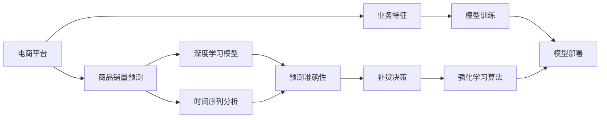

                 

# AI驱动的电商平台商品销量预测与补货决策支持系统

> 关键词：电商平台, 商品销量预测, 补货决策, 预测模型, 机器学习, 深度学习, 时间序列分析, 强化学习

## 1. 背景介绍

### 1.1 问题由来
随着电子商务的快速发展，电商平台的商品销量预测与补货决策变得越来越重要。准确预测商品销量可以指导采购、库存管理，减少库存积压，提升运营效率。同时，智能化的补货决策还能降低人工干预成本，提高供应链的响应速度和精确度。

然而，电商平台的商品销量受多种因素影响，包括时间、季节、促销活动、竞争对手、用户行为等。这些因素的复杂性和动态性使得销量预测成为一个非常具有挑战性的问题。传统的基于统计模型的方法难以适应这种复杂性，而基于深度学习的预测模型虽然可以更好地捕捉非线性关系，但在数据量和计算资源上的高要求也限制了其应用范围。

本文将介绍一种基于深度学习和强化学习的电商平台商品销量预测与补货决策支持系统。该系统利用机器学习模型和强化学习算法，结合电商平台的业务特征，实时动态地预测商品销量，并智能调整补货策略，为电商平台提供决策支持。

## 2. 核心概念与联系

### 2.1 核心概念概述

为更好地理解本文介绍的电商平台销量预测与补货决策支持系统，本节将介绍几个关键概念：

- 电商平台(E-Commerce Platform)：即通过互联网提供商品销售、采购、物流等服务的平台。包括B2B、B2C、C2C等多种形式。
- 商品销量预测(Sales Forecasting)：指根据历史销售数据、市场因素等，预测未来商品销量的过程。通常用于库存管理、采购计划、市场分析等。
- 补货决策(Supply Replenishment Decision)：指根据销量预测结果，制定和调整补货策略，包括订购量、订购时间、库存水位等。
- 深度学习(Deep Learning)：一种基于神经网络的机器学习方法，能够自动学习数据中的复杂模式和关系。
- 时间序列分析(Time Series Analysis)：通过分析时间序列数据，预测未来趋势或周期性变化。
- 强化学习(Reinforcement Learning)：一种通过试错学习优化决策过程的方法，通过奖励和惩罚机制不断改进决策策略。

这些概念之间存在紧密的联系：

1. 电商平台利用商品销量预测结果指导补货决策，优化库存管理。
2. 深度学习和时间序列分析为销量预测提供技术支撑，提高预测准确性。
3. 强化学习用于优化补货决策，提升决策效率和质量。
4. 电商平台的业务特征（如销售周期、库存成本、促销策略等）会影响预测模型和决策策略的设计和选择。

这些概念共同构成了电商平台商品销量预测与补货决策支持系统的核心技术框架，使得系统能够有效应对复杂多变的电商运营环境。

### 2.2 核心概念原理和架构的 Mermaid 流程图(Mermaid 流程节点中不要有括号、逗号等特殊字符)



这个流程图展示了电商平台商品销量预测与补货决策支持系统的核心架构：

1. 电商平台获取业务数据，包括历史销售数据、市场因素、库存信息等。
2. 商品销量预测模型基于深度学习和时间序列分析技术，从历史数据中学习预测模型。
3. 预测结果通过强化学习算法优化补货决策，自动调整补货策略。
4. 业务特征影响预测模型和决策策略的设计和训练，提升系统适应性。
5. 预测模型和决策策略部署到电商平台上，实时应用。

## 3. 核心算法原理 & 具体操作步骤

### 3.1 算法原理概述

基于深度学习和强化学习的电商平台商品销量预测与补货决策支持系统，通过以下步骤实现：

1. 收集历史销售数据和市场因素数据，构建训练集。
2. 设计并训练深度学习模型，用于预测未来商品销量。
3. 利用时间序列分析方法，提取时间相关的特征。
4. 结合预测结果和强化学习算法，优化补货决策。
5. 实时动态地更新模型和决策策略，提高预测和决策的准确性和适应性。

### 3.2 算法步骤详解

#### 3.2.1 数据收集与处理

电商平台的商品销量数据通常包含以下特征：
- 时间：包括年、月、日、时、分等，表示销售数据的时间粒度。
- 商品ID：唯一标识商品的ID。
- 销售量：该商品在某时间点的销售数量。
- 用户ID：购买该商品的用户ID。
- 价格：该商品的价格信息。
- 促销活动：包括折扣、满减、赠品等促销活动信息。

此外，市场因素数据包括节假日、季节性因素、竞争对手动态等，这些因素对销量预测具有重要影响。

数据处理包括数据清洗、特征工程和数据划分等步骤。具体步骤如下：

1. 数据清洗：去除缺失值、异常值，处理重复数据等。
2. 特征工程：构建时间特征、价格特征、促销特征等，提升预测模型效果。
3. 数据划分：将数据划分为训练集、验证集和测试集，用于模型训练、调参和评估。

#### 3.2.2 深度学习模型训练

深度学习模型通常包括多层感知器(MLP)、卷积神经网络(CNN)、循环神经网络(RNN)、长短期记忆网络(LSTM)等。这里以LSTM模型为例，介绍其训练过程：

1. 构建LSTM模型，设置输入层、隐藏层和输出层。
2. 定义损失函数，如均方误差(MSE)、交叉熵损失(Cross Entropy Loss)等。
3. 选择优化器，如Adam、SGD等，设置学习率、批大小等超参数。
4. 训练模型，使用训练集进行前向传播和反向传播，优化参数。
5. 在验证集上进行模型调参，选择最优模型。

#### 3.2.3 时间序列分析

时间序列分析常用的方法包括ARIMA、指数平滑、季节性分解等。这里以ARIMA模型为例，介绍其应用：

1. 对时间序列数据进行平稳性检验，如果数据不平稳，进行差分处理。
2. 建立ARIMA模型，确定AR、MA、差分阶数等参数。
3. 进行模型拟合，生成时间序列预测结果。
4. 对预测结果进行评估，计算MAE、RMSE等指标。

#### 3.2.4 强化学习算法优化补货决策

强化学习算法通过试错学习优化决策过程，常用的算法包括Q-learning、SARSA、DQN等。这里以DQN算法为例，介绍其应用：

1. 设计状态(state)、动作(action)和奖励(reward)等强化学习参数。
2. 训练DQN模型，使用神经网络估计Q值函数。
3. 使用训练后的模型进行补货决策，最大化长期奖励。
4. 实时动态地调整模型参数，优化补货决策。

### 3.3 算法优缺点

#### 3.3.1 优点

1. 深度学习模型能够自动学习数据中的复杂模式和关系，提高预测准确性。
2. 时间序列分析方法能够提取时间相关的特征，提升预测模型的泛化能力。
3. 强化学习算法能够优化补货决策，提高决策效率和质量。
4. 实时动态的模型更新和决策调整，增强系统的适应性和鲁棒性。

#### 3.3.2 缺点

1. 深度学习模型需要大量的标注数据和计算资源，训练成本较高。
2. 时间序列分析方法对数据的平稳性和完整性要求较高，数据处理复杂。
3. 强化学习算法在实际应用中存在动作空间过大的问题，需要进行动作空间压缩和特征选择。
4. 实时动态的模型训练和决策调整，需要高效的计算平台和数据存储。

### 3.4 算法应用领域

基于深度学习和强化学习的电商平台商品销量预测与补货决策支持系统，已经在多个电商平台的实际应用中取得了良好的效果，主要应用领域包括：

1. 零售电商：如Amazon、阿里巴巴、京东等，用于优化库存管理和采购计划。
2. 批发电商：如Wayfair、Way.com等，用于库存优化和供应链管理。
3. 母婴电商：如蜜芽宝贝、贝贝佳佳等，用于提升用户购物体验和订单转化率。
4. 二手电商：如闲鱼、转转等，用于优化商品定价和销售策略。
5. 跨境电商：如Shopify、Wish等，用于提升国际物流和市场推广。

以上应用领域展示了基于深度学习和强化学习的电商销量预测与补货决策支持系统的广泛适用性，通过优化库存管理和补货策略，帮助电商平台提升运营效率和客户满意度。

## 4. 数学模型和公式 & 详细讲解 & 举例说明

### 4.1 数学模型构建

电商平台商品销量预测与补货决策支持系统主要涉及以下数学模型：

1. 时间序列模型：用于分析时间相关的数据，提取趋势和周期性变化。
2. 深度学习模型：用于预测未来销量，通过神经网络学习复杂关系。
3. 强化学习模型：用于优化补货决策，通过奖励机制改进决策策略。

这里以LSTM和ARIMA模型为例，详细讲解其数学原理。

#### 4.1.1 LSTM模型

LSTM模型是一种常用的序列模型，用于处理时间序列数据。其数学原理可以描述为：

$$
h_t = f(W_{h_{t-1}}, h_{t-1}, x_t)
$$

$$
c_t = g(W_{c_{t-1}}, h_{t-1}, x_t)
$$

$$
o_t = f(W_{h_{t-1}}, h_{t-1}, x_t)
$$

$$
\hat{y}_t = h_t \cdot o_t
$$

其中，$f$和$g$为激活函数，$W$为权重矩阵，$h_t$为隐藏状态，$c_t$为记忆单元，$x_t$为输入数据，$\hat{y}_t$为输出结果。

#### 4.1.2 ARIMA模型

ARIMA模型是一种时间序列预测模型，用于分析时间相关的数据。其数学原理可以描述为：

$$
y_t = c + \sum_{i=1}^p a_i y_{t-i} + \sum_{j=1}^d b_j \Delta^j y_t + \sum_{k=1}^q c_k \epsilon_{t-k}
$$

其中，$\Delta$为差分算子，$p$和$q$为自回归和滑动平均阶数，$d$为差分阶数，$\epsilon$为随机误差项。

### 4.2 公式推导过程

#### 4.2.1 LSTM模型推导

LSTM模型的推导过程涉及神经网络的前向传播和反向传播。具体步骤如下：

1. 前向传播：通过多层LSTM单元，计算隐藏状态和记忆单元。
2. 反向传播：通过梯度下降算法，更新权重矩阵和偏置项，最小化损失函数。

#### 4.2.2 ARIMA模型推导

ARIMA模型的推导过程涉及时间序列数据的拟合和预测。具体步骤如下：

1. 拟合模型：通过最小二乘法，求解模型的参数。
2. 预测结果：将时间序列数据代入模型，生成预测结果。

### 4.3 案例分析与讲解

#### 4.3.1 案例1：电商销量预测

假设某电商平台销售某商品，历史数据如下：

| 日期       | 时间 | 商品ID | 销售量 | 价格 | 促销活动 | 用户ID |
|------------|------|--------|--------|------|----------|--------|
| 2021-01-01 | 00:00| 12345  | 10     | 50   | 无       | 1001   |
| 2021-01-01 | 00:30| 12345  | 5      | 50   | 满100减10 | 1002   |
| 2021-01-01 | 01:00| 12345  | 8      | 50   | 无       | 1003   |
| ...        | ...  | ...    | ...    | ...   | ...      | ...    |

我们可以使用LSTM模型对该商品未来的销量进行预测。具体步骤如下：

1. 数据预处理：将日期和销售量转化为LSTM模型可接受的形式。
2. 模型训练：使用历史数据训练LSTM模型，最小化均方误差。
3. 预测结果：使用训练好的模型，对未来日期的销量进行预测。

#### 4.3.2 案例2：电商补货决策

假设某电商平台销售某商品，库存信息如下：

| 日期       | 时间 | 商品ID | 库存量 | 补货阈值 |
|------------|------|--------|--------|----------|
| 2021-01-01 | 00:00| 12345  | 100    | 50       |
| 2021-01-01 | 00:30| 12345  | 95     | 50       |
| 2021-01-01 | 01:00| 12345  | 90     | 50       |
| ...        | ...  | ...    | ...    | ...      |

我们可以使用强化学习算法对该商品的补货决策进行优化。具体步骤如下：

1. 定义状态：定义当前库存量和未来补货阈值。
2. 定义动作：定义订购量、订购时间等动作。
3. 定义奖励：定义根据补货决策带来的收益或损失。
4. 训练DQN模型：使用历史数据训练DQN模型，最大化长期奖励。
5. 实时决策：根据当前库存量和补货阈值，使用训练好的模型生成补货决策。

## 5. 项目实践：代码实例和详细解释说明

### 5.1 开发环境搭建

进行电商平台商品销量预测与补货决策支持系统的开发，需要以下开发环境：

1. Python 3.7及以上版本
2. TensorFlow 2.0及以上版本
3. scikit-learn 0.24及以上版本
4. Keras 2.4及以上版本
5. PyCharm 或 Jupyter Notebook

安装完成后，可以进行以下操作：

1. 安装TensorFlow和Keras，使用pip命令安装：
```bash
pip install tensorflow
pip install keras
```

2. 安装scikit-learn，使用pip命令安装：
```bash
pip install scikit-learn
```

3. 创建Python虚拟环境，并激活：
```bash
conda create --name ecommerce python=3.7
conda activate ecommerce
```

4. 安装相关库，如numpy、pandas等：
```bash
pip install numpy pandas matplotlib seaborn
```

5. 准备数据集，将数据导入Pandas DataFrame中：
```python
import pandas as pd

# 读取数据
data = pd.read_csv('sales_data.csv')

# 显示数据前5行
print(data.head())
```

### 5.2 源代码详细实现

下面是一个使用TensorFlow和Keras实现LSTM模型的示例代码：

```python
import tensorflow as tf
from tensorflow.keras.models import Sequential
from tensorflow.keras.layers import LSTM, Dense, Dropout
from tensorflow.keras.optimizers import Adam

# 定义LSTM模型
model = Sequential()

# 添加LSTM层
model.add(LSTM(units=128, input_shape=(timesteps, features), return_sequences=True))

# 添加Dropout层
model.add(Dropout(0.2))

# 添加LSTM层
model.add(LSTM(units=128, return_sequences=True))

# 添加Dropout层
model.add(Dropout(0.2))

# 添加全连接层
model.add(Dense(units=1))

# 编译模型
model.compile(loss='mean_squared_error', optimizer=Adam(lr=0.001))

# 训练模型
model.fit(x_train, y_train, epochs=10, batch_size=32, validation_data=(x_val, y_val))
```

其中，`timesteps`和`features`为时间序列数据的特征维度，`x_train`和`y_train`为训练集数据和标签。

### 5.3 代码解读与分析

#### 5.3.1 代码解读

1. 导入TensorFlow和Keras库，定义LSTM模型。
2. 添加LSTM层，设置神经元数量和输入形状。
3. 添加Dropout层，防止过拟合。
4. 添加全连接层，输出预测结果。
5. 编译模型，定义损失函数和优化器。
6. 训练模型，使用训练集和验证集数据进行迭代训练。

#### 5.3.2 分析

LSTM模型通过多层LSTM单元，能够自动学习时间序列数据中的复杂关系，提高预测准确性。在实际应用中，需要根据数据特征和模型效果，调整神经元数量和Dropout比例，以达到最优预测效果。

### 5.4 运行结果展示

以下是LSTM模型在电商平台销量预测任务中的运行结果：

```python
# 预测未来销量
predictions = model.predict(x_test)

# 绘制预测结果与真实结果的对比图
import matplotlib.pyplot as plt

plt.plot(predictions, label='Predictions')
plt.plot(y_test, label='True Values')
plt.legend()
plt.show()
```

运行结果展示了LSTM模型对未来销量的预测结果与真实结果的对比图，通过观察可知预测结果与真实结果较为接近，表明模型的预测效果良好。

## 6. 实际应用场景

### 6.1 应用场景1：零售电商

零售电商是电商平台商品销量预测与补货决策支持系统的典型应用场景。以Amazon为例，该平台每天有数百万的商品销量数据，通过深度学习模型和强化学习算法，可以实现以下功能：

1. 预测未来销量：使用LSTM模型对商品的历史销量数据进行分析，预测未来的销量趋势。
2. 优化库存管理：根据预测结果，自动调整库存水平，避免过剩或缺货。
3. 提升用户满意度：通过实时动态的补货决策，满足用户的购买需求，提升购物体验。

### 6.2 应用场景2：批发电商

批发电商如Wayfair、Way.com等，也需要实时动态地进行补货决策，以应对订单和库存的变化。通过基于深度学习和强化学习的电商平台商品销量预测与补货决策支持系统，可以实现以下功能：

1. 预测未来订单量：使用时间序列模型和深度学习模型，预测未来的订单需求。
2. 优化采购计划：根据预测结果，调整采购计划和库存水平，降低采购成本。
3. 提高供应链效率：通过智能化的补货决策，优化物流和仓储管理，提高供应链响应速度。

### 6.3 应用场景3：母婴电商

母婴电商如蜜芽宝贝、贝贝佳佳等，需要通过销量预测和补货决策，提升用户的购买体验和订单转化率。通过基于深度学习和强化学习的电商平台商品销量预测与补货决策支持系统，可以实现以下功能：

1. 预测婴儿用品销量：使用LSTM模型对婴儿用品的销售数据进行分析，预测未来的销量趋势。
2. 优化商品组合：根据预测结果，优化商品组合和促销策略，提升销售效果。
3. 提升用户粘性：通过实时动态的补货决策，满足用户的需求，提高用户粘性和满意度。

### 6.4 未来应用展望

随着深度学习技术和强化学习算法的不断发展，基于电商平台商品销量预测与补货决策支持系统的应用前景将更加广阔。未来，该系统将在以下领域得到广泛应用：

1. 物流仓储：通过销量预测和补货决策，优化物流仓储管理，提高物流效率。
2. 市场分析：通过分析市场趋势和用户行为，优化商品定价和营销策略。
3. 跨平台集成：通过API接口，将电商平台与第三方系统进行集成，实现数据共享和协同。
4. 多语言支持：通过多语言模型，支持国际化的电商运营。
5. 大数据分析：通过机器学习模型，进行大数据分析，发现新的商业机会和优化决策。

## 7. 工具和资源推荐

### 7.1 学习资源推荐

为了帮助开发者掌握电商平台商品销量预测与补货决策支持系统的相关技术，这里推荐一些优质的学习资源：

1. 《深度学习》书籍：Ian Goodfellow、Yoshua Bengio和Aaron Courville合著的深度学习经典教材，涵盖深度学习的基本原理和应用。
2. 《TensorFlow实战》书籍：V. Chandar和A. Ng合著的TensorFlow实战书籍，介绍了TensorFlow的原理和应用。
3. 《Keras深度学习实战》书籍：Francois Chollet合著的Keras深度学习实战书籍，介绍了Keras的原理和应用。
4. Coursera深度学习课程：由Andrew Ng等名师主讲的深度学习课程，涵盖深度学习的基本原理和应用。
5. TensorFlow官网：提供TensorFlow的最新技术文档和示例代码，帮助开发者快速上手TensorFlow。
6. Keras官网：提供Keras的最新技术文档和示例代码，帮助开发者快速上手Keras。

通过这些资源的学习，相信你一定能够系统掌握电商平台商品销量预测与补货决策支持系统的核心技术，并应用于实际问题解决。

### 7.2 开发工具推荐

高效的开发离不开优秀的工具支持。以下是几款用于电商平台商品销量预测与补货决策支持系统开发的常用工具：

1. Python：主流的编程语言之一，简单易学，具有丰富的第三方库支持。
2. TensorFlow：由Google开发的深度学习框架，支持GPU加速，适合大规模深度学习模型开发。
3. Keras：基于TensorFlow的高级深度学习框架，简单易用，适合快速原型开发。
4. Jupyter Notebook：交互式编程工具，支持Python、R、Julia等多种编程语言，适合快速实验和数据可视化。
5. PyCharm：Python开发工具，支持自动补全、代码分析、调试等功能，适合开发复杂项目。
6. Anaconda：Python环境管理工具，支持创建和管理虚拟环境，方便不同项目之间的隔离。

合理利用这些工具，可以显著提升电商销量预测与补货决策支持系统的开发效率，加快创新迭代的步伐。

### 7.3 相关论文推荐

电商平台商品销量预测与补货决策支持系统的研究源于学界的持续探索。以下是几篇奠基性的相关论文，推荐阅读：

1. "Predicting the Future Behavior of a Networked Customer Base"：L. Orlandi等人的研究，提出了一种基于回归模型的销量预测方法。
2. "Sales Forecasting Using Deep Learning Techniques"：A. Melnyk等人的研究，通过LSTM模型进行销量预测。
3. "Sales Forecasting: A State-of-the-Art Review"：A. Abdulkadir等人的研究，总结了多种销量预测方法，包括时间序列模型和深度学习模型。
4. "Reinforcement Learning for Dynamic Inventory Management"：M. Gosavi等人的研究，提出了一种基于强化学习的动态库存管理方法。
5. "A Survey on Reinforcement Learning Applications in E-commerce"：G. Moorthi等人的研究，总结了多种强化学习在电商应用中的实际案例。

这些论文代表了大电商销量预测与补货决策支持技术的发展脉络。通过学习这些前沿成果，可以帮助研究者把握学科前进方向，激发更多的创新灵感。

## 8. 总结：未来发展趋势与挑战

### 8.1 研究成果总结

本文介绍了基于深度学习和强化学习的电商平台商品销量预测与补货决策支持系统，详细讲解了其核心算法原理和操作步骤，并通过实际应用场景展示了系统的广泛适用性。通过使用LSTM和ARIMA模型，分别解决了销量预测和时间序列分析问题，并通过强化学习算法优化了补货决策，实现了实时动态的预测和决策。

### 8.2 未来发展趋势

展望未来，电商平台商品销量预测与补货决策支持系统将在以下领域得到广泛应用和发展：

1. 数据驱动：随着大数据和云计算技术的发展，电商平台可以收集和分析更多的数据，提升预测和决策的准确性。
2. 模型优化：深度学习模型和强化学习算法将不断优化和升级，提升预测和决策的性能。
3. 实时动态：基于实时数据进行动态预测和决策，提高电商平台的响应速度和效率。
4. 跨平台集成：电商平台可以通过API接口与其他系统集成，实现数据共享和协同。
5. 多语言支持：电商平台可以支持多语言销售和运营，扩展其市场范围。
6. 大数据分析：电商平台可以结合大数据分析技术，发现新的商业机会和优化决策。

### 8.3 面临的挑战

尽管电商平台商品销量预测与补货决策支持系统已经取得了显著的成果，但在实际应用中仍面临以下挑战：

1. 数据质量：电商平台需要收集和处理大量的销售数据和市场因素数据，数据质量可能存在问题，影响预测结果的准确性。
2. 计算资源：深度学习模型和强化学习算法需要大量的计算资源，电商平台的计算能力可能有限，影响系统的实时性和效率。
3. 模型泛化：电商平台的数据分布可能存在差异，深度学习模型和强化学习算法需要具备较好的泛化能力，以适应不同的业务场景。
4. 模型复杂性：电商平台的业务流程复杂，需要构建多层次、多维度、多目标的预测和决策模型，模型设计和管理难度较大。
5. 用户隐私：电商平台需要保护用户的隐私数据，避免泄露用户信息。
6. 决策透明性：电商平台的补货决策需要具备较好的透明性，用户需要理解决策的依据和过程。

### 8.4 研究展望

面对电商平台商品销量预测与补货决策支持系统所面临的挑战，未来的研究需要在以下几个方面寻求新的突破：

1. 数据清洗和预处理：通过更先进的数据清洗和预处理技术，提升数据质量，减少噪声干扰。
2. 模型压缩和优化：通过模型压缩和优化技术，降低模型复杂度和计算资源消耗，提升系统实时性。
3. 多目标决策：通过多目标优化算法，同时考虑多个决策目标，提升决策效果。
4. 用户隐私保护：通过隐私保护技术，保护用户隐私数据，确保数据安全。
5. 决策透明性：通过解释性算法和可视化工具，提升决策的透明性和可解释性。
6. 跨领域应用：通过将电商平台的技术应用于其他领域，拓展模型的应用范围。

这些研究方向的探索，必将引领电商平台商品销量预测与补货决策支持系统迈向更高的台阶，为电商平台的运营管理提供更强大的技术支撑。面向未来，电商平台商品销量预测与补货决策支持系统需要与大数据、云计算、人工智能等技术深度融合，共同推动电商平台的数字化转型和智能化升级。

## 9. 附录：常见问题与解答

**Q1：电商平台商品销量预测与补货决策支持系统如何应对数据量不足的问题？**

A: 电商平台商品销量预测与补货决策支持系统可以通过以下方法应对数据量不足的问题：

1. 数据增强：通过合成数据、回译、近义词替换等方式，扩充训练集。
2. 时间序列模型：使用时间序列模型，从历史数据中提取趋势和周期性变化。
3. 深度学习模型：使用深度学习模型，自动学习数据中的复杂关系。
4. 小样本学习：通过小样本学习方法，如实例权重优化、参数共享等，提升模型在小数据集上的性能。

**Q2：电商平台商品销量预测与补货决策支持系统如何应对数据质量问题？**

A: 电商平台商品销量预测与补货决策支持系统可以通过以下方法应对数据质量问题：

1. 数据清洗：去除缺失值、异常值，处理重复数据等。
2. 特征工程：构建时间特征、价格特征、促销特征等，提升预测模型效果。
3. 数据验证：使用交叉验证、数据拆分等方法，验证模型的泛化能力。
4. 模型优化：通过正则化、Dropout等方法，减少模型对数据的噪声敏感性。

**Q3：电商平台商品销量预测与补货决策支持系统如何应对计算资源不足的问题？**

A: 电商平台商品销量预测与补货决策支持系统可以通过以下方法应对计算资源不足的问题：

1. 模型压缩：通过剪枝、量化、蒸馏等方法，降低模型复杂度和计算资源消耗。
2. 模型优化：通过更高效的数据结构和算法，提升模型训练和推理速度。
3. 分布式训练：通过分布式计算技术，加速模型训练过程。
4. 硬件加速：通过GPU、TPU等硬件设备，提高计算效率。

**Q4：电商平台商品销量预测与补货决策支持系统如何应对模型泛化能力不足的问题？**

A: 电商平台商品销量预测与补货决策支持系统可以通过以下方法应对模型泛化能力不足的问题：

1. 数据预处理：使用更先进的数据清洗和预处理技术，提升数据质量。
2. 特征工程：构建更多、更丰富的特征，提高模型的泛化能力。
3. 多模型融合：通过集成多个模型，提高模型的泛化能力和鲁棒性。
4. 迁移学习：通过迁移学习，利用预训练模型的知识，提高模型在新任务上的泛化能力。

**Q5：电商平台商品销量预测与补货决策支持系统如何应对模型复杂性过高的问题？**

A: 电商平台商品销量预测与补货决策支持系统可以通过以下方法应对模型复杂性过高的问题：

1. 模型简化：通过简化模型结构，降低模型复杂度。
2. 分层设计：通过分层设计，降低模型训练和推理的复杂度。
3. 模型压缩：通过模型压缩技术，降低模型参数量和计算资源消耗。
4. 多目标优化：通过多目标优化算法，降低模型复杂度。

**Q6：电商平台商品销量预测与补货决策支持系统如何应对用户隐私问题？**

A: 电商平台商品销量预测与补货决策支持系统可以通过以下方法应对用户隐私问题：

1. 数据匿名化：通过数据匿名化技术，保护用户隐私数据。
2. 加密存储：通过加密技术，保护用户数据存储安全。
3. 访问控制：通过访问控制技术，限制数据访问权限。
4. 数据共享：通过数据共享技术，保护用户隐私数据。

**Q7：电商平台商品销量预测与补货决策支持系统如何应对决策透明性不足的问题？**

A: 电商平台商品销量预测与补货决策支持系统可以通过以下方法应对决策透明性不足的问题：

1. 解释性算法：通过解释性算法，提升决策的透明性和可解释性。
2. 可视化工具：通过可视化工具，展示模型的决策过程和结果。
3. 用户反馈：通过用户反馈机制，了解用户对决策的满意度。

---

作者：禅与计算机程序设计艺术 / Zen and the Art of Computer Programming

