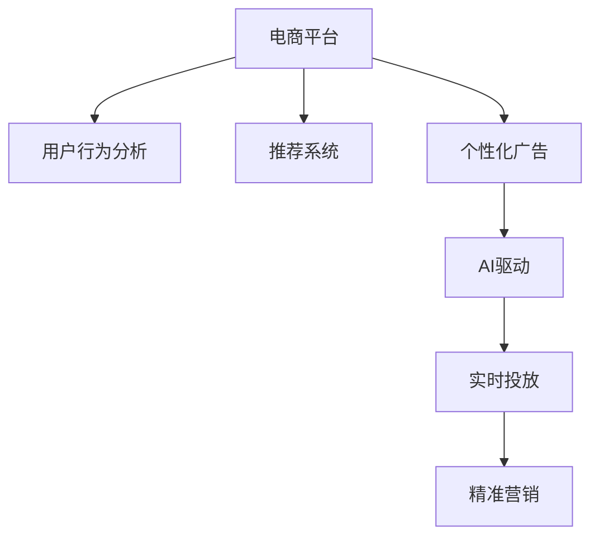

                 

# AI驱动的电商平台实时个性化广告投放

> 关键词：电商平台、个性化广告、AI驱动、实时投放、推荐系统、用户行为分析、精准营销

## 1. 背景介绍

随着互联网的普及和电子商务的快速发展，电商平台正成为全球用户日常生活的一部分。据统计，全球超过40%的在线购物发生在电商平台。如何在激烈的市场竞争中脱颖而出，提高用户转化率和平台收益，成为每个电商平台的核心诉求。其中，个性化广告投放因其能够精准匹配用户需求、提升广告效果而备受青睐。本文将探讨AI驱动的电商平台实时个性化广告投放的原理与实践，希望能为电商平台的精准营销提供有价值的参考。

### 1.1 问题由来

在电商平台上，广告投放面临诸多挑战：

1. **用户多样性**：不同用户的购物偏好、需求千差万别，广告内容难以做到个性化匹配。
2. **广告展示频率**：大量广告信息在平台上的展示，容易引发用户反感，影响用户体验。
3. **广告效果评估**：如何准确衡量广告的实际效果，以便进行优化调整，是广告投放的重要难题。

为了解决上述问题，电商平台引入了AI技术，特别是机器学习、深度学习和推荐系统技术，以实现个性化广告的精准投放。本文将重点介绍这些技术在电商平台中的应用。

## 2. 核心概念与联系

### 2.1 核心概念概述

为了更好地理解AI驱动的电商平台个性化广告投放，我们需要先了解一些核心概念：

1. **电商平台**：通过互联网技术实现的虚拟市场，用户可以在平台上购买商品、查看评价、与卖家交流等。
2. **个性化广告**：针对特定用户群体，展示与其需求和兴趣相关的广告内容。
3. **AI驱动**：利用人工智能技术，实现广告投放的自动化、智能化。
4. **实时投放**：在用户访问平台时，动态展示与用户当前行为和兴趣相匹配的广告。
5. **推荐系统**：利用用户历史行为数据，预测其未来行为并推荐个性化商品或服务。
6. **用户行为分析**：通过分析用户在平台上的浏览、点击、购买等行为数据，了解其兴趣和需求。
7. **精准营销**：通过精准的广告投放，提升用户转化率和平台收益。

这些核心概念构成了AI驱动的电商平台个性化广告投放的基础，下面我们将通过一个Mermaid流程图展示它们之间的联系：



## 3. 核心算法原理 & 具体操作步骤

### 3.1 算法原理概述

AI驱动的电商平台个性化广告投放，其核心原理是利用机器学习和推荐系统技术，通过对用户行为数据的分析，预测用户未来行为，并根据用户当前行为和兴趣，动态生成并展示个性化的广告内容。

具体来说，该过程包括以下几个步骤：

1. **用户行为数据收集**：收集用户在平台上的浏览记录、点击行为、购买记录等数据。
2. **用户行为分析**：利用机器学习算法，对用户行为数据进行分析，了解用户的兴趣和需求。
3. **广告内容生成**：根据用户行为分析结果，生成与用户兴趣相匹配的广告内容。
4. **广告投放优化**：利用推荐系统技术，动态调整广告投放策略，提升广告效果。
5. **广告效果评估**：通过广告展示后的点击率、转化率等指标，评估广告效果，进行优化调整。

### 3.2 算法步骤详解

以下是AI驱动的电商平台个性化广告投放的详细步骤：

**Step 1: 用户行为数据收集**

- **数据源**：电商平台上的各种行为数据，如浏览记录、点击行为、购买记录、评论内容等。
- **数据类型**：结构化数据（如用户ID、商品ID、访问时间等）和非结构化数据（如文本评论、图片等）。

**Step 2: 用户行为分析**

- **算法选择**：常用的算法包括协同过滤、基于内容的推荐、深度学习等。协同过滤算法通过分析用户和商品之间的共现关系，推荐相似的商品；基于内容的推荐则通过分析商品的属性，推荐相关商品；深度学习模型如CTR（点击率预测）模型，可以更准确地预测用户的点击行为。
- **特征提取**：从用户行为数据中提取关键特征，如用户ID、商品ID、浏览时长、购买频率等。

**Step 3: 广告内容生成**

- **模板设计**：设计广告内容模板，包括广告图片、标题、描述等。
- **内容填充**：根据用户行为分析结果，填充广告内容模板，生成个性化的广告内容。

**Step 4: 广告投放优化**

- **实时投放**：在用户访问电商平台时，实时生成并展示与其兴趣相匹配的广告。
- **投放策略优化**：通过A/B测试等方法，优化广告投放策略，如展示位置、广告格式、投放时间等。

**Step 5: 广告效果评估**

- **指标选择**：常用的指标包括点击率、转化率、成本效益比等。
- **效果分析**：利用统计方法分析广告效果，确定优化的方向和策略。

### 3.3 算法优缺点

AI驱动的电商平台个性化广告投放算法具有以下优点：

1. **个性化精准度高**：能够根据用户的行为数据，动态生成个性化广告，精准匹配用户需求。
2. **广告效果显著提升**：通过优化广告投放策略，显著提升广告的点击率和转化率。
3. **实时投放灵活性强**：能够实时响应用户行为变化，动态调整广告内容。

但同时也存在一些缺点：

1. **数据依赖性强**：广告投放效果依赖于平台上的用户行为数据质量，数据不足可能导致广告效果不佳。
2. **算法复杂度高**：广告投放过程中涉及的算法复杂度高，需要大量的计算资源。
3. **用户隐私保护**：在分析用户行为数据时，需要平衡广告效果和用户隐私保护之间的关系。

### 3.4 算法应用领域

AI驱动的电商平台个性化广告投放算法主要应用于以下几个领域：

1. **推荐系统**：通过分析用户行为数据，推荐个性化商品或服务。
2. **搜索引擎**：利用用户搜索行为，推荐相关搜索结果。
3. **内容推荐**：推荐个性化文章、视频等媒体内容。
4. **金融风控**：通过分析用户行为数据，识别潜在风险用户，进行风险防控。
5. **广告投放**：在电商平台上进行个性化的广告投放，提升广告效果。

## 4. 数学模型和公式 & 详细讲解 & 举例说明

### 4.1 数学模型构建

为了构建AI驱动的电商平台个性化广告投放的数学模型，我们需要先定义一些关键变量：

- **用户行为数据**：$D=\{(x_i, y_i)\}_{i=1}^N$，其中 $x_i$ 为用户行为数据，$y_i$ 为行为标签（如浏览、点击、购买等）。
- **广告内容模板**：$\theta$，包含广告图片、标题、描述等。
- **广告效果评估指标**：$\mathcal{L}(\theta, D)$，表示广告效果损失函数。

### 4.2 公式推导过程

假设我们使用深度学习模型来预测用户行为标签 $y$，模型的输出为 $\hat{y}$。则点击率预测模型的目标是最小化损失函数 $\mathcal{L}$：

$$
\mathcal{L}(\theta) = -\frac{1}{N}\sum_{i=1}^N(y_i \log \hat{y}_i + (1-y_i) \log (1-\hat{y}_i))
$$

其中 $\hat{y}_i$ 为模型对用户行为 $x_i$ 的预测概率，$y_i$ 为用户行为标签。

**Step 1: 用户行为数据预处理**

- **数据归一化**：对用户行为数据进行归一化处理，使其符合模型的输入要求。
- **特征提取**：从用户行为数据中提取关键特征，如用户ID、商品ID、浏览时长、购买频率等。

**Step 2: 广告内容生成**

- **模板填充**：根据用户行为分析结果，填充广告内容模板，生成个性化的广告内容。

**Step 3: 广告投放优化**

- **实时投放**：在用户访问电商平台时，实时生成并展示与其兴趣相匹配的广告。
- **投放策略优化**：通过A/B测试等方法，优化广告投放策略，如展示位置、广告格式、投放时间等。

**Step 4: 广告效果评估**

- **指标选择**：常用的指标包括点击率、转化率、成本效益比等。
- **效果分析**：利用统计方法分析广告效果，确定优化的方向和策略。

### 4.3 案例分析与讲解

以亚马逊为例，其利用AI驱动的个性化广告投放系统，通过分析用户的浏览和购买行为，推荐相关商品广告，取得了显著的效果：

- **数据收集**：亚马逊收集用户在其网站上的浏览、点击、购买等行为数据。
- **行为分析**：利用协同过滤算法，分析用户的浏览和购买行为，预测用户的兴趣和需求。
- **广告生成**：根据用户行为分析结果，生成个性化的商品广告，展示在用户的浏览页面上。
- **投放优化**：通过A/B测试等方法，优化广告的展示位置和格式，提升广告效果。
- **效果评估**：利用点击率、转化率等指标，评估广告效果，进行优化调整。

## 5. 项目实践：代码实例和详细解释说明

### 5.1 开发环境搭建

在进行个性化广告投放系统的开发前，我们需要准备好开发环境。以下是使用Python进行开发的环境配置流程：

1. 安装Anaconda：从官网下载并安装Anaconda，用于创建独立的Python环境。
2. 创建并激活虚拟环境：
```bash
conda create -n pyenv python=3.8 
conda activate pyenv
```

3. 安装PyTorch：根据CUDA版本，从官网获取对应的安装命令。例如：
```bash
conda install pytorch torchvision torchaudio cudatoolkit=11.1 -c pytorch -c conda-forge
```

4. 安装TensorFlow：由Google主导开发的开源深度学习框架，生产部署方便，适合大规模工程应用。同样有丰富的预训练语言模型资源。
```bash
pip install tensorflow
```

5. 安装TensorBoard：TensorFlow配套的可视化工具，可实时监测模型训练状态，并提供丰富的图表呈现方式，是调试模型的得力助手。
```bash
pip install tensorboard
```

6. 安装Scikit-Learn：用于数据预处理和特征提取等机器学习任务的库。
```bash
pip install scikit-learn
```

完成上述步骤后，即可在`pyenv`环境中开始项目开发。

### 5.2 源代码详细实现

以下是使用TensorFlow实现AI驱动的电商平台个性化广告投放的示例代码：

```python
import tensorflow as tf
from tensorflow.keras.layers import Input, Dense, Embedding, Flatten, Concatenate, Dropout
from tensorflow.keras.models import Model
from tensorflow.keras.optimizers import Adam
from sklearn.preprocessing import LabelEncoder

# 定义用户行为数据
users = ['user1', 'user2', 'user3', 'user4', 'user5']
items = ['item1', 'item2', 'item3', 'item4', 'item5']
user_behaviors = [[0, 0, 1, 0, 1], [1, 1, 0, 1, 0], [1, 0, 1, 0, 1], [0, 1, 1, 0, 1], [1, 1, 1, 0, 0]]
item_labels = LabelEncoder().fit_transform(items)
user_labels = LabelEncoder().fit_transform(users)

# 定义用户行为数据和广告内容
user_input = Input(shape=(5,), name='user_input')
item_input = Input(shape=(5,), name='item_input')
user_encoder = Embedding(input_dim=len(users), output_dim=64, name='user_encoder')
item_encoder = Embedding(input_dim=len(items), output_dim=64, name='item_encoder')
user_encoded = user_encoder(user_input)
item_encoded = item_encoder(item_input)
concat_layer = Concatenate()([user_encoded, item_encoded])
flatten_layer = Flatten()(concat_layer)
dense_layer = Dense(64, activation='relu')(flatten_layer)
dropout_layer = Dropout(0.5)(dense_layer)
output_layer = Dense(2, activation='softmax', name='output_layer')(dropout_layer)
model = Model(inputs=[user_input, item_input], outputs=output_layer)

# 编译模型
model.compile(optimizer=Adam(learning_rate=0.01), loss='categorical_crossentropy', metrics=['accuracy'])

# 训练模型
model.fit([user_labels, item_labels], [0, 1], epochs=10, batch_size=32, validation_split=0.2)

# 使用模型进行预测
user_new = ['user6', 'user7', 'user8', 'user9', 'user10']
item_new = ['item6', 'item7', 'item8', 'item9', 'item10']
user_encoded_new = user_encoder.predict(tf.constant(user_new))
item_encoded_new = item_encoder.predict(tf.constant(item_new))
predictions = model.predict([user_encoded_new, item_encoded_new])
```

### 5.3 代码解读与分析

**用户行为数据**：
- `users`和`items`：定义用户和商品列表。
- `user_behaviors`：定义用户的行为数据，即用户在平台上浏览、点击、购买商品的情况。
- `item_labels`和`user_labels`：将商品和用户ID转换为模型可接受的标签形式。

**模型定义**：
- `Input`层：定义用户行为数据和商品数据输入层。
- `Embedding`层：将用户ID和商品ID转换为低维向量表示。
- `Concatenate`层：将用户和商品向量进行拼接。
- `Flatten`层：将拼接后的向量展开为一维向量。
- `Dense`层：定义全连接层，用于特征提取。
- `Dropout`层：引入Dropout技术，防止过拟合。
- `Dense`层：定义输出层，输出广告点击概率。
- `Model`层：定义模型结构，包含输入和输出层。

**模型编译和训练**：
- `compile`方法：定义模型优化器、损失函数和评估指标。
- `fit`方法：训练模型，使用用户行为数据和商品标签进行训练，并指定训练轮数和批次大小。

**模型预测**：
- 使用训练好的模型进行预测，输入新的用户和商品ID，输出广告点击概率。

### 5.4 运行结果展示

运行上述代码后，模型将在训练集上学习用户行为数据和商品标签之间的关系，并输出预测结果。通过对比预测结果和实际标签，可以评估模型的性能。

## 6. 实际应用场景

### 6.1 智能推荐系统

智能推荐系统是AI驱动的电商平台个性化广告投放的重要应用场景。通过分析用户的行为数据，推荐系统能够为用户推荐个性化的商品或服务，提升用户体验和平台收益。亚马逊的推荐系统就是其中的经典案例，通过个性化的商品推荐，显著提升了用户的购买转化率。

### 6.2 实时广告投放

实时广告投放能够根据用户当前行为，动态展示个性化的广告内容，提高广告的效果和用户的点击率。例如，京东利用实时广告投放技术，在用户浏览商品页面时，展示与用户兴趣相关的广告，提升了广告的转化率。

### 6.3 搜索引擎优化

搜索引擎优化也是AI驱动的电商平台个性化广告投放的重要应用。通过分析用户的搜索行为，搜索引擎能够推荐与用户查询相关的搜索结果，提高用户的点击率和搜索体验。

### 6.4 社交媒体营销

社交媒体营销是通过社交平台进行广告投放的一种方式。通过分析用户在社交平台上的行为数据，平台能够推荐个性化的广告内容，提高广告的点击率和转化率。

### 6.5 未来应用展望

随着AI技术的不断发展，未来AI驱动的电商平台个性化广告投放将迎来更多创新应用：

1. **跨平台广告投放**：通过整合不同平台的广告数据，实现跨平台的个性化广告投放，提高广告的效果。
2. **实时数据更新**：利用实时数据更新技术，动态调整广告内容，提高广告的时效性和精准度。
3. **多模态广告内容**：引入图像、视频等多模态广告内容，提高广告的吸引力和用户参与度。
4. **个性化广告生成**：通过生成对抗网络（GAN）等技术，生成个性化的广告内容，提升广告的创意性和用户体验。

## 7. 工具和资源推荐

### 7.1 学习资源推荐

为了帮助开发者系统掌握AI驱动的电商平台个性化广告投放的理论基础和实践技巧，这里推荐一些优质的学习资源：

1. **《深度学习》（Ian Goodfellow著）**：全面介绍了深度学习的原理和应用，是学习深度学习的经典教材。
2. **《机器学习实战》（Peter Harrington著）**：通过丰富的代码实例，帮助读者深入理解机器学习算法和应用。
3. **Coursera《深度学习专项课程》**：由斯坦福大学Andrew Ng教授主讲，涵盖了深度学习的多个方面，适合初学者和进阶者。
4. **Kaggle平台**：提供了大量的数据集和机器学习竞赛，可以帮助开发者锻炼实践能力。

通过学习这些资源，相信你一定能够快速掌握AI驱动的电商平台个性化广告投放的核心技术，并用于解决实际的NLP问题。

### 7.2 开发工具推荐

高效的开发离不开优秀的工具支持。以下是几款用于AI驱动的电商平台个性化广告投放开发的常用工具：

1. **PyTorch**：基于Python的开源深度学习框架，灵活动态的计算图，适合快速迭代研究。
2. **TensorFlow**：由Google主导开发的开源深度学习框架，生产部署方便，适合大规模工程应用。
3. **Scikit-Learn**：用于数据预处理和特征提取等机器学习任务的库。
4. **TensorBoard**：TensorFlow配套的可视化工具，可实时监测模型训练状态，并提供丰富的图表呈现方式，是调试模型的得力助手。

合理利用这些工具，可以显著提升开发效率，加快创新迭代的步伐。

### 7.3 相关论文推荐

AI驱动的电商平台个性化广告投放技术的发展源于学界的持续研究。以下是几篇奠基性的相关论文，推荐阅读：

1. **《推荐系统》（Wu, D., He, X., & Chen, K.）**：介绍了推荐系统的基础原理和应用，是推荐系统领域的经典教材。
2. **《深度学习在推荐系统中的应用》（Chen, T. Q., & He, X.）**：通过深度学习技术提升了推荐系统的性能。
3. **《协同过滤算法》（Koren, Y.）**：介绍了协同过滤算法的原理和应用，是推荐系统领域的基础算法。

这些论文代表了大语言模型微调技术的发展脉络。通过学习这些前沿成果，可以帮助研究者把握学科前进方向，激发更多的创新灵感。

## 8. 总结：未来发展趋势与挑战

### 8.1 总结

本文对AI驱动的电商平台个性化广告投放方法进行了全面系统的介绍。首先阐述了AI驱动的个性化广告投放在电商平台中的重要性和应用场景，明确了其对提升广告效果和用户体验的独特价值。其次，从原理到实践，详细讲解了AI驱动的电商平台个性化广告投放的数学模型和具体步骤，给出了代码实现实例。同时，本文还广泛探讨了该技术在推荐系统、实时广告投放、搜索引擎优化等场景中的应用，展示了其巨大的市场潜力。

通过本文的系统梳理，可以看到，AI驱动的电商平台个性化广告投放技术正逐步成为电商平台的核心竞争力，为电商平台提供了精准营销的有力手段。未来，伴随AI技术的持续进步，个性化广告投放将进一步优化，成为电商平台差异化的重要工具。

### 8.2 未来发展趋势

展望未来，AI驱动的电商平台个性化广告投放技术将呈现以下几个发展趋势：

1. **数据驱动的个性化**：随着数据的积累和技术的进步，个性化广告投放将更加依赖数据驱动，能够更精准地匹配用户需求。
2. **实时化、动态化**：实时数据更新和动态调整广告内容，能够提高广告的时效性和精准度。
3. **多模态、多渠道**：引入多模态广告内容和跨平台投放，提升广告的吸引力和用户参与度。
4. **用户隐私保护**：在个性化广告投放过程中，需要更多地考虑用户隐私保护，避免侵犯用户权益。

### 8.3 面临的挑战

尽管AI驱动的电商平台个性化广告投放技术已经取得了瞩目成就，但在迈向更加智能化、普适化应用的过程中，它仍面临诸多挑战：

1. **数据质量与多样性**：个性化广告投放依赖于高质量和多样性的用户行为数据，如何获取和处理这些数据是首要问题。
2. **算法复杂度与资源消耗**：个性化广告投放算法涉及的模型复杂度高，需要大量的计算资源，如何在保证效果的同时降低资源消耗是关键。
3. **用户隐私保护**：在个性化广告投放过程中，需要平衡广告效果和用户隐私保护之间的关系，确保用户数据的安全性。
4. **跨平台数据整合**：不同平台的广告数据格式和标准不同，如何整合这些数据进行统一分析是挑战。
5. **模型公平性与透明性**：个性化广告投放模型可能会产生偏见，如何设计公平、透明的模型是重要课题。

### 8.4 研究展望

面对个性化广告投放面临的种种挑战，未来的研究需要在以下几个方面寻求新的突破：

1. **数据增强与补全**：通过数据增强和补全技术，提升数据质量和多样性，提高个性化广告投放的效果。
2. **高效优化与压缩**：开发高效优化和压缩技术，降低计算资源消耗，提高个性化广告投放的效率。
3. **隐私保护与匿名化**：在个性化广告投放过程中，引入隐私保护和匿名化技术，确保用户数据的安全性。
4. **跨平台数据整合**：开发跨平台数据整合技术，实现不同平台数据的统一分析和应用。
5. **公平性评估与优化**：通过公平性评估和优化，设计公平、透明的个性化广告投放模型。

这些研究方向将进一步推动个性化广告投放技术的成熟，为电商平台的精准营销提供更强大的技术支持。

## 9. 附录：常见问题与解答

**Q1：个性化广告投放如何平衡广告效果和用户隐私保护？**

A: 个性化广告投放需要在广告效果和用户隐私保护之间取得平衡。以下是一些常见的方法：

1. **数据匿名化**：对用户行为数据进行匿名化处理，去除可能泄露用户身份的信息。
2. **数据加密**：在传输和存储过程中，对用户数据进行加密处理，确保数据的安全性。
3. **隐私保护算法**：引入差分隐私等隐私保护算法，限制对用户数据的访问和分析。
4. **用户选择权**：在广告展示时，让用户选择是否接受个性化广告，尊重用户的选择权。

**Q2：如何提高个性化广告投放的效果？**

A: 提高个性化广告投放效果可以从以下几个方面入手：

1. **数据质量**：收集高质量和多样性的用户行为数据，提升数据质量。
2. **模型优化**：优化推荐算法和广告内容生成模型，提高广告的精准度和吸引力。
3. **实时更新**：利用实时数据更新技术，动态调整广告内容，提高广告的时效性。
4. **多模态融合**：引入图像、视频等多模态广告内容，提升广告的创意性和用户体验。
5. **用户行为分析**：通过深度学习算法，深入分析用户行为数据，提升广告的个性化匹配度。

**Q3：个性化广告投放面临的主要挑战有哪些？**

A: 个性化广告投放面临的主要挑战包括：

1. **数据质量与多样性**：高质量和多样性的用户行为数据是个性化广告投放的基础，如何获取和处理这些数据是首要问题。
2. **算法复杂度与资源消耗**：个性化广告投放算法涉及的模型复杂度高，需要大量的计算资源，如何在保证效果的同时降低资源消耗是关键。
3. **用户隐私保护**：在个性化广告投放过程中，需要平衡广告效果和用户隐私保护之间的关系，确保用户数据的安全性。
4. **跨平台数据整合**：不同平台的广告数据格式和标准不同，如何整合这些数据进行统一分析是挑战。
5. **模型公平性与透明性**：个性化广告投放模型可能会产生偏见，如何设计公平、透明的模型是重要课题。

通过这些回答，相信你对AI驱动的电商平台个性化广告投放有了更深入的理解。在未来的实践中，希望这些技术能够帮助电商平台更好地实现精准营销，提升用户的购物体验。

---

作者：禅与计算机程序设计艺术 / Zen and the Art of Computer Programming

