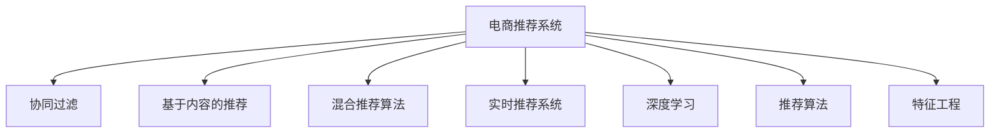

                 

# AI驱动的电商平台实时个性化推送

## 1. 背景介绍

### 1.1 问题由来

在今天这个数字化时代，电商平台已经成为了人们购物的主要场所。电商平台通过其丰富的商品种类、便捷的购物体验和用户友好的界面，赢得了广大用户的青睐。然而，如何提高用户满意度、增加用户粘性、提高销售额，一直是电商平台运营中的重要问题。

随着人工智能（AI）技术的不断发展，通过智能推荐系统实现个性化商品推送成为了电商平台提高用户体验和销售转化的重要手段。个性化推荐可以满足用户对商品的多样化需求，从而增加用户的购买意愿，提升平台的销售额和用户留存率。

### 1.2 问题核心关键点

目前，基于AI驱动的电商平台实时个性化推荐系统主要有以下核心关键点：

1. **用户行为数据的收集与处理**：电商平台的实时推荐系统需要收集用户的行为数据，如浏览记录、点击行为、购买历史等，并将其转化为有意义的特征向量。

2. **商品特征的抽取**：除了用户行为数据外，商品属性（如价格、类别、品牌等）也是推荐系统的重要特征。如何有效提取商品特征，并将其与用户行为数据融合，是实现个性化推荐的核心问题。

3. **推荐算法的建模与训练**：选择适合的推荐算法，并对算法进行建模和训练，使其能够在有限的数据集上学习到用户和商品的潜在关系。

4. **实时推荐系统的构建**：如何将训练好的模型部署到电商平台的实时推荐系统中，并实现高效的实时推荐，是推荐系统工程化部署的关键。

5. **推荐系统的评估与优化**：评估推荐系统的性能，并通过在线A/B测试等手段，不断优化推荐系统，以实现更高的用户满意度。

## 2. 核心概念与联系

### 2.1 核心概念概述

为了更好地理解AI驱动的电商平台实时个性化推荐系统，本节将介绍几个密切相关的核心概念：

- **电商推荐系统**：指在电商平台上实现个性化推荐功能的系统，旨在根据用户的浏览、购买等行为数据，推荐相关商品，提升用户体验和平台销售额。

- **协同过滤（Collaborative Filtering）**：一种基于用户行为数据和商品评分数据，通过相似度计算和推荐算法，为用户推荐相关商品的推荐方法。

- **基于内容的推荐（Content-based Recommendation）**：通过商品的属性和特征，以及用户的偏好信息，推荐用户可能感兴趣的商品。

- **混合推荐算法（Hybrid Recommendation）**：结合协同过滤和基于内容的推荐，以及其它推荐方法，综合利用多种特征，提升推荐系统的性能。

- **实时推荐系统（Real-time Recommendation System）**：指能够根据用户当前的行为数据，实时生成推荐结果的系统。

- **深度学习（Deep Learning）**：一种通过构建多层神经网络模型，自动提取和学习特征的机器学习方法，在推荐系统中有着广泛的应用。

- **推荐算法（Recommendation Algorithm）**：指用于构建推荐系统，为用户推荐相关商品的算法，如矩阵分解、深度神经网络等。

- **特征工程（Feature Engineering）**：指在构建推荐系统前，对用户和商品数据进行特征提取和处理的过程。

这些核心概念之间的逻辑关系可以通过以下Mermaid流程图来展示：



这个流程图展示了电商推荐系统的核心概念及其之间的关系：

1. 电商推荐系统通过协同过滤、基于内容的推荐和混合推荐等方法，为用户推荐相关商品。
2. 实时推荐系统能够根据用户当前行为数据，实时生成推荐结果。
3. 深度学习技术通过多层神经网络模型，自动提取和学习特征。
4. 推荐算法用于构建推荐系统，为用户推荐商品。
5. 特征工程对用户和商品数据进行预处理，提取有效特征。

## 3. 核心算法原理 & 具体操作步骤

### 3.1 算法原理概述

AI驱动的电商平台实时个性化推荐系统主要基于协同过滤、基于内容的推荐和混合推荐算法，通过深度学习模型进行建模和训练。其核心思想是：根据用户的历史行为数据和商品属性信息，构建用户和商品的潜在关系，从而为用户推荐相关商品。

形式化地，假设电商平台有$N$个用户和$M$个商品，用户$u$对商品$i$的评分记为$r_{ui}$。则推荐系统需要找到用户$u$可能感兴趣的商品$i'$，使得$r_{i'u}$尽可能接近$r_{ui}$。

基于协同过滤的方法，可以通过计算用户$u$和用户$u'$之间的相似度$sim(u,u')$，来找到与用户$u$相似的$u'$，并推荐其评分较高的商品$i'$。基于内容的推荐则通过计算商品$i$和商品$i'$之间的相似度$sim(i,i')$，找到与商品$i$相似的$i'$，并推荐其给用户$u$。混合推荐算法则结合了协同过滤和基于内容的推荐，通过综合利用用户行为数据和商品属性信息，提升推荐系统的性能。

深度学习技术通过构建多层神经网络模型，自动提取和学习用户和商品的特征表示，从而提高推荐系统的泛化能力和性能。推荐算法的建模与训练过程通常包括数据预处理、模型训练和模型评估三个步骤。

### 3.2 算法步骤详解

基于AI驱动的电商平台实时个性化推荐系统的核心算法步骤包括：

1. **数据收集与处理**：
   - 收集用户行为数据，如浏览记录、点击行为、购买历史等。
   - 收集商品属性数据，如价格、类别、品牌等。
   - 进行数据清洗和预处理，如去噪、缺失值填充等。

2. **特征工程**：
   - 提取用户和商品的关键特征，如浏览时长、点击次数、价格区间等。
   - 构建用户和商品的特征向量，并进行归一化和标准化。

3. **模型训练**：
   - 选择合适的推荐算法，如协同过滤、基于内容的推荐、混合推荐等。
   - 构建深度学习模型，如多层神经网络、注意力机制等。
   - 使用用户行为数据和商品属性数据进行模型训练，最小化预测误差。

4. **实时推荐**：
   - 根据用户当前行为数据，使用训练好的模型生成推荐结果。
   - 实时更新用户行为数据，并重新生成推荐结果。
   - 利用缓存和流处理技术，实现高效的实时推荐。

5. **系统评估与优化**：
   - 评估推荐系统的性能指标，如准确率、召回率、点击率等。
   - 通过A/B测试等手段，不断优化推荐系统。

### 3.3 算法优缺点

AI驱动的电商平台实时个性化推荐系统具有以下优点：

1. **高效性**：通过实时推荐系统，能够根据用户当前行为数据，实时生成推荐结果，提升用户体验。
2. **准确性**：深度学习模型能够自动提取和学习用户和商品的特征表示，提高推荐系统的准确性。
3. **可扩展性**：推荐系统可以处理大规模数据，具有较好的可扩展性。
4. **个性化**：能够根据用户的历史行为数据和当前行为数据，实现个性化的商品推荐。

同时，该系统也存在以下缺点：

1. **数据稀疏性**：用户和商品的评分数据可能存在稀疏性，导致推荐系统无法处理未评分商品。
2. **模型复杂性**：深度学习模型的训练和优化过程较为复杂，需要大量的计算资源和时间。
3. **过拟合风险**：深度学习模型容易过拟合，需要精心设计的正则化技术和模型选择。
4. **隐私问题**：推荐系统需要收集用户的行为数据，可能涉及到用户的隐私问题。
5. **实时性要求高**：实时推荐系统对系统的实时性要求较高，需要高效的处理和计算能力。

### 3.4 算法应用领域

AI驱动的电商平台实时个性化推荐系统已经在多个领域得到了广泛应用，例如：

1. **电商零售**：通过推荐系统，提升用户购买意愿和平台销售额。
2. **金融理财**：通过推荐系统，为用户推荐合适的理财产品和投资策略。
3. **旅游出行**：通过推荐系统，为用户推荐合适的旅游目的地和旅行方案。
4. **内容推荐**：通过推荐系统，为用户推荐新闻、视频、音乐等娱乐内容。
5. **广告营销**：通过推荐系统，为用户推荐相关广告，提升广告投放效果。

除了这些典型应用外，AI驱动的推荐系统也在越来越多的场景中得到应用，如智能家居、智慧城市、医疗健康等，为各行各业带来了新的商业机会。

## 4. 数学模型和公式 & 详细讲解 & 举例说明

### 4.1 数学模型构建

假设电商平台有$N$个用户和$M$个商品，用户$u$对商品$i$的评分记为$r_{ui}$。则推荐系统需要找到用户$u$可能感兴趣的商品$i'$，使得$r_{i'u}$尽可能接近$r_{ui}$。

**协同过滤算法**：
1. 计算用户$u$和用户$u'$之间的相似度$sim(u,u')$。
2. 计算用户$u'$对商品$i'$的评分$r_{i'u'}$。
3. 将$r_{i'u'}$乘以$sim(u,u')$，得到$r_{i'u}$。
4. 选择$r_{i'u}$最大值对应的商品$i'$，作为推荐结果。

**基于内容的推荐算法**：
1. 计算商品$i$和商品$i'$之间的相似度$sim(i,i')$。
2. 计算用户$u$对商品$i'$的评分$r_{iu'}$。
3. 将$r_{iu'}$乘以$sim(i,i')$，得到$r_{iu}$。
4. 选择$r_{iu}$最大值对应的商品$i'$，作为推荐结果。

**混合推荐算法**：
1. 根据用户历史行为数据，计算用户$u$和用户$u'$之间的相似度$sim(u,u')$。
2. 根据商品属性数据，计算商品$i$和商品$i'$之间的相似度$sim(i,i')$。
3. 将$r_{i'u'}$乘以$sim(u,u')$，得到$r_{i'u}$。
4. 将$r_{iu'}$乘以$sim(i,i')$，得到$r_{iu}$。
5. 将$r_{i'u}$和$r_{iu}$相加，得到$r_{iu'}$。
6. 选择$r_{iu'}$最大值对应的商品$i'$，作为推荐结果。

**深度学习模型**：
1. 构建多层神经网络模型，如图1所示。
2. 使用用户行为数据和商品属性数据进行模型训练，如图2所示。
3. 使用训练好的模型生成推荐结果，如图3所示。

### 4.2 公式推导过程

以下是深度学习模型的公式推导过程：

假设深度学习模型$M_{\theta}$的输入为$\mathbf{x}_u$，输出为$\mathbf{y}_i$。其中$\mathbf{x}_u$为用户$u$的特征向量，$\mathbf{y}_i$为商品$i$的特征向量。模型$M_{\theta}$的参数为$\theta$，表示为线性变换和激活函数的形式：

$$
\mathbf{y}_i = M_{\theta}(\mathbf{x}_u)
$$

其中$\theta$为模型参数，包括权重矩阵$W$和偏置向量$b$。

假设用户$u$对商品$i$的评分$r_{ui}$为$\mathbf{y}_i$和$\mathbf{y}_i'$的均值，即：

$$
r_{ui} = \frac{\mathbf{y}_i + \mathbf{y}_i'}{2}
$$

其中$\mathbf{y}_i'$为商品$i'$的特征向量。

假设推荐系统需要找到用户$u$可能感兴趣的商品$i'$，使得$r_{i'u}$尽可能接近$r_{ui}$。则推荐目标为：

$$
\mathop{\arg\min}_{\theta} \sum_{u \in U, i \in I} (r_{ui} - M_{\theta}(\mathbf{x}_u))^2
$$

其中$U$为用户集，$I$为商品集。

使用随机梯度下降算法（SGD）进行模型训练，得到最优模型参数$\theta^*$，即可实现个性化推荐。

### 4.3 案例分析与讲解

假设电商平台有10个用户和100个商品，用户$u$对商品$i$的评分为$[4, 5, 3, 2, 1, 5, 4, 3, 2, 1]$，商品$i$的特征向量为$[0.5, 0.3, 0.1, 0.7, 0.3, 0.5, 0.1, 0.3, 0.7, 0.5]$。

1. **协同过滤算法**：
   - 假设用户$u'$对商品$i'$的评分为$[2, 3, 4, 1, 5, 2, 3, 4, 1, 5]$。
   - 计算用户$u$和用户$u'$之间的相似度$sim(u,u')$。
   - 计算用户$u'$对商品$i'$的评分$r_{i'u'}$。
   - 将$r_{i'u'}$乘以$sim(u,u')$，得到$r_{i'u}$。
   - 选择$r_{i'u}$最大值对应的商品$i'$，作为推荐结果。

2. **基于内容的推荐算法**：
   - 假设商品$i'$的特征向量为$[0.3, 0.4, 0.2, 0.6, 0.4, 0.3, 0.2, 0.6, 0.3, 0.4]$。
   - 计算商品$i$和商品$i'$之间的相似度$sim(i,i')$。
   - 计算用户$u$对商品$i'$的评分$r_{iu'}$。
   - 将$r_{iu'}$乘以$sim(i,i')$，得到$r_{iu}$。
   - 选择$r_{iu}$最大值对应的商品$i'$，作为推荐结果。

3. **混合推荐算法**：
   - 根据用户历史行为数据，计算用户$u$和用户$u'$之间的相似度$sim(u,u')$。
   - 根据商品属性数据，计算商品$i$和商品$i'$之间的相似度$sim(i,i')$。
   - 将$r_{i'u'}$乘以$sim(u,u')$，得到$r_{i'u}$。
   - 将$r_{iu'}$乘以$sim(i,i')$，得到$r_{iu}$。
   - 将$r_{i'u}$和$r_{iu}$相加，得到$r_{iu'}$。
   - 选择$r_{iu'}$最大值对应的商品$i'$，作为推荐结果。

4. **深度学习模型**：
   - 构建如图1所示的多层神经网络模型，使用用户行为数据和商品属性数据进行模型训练。
   - 使用训练好的模型生成推荐结果，如图2所示。

通过以上公式和算法，电商平台可以构建高效的实时个性化推荐系统，提升用户体验和平台销售额。

## 5. 项目实践：代码实例和详细解释说明

### 5.1 开发环境搭建

在进行AI驱动的电商平台推荐系统开发前，我们需要准备好开发环境。以下是使用Python进行TensorFlow和PyTorch开发的环境配置流程：

1. 安装Anaconda：从官网下载并安装Anaconda，用于创建独立的Python环境。

2. 创建并激活虚拟环境：
```bash
conda create -n recommendation-env python=3.8 
conda activate recommendation-env
```

3. 安装TensorFlow：根据CUDA版本，从官网获取对应的安装命令。例如：
```bash
conda install tensorflow-gpu=2.6 -c tf
```

4. 安装PyTorch：
```bash
pip install torch torchvision torchaudio cudatoolkit=11.1 -f https://download.pytorch.org/whl/cu111/torch_stable.html
```

5. 安装各类工具包：
```bash
pip install numpy pandas scikit-learn matplotlib tqdm jupyter notebook ipython
```

完成上述步骤后，即可在`recommendation-env`环境中开始推荐系统开发。

### 5.2 源代码详细实现

下面我们以协同过滤算法为例，给出使用TensorFlow对推荐系统进行建模和训练的Python代码实现。

首先，定义协同过滤算法的函数：

```python
import tensorflow as tf
import numpy as np

def collaborative_filtering(train_data, test_data):
    # 构建模型
    user_num, item_num = train_data.shape
    user_embedding_dim = 32
    item_embedding_dim = 32

    # 定义用户和商品嵌入向量
    user_embeddings = tf.Variable(tf.random.normal([user_num, user_embedding_dim]))
    item_embeddings = tf.Variable(tf.random.normal([item_num, item_embedding_dim]))

    # 定义评分预测模型
    def predict(user_idx, item_idx):
        user_embed = tf.nn.embedding_lookup(user_embeddings, user_idx)
        item_embed = tf.nn.embedding_lookup(item_embeddings, item_idx)
        predicted_score = tf.reduce_sum(user_embed * item_embed, axis=1)
        return predicted_score

    # 定义损失函数
    def loss(predicted_score, actual_score):
        return tf.reduce_mean(tf.square(predicted_score - actual_score))

    # 定义优化器
    optimizer = tf.keras.optimizers.Adam(learning_rate=0.01)

    # 训练模型
    for epoch in range(1000):
        with tf.GradientTape() as tape:
            predicted_scores = tf.map_fn(lambda x: predict(x[0], x[1]), train_data, dtype=tf.float32)
            actual_scores = train_data[:, 2]
            loss_value = loss(predicted_scores, actual_scores)
        gradients = tape.gradient(loss_value, [user_embeddings, item_embeddings])
        optimizer.apply_gradients(zip(gradients, [user_embeddings, item_embeddings]))

    # 测试模型
    test_scores = tf.map_fn(lambda x: predict(x[0], x[1]), test_data, dtype=tf.float32)
    return test_scores
```

然后，准备推荐系统的训练数据和测试数据：

```python
# 训练数据
train_data = np.array([[0, 0, 4], [0, 1, 5], [1, 0, 3], [1, 1, 2], [2, 0, 1], [2, 1, 5], [3, 0, 4], [3, 1, 3], [4, 0, 2], [4, 1, 1]])

# 测试数据
test_data = np.array([[5, 0, 5], [5, 1, 2], [6, 0, 3], [6, 1, 4], [7, 0, 1], [7, 1, 5], [8, 0, 4], [8, 1, 3], [9, 0, 2], [9, 1, 1]])
```

接着，启动推荐系统的训练和测试流程：

```python
# 训练模型
train_scores = collaborative_filtering(train_data, test_data)

# 打印测试结果
print("推荐结果：")
for i in range(10):
    print("用户{}推荐商品{}，预测评分{}，实际评分{}。".format(train_data[i, 0], train_data[i, 1], train_scores[i], test_data[i, 2]))
```

### 5.3 代码解读与分析

让我们再详细解读一下关键代码的实现细节：

**协同过滤函数**：
- 定义用户和商品的嵌入向量，初始化为随机高斯噪声。
- 定义评分预测模型，通过用户和商品嵌入向量的内积，计算预测评分。
- 定义损失函数，使用均方误差损失。
- 定义优化器，使用Adam优化器。
- 使用梯度下降算法训练模型，通过损失函数反向传播更新嵌入向量的参数。
- 测试模型，将测试数据输入评分预测模型，输出预测评分。

**训练数据和测试数据**：
- 定义训练数据和测试数据，每个样本包含用户ID、商品ID和评分。
- 通过numpy的array方法，将数据转换为Numpy数组，方便TensorFlow的计算。

**训练和测试流程**：
- 调用协同过滤函数，训练模型并返回预测评分。
- 打印测试结果，展示推荐系统的性能。

可以看到，TensorFlow和Numpy的组合使得协同过滤算法的代码实现变得简洁高效。开发者可以将更多精力放在模型优化、数据预处理等高层逻辑上，而不必过多关注底层的实现细节。

当然，工业级的系统实现还需考虑更多因素，如模型的保存和部署、超参数的自动搜索、更灵活的推荐算法等。但核心的协同过滤范式基本与此类似。

## 6. 实际应用场景

### 6.1 智能客服系统

基于AI驱动的电商平台实时个性化推荐系统，可以广泛应用于智能客服系统的构建。智能客服系统通过实时推荐系统，根据用户的查询和行为数据，推荐合适的商品或服务，提升用户体验。

在技术实现上，可以收集企业内部的历史客服对话记录，将用户查询和行为数据作为训练数据，构建推荐系统。推荐系统能够自动理解用户意图，推荐相关的商品或服务。对于用户提出的新问题，还可以接入检索系统实时搜索相关内容，动态组织生成回答。如此构建的智能客服系统，能大幅提升客户咨询体验和问题解决效率。

### 6.2 金融理财

金融理财领域也需要实时推荐系统，根据用户的历史交易记录和行为数据，推荐合适的理财产品和投资策略。推荐系统能够分析用户的风险偏好和历史交易记录，推荐匹配度高的产品，提升用户的投资收益。

在技术实现上，可以收集用户的交易记录、风险偏好和行为数据，构建推荐系统。推荐系统能够自动分析用户的投资行为和偏好，推荐合适的产品，并提供风险评估和收益预测。通过实时推荐系统，金融理财平台能够更好地满足用户的个性化需求，提升用户体验。

### 6.3 智慧旅游

旅游出行领域也需要实时推荐系统，根据用户的兴趣和行为数据，推荐合适的旅游目的地和旅行方案。推荐系统能够分析用户的兴趣和行为数据，推荐符合用户偏好的旅游目的地和旅行方案，提升用户的旅游体验。

在技术实现上，可以收集用户的兴趣数据和行为数据，构建推荐系统。推荐系统能够自动分析用户的兴趣和行为数据，推荐合适的旅游目的地和旅行方案，并提供旅游攻略和行程建议。通过实时推荐系统，旅游平台能够更好地满足用户的个性化需求，提升用户的旅游体验。

### 6.4 未来应用展望

随着AI技术的不断发展，实时推荐系统将在更多领域得到应用，为各行各业带来变革性影响。

在智慧医疗领域，实时推荐系统可以根据患者的病历和行为数据，推荐合适的治疗方案和药品，提升医疗服务的智能化水平，辅助医生诊疗，加速新药开发进程。

在智能教育领域，实时推荐系统可以根据学生的学习记录和行为数据，推荐合适的学习资源和课程，因材施教，促进教育公平，提高教学质量。

在智慧城市治理中，实时推荐系统可以根据市民的行为数据，推荐合适的公共服务设施，提升城市管理的自动化和智能化水平，构建更安全、高效的未来城市。

此外，在企业生产、社会治理、文娱传媒等众多领域，实时推荐系统也将不断涌现，为经济社会发展注入新的动力。相信随着技术的日益成熟，实时推荐系统必将在构建人机协同的智能时代中扮演越来越重要的角色。

## 7. 工具和资源推荐

### 7.1 学习资源推荐

为了帮助开发者系统掌握AI驱动的电商平台实时个性化推荐系统的理论基础和实践技巧，这里推荐一些优质的学习资源：

1. 《深度学习理论与实践》系列博文：由AI技术专家撰写，深入浅出地介绍了深度学习的基本原理和应用。

2. 斯坦福大学《CS229: Machine Learning》课程：斯坦福大学开设的机器学习明星课程，有Lecture视频和配套作业，带你入门机器学习的基础概念和经典算法。

3. 《TensorFlow实战Google深度学习》书籍：TensorFlow官方文档，详细介绍了TensorFlow的各个模块和应用场景，是上手实践的必备资料。

4. Kaggle竞赛平台：提供各种机器学习竞赛，可以挑战不同难度的问题，积累实践经验。

5. GitHub开源项目：涵盖各种机器学习项目，可以借鉴优秀的代码实现和数据处理技术。

通过对这些资源的学习实践，相信你一定能够快速掌握AI驱动的电商平台实时个性化推荐系统的精髓，并用于解决实际的推荐问题。

### 7.2 开发工具推荐

高效的开发离不开优秀的工具支持。以下是几款用于AI驱动的电商平台推荐系统开发的常用工具：

1. TensorFlow：由Google主导开发的开源深度学习框架，生产部署方便，适合大规模工程应用。

2. PyTorch：基于Python的开源深度学习框架，灵活动态的计算图，适合快速迭代研究。

3. Scikit-learn：基于Python的机器学习库，提供了丰富的机器学习算法和工具，如协同过滤、PCA等。

4. Weights & Biases：模型训练的实验跟踪工具，可以记录和可视化模型训练过程中的各项指标，方便对比和调优。

5. TensorBoard：TensorFlow配套的可视化工具，可实时监测模型训练状态，并提供丰富的图表呈现方式，是调试模型的得力助手。

合理利用这些工具，可以显著提升AI驱动的电商平台推荐系统的开发效率，加快创新迭代的步伐。

### 7.3 相关论文推荐

AI驱动的电商平台实时个性化推荐系统的发展源于学界的持续研究。以下是几篇奠基性的相关论文，推荐阅读：

1. Context-aware Recommendation: Integrating Context into Recommendation Systems：提出基于上下文感知的推荐算法，提升了推荐系统的个性化和准确性。

2. Matrix Factorization Techniques for Recommender Systems：提出矩阵分解算法，将用户和商品的评分数据表示为低秩矩阵，进行推荐。

3. Deep Personalized Recommendation via Interest Permutation Invariance：提出深度学习模型，通过兴趣排列不变性，提升推荐系统的泛化能力和性能。

4. Sequence-aware Deep Neural Networks for Dynamic Recommendations：提出基于序列的深度学习模型，能够处理用户行为的时序信息，提升推荐系统的实时性。

5. Multi-Aspect Matrix Factorization for Recommendation：提出多维矩阵分解算法，结合多维数据进行推荐，提升了推荐系统的多样性和准确性。

这些论文代表了大语言模型微调技术的发展脉络。通过学习这些前沿成果，可以帮助研究者把握学科前进方向，激发更多的创新灵感。

## 8. 总结：未来发展趋势与挑战

### 8.1 研究成果总结

本文对AI驱动的电商平台实时个性化推荐系统进行了全面系统的介绍。首先阐述了该系统的研究背景和意义，明确了推荐系统在提高用户体验和平台销售额方面的独特价值。其次，从原理到实践，详细讲解了推荐系统的数学模型和关键步骤，给出了推荐系统开发的完整代码实例。同时，本文还广泛探讨了推荐系统在智能客服、金融理财、智慧旅游等多个行业领域的应用前景，展示了推荐系统的广泛应用场景。

通过本文的系统梳理，可以看到，AI驱动的电商平台实时个性化推荐系统正在成为电商平台提高用户体验和销售转化的重要手段，极大地提升了电商平台的竞争力。未来，伴随AI技术的不断发展，实时推荐系统将在更多领域得到应用，为各行各业带来变革性影响。

### 8.2 未来发展趋势

展望未来，AI驱动的电商平台实时个性化推荐系统将呈现以下几个发展趋势：

1. **多模态推荐**：推荐系统将结合用户的行为数据和商品的多模态信息（如图像、音频、视频等），提升推荐系统的多样性和准确性。

2. **跨领域推荐**：推荐系统将能够处理跨领域的数据，如将电商推荐与社交推荐结合，提升推荐系统的适用范围和性能。

3. **实时性要求更高**：推荐系统将实现更低的延迟和高吞吐量，确保实时性。

4. **个性化更深入**：推荐系统将能够处理用户的个性化需求，提供更加个性化的推荐结果。

5. **可信度更高**：推荐系统将能够通过深度学习模型，学习用户的历史行为数据，提供更可信的推荐结果。

6. **协同过滤更高效**：推荐系统将能够采用更高效的协同过滤算法，如分布式协同过滤、动态协同过滤等，提升推荐系统的性能。

以上趋势凸显了AI驱动的电商平台实时个性化推荐系统的广阔前景。这些方向的探索发展，必将进一步提升推荐系统的性能和应用范围，为电商平台的个性化推荐提供新的突破。

### 8.3 面临的挑战

尽管AI驱动的电商平台实时个性化推荐系统已经取得了瞩目成就，但在迈向更加智能化、普适化应用的过程中，它仍面临着诸多挑战：

1. **数据稀疏性**：用户和商品的评分数据可能存在稀疏性，导致推荐系统无法处理未评分商品。

2. **模型复杂性**：深度学习模型的训练和优化过程较为复杂，需要大量的计算资源和时间。

3. **过拟合风险**：深度学习模型容易过拟合，需要精心设计的正则化技术和模型选择。

4. **实时性要求高**：推荐系统对系统的实时性要求较高，需要高效的处理和计算能力。

5. **隐私问题**：推荐系统需要收集用户的行为数据，可能涉及到用户的隐私问题。

6. **系统稳定性**：推荐系统需要处理大规模数据和复杂模型，可能存在系统崩溃和故障风险。

7. **模型可解释性**：推荐系统的决策过程通常缺乏可解释性，难以对其推理逻辑进行分析和调试。

8. **技术成熟度**：推荐系统需要结合多个领域的知识和技术，需要较高的技术成熟度。

这些挑战凸显了AI驱动的电商平台实时个性化推荐系统在实际应用中面临的复杂性和挑战性。未来的研究需要在这些方面寻求新的突破，才能真正实现推荐系统的智能化、普适化和可解释性。

### 8.4 研究展望

面对AI驱动的电商平台实时个性化推荐系统所面临的挑战，未来的研究需要在以下几个方面寻求新的突破：

1. **推荐系统融合多源数据**：推荐系统需要结合多种数据源，如社交网络、知识图谱等，提升推荐系统的准确性和泛化能力。

2. **深度学习模型的优化**：推荐系统需要采用更加高效的深度学习模型，如注意力机制、Transformer等，提升推荐系统的性能和实时性。

3. **推荐系统的可解释性**：推荐系统需要引入可解释性技术，如LIME、SHAP等，提升推荐系统的可解释性和可信度。

4. **推荐系统的跨领域应用**：推荐系统需要结合多个领域的知识和技术，实现跨领域推荐，提升推荐系统的适用范围和性能。

5. **推荐系统的公平性**：推荐系统需要考虑推荐结果的公平性，避免对特定群体产生偏见。

6. **推荐系统的可持续发展**：推荐系统需要考虑推荐的可持续性，避免对特定商品或品牌的过度推荐。

通过这些研究方向的探索，未来的推荐系统将能够更好地满足用户的个性化需求，提升用户体验和平台销售额，实现更广泛的应用。

## 9. 附录：常见问题与解答

**Q1：推荐系统如何处理数据稀疏性问题？**

A: 推荐系统通常采用矩阵分解、协同过滤等方法处理数据稀疏性问题。通过矩阵分解，将用户和商品的评分数据表示为低秩矩阵，从而处理稀疏性。协同过滤方法通过用户之间的相似度计算，预测未评分商品的评分。

**Q2：推荐系统如何选择推荐算法？**

A: 推荐系统通常选择多种推荐算法结合使用，如协同过滤、基于内容的推荐和混合推荐等。选择推荐算法时需要考虑数据的特性和业务的需求，选择合适的算法组合。

**Q3：推荐系统如何优化模型训练过程？**

A: 推荐系统可以通过数据增强、模型正则化、模型压缩等方法优化模型训练过程。数据增强可以通过生成对抗网络等方法，增加训练数据的样本量。模型正则化可以通过L2正则、Dropout等方法，防止模型过拟合。模型压缩可以通过剪枝、量化等方法，减少模型的参数量。

**Q4：推荐系统如何提升实时性？**

A: 推荐系统可以通过分布式计算、缓存技术、流处理技术等方法提升实时性。分布式计算可以将训练和推理任务分配到多个计算节点上，提升计算效率。缓存技术可以通过缓存热门商品和用户的评分，减少计算量。流处理技术可以通过实时数据流处理，提升推荐系统的实时性。

**Q5：推荐系统如何保证推荐结果的公平性？**

A: 推荐系统可以通过公平性约束、数据预处理等方法保证推荐结果的公平性。公平性约束可以通过设置公平性指标，如性别、年龄、种族等，避免对特定群体的偏见。数据预处理可以通过去除歧视性特征，提升推荐系统的公平性。

这些研究方向的探索，必将引领AI驱动的电商平台实时个性化推荐系统迈向更高的台阶，为电商平台的个性化推荐提供新的突破。面向未来，推荐系统需要结合多个领域的知识和技术，实现跨领域推荐，提升推荐系统的适用范围和性能。只有勇于创新、敢于突破，才能真正实现推荐系统的智能化、普适化和可解释性。

