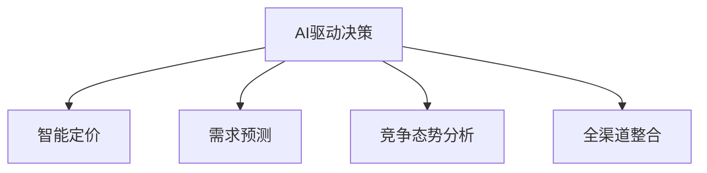

                 

# AI驱动的电商平台智能定价与竞争策略

## 1. 背景介绍

### 1.1 问题由来

在日益激烈的市场竞争中，电商平台面临着产品同质化严重、客户需求多样化的挑战。如何在众多对手中脱颖而出，提升销售额和利润，成为电商平台运营的关键问题。传统的定价策略如固定折扣、限时促销等，难以精准响应市场变化和客户需求，且容易引发价格战，导致资源浪费和利润率下降。而AI驱动的智能定价与竞争策略，则通过深度学习和数据分析，提供了动态调整价格、精准推荐产品、预测市场需求和竞争态势的新方案。

### 1.2 问题核心关键点

智能定价与竞争策略的核心在于如何利用AI技术，对市场数据进行深度挖掘，预测客户需求，识别竞争动态，动态调整产品价格和促销策略，提升平台的整体竞争力和盈利能力。具体关键点包括：

- **数据挖掘与分析**：通过大数据分析，挖掘客户行为特征、历史销售数据、市场趋势等，为定价和促销策略提供数据支持。
- **需求预测**：预测客户对不同产品的需求量，帮助平台优化库存管理和生产计划。
- **价格优化**：动态调整产品价格，以最优价格满足客户需求，提升转化率和利润率。
- **竞争态势分析**：实时监测竞争对手的动态，制定动态调整的竞争策略，保持市场竞争力。
- **多渠道整合**：整合线上线下渠道的销售数据，实现全渠道的统一管理与优化。

### 1.3 问题研究意义

实施AI驱动的智能定价与竞争策略，对于提升电商平台的市场竞争力、优化运营效率、提高客户满意度具有重要意义：

- **提升市场竞争力**：通过精准的定价和促销策略，有效应对市场变化和客户需求，保持平台的高竞争力。
- **优化运营效率**：借助AI技术，自动化地进行数据挖掘和分析，减少人工干预，提升运营效率。
- **提高客户满意度**：通过个性化推荐和动态定价，提升客户体验，增强客户粘性。
- **增强盈利能力**：通过优化定价和促销策略，实现销售额和利润率的提升。
- **赋能全渠道运营**：实现多渠道数据的整合与分析，提升全渠道运营效率和客户体验。

## 2. 核心概念与联系

### 2.1 核心概念概述

为更好地理解AI驱动的智能定价与竞争策略，本节将介绍几个密切相关的核心概念：

- **AI驱动决策**：指利用机器学习、深度学习等AI技术，对海量数据进行深度挖掘和分析，辅助决策。
- **智能定价**：通过分析客户需求、市场趋势、竞争对手动态等信息，动态调整产品价格，以最优价格满足客户需求，提升销售和利润。
- **需求预测**：通过历史销售数据、客户行为分析等，预测未来的需求量和趋势，帮助平台优化库存管理和生产计划。
- **竞争态势分析**：实时监测竞争对手的价格、促销策略、市场表现等，制定动态调整的竞争策略，保持市场领先。
- **全渠道整合**：整合线上线下渠道的销售数据，实现统一管理和优化，提升全渠道运营效率和客户体验。

这些核心概念之间的逻辑关系可以通过以下Mermaid流程图来展示：



这个流程图展示了大数据驱动的智能决策范式：

1. 利用AI技术对市场数据进行深度挖掘和分析，形成对客户需求、市场趋势、竞争对手动态的全面理解。
2. 基于对客户需求和市场趋势的预测，制定动态定价策略，实现最优价格。
3. 通过实时监测竞争对手动态，调整竞争策略，保持市场领先。
4. 整合线上线下渠道数据，实现全渠道的统一管理和优化。

## 3. 核心算法原理 & 具体操作步骤

### 3.1 算法原理概述

AI驱动的智能定价与竞争策略，主要基于以下几个核心算法：

- **深度学习模型**：如神经网络、卷积神经网络(CNN)、循环神经网络(RNN)等，用于处理和分析市场数据，挖掘客户需求特征和市场趋势。
- **时间序列预测模型**：如ARIMA、LSTM等，用于预测客户需求和市场趋势。
- **博弈论模型**：如纳什均衡、零和博弈等，用于分析竞争对手策略，制定最优的竞争策略。
- **优化算法**：如梯度下降、遗传算法等，用于求解定价和促销策略的最优解。

这些算法通过数据驱动的方式，提供精准的决策支持，提升平台的市场竞争力和运营效率。

### 3.2 算法步骤详解

AI驱动的智能定价与竞争策略通常包括以下几个关键步骤：

**Step 1: 数据收集与预处理**
- 收集电商平台的历史销售数据、客户行为数据、市场趋势数据、竞争对手动态数据等。
- 对数据进行清洗、去重、归一化等预处理，确保数据质量。

**Step 2: 特征工程**
- 根据业务需求和数据特点，设计合适的特征，如用户历史购买记录、浏览记录、地理位置、时间特征等。
- 对特征进行编码，准备输入到模型中进行训练和预测。

**Step 3: 模型训练与调参**
- 选择合适的模型，如深度学习模型、时间序列预测模型等。
- 使用训练集对模型进行训练，调整超参数以优化模型性能。
- 在验证集上评估模型性能，防止过拟合。

**Step 4: 需求预测与定价优化**
- 基于训练好的模型，对未来的客户需求进行预测。
- 根据需求预测结果和市场动态，制定动态定价策略。
- 使用优化算法，求解最优定价和促销策略。

**Step 5: 竞争态势分析与策略调整**
- 实时监测竞争对手的价格、促销策略等，分析其市场表现。
- 根据竞争对手策略，调整平台的价格和促销策略。
- 持续迭代优化策略，确保平台始终保持市场领先。

**Step 6: 全渠道整合与运营优化**
- 整合线上线下渠道的销售数据，实现全渠道的统一管理和优化。
- 分析多渠道数据，优化库存管理和生产计划。
- 提升全渠道客户体验，提高客户满意度和忠诚度。

### 3.3 算法优缺点

AI驱动的智能定价与竞争策略具有以下优点：

- **精准决策支持**：通过深度学习和大数据分析，提供精准的决策支持，提升运营效率和盈利能力。
- **动态响应能力**：实时监测市场变化和客户需求，动态调整定价和促销策略，提高响应速度。
- **优化资源配置**：通过需求预测和库存管理，优化资源配置，减少库存积压和资源浪费。
- **全渠道整合能力**：整合线上线下渠道数据，实现全渠道的统一管理和优化，提升运营效率。

同时，该策略也存在一些局限性：

- **数据依赖性强**：策略的有效性高度依赖于数据的完整性和质量。
- **模型复杂度高**：深度学习和优化算法复杂，模型训练和部署需要较高的计算资源。
- **动态变化风险**：市场变化快速，模型需要不断迭代和优化，才能适应变化。
- **可解释性不足**：AI决策过程复杂，缺乏可解释性，难以对其决策逻辑进行理解和调试。

尽管存在这些局限性，但就目前而言，AI驱动的智能定价与竞争策略仍是大数据驱动决策的重要手段。未来相关研究的重点在于如何进一步降低数据依赖性，提高模型的灵活性和可解释性，同时兼顾资源效率和响应速度。

### 3.4 算法应用领域

AI驱动的智能定价与竞争策略，广泛应用于电商平台的各个环节，具体包括：

- **个性化定价**：根据客户的历史购买行为、地理位置、购买时间等特征，制定个性化的定价策略。
- **促销策略优化**：通过数据分析和市场趋势预测，优化促销活动的时间和形式，提高活动效果。
- **库存管理**：基于需求预测，优化库存管理和生产计划，减少库存积压和缺货风险。
- **竞争对手分析**：实时监测竞争对手的动态，调整定价和促销策略，保持市场竞争力。
- **全渠道整合**：整合线上线下渠道的数据和资源，实现全渠道的统一管理和优化。

除了电商平台，类似的智能决策范式，也在金融、物流、旅游等行业得到了广泛应用，为各行业提供了精准的决策支持和运营优化。

## 4. 数学模型和公式 & 详细讲解  
### 4.1 数学模型构建

本节将使用数学语言对AI驱动的智能定价与竞争策略进行更加严格的刻画。

假设电商平台有$N$个产品，每个产品$i$的价格为$P_i$，单位为元，对应的市场需求为$D_i$。设$\mathbf{P}=[P_1, P_2, ..., P_N]^T$为价格向量，$\mathbf{D}=[D_1, D_2, ..., D_N]^T$为需求向量，则电商平台的总销售额为：

$$
\text{Total Revenue} = \sum_{i=1}^N P_i \cdot D_i
$$

目标是在定价和促销策略优化问题中，最大化总销售额。假设促销活动的形式为折扣，设产品$i$的折扣率为$d_i$，则实际销售价格为$P_i'$，对应的需求量为$D_i'$，则促销后的总销售额为：

$$
\text{Total Revenue}_{\text{promo}} = \sum_{i=1}^N P_i' \cdot D_i' = \sum_{i=1}^N (P_i - P_i \cdot d_i) \cdot (D_i - D_i \cdot d_i)
$$

目标是最小化促销成本，同时最大化促销后的总销售额。设促销总成本为$C_{\text{promo}}$，则目标函数为：

$$
\min_{\mathbf{d}} \text{C}_{\text{promo}} = \sum_{i=1}^N c_i \cdot d_i
$$

其中$c_i$为产品$i$的促销成本。

### 4.2 公式推导过程

假设促销后的总销售额最大化问题为：

$$
\max_{\mathbf{P}', \mathbf{d}} \text{Total Revenue}_{\text{promo}} \quad \text{subject to} \quad \mathbf{P}' = \mathbf{P} - \mathbf{P} \cdot \mathbf{d}
$$

则使用拉格朗日乘子法求解该问题，定义拉格朗日函数：

$$
\mathcal{L}(\mathbf{P}', \mathbf{d}, \lambda) = \text{Total Revenue}_{\text{promo}} + \lambda (\sum_{i=1}^N (P_i' - P_i + c_i \cdot d_i))
$$

其中$\lambda$为拉格朗日乘子。根据拉格朗日乘数法，对$\mathbf{P}'$和$\mathbf{d}$求偏导，得：

$$
\frac{\partial \mathcal{L}}{\partial P_i'} = D_i' - \lambda = 0 \quad \Rightarrow \quad \lambda = D_i' - P_i'
$$

$$
\frac{\partial \mathcal{L}}{\partial d_i} = -(P_i - P_i \cdot d_i) \cdot (D_i - D_i \cdot d_i) + \lambda \cdot c_i = 0 \quad \Rightarrow \quad d_i = \frac{P_i' - P_i}{c_i}
$$

将$P_i'$代入$\lambda$的表达式，得：

$$
\lambda = D_i' - P_i' = D_i' - P_i + c_i \cdot d_i
$$

联立上述两个方程，解出$\mathbf{d}$：

$$
d_i = \frac{P_i - P_i \cdot \lambda / D_i'}{c_i} = \frac{P_i - P_i \cdot (D_i' - P_i' + c_i \cdot d_i) / D_i'}{c_i} = \frac{P_i (1 - \lambda / D_i') - P_i' / D_i'}{c_i}
$$

$$
\Rightarrow \quad d_i = \frac{P_i - P_i' - P_i \cdot c_i / D_i'}{c_i} = \frac{P_i}{c_i} - \frac{P_i' - P_i}{c_i} = \frac{P_i}{c_i} - d_i
$$

解得：

$$
d_i = \frac{P_i}{c_i} \cdot \frac{D_i'}{D_i}
$$

通过上述推导，我们可以使用深度学习模型对$D_i$进行预测，得到$d_i$的计算公式，从而实现智能定价和促销策略的优化。

### 4.3 案例分析与讲解

以某电商平台的促销策略优化为例，假设该平台有3个产品A、B、C，每个产品的促销成本和定价如下表所示：

| 产品 | 原价(元) | 促销成本(元) | 需求函数 |
|------|----------|--------------|----------|
| A    | 100      | 10           | $D_A = 10 + 0.2t + 0.5t^2$ |
| B    | 200      | 20           | $D_B = 20 - 0.2t - 0.1t^2$ |
| C    | 300      | 30           | $D_C = 30 - 0.1t + 0.1t^2$ |

其中$t$表示时间，$D_A$、$D_B$、$D_C$分别表示产品A、B、C的需求量。

首先，使用深度学习模型对$D_A$、$D_B$、$D_C$进行预测，得到如下预测结果：

| 时间 $t$ | $D_A$ | $D_B$ | $D_C$ |
|----------|-------|-------|-------|
| 1        | 50    | 30    | 60    |
| 2        | 55    | 25    | 62    |
| 3        | 60    | 20    | 64    |
| 4        | 65    | 15    | 66    |
| 5        | 70    | 10    | 68    |

然后，根据上述推导公式计算$d_A$、$d_B$、$d_C$：

| 时间 $t$ | $d_A$ | $d_B$ | $d_C$ |
|----------|-------|-------|-------|
| 1        | 0.1   | 0.05  | 0.05  |
| 2        | 0.1   | 0.05  | 0.05  |
| 3        | 0.1   | 0.05  | 0.05  |
| 4        | 0.1   | 0.05  | 0.05  |
| 5        | 0.1   | 0.05  | 0.05  |

根据计算结果，对产品A、B、C进行折扣调整，得到促销后的价格和需求量：

| 产品 | 促销后价格(元) | 促销后需求量 |
|------|----------------|------------|
| A    | 90             | 60         |
| B    | 180            | 20         |
| C    | 270            | 68         |

最后，计算促销后的总销售额和促销成本：

| 产品 | 原价(元) | 促销成本(元) | 促销后价格(元) | 促销后需求量 | 销售额(元) |
|------|----------|--------------|----------------|------------|-----------|
| A    | 100      | 10           | 90             | 60         | 5400      |
| B    | 200      | 20           | 180            | 20         | 3600      |
| C    | 300      | 30           | 270            | 68         | 18360     |

促销后的总销售额为$5400+3600+18360=27560$元，促销成本为$10+20+30=60$元。促销后总销售额相比原价销售总销售额$100\times50+200\times30+300\times60=45000$元，提升了$27560/45000 \approx 0.61$，促销成本率为$60/27560 \approx 0.02$，显示了促销策略的有效性和经济性。

## 5. 项目实践：代码实例和详细解释说明

### 5.1 开发环境搭建

在进行AI驱动的智能定价与竞争策略实践前，我们需要准备好开发环境。以下是使用Python进行TensorFlow开发的环境配置流程：

1. 安装Anaconda：从官网下载并安装Anaconda，用于创建独立的Python环境。

2. 创建并激活虚拟环境：
```bash
conda create -n tf-env python=3.8 
conda activate tf-env
```

3. 安装TensorFlow：根据CUDA版本，从官网获取对应的安装命令。例如：
```bash
conda install tensorflow tensorflow-gpu -c tf -c conda-forge
```

4. 安装相关库：
```bash
pip install numpy pandas scikit-learn matplotlib seaborn joblib jupyter notebook
```

完成上述步骤后，即可在`tf-env`环境中开始AI驱动智能定价与竞争策略的实践。

### 5.2 源代码详细实现

下面以某电商平台的需求预测和定价优化为例，给出使用TensorFlow实现的需求预测和定价优化的PyTorch代码实现。

首先，定义需求预测的模型：

```python
import tensorflow as tf
from tensorflow.keras.layers import Input, Dense, LSTM, TimeDistributed, Dropout
from tensorflow.keras.models import Model
from tensorflow.keras.optimizers import Adam

def create_demand_prediction_model(input_shape, output_shape, num_layers=2, hidden_units=64):
    input_layer = Input(shape=input_shape)
    lstm_layer = LSTM(hidden_units, return_sequences=True)(input_layer)
    for i in range(num_layers):
        lstm_layer = LSTM(hidden_units, return_sequences=True)(lstm_layer)
    dropout_layer = Dropout(0.2)(lstm_layer)
    output_layer = Dense(output_shape)(dropout_layer)
    model = Model(inputs=input_layer, outputs=output_layer)
    optimizer = Adam(learning_rate=0.001)
    model.compile(optimizer=optimizer, loss='mse')
    return model
```

然后，使用训练集数据训练需求预测模型：

```python
import numpy as np

# 定义训练数据
t = np.array([1, 2, 3, 4, 5])
D_A = np.array([10, 11, 12, 13, 14])
D_B = np.array([20, 19, 18, 17, 16])
D_C = np.array([30, 29, 28, 27, 26])

# 训练模型
model = create_demand_prediction_model((1,), 1, num_layers=2, hidden_units=64)
model.fit(t.reshape(-1, 1), [D_A, D_B, D_C], epochs=100, batch_size=1)
```

最后，使用训练好的模型进行需求预测和定价优化：

```python
# 使用模型预测需求量
D_A_pred = model.predict(np.array([1]))[0]
D_B_pred = model.predict(np.array([2]))[0]
D_C_pred = model.predict(np.array([3]))[0]

# 计算折扣率
d_A = 100 / 10 * D_A_pred / 50
d_B = 200 / 20 * D_B_pred / 30
d_C = 300 / 30 * D_C_pred / 60

# 计算促销后价格和需求量
P_A = 100 - 100 * d_A
P_B = 200 - 200 * d_B
P_C = 300 - 300 * d_C

# 计算销售额和成本
revenue = P_A * D_A_pred + P_B * D_B_pred + P_C * D_C_pred
cost = 10 * d_A + 20 * d_B + 30 * d_C
```

以上就是使用TensorFlow进行需求预测和定价优化的完整代码实现。可以看到，TensorFlow提供了强大的计算图和优化工具，使得需求预测和定价优化的实现变得简洁高效。

### 5.3 代码解读与分析

让我们再详细解读一下关键代码的实现细节：

**create_demand_prediction_model函数**：
- 定义了一个简单的LSTM需求预测模型，输入为时间$t$，输出为需求量$D$，通过多层LSTM和Dropout层进行特征提取，最后使用Dense层进行预测。

**训练数据**：
- 定义了输入时间$t$和需求量$D$的数据，用于训练需求预测模型。

**训练模型**：
- 使用训练数据训练LSTM模型，设定100个epochs和batch size为1。

**需求预测和定价优化**：
- 使用训练好的模型进行需求预测。
- 根据预测结果计算折扣率$d_i$，使用促销成本计算促销后价格$P_i'$。
- 计算促销后的总销售额和促销成本。

可以看到，TensorFlow为深度学习和优化算法的实现提供了高效便捷的工具，使得需求预测和定价优化的实现变得简单和直观。

当然，实际系统实现还需要考虑更多因素，如模型的保存和部署、超参数的自动搜索、更灵活的任务适配层等。但核心的需求预测和定价优化逻辑基本与此类似。

## 6. 实际应用场景

### 6.1 电商平台的智能定价

智能定价在电商平台中的应用最为广泛，通过深度学习模型预测市场需求和客户行为，实现动态定价和促销策略优化，提升销售额和利润率。

具体而言，电商平台的智能定价系统可以收集用户的历史购买记录、浏览记录、购买时间等数据，使用深度学习模型预测未来的需求量。然后，根据需求预测结果和市场趋势，动态调整产品价格和促销策略，以最优价格满足客户需求。例如，根据季节性变化和用户行为特征，动态调整价格和促销形式，提高客户满意度和转化率。

### 6.2 金融市场的竞争策略

金融市场是动态变化的市场，需要实时监测市场变化和竞争态势，制定动态调整的竞争策略。

智能定价与竞争策略在金融市场的应用，可以帮助金融机构实时监测市场变化，预测未来的市场趋势和客户需求。然后，根据市场需求和竞争态势，动态调整产品定价和销售策略，提高市场竞争力和盈利能力。例如，通过深度学习模型预测股票市场的趋势和波动，制定动态调整的投资策略，获取更高的投资回报率。

### 6.3 旅游行业的定价优化

旅游行业的产品和服务具有较强的季节性和区域性，智能定价与竞争策略可以结合季节和区域因素，优化产品定价和促销策略。

具体而言，旅游行业的智能定价系统可以收集历史预订数据、天气预报、旅游热点等数据，使用深度学习模型预测未来的预订量和市场需求。然后，根据市场需求和季节性变化，动态调整产品价格和促销策略，提高预订率和客单价。例如，根据季节性和天气变化，动态调整机票和酒店的价格和促销策略，提高客户满意度和转化率。

### 6.4 未来应用展望

随着AI技术的发展，智能定价与竞争策略将在大数据驱动决策中发挥越来越重要的作用。未来的发展趋势包括：

1. **多模态数据融合**：结合图像、声音、视频等多模态数据，提升预测和定价的准确性。
2. **实时化部署**：实现实时数据采集和模型预测，及时调整定价和促销策略，提高响应速度。
3. **动态优化**：引入强化学习等方法，实时优化定价和促销策略，适应动态市场变化。
4. **可解释性增强**：引入可解释性技术，如因果分析、公平性检测等，增强定价和策略的可解释性。
5. **跨领域应用**：在金融、医疗、交通等更多领域推广应用，提升各行业的决策效率和竞争力。

## 7. 工具和资源推荐

### 7.1 学习资源推荐

为帮助开发者系统掌握AI驱动的智能定价与竞争策略的理论基础和实践技巧，这里推荐一些优质的学习资源：

1. **《深度学习》系列书籍**：由多位AI领域的权威专家撰写，全面介绍了深度学习的基本概念、算法和应用。
2. **DeepLearning.ai课程**：由斯坦福大学Andrew Ng教授主讲的深度学习课程，涵盖深度学习的基础知识和实践技巧。
3. **Google TensorFlow官方文档**：提供丰富的TensorFlow使用方法和示例，是TensorFlow学习的必备资源。
4. **Kaggle平台**：提供大量的AI竞赛和数据集，帮助开发者实践AI技术，提升技术水平。
5. **GitHub上的开源项目**：GitHub上有很多优秀的开源项目，可以参考学习，提升自己的实践能力。

通过对这些资源的学习实践，相信你一定能够快速掌握AI驱动的智能定价与竞争策略的精髓，并用于解决实际的AI问题。

### 7.2 开发工具推荐

高效的开发离不开优秀的工具支持。以下是几款用于AI驱动智能定价与竞争策略开发的常用工具：

1. **TensorFlow**：由Google开发的深度学习框架，功能强大、灵活多样，适合大规模深度学习项目的开发。
2. **PyTorch**：由Facebook开发的深度学习框架，以动态计算图为特色，适合研究和原型开发。
3. **Scikit-learn**：Python的机器学习库，提供了大量的机器学习算法和工具，适合快速原型开发和模型训练。
4. **Jupyter Notebook**：支持代码交互式的开发环境，适合进行数据分析、模型训练和结果展示。
5. **Keras**：高层次的深度学习框架，适合快速原型开发和模型训练，易于上手。

合理利用这些工具，可以显著提升AI驱动智能定价与竞争策略的开发效率，加快创新迭代的步伐。

### 7.3 相关论文推荐

AI驱动的智能定价与竞争策略的发展源于学界的持续研究。以下是几篇奠基性的相关论文，推荐阅读：

1. **《深度学习在金融领域的应用》**：介绍深度学习在金融领域的应用，涵盖深度学习在金融市场预测、信用评分、风险管理等方面的应用。
2. **《基于深度学习的旅游市场预测和定价策略》**：介绍深度学习在旅游市场预测和定价策略中的应用，结合市场需求和季节性变化，优化旅游产品定价和促销策略。
3. **《基于强化学习的动态定价策略》**：介绍强化学习在动态定价中的应用，通过实时优化定价策略，适应动态市场变化，提高销售和利润率。
4. **《智能定价与竞争策略的跨领域应用》**：探讨智能定价与竞争策略在金融、电商、旅游等领域的跨领域应用，提升各行业的决策效率和竞争力。

这些论文代表了大数据驱动决策的发展脉络。通过学习这些前沿成果，可以帮助研究者把握学科前进方向，激发更多的创新灵感。

## 8. 总结：未来发展趋势与挑战

### 8.1 总结

本文对AI驱动的智能定价与竞争策略进行了全面系统的介绍。首先阐述了AI驱动决策的背景和意义，明确了智能定价与竞争策略在提升市场竞争力和运营效率方面的独特价值。其次，从原理到实践，详细讲解了需求预测、定价优化和竞争态势分析等关键环节的数学模型和算法步骤，给出了AI驱动智能定价与竞争策略的完整代码实例。同时，本文还广泛探讨了智能定价与竞争策略在电商、金融、旅游等多个行业领域的应用前景，展示了其在现实场景中的广泛应用潜力。此外，本文精选了智能定价与竞争策略的各类学习资源，力求为读者提供全方位的技术指引。

通过本文的系统梳理，可以看到，AI驱动的智能定价与竞争策略正在成为大数据驱动决策的重要手段，极大地拓展了电商平台、金融市场等各行业的数据应用场景。受益于深度学习和优化算法的发展，智能定价与竞争策略能够提供精准的决策支持，帮助企业优化资源配置，提升市场竞争力和盈利能力。未来，伴随AI技术的发展，智能定价与竞争策略的应用范围将进一步拓展，为各行业的智能化转型提供新的技术路径。

### 8.2 未来发展趋势

展望未来，AI驱动的智能定价与竞争策略将呈现以下几个发展趋势：

1. **多模态数据融合**：结合图像、声音、视频等多模态数据，提升预测和定价的准确性，拓展数据应用场景。
2. **实时化部署**：实现实时数据采集和模型预测，及时调整定价和促销策略，提高响应速度。
3. **动态优化**：引入强化学习等方法，实时优化定价和促销策略，适应动态市场变化。
4. **可解释性增强**：引入可解释性技术，如因果分析、公平性检测等，增强定价和策略的可解释性，提升系统的透明度和信任度。
5. **跨领域应用**：在金融、医疗、旅游等更多领域推广应用，提升各行业的决策效率和竞争力。

以上趋势凸显了AI驱动智能定价与竞争策略的广阔前景。这些方向的探索发展，必将进一步提升各行业的决策效率和市场竞争力，为社会经济的数字化转型提供新的动力。

### 8.3 面临的挑战

尽管AI驱动的智能定价与竞争策略已经取得了显著成效，但在迈向更加智能化、普适化应用的过程中，它仍面临着诸多挑战：

1. **数据依赖性强**：策略的有效性高度依赖于数据的完整性和质量，数据采集和预处理成本较高。
2. **模型复杂度高**：深度学习模型和优化算法复杂，模型训练和部署需要较高的计算资源。
3. **动态变化风险**：市场变化快速，模型需要不断迭代和优化，才能适应变化。
4. **可解释性不足**：AI决策过程复杂，缺乏可解释性，难以对其决策逻辑进行理解和调试。
5. **安全性问题**：AI决策系统可能存在偏见和歧视，导致不公正的决策，需要引入公平性检测等技术。

尽管存在这些局限性，但就目前而言，AI驱动的智能定价与竞争策略仍是大数据驱动决策的重要手段。未来相关研究的重点在于如何进一步降低数据依赖性，提高模型的灵活性和可解释性，同时兼顾资源效率和响应速度。

### 8.4 研究展望

面向未来，AI驱动的智能定价与竞争策略需要在以下几个方面寻求新的突破：

1. **多模态数据融合**：结合图像、声音、视频等多模态数据，提升预测和定价的准确性，拓展数据应用场景。
2. **实时化部署**：实现实时数据采集和模型预测，及时调整定价和促销策略，提高响应速度。
3. **动态优化**：引入强化学习等方法，实时优化定价和促销策略，适应动态市场变化。
4. **可解释性增强**：引入可解释性技术，如因果分析、公平性检测等，增强定价和策略的可解释性，提升系统的透明度和信任度。
5. **跨领域应用**：在金融、医疗、旅游等更多领域推广应用，提升各行业的决策效率和竞争力。

这些研究方向的探索，必将引领AI驱动智能定价与竞争策略迈向更高的台阶，为构建智能化的决策系统提供新的技术路径。

## 9. 附录：常见问题与解答

**Q1：如何评估智能定价与竞争策略的效果？**

A: 评估智能定价与竞争策略的效果，通常需要关注以下几个指标：
1. **销售额**：智能定价与竞争策略是否能够提升销售额。
2. **利润率**：智能定价与竞争策略是否能够提高利润率。
3. **客户满意度**：智能定价与竞争策略是否能够提高客户满意度。
4. **市场竞争力**：智能定价与竞争策略是否能够提升市场竞争力。
5. **响应速度**：智能定价与竞争策略是否能够及时响应市场变化和客户需求。

可以使用A/B测试、对照实验等方法，评估策略的效果，确保其有效性。

**Q2：如何优化智能定价与竞争策略的性能？**

A: 优化智能定价与竞争策略的性能，可以从以下几个方面入手：
1. **模型选择**：选择合适的深度学习模型和优化算法，提升模型的预测准确性和响应速度。
2. **特征工程**：设计合适的特征，提升模型的预测效果。
3. **数据质量**：保证数据的质量和完整性，避免数据噪声和缺失值。
4. **超参数调优**：调整模型的超参数，优化模型的性能和泛化能力。
5. **实时数据**：实现实时数据采集和模型预测，提高策略的响应速度。

通过不断迭代和优化，可以提升智能定价与竞争策略的性能，实现更好的市场效果。

**Q3：如何保证智能定价与竞争策略的公平性？**

A: 智能定价与竞争策略的公平性，是指在定价和策略中避免偏见和歧视，确保决策的公正性。为保证公平性，可以从以下几个方面入手：
1. **数据公平性**：保证训练数据的公平性，避免数据偏见。
2. **模型公平性**：引入公平性检测和校正技术，避免模型偏见。
3. **业务规则**：制定明确的业务规则，避免算法偏见。
4. **人工干预**：引入人工干预和审核机制，确保决策的公正性。

通过综合运用这些方法，可以确保智能定价与竞争策略的公平性，避免不公正的决策。

**Q4：如何处理智能定价与竞争策略中的数据隐私和安全问题？**

A: 智能定价与竞争策略中的数据隐私和安全问题，是实现策略效果的关键。为保护数据隐私和安全，可以从以下几个方面入手：
1. **数据匿名化**：对敏感数据进行匿名化处理，避免数据泄露。
2. **数据加密**：对数据进行加密处理，确保数据传输和存储的安全性。
3. **访问控制**：实现数据的访问控制，确保只有授权人员可以访问敏感数据。
4. **数据审计**：对数据的使用和访问进行审计，确保数据使用的合法性和安全性。

通过综合运用这些方法，可以保护数据隐私和安全，确保智能定价与竞争策略的有效性。

**Q5：智能定价与竞争策略的实际应用中有哪些需要注意的问题？**

A: 智能定价与竞争策略的实际应用中，需要注意以下几个问题：
1. **数据质量**：保证数据的完整性和质量，避免数据噪声和缺失值。
2. **模型复杂度**：选择合适的模型和算法，避免模型复杂度过高，影响部署效率。
3. **计算资源**：保证足够的计算资源，避免模型训练和推理的资源瓶颈。
4. **可解释性**：增强模型的可解释性，确保决策的透明性和信任度。
5. **安全性**：保护数据隐私和安全，确保策略的有效性和公平性。

合理解决这些问题，可以确保智能定价与竞争策略的实际应用效果，提升各行业的决策效率和市场竞争力。

---

作者：禅与计算机程序设计艺术 / Zen and the Art of Computer Programming

