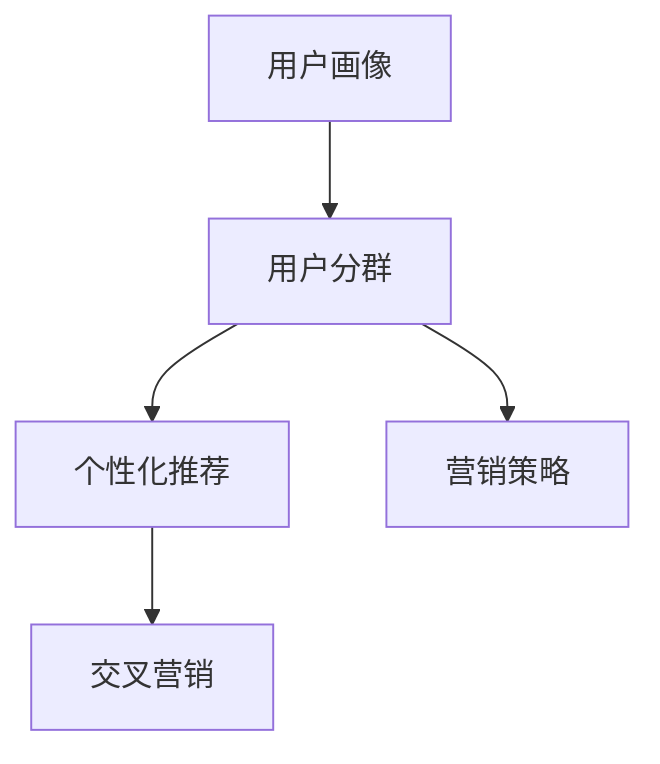

                 

# AI驱动的电商平台用户分群策略

## 1. 背景介绍

在互联网经济时代，电商平台凭借其强大的平台效应、大数据驱动的用户画像和高效的算法技术，成为了用户消费和商家营销的枢纽。电商平台不仅能提供多样化的商品选择，还能通过个性化推荐算法，实现精准匹配，极大提升用户购物体验和商家销售额。

然而，用户需求和行为日趋多元化和个性化，这对电商平台的运营带来了新的挑战。如何在有限的资源下，实现对不同用户群体的精准识别和差异化营销，是平台发展中亟需解决的难题。

### 1.1 问题由来

在传统电商模式下，用户行为往往通过静态人口统计特征（如年龄、性别、地区等）进行划分，但这种基于人口特征的分群方式存在以下问题：
1. **粒度粗糙**：无法准确捕捉到用户行为的动态变化，难以对用户需求进行精细刻画。
2. **维度单一**：仅依靠人口特征，忽视了用户行为数据（如浏览、点击、购买记录等）的重要性。
3. **同质性强**：简单的特征组合容易造成用户分群的同质化，无法充分体现用户多样性。

近年来，随着人工智能和大数据分析技术的发展，电商平台开始尝试利用AI技术进行用户分群策略的优化。通过算法对用户行为数据进行分析，构建精准的用户画像，能够更准确地识别出用户的潜在需求和偏好，从而实现更个性化的营销和服务。

### 1.2 问题核心关键点
用户分群的核心在于通过对用户行为数据的深入分析，构建出不同用户群体的特征轮廓，以便制定有针对性的营销策略。核心关键点包括：
1. **数据采集**：收集全面且高质量的用户行为数据。
2. **数据预处理**：清洗、归一化处理，保证数据质量。
3. **特征选择与提取**：选择和提取最具有区分度的特征，构建用户画像。
4. **模型构建与训练**：使用机器学习算法构建分群模型，并进行训练。
5. **分群评估与优化**：评估模型效果，并根据反馈不断优化。
6. **策略应用与部署**：将分群结果应用于个性化推荐、广告投放等业务场景。

## 2. 核心概念与联系

### 2.1 核心概念概述

为更好地理解电商平台用户分群策略，本节将介绍几个密切相关的核心概念：

- **用户画像(User Profile)**：通过数据挖掘和机器学习技术，刻画用户行为和兴趣特征的虚拟形象。用户画像的构建是用户分群的基础。
- **用户分群(User Segmentation)**：将用户按照特定特征进行分组，以便进行差异化营销。
- **个性化推荐(Personalized Recommendation)**：根据用户画像，推荐可能感兴趣的商品或服务。
- **交叉营销(Cross-sell)**：通过分群结果，实现不同产品之间的推荐和销售，提升用户生命周期价值。
- **营销策略(Marketing Strategy)**：根据分群结果和用户画像，制定不同的营销策略，提高转化率和满意度。

这些核心概念之间的逻辑关系可以通过以下Mermaid流程图来展示：



这个流程图展示了几大核心概念之间的联系：

1. 用户画像描述了用户的特征，是构建用户分群的基础。
2. 用户分群将用户划分为不同的群体，方便个性化推荐和交叉营销。
3. 个性化推荐通过用户画像和分群结果，实现精准的商品推荐。
4. 交叉营销基于用户分群，通过产品组合推荐，提高用户购买欲望和消费频次。
5. 营销策略依据用户分群结果，制定有针对性的推广方案，提升营销效果。

## 3. 核心算法原理 & 具体操作步骤
### 3.1 算法原理概述

用户分群的核心是利用机器学习算法，从用户行为数据中提取特征，构建用户画像，并使用聚类、分类等方法，将用户划分为不同群体。核心算法原理可以概括为以下几个步骤：

1. **数据预处理**：清洗、归一化用户行为数据，去除噪声和无关信息。
2. **特征提取**：通过统计、情感分析、文本挖掘等方法，提取用户行为特征。
3. **模型训练**：选择合适的机器学习算法，如K-means聚类、LDA主题模型、神经网络分类器等，对用户进行分组。
4. **模型评估**：使用各种指标（如熵、轮廓系数、精确度等）评估模型效果，识别关键特征和优化方向。
5. **策略应用**：根据分群结果，制定差异化的营销策略，并进行AB测试和优化。

### 3.2 算法步骤详解

接下来，我们详细阐述每个步骤的实现方法。

#### 数据预处理

数据预处理是用户分群的基础，通过清洗、归一化处理，保证数据质量。具体步骤如下：

1. **数据清洗**：删除缺失值、异常值和重复值，确保数据完整性和一致性。
2. **数据归一化**：对特征进行归一化处理，如标准化、离散化等，避免不同特征的数值范围差异过大。
3. **特征选择**：选择最具区分度的特征，减少噪声和冗余信息，提高模型效果。

#### 特征提取

特征提取是从用户行为数据中提取用户特征，构建用户画像。常用的方法包括：

1. **统计特征**：通过统计用户行为数据，提取基本统计特征，如平均购买次数、平均浏览时间等。
2. **情感分析**：利用NLP技术对用户评论、反馈等文本数据进行情感分析，提取情感特征。
3. **文本挖掘**：通过TF-IDF、LDA等方法，从用户行为数据中提取文本主题特征。

#### 模型训练

模型训练是用户分群的核心步骤，通过机器学习算法对用户进行分组。常用的算法包括：

1. **K-means聚类**：一种基于距离的聚类算法，通过迭代优化，将用户划分为K个不同的群体。
2. **LDA主题模型**：通过潜在语义分析，发现数据中的主题特征，将用户按照主题进行分组。
3. **神经网络分类器**：使用神经网络对用户进行分类，生成用户分群结果。

#### 模型评估

模型评估是衡量用户分群效果的重要步骤，通过指标评估模型优劣。常用的评估指标包括：

1. **熵(Entropy)**：衡量分群结果的不确定性，熵值越小，分群效果越好。
2. **轮廓系数(Silhouette Coefficient)**：衡量用户与其所属群体的紧密程度，值越接近1，分群效果越好。
3. **精确度(Precision)**：衡量分群结果的准确性，精确度越高，分群效果越好。

#### 策略应用

策略应用是将分群结果应用于具体业务场景，提升用户体验和业务效果。具体步骤如下：

1. **个性化推荐**：根据用户分群结果，推荐可能感兴趣的商品或服务。
2. **交叉营销**：通过分群结果，实现不同产品之间的推荐和销售，提高用户生命周期价值。
3. **营销策略**：依据用户分群结果，制定有针对性的推广方案，提升营销效果。

### 3.3 算法优缺点

用户分群算法具有以下优点：

1. **高效性**：通过机器学习算法，自动处理海量用户数据，提高分群效率。
2. **精准性**：通过多维度特征的提取和建模，实现更精准的用户分群。
3. **可扩展性**：可以灵活扩展特征和算法，适应不同业务场景。
4. **动态更新**：基于实时数据，动态更新分群模型，保持分群结果的实时性。

同时，用户分群算法也存在以下缺点：

1. **数据依赖**：算法效果依赖于数据质量，需要持续进行数据清洗和特征工程。
2. **模型复杂性**：不同算法具有不同复杂度，选择合适的算法需综合考虑。
3. **解释性不足**：机器学习模型往往缺乏可解释性，难以理解用户分群的具体原因。
4. **过拟合风险**：大规模数据和复杂模型可能导致过拟合，影响分群效果。

尽管存在这些缺点，但用户分群算法在电商平台用户分群策略的优化中仍具有重要价值。未来研究的方向在于如何提高算法的可解释性和鲁棒性，同时降低对数据质量和特征工程的要求。

### 3.4 算法应用领域

用户分群算法已经在多个电商领域得到了广泛应用，例如：

- **个性化推荐系统**：通过对用户分群，实现更精准的商品推荐，提高用户满意度。
- **广告投放**：通过分群结果，制定差异化的广告投放策略，提升广告点击率和转化率。
- **会员管理**：通过分群，识别高价值会员，进行针对性营销和服务，提升会员忠诚度。
- **库存管理**：通过分群结果，优化库存调配和供应链管理，减少库存积压。
- **风险控制**：通过分群，识别高风险用户，进行提前预警和风险控制。

除了这些典型应用外，用户分群算法还被创新性地应用到更多场景中，如用户行为预测、市场细分、客户流失预警等，为电商平台用户分群策略提供了新的思路和工具。

## 4. 数学模型和公式 & 详细讲解 & 举例说明
### 4.1 数学模型构建

本节将使用数学语言对电商平台用户分群算法进行更加严格的刻画。

记用户行为数据为 $D=\{(x_i,y_i)\}_{i=1}^N, x_i \in \mathcal{X}, y_i \in \mathcal{Y}$，其中 $x_i$ 为行为特征，$y_i$ 为标签。目标是将用户按照某个特征 $z_i$ 进行分组，构建用户分群模型。

定义用户分群损失函数为：

$$
\mathcal{L}(\theta) = -\frac{1}{N}\sum_{i=1}^N \log p(y_i | z_i)
$$

其中 $p(y_i | z_i)$ 为在用户特征 $z_i$ 下，用户行为 $y_i$ 的条件概率，可以通过机器学习模型 $M_{\theta}$ 预测。

用户分群的目标是最大化上述损失函数，即：

$$
\hat{\theta}=\mathop{\arg\min}_{\theta} \mathcal{L}(\theta)
$$

通过梯度下降等优化算法，求解上述最优化问题，即可得到最优模型参数 $\hat{\theta}$。

### 4.2 公式推导过程

以下我们以K-means聚类算法为例，推导用户分群的过程。

假设用户特征 $z_i$ 为高维空间中的向量，每个向量 $z_i$ 映射到一个聚类中心 $\mu_k$。K-means聚类的目标是最小化每个用户 $z_i$ 到其所属聚类中心 $\mu_k$ 的距离，即：

$$
\mathcal{L}(\mu) = \frac{1}{N}\sum_{i=1}^N \min_k \|z_i - \mu_k\|
$$

其中 $\mu_k$ 表示聚类中心，$\|z_i - \mu_k\|$ 表示用户 $z_i$ 到聚类中心 $\mu_k$ 的欧式距离。

K-means算法通过迭代优化，最小化上述损失函数。具体步骤如下：

1. 初始化聚类中心 $\mu_k$。
2. 分配每个用户 $z_i$ 到最近的聚类中心 $\mu_k$。
3. 更新聚类中心 $\mu_k$，计算每个聚类 $C_k$ 的均值。
4. 重复步骤2和3，直到收敛或达到预设迭代次数。

通过上述步骤，即可得到最优的聚类中心 $\hat{\mu}_k$ 和用户分群结果 $\hat{z}_i$。

### 4.3 案例分析与讲解

我们以一个电商平台的个性化推荐系统为例，展示用户分群算法的实际应用。

假设电商平台的商品数据为 $M=\{(m_i,d_i)\}_{i=1}^N, m_i$ 表示商品特征，$d_i$ 表示商品描述和价格等属性。目标是根据用户行为数据 $D=\{(x_i,y_i)\}_{i=1}^N, x_i \in \mathcal{X}, y_i \in \mathcal{Y}$，构建用户分群模型，实现个性化推荐。

具体步骤如下：

1. **数据预处理**：清洗用户行为数据，归一化商品属性，选择相关特征。
2. **特征提取**：利用TF-IDF、情感分析等方法，提取用户行为特征和商品特征。
3. **模型训练**：使用LDA主题模型对用户进行分组，构建用户分群模型。
4. **策略应用**：根据用户分群结果，推荐可能感兴趣的商品。

在具体实现中，可以使用Python的scikit-learn库进行LDA主题模型训练和聚类，代码如下：

```python
from sklearn.decomposition import LatentDirichletAllocation
from sklearn.cluster import KMeans

# 构建LDA主题模型
lda_model = LatentDirichletAllocation(n_components=10, random_state=42)
lda_data = lda_model.fit_transform(user_features)

# 构建K-means聚类模型
kmeans_model = KMeans(n_clusters=5, random_state=42)
kmeans_data = kmeans_model.fit_predict(lda_data)

# 根据分群结果，推荐商品
recommender = RecommendationSystem(kmeans_data, product_features)
recommender.recommend_items(user_id)
```

在上述代码中，首先使用LDA主题模型对用户行为数据进行降维和特征提取，然后使用K-means聚类算法对用户进行分组，最后根据分群结果，推荐可能感兴趣的商品。

## 5. 项目实践：代码实例和详细解释说明
### 5.1 开发环境搭建

在进行用户分群算法实践前，我们需要准备好开发环境。以下是使用Python进行scikit-learn开发的环境配置流程：

1. 安装Anaconda：从官网下载并安装Anaconda，用于创建独立的Python环境。

2. 创建并激活虚拟环境：
```bash
conda create -n user-segmentation python=3.8 
conda activate user-segmentation
```

3. 安装scikit-learn：
```bash
pip install scikit-learn
```

4. 安装各类工具包：
```bash
pip install numpy pandas scikit-learn matplotlib tqdm jupyter notebook ipython
```

完成上述步骤后，即可在`user-segmentation`环境中开始用户分群算法实践。

### 5.2 源代码详细实现

下面我们以一个电商平台的个性化推荐系统为例，给出使用scikit-learn库对LDA主题模型和K-means聚类算法进行用户分群的Python代码实现。

首先，定义用户行为数据和商品数据：

```python
import numpy as np

# 用户行为数据
user_data = np.array([[1, 3, 5], [2, 4, 6], [3, 3, 7], [4, 5, 8]])

# 商品数据
product_data = np.array([[2, 1, 3], [3, 2, 4], [4, 3, 5], [5, 4, 6]])
```

然后，定义LDA主题模型和K-means聚类模型：

```python
from sklearn.decomposition import LatentDirichletAllocation
from sklearn.cluster import KMeans

# 构建LDA主题模型
lda_model = LatentDirichletAllocation(n_components=3, random_state=42)
lda_data = lda_model.fit_transform(user_data)

# 构建K-means聚类模型
kmeans_model = KMeans(n_clusters=2, random_state=42)
kmeans_data = kmeans_model.fit_predict(lda_data)
```

接着，定义推荐系统：

```python
class RecommendationSystem:
    def __init__(self, user_clusters, product_features):
        self.user_clusters = user_clusters
        self.product_features = product_features
        self.recommender = {}
        
    def fit_recommender(self, user_id):
        for cluster in self.user_clusters:
            self.recommender[cluster] = np.mean(self.product_features[self.user_clusters == cluster], axis=0)
            
    def recommend_items(self, user_id):
        cluster = self.user_clusters[user_id]
        recommended_items = self.recommender[cluster]
        return recommended_items
```

最后，启动推荐系统并进行推荐：

```python
# 创建推荐系统
recommender = RecommendationSystem(kmeans_data, product_data)

# 拟合推荐系统
recommender.fit_recommender(1)  # 用户ID为1

# 推荐商品
recommended_items = recommender.recommend_items(1)
print(recommended_items)
```

在上述代码中，首先使用LDA主题模型对用户行为数据进行降维和特征提取，然后使用K-means聚类算法对用户进行分组，最后根据分群结果，推荐可能感兴趣的商品。

### 5.3 代码解读与分析

让我们再详细解读一下关键代码的实现细节：

**LDA主题模型**：
- 使用scikit-learn库中的LatentDirichletAllocation类构建LDA模型，参数n_components表示主题数目。

**K-means聚类模型**：
- 使用scikit-learn库中的KMeans类构建K-means聚类模型，参数n_clusters表示聚类数目。

**推荐系统**：
- 定义了一个推荐系统类RecommendationSystem，包含两个方法fit_recommender和recommend_items。
- fit_recommender方法根据用户分群结果，计算每个聚类的商品平均值，生成推荐结果。
- recommend_items方法根据用户ID，查找对应的聚类，返回推荐结果。

**推荐系统使用**：
- 创建推荐系统实例，使用fit_recommender方法拟合推荐系统。
- 调用recommend_items方法，根据用户ID，获取推荐商品列表。

可以看到，使用scikit-learn库可以很方便地实现用户分群算法，代码简洁高效。

当然，工业级的系统实现还需考虑更多因素，如推荐系统的实时性、可扩展性、数据更新等。但核心的用户分群算法基本与此类似。

## 6. 实际应用场景
### 6.1 智能客服系统

基于用户分群算法的智能客服系统，能够实现对不同用户群体的精准识别和差异化服务。系统通过分析用户历史行为数据，将用户按照兴趣和需求进行分组，提供更个性化的客服解决方案。

在技术实现上，可以收集用户历史客服记录和行为数据，构建用户画像，使用K-means聚类算法进行分群。根据分群结果，系统能够快速定位用户的咨询问题，推荐最合适的客服人员和解决方案，提升用户满意度和问题解决效率。

### 6.2 个性化推荐系统

个性化推荐系统是用户分群算法的典型应用场景。系统通过分析用户行为数据，构建用户画像，使用聚类算法进行分群。根据分群结果，推荐系统能够实现精准的商品推荐，提高用户点击率和购买率。

具体而言，可以将用户行为数据（如浏览、点击、购买记录等）作为输入，使用LDA主题模型进行降维和特征提取。然后，使用K-means聚类算法对用户进行分组，构建用户分群模型。最后，根据分群结果，推荐可能感兴趣的商品，提升推荐效果。

### 6.3 金融风险控制系统

金融领域需要实时监测用户行为，识别潜在的风险用户。用户分群算法可以通过分析用户交易数据，构建用户画像，使用聚类算法进行分群。根据分群结果，系统能够快速识别高风险用户，进行提前预警和风险控制。

具体而言，可以收集用户的交易数据，构建用户画像，使用K-means聚类算法进行分群。根据分群结果，系统能够识别出异常交易行为，进行实时监控和风险控制，降低金融风险。

### 6.4 未来应用展望

随着用户分群算法的不断发展，其在电商、金融、智能客服等多个领域的应用前景将更加广阔。

在电商领域，用户分群算法可以进一步拓展到用户行为预测、市场细分、客户流失预警等场景，实现更精准的用户管理和营销策略。

在金融领域，用户分群算法可以用于识别高风险用户、监测异常交易、进行信用评分等，提升金融系统的安全性和稳健性。

在智能客服系统，用户分群算法可以实现更个性化的服务推荐和问题解决，提升客户体验和满意度。

此外，在智慧城市、医疗健康、智能家居等更多领域，用户分群算法也将不断创新应用，推动智能化应用的发展。

## 7. 工具和资源推荐
### 7.1 学习资源推荐

为了帮助开发者系统掌握用户分群算法的理论基础和实践技巧，这里推荐一些优质的学习资源：

1. 《Python机器学习》书籍：通过丰富的实例和代码，系统讲解了机器学习的基本概念和算法，适合初学者入门。
2. 《深度学习》书籍：详细介绍了深度学习的基本原理和实现方法，包括神经网络、卷积神经网络、循环神经网络等。
3. 《推荐系统》书籍：系统讲解了推荐系统的原理和算法，包括协同过滤、基于内容的推荐、混合推荐等。
4. 《数据挖掘与统计学习》书籍：讲解了数据挖掘的基本方法和算法，适合进一步深入学习数据挖掘技术。
5. 《Python数据科学手册》书籍：讲解了Python在数据科学领域的应用，包括数据处理、可视化、机器学习等。

通过对这些资源的学习实践，相信你一定能够快速掌握用户分群算法的精髓，并用于解决实际的电商问题。

### 7.2 开发工具推荐

高效的开发离不开优秀的工具支持。以下是几款用于用户分群算法开发的常用工具：

1. Python：简单易学的编程语言，拥有丰富的机器学习库和数据处理工具，是用户分群算法开发的首选语言。
2. scikit-learn：Python机器学习库，提供了多种机器学习算法和工具，适合快速原型开发和模型评估。
3. TensorFlow：Google开发的深度学习框架，支持分布式计算和大规模数据处理，适合深度学习和分布式训练。
4. PyTorch：Facebook开发的深度学习框架，支持动态计算图和GPU加速，适合高效的数据处理和模型训练。
5. Jupyter Notebook：交互式笔记本，支持Python、R等多种语言，适合快速迭代实验和数据可视化。

合理利用这些工具，可以显著提升用户分群算法的开发效率，加快创新迭代的步伐。

### 7.3 相关论文推荐

用户分群算法的研究历史悠久，近年来在电商、金融、智能客服等领域得到了广泛应用。以下是几篇奠基性的相关论文，推荐阅读：

1. K-means: A Method for Clustering, W. H. Press, S. A. Teukolsky, W. T. Vetterling, B. P. Flannery, 2002
2. Latent Dirichlet Allocation (LDA): A Probabilistic Topic Model, D. M. Blei, A. Ng, M. I. Jordan, 2003
3. Recommender Systems: An Introduction, Y. Koren, 2009
4. Mining of Massive Datasets, Y. Koren, 2011
5. Data-Driven Methods for Recommender Systems, S. Rendle, 2012

这些论文代表了用户分群算法的经典和前沿研究，通过学习这些成果，可以帮助研究者把握学科前进方向，激发更多的创新灵感。

## 8. 总结：未来发展趋势与挑战

### 8.1 总结

本文对用户分群算法进行了全面系统的介绍。首先阐述了用户分群算法的背景和重要性，明确了算法在电商平台用户管理中的独特价值。其次，从原理到实践，详细讲解了用户分群算法的数学模型和操作步骤，给出了完整的代码实例。同时，本文还探讨了用户分群算法在电商、金融、智能客服等领域的实际应用，展示了算法的广泛前景。

通过本文的系统梳理，可以看到，用户分群算法已经在电商平台用户管理中得到了广泛应用，显著提升了用户体验和业务效果。未来，伴随算法的不断演进和优化，用户分群算法必将在更多领域带来变革性影响，推动人工智能技术在电商行业的规模化落地。

### 8.2 未来发展趋势

展望未来，用户分群算法将呈现以下几个发展趋势：

1. **算法复杂度提升**：随着算法复杂度的提升，用户分群算法的准确性和精细度将不断提高，能够更好地刻画用户行为和需求。
2. **特征工程优化**：更加多样化和高质量的特征将进一步提升用户分群效果，实现更精准的用户画像。
3. **实时数据处理**：用户分群算法将实时处理海量数据，实现实时分群和推荐，提升用户满意度和业务效果。
4. **跨领域融合**：用户分群算法将与其他人工智能技术，如强化学习、因果推断等进行融合，提升分群算法的性能和泛化能力。
5. **隐私保护**：用户分群算法将加强对用户隐私的保护，实现匿名化处理和数据安全存储。

以上趋势凸显了用户分群算法的广阔前景。这些方向的探索发展，必将进一步提升用户分群算法的性能和应用范围，为电商平台的智能化和自动化运营提供坚实基础。

### 8.3 面临的挑战

尽管用户分群算法已经取得了不少成就，但在迈向更加智能化和普适化应用的过程中，它仍面临诸多挑战：

1. **数据依赖**：算法效果依赖于高质量的数据，如何持续获取和更新数据，成为关键问题。
2. **算法复杂性**：复杂算法需要高计算资源，如何降低算法复杂度，提高实时性和效率，仍需努力。
3. **模型可解释性**：用户分群算法往往缺乏可解释性，难以理解分群结果的具体原因。如何增强算法的可解释性，成为重要研究方向。
4. **隐私保护**：用户分群算法涉及用户隐私数据，如何在保护隐私的同时实现数据有效利用，是一个重要挑战。
5. **算法鲁棒性**：用户分群算法面对噪声和异常数据，容易出现过拟合和泛化性能差的问题，如何提高算法的鲁棒性，仍需进一步研究。

尽管存在这些挑战，但用户分群算法在电商平台用户分群策略的优化中仍具有重要价值。未来研究需要在数据获取、算法优化、隐私保护等方面进行突破，以更好地实现用户分群算法的目标。

### 8.4 研究展望

面对用户分群算法所面临的种种挑战，未来的研究需要在以下几个方面寻求新的突破：

1. **数据采集与处理**：探索自动化的数据采集和预处理技术，降低人工成本，提高数据质量和效率。
2. **特征工程**：研究新的特征提取和融合方法，提高特征的多样性和准确性，构建更精准的用户画像。
3. **算法优化**：开发更加高效和可扩展的用户分群算法，降低计算资源消耗，提高实时性和可扩展性。
4. **模型解释性**：探索可解释性更高的用户分群算法，增强模型的可解释性和透明性，提升用户信任度。
5. **隐私保护**：研究隐私保护技术，确保用户隐私数据的安全存储和传输，构建可信的用户分群系统。

这些研究方向将推动用户分群算法的持续优化和创新，实现更广泛的应用和价值。面向未来，用户分群算法将在电商平台、金融、医疗、智能客服等多个领域发挥更大的作用，推动人工智能技术的普及和应用。

## 9. 附录：常见问题与解答

**Q1：如何选择合适的特征进行用户分群？**

A: 选择合适的特征是用户分群算法的关键。特征的选择应综合考虑以下几个方面：

1. **相关性**：选择与用户行为高度相关的特征，避免选择无关信息。
2. **区分度**：选择能够显著区分不同用户群体的特征，避免选择同质性强、区分度低的特征。
3. **多样性**：选择多样化的特征，覆盖用户行为的不同方面，提高分群效果。
4. **可解释性**：选择可解释性高的特征，便于理解分群结果。
5. **实时性**：选择实时可更新的特征，确保分群结果的实时性。

通过综合考虑以上因素，可以构建更准确、更有区分度的用户画像，提高用户分群效果。

**Q2：如何缓解用户分群算法的过拟合问题？**

A: 过拟合是用户分群算法面临的主要挑战。缓解过拟合问题的方法包括：

1. **数据增强**：通过数据增强技术，丰富训练数据，减少过拟合风险。
2. **正则化**：使用L2正则、Dropout等正则化技术，防止模型过度拟合。
3. **交叉验证**：使用交叉验证技术，评估模型在多个数据集上的泛化性能，避免过拟合。
4. **模型集成**：使用模型集成技术，将多个用户分群模型进行组合，提升泛化性能。
5. **参数优化**：使用超参数调优技术，找到最优的模型参数，降低过拟合风险。

通过以上方法，可以有效缓解用户分群算法的过拟合问题，提高模型的泛化能力和性能。

**Q3：用户分群算法是否适用于所有电商场景？**

A: 用户分群算法在大多数电商场景中都能取得不错的效果，但对于某些特定场景，可能存在一定的局限性：

1. **数据稀缺**：对于某些新兴电商或数据稀疏的行业，用户行为数据可能不足，影响算法效果。
2. **领域特定**：对于特定领域的电商场景，用户行为和需求可能具有特殊性，需要针对性地设计特征和算法。
3. **隐私保护**：某些电商场景可能涉及敏感用户数据，需要加强隐私保护，避免数据泄露。

因此，在实际应用中，需要根据具体场景和数据情况，选择合适的算法和特征，才能达到理想的分群效果。

**Q4：用户分群算法如何与其他AI技术结合？**

A: 用户分群算法可以与其他AI技术进行融合，提升分群效果和应用范围。

1. **深度学习**：结合深度学习技术，提高特征提取的准确性和模型的性能。
2. **强化学习**：结合强化学习技术，优化用户分群算法，实现更精准的推荐和营销策略。
3. **因果推断**：结合因果推断技术，分析用户行为的原因和影响，提升分群算法的解释性和可控性。
4. **自然语言处理**：结合自然语言处理技术，从文本数据中提取更丰富的用户行为信息，提高用户分群效果。
5. **图神经网络**：结合图神经网络技术，对用户关系进行建模，提升用户分群效果。

通过与其他AI技术的结合，用户分群算法可以实现更全面、更精准的用户画像，提升用户管理的效果和效率。

**Q5：用户分群算法的性能评估方法有哪些？**

A: 用户分群算法的性能评估可以从多个方面进行：

1. **准确度**：衡量分群结果的准确性，常用指标包括精确度、召回率和F1值等。
2. **聚类质量**：衡量分群的聚类质量，常用指标包括熵、轮廓系数等。
3. **覆盖率**：衡量分群结果的覆盖范围，常用指标包括覆盖率、重叠率等。
4. **用户满意度**：通过用户反馈和行为数据，评估分群结果的用户满意度。
5. **业务效果**：通过业务指标，如点击率、转化率、销售额等，评估分群效果。

通过综合评估以上指标，可以全面了解用户分群算法的性能和效果，找到优化方向。

---

作者：禅与计算机程序设计艺术 / Zen and the Art of Computer Programming

