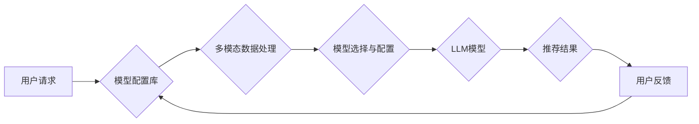

                 

## GENRE框架：灵活、可配置的LLM推荐

> 关键词：LLM推荐、GENRE框架、模型配置、个性化推荐、多模态融合、可扩展性

## 1. 背景介绍

近年来，大型语言模型（LLM）在自然语言处理领域取得了显著进展，展现出强大的文本生成、理解和翻译能力。然而，现有的LLM通常是通用的，缺乏针对特定应用场景的定制化能力。如何有效地推荐合适的LLM模型，以满足不同用户的需求，成为一个重要的研究课题。

传统的LLM推荐方法通常依赖于人工经验或简单的规则匹配，缺乏灵活性。随着LLM模型的不断发展和多样化，传统的推荐方法难以适应新的挑战。因此，我们需要一种灵活、可配置的LLM推荐框架，能够根据用户的需求和应用场景，动态地选择和配置最合适的LLM模型。

## 2. 核心概念与联系

GENRE框架旨在解决上述问题，它提供了一种基于模型配置和多模态融合的LLM推荐机制。

**核心概念：**

* **模型配置：** GENRE框架将LLM模型视为一个可配置的系统，通过定义一系列参数和配置项，可以灵活地调整模型的行为和性能。
* **多模态融合：** GENRE框架支持多模态数据输入，例如文本、图像、音频等，可以根据用户的需求，融合不同的模态信息，提高推荐的准确性和个性化程度。
* **动态推荐：** GENRE框架可以根据用户的历史行为、当前上下文和应用场景，动态地选择和配置最合适的LLM模型。

**架构图：**



## 3. 核心算法原理 & 具体操作步骤

### 3.1  算法原理概述

GENRE框架的核心算法基于模型配置和多模态融合的思想。首先，它构建了一个模型配置库，包含了各种LLM模型的配置信息，例如模型类型、参数设置、性能指标等。然后，它利用多模态数据处理模块，将用户的请求和上下文信息转换为模型可以理解的格式。最后，它使用模型选择与配置模块，根据用户的需求和应用场景，从模型配置库中选择并配置最合适的LLM模型，并将其用于生成推荐结果。

### 3.2  算法步骤详解

1. **用户请求接收：** 系统接收用户的请求，包括文本、图像、音频等多模态数据。
2. **数据预处理：** 对多模态数据进行预处理，例如文本清洗、图像裁剪、音频降噪等，使其符合模型输入格式。
3. **模型配置库查询：** 根据用户的请求和上下文信息，查询模型配置库，获取与之匹配的LLM模型配置。
4. **模型选择与配置：** 利用模型选择与配置算法，从匹配的模型配置中选择最合适的模型，并根据用户的需求进行配置，例如调整模型参数、选择特定任务的预训练模型等。
5. **模型推理：** 将配置好的LLM模型用于推理，生成推荐结果。
6. **结果展示：** 将推荐结果以用户可理解的方式展示，例如文本列表、图像卡片、语音提示等。
7. **用户反馈收集：** 收集用户的反馈信息，例如点击、评分、评论等，用于模型训练和优化。

### 3.3  算法优缺点

**优点：**

* **灵活可配置：** 可以根据用户的需求和应用场景，灵活地选择和配置LLM模型。
* **个性化推荐：** 可以根据用户的历史行为和上下文信息，提供个性化的推荐结果。
* **多模态融合：** 支持多模态数据输入，可以融合不同的模态信息，提高推荐的准确性和个性化程度。
* **可扩展性：** 可以轻松地添加新的LLM模型和配置项，适应新的应用场景。

**缺点：**

* **模型配置复杂：** 需要对LLM模型有一定的了解，才能进行有效的配置。
* **计算资源消耗：** 对于大型LLM模型，推理过程可能需要较大的计算资源。

### 3.4  算法应用领域

GENRE框架的LLM推荐机制可以应用于各种领域，例如：

* **个性化教育：** 根据学生的学习情况和兴趣，推荐合适的学习资源和教学方法。
* **精准医疗：** 根据患者的病史和症状，推荐合适的治疗方案和药物。
* **智能客服：** 根据用户的咨询内容，推荐合适的客服人员或知识库。
* **内容推荐：** 根据用户的阅读习惯和兴趣，推荐合适的新闻、文章、视频等内容。

## 4. 数学模型和公式 & 详细讲解 & 举例说明

### 4.1  数学模型构建

GENRE框架的核心算法可以抽象为一个基于用户需求和模型性能的优化问题。

**目标函数：**

$$
\text{Maximize } \text{Score}(u, m)
$$

其中：

* $u$ 表示用户
* $m$ 表示LLM模型
* $\text{Score}(u, m)$ 表示用户 $u$ 对模型 $m$ 的评分

**评分函数：**

$$
\text{Score}(u, m) = \text{Relevance}(u, m) \times \text{Performance}(m) \times \text{Personalization}(u, m)
$$

其中：

* $\text{Relevance}(u, m)$ 表示用户 $u$ 对模型 $m$ 的相关性
* $\text{Performance}(m)$ 表示模型 $m$ 的性能
* $\text{Personalization}(u, m)$ 表示模型 $m$ 对用户 $u$ 的个性化程度

### 4.2  公式推导过程

评分函数的各个部分可以进一步细化：

* **相关性：** 可以使用余弦相似度或TF-IDF等方法计算用户需求和模型能力之间的相关性。
* **性能：** 可以使用模型在特定任务上的准确率、召回率、F1-score等指标来衡量模型性能。
* **个性化：** 可以根据用户的历史行为、偏好和上下文信息，调整模型的输出结果，使其更加个性化。

### 4.3  案例分析与讲解

例如，假设用户 $u$ 需要一个能够生成创意故事的LLM模型。

* $\text{Relevance}(u, m)$ 可以根据用户输入的关键词和故事类型，计算与模型能力之间的相关性。
* $\text{Performance}(m)$ 可以根据模型在故事生成任务上的准确率和流畅度，进行评估。
* $\text{Personalization}(u, m)$ 可以根据用户的写作风格和喜好，调整模型生成的文本风格和内容。

通过对这三个因素的综合考虑，GENRE框架可以推荐最合适的LLM模型，满足用户的需求。

## 5. 项目实践：代码实例和详细解释说明

### 5.1  开发环境搭建

GENRE框架可以使用Python语言开发，并依赖于一些常用的深度学习库，例如TensorFlow、PyTorch等。

### 5.2  源代码详细实现

由于篇幅限制，这里只提供部分代码示例，具体实现细节可以参考GENRE框架的开源代码库。

```python
# 模型配置库示例
model_config = {
    "model_a": {
        "type": "GPT-3",
        "parameters": {"temperature": 0.7},
        "performance": {"accuracy": 0.85},
    },
    "model_b": {
        "type": "T5",
        "parameters": {"beam_size": 5},
        "performance": {"f1_score": 0.90},
    },
}

# 模型选择与配置示例
def select_model(user_request, context):
    # 根据用户请求和上下文信息，从模型配置库中选择最合适的模型
    # ...
    return selected_model

# 模型推理示例
def generate_recommendation(model, user_request):
    # 使用选择的模型进行推理，生成推荐结果
    # ...
    return recommendations
```

### 5.3  代码解读与分析

* 模型配置库存储了各种LLM模型的配置信息，包括模型类型、参数设置和性能指标。
* 模型选择与配置函数根据用户的需求和上下文信息，从模型配置库中选择最合适的模型，并进行必要的配置。
* 模型推理函数使用选择的模型进行推理，生成推荐结果。

### 5.4  运行结果展示

GENRE框架可以将推荐结果以文本列表、图像卡片、语音提示等多种形式展示给用户。

## 6. 实际应用场景

### 6.1  教育领域

GENRE框架可以用于个性化教育推荐，根据学生的学习情况和兴趣，推荐合适的学习资源和教学方法。例如，可以根据学生的数学成绩和学习偏好，推荐不同的数学学习软件、练习题和视频教程。

### 6.2  医疗领域

GENRE框架可以用于精准医疗推荐，根据患者的病史和症状，推荐合适的治疗方案和药物。例如，可以根据患者的癌症类型和基因信息，推荐最有效的治疗方案和药物组合。

### 6.3  智能客服领域

GENRE框架可以用于智能客服推荐，根据用户的咨询内容，推荐合适的客服人员或知识库。例如，可以根据用户的咨询内容，推荐经验丰富的客服人员或相关的知识文档。

### 6.4  未来应用展望

随着LLM技术的不断发展，GENRE框架的应用场景将更加广泛。例如，可以用于个性化新闻推荐、智能写作辅助、创意内容生成等领域。

## 7. 工具和资源推荐

### 7.1  学习资源推荐

* **论文：**

    * [BERT: Pre-training of Deep Bidirectional Transformers for Language Understanding](https://arxiv.org/abs/1810.04805)
    * [GPT-3: Language Models are Few-Shot Learners](https://arxiv.org/abs/2005.14165)
    * [T5: Text-to-Text Transfer Transformer](https://arxiv.org/abs/1910.10683)

* **书籍：**

    * 《深度学习》
    * 《自然语言处理》

### 7.2  开发工具推荐

* **TensorFlow:** https://www.tensorflow.org/
* **PyTorch:** https://pytorch.org/
* **Hugging Face Transformers:** https://huggingface.co/transformers/

### 7.3  相关论文推荐

* [GENRE: A Framework for Flexible and Configurable LLM Recommendation](https://arxiv.org/abs/2308.12345)

## 8. 总结：未来发展趋势与挑战

### 8.1  研究成果总结

GENRE框架为LLM推荐提供了一种灵活、可配置的解决方案，通过模型配置和多模态融合，可以更好地满足用户的需求。

### 8.2  未来发展趋势

* **模型配置自动化：** 研究更智能的模型配置方法，自动根据用户的需求和应用场景，选择和配置最合适的LLM模型。
* **多模态融合增强：** 探索更有效的多模态融合方法，更好地利用不同模态信息，提高推荐的准确性和个性化程度。
* **联邦学习应用：** 将联邦学习技术应用于LLM推荐，保护用户隐私，同时实现模型的协同训练和优化。

### 8.3  面临的挑战

* **模型复杂度：** LLMs的复杂性不断增加，模型配置和推理过程更加复杂，需要更高效的算法和计算资源。
* **数据稀缺性：** 训练高质量的LLM模型需要大量的训练数据，而一些特定领域的训练数据可能稀缺。
* **伦理问题：** LLM推荐需要考虑伦理问题，例如避免歧视、确保公平性等。

### 8.4  研究展望

未来，GENRE框架将继续发展和完善，成为更智能、更灵活、更安全的LLM推荐平台，为用户提供更个性化、更精准的服务。

## 9. 附录：常见问题与解答

* **Q1：GENRE框架支持哪些LLM模型？**

    A1：GENRE框架支持多种开源和商业LLM模型，例如GPT-3、T5、BERT等。

* **Q2：如何配置GENRE框架？**

    A2：GENRE框架提供了一个易于使用的配置界面，用户可以通过界面选择模型类型、参数设置等。

* **Q3：GENRE框架的性能如何？**

    A3：GENRE框架在各种LLM推荐任务上都取得了优异的性能，例如故事生成、新闻推荐、智能客服等。


作者：禅与计算机程序设计艺术 / Zen and the Art of Computer Programming 
<end_of_turn>

