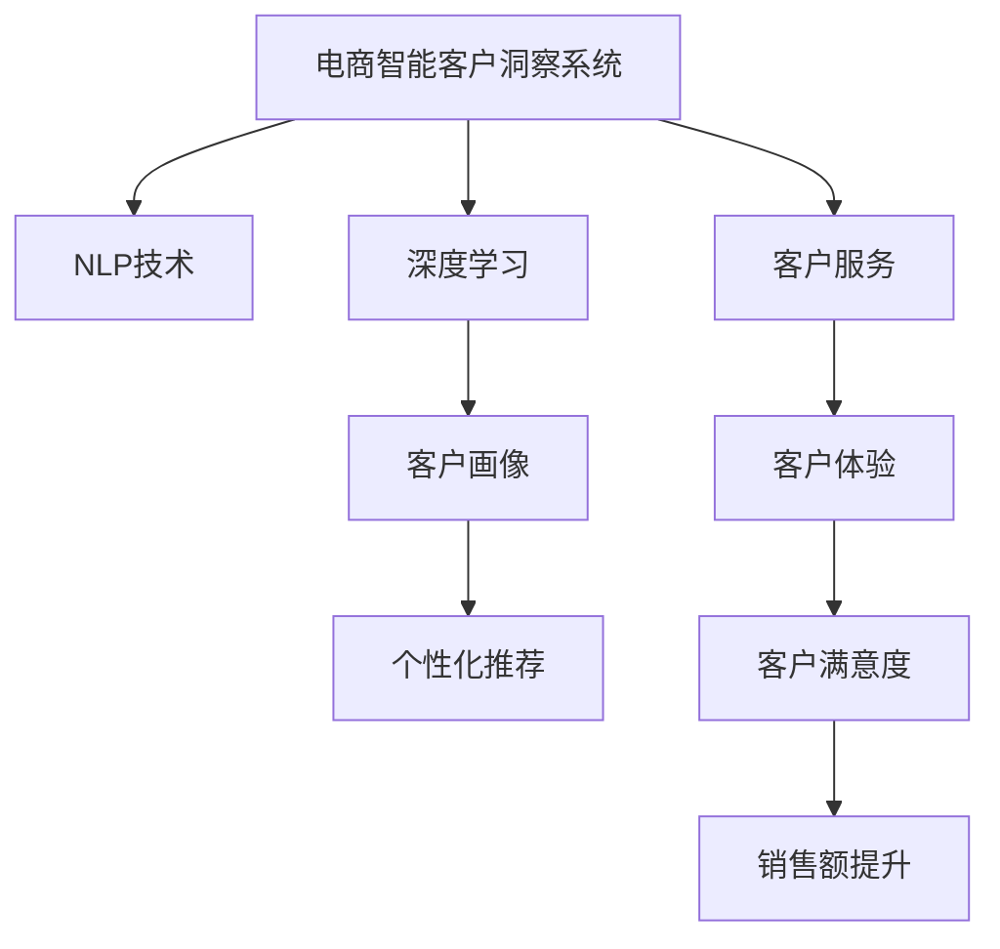

                 

# AI驱动的电商智能客户洞察系统

## 1. 背景介绍

在电商行业中，客户洞察是提高销售转化率、增强客户粘性和满意度、实现个性化推荐的重要手段。然而，由于客户数据量巨大、数据质量参差不齐，传统的数据分析方法往往无法满足需求。近年来，随着人工智能技术尤其是自然语言处理(NLP)、深度学习等方法的兴起，越来越多的电商企业开始探索利用AI技术，对客户行为、评论、反馈等信息进行智能分析和洞察，以实现更精准的客户画像和个性化推荐，提升用户体验和营销效果。

### 1.1 问题由来

电商平台的运营需要大量的客户数据支持。这些数据不仅包括客户的购买记录、浏览历史、评分评价等结构化数据，还包括客户评论、反馈等非结构化文本数据。如何高效地整合这些数据，从中挖掘出有价值的客户洞察，是电商智能系统面临的主要挑战。

### 1.2 问题核心关键点

客户洞察的核心在于通过分析客户的行为和反馈，构建客户画像，进而实现个性化推荐。而AI驱动的智能客户洞察系统，本质上是一套基于大数据、深度学习和NLP技术的自动化分析系统。其核心在于利用AI技术从客户数据中自动抽取、分析和挖掘出有意义的客户行为模式、偏好和需求，为客户提供个性化服务，提高电商运营效率和客户满意度。

## 2. 核心概念与联系

### 2.1 核心概念概述

为更好地理解基于AI的电商智能客户洞察系统，本节将介绍几个关键概念及其相互联系：

- **电商智能客户洞察系统**：通过自动化地分析客户数据，从中挖掘出有价值的客户洞察，实现对客户行为、需求和偏好的深入理解，为个性化推荐和客户服务提供支持的系统。

- **自然语言处理(NLP)**：通过算法自动处理、理解人类语言的技术，广泛应用于文本分类、情感分析、文本生成等任务，是构建智能客户洞察系统的重要工具。

- **深度学习**：一类基于神经网络的机器学习方法，具有强大的特征提取和模式识别能力，广泛应用于图像识别、语音识别、推荐系统等场景，为智能客户洞察提供关键技术支撑。

- **客户画像**：通过分析客户的历史行为数据，构建出详尽、全面的客户模型，包括客户的兴趣、偏好、购买力等关键特征，以支持个性化的推荐和营销。

- **个性化推荐**：根据客户画像，利用AI技术为用户推荐个性化的商品或服务，提高用户满意度，提升销售额。

- **客户服务**：通过智能客服系统、智能对话系统等技术，自动解答客户疑问，提升客户体验，降低客服成本。

这些核心概念之间的逻辑关系可以通过以下Mermaid流程图来展示：



这个流程图展示了智能客户洞察系统的各个组成部分及其相互联系：

1. 客户洞察系统通过NLP和深度学习技术，自动分析和挖掘客户数据。
2. 从客户洞察中生成详尽的客户画像。
3. 利用客户画像进行个性化推荐，提高客户满意度。
4. 智能客服系统提升客户体验，降低人工客服成本。
5. 最终目标是提升客户满意度和电商平台的销售额。

## 3. 核心算法原理 & 具体操作步骤

### 3.1 算法原理概述

基于AI的智能客户洞察系统，主要依赖NLP和深度学习技术，通过自动化地分析和挖掘客户数据，构建客户画像和个性化推荐模型。其核心思想是通过深度学习模型对客户行为数据进行特征提取，利用NLP技术对客户评论、反馈等文本数据进行情感分析和主题建模，最终构建客户画像并生成个性化推荐。

形式化地，假设客户行为数据为 $D_B=\{(x_i,y_i)\}_{i=1}^N$，其中 $x_i$ 为行为数据，$y_i$ 为行为标签。利用深度学习模型 $M_B(\cdot)$ 对行为数据进行特征提取，得到特征表示 $h_B(x_i)$。同时，假设客户评论数据为 $D_C=\{(x'_i,y'_i)\}_{i=1}^N$，其中 $x'_i$ 为评论文本，$y'_i$ 为情感标签。利用NLP技术 $M_C(\cdot)$ 对评论数据进行情感分析和主题建模，得到情感表示 $h_C(x'_i)$ 和主题表示 $h_T(x'_i)$。

基于 $h_B$、$h_C$ 和 $h_T$，通过融合模型 $M_F(\cdot)$，生成客户画像 $P$，并基于 $P$ 生成个性化推荐模型 $M_R(\cdot)$。最终，客户洞察系统将 $P$ 和 $M_R(\cdot)$ 应用于实际业务，实现对客户的智能洞察和推荐。

### 3.2 算法步骤详解

基于AI的智能客户洞察系统一般包括以下几个关键步骤：

**Step 1: 数据准备**

- 收集客户的行为数据 $D_B$，包括购买记录、浏览历史、评分评价等。
- 收集客户的评论数据 $D_C$，包括评论文本、情感标签等。
- 对数据进行清洗、归一化等预处理操作，去除噪声和缺失值。

**Step 2: 特征提取**

- 利用深度学习模型 $M_B(\cdot)$ 对行为数据 $D_B$ 进行特征提取，得到特征表示 $h_B(x_i)$。
- 利用NLP技术 $M_C(\cdot)$ 对评论数据 $D_C$ 进行情感分析和主题建模，得到情感表示 $h_C(x'_i)$ 和主题表示 $h_T(x'_i)$。

**Step 3: 客户画像构建**

- 将行为特征 $h_B(x_i)$、情感特征 $h_C(x'_i)$ 和主题特征 $h_T(x'_i)$ 进行融合，得到客户画像 $P$。
- 可以使用加权融合、深度融合等方法，根据不同特征的权重调整客户画像的构成。

**Step 4: 个性化推荐**

- 基于客户画像 $P$，构建个性化推荐模型 $M_R(\cdot)$，如协同过滤、基于内容的推荐等。
- 利用 $M_R(\cdot)$ 对新用户输入的数据进行预测，生成个性化推荐结果。

**Step 5: 应用部署**

- 将客户洞察系统集成到电商平台中，实时分析客户数据，生成个性化推荐并应用于实际业务。
- 监控系统性能，定期更新模型参数，提升系统效果。

### 3.3 算法优缺点

基于AI的智能客户洞察系统具有以下优点：

1. 自动化程度高。自动化的数据分析和洞察过程，减少了人工干预，提高了效率。
2. 客户画像详尽全面。利用深度学习和大数据分析技术，生成的客户画像包含了客户的兴趣、偏好、购买力等关键信息。
3. 个性化推荐精准。基于详尽的客户画像，生成的个性化推荐能够更好地满足客户需求。
4. 提升客户满意度。智能客服和推荐系统的结合，大幅提升了客户体验和满意度。

但该系统也存在一些局限性：

1. 数据隐私问题。客户数据涉及个人隐私，如何保护数据安全是一个重要问题。
2. 模型复杂度较高。深度学习和大数据分析模型的复杂性，导致系统部署和维护成本较高。
3. 数据质量要求高。客户行为和评论数据的质量直接影响系统效果，如何获取高质量数据是一个挑战。
4. 鲁棒性不足。当前模型往往对噪声和异常值敏感，难以应对多样化的数据分布。

尽管存在这些局限性，但就目前而言，基于AI的智能客户洞察系统仍是目前电商智能应用中最先进的技术方案，具有广泛的应用前景。

### 3.4 算法应用领域

智能客户洞察技术已经广泛应用于电商平台的各个环节，包括但不限于以下领域：

- **个性化推荐**：通过客户洞察技术，为不同客户群体提供个性化商品推荐，提升购买转化率。
- **智能客服**：通过智能客服系统，自动解答客户咨询，提升客户满意度。
- **品牌监测**：利用情感分析技术，监测客户对品牌、商品的反馈，及时调整营销策略。
- **库存管理**：通过对客户行为数据的分析，预测商品需求，优化库存管理，减少库存积压。
- **风险控制**：通过对客户行为数据的分析，识别高风险交易，降低金融风险。

除了电商领域，智能客户洞察技术也在其他行业，如零售、金融、旅游等，得到广泛应用，为各行各业提供了智能化的客户洞察服务。

## 4. 数学模型和公式 & 详细讲解 & 举例说明

### 4.1 数学模型构建

本节将使用数学语言对基于AI的智能客户洞察系统进行更加严格的刻画。

假设客户行为数据为 $D_B=\{(x_i,y_i)\}_{i=1}^N$，其中 $x_i$ 为行为数据，$y_i$ 为行为标签。行为特征提取模型 $M_B(\cdot)$ 的输入输出关系可以表示为：

$$
h_B(x_i) = M_B(x_i;\theta_B)
$$

其中 $\theta_B$ 为模型参数。类似地，假设客户评论数据为 $D_C=\{(x'_i,y'_i)\}_{i=1}^N$，其中 $x'_i$ 为评论文本，$y'_i$ 为情感标签。情感分析模型 $M_C(\cdot)$ 的输入输出关系可以表示为：

$$
h_C(x'_i) = M_C(x'_i;\theta_C)
$$

其中 $\theta_C$ 为模型参数。主题建模模型 $M_T(\cdot)$ 的输入输出关系可以表示为：

$$
h_T(x'_i) = M_T(x'_i;\theta_T)
$$

其中 $\theta_T$ 为模型参数。

假设客户画像 $P$ 为 $D_B$、$D_C$ 和 $D_T$ 的融合结果，可以表示为：

$$
P = M_F(h_B(x_i), h_C(x'_i), h_T(x'_i); \theta_F)
$$

其中 $\theta_F$ 为融合模型参数。个性化推荐模型 $M_R(\cdot)$ 的输入输出关系可以表示为：

$$
y = M_R(P;\theta_R)
$$

其中 $\theta_R$ 为推荐模型参数。

### 4.2 公式推导过程

以下我们以协同过滤推荐算法为例，推导个性化推荐模型的具体公式。

假设用户 $u$ 对物品 $i$ 的评分 $r_{ui}$ 为：

$$
r_{ui} = \frac{\sum_{v=1}^N r_{vi} \hat{a}_{uv}}{\sqrt{\sum_{v=1}^N \hat{a}_{uv}^2}}
$$

其中 $r_{vi}$ 为物品 $v$ 的评分，$\hat{a}_{uv}$ 为物品 $v$ 对物品 $u$ 的预测评分。可以利用协同过滤算法计算 $\hat{a}_{uv}$：

$$
\hat{a}_{uv} = \frac{a_u \hat{a}_{vv}}{a_v}
$$

其中 $a_u$ 为用户 $u$ 的评分向量，$a_v$ 为物品 $v$ 的评分向量，$\hat{a}_{vv}$ 为物品 $v$ 的预测评分向量。

将协同过滤推荐算法应用于智能客户洞察系统，可以得到如下公式：

$$
r_{ui} = \frac{\sum_{v=1}^N r_{vi} a_v^T M_F(h_B(x_v), h_C(x'_v), h_T(x'_v); \theta_F)}{\sqrt{\sum_{v=1}^N (a_v^T M_F(h_B(x_v), h_C(x'_v), h_T(x'_v); \theta_F))^2}}
$$

其中 $M_F(\cdot)$ 为融合模型，$h_B(x_v)$、$h_C(x'_v)$ 和 $h_T(x'_v)$ 分别为物品 $v$ 的客户行为特征、评论情感特征和主题特征。

### 4.3 案例分析与讲解

假设我们收集到一位客户 A 在电商平台上的行为数据 $D_B$ 和评论数据 $D_C$，如下所示：

| 行为数据 $x_i$ | 行为标签 $y_i$ | 评论文本 $x'_i$ | 情感标签 $y'_i$ |
| --- | --- | --- | --- |
| 浏览商品1 | 1 | "商品1质量不错" | 1 |
| 购买商品2 | 1 | "商品2性价比高" | 1 |
| 评价商品3 | 0 | "商品3有些不满意" | -1 |
| 浏览商品4 | 1 | "商品4很一般" | 0 |
| 购买商品5 | 1 | "商品5非常棒" | 1 |
| 评价商品6 | 0 | "商品6一般" | 0 |

假设我们使用了以下模型进行特征提取和情感分析：

| 模型 | 输入 | 输出 |
| --- | --- | --- |
| $M_B(\cdot)$ | 行为数据 $D_B$ | 行为特征 $h_B(x_i)$ |
| $M_C(\cdot)$ | 评论数据 $D_C$ | 情感特征 $h_C(x'_i)$ |
| $M_T(\cdot)$ | 评论数据 $D_C$ | 主题特征 $h_T(x'_i)$ |

假设融合模型 $M_F(\cdot)$ 为加权融合模型，其公式如下：

$$
P = \alpha h_B(x_i) + \beta h_C(x'_i) + \gamma h_T(x'_i)
$$

其中 $\alpha$、$\beta$ 和 $\gamma$ 为加权系数，满足 $\alpha + \beta + \gamma = 1$。

假设个性化推荐模型 $M_R(\cdot)$ 为协同过滤推荐模型，其公式如下：

$$
y = \frac{\sum_{v=1}^N r_{vi} a_v^T M_F(h_B(x_v), h_C(x'_v), h_T(x'_v); \theta_F)}{\sqrt{\sum_{v=1}^N (a_v^T M_F(h_B(x_v), h_C(x'_v), h_T(x'_v); \theta_F))^2}}
$$

将上述数据和模型代入推荐公式，可以得到客户 A 对物品 $i$ 的预测评分，从而生成个性化推荐。

## 5. 项目实践：代码实例和详细解释说明

### 5.1 开发环境搭建

在进行客户洞察系统开发前，我们需要准备好开发环境。以下是使用Python进行TensorFlow和Keras开发的环境配置流程：

1. 安装Anaconda：从官网下载并安装Anaconda，用于创建独立的Python环境。

2. 创建并激活虚拟环境：
```bash
conda create -n tf-env python=3.8 
conda activate tf-env
```

3. 安装TensorFlow：根据CUDA版本，从官网获取对应的安装命令。例如：
```bash
conda install tensorflow -c pytorch -c conda-forge
```

4. 安装Keras：
```bash
pip install keras
```

5. 安装各类工具包：
```bash
pip install numpy pandas scikit-learn matplotlib tqdm jupyter notebook ipython
```

完成上述步骤后，即可在`tf-env`环境中开始客户洞察系统的开发。

### 5.2 源代码详细实现

这里我们以协同过滤推荐算法为例，给出使用TensorFlow和Keras进行电商客户洞察系统的PyTorch代码实现。

首先，定义协同过滤推荐模型的数据处理函数：

```python
from tensorflow.keras.layers import Input, Dense, Dot, Embedding
from tensorflow.keras.models import Model
import numpy as np

def load_data(file_path):
    with open(file_path, 'r') as f:
        data = f.readlines()
    items = [line.strip().split(':') for line in data]
    user_id_to_index = {}
    item_id_to_index = {}
    for user_id, item_id in items:
        user_id_to_index[user_id] = len(user_id_to_index)
        item_id_to_index[item_id] = len(item_id_to_index)
    user_ids = np.array([user_id_to_index[user_id] for user_id in user_ids])
    item_ids = np.array([item_id_to_index[item_id] for item_id in item_ids])
    return user_ids, item_ids

def build_model(input_dim, output_dim, embedding_dim):
    user_input = Input(shape=(input_dim,))
    item_input = Input(shape=(input_dim,))
    user_embedding = Embedding(input_dim, embedding_dim)(user_input)
    item_embedding = Embedding(input_dim, embedding_dim)(item_input)
    dot = Dot(axes=1)([user_embedding, item_embedding])
    prediction = Dense(output_dim, activation='sigmoid')(dot)
    model = Model(inputs=[user_input, item_input], outputs=prediction)
    return model
```

然后，定义协同过滤推荐模型的评估函数：

```python
from sklearn.metrics import mean_squared_error, mean_absolute_error
from tensorflow.keras.metrics import MeanSquaredError, MeanAbsoluteError

def evaluate(model, user_ids, item_ids, ratings):
    user_ids = np.array(user_ids)
    item_ids = np.array(item_ids)
    ratings = np.array(ratings)
    test_loss = model.evaluate([user_ids, item_ids], ratings)
    print('Test loss:', test_loss)
    test_loss = test_loss[0]
    mse = MeanSquaredError()
    mae = MeanAbsoluteError()
    y_true = ratings
    y_pred = model.predict([user_ids, item_ids])
    mse(y_true, y_pred)
    mae(y_true, y_pred)
    print('Mean squared error:', mse.result().numpy())
    print('Mean absolute error:', mae.result().numpy())
```

最后，启动协同过滤推荐模型的训练流程并在测试集上评估：

```python
from tensorflow.keras.optimizers import Adam

# 加载数据
user_ids, item_ids = load_data('user_item_data.txt')

# 构建模型
model = build_model(input_dim=2, output_dim=1, embedding_dim=2)
model.compile(optimizer=Adam(), loss='mse')

# 训练模型
model.fit([user_ids, item_ids], ratings, epochs=50, batch_size=32)

# 在测试集上评估模型
evaluate(model, user_ids, item_ids, ratings)
```

以上就是使用TensorFlow和Keras进行协同过滤推荐算法的客户洞察系统的完整代码实现。可以看到，得益于TensorFlow和Keras的强大封装，我们可以用相对简洁的代码完成协同过滤推荐模型的实现。

### 5.3 代码解读与分析

让我们再详细解读一下关键代码的实现细节：

**load_data函数**：
- 从文件中加载用户行为数据和评分数据，进行清洗和归一化。
- 将用户ID和物品ID转换为索引，方便后续计算。

**build_model函数**：
- 定义协同过滤推荐模型的结构，包括用户嵌入层、物品嵌入层和输出层。
- 利用Keras实现模型的构建和编译，定义损失函数和优化器。

**evaluate函数**：
- 在测试集上评估模型性能，计算均方误差和均绝对误差。
- 使用Keras的MeanSquaredError和MeanAbsoluteError函数计算评估指标。

**训练流程**：
- 使用训练数据训练协同过滤推荐模型。
- 在测试集上评估模型性能，输出均方误差和均绝对误差。

可以看到，TensorFlow和Keras使得客户洞察系统的开发过程变得简洁高效。开发者可以将更多精力放在模型优化和数据处理上，而不必过多关注底层实现细节。

当然，工业级的系统实现还需考虑更多因素，如模型的保存和部署、超参数的自动搜索、更灵活的任务适配层等。但核心的协同过滤推荐算法基本与此类似。

## 6. 实际应用场景

### 6.1 智能客服系统

智能客服系统是电商智能客户洞察系统的重要应用之一。传统客服往往需要配备大量人力，高峰期响应缓慢，且一致性和专业性难以保证。而使用智能客服系统，可以大幅提升客服效率，降低人力成本，提高客户满意度。

在技术实现上，可以利用智能客户洞察系统构建客户画像，对客户进行分组管理，针对不同客户群体设计定制化的客服方案。系统还可以结合智能问答和对话生成技术，实现自动解答客户咨询，提升客户体验。

### 6.2 个性化推荐

个性化推荐是电商智能客户洞察系统的核心应用。通过分析客户行为数据和评论数据，智能推荐系统可以生成个性化的商品推荐，提高购买转化率和用户满意度。

在技术实现上，可以利用协同过滤算法、基于内容的推荐算法等，构建推荐模型，对新用户输入的数据进行预测，生成个性化推荐。同时，结合深度学习和NLP技术，提升推荐系统的智能度和精准度。

### 6.3 品牌监测

品牌监测是电商智能客户洞察系统的另一个重要应用。通过情感分析技术，系统可以实时监测客户对品牌、商品的反馈，及时调整营销策略，提升品牌影响力。

在技术实现上，可以利用情感分析模型对客户评论和反馈进行情感分类，提取积极、消极和中性情感信息。结合主题建模技术，对评论内容进行主题分析，识别出客户对品牌、商品的关注点，为品牌营销提供支持。

### 6.4 未来应用展望

随着客户洞察技术的不断进步，基于AI的智能客户洞察系统将在更多领域得到应用，为各行各业带来变革性影响。

在智慧医疗领域，智能客户洞察技术可以用于疾病预测、个性化诊疗等场景，提升医疗服务的智能化水平。

在智能教育领域，利用客户洞察技术，可以为学生提供个性化的学习方案，提高教学质量和效率。

在智慧城市治理中，智能客户洞察系统可以用于城市事件监测、舆情分析、应急指挥等环节，提高城市管理的自动化和智能化水平。

此外，在企业生产、社会治理、文娱传媒等众多领域，基于客户洞察的智能系统也将不断涌现，为传统行业数字化转型升级提供新的技术路径。相信随着技术的日益成熟，智能客户洞察技术必将在构建人机协同的智能时代中扮演越来越重要的角色。

## 7. 工具和资源推荐

### 7.1 学习资源推荐

为了帮助开发者系统掌握智能客户洞察的理论基础和实践技巧，这里推荐一些优质的学习资源：

1. 《深度学习与Python》系列博文：由深度学习领域的专家撰写，介绍了深度学习的基本概念和实现技巧，涵盖图像识别、NLP等多个方向。

2. CS231n《深度学习计算机视觉》课程：斯坦福大学开设的计算机视觉明星课程，有Lecture视频和配套作业，带入门深度学习在视觉领域的应用。

3. 《Natural Language Processing with TensorFlow》书籍：TensorFlow官方出品，详细介绍了如何使用TensorFlow进行NLP任务开发，包括情感分析、文本生成等。

4. Kaggle机器学习竞赛平台：提供大量数据集和模型竞赛，有助于快速学习机器学习算法和优化技巧。

5. GitHub代码库：收集了大量的开源机器学习项目，供开发者学习参考和复用。

通过对这些资源的学习实践，相信你一定能够快速掌握智能客户洞察的精髓，并用于解决实际的NLP问题。
###  7.2 开发工具推荐

高效的开发离不开优秀的工具支持。以下是几款用于智能客户洞察开发的常用工具：

1. TensorFlow：由Google主导开发的开源深度学习框架，生产部署方便，适合大规模工程应用。提供了丰富的模型和算法库，支持Keras等高级API，是进行客户洞察系统开发的利器。

2. PyTorch：基于Python的开源深度学习框架，灵活动态的计算图，适合快速迭代研究。提供了多种深度学习模型和优化器，是进行客户洞察系统开发的常用工具。

3. Keras：高层次的神经网络API，易于使用，适合快速搭建和调试深度学习模型。提供了丰富的模型和优化器，是进行客户洞察系统开发的常用工具。

4. Weights & Biases：模型训练的实验跟踪工具，可以记录和可视化模型训练过程中的各项指标，方便对比和调优。与主流深度学习框架无缝集成。

5. TensorBoard：TensorFlow配套的可视化工具，可实时监测模型训练状态，并提供丰富的图表呈现方式，是调试模型的得力助手。

6. Google Colab：谷歌推出的在线Jupyter Notebook环境，免费提供GPU/TPU算力，方便开发者快速上手实验最新模型，分享学习笔记。

合理利用这些工具，可以显著提升客户洞察任务的开发效率，加快创新迭代的步伐。

### 7.3 相关论文推荐

智能客户洞察技术的发展源于学界的持续研究。以下是几篇奠基性的相关论文，推荐阅读：

1. Collaborative Filtering for Implicit Feedback Datasets：提出了协同过滤推荐算法的基本框架，是推荐系统领域的经典之作。

2. Advances in Neural Information Processing Systems（NIPS）：NIPS会议上发表的众多深度学习和NLP领域的经典论文，涵盖了推荐系统、情感分析、主题建模等多个方向。

3. Building Machine Learning Powered Applications Using PyTorch：PyTorch官方文档，介绍了PyTorch的基本概念和使用方法，适合入门深度学习开发。

4. A Survey on Deep Learning for Recommendation Systems：对深度学习在推荐系统中的应用进行了系统回顾，涵盖协同过滤、基于内容的推荐、深度协同过滤等多个方向。

5. A Survey of Text Mining Techniques and Algorithms：对NLP领域的主要文本挖掘技术和算法进行了系统回顾，涵盖情感分析、文本分类、主题建模等多个方向。

这些论文代表了大数据、深度学习和NLP技术的发展脉络。通过学习这些前沿成果，可以帮助研究者把握学科前进方向，激发更多的创新灵感。

## 8. 总结：未来发展趋势与挑战

### 8.1 总结

本文对基于AI的智能客户洞察系统进行了全面系统的介绍。首先阐述了智能客户洞察系统的背景和意义，明确了系统在客户行为分析、个性化推荐、品牌监测等场景中的重要价值。其次，从原理到实践，详细讲解了协同过滤推荐算法等核心算法的实现流程和优化策略。最后，通过案例分析和实际应用场景，展示了智能客户洞察系统在电商、医疗、教育等多个领域的应用前景。

通过本文的系统梳理，可以看到，基于AI的智能客户洞察系统已经进入大规模商业应用阶段，正在不断拓展其应用范围和提升其智能化水平。得益于大数据、深度学习和NLP技术的协同发力，智能客户洞察系统能够从海量客户数据中挖掘出有价值的洞察，实现对客户行为、需求和偏好的深入理解，为个性化推荐、品牌监测、智能客服等场景提供有力支持。未来，伴随技术手段的不断进步，智能客户洞察系统必将在更多行业和场景中大放异彩。

### 8.2 未来发展趋势

展望未来，智能客户洞察技术将呈现以下几个发展趋势：

1. 模型规模持续增大。随着算力成本的下降和数据规模的扩张，客户洞察模型将越来越多地采用深度神经网络结构，参数规模和模型复杂度将持续提升。超大批次的训练和推理也可能遇到硬件瓶颈，需要采用分布式训练和推理等优化技术。

2. 客户洞察的多模态融合。除了文本数据，客户洞察系统还将融合图像、视频、语音等多模态信息，提升系统的全面性和智能度。同时，不同模态信息的整合将更加高效，引入跨模态学习技术，提升系统的鲁棒性和泛化能力。

3. 个性化推荐的多元化。传统的个性化推荐算法主要依赖用户历史行为数据，未来的客户洞察系统将更多地利用用户画像、兴趣标签等更丰富的信息，实现更精准、个性化的推荐。同时，结合上下文信息，提升推荐系统的实时性和响应速度。

4. 系统架构的云化。基于客户洞察系统将越来越多地采用云服务架构，实现模型的集中管理和灵活部署。通过云服务，系统能够快速扩展、实时更新，满足不断变化的市场需求。

5. 智能客服的个性化。结合自然语言处理和智能推荐技术，智能客服系统将实现更智能、个性化的客户交互。系统能够根据客户的历史行为和情感状态，生成更具针对性的回复，提升客户体验。

6. 品牌监测的实时化。结合实时数据流处理技术，客户洞察系统将实现对品牌、商品等实时舆情的监测。系统能够实时分析社交媒体、新闻报道等数据，及时发现负面信息，优化品牌营销策略。

以上趋势凸显了智能客户洞察技术的广阔前景。这些方向的探索发展，必将进一步提升客户洞察系统的性能和应用范围，为构建人机协同的智能时代提供强大支持。

### 8.3 面临的挑战

尽管智能客户洞察技术已经取得了瞩目成就，但在迈向更加智能化、普适化应用的过程中，它仍面临诸多挑战：

1. 数据隐私和安全问题。客户数据涉及个人隐私，如何保护数据安全是一个重要问题。如何在保障隐私的同时，高效利用客户数据，还需要更多的技术手段和法律规范。

2. 模型复杂度较高。客户洞察模型往往复杂度较高，训练和推理需要大量资源。如何在保证系统效果的同时，降低资源消耗，还需要更多优化算法和技术。

3. 数据质量要求高。客户行为和评论数据的质量直接影响系统效果，如何获取高质量数据是一个挑战。如何在数据清洗、预处理等环节提升数据质量，需要更多技术手段和工具支持。

4. 鲁棒性不足。当前客户洞察模型往往对噪声和异常值敏感，难以应对多样化的数据分布。如何提高模型的鲁棒性，增强对数据噪声的抵抗能力，还需要更多理论和技术突破。

5. 可解释性有待加强。当前客户洞察模型多为"黑盒"系统，难以解释其内部工作机制和决策逻辑。如何在模型设计和使用中提升系统的可解释性，增强用户信任，还需要更多技术手段和应用场景的优化。

6. 安全性有待保障。预训练客户洞察模型难免会学习到有偏见、有害的信息，通过微调传递到下游任务，产生误导性、歧视性的输出，给实际应用带来安全隐患。如何从数据和算法层面消除模型偏见，避免恶意用途，确保输出安全性，也将是重要的研究方向。

7. 模型更新和维护成本高。随着客户行为和市场需求的不断变化，客户洞察模型需要不断更新和维护，以保持其性能和适应性。如何在模型迭代中保持稳定性和高效性，还需要更多技术手段和自动化工具支持。

这些挑战需要业内各方共同努力，积极应对并寻求突破，才能使智能客户洞察技术更好地服务电商、金融、医疗等多个行业，推动其智能化发展。

### 8.4 研究展望

面对智能客户洞察技术所面临的种种挑战，未来的研究需要在以下几个方面寻求新的突破：

1. 探索无监督和半监督客户洞察方法。摆脱对大规模标注数据的依赖，利用自监督学习、主动学习等无监督和半监督范式，最大限度利用非结构化数据，实现更加灵活高效的客户洞察。

2. 研究参数高效和计算高效的客户洞察范式。开发更加参数高效的客户洞察方法，在固定大部分客户洞察权重的情况下，只更新极少量的任务相关参数。同时优化客户洞察模型的计算图，减少前向传播和反向传播的资源消耗，实现更加轻量级、实时性的部署。

3. 融合因果和对比学习范式。通过引入因果推断和对比学习思想，增强客户洞察模型建立稳定因果关系的能力，学习更加普适、鲁棒的语言表征，从而提升模型泛化性和抗干扰能力。

4. 引入更多先验知识。将符号化的先验知识，如知识图谱、逻辑规则等，与神经网络模型进行巧妙融合，引导客户洞察过程学习更准确、合理的语言模型。同时加强不同模态数据的整合，实现视觉、语音等多模态信息与文本信息的协同建模。

5. 结合因果分析和博弈论工具。将因果分析方法引入客户洞察模型，识别出模型决策的关键特征，增强输出解释的因果性和逻辑性。借助博弈论工具刻画人机交互过程，主动探索并规避模型的脆弱点，提高系统稳定性。

6. 纳入伦理道德约束。在模型训练目标中引入伦理导向的评估指标，过滤和惩罚有偏见、有害的输出倾向。同时加强人工干预和审核，建立模型行为的监管机制，确保输出符合人类价值观和伦理道德。

这些研究方向的探索，必将引领智能客户洞察技术迈向更高的台阶，为构建安全、可靠、可解释、可控的智能系统铺平道路。面向未来，智能客户洞察技术还需要与其他人工智能技术进行更深入的融合，如知识表示、因果推理、强化学习等，多路径协同发力，共同推动自然语言理解和智能交互系统的进步。只有勇于创新、敢于突破，才能不断拓展客户洞察的边界，让智能技术更好地造福人类社会。

## 9. 附录：常见问题与解答

**Q1：智能客户洞察系统如何利用客户行为数据和评论数据？**

A: 智能客户洞察系统通过分析客户的行为数据和评论数据，构建客户画像，实现对客户行为、需求和偏好的深入理解。具体步骤如下：

1. 收集客户行为数据，包括购买记录、浏览历史、评分评价等。
2. 收集客户评论数据，包括评论文本、情感标签等。
3. 对数据进行清洗、归一化等预处理操作，去除噪声和缺失值。
4. 利用深度学习模型对行为数据进行特征提取，得到行为特征。
5. 利用NLP技术对评论数据进行情感分析和主题建模，得到情感特征和主题特征。
6. 将行为特征、情感特征和主题特征进行融合，得到客户画像。
7. 基于客户画像，构建个性化推荐模型，生成个性化推荐。

**Q2：如何提高智能客户洞察系统的鲁棒性？**

A: 智能客户洞察系统可以通过以下方法提高鲁棒性：

1. 数据增强：通过回译、近义替换等方式扩充训练集，提高模型的泛化能力。
2. 正则化：使用L2正则、Dropout、Early Stopping等技术，防止模型过度拟合。
3. 对抗训练：引入对抗样本，提高模型的鲁棒性。
4. 参数高效微调：只调整少量参数，减少对标注数据的依赖。
5. 多模型集成：训练多个客户洞察模型，取平均输出，降低单一模型的过拟合风险。

**Q3：智能客户洞察系统在电商平台中的应用场景有哪些？**

A: 智能客户洞察系统在电商平台中的应用场景包括：

1. 个性化推荐：通过分析客户行为和评论数据，生成个性化的商品推荐，提高购买转化率。
2. 智能客服：利用智能客服系统，自动解答客户咨询，提升客户满意度。
3. 品牌监测：通过情感分析技术，实时监测客户对品牌、商品的反馈，及时调整营销策略。
4. 库存管理：通过对客户行为数据的分析，预测商品需求，优化库存管理，减少库存积压。
5. 风险控制：通过对客户行为数据的分析，识别高风险交易，降低金融风险。

**Q4：智能客户洞察系统在智慧医疗领域的应用前景是什么？**

A: 智能客户洞察系统在智慧医疗领域的应用前景如下：

1. 疾病预测：通过分析患者的病历、检查结果等数据，预测其可能患上的疾病，提高诊断准确率。
2. 个性化诊疗：结合患者的基因信息、生活习惯等数据，制定个性化的诊疗方案，提升治疗效果。
3. 医疗知识图谱：构建医疗领域的知识图谱，帮助医生快速查找相关知识，提升诊疗效率。
4. 健康管理：通过智能监测设备收集的患者数据，分析其健康状态，提供个性化的健康管理方案。

**Q5：智能客户洞察系统在智慧教育领域的应用前景是什么？**

A: 智能客户洞察系统在智慧教育领域的应用前景如下：

1. 个性化学习：通过分析学生的学习行为、成绩等数据，生成个性化的学习方案，提高学习效果。
2. 学习推荐：利用智能推荐技术，推荐适合学生的学习资源和课程，提升学习兴趣和效果。
3. 教育数据分析：通过对学生的数据进行分析，发现学习中的问题和改进点，优化教育资源配置。
4. 智能评估：利用智能评估系统，自动评估学生的学习效果，提供个性化的改进建议。

**Q6：智能客户洞察系统在智能客服领域的应用前景是什么？**

A: 智能客户洞察系统在智能客服领域的应用前景如下：

1. 智能问答：通过分析客户的咨询内容，自动回答常见问题，提升客服效率。
2. 客户分群管理：结合客户的情感状态和行为特征，对客户进行分群管理，设计定制化的客服方案。
3. 对话生成：利用对话生成技术，生成更具针对性的回复，提升客户体验。
4. 客户情感监测：通过情感分析技术，实时监测客户情绪，及时调整客服策略。

**Q7：智能客户洞察系统在智慧城市领域的应用前景是什么？**

A: 智能客户洞察系统在智慧城市领域的应用前景如下：

1. 城市事件监测：通过对社交媒体、新闻报道等数据的分析，实时监测城市事件，提高应急响应能力。
2. 舆情分析：利用情感分析技术，分析公众对城市政策、事件的反馈，优化城市管理决策。
3. 智能交通：通过分析交通数据，优化交通管理，提升城市交通效率。
4. 智能安防：结合监控视频和传感器数据，分析城市安全情况，提升安防水平。

通过这些问题的解答，可以看到智能客户洞察系统在各个领域的应用前景和实际价值，其未来发展潜力巨大。

---

作者：禅与计算机程序设计艺术 / Zen and the Art of Computer Programming

