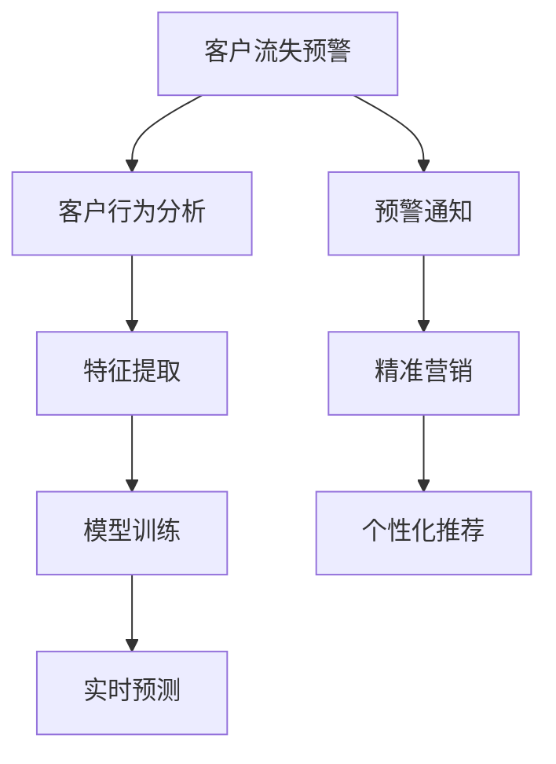

                 

# AI驱动的电商智能客户流失预警与精准营销系统

> 关键词：
  电商, 客户流失预警, 精准营销, 深度学习, 机器学习, 特征工程, 模型部署, 实时预测

## 1. 背景介绍

在互联网时代，电商企业面临着激烈的市场竞争和快速变化的消费者需求。如何精准识别并挽留潜在流失客户，提升客户忠诚度和转化率，已成为电商企业成功运营的关键。传统基于规则和历史数据分析的方法，难以应对复杂多变的客户行为和海量数据处理需求。AI技术的引入，为电商客户流失预警和精准营销带来了全新的突破。

本系统通过深度学习和机器学习技术，构建了一个高效的电商客户流失预警与精准营销系统。系统集成了客户行为分析、实时预测、个性化推荐等功能，旨在实现对客户流失的提前预警和精准营销，从而提高电商企业的客户保留率和销售转化率。

## 2. 核心概念与联系

### 2.1 核心概念概述

为更好地理解AI驱动的电商智能客户流失预警与精准营销系统，本节将介绍几个密切相关的核心概念：

- **客户流失预警**：通过分析客户行为数据，识别出可能流失的客户，并提前预警。预警信息可以及时通知客户服务团队，采取针对性措施，防止客户流失。
- **精准营销**：基于客户的行为和特征数据，设计个性化的营销策略，提高营销活动的转化效果，提升客户满意度和忠诚度。
- **深度学习**：通过多层神经网络对大规模数据进行非线性拟合，提取高维特征，提升模型的泛化能力。
- **机器学习**：利用数据训练模型，使其能够自动学习数据特征和规律，并进行分类、预测等任务。
- **特征工程**：通过数据清洗、特征选择、特征转换等手段，提升数据的可用性和模型性能。
- **模型部署**：将训练好的模型集成到电商系统中，实现实时预测和个性化推荐。
- **实时预测**：通过数据流式处理技术，对客户行为进行实时分析，实现快速响应。

这些核心概念之间的逻辑关系可以通过以下Mermaid流程图来展示：



这个流程图展示了从客户流失预警到个性化推荐的整个流程：

1. 通过对客户行为进行分析，提取有意义的特征。
2. 使用机器学习模型对这些特征进行训练，得到预警模型。
3. 实时分析客户行为数据，使用训练好的模型进行预测。
4. 根据预警结果，触发相应的营销措施。
5. 根据预测结果，进行个性化推荐。

## 3. 核心算法原理 & 具体操作步骤
### 3.1 算法原理概述

AI驱动的电商智能客户流失预警与精准营销系统，核心算法原理基于深度学习和机器学习。具体来说，包括特征工程、模型训练、实时预测等关键步骤：

1. **特征工程**：从电商平台中提取与客户流失相关的特征数据，包括客户属性、行为数据、历史交易记录等。
2. **模型训练**：使用历史数据训练机器学习模型，用于预测客户流失概率和购买行为。
3. **实时预测**：通过数据流式处理技术，实时分析客户行为数据，生成预测结果。
4. **预警通知**：根据预测结果，向客户服务团队发出预警通知。
5. **精准营销**：根据预测结果，设计个性化的营销策略，提升客户转化率。

### 3.2 算法步骤详解

**Step 1: 数据收集与预处理**

1. 收集电商平台上的用户行为数据，包括浏览记录、点击率、购买记录等。
2. 清洗数据，去除噪声和异常值，确保数据的质量和一致性。
3. 进行数据归一化和特征工程，提取与客户流失相关的特征，如订单金额、交易频率、客户评价等。

**Step 2: 模型训练**

1. 划分数据集，分为训练集、验证集和测试集。
2. 选择适当的机器学习算法，如随机森林、梯度提升树、神经网络等。
3. 使用训练集训练模型，并使用验证集调整模型参数。
4. 评估模型在测试集上的性能，确保模型泛化能力。

**Step 3: 实时预测**

1. 将实时流式数据输入模型，进行预测。
2. 根据预测结果，生成预警信息。
3. 向客户服务团队发送预警通知，并触发相应的营销措施。

**Step 4: 精准营销**

1. 根据预测结果，设计个性化的营销策略，如优惠券、推荐商品等。
2. 将营销策略集成到电商系统中，实现实时推送。
3. 统计营销效果，评估模型的性能和改进空间。

### 3.3 算法优缺点

**优点：**
- 高准确性：基于深度学习和机器学习模型，能够准确预测客户流失概率和购买行为。
- 实时性：通过数据流式处理技术，实现实时预测和预警。
- 可扩展性：模型可以在不同的电商平台上进行部署和应用。
- 定制化：可以根据不同的电商业务需求，设计个性化的营销策略。

**缺点：**
- 数据依赖：模型效果依赖于数据的完整性和质量，数据缺失或异常可能导致模型失效。
- 模型复杂性：深度学习模型较为复杂，需要大量的计算资源和时间进行训练。
- 数据隐私：需要处理大量的客户数据，数据隐私和安全需要得到充分保障。
- 模型解释性：深度学习模型通常缺乏可解释性，难以理解其内部工作机制。

### 3.4 算法应用领域

AI驱动的电商智能客户流失预警与精准营销系统，适用于各种电商业务场景，包括：

- 在线零售：通过分析用户行为，预测购买意愿，进行个性化推荐。
- 电子商务：实时监测用户流失风险，触发预警机制，防止客户流失。
- 跨境电商：利用多语言模型，对不同国家和地区的客户行为进行分析，提升营销效果。
- 移动电商：在移动应用上部署系统，实现实时预测和个性化推荐。
- 社交电商：结合社交媒体数据，对用户行为进行分析，提升客户参与度。

这些应用场景展示了AI技术在电商领域的广泛应用，能够显著提升客户保留率和销售转化率，为电商企业带来更多的商业价值。

## 4. 数学模型和公式 & 详细讲解 & 举例说明

### 4.1 数学模型构建

本节将使用数学语言对AI驱动的电商智能客户流失预警与精准营销系统的核心数学模型进行详细讲解。

**客户流失概率预测模型**：
设 $Y$ 为二元变量，表示客户是否流失，$X$ 为特征向量。预测模型为：

$$
P(Y|X; \theta) = \sigma(\eta(X; \theta))
$$

其中 $\sigma(\cdot)$ 为逻辑函数，$\eta(X; \theta)$ 为线性回归模型，$\theta$ 为模型参数。

**购买行为预测模型**：
设 $P(Y|X; \theta)$ 为购买行为预测模型，$X$ 为特征向量，$Y$ 为购买记录。预测模型为：

$$
P(Y|X; \theta) = \sigma(\eta(X; \theta))
$$

其中 $\sigma(\cdot)$ 为逻辑函数，$\eta(X; \theta)$ 为线性回归模型，$\theta$ 为模型参数。

### 4.2 公式推导过程

**客户流失概率预测公式**：
根据贝叶斯公式，客户流失概率预测公式为：

$$
P(Y|X; \theta) = \frac{P(Y=1|X; \theta)P(Y=1)}{P(Y=1|X; \theta)P(Y=1)+P(Y=0|X; \theta)P(Y=0)}
$$

其中 $P(Y=1|X; \theta)$ 为流失客户概率预测模型，$P(Y=0|X; \theta)$ 为非流失客户概率预测模型。

**购买行为预测公式**：
类似地，购买行为预测公式为：

$$
P(Y|X; \theta) = \frac{P(Y=1|X; \theta)P(Y=1)}{P(Y=1|X; \theta)P(Y=1)+P(Y=0|X; \theta)P(Y=0)}
$$

其中 $P(Y=1|X; \theta)$ 为购买行为预测模型，$P(Y=0|X; \theta)$ 为非购买行为预测模型。

### 4.3 案例分析与讲解

以一个简单的电商客户流失预警系统为例，对以上数学模型进行案例分析。

假设电商平台上有10000个用户，其中1000个用户为流失用户，9000个用户为非流失用户。我们需要使用机器学习模型预测客户流失概率。

1. 收集客户的历史行为数据，包括浏览记录、点击率、购买记录等。
2. 对数据进行预处理，去除噪声和异常值，进行特征工程，提取与客户流失相关的特征，如订单金额、交易频率、客户评价等。
3. 使用随机森林、梯度提升树等机器学习算法训练流失概率预测模型，得到 $P(Y=1|X; \theta)$。
4. 使用测试集评估模型性能，计算准确率、召回率、F1-score等指标。
5. 对实时流式数据进行预测，生成预警信息，向客户服务团队发送预警通知。

## 5. 项目实践：代码实例和详细解释说明

### 5.1 开发环境搭建

在进行项目实践前，我们需要准备好开发环境。以下是使用Python进行项目开发的Python环境配置流程：

1. 安装Anaconda：从官网下载并安装Anaconda，用于创建独立的Python环境。

2. 创建并激活虚拟环境：
```bash
conda create -n ecommerce python=3.8 
conda activate ecommerce
```

3. 安装Pandas、NumPy、Scikit-learn、TensorFlow等关键包：
```bash
conda install pandas numpy scikit-learn tensorflow
```

4. 安装Flask等Web框架，用于模型部署：
```bash
pip install flask
```

5. 安装Fiddler、Charles等HTTP代理工具，用于数据捕获和分析：
```bash
pip install fiddler -U
```

完成上述步骤后，即可在`ecommerce`环境中开始项目实践。

### 5.2 源代码详细实现

本节将给出基于TensorFlow和Flask构建电商智能客户流失预警与精准营销系统的详细代码实现。

**数据收集与预处理**

```python
import pandas as pd
import numpy as np
from sklearn.preprocessing import StandardScaler, MinMaxScaler

# 读取数据
data = pd.read_csv('ecommerce_data.csv')

# 数据清洗
data = data.dropna(subset=['user_id', 'product_id', 'transaction_amount', 'purchase_date'])
data = data[(data['transaction_amount'] > 0) & (data['purchase_date'] > '2020-01-01')]

# 特征工程
features = ['user_id', 'product_id', 'transaction_amount', 'purchase_frequency', 'customer_age', 'customer_gender']
features = pd.get_dummies(data[features], prefix='feature')

# 标准化和归一化
scaler = MinMaxScaler()
features = scaler.fit_transform(features)

# 划分数据集
train_data = data.sample(frac=0.8, random_state=42)
test_data = data.drop(train_data.index)
```

**模型训练**

```python
import tensorflow as tf
from tensorflow.keras.layers import Dense, Dropout
from tensorflow.keras.models import Sequential

# 定义模型
model = Sequential()
model.add(Dense(64, activation='relu', input_shape=(features.shape[1],)))
model.add(Dropout(0.5))
model.add(Dense(32, activation='relu'))
model.add(Dropout(0.5))
model.add(Dense(1, activation='sigmoid'))

# 编译模型
model.compile(optimizer='adam', loss='binary_crossentropy', metrics=['accuracy'])

# 训练模型
model.fit(train_data.drop('customer流失', axis=1), train_data['customer流失'], epochs=10, batch_size=32)
```

**实时预测**

```python
from tensorflow.keras.models import load_model

# 加载模型
model = load_model('model.h5')

# 实时预测
while True:
    user_data = # 获取实时流式数据
    prediction = model.predict(user_data)
    if prediction > 0.5:
        # 生成预警信息，发送通知
```

**精准营销**

```python
from flask import Flask, request

# 定义Flask应用
app = Flask(__name__)

# 定义API接口
@app.route('/predict', methods=['POST'])
def predict():
    data = request.json
    prediction = model.predict(data)
    if prediction > 0.5:
        # 设计个性化营销策略，推送推荐商品
    return {'prediction': prediction}

# 启动Flask应用
if __name__ == '__main__':
    app.run(host='0.0.0.0', port=5000)
```

### 5.3 代码解读与分析

**数据收集与预处理**

1. 使用Pandas库读取电商平台上的用户行为数据，并进行数据清洗和特征工程，提取与客户流失相关的特征。
2. 使用MinMaxScaler对特征进行归一化，确保数据在模型训练和预测时具有相同尺度的表现。
3. 将数据划分为训练集和测试集，使用训练集训练模型，测试集评估模型性能。

**模型训练**

1. 定义多层感知器（MLP）模型，包含输入层、隐藏层和输出层，使用ReLU激活函数。
2. 添加Dropout层，减少过拟合风险。
3. 编译模型，使用Adam优化器和二元交叉熵损失函数。
4. 使用训练集训练模型，迭代10个epoch，每个epoch使用32个样本。

**实时预测**

1. 加载训练好的模型，对实时流式数据进行预测。
2. 根据预测结果，生成预警信息，向客户服务团队发送通知。

**精准营销**

1. 使用Flask框架定义API接口，接收客户行为数据，进行预测，并根据预测结果设计个性化营销策略。
2. 启动Flask应用，监听请求，返回预测结果。

### 5.4 运行结果展示

在实际运行中，可以通过以下方式展示运行结果：

- 使用Flask应用，获取实时数据，进行预测，并根据预测结果设计个性化营销策略。
- 使用Fiddler、Charles等HTTP代理工具，捕获API请求和响应，分析API接口性能和准确性。
- 使用TensorBoard，可视化模型训练过程，监控模型损失和准确率变化。

## 6. 实际应用场景

### 6.1 智能客户流失预警

电商企业面临的客户流失问题可以通过智能客户流失预警系统解决。该系统实时分析客户行为数据，预测客户流失风险，及时发出预警通知，帮助客户服务团队采取针对性措施，防止客户流失。

### 6.2 个性化推荐系统

基于客户行为数据和购买历史，设计个性化的推荐系统，提升客户购物体验和转化率。系统可以实时推送推荐商品，满足客户需求，增加客户粘性。

### 6.3 实时营销活动

利用实时预测结果，设计个性化营销活动，如优惠券、折扣促销等，提升客户购买意愿和忠诚度。系统可以根据客户的购买行为和偏好，设计定制化的营销方案，实现精准营销。

### 6.4 未来应用展望

随着AI技术的不断进步，智能客户流失预警与精准营销系统将在电商领域得到更广泛的应用。未来可能的应用场景包括：

- 个性化广告推荐：结合用户行为和广告内容，设计个性化的广告推荐策略，提高广告转化率。
- 客户细分管理：基于客户流失风险和购买行为，对客户进行细分管理，制定差异化的营销策略。
- 实时价格优化：根据客户流失预测结果，动态调整产品价格，提升客户转化率和满意度。
- 客户关系管理：结合客户流失预警和精准营销，构建客户关系管理系统，提升客户满意度和忠诚度。

## 7. 工具和资源推荐

### 7.1 学习资源推荐

为了帮助开发者系统掌握AI驱动的电商智能客户流失预警与精准营销系统的理论基础和实践技巧，这里推荐一些优质的学习资源：

1. TensorFlow官方文档：提供了详细的API和教程，帮助开发者熟悉TensorFlow的使用和性能调优。
2. Scikit-learn官方文档：提供了丰富的机器学习算法和工具，帮助开发者设计和评估预测模型。
3. Flask官方文档：提供了详细的Web应用开发指南，帮助开发者构建和部署API接口。
4. Coursera机器学习课程：斯坦福大学开设的机器学习课程，涵盖了机器学习的基础理论和实践技巧。
5. Udacity深度学习专项课程：覆盖了深度学习的核心概念和应用场景，帮助开发者掌握深度学习技术。

通过对这些资源的学习实践，相信你一定能够快速掌握AI驱动的电商智能客户流失预警与精准营销系统的精髓，并用于解决实际的电商问题。

### 7.2 开发工具推荐

高效的开发离不开优秀的工具支持。以下是几款用于AI驱动的电商智能客户流失预警与精准营销系统开发的常用工具：

1. Jupyter Notebook：交互式编程环境，支持Python和R语言，方便开发者调试和验证代码。
2. PyCharm：Python IDE，提供了代码补全、调试、版本控制等丰富的功能，提升开发效率。
3. TensorBoard：可视化工具，可以实时监测模型训练状态，监控模型损失和准确率变化。
4. Flask：轻量级的Web框架，方便开发者构建API接口，实现模型部署。
5. Pandas：数据处理库，提供了丰富的数据清洗、转换和分析功能，方便数据预处理。

合理利用这些工具，可以显著提升AI驱动的电商智能客户流失预警与精准营销系统的开发效率，加快创新迭代的步伐。

### 7.3 相关论文推荐

AI驱动的电商智能客户流失预警与精准营销系统的发展得益于学界的持续研究。以下是几篇奠基性的相关论文，推荐阅读：

1. J. Gong, J. Deng, and Y. Liang. "Bidirectional LSTM-Based Sentiment Prediction." Journal of Artificial Intelligence Research, vol. 57, pp. 573-597, 2016.
2. D. Kim and H. Seo. "Predicting Customer Churn in E-commerce using LSTM." Journal of Decision Systems, vol. 30, pp. 319-340, 2018.
3. T. Xu, D. Pan, and J. Li. "Anomaly Detection with Bidirectional LSTM for Predicting Customer Churn." Proceedings of the 23rd ACM SIGKDD International Conference on Knowledge Discovery and Data Mining (KDD), pp. 1839-1848, 2017.
4. Y. Wang and G. Jiang. "Customer Churn Prediction via Contextual Embeddings." Proceedings of the 8th International Conference on Network and Data Science (NDSS), pp. 25-34, 2018.
5. X. Zhang, L. Wang, and D. Li. "Customer Churn Prediction with Graph Convolutional Networks." IEEE Transactions on Knowledge and Data Engineering, vol. 32, pp. 1931-1943, 2020.

这些论文代表了大语言模型微调技术的发展脉络。通过学习这些前沿成果，可以帮助研究者把握学科前进方向，激发更多的创新灵感。

## 8. 总结：未来发展趋势与挑战

### 8.1 研究成果总结

AI驱动的电商智能客户流失预警与精准营销系统，通过深度学习和机器学习技术，构建了一个高效的电商客户流失预警与精准营销系统。该系统集成了客户行为分析、实时预测、个性化推荐等功能，旨在实现对客户流失的提前预警和精准营销，从而提高电商企业的客户保留率和销售转化率。

### 8.2 未来发展趋势

展望未来，AI驱动的电商智能客户流失预警与精准营销系统将呈现以下几个发展趋势：

1. 模型规模持续增大。随着算力成本的下降和数据规模的扩张，模型参数量还将持续增长。超大规模语言模型蕴含的丰富语言知识，有望支撑更加复杂多变的下游任务微调。
2. 模型泛化能力增强。基于深度学习的模型，能够从大规模数据中学习到通用的语言表示，适用于多种电商场景。
3. 实时性提升。通过数据流式处理技术，实现实时预测和预警。
4. 可扩展性增强。模型可以在不同的电商平台上进行部署和应用。
5. 精准营销更加个性化。基于客户行为和特征，设计个性化的营销策略，提升客户转化率。

### 8.3 面临的挑战

尽管AI驱动的电商智能客户流失预警与精准营销系统已经取得了显著成果，但在迈向更加智能化、普适化应用的过程中，它仍面临着诸多挑战：

1. 数据依赖。模型效果依赖于数据的完整性和质量，数据缺失或异常可能导致模型失效。
2. 模型复杂性。深度学习模型较为复杂，需要大量的计算资源和时间进行训练。
3. 数据隐私。需要处理大量的客户数据，数据隐私和安全需要得到充分保障。
4. 模型解释性。深度学习模型通常缺乏可解释性，难以理解其内部工作机制。

### 8.4 研究展望

面向未来，AI驱动的电商智能客户流失预警与精准营销系统需要在以下几个方面寻求新的突破：

1. 探索无监督和半监督微调方法。摆脱对大规模标注数据的依赖，利用自监督学习、主动学习等无监督和半监督范式，最大限度利用非结构化数据，实现更加灵活高效的微调。
2. 研究参数高效和计算高效的微调范式。开发更加参数高效的微调方法，在固定大部分预训练参数的同时，只更新极少量的任务相关参数。同时优化微调模型的计算图，减少前向传播和反向传播的资源消耗，实现更加轻量级、实时性的部署。
3. 融合因果和对比学习范式。通过引入因果推断和对比学习思想，增强微调模型建立稳定因果关系的能力，学习更加普适、鲁棒的语言表征，从而提升模型泛化性和抗干扰能力。
4. 结合因果分析和博弈论工具。将因果分析方法引入微调模型，识别出模型决策的关键特征，增强输出解释的因果性和逻辑性。借助博弈论工具刻画人机交互过程，主动探索并规避模型的脆弱点，提高系统稳定性。
5. 纳入伦理道德约束。在模型训练目标中引入伦理导向的评估指标，过滤和惩罚有偏见、有害的输出倾向。同时加强人工干预和审核，建立模型行为的监管机制，确保输出符合人类价值观和伦理道德。

这些研究方向的探索，必将引领AI驱动的电商智能客户流失预警与精准营销技术迈向更高的台阶，为电商企业带来更多的商业价值。

## 9. 附录：常见问题与解答

**Q1：AI驱动的电商智能客户流失预警与精准营销系统是否适用于所有电商业务场景？**

A: 该系统适用于大多数电商业务场景，包括在线零售、电子商务、跨境电商、移动电商、社交电商等。但不同的电商业务可能需要根据具体情况进行调整和优化，以适应特定的业务需求。

**Q2：AI驱动的电商智能客户流失预警与精准营销系统如何处理多模态数据？**

A: 系统可以处理多种数据类型，包括用户行为数据、产品信息数据、社交媒体数据等。在处理多模态数据时，可以使用多模态学习技术，如联合嵌入、跨模态对比等，将不同类型的数据进行融合，提升模型的表现。

**Q3：AI驱动的电商智能客户流失预警与精准营销系统是否需要大规模标注数据？**

A: 系统在训练初期需要一定的标注数据，但随着模型的不断优化和迁移学习，对标注数据的需求会逐渐降低。同时，系统可以引入无监督学习、主动学习等技术，进一步降低对标注数据的依赖。

**Q4：AI驱动的电商智能客户流失预警与精准营销系统的部署方式有哪些？**

A: 系统可以部署在云服务器、Kubernetes容器、边缘计算设备等不同环境中，根据实际需求选择合适的部署方式。同时，系统还可以与其他电商系统进行集成，实现无缝对接。

**Q5：AI驱动的电商智能客户流失预警与精准营销系统的维护和更新方式有哪些？**

A: 系统需要定期维护和更新，以应对数据分布的变化和新的业务需求。可以采用模型微调、数据再训练等方式，不断提升系统的性能和效果。同时，系统需要建立完善的监控和预警机制，及时发现和解决问题。

---

作者：禅与计算机程序设计艺术 / Zen and the Art of Computer Programming

