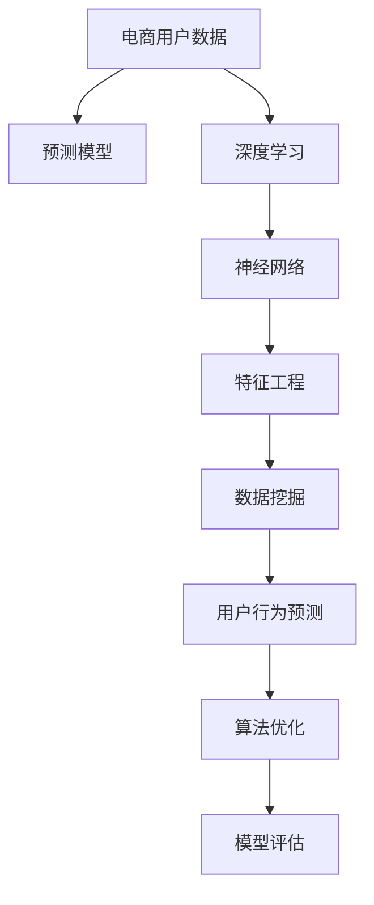

                 

# AI驱动的电商用户购买倾向预测模型

> 关键词：电商用户分析, 预测模型, 深度学习, 神经网络, 特征工程, 数据挖掘, 用户行为预测, 算法优化, 模型评估

## 1. 背景介绍

### 1.1 问题由来
随着电子商务的迅速发展，电商企业面临着日益激烈的竞争。如何精准把握用户行为，预测其购买倾向，已成为电商企业提升销售转化率、优化用户体验的关键问题。传统的基于规则的推荐算法虽然简单易用，但缺乏对用户行为的深入理解，无法适应动态变化的市场需求。

与此同时，随着人工智能和大数据技术的日渐成熟，基于深度学习的用户购买倾向预测模型成为电商企业的新宠。这类模型能够通过学习用户行为数据，挖掘深层次的特征和模式，从而提供更加个性化和精准的推荐服务。然而，构建一个高效的电商用户购买倾向预测模型并非易事，需要综合运用多领域的知识和技能，涉及数据采集、特征工程、模型设计、评估优化等诸多环节。

### 1.2 问题核心关键点
电商用户购买倾向预测模型的核心目标是通过学习历史用户行为数据，构建一个能够准确预测用户是否会购买某类产品的模型。该模型应具备以下特点：

1. **高准确性**：能够对用户是否购买某类产品进行精确预测，尽量减少误判。
2. **高效性**：在数据量庞大、处理速度快的前提下，仍能保持较低的计算成本和内存占用。
3. **可解释性**：能够解释模型的决策依据，帮助电商企业理解用户行为的内在逻辑。
4. **适应性强**：能够适应不同品类、不同用户群体、不同场景的需求，具有广泛的普适性。
5. **鲁棒性**：能够应对噪声数据、异常数据等干扰，具备良好的稳定性和可靠性。

## 2. 核心概念与联系

### 2.1 核心概念概述

为更好地理解电商用户购买倾向预测模型，本节将介绍几个密切相关的核心概念：

- **电商用户数据**：包括用户的浏览历史、购买记录、评价反馈等，是构建预测模型的基础。
- **预测模型**：基于用户行为数据构建的数学模型，能够预测用户是否会购买某类产品。
- **深度学习**：一类通过多层次神经网络实现特征提取和模式识别的机器学习方法，广泛应用于电商推荐系统。
- **神经网络**：深度学习的核心组件，由大量的人工神经元节点和多层连接构成，能够对复杂非线性问题进行建模。
- **特征工程**：对原始数据进行预处理和特征提取，生成有助于模型训练的特征集合。
- **数据挖掘**：从大量的数据中提取有用的信息，发现潜在的模式和规律。
- **用户行为预测**：通过学习用户历史行为，预测用户未来的行为，如购买、点击、收藏等。
- **算法优化**：通过对模型进行参数调优、正则化、早停等手段，提升模型性能。
- **模型评估**：使用交叉验证、AUC、RMSE等指标评估模型的预测能力。

这些核心概念之间的逻辑关系可以通过以下Mermaid流程图来展示：



这个流程图展示了几大核心概念及其之间的相互关系：

1. 电商用户数据是构建预测模型的基础。
2. 预测模型通过深度学习中的神经网络实现特征提取和模式识别。
3. 特征工程对原始数据进行预处理和特征提取，以提升模型的预测能力。
4. 数据挖掘从电商用户数据中提取有用的信息，发现潜在的模式和规律。
5. 用户行为预测通过学习历史数据，预测用户未来的行为。
6. 算法优化通过参数调优、正则化、早停等手段，提升模型性能。
7. 模型评估使用交叉验证、AUC、RMSE等指标评估模型的预测能力。

这些概念共同构成了电商用户购买倾向预测模型的核心框架，使其能够精准预测用户购买行为，为电商企业提供高效的个性化推荐服务。

## 3. 核心算法原理 & 具体操作步骤
### 3.1 算法原理概述

电商用户购买倾向预测模型基于深度学习中的神经网络实现，通过对用户历史行为数据进行学习和训练，构建一个能够预测用户是否会购买某类产品的模型。

形式化地，假设用户历史行为数据集为 $D=\{(x_i, y_i)\}_{i=1}^N$，其中 $x_i$ 表示第 $i$ 个用户的特征向量，$y_i$ 表示该用户是否购买产品的标签。模型的目标是最小化预测错误，即找到最优模型 $M$，使得：

$$
\mathop{\arg\min}_{M} \sum_{i=1}^N L(M(x_i), y_i)
$$

其中 $L$ 为损失函数，如交叉熵损失、均方误差损失等。

### 3.2 算法步骤详解

电商用户购买倾向预测模型的构建过程包括数据准备、模型设计、训练和评估等多个步骤。下面详细介绍这些步骤：

**Step 1: 数据准备**

1. **数据采集**：收集用户的浏览历史、购买记录、评价反馈等数据，构建用户行为数据集 $D$。

2. **数据清洗**：处理缺失值、异常值、重复记录等，确保数据的质量和完整性。

3. **数据划分**：将数据集划分为训练集、验证集和测试集，通常使用80%数据用于训练，10%数据用于验证，10%数据用于测试。

**Step 2: 模型设计**

1. **选择模型架构**：基于电商用户数据的特点，选择合适的神经网络架构。如多层感知器(Multilayer Perceptron, MLP)、卷积神经网络(Convolutional Neural Network, CNN)、循环神经网络(Recurrent Neural Network, RNN)等。

2. **设计特征提取层**：根据电商用户数据的特征，设计特征提取层，将原始数据转换为模型能够理解的特征表示。

3. **添加分类器**：在模型的顶层添加分类器，如softmax分类器，用于预测用户是否会购买某类产品。

**Step 3: 模型训练**

1. **选择优化器**：根据模型的架构和任务需求，选择合适的优化器，如Adam、SGD等。

2. **设置超参数**：根据经验或调参，设置学习率、批大小、迭代轮数等超参数。

3. **执行训练**：使用训练集对模型进行训练，每个批次输入一部分数据，进行前向传播和反向传播，更新模型参数。

**Step 4: 模型评估**

1. **评估指标**：使用交叉验证、AUC、RMSE等指标评估模型性能。

2. **调整模型**：根据评估结果，调整模型结构、优化器参数、正则化参数等，进一步提升模型性能。

3. **模型测试**：在测试集上测试模型，评估其在实际场景中的表现。

### 3.3 算法优缺点

电商用户购买倾向预测模型具有以下优点：

1. **高准确性**：通过深度学习，能够从原始数据中挖掘出深层次的特征和模式，提升预测的准确性。

2. **高效性**：深度学习模型在处理大量数据时，能够保持较低的计算成本和内存占用。

3. **可解释性**：通过特征工程和模型可视化工具，可以解释模型的决策依据，帮助电商企业理解用户行为的内在逻辑。

4. **适应性强**：适用于不同品类、不同用户群体、不同场景的电商推荐系统，具有广泛的普适性。

5. **鲁棒性**：深度学习模型具有较强的泛化能力，能够应对噪声数据、异常数据等干扰，具备良好的稳定性和可靠性。

同时，该模型也存在以下缺点：

1. **高数据需求**：需要大量的电商用户数据进行训练，数据收集和处理成本较高。

2. **模型复杂度**：深度学习模型的参数量巨大，容易过拟合，需要较多的计算资源和算力支持。

3. **计算复杂度高**：深度学习模型的训练和推理需要较高的计算资源，对硬件要求较高。

4. **模型解释性差**：深度学习模型的内部机制复杂，难以解释其决策依据。

5. **模型调整难度大**：深度学习模型结构复杂，参数众多，调整模型结构时需要谨慎操作。

尽管存在这些局限性，但电商用户购买倾向预测模型在电商推荐系统中取得了显著的效果，成为电商企业提高用户转化率和个性化推荐的重要手段。

### 3.4 算法应用领域

电商用户购买倾向预测模型在电商推荐系统中得到了广泛应用，具体包括：

1. **个性化推荐**：通过学习用户历史行为数据，预测用户对某类产品的购买倾向，提供个性化推荐。

2. **广告投放优化**：根据用户的购买倾向，优化广告投放策略，提高广告的转化率和ROI。

3. **库存管理**：预测不同产品在不同时间段的销售情况，帮助电商企业合理规划库存，避免断货或积压。

4. **市场趋势分析**：分析不同品类、不同时间段的销售趋势，帮助电商企业把握市场动态，制定更科学的营销策略。

5. **用户行为分析**：通过用户购买倾向预测模型，分析用户行为模式，提供有针对性的用户服务，提升用户满意度。

除了这些应用场景，电商用户购买倾向预测模型还可以应用于客户细分、风险控制、销售预测等多个领域，为电商企业提供全方位的决策支持。

## 4. 数学模型和公式 & 详细讲解  
### 4.1 数学模型构建

本节将使用数学语言对电商用户购买倾向预测模型进行更加严格的刻画。

假设用户历史行为数据集为 $D=\{(x_i, y_i)\}_{i=1}^N$，其中 $x_i$ 表示第 $i$ 个用户的特征向量，$y_i$ 表示该用户是否购买产品的标签。模型的目标是最小化预测错误，即找到最优模型 $M$，使得：

$$
\mathop{\arg\min}_{M} \sum_{i=1}^N L(M(x_i), y_i)
$$

其中 $L$ 为损失函数，如交叉熵损失、均方误差损失等。

以交叉熵损失为例，假设模型的输出为 $\hat{y}_i$，则损失函数为：

$$
L(M(x_i), y_i) = -y_i\log\hat{y}_i - (1-y_i)\log(1-\hat{y}_i)
$$

### 4.2 公式推导过程

以下我们以二分类任务为例，推导交叉熵损失函数及其梯度的计算公式。

假设模型的输出为 $\hat{y}_i$，其中 $\hat{y}_i$ 表示用户 $i$ 是否购买产品的概率。真实标签 $y_i \in \{0,1\}$。则二分类交叉熵损失函数定义为：

$$
L(M(x_i), y_i) = -y_i\log\hat{y}_i - (1-y_i)\log(1-\hat{y}_i)
$$

将其代入总体损失函数公式，得：

$$
\mathcal{L}(M) = \frac{1}{N}\sum_{i=1}^N L(M(x_i), y_i)
$$

根据链式法则，损失函数对模型参数 $\theta$ 的梯度为：

$$
\frac{\partial \mathcal{L}(M)}{\partial \theta} = \frac{1}{N}\sum_{i=1}^N [\frac{-y_i}{\hat{y}_i} + \frac{1-y_i}{1-\hat{y}_i}] \frac{\partial \hat{y}_i}{\partial \theta}
$$

其中 $\frac{\partial \hat{y}_i}{\partial \theta}$ 可进一步递归展开，利用自动微分技术完成计算。

在得到损失函数的梯度后，即可带入优化算法，完成模型的迭代优化。重复上述过程直至收敛，最终得到适应电商用户购买倾向预测的模型参数 $\theta^*$。

## 5. 项目实践：代码实例和详细解释说明
### 5.1 开发环境搭建

在进行电商用户购买倾向预测模型的开发前，我们需要准备好开发环境。以下是使用Python进行PyTorch开发的环境配置流程：

1. 安装Anaconda：从官网下载并安装Anaconda，用于创建独立的Python环境。

2. 创建并激活虚拟环境：
```bash
conda create -n pytorch-env python=3.8 
conda activate pytorch-env
```

3. 安装PyTorch：根据CUDA版本，从官网获取对应的安装命令。例如：
```bash
conda install pytorch torchvision torchaudio cudatoolkit=11.1 -c pytorch -c conda-forge
```

4. 安装TensorFlow：
```bash
pip install tensorflow
```

5. 安装各类工具包：
```bash
pip install numpy pandas scikit-learn matplotlib tqdm jupyter notebook ipython
```

完成上述步骤后，即可在`pytorch-env`环境中开始电商用户购买倾向预测模型的开发。

### 5.2 源代码详细实现

下面以电商用户购买倾向预测为例，给出使用PyTorch进行模型开发的Python代码实现。

首先，定义数据处理函数：

```python
import torch
import numpy as np
from sklearn.model_selection import train_test_split
from torch.utils.data import TensorDataset, DataLoader

def load_data():
    # 读取电商用户数据
    with open('data.csv', 'r') as f:
        data = pd.read_csv(f)
        
    # 数据清洗和预处理
    data = data.dropna()
    data = data.drop_duplicates()
    
    # 特征选择和编码
    features = data[['item_id', 'brand', 'price', 'time', 'gender']]
    labels = data['purchase']
    
    # 数据标准化
    features = (features - features.mean()) / features.std()
    
    # 特征编码
    from sklearn.preprocessing import OneHotEncoder, StandardScaler
    encoder = OneHotEncoder()
    features = encoder.fit_transform(features)
    
    # 数据切分为训练集和测试集
    train_features, test_features, train_labels, test_labels = train_test_split(features, labels, test_size=0.2)
    
    # 数据转换为Tensor格式
    train_features = torch.from_numpy(train_features.toarray()).float()
    train_labels = torch.from_numpy(train_labels.values).float()
    test_features = torch.from_numpy(test_features.toarray()).float()
    test_labels = torch.from_numpy(test_labels.values).float()
    
    return train_features, train_labels, test_features, test_labels

# 定义模型
class Net(nn.Module):
    def __init__(self, input_size, hidden_size, output_size):
        super(Net, self).__init__()
        self.fc1 = nn.Linear(input_size, hidden_size)
        self.fc2 = nn.Linear(hidden_size, output_size)
        self.sigmoid = nn.Sigmoid()
    
    def forward(self, x):
        x = self.fc1(x)
        x = self.sigmoid(x)
        x = self.fc2(x)
        return self.sigmoid(x)

# 定义优化器和损失函数
model = Net(input_size, hidden_size, output_size)
optimizer = Adam(model.parameters(), lr=learning_rate)
loss_fn = nn.BCELoss()

# 加载数据
train_features, train_labels, test_features, test_labels = load_data()

# 定义训练函数
def train(model, train_features, train_labels, optimizer, epochs):
    for epoch in range(epochs):
        model.train()
        train_loss = 0
        correct = 0
        for batch_idx, (features, labels) in enumerate(train_loader):
            optimizer.zero_grad()
            output = model(features)
            loss = loss_fn(output, labels)
            loss.backward()
            optimizer.step()
            train_loss += loss.item()
            correct += torch.sum(output >= 0.5).item()
        train_loss /= len(train_loader.dataset)
        correct /= len(train_loader.dataset)
        print('Epoch: {}, Train Loss: {:.4f}, Accuracy: {:.2f}%'.format(epoch+1, train_loss, correct*100))
    
# 定义评估函数
def evaluate(model, test_features, test_labels):
    model.eval()
    test_loss = 0
    correct = 0
    with torch.no_grad():
        for batch_idx, (features, labels) in enumerate(test_loader):
            output = model(features)
            loss = loss_fn(output, labels)
            test_loss += loss.item()
            correct += torch.sum(output >= 0.5).item()
    test_loss /= len(test_loader.dataset)
    correct /= len(test_loader.dataset)
    print('Test Loss: {:.4f}, Accuracy: {:.2f}%'.format(test_loss, correct*100))
```

接着，启动训练流程并在测试集上评估：

```python
epochs = 10
learning_rate = 0.001

# 定义数据加载器
train_features, train_labels, test_features, test_labels = load_data()
train_loader = DataLoader(train_features, train_labels, batch_size=batch_size, shuffle=True)
test_loader = DataLoader(test_features, test_labels, batch_size=batch_size, shuffle=False)

# 训练模型
train(model, train_features, train_labels, optimizer, epochs)

# 评估模型
evaluate(model, test_features, test_labels)
```

以上就是使用PyTorch进行电商用户购买倾向预测的完整代码实现。可以看到，借助深度学习框架，我们能够轻松搭建、训练和评估深度学习模型，进行电商用户购买倾向预测。

### 5.3 代码解读与分析

让我们再详细解读一下关键代码的实现细节：

**load_data函数**：
- 读取电商用户数据，并进行清洗和预处理。
- 特征选择和编码，将文本特征转换为数值型特征。
- 数据标准化，减少数据分布的偏差。
- 数据切分，构建训练集和测试集。
- 数据转换为Tensor格式，供深度学习模型使用。

**Net类**：
- 定义模型结构，包括输入层、隐藏层和输出层。
- 定义前向传播函数，实现特征的逐层计算。

**模型训练函数train**：
- 定义训练循环，每个epoch内对模型进行迭代优化。
- 计算训练集的损失和准确率，并输出结果。
- 使用随机梯度下降(Adam)优化算法更新模型参数。

**模型评估函数evaluate**：
- 定义评估循环，对测试集进行迭代评估。
- 计算测试集的损失和准确率，并输出结果。
- 使用TensorDataset和DataLoader加载测试集数据。

**训练流程**：
- 定义总的epoch数和初始学习率。
- 加载数据集和数据加载器。
- 在训练集上训练模型，并在每个epoch结束时输出训练集损失和准确率。
- 在测试集上评估模型，输出测试集损失和准确率。

可以看到，借助深度学习框架和PyTorch的强大封装，电商用户购买倾向预测模型的开发变得简洁高效。开发者可以将更多精力放在模型架构设计、数据处理、模型优化等高层逻辑上，而不必过多关注底层的实现细节。

当然，工业级的系统实现还需考虑更多因素，如模型的保存和部署、超参数的自动搜索、更灵活的任务适配层等。但核心的模型训练流程基本与此类似。

## 6. 实际应用场景
### 6.1 智能推荐系统

电商用户购买倾向预测模型在智能推荐系统中得到了广泛应用。智能推荐系统能够根据用户的历史行为和当前需求，推荐合适的产品，提升用户购物体验和转化率。

在技术实现上，电商用户购买倾向预测模型可以作为推荐系统的一部分，与协同过滤、基于内容的推荐算法等技术结合，提供更精准的个性化推荐服务。通过学习用户行为数据，模型能够预测用户对某类产品的购买倾向，从而优化推荐策略，提高推荐效果。

### 6.2 用户行为分析

电商企业可以通过电商用户购买倾向预测模型，分析用户行为模式，提供有针对性的用户服务，提升用户满意度。例如，通过预测用户的购物意愿，电商企业可以在合适的时间点发送个性化的促销信息和产品推荐，增加用户的购买意愿和忠诚度。

此外，电商企业还可以通过分析用户的购买倾向，识别出高价值用户和潜在流失用户，制定更科学的营销策略和用户留存计划，提升整体运营效率。

### 6.3 库存管理

电商企业可以通过电商用户购买倾向预测模型，预测不同产品在不同时间段的销售情况，帮助企业合理规划库存，避免断货或积压。例如，通过预测热门产品的销量，电商企业可以及时调整采购和库存策略，优化供应链管理，减少库存成本和缺货风险。

### 6.4 市场趋势分析

电商企业可以通过电商用户购买倾向预测模型，分析不同品类、不同时间段的销售趋势，把握市场动态，制定更科学的营销策略。例如，通过预测不同品类的销售趋势，电商企业可以调整产品组合和价格策略，优化产品结构和盈利模式，提升市场竞争力。

## 7. 工具和资源推荐
### 7.1 学习资源推荐

为了帮助开发者系统掌握电商用户购买倾向预测的理论基础和实践技巧，这里推荐一些优质的学习资源：

1. 《深度学习》：Ian Goodfellow等著，系统介绍了深度学习的原理和应用，是深度学习领域的经典教材。

2. PyTorch官方文档：PyTorch的官方文档，详细介绍了深度学习模型的构建、训练、评估等流程，是PyTorch开发的基础。

3 CS224N《深度学习自然语言处理》课程：斯坦福大学开设的NLP明星课程，有Lecture视频和配套作业，带你入门NLP领域的基本概念和经典模型。

4 《TensorFlow实战》：Xavier Bresson等著，详细介绍了TensorFlow的编程技巧和应用案例，是TensorFlow开发的好帮手。

5 《机器学习实战》：Peter Harrington著，通过实际案例讲解机器学习算法和模型，是机器学习入门的经典书籍。

通过对这些资源的学习实践，相信你一定能够快速掌握电商用户购买倾向预测的精髓，并用于解决实际的电商推荐问题。
###  7.2 开发工具推荐

高效的开发离不开优秀的工具支持。以下是几款用于电商用户购买倾向预测开发的常用工具：

1. PyTorch：基于Python的开源深度学习框架，灵活动态的计算图，适合快速迭代研究。大部分深度学习模型都有PyTorch版本的实现。

2 TensorFlow：由Google主导开发的开源深度学习框架，生产部署方便，适合大规模工程应用。同样有丰富的深度学习模型资源。

3 Weights & Biases：模型训练的实验跟踪工具，可以记录和可视化模型训练过程中的各项指标，方便对比和调优。与主流深度学习框架无缝集成。

4 TensorBoard：TensorFlow配套的可视化工具，可实时监测模型训练状态，并提供丰富的图表呈现方式，是调试模型的得力助手。

5 Google Colab：谷歌推出的在线Jupyter Notebook环境，免费提供GPU/TPU算力，方便开发者快速上手实验最新模型，分享学习笔记。

合理利用这些工具，可以显著提升电商用户购买倾向预测任务的开发效率，加快创新迭代的步伐。

### 7.3 相关论文推荐

电商用户购买倾向预测技术的发展得益于深度学习和大数据技术的日趋成熟。以下是几篇奠基性的相关论文，推荐阅读：

1. Hinton, G. E., Osindero, S., & Teh, Y. W. (2006). A fast learning algorithm for deep belief nets. Neural Computation, 18(7), 1527-1554.

2. LeCun, Y., Bottou, L., Bengio, Y., & Haffner, P. (1998). Gradient-based learning applied to document recognition. Proceedings of the IEEE, 86(11), 2278-2324.

3. Goodfellow, I., Bengio, Y., & Courville, A. (2016). Deep learning. MIT Press.

4. He, K., Zhang, X., Ren, S., & Sun, J. (2016). Deep residual learning for image recognition. Proceedings of the IEEE conference on computer vision and pattern recognition, 770-778.

5 《A Comprehensive Survey on Multi-Task Learning for Personalized Recommendation Systems》: 这篇综述文章详细介绍了多任务学习在电商推荐系统中的应用，值得一读。

这些论文代表了大语言模型微调技术的发展脉络。通过学习这些前沿成果，可以帮助研究者把握学科前进方向，激发更多的创新灵感。

## 8. 总结：未来发展趋势与挑战

### 8.1 总结

本文对电商用户购买倾向预测模型进行了全面系统的介绍。首先阐述了电商用户购买倾向预测模型的背景和意义，明确了电商用户购买倾向预测模型的目标和特点。其次，从原理到实践，详细讲解了电商用户购买倾向预测模型的构建过程，给出了完整的代码实例。同时，本文还广泛探讨了电商用户购买倾向预测模型在智能推荐系统、用户行为分析、库存管理等领域的实际应用，展示了电商用户购买倾向预测模型的巨大潜力。此外，本文精选了电商用户购买倾向预测模型的各类学习资源，力求为读者提供全方位的技术指引。

通过本文的系统梳理，可以看到，电商用户购买倾向预测模型在电商推荐系统中取得了显著的效果，成为电商企业提高用户转化率和个性化推荐的重要手段。未来，伴随深度学习和大数据技术的进一步发展，电商用户购买倾向预测模型将不断优化，进一步提升电商推荐系统的性能和用户体验。

### 8.2 未来发展趋势

展望未来，电商用户购买倾向预测模型的发展趋势主要包括以下几个方向：

1. **深度模型的发展**：深度学习模型的结构将更加复杂，参数量将进一步增大，模型性能将得到进一步提升。

2. **多模态信息融合**：将视觉、语音、文本等多模态信息融合，构建多模态电商推荐系统，提升推荐效果和用户体验。

3. **个性化推荐**：通过电商用户购买倾向预测模型，实现更加个性化和精准的推荐，提高用户满意度和转化率。

4. **实时推荐**：利用深度学习模型的高效性和可扩展性，实现实时推荐，提升电商平台的响应速度和用户体验。

5. **数据驱动的营销策略**：通过电商用户购买倾向预测模型，分析用户行为模式，制定更加科学和高效的营销策略，提升整体运营效率。

6. **用户行为预测**：通过电商用户购买倾向预测模型，预测用户未来的行为，提升电商平台的市场竞争力。

这些趋势表明，电商用户购买倾向预测模型将成为电商推荐系统的重要组成部分，推动电商企业向更加智能和高效的方向发展。

### 8.3 面临的挑战

尽管电商用户购买倾向预测模型在电商推荐系统中取得了显著的效果，但在迈向更加智能化、普适化应用的过程中，它仍面临诸多挑战：

1. **数据获取和处理成本高**：电商用户购买倾向预测模型的构建需要大量的电商用户数据，数据采集和处理成本较高。

2. **模型复杂度大**：深度学习模型的结构复杂，参数量巨大，训练和推理过程中需要大量的计算资源和算力支持。

3. **模型可解释性差**：深度学习模型的内部机制复杂，难以解释其决策依据。

4. **模型调整难度大**：深度学习模型结构复杂，参数众多，调整模型结构时需要谨慎操作。

5. **数据质量影响大**：电商用户数据的噪声和异常值较多，对模型性能的影响较大。

6. **鲁棒性不足**：电商用户购买倾向预测模型在面对噪声数据、异常数据等干扰时，泛化性能可能下降。

尽管存在这些挑战，但电商用户购买倾向预测模型在电商推荐系统中已取得显著效果，成为电商企业提高用户转化率和个性化推荐的重要手段。未来，随着深度学习和大数据技术的进一步发展，电商用户购买倾向预测模型将不断优化，克服现有挑战，进一步提升电商推荐系统的性能和用户体验。

### 8.4 研究展望

未来的研究需要在以下几个方面寻求新的突破：

1. **数据增强技术**：通过数据增强技术，提升电商用户购买倾向预测模型的泛化能力，增强模型的鲁棒性。

2. **模型压缩技术**：通过模型压缩技术，减小深度学习模型的计算量和存储空间，提升模型推理速度和扩展性。

3. **可解释性提升**：通过可解释性提升技术，增加电商用户购买倾向预测模型的透明度和可信度，帮助电商企业更好地理解用户行为的内在逻辑。

4. **多模态融合技术**：通过多模态融合技术，将视觉、语音、文本等多种信息融合，提升电商用户购买倾向预测模型的性能和用户体验。

5. **实时推荐技术**：通过实时推荐技术，实现电商平台的实时推荐，提升用户体验和平台响应速度。

6. **用户行为预测技术**：通过用户行为预测技术，提前预测用户的购买倾向，提高电商平台的市场竞争力和运营效率。

这些研究方向将引领电商用户购买倾向预测模型迈向更高的台阶，为电商企业提供更加智能和高效的个性化推荐服务，推动电商行业向更加智能化和高效化的方向发展。

## 9. 附录：常见问题与解答

**Q1：电商用户购买倾向预测模型是否可以适用于所有电商业务？**

A: 电商用户购买倾向预测模型可以适用于大多数电商业务，尤其是对个性化推荐需求较高的电商场景，如服装、化妆品、电子产品等。但对于一些特定品类的电商业务，如生鲜、家具等，由于其特殊性，可能需要结合特定领域的数据和特征，才能取得较好的预测效果。

**Q2：电商用户购买倾向预测模型的训练需要多少数据？**

A: 电商用户购买倾向预测模型的训练需要大量的电商用户数据，数据量越大，模型的泛化能力和准确性越高。一般建议数据量在数万到数十万条左右，具体取决于电商业务的复杂程度和数据质量。

**Q3：电商用户购买倾向预测模型的训练周期是多久？**

A: 电商用户购买倾向预测模型的训练周期主要取决于数据量、模型复杂度和计算资源。在典型的电商场景下，模型的训练周期大约在数小时到数天不等。

**Q4：电商用户购买倾向预测模型的参数调整有哪些方法？**

A: 电商用户购买倾向预测模型的参数调整方法主要包括：

1. 网格搜索：在预设的超参数空间内，进行穷举搜索，寻找最优的超参数组合。

2. 随机搜索：从超参数空间中随机抽取样本，进行模型训练和评估，选取性能最好的参数。

3 贝叶斯优化：利用贝叶斯理论，动态调整超参数空间，快速找到最优的超参数组合。

4 强化学习：通过模拟用户行为，调整模型参数，优化推荐策略。

**Q5：电商用户购买倾向预测模型是否可以与其他推荐算法结合使用？**

A: 电商用户购买倾向预测模型可以与其他推荐算法结合使用，如协同过滤、基于内容的推荐等，提升推荐的精度和多样性。例如，可以通过电商用户购买倾向预测模型和协同过滤算法结合，构建混合推荐系统，提高推荐效果和用户体验。

**Q6：电商用户购买倾向预测模型是否可以用于新用户推荐？**

A: 电商用户购买倾向预测模型可以用于新用户推荐，但需要结合新用户的特征，进行适当的模型微调和训练。对于新用户，可以通过构建用户画像和兴趣标签，进行推荐策略的调整，提升新用户的购买意愿和留存率。

这些常见问题的解答，可以帮助读者更好地理解电商用户购买倾向预测模型的应用场景、数据需求和训练方法，从而更加高效地应用该模型。

---

作者：禅与计算机程序设计艺术 / Zen and the Art of Computer Programming

