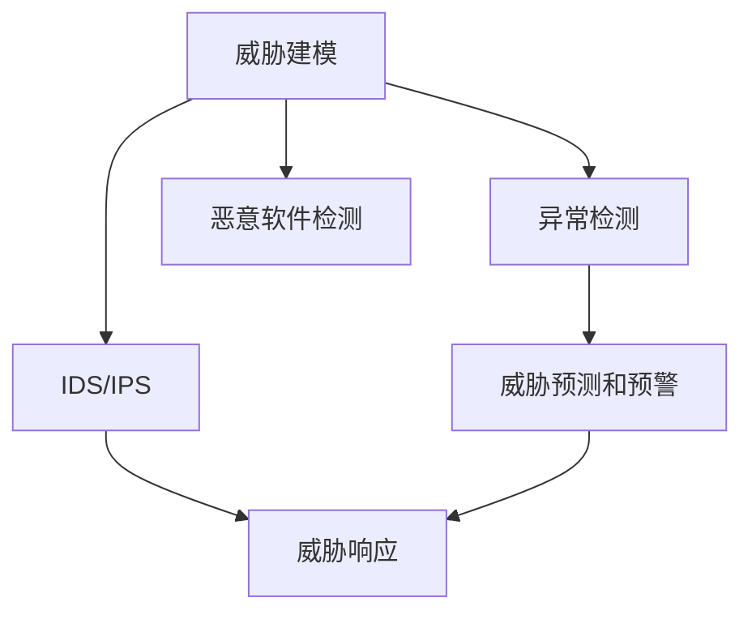

                 

# AI驱动的网络安全：威胁检测与防御

> 关键词：网络安全,威胁检测,人工智能,机器学习,深度学习,威胁防御,威胁建模,异常检测,恶意软件检测,入侵检测系统(IDS),入侵预防系统(IPS),安全威胁预警

## 1. 背景介绍

### 1.1 问题由来
随着信息技术的高速发展，网络攻击手法日益复杂多样，使得传统基于规则的网络安全防护手段面临严峻挑战。传统的基于签名的病毒扫描、基于规则的防火墙等方法难以适应新型攻击的快速变化。与此同时，大量的网络安全数据（如日志、流量数据等）急剧增长，对传统网络安全设备提出更高的数据处理和分析能力要求。

网络安全威胁不仅对企业的信息资产构成直接威胁，还可能导致严重的经济损失和声誉损害。因此，迫切需要一种更加高效、智能的威胁检测与防御方法，以实现对网络威胁的及时发现和响应。

### 1.2 问题核心关键点
为了应对复杂多样的网络威胁，人们提出了基于人工智能(AI)的威胁检测与防御方法。AI驱动的威胁检测与防御利用机器学习、深度学习等技术，从大量网络数据中自动学习威胁特征，并进行实时威胁检测和防御，显著提高了检测效率和准确率。

关键技术点包括：
- 威胁建模：通过建立威胁模型，理解威胁的来源、类型和传播方式。
- 异常检测：利用统计和机器学习技术，识别正常行为与异常行为的区别。
- 恶意软件检测：对网络中传播的恶意代码进行检测和隔离。
- 入侵检测系统(IDS)和入侵预防系统(IPS)：实时监控网络流量，并根据检测结果采取相应的防御措施。
- 威胁预测和预警：根据当前威胁情况和历史数据，预测未来威胁发展趋势，提前采取应对措施。

AI驱动的威胁检测与防御方法结合了自动化和智能化的优势，能够快速适应新型攻击，并提升网络安全防护能力。

## 2. 核心概念与联系

### 2.1 核心概念概述

为了更好地理解AI驱动的网络安全威胁检测与防御方法，本节将介绍几个关键概念：

- **人工智能(AI)**：利用计算机算法模拟人类智能，通过感知、学习、推理、自我校正等步骤完成智能任务。
- **机器学习(ML)**：通过数据训练模型，使其能够自动发现数据中的模式和规律，并进行预测和分类。
- **深度学习(Deep Learning)**：一类机器学习算法，利用多层神经网络模拟人类大脑，能够处理复杂的非线性关系。
- **威胁建模**：通过建立威胁模型，理解威胁的来源、类型和传播方式，为威胁检测和防御提供基础。
- **异常检测**：利用统计和机器学习技术，识别正常行为与异常行为的区别。
- **恶意软件检测**：对网络中传播的恶意代码进行检测和隔离，防止其对网络安全造成威胁。
- **入侵检测系统(IDS)**：实时监控网络流量，根据检测结果采取相应的防御措施，防止入侵行为发生。
- **入侵预防系统(IPS)**：不仅能够检测入侵行为，还能主动阻止入侵行为，防止其进一步传播。
- **威胁预测和预警**：根据当前威胁情况和历史数据，预测未来威胁发展趋势，提前采取应对措施。

这些概念之间具有紧密的联系。AI技术为威胁检测与防御提供了技术基础，而威胁建模和异常检测则为威胁检测提供了具体的策略和方法，恶意软件检测和IDS/IPS则是基于检测结果的防御措施，威胁预测和预警则是在前述基础上的进一步提升。

### 2.2 核心概念原理和架构的 Mermaid 流程图



此流程图展示了威胁建模、异常检测、恶意软件检测、IDS/IPS、威胁预测和预警等核心概念之间的联系。其中，威胁建模是威胁检测与防御的基础，异常检测和恶意软件检测为检测手段，IDS/IPS为防御措施，威胁预测和预警则是在前述基础上的进一步提升。

## 3. 核心算法原理 & 具体操作步骤

### 3.1 算法原理概述

AI驱动的网络安全威胁检测与防御方法基于机器学习、深度学习等技术，从大量网络数据中自动学习威胁特征，并进行实时威胁检测和防御。其核心思想是：

- 构建威胁模型：通过理解威胁的来源、类型和传播方式，为威胁检测与防御提供基础。
- 异常检测：利用统计和机器学习技术，识别正常行为与异常行为的区别。
- 恶意软件检测：对网络中传播的恶意代码进行检测和隔离。
- IDS/IPS：实时监控网络流量，并根据检测结果采取相应的防御措施，防止入侵行为发生。
- 威胁预测和预警：根据当前威胁情况和历史数据，预测未来威胁发展趋势，提前采取应对措施。

具体来说，威胁检测与防御过程如下：

1. 数据收集与预处理：从网络流量、日志等数据源收集原始数据，并进行预处理，如去噪、特征提取等。
2. 特征选择与建模：根据威胁特征和行为模式，选择和构建机器学习模型，如SVM、随机森林、神经网络等。
3. 模型训练与优化：利用历史数据对模型进行训练，并根据性能评估结果进行优化。
4. 实时检测与防御：在网络流量中实时检测威胁，根据检测结果采取相应的防御措施。
5. 威胁预测与预警：根据当前威胁情况和历史数据，预测未来威胁发展趋势，提前采取应对措施。

### 3.2 算法步骤详解

基于AI的威胁检测与防御算法一般包括以下几个关键步骤：

**Step 1: 数据收集与预处理**

- 从网络流量、日志等数据源收集原始数据。
- 对数据进行去噪、特征提取等预处理操作。
- 将预处理后的数据划分为训练集、验证集和测试集。

**Step 2: 特征选择与建模**

- 根据威胁特征和行为模式，选择和构建机器学习模型，如SVM、随机森林、神经网络等。
- 对模型进行训练，并根据验证集上的性能评估结果进行调参。

**Step 3: 模型训练与优化**

- 利用历史数据对模型进行训练。
- 根据性能评估结果，进行超参数调整和模型优化。
- 使用测试集对模型进行最终评估，确保其在实际应用中的效果。

**Step 4: 实时检测与防御**

- 在网络流量中实时检测威胁，利用训练好的模型对数据进行分类。
- 根据检测结果，采取相应的防御措施，如阻止恶意流量、隔离恶意软件等。
- 记录检测结果和防御措施，用于后续分析和改进。

**Step 5: 威胁预测与预警**

- 利用当前威胁情况和历史数据，构建威胁预测模型。
- 对未来威胁进行预测，并根据预测结果进行预警。
- 制定应对措施，如加强防御策略、提前准备应急预案等。

### 3.3 算法优缺点

AI驱动的网络安全威胁检测与防御方法具有以下优点：

- **高效性**：利用机器学习和深度学习技术，能够快速处理大量网络数据，进行实时威胁检测和防御。
- **准确性**：通过自动学习威胁特征，能够提高检测的准确率和召回率，减少误报和漏报。
- **灵活性**：可以根据实际情况进行模型调整和优化，适应不同类型的威胁。
- **自适应性**：能够自动识别和适应新型攻击，及时更新模型。

同时，该方法也存在以下局限性：

- **数据依赖**：需要大量高质量的历史数据进行模型训练，数据不足会影响检测效果。
- **复杂度**：模型构建和训练过程复杂，需要专业知识。
- **误报和漏报**：尽管准确率较高，但仍然存在误报和漏报的可能性。
- **解释性不足**：模型通常是"黑盒"，难以解释其决策过程，不利于审计和调试。
- **资源消耗大**：模型训练和推理需要大量计算资源，增加了硬件成本。

尽管存在这些局限性，但AI驱动的威胁检测与防御方法仍是目前最为先进和有效的威胁检测与防御手段，广泛应用于各类网络安全场景中。

### 3.4 算法应用领域

AI驱动的威胁检测与防御方法已经广泛应用于多个领域，以下是几个典型应用场景：

- **网络入侵检测与防御**：实时监控网络流量，检测并阻止入侵行为，防止其进一步扩散。
- **恶意软件检测与隔离**：检测和隔离恶意软件，防止其在网络中传播。
- **威胁预测与预警**：预测未来威胁发展趋势，提前采取应对措施，提高应对效率。
- **云安全防护**：在云平台中进行威胁检测与防御，保障云服务的安全性。
- **物联网安全防护**：对物联网设备进行威胁检测与防御，防止设备被攻击或利用。
- **移动设备安全防护**：对移动设备进行威胁检测与防御，保护用户隐私和数据安全。

## 4. 数学模型和公式 & 详细讲解 & 举例说明

### 4.1 数学模型构建

基于AI的威胁检测与防御方法涉及多个数学模型，以下对其中几个关键模型进行详细介绍。

**4.1.1 异常检测模型**

异常检测模型的目标是识别正常行为与异常行为的区别，通常使用基于统计的方法或机器学习算法。

- **基于统计的方法**：利用均值、方差、标准差等统计指标，计算数据点与均值之间的距离，判断是否为异常。
- **机器学习算法**：使用KNN、SVM、随机森林等算法，训练模型以区分正常和异常行为。

异常检测模型的形式化表示如下：

$$
y = \begin{cases}
0, & \text{if } x \in \mathcal{N} \\
1, & \text{if } x \in \mathcal{A}
\end{cases}
$$

其中，$x$ 为输入数据，$\mathcal{N}$ 表示正常行为，$\mathcal{A}$ 表示异常行为，$y$ 为模型预测结果。

**4.1.2 恶意软件检测模型**

恶意软件检测模型的目标是检测并隔离恶意代码，通常使用基于特征的方法或机器学习算法。

- **基于特征的方法**：提取恶意软件的特征，并使用规则匹配方法进行检测。
- **机器学习算法**：使用SVM、随机森林、神经网络等算法，训练模型以识别恶意软件。

恶意软件检测模型的形式化表示如下：

$$
y = \begin{cases}
0, & \text{if } x \text{ is benign} \\
1, & \text{if } x \text{ is malware}
\end{cases}
$$

其中，$x$ 为输入数据，$y$ 为模型预测结果。

**4.1.3 IDS/IPS模型**

IDS/IPS模型的目标是实时监控网络流量，检测并阻止入侵行为，通常使用基于规则的方法或机器学习算法。

- **基于规则的方法**：定义入侵规则，根据规则进行匹配和检测。
- **机器学习算法**：使用SVM、随机森林、神经网络等算法，训练模型以检测入侵行为。

IDS/IPS模型的形式化表示如下：

$$
y = \begin{cases}
0, & \text{if } x \text{ does not contain an attack} \\
1, & \text{if } x \text{ contains an attack}
\end{cases}
$$

其中，$x$ 为输入数据，$y$ 为模型预测结果。

### 4.2 公式推导过程

以下是异常检测模型和恶意软件检测模型的详细推导过程。

**异常检测模型**

假设训练集中有 $n$ 个样本，每个样本 $x_i$ 的特征向量为 $[x_{i1}, x_{i2}, ..., x_{in}]$，其中 $n$ 为特征维度。模型通过训练数据学习到正常和异常行为的分界，即使用机器学习算法得到分类器 $f(x)$。在实际应用中，将待检测数据点 $x$ 输入分类器，得到预测结果 $y$，如下所示：

$$
y = f(x) = \begin{cases}
0, & \text{if } f(x) \leq \tau \\
1, & \text{if } f(x) > \tau
\end{cases}
$$

其中，$\tau$ 为分类阈值。

**恶意软件检测模型**

假设训练集中有 $m$ 个样本，每个样本 $x_i$ 的特征向量为 $[x_{i1}, x_{i2}, ..., x_{im}]$，其中 $m$ 为特征维度。模型通过训练数据学习到恶意软件和非恶意软件的分界，即使用机器学习算法得到分类器 $f(x)$。在实际应用中，将待检测数据点 $x$ 输入分类器，得到预测结果 $y$，如下所示：

$$
y = f(x) = \begin{cases}
0, & \text{if } f(x) \leq \tau \\
1, & \text{if } f(x) > \tau
\end{cases}
$$

其中，$\tau$ 为分类阈值。

### 4.3 案例分析与讲解

**案例1：基于统计的异常检测**

假设有一台服务器记录了正常的网络流量数据，模型使用均值和标准差计算每个数据点的距离：

$$
d = \frac{|x - \mu|}{\sigma}
$$

其中，$\mu$ 为均值，$\sigma$ 为标准差。对于新的数据点 $x'$，计算其与均值之间的距离：

$$
d' = \frac{|x' - \mu|}{\sigma}
$$

如果 $d' > \tau$，则认为该数据点为异常行为，否则为正常行为。

**案例2：基于SVM的恶意软件检测**

假设训练集中有 $m$ 个样本，每个样本 $x_i$ 的特征向量为 $[x_{i1}, x_{i2}, ..., x_{im}]$。模型使用SVM算法进行训练，得到分类器 $f(x)$。在实际应用中，将待检测数据点 $x'$ 输入分类器，得到预测结果 $y'$，如下所示：

$$
y' = f(x') = \begin{cases}
0, & \text{if } f(x') \leq \tau \\
1, & \text{if } f(x') > \tau
\end{cases}
$$

其中，$\tau$ 为分类阈值。

## 5. 项目实践：代码实例和详细解释说明

### 5.1 开发环境搭建

在进行威胁检测与防御项目实践前，需要准备好开发环境。以下是使用Python进行PyTorch开发的完整环境配置流程：

1. 安装Anaconda：从官网下载并安装Anaconda，用于创建独立的Python环境。

```bash
conda create -n pytorch-env python=3.8
conda activate pytorch-env
```

2. 安装PyTorch：根据CUDA版本，从官网获取对应的安装命令。例如：

```bash
conda install pytorch torchvision torchaudio cudatoolkit=11.1 -c pytorch -c conda-forge
```

3. 安装Transformer库：

```bash
pip install transformers
```

4. 安装各类工具包：

```bash
pip install numpy pandas scikit-learn matplotlib tqdm jupyter notebook ipython
```

完成上述步骤后，即可在`pytorch-env`环境中开始项目实践。

### 5.2 源代码详细实现

以下以基于SVM的恶意软件检测为例，给出使用Transformers库进行威胁检测与防御的PyTorch代码实现。

首先，定义数据处理函数：

```python
from sklearn.svm import SVC
from sklearn.model_selection import train_test_split

def preprocess_data(data, target):
    # 将数据集分为训练集和测试集
    X_train, X_test, y_train, y_test = train_test_split(data, target, test_size=0.2, random_state=42)
    return X_train, X_test, y_train, y_test
```

然后，定义模型训练函数：

```python
from sklearn.svm import SVC
from sklearn.metrics import accuracy_score

def train_model(X_train, y_train):
    # 构建SVM模型
    model = SVC(kernel='linear', C=1.0, probability=True)
    # 训练模型
    model.fit(X_train, y_train)
    # 评估模型
    y_pred = model.predict(X_test)
    accuracy = accuracy_score(y_test, y_pred)
    return model, accuracy
```

接着，定义模型评估函数：

```python
def evaluate_model(model, X_test, y_test):
    # 评估模型
    y_pred = model.predict(X_test)
    accuracy = accuracy_score(y_test, y_pred)
    return accuracy
```

最后，启动训练流程并在测试集上评估：

```python
# 加载数据集
X, y = load_data()

# 预处理数据
X_train, X_test, y_train, y_test = preprocess_data(X, y)

# 训练模型
model, accuracy = train_model(X_train, y_train)

# 在测试集上评估模型
accuracy = evaluate_model(model, X_test, y_test)
print(f"测试集准确率：{accuracy}")
```

以上就是使用PyTorch进行基于SVM的恶意软件检测的完整代码实现。可以看到，得益于Sklearn库的强大封装，我们可以用相对简洁的代码完成恶意软件检测模型的构建和评估。

### 5.3 代码解读与分析

让我们再详细解读一下关键代码的实现细节：

**preprocess_data函数**：
- `train_test_split`方法：将数据集划分为训练集和测试集，用于模型训练和评估。
- `X_train, X_test, y_train, y_test`：分别为训练集特征、测试集特征、训练集标签、测试集标签。

**train_model函数**：
- `SVC`类：定义SVM模型，使用线性核和惩罚系数为1.0，开启概率预测功能。
- `fit`方法：使用训练集数据拟合模型。
- `predict`方法：使用测试集数据进行预测。
- `accuracy_score`函数：计算预测结果和真实标签之间的准确率。

**evaluate_model函数**：
- `predict`方法：使用模型对测试集数据进行预测。
- `accuracy_score`函数：计算预测结果和真实标签之间的准确率。

**训练流程**：
- 加载数据集，预处理数据。
- 在训练集上训练模型，得到模型和准确率。
- 在测试集上评估模型，输出准确率。

可以看到，PyTorch配合Sklearn库使得威胁检测与防御的代码实现变得简洁高效。开发者可以将更多精力放在模型设计、数据预处理等高层逻辑上，而不必过多关注底层的实现细节。

当然，工业级的系统实现还需考虑更多因素，如模型的保存和部署、超参数的自动搜索、更灵活的任务适配层等。但核心的威胁检测与防御范式基本与此类似。

## 6. 实际应用场景

### 6.1 网络入侵检测与防御

网络入侵检测与防御系统(IDS/IPS)是威胁检测与防御的重要手段。传统IDS/IPS系统依赖规则库和特征库，难以应对新型攻击。而基于AI的IDS/IPS系统，可以自动学习威胁特征，实时检测并阻止入侵行为。

在技术实现上，可以收集网络流量数据，并利用异常检测和入侵检测算法，构建实时威胁监控系统。对于检测到的异常流量或入侵行为，系统可以自动采取相应的防御措施，如阻止攻击、隔离攻击源等，确保网络安全。

### 6.2 恶意软件检测与隔离

恶意软件检测与隔离系统可以识别和隔离网络中的恶意软件，防止其对网络安全造成威胁。传统恶意软件检测方法依赖规则库，难以应对新型恶意代码。而基于AI的恶意软件检测系统，可以自动学习恶意代码的特征，实现更高效的恶意软件检测和隔离。

在技术实现上，可以收集恶意软件样本，并进行特征提取和建模。利用训练好的模型，对网络流量或磁盘文件进行检测，识别和隔离恶意软件。同时，系统可以记录检测结果和隔离过程，方便后续分析和改进。

### 6.3 威胁预测与预警

威胁预测与预警系统可以根据当前威胁情况和历史数据，预测未来威胁发展趋势，提前采取应对措施，提高应对效率。传统威胁预警系统依赖专家经验和手动监测，难以应对大规模数据和高频攻击。而基于AI的威胁预测与预警系统，可以自动学习威胁数据模式，预测未来威胁发展趋势，提前采取应对措施。

在技术实现上，可以收集历史威胁数据，并进行威胁建模和预测。利用训练好的模型，对当前威胁情况进行预测，并根据预测结果进行预警。同时，系统可以记录预测结果和预警过程，方便后续分析和改进。

### 6.4 未来应用展望

随着AI技术的发展，威胁检测与防御系统将不断升级和优化，以下是几个未来应用展望：

- **自动化威胁检测与防御**：基于AI的威胁检测与防御系统将进一步自动化和智能化，能够自动学习威胁特征，实时检测并阻止入侵行为，减少人工干预。
- **多模态威胁检测与防御**：未来的威胁检测与防御系统将融合多种数据源，如网络流量、日志、用户行为等，实现多模态的威胁检测与防御。
- **威胁情报共享**：建立威胁情报共享平台，实现威胁信息的实时共享和协同防御，提升整体网络安全水平。
- **威胁预测与预警自动化**：基于AI的威胁预测与预警系统将进一步自动化，能够自动学习威胁模式，预测未来威胁发展趋势，提前采取应对措施。
- **智能安全运维**：未来的威胁检测与防御系统将结合AI和大数据分析，实现智能安全运维，自动监测和修复系统漏洞，提高系统的稳定性和可靠性。

## 7. 工具和资源推荐

### 7.1 学习资源推荐

为了帮助开发者系统掌握威胁检测与防御的理论基础和实践技巧，这里推荐一些优质的学习资源：

1. 《网络安全技术与实践》系列博文：由网络安全专家撰写，详细介绍网络安全技术的基本概念、常用方法和最佳实践。

2. 《深度学习在网络安全中的应用》书籍：详细讲解深度学习技术在网络安全领域的应用，包括异常检测、恶意软件检测、IDS/IPS等。

3. 《网络安全威胁建模与检测》课程：斯坦福大学开设的在线课程，介绍威胁建模、异常检测、恶意软件检测等基本方法。

4. PyTorch官方文档：提供了丰富的PyTorch使用文档和样例代码，方便开发者学习和实践。

5. TensorFlow官方文档：提供了丰富的TensorFlow使用文档和样例代码，方便开发者学习和实践。

6. Weights & Biases：模型训练的实验跟踪工具，可以记录和可视化模型训练过程中的各项指标，方便对比和调优。

通过对这些资源的学习实践，相信你一定能够快速掌握威胁检测与防御的精髓，并用于解决实际的网络安全问题。

### 7.2 开发工具推荐

高效的开发离不开优秀的工具支持。以下是几款用于威胁检测与防御开发的常用工具：

1. PyTorch：基于Python的开源深度学习框架，灵活动态的计算图，适合快速迭代研究。大多数威胁检测与防御模型都有PyTorch版本的实现。

2. TensorFlow：由Google主导开发的开源深度学习框架，生产部署方便，适合大规模工程应用。同样有丰富的威胁检测与防御模型资源。

3. Transformers库：HuggingFace开发的NLP工具库，集成了众多SOTA语言模型，支持PyTorch和TensorFlow，是进行威胁检测与防御开发的利器。

4. Weights & Biases：模型训练的实验跟踪工具，可以记录和可视化模型训练过程中的各项指标，方便对比和调优。与主流深度学习框架无缝集成。

5. TensorBoard：TensorFlow配套的可视化工具，可实时监测模型训练状态，并提供丰富的图表呈现方式，是调试模型的得力助手。

6. Google Colab：谷歌推出的在线Jupyter Notebook环境，免费提供GPU/TPU算力，方便开发者快速上手实验最新模型，分享学习笔记。

合理利用这些工具，可以显著提升威胁检测与防御任务的开发效率，加快创新迭代的步伐。

### 7.3 相关论文推荐

威胁检测与防御技术的发展源于学界的持续研究。以下是几篇奠基性的相关论文，推荐阅读：

1. Deep Anomaly Detection using an Autoencoder Architecture（Deep Autoencoder论文）：提出基于自编码器的异常检测方法，利用隐层特征重构误差进行异常检测。

2. Deep Learning for Cyber Threat Detection: A Survey（深度学习在网络安全中的应用）：全面综述了深度学习在网络安全领域的应用，包括异常检测、恶意软件检测、IDS/IPS等。

3. SVM Based Intrusion Detection System for the Internet of Things（基于SVM的物联网入侵检测系统）：提出基于SVM的物联网入侵检测系统，结合异常检测和入侵检测算法，实时监控物联网设备的安全性。

4. Predicting the Risk of Malware Infections through Machine Learning（机器学习预测恶意软件感染风险）：提出利用机器学习模型预测恶意软件感染风险的方法，提高恶意软件检测的准确率。

5. Real-time Network Intrusion Detection System using Deep Learning（基于深度学习的实时网络入侵检测系统）：提出基于深度学习的实时网络入侵检测系统，利用多层神经网络自动学习威胁特征，实现实时入侵检测。

这些论文代表了大语言模型微调技术的发展脉络。通过学习这些前沿成果，可以帮助研究者把握学科前进方向，激发更多的创新灵感。

## 8. 总结：未来发展趋势与挑战

### 8.1 总结

本文对AI驱动的网络安全威胁检测与防御方法进行了全面系统的介绍。首先阐述了网络安全威胁的严重性和当前威胁检测与防御方法的局限性，明确了基于AI的威胁检测与防御方法的优势和应用场景。其次，从原理到实践，详细讲解了威胁检测与防御的数学模型和关键步骤，给出了威胁检测与防御任务的代码实现。同时，本文还广泛探讨了威胁检测与防御技术在多个行业领域的应用前景，展示了其在网络安全防护中的巨大潜力。最后，本文精选了威胁检测与防御技术的各类学习资源，力求为开发者提供全方位的技术指引。

通过本文的系统梳理，可以看到，基于AI的威胁检测与防御方法正在成为网络安全防护的重要手段，极大地提高了威胁检测与防御的效率和准确率。未来，伴随AI技术的发展，威胁检测与防御系统将进一步自动化和智能化，实现多模态威胁检测与防御、威胁情报共享、威胁预测与预警等更高级功能。

### 8.2 未来发展趋势

展望未来，基于AI的威胁检测与防御技术将呈现以下几个发展趋势：

1. **自动化与智能化**：未来的威胁检测与防御系统将进一步自动化和智能化，能够自动学习威胁特征，实时检测并阻止入侵行为，减少人工干预。

2. **多模态融合**：未来的威胁检测与防御系统将融合多种数据源，如网络流量、日志、用户行为等，实现多模态的威胁检测与防御。

3. **威胁情报共享**：建立威胁情报共享平台，实现威胁信息的实时共享和协同防御，提升整体网络安全水平。

4. **威胁预测与预警自动化**：基于AI的威胁预测与预警系统将进一步自动化，能够自动学习威胁模式，预测未来威胁发展趋势，提前采取应对措施。

5. **智能安全运维**：未来的威胁检测与防御系统将结合AI和大数据分析，实现智能安全运维，自动监测和修复系统漏洞，提高系统的稳定性和可靠性。

这些趋势凸显了AI驱动的威胁检测与防御技术的广阔前景。这些方向的探索发展，必将进一步提升网络安全防护的效率和效果，为信息安全领域带来深刻变革。

### 8.3 面临的挑战

尽管基于AI的威胁检测与防御技术已经取得了显著成效，但在实际应用中仍面临以下挑战：

1. **数据质量与隐私保护**：高质量的训练数据和保护隐私是训练模型的前提，但数据获取和隐私保护都是难题。如何在保障隐私的前提下，获取高质量的训练数据，是未来需要解决的重要问题。

2. **模型复杂度**：构建高质量的威胁检测与防御模型需要复杂的数据处理和模型构建过程，对开发者提出了较高的技术要求。

3. **误报和漏报**：尽管AI模型能够提高检测准确率，但仍然存在误报和漏报的可能性，特别是在威胁检测场景中，误报可能导致大量正常流量被误判为异常行为。

4. **模型解释性不足**：AI模型通常是"黑盒"，难以解释其决策过程，不利于审计和调试。

5. **资源消耗大**：模型训练和推理需要大量计算资源，增加了硬件成本。

尽管存在这些挑战，但基于AI的威胁检测与防御技术仍是最先进和有效的威胁检测与防御手段，广泛应用于各类网络安全场景中。

### 8.4 研究展望

未来，威胁检测与防御技术的研究方向将聚焦以下几个方面：

1. **数据增强与生成**：利用数据增强和生成对抗网络（GAN）等技术，生成更多的威胁数据，提高模型泛化能力。

2. **自监督学习**：利用自监督学习技术，从大量无标注数据中自动学习威胁特征，减少对有标注数据的依赖。

3. **多模型集成**：结合多种模型（如SVM、神经网络等）的优点，构建多模型集成系统，提高检测准确率和鲁棒性。

4. **威胁对抗训练**：利用对抗训练技术，生成对抗样本，提高模型鲁棒性，减少误报和漏报。

5. **跨模态威胁检测**：结合视觉、音频等多种模态数据，实现跨模态的威胁检测与防御。

6. **威胁情报融合**：利用威胁情报平台，实现威胁信息的实时共享和协同防御，提升整体网络安全水平。

7. **威胁预测与预警自动化**：基于AI的威胁预测与预警系统将进一步自动化，能够自动学习威胁模式，预测未来威胁发展趋势，提前采取应对措施。

这些研究方向将推动威胁检测与防御技术的不断发展和创新，为构建更加安全、智能的网络环境提供技术支持。

## 9. 附录：常见问题与解答

**Q1：基于AI的威胁检测与防御是否适用于所有网络安全场景？**

A: 基于AI的威胁检测与防御方法在大多数网络安全场景中都能取得较好的效果，但仍然存在一些特殊场景需要特别注意。对于特定的行业（如医疗、金融等），可能需要结合领域特定知识进行模型设计和训练，以提高检测效果。

**Q2：如何选择合适的学习率？**

A: 基于AI的威胁检测与防御方法通常采用较小的学习率，以避免破坏预训练权重。一般建议从1e-5开始调参，逐步减小学习率，直至收敛。

**Q3：数据增强对模型效果有何影响？**

A: 数据增强可以显著提高模型的泛化能力，减少过拟合风险。在网络安全领域，数据增强通常包括回译、数据合成、特征变换等方法。

**Q4：如何在多模态数据中融合威胁检测与防御？**

A: 多模态威胁检测与防御系统需要融合多种数据源（如网络流量、日志、用户行为等），实现多模态的威胁检测与防御。可以通过融合不同模态的特征，构建多模态模型，提高检测效果。

**Q5：威胁检测与防御系统在实际应用中面临哪些挑战？**

A: 威胁检测与防御系统在实际应用中面临数据质量、模型复杂度、误报和漏报、模型解释性不足、资源消耗大等挑战。需要不断优化模型设计、数据处理和算法实现，以应对这些挑战。

综上所述，基于AI的威胁检测与防御技术正在成为网络安全防护的重要手段，其未来的发展前景广阔。但与此同时，我们也需要正视其面临的挑战，持续进行技术创新和改进，以实现更高效、智能、可靠的网络安全防护。

