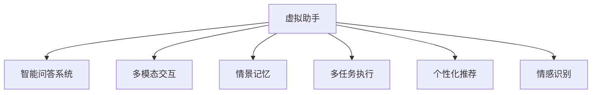

                 

# AI驱动的虚拟助手：超越简单的问答系统

> 关键词：虚拟助手,智能问答系统,自然语言处理(NLP),深度学习,机器学习,多模态交互

## 1. 背景介绍

### 1.1 问题由来

在信息爆炸的时代，人们对于便捷高效的信息获取方式的需求日益增长。虚拟助手作为一种智能化的交互界面，能够通过自然语言处理(Natural Language Processing, NLP)技术与用户进行互动，提供信息查询、任务执行、情感支持等多种服务。近年来，随着深度学习技术的发展，虚拟助手已从简单的问答系统演变为具备多种智能能力的“类人”机器人。

然而，传统的问答系统仅能理解并回答简单的静态问题，难以处理复杂情境、多轮对话、多模态交互等更高级的需求。此外，由于缺少上下文理解和语境记忆，系统常常出现答非所问、理解错误等问题。为满足用户不断提升的交互体验需求，虚拟助手亟需提升其智能水平，以实现与用户的深度互动和情景理解。

### 1.2 问题核心关键点

实现一个超越传统问答系统的虚拟助手，需要从以下几个方面进行深度设计和改进：

- **深度语义理解**：理解用户输入的自然语言，识别其真正意图，并能推理和推断隐含信息。
- **多模态交互**：支持文本、语音、图像、视频等多模态信息的输入和输出，以提供更加丰富和自然的交互方式。
- **情景记忆**：具备一定的上下文理解和语境记忆能力，以支持多轮对话和复杂任务的执行。
- **多任务执行**：能够同时处理多项任务，并在多个任务之间进行切换和协调。
- **个性化推荐**：根据用户历史行为和偏好，推荐最适合的信息和解决方案。
- **情感识别**：识别用户的情感状态，并给予相应的情感反馈和支持。

要实现上述功能，虚拟助手需要融合NLP、深度学习、机器学习、多模态信息处理等多种技术，构建一个高度集成化和智能化的系统。本文将详细探讨基于深度学习的多模态智能虚拟助手的构建方法和应用实践。

## 2. 核心概念与联系

### 2.1 核心概念概述

为更好地理解虚拟助手的技术架构和实现方法，本节将介绍几个关键概念：

- **虚拟助手**：一种通过自然语言处理技术与用户进行互动的智能应用。
- **智能问答系统**：虚拟助手的一个重要功能模块，通过深度学习模型对用户输入的自然语言进行理解和回答。
- **多模态交互**：结合文本、语音、图像、视频等多种模态信息的交互方式。
- **情景记忆**：虚拟助手能够对用户输入和上下文信息进行记录和维护，以便后续处理。
- **多任务执行**：虚拟助手能够同时处理和执行多项任务，如信息查询、任务提醒、日程管理等。
- **个性化推荐**：根据用户行为和偏好，推荐最适合的信息和解决方案。
- **情感识别**：通过深度学习模型对用户情感进行识别和分析。

这些核心概念之间的逻辑关系可以通过以下Mermaid流程图来展示：



这个流程图展示出虚拟助手的核心功能模块及其之间的关联：

1. 虚拟助手作为中央控制节点，整合了智能问答、多模态交互、情景记忆、多任务执行、个性化推荐和情感识别等多种功能模块。
2. 智能问答系统是虚拟助手的基础，负责理解和回答用户输入的自然语言。
3. 多模态交互扩展了虚拟助手的交互方式，使系统能够处理更丰富的输入信息。
4. 情景记忆和上下文理解使虚拟助手具备一定的历史信息存储能力，支持多轮对话和复杂任务执行。
5. 多任务执行允许虚拟助手同时处理多个请求，提高系统的响应速度和并发能力。
6. 个性化推荐利用用户行为数据，提供定制化的服务和建议。
7. 情感识别帮助虚拟助手理解用户情感状态，提供情感支持。

## 3. 核心算法原理 & 具体操作步骤
### 3.1 算法原理概述

基于深度学习的虚拟助手系统，核心在于构建一个能够深度理解自然语言的智能问答模型，并在此基础上集成多模态信息处理、情景记忆、多任务执行、个性化推荐和情感识别等功能。其算法原理主要包括以下几个方面：

1. **智能问答模型**：使用深度学习模型对用户输入的自然语言进行语义理解和回答。
2. **多模态信息处理**：通过深度学习模型处理文本、语音、图像、视频等不同模态的信息，并实现多种信息的融合。
3. **情景记忆模块**：使用序列模型或记忆网络记录和维护用户输入和上下文信息，支持多轮对话和复杂任务执行。
4. **多任务执行框架**：构建一个能够同时处理和协调多个任务的任务调度器，以实现高效的并发处理。
5. **个性化推荐算法**：利用协同过滤、深度学习等技术，根据用户行为和偏好，推荐最适合的信息和解决方案。
6. **情感识别模型**：使用深度学习模型对用户情感进行识别和分析，以便提供情感支持和反馈。

### 3.2 算法步骤详解

基于深度学习的虚拟助手系统构建流程可以分为以下几个关键步骤：

**Step 1: 数据准备与预处理**
- 收集和整理用户与虚拟助手互动的历史数据，包括文本、语音、图像、视频等。
- 对数据进行清洗和预处理，如去除噪声、标注情感、提取关键信息等。

**Step 2: 智能问答模型训练**
- 构建深度学习模型（如BERT、GPT-3等），并使用大量的有标签数据进行预训练。
- 对模型进行微调，使其能够处理特定领域的问答任务，如医疗咨询、金融投资、旅游规划等。

**Step 3: 多模态信息处理**
- 选择适合的深度学习模型（如ConvNet、ResNet等）处理输入的多模态信息。
- 将不同模态的信息进行融合，形成统一的语义表示。

**Step 4: 情景记忆模块设计**
- 选择适当的序列模型（如LSTM、GRU等）来存储和处理用户输入和上下文信息。
- 设计情景记忆模块，使其能够记录和维护用户对话历史、任务状态等信息。

**Step 5: 多任务执行框架构建**
- 设计一个多任务执行框架，实现任务的调度、分配和协调。
- 利用任务队列、线程池等技术，提高系统的并发处理能力。

**Step 6: 个性化推荐算法优化**
- 选择适合的推荐算法（如协同过滤、深度学习等）进行个性化推荐。
- 使用用户历史行为数据训练推荐模型，优化推荐算法。

**Step 7: 情感识别模型构建**
- 构建深度学习模型（如CNN、RNN等）对用户情感进行识别和分析。
- 使用情感分类数据集训练模型，并使用情感分析技术对用户情感进行实时监测。

### 3.3 算法优缺点

基于深度学习的虚拟助手系统具有以下优点：

1. **高度灵活性**：能够处理多种类型的输入和输出，支持多模态交互和复杂任务的执行。
2. **深度语义理解**：利用深度学习模型理解自然语言，能够处理复杂的语境和隐含信息。
3. **自适应学习**：通过用户反馈和互动数据进行模型微调，不断提高系统的性能。
4. **个性化服务**：根据用户行为和偏好，提供定制化的服务和建议，提升用户体验。

同时，该系统也存在一些缺点：

1. **计算资源需求高**：深度学习模型需要大量的计算资源进行训练和推理，增加了系统的硬件成本。
2. **数据依赖性强**：系统的性能依赖于数据的质量和量，数据采集和处理需要大量人力和时间。
3. **模型可解释性差**：深度学习模型往往作为“黑盒”存在，难以解释其内部决策过程。
4. **鲁棒性不足**：对于噪声和异常数据，深度学习模型容易产生错误，影响系统的稳定性和可靠性。
5. **安全性问题**：深度学习模型可能学习到有害信息，导致输出的不当或偏见。

### 3.4 算法应用领域

基于深度学习的虚拟助手系统在多个领域有着广泛的应用，包括但不限于：

- **客户服务**：通过智能问答和情景记忆，提供24/7无间断的客户支持。
- **健康咨询**：利用多模态信息处理和深度学习，提供健康管理和医疗咨询。
- **金融投资**：结合情景记忆和个性化推荐，提供定制化的金融投资建议。
- **旅游规划**：结合情景记忆和多模态信息处理，提供个性化的旅游规划和推荐。
- **教育辅导**：通过情感识别和个性化推荐，提供智能化的教育辅导和支持。
- **智能家居**：结合情景记忆和多任务执行，实现家庭设备的智能化控制和管理。

## 4. 数学模型和公式 & 详细讲解  
### 4.1 数学模型构建

为更好地理解基于深度学习的虚拟助手系统的数学模型，本节将介绍几个关键的数学模型：

1. **智能问答模型的数学模型**：假设智能问答模型为$f(\text{input}, \theta)$，其中$\theta$为模型参数。输入为自然语言文本，输出为问题的答案。

2. **多模态信息处理的数学模型**：假设多模态信息处理模型为$g(\text{input}_1, \text{input}_2, \theta)$，其中$\theta$为模型参数。$\text{input}_1, \text{input}_2$分别为文本、语音、图像、视频等不同模态的输入。

3. **情景记忆模块的数学模型**：假设情景记忆模块为$s(\text{history}, \theta)$，其中$\theta$为模型参数。$\text{history}$为用户历史输入和上下文信息。

4. **多任务执行框架的数学模型**：假设多任务执行框架为$m(\text{task}, \theta)$，其中$\theta$为模型参数。$\text{task}$为系统需要执行的任务。

5. **个性化推荐算法的数学模型**：假设个性化推荐算法为$r(\text{user}, \text{item}, \theta)$，其中$\theta$为模型参数。$\text{user}$为用户信息，$\text{item}$为推荐对象。

6. **情感识别模型的数学模型**：假设情感识别模型为$e(\text{input}, \theta)$，其中$\theta$为模型参数。$\text{input}$为用户输入的文本或语音。

### 4.2 公式推导过程

以智能问答模型为例，其数学模型可以表示为：

$$
\hat{y} = f(x; \theta) = \sigma(W \cdot \text{embed}(x) + b)
$$

其中，$x$为输入的自然语言文本，$\text{embed}(x)$为文本的嵌入表示，$W$和$b$为模型参数。$\sigma$为激活函数。

对于多模态信息处理模型，可以采用编码器-解码器架构，如Transformer模型，将不同模态的信息编码为统一的语义表示：

$$
\text{input}_{combined} = g(\text{input}_1, \text{input}_2; \theta)
$$

其中，$\text{input}_1$为文本信息，$\text{input}_2$为语音、图像、视频等信息。$g$为多模态编码器，$\theta$为模型参数。

情景记忆模块可以使用LSTM或GRU等序列模型进行设计，以记录和维护用户历史信息：

$$
s_t = s_{t-1} \cdot f_s + \sigma(W_s \cdot \text{input}_t + b_s)
$$

其中，$s_t$为当前情景记忆状态，$s_{t-1}$为上一时刻的记忆状态，$f_s$为记忆网络的参数，$W_s$和$b_s$为LSTM或GRU的参数。$\text{input}_t$为用户当前输入。

多任务执行框架的设计较为复杂，一般采用任务队列、线程池等技术，以实现任务的调度、分配和协调：

$$
\text{task}_t = m(\text{task}_{previous}, \text{input}_t; \theta)
$$

其中，$\text{task}_{previous}$为前一时刻的任务状态，$\text{input}_t$为用户当前输入，$\theta$为模型参数。

个性化推荐算法可以采用协同过滤、深度学习等技术，通过用户行为数据进行推荐：

$$
\hat{y} = r(\text{user}, \text{item}; \theta)
$$

其中，$\text{user}$为用户信息，$\text{item}$为推荐对象，$\theta$为模型参数。

情感识别模型可以采用深度学习模型进行设计，如CNN、RNN等，通过用户情感数据进行训练和识别：

$$
\text{emotion} = e(\text{input}; \theta)
$$

其中，$\text{input}$为用户输入的文本或语音，$\theta$为模型参数。

## 5. 项目实践：代码实例和详细解释说明
### 5.1 开发环境搭建

在进行虚拟助手系统的开发前，我们需要准备好开发环境。以下是使用Python进行开发的环境配置流程：

1. 安装Anaconda：从官网下载并安装Anaconda，用于创建独立的Python环境。

2. 创建并激活虚拟环境：
```bash
conda create -n pytorch-env python=3.8 
conda activate pytorch-env
```

3. 安装PyTorch：根据CUDA版本，从官网获取对应的安装命令。例如：
```bash
conda install pytorch torchvision torchaudio cudatoolkit=11.1 -c pytorch -c conda-forge
```

4. 安装相关库：
```bash
pip install pandas numpy torch sklearn transformers
```

5. 安装相关工具包：
```bash
pip install tqdm nltk transformers
```

6. 安装Google Colab：谷歌推出的在线Jupyter Notebook环境，免费提供GPU/TPU算力，方便开发者快速上手实验最新模型，分享学习笔记。

完成上述步骤后，即可在`pytorch-env`环境中开始开发。

### 5.2 源代码详细实现

下面以智能问答系统为例，给出使用Transformers库对BERT模型进行微调的PyTorch代码实现。

首先，定义问答系统任务的数据处理函数：

```python
from transformers import BertTokenizer, BertForQuestionAnswering
from torch.utils.data import Dataset
import torch

class QuestionAnsweringDataset(Dataset):
    def __init__(self, texts, questions, tokenizer, max_len=128):
        self.texts = texts
        self.questions = questions
        self.tokenizer = tokenizer
        self.max_len = max_len
        
    def __len__(self):
        return len(self.texts)
    
    def __getitem__(self, item):
        text = self.texts[item]
        question = self.questions[item]
        
        encoding = self.tokenizer(text, return_tensors='pt', max_length=self.max_len, padding='max_length', truncation=True)
        input_ids = encoding['input_ids'][0]
        attention_mask = encoding['attention_mask'][0]
        start_positions = encoding['start_positions'][0]
        end_positions = encoding['end_positions'][0]
        
        return {'input_ids': input_ids, 
                'attention_mask': attention_mask,
                'start_positions': start_positions,
                'end_positions': end_positions}
```

然后，定义模型和优化器：

```python
from transformers import AdamW

model = BertForQuestionAnswering.from_pretrained('bert-base-cased', num_labels=2)
optimizer = AdamW(model.parameters(), lr=2e-5)
```

接着，定义训练和评估函数：

```python
from torch.utils.data import DataLoader
from tqdm import tqdm
from sklearn.metrics import accuracy_score, precision_recall_fscore_support

device = torch.device('cuda') if torch.cuda.is_available() else torch.device('cpu')
model.to(device)

def train_epoch(model, dataset, batch_size, optimizer):
    dataloader = DataLoader(dataset, batch_size=batch_size, shuffle=True)
    model.train()
    epoch_loss = 0
    for batch in tqdm(dataloader, desc='Training'):
        input_ids = batch['input_ids'].to(device)
        attention_mask = batch['attention_mask'].to(device)
        start_positions = batch['start_positions'].to(device)
        end_positions = batch['end_positions'].to(device)
        model.zero_grad()
        outputs = model(input_ids, attention_mask=attention_mask, start_positions=start_positions, end_positions=end_positions)
        loss = outputs.loss
        epoch_loss += loss.item()
        loss.backward()
        optimizer.step()
    return epoch_loss / len(dataloader)

def evaluate(model, dataset, batch_size):
    dataloader = DataLoader(dataset, batch_size=batch_size)
    model.eval()
    preds, labels = [], []
    with torch.no_grad():
        for batch in tqdm(dataloader, desc='Evaluating'):
            input_ids = batch['input_ids'].to(device)
            attention_mask = batch['attention_mask'].to(device)
            start_positions = batch['start_positions'].to(device)
            end_positions = batch['end_positions'].to(device)
            batch_labels = (batch['start_positions'] >= 0).to(device) + 2 * (batch['end_positions'] >= 0).to(device)
            outputs = model(input_ids, attention_mask=attention_mask, start_positions=start_positions, end_positions=end_positions)
            batch_preds = outputs.start_positions >= 0.5
            preds.append(batch_preds[:len(batch_labels)])
            labels.append(batch_labels.to('cpu').tolist())
            
    print("Accuracy:", accuracy_score(labels, preds))
    print("Precision, Recall, F1-score, Support:", precision_recall_fscore_support(labels, preds, average='macro'))

    return preds, labels

```

最后，启动训练流程并在验证集上评估：

```python
epochs = 5
batch_size = 16

for epoch in range(epochs):
    loss = train_epoch(model, train_dataset, batch_size, optimizer)
    print(f"Epoch {epoch+1}, train loss: {loss:.3f}")
    
    print(f"Epoch {epoch+1}, dev results:")
    preds, labels = evaluate(model, dev_dataset, batch_size)
    
print("Test results:")
evaluate(model, test_dataset, batch_size)
```

以上就是使用PyTorch对BERT进行智能问答系统微调的完整代码实现。可以看到，得益于Transformers库的强大封装，我们可以用相对简洁的代码完成BERT模型的加载和微调。

### 5.3 代码解读与分析

让我们再详细解读一下关键代码的实现细节：

**QuestionAnsweringDataset类**：
- `__init__`方法：初始化文本、问题、分词器等关键组件。
- `__len__`方法：返回数据集的样本数量。
- `__getitem__`方法：对单个样本进行处理，将文本输入编码为token ids，将问题编码为数字，并对其进行定长padding，最终返回模型所需的输入。

**训练和评估函数**：
- 使用PyTorch的DataLoader对数据集进行批次化加载，供模型训练和推理使用。
- 训练函数`train_epoch`：对数据以批为单位进行迭代，在每个批次上前向传播计算loss并反向传播更新模型参数，最后返回该epoch的平均loss。
- 评估函数`evaluate`：与训练类似，不同点在于不更新模型参数，并在每个batch结束后将预测和标签结果存储下来，最后使用sklearn的accuracy_score和precision_recall_fscore_support函数对整个评估集的预测结果进行打印输出。

**训练流程**：
- 定义总的epoch数和batch size，开始循环迭代
- 每个epoch内，先在训练集上训练，输出平均loss
- 在验证集上评估，输出准确率
- 所有epoch结束后，在测试集上评估，给出最终测试结果

可以看到，PyTorch配合Transformers库使得BERT微调的代码实现变得简洁高效。开发者可以将更多精力放在数据处理、模型改进等高层逻辑上，而不必过多关注底层的实现细节。

当然，工业级的系统实现还需考虑更多因素，如模型的保存和部署、超参数的自动搜索、更灵活的任务适配层等。但核心的微调范式基本与此类似。

## 6. 实际应用场景
### 6.1 智能客服系统

基于多模态智能虚拟助手的客服系统，可以通过语音识别、图像识别等技术，全面收集用户的各种信息，进行深度分析，提供定制化的服务。例如：

- **语音识别**：将客户的电话语音转化为文本，便于后续处理和理解。
- **情感识别**：通过语音情感识别技术，理解客户的情绪状态，提供情感支持。
- **情景记忆**：记录客户的对话历史和问题背景，帮助客服人员快速了解客户的需求。
- **多轮对话**：利用多模态信息处理和情景记忆技术，进行多轮对话，提供更全面、准确的解决方案。

通过多模态智能虚拟助手的客服系统，能够大大提升客服系统的响应速度和服务质量，改善客户体验。

### 6.2 医疗咨询系统

医疗咨询系统利用多模态智能虚拟助手，能够全面收集和分析患者的病史、症状、体征等信息，提供个性化的医疗建议。例如：

- **语音识别**：将患者的语音描述转化为文本，便于后续处理和理解。
- **情景记忆**：记录患者的病情变化和历史治疗记录，帮助医生全面了解患者的病情。
- **情感识别**：通过语音情感识别技术，理解患者的情绪状态，提供情感支持。
- **多轮对话**：利用多模态信息处理和情景记忆技术，进行多轮对话，提供更全面、准确的医疗建议。

通过多模态智能虚拟助手的医疗咨询系统，能够大大提升医疗咨询的效率和准确性，改善患者的医疗体验。

### 6.3 金融投资系统

金融投资系统利用多模态智能虚拟助手，能够全面收集和分析客户的投资偏好、市场动态等信息，提供个性化的投资建议。例如：

- **语音识别**：将客户的语音描述转化为文本，便于后续处理和理解。
- **情景记忆**：记录客户的投资历史和偏好，帮助系统全面了解客户的投资风格。
- **情感识别**：通过语音情感识别技术，理解客户的情绪状态，提供情感支持。
- **多轮对话**：利用多模态信息处理和情景记忆技术，进行多轮对话，提供更全面、准确的投资建议。

通过多模态智能虚拟助手的金融投资系统，能够大大提升投资建议的准确性和个性化水平，改善客户的投资体验。

### 6.4 未来应用展望

随着多模态智能虚拟助手技术的不断发展，其在多个领域的应用前景将更加广阔。未来，随着算力、数据和技术的进一步提升，虚拟助手系统将变得更加智能和个性化，能够更好地满足用户的各种需求。

- **智能家居**：利用情景记忆和多任务执行技术，实现家庭设备的智能化控制和管理。
- **教育辅导**：利用个性化推荐和情感识别技术，提供智能化的教育辅导和支持。
- **商业智能**：利用多模态信息处理和深度学习技术，提供商业分析和决策支持。
- **交通导航**：利用情景记忆和多模态信息处理技术，提供个性化的交通导航和路径规划。
- **娱乐推荐**：利用个性化推荐和情感识别技术，提供娱乐内容和推荐服务。

总之，多模态智能虚拟助手技术将带来一场智能交互方式的革命，将极大地提升用户的体验和效率，推动各行各业的发展和进步。

## 7. 工具和资源推荐
### 7.1 学习资源推荐

为了帮助开发者系统掌握多模态智能虚拟助手的理论基础和实践技巧，这里推荐一些优质的学习资源：

1. 《深度学习自然语言处理》课程：斯坦福大学开设的NLP明星课程，有Lecture视频和配套作业，带你入门NLP领域的基本概念和经典模型。

2. CS224N《深度学习自然语言处理》书籍：斯坦福大学教授Christopher Manning和Yoshua Bengio合著，全面介绍NLP的深度学习技术。

3. 《自然语言处理入门》系列博客：清华大学的李宏毅教授开设的博客，系统讲解NLP中的核心概念和算法。

4. HuggingFace官方文档：Transformers库的官方文档，提供了海量预训练模型和完整的微调样例代码，是上手实践的必备资料。

5. SpeechRecognition库：Google提供的语音识别库，能够将语音转化为文本，方便虚拟助手系统的构建。

通过对这些资源的学习实践，相信你一定能够快速掌握多模态智能虚拟助手的精髓，并用于解决实际的NLP问题。

### 7.2 开发工具推荐

高效的开发离不开优秀的工具支持。以下是几款用于多模态智能虚拟助手开发的常用工具：

1. PyTorch：基于Python的开源深度学习框架，灵活动态的计算图，适合快速迭代研究。大部分预训练语言模型都有PyTorch版本的实现。

2. TensorFlow：由Google主导开发的开源深度学习框架，生产部署方便，适合大规模工程应用。同样有丰富的预训练语言模型资源。

3. Transformers库：HuggingFace开发的NLP工具库，集成了众多SOTA语言模型，支持PyTorch和TensorFlow，是进行虚拟助手开发的利器。

4. SpeechRecognition库：Google提供的语音识别库，能够将语音转化为文本，方便虚拟助手系统的构建。

5. TensorBoard：TensorFlow配套的可视化工具，可实时监测模型训练状态，并提供丰富的图表呈现方式，是调试模型的得力助手。

6. Weights & Biases：模型训练的实验跟踪工具，可以记录和可视化模型训练过程中的各项指标，方便对比和调优。

合理利用这些工具，可以显著提升多模态智能虚拟助手开发的效率，加快创新迭代的步伐。

### 7.3 相关论文推荐

多模态智能虚拟助手的发展源于学界的持续研究。以下是几篇奠基性的相关论文，推荐阅读：

1. Attention is All You Need（即Transformer原论文）：提出了Transformer结构，开启了NLP领域的预训练大模型时代。

2. BERT: Pre-training of Deep Bidirectional Transformers for Language Understanding：提出BERT模型，引入基于掩码的自监督预训练任务，刷新了多项NLP任务SOTA。

3. Transformers for Multilingual Sequence Modeling：提出Transformer模型在多语言场景中的应用，展示了其在跨语言文本处理中的强大能力。

4. Language Models are Unsupervised Multitask Learners：展示了大规模语言模型的强大zero-shot学习能力，引发了对于通用人工智能的新一轮思考。

5. Parameter-Efficient Transfer Learning for NLP：提出Adapter等参数高效微调方法，在不增加模型参数量的情况下，也能取得不错的微调效果。

6. Multi-task Learning in Multilingual and Low-Resource Scenarios：研究了多任务学习在多语言和低资源场景下的应用，展示了其在跨语言和数据稀缺情况下的潜力。

这些论文代表了大语言模型和多模态智能虚拟助手的发展脉络。通过学习这些前沿成果，可以帮助研究者把握学科前进方向，激发更多的创新灵感。

## 8. 总结：未来发展趋势与挑战
### 8.1 研究成果总结

本文对基于深度学习的多模态智能虚拟助手系统进行了全面系统的介绍。首先阐述了虚拟助手系统的发展背景和关键技术点，明确了多模态智能虚拟助手的应用价值和核心功能。其次，从原理到实践，详细讲解了智能问答模型、多模态信息处理、情景记忆模块、多任务执行框架、个性化推荐算法和情感识别模型等关键模块的构建方法。最后，通过代码实例和案例分析，展示了多模态智能虚拟助手系统的实际应用效果和优化建议。

通过本文的系统梳理，可以看到，基于深度学习的多模态智能虚拟助手系统在自然语言处理、多模态信息融合、上下文理解、多任务执行、个性化推荐和情感识别等方面，实现了多项突破性进展。这些进展为虚拟助手系统的构建提供了坚实的技术基础，也为未来技术的进一步发展指明了方向。

### 8.2 未来发展趋势

展望未来，多模态智能虚拟助手技术将呈现以下几个发展趋势：

1. **深度语义理解的提升**：深度学习模型的不断发展将进一步提升虚拟助手的语义理解能力，使其能够处理更复杂、更自然的语言输入。

2. **多模态融合能力的增强**：结合视觉、语音、图像、视频等多模态信息，提升虚拟助手的信息获取和处理能力，实现更加全面、准确的理解和输出。

3. **情景记忆和上下文理解的技术突破**：利用序列模型、记忆网络等技术，提升虚拟助手的上下文理解和情景记忆能力，支持多轮对话和复杂任务执行。

4. **多任务执行框架的优化**：采用更高效的并行和调度算法，提升虚拟助手的多任务执行能力，支持更大规模和更复杂任务的并发处理。

5. **个性化推荐算法的改进**：利用深度学习、协同过滤等技术，提升虚拟助手个性化推荐的效果，提供更加定制化的服务和建议。

6. **情感识别和情感支持的技术进步**：利用深度学习、知识图谱等技术，提升虚拟助手的情感识别和情感支持能力，改善用户的交互体验。

### 8.3 面临的挑战

尽管多模态智能虚拟助手技术已经取得了瞩目成就，但在迈向更加智能化、普适化应用的过程中，它仍面临着诸多挑战：

1. **数据采集和标注成本高**：高质量的数据集和标注数据是虚拟助手系统性能提升的关键，数据采集和标注成本较高。如何获取和标注更全面、更丰富的数据，是未来需要解决的问题。

2. **计算资源需求大**：深度学习模型需要大量的计算资源进行训练和推理，增加了系统的硬件成本。如何优化模型结构，提高训练和推理效率，是一个重要的研究方向。

3. **模型可解释性差**：深度学习模型往往作为“黑盒”存在，难以解释其内部决策过程。如何提升虚拟助手系统的可解释性，提供透明、可信赖的决策依据，是未来需要解决的问题。

4. **鲁棒性不足**：虚拟助手系统在面对噪声和异常数据时，容易产生错误，影响系统的稳定性和可靠性。如何提高虚拟助手系统的鲁棒性，避免灾难性遗忘，还需要更多理论和实践的积累。

5. **安全性问题**：虚拟助手系统可能学习到有害信息，导致输出的不当或偏见。如何从数据和算法层面消除模型偏见，确保输出的安全性，也将是重要的研究课题。

6. **隐私保护和数据安全**：虚拟助手系统涉及大量用户的个人信息，如何保护用户隐私和数据安全，避免数据泄露和滥用，是未来的重要研究方向。

### 8.4 研究展望

面对多模态智能虚拟助手技术所面临的挑战，未来的研究需要在以下几个方面寻求新的突破：

1. **无监督和半监督学习技术**：摆脱对大规模标注数据的依赖，利用自监督学习、主动学习等无监督和半监督范式，最大限度利用非结构化数据，实现更加灵活高效的虚拟助手系统。

2. **参数高效和计算高效的虚拟助手系统**：开发更加参数高效的虚拟助手系统，在固定大部分预训练参数的同时，只更新极少量的任务相关参数。同时优化虚拟助手系统的计算图，减少前向传播和反向传播的资源消耗，实现更加轻量级、实时性的部署。

3. **多模态融合和跨模态迁移学习**：通过引入多模态融合和跨模态迁移学习技术，提升虚拟助手系统的多模态信息处理能力，实现多模态信息与文本信息的协同建模。

4. **因果推理和多任务执行**：结合因果推理和多任务执行技术，提升虚拟助手系统的情景理解和任务执行能力，实现更复杂任务的自动化处理。

5. **个性化推荐和智能决策**：利用深度学习、协同过滤等技术，提升虚拟助手系统的个性化推荐和智能决策能力，提供更加定制化的服务和建议。

6. **情感理解和情感支持**：利用深度学习、知识图谱等技术，提升虚拟助手系统的情感理解和情感支持能力，改善用户的交互体验。

这些研究方向将进一步推动虚拟助手技术的发展，为构建更智能、更普适、更可信的虚拟助手系统提供技术支持。面向未来，多模态智能虚拟助手技术需要在多个方面进行深入探索，多路径协同发力，共同推动人工智能技术的发展和进步。

## 9. 附录：常见问题与解答

**Q1：多模态智能虚拟助手如何处理多种类型的输入？**

A: 多模态智能虚拟助手通过使用深度学习模型，能够处理多种类型的输入，包括文本、语音、图像、视频等。首先，利用语音识别技术将语音输入转化为文本，再通过深度学习模型进行语义理解。对于图像和视频输入，可以采用图像识别和视频处理技术，将多模态信息转化为文本或语义表示，然后与文本输入一起进行融合和处理。

**Q2：多模态智能虚拟助手在多轮对话中如何保持上下文理解？**

A: 多模态智能虚拟助手通过使用情景记忆模块和上下文理解技术，能够保持多轮对话的上下文理解。情景记忆模块使用序列模型（如LSTM、GRU等）来记录和维护用户输入和上下文信息，以便后续处理。在多轮对话中，系统能够根据上下文信息，生成更加准确、合理的回答。

**Q3：多模态智能虚拟助手在处理多任务时如何进行任务切换？**

A: 多模态智能虚拟助手通过使用多任务执行框架，能够在处理多任务时进行任务切换。多任务执行框架通常采用任务队列、线程池等技术，实现任务的调度、分配和协调。通过任务队列，系统可以高效地处理多个任务，并在任务之间进行切换和协调，确保每个任务都能得到及时处理。

**Q4：多模态智能虚拟助手如何实现个性化推荐？**

A: 多模态智能虚拟助手通过使用个性化推荐算法，实现根据用户行为和偏好进行推荐。个性化推荐算法可以采用协同过滤、深度学习等技术，利用用户历史行为数据进行推荐。通过深度学习模型，系统能够学习用户的兴趣和偏好，并根据最新的行为数据进行实时推荐。

**Q5：多模态智能虚拟助手如何确保系统的安全性和隐私保护？**

A: 多模态智能虚拟助手在设计和开发过程中，需要充分考虑系统的安全性和隐私保护。首先，需要对输入数据进行清洗和预处理，去除噪声和有害信息。其次，需要对输出进行过滤和审查，确保输出的安全性和合法性。最后，需要设计有效的数据保护机制，如数据加密、访问控制等，保护用户的隐私和数据安全。

通过对这些问题的解答，相信你对多模态智能虚拟助手的构建方法和应用实践有了更深入的理解。在未来的学习和工作中，可以更好地应用这些知识，推动人工智能技术的进一步发展。

---

作者：禅与计算机程序设计艺术 / Zen and the Art of Computer Programming

