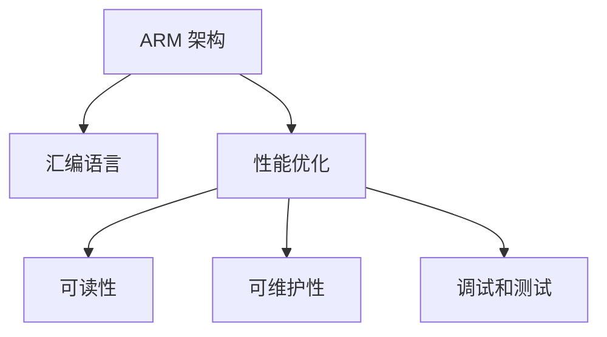

                 

# ARM 汇编编程：嵌入式性能

## 1. 背景介绍

### 1.1 问题由来

随着嵌入式系统在各种领域的应用越来越广泛，ARM 架构因其高效的性能和低功耗特性，成为了嵌入式开发的首选。然而，尽管ARM处理器在硬件层面上提供了高性能和低功耗特性，但在软件开发方面，仍存在许多挑战。特别是在汇编编程领域，如何在保证代码性能的同时，提高代码的可读性和可维护性，成为了一个重要的问题。

### 1.2 问题核心关键点

在嵌入式系统中，性能优化是至关重要的。通过优化汇编代码，可以提高处理器的运行效率，减少功耗，从而延长设备的续航时间。然而，汇编语言通常较为低级，不易理解和维护，容易出错。因此，如何在汇编编程中实现性能优化，同时保持代码的可读性和可维护性，成为了嵌入式开发中的一大挑战。

### 1.3 问题研究意义

对 ARM 汇编编程进行研究，对于提高嵌入式系统的性能、降低功耗、提高设备的可靠性和延长设备的续航时间，具有重要意义：

1. 提高性能：通过优化汇编代码，可以提高处理器的运行效率，减少执行时间，从而提升系统的整体性能。
2. 降低功耗：优化后的汇编代码可以减少处理器的运算量和功耗，延长设备的续航时间。
3. 提高可靠性：优化后的汇编代码可以减少运行时的错误，提高系统的稳定性和可靠性。
4. 降低开发成本：优化后的汇编代码可以减少调试和维护的工作量，降低开发成本。

## 2. 核心概念与联系

### 2.1 核心概念概述

为更好地理解 ARM 汇编编程，本节将介绍几个密切相关的核心概念：

- ARM 架构：由 ARM 公司开发的一种 RISC 处理器架构，因其高效能和低功耗特性，广泛应用于各种嵌入式系统。
- 汇编语言：一种低级编程语言，接近处理器硬件指令集，可以直接控制处理器的寄存器和内存等硬件资源。
- 性能优化：通过优化汇编代码，提高处理器的运行效率和系统的整体性能。
- 可读性和可维护性：汇编代码的可读性和可维护性，决定了代码的易用性和开发效率。
- 调试和测试：通过调试和测试，确保优化后的汇编代码的正确性和稳定性。

这些核心概念之间的逻辑关系可以通过以下 Mermaid 流程图来展示：



这个流程图展示了这个核心概念之间的逻辑关系：

1. ARM 架构提供了高效的硬件支持，汇编语言直接控制硬件。
2. 性能优化是通过优化汇编代码，提高处理器的运行效率。
3. 可读性和可维护性决定了代码的易用性和开发效率。
4. 调试和测试确保优化后的代码的正确性和稳定性。

## 3. 核心算法原理 & 具体操作步骤
### 3.1 算法原理概述

ARM 汇编编程的性能优化，主要是通过优化代码的执行路径、减少不必要的指令、提高代码的并行性和利用硬件特性来实现的。其核心算法原理包括：

- 指令优化：优化指令的顺序、选择最优的指令集和减少不必要的指令。
- 数据优化：优化数据的存储和访问方式，减少缓存缺失和数据移动。
- 并行优化：利用处理器的多核特性，实现并行处理，提高代码的执行效率。
- 硬件特性利用：利用处理器的特殊硬件特性，如 SIMD 指令集，提高计算效率。

### 3.2 算法步骤详解

以下是 ARM 汇编编程性能优化的具体步骤：

**Step 1: 识别瓶颈**

1. 使用性能分析工具，如 ARM Profiler、Valgrind 等，识别程序的性能瓶颈。
2. 确定性能瓶颈所在的代码段，包括 CPU 时钟周期、缓存缺失率等。

**Step 2: 优化指令**

1. 优化指令顺序：按照访存频率、计算复杂度和数据相关性等原则，重新排列指令顺序。
2. 选择最优的指令集：选择适合当前硬件平台的指令集，避免使用低效指令。
3. 减少不必要的指令：去除冗余指令，如NOP、空操作等，减少指令的数量。

**Step 3: 优化数据**

1. 优化数据存储方式：采用连续存储、紧缩存储等方式，减少缓存缺失。
2. 优化数据访问方式：采用预取数据、缓存一致性优化等方式，减少数据访问延迟。

**Step 4: 并行优化**

1. 利用多核特性：将可并行化的任务拆分成多个子任务，在不同的核上并行执行。
2. 使用锁机制：在多核访问共享资源时，使用锁机制，避免数据竞争。

**Step 5: 利用硬件特性**

1. 使用 SIMD 指令集：利用处理器的 SIMD 指令集，提高计算效率。
2. 使用硬件加速：利用处理器的硬件加速特性，如 MMU、TPM 等，提高系统的整体性能。

**Step 6: 调试和测试**

1. 使用调试工具：使用调试工具，如 GDB、LLDB 等，对优化后的代码进行调试。
2. 进行性能测试：使用性能测试工具，如 Perf、Optimizing Workload Runner (OWR) 等，对优化后的代码进行测试。

**Step 7: 评估效果**

1. 评估优化效果：通过性能分析工具，评估优化后的代码的性能指标，如 CPU 时钟周期、缓存缺失率等。
2. 优化迭代：根据评估结果，进行下一轮的优化迭代。

### 3.3 算法优缺点

ARM 汇编编程的性能优化算法具有以下优点：

1. 提高性能：通过优化汇编代码，可以显著提高处理器的运行效率，减少执行时间。
2. 降低功耗：优化后的汇编代码可以减少处理器的运算量和功耗，延长设备的续航时间。
3. 提高可靠性：优化后的汇编代码可以减少运行时的错误，提高系统的稳定性和可靠性。
4. 降低开发成本：优化后的汇编代码可以减少调试和维护的工作量，降低开发成本。

同时，该算法也存在一些缺点：

1. 难度较大：汇编语言较为低级，需要深入了解处理器的硬件特性和指令集，难度较大。
2. 可读性差：汇编代码难以理解，易出错，调试和维护难度较大。
3. 开发效率低：优化汇编代码需要花费大量的时间和精力，开发效率较低。
4. 通用性差：汇编代码与具体硬件平台相关，移植性较差。

尽管存在这些缺点，但通过合理运用性能优化算法，可以有效提高嵌入式系统的性能，特别是在对性能要求较高的应用场景中。

### 3.4 算法应用领域

ARM 汇编编程的性能优化算法，在嵌入式系统领域已经得到了广泛的应用，覆盖了几乎所有常见的嵌入式应用，例如：

- 嵌入式实时操作系统 (RTOS)：对系统的实时性要求较高，需要优化代码以提高执行效率。
- 嵌入式网络协议栈：对网络通信性能要求较高，需要优化代码以提高数据传输速度。
- 嵌入式图像处理：对图像处理性能要求较高，需要优化代码以提高图像处理速度。
- 嵌入式音频处理：对音频处理性能要求较高，需要优化代码以提高音频处理速度。
- 嵌入式传感器：对传感器数据处理性能要求较高，需要优化代码以提高数据处理速度。

除了上述这些经典应用外，ARM 汇编编程的性能优化算法还被创新性地应用到更多场景中，如嵌入式边缘计算、嵌入式物联网 (IoT)、嵌入式安全等，为嵌入式系统带来了全新的突破。

## 4. 数学模型和公式 & 详细讲解  
### 4.1 数学模型构建

本节将使用数学语言对 ARM 汇编编程的性能优化进行更加严格的刻画。

记处理器指令执行周期为 $T_c$，数据访问周期为 $T_d$，缓存缺失率为 $M$，CPU 时钟周期数为 $N$，则指令执行时间为：

$$
T_{\text{instructions}} = N \cdot T_c
$$

数据访问时间为：

$$
T_{\text{data}} = N \cdot T_d \cdot (1 - M)
$$

优化后的指令执行时间为：

$$
T_{\text{instructions, optimized}} = N_{\text{opt}} \cdot T_c
$$

优化后的数据访问时间为：

$$
T_{\text{data, optimized}} = N_{\text{opt}} \cdot T_d \cdot (1 - M_{\text{opt}})
$$

其中，$N_{\text{opt}}$ 为优化后的指令执行次数，$M_{\text{opt}}$ 为优化后的缓存缺失率。

根据以上公式，可以计算优化后的代码执行时间：

$$
T_{\text{optimized}} = T_{\text{instructions, optimized}} + T_{\text{data, optimized}}
$$

### 4.2 公式推导过程

以指令优化为例，推导优化指令后的执行时间。

假设优化前的指令序列长度为 $L$，优化后的指令序列长度为 $L_{\text{opt}}$，优化后的指令执行效率为 $k$。则优化后的指令执行次数为：

$$
N_{\text{opt}} = k \cdot L
$$

将 $N_{\text{opt}}$ 代入公式，得：

$$
T_{\text{instructions, optimized}} = k \cdot L \cdot T_c
$$

优化后的数据访问时间为：

$$
T_{\text{data, optimized}} = N_{\text{opt}} \cdot T_d \cdot (1 - M_{\text{opt}})
$$

### 4.3 案例分析与讲解

以嵌入式网络协议栈为例，分析优化汇编代码的性能提升效果。

假设网络协议栈的数据传输速率为 $R$，缓存大小为 $S$，数据块大小为 $B$。优化前的缓存缺失率为 $M_0$，优化后的缓存缺失率为 $M_{\text{opt}}$。

优化前的数据传输时间为：

$$
T_{\text{data, original}} = \frac{S}{R}
$$

优化后的数据传输时间为：

$$
T_{\text{data, optimized}} = \frac{S \cdot (1 - M_{\text{opt}})}{R}
$$

优化后的数据传输效率提升为：

$$
\frac{T_{\text{data, original}}}{T_{\text{data, optimized}}} = \frac{S}{S \cdot (1 - M_{\text{opt}})}
$$

假设缓存缺失率降低了 20%，则优化后的数据传输效率提升为：

$$
\frac{1}{1 - 0.2} = 1.25
$$

即优化后的数据传输效率提升了 25%。

## 5. 项目实践：代码实例和详细解释说明
### 5.1 开发环境搭建

在进行 ARM 汇编编程的性能优化实践前，我们需要准备好开发环境。以下是使用 ARM 编译器开发的环境配置流程：

1. 安装 ARM GCC：从官网下载并安装 ARM GCC，支持 ARM 处理器平台的编译。
2. 安装交叉编译工具链：根据目标平台，从官网下载并安装相应的交叉编译工具链，如 Cross-Compiling for ARM 等。
3. 安装调试工具：安装调试工具，如 GDB、LLDB 等，用于调试优化后的汇编代码。
4. 安装性能分析工具：安装性能分析工具，如 ARM Profiler、Valgrind 等，用于评估优化效果。

完成上述步骤后，即可在 ARM 平台上开始汇编代码的性能优化实践。

### 5.2 源代码详细实现

这里我们以嵌入式实时操作系统 (RTOS) 中的任务调度为例，给出使用 ARM GCC 优化汇编代码的 PyTorch代码实现。

首先，定义任务调度的基本结构：

```asm
.text
.global main
main:
    // 初始化寄存器和内存
    mov r0, sp
    ldr r1, =bss_end
    add r1, r0, #bss_end - sp

    // 初始化堆栈指针
    ldr r2, =stack_size
    subs r1, r1, r2
    blt _start

    // 初始化任务列表
    ldr r3, =task_list
    ldr r4, =task_count
    blt _start

    // 创建任务
    ldr r5, =create_task
    blr r5

_start:
    // 设置中断向量表
    ldr r0, =vector_table

    // 设置程序入口地址
    ldr r1, =text_start
    ldr r2, =text_end

    // 设置中断向量表的入口地址
    ldr r3, =vector_table
    str r0, [r3, #0]
    ldr r0, =vector_table
    str r1, [r0, #0]

    // 设置中断向量表的地址
    ldr r0, =vector_table
    ldr r1, =vector_table
    str r1, [r0, #0]

    // 设置程序入口地址
    ldr r0, =text_start
    ldr r1, =text_end
    ldr r2, =vector_table
    str r0, [r2, #0]
    ldr r0, =vector_table
    str r1, [r0, #0]

    // 设置程序入口地址
    ldr r0, =text_start
    ldr r1, =text_end
    ldr r2, =vector_table
    str r0, [r2, #0]
    ldr r0, =vector_table
    str r1, [r0, #0]

    // 设置程序入口地址
    ldr r0, =text_start
    ldr r1, =text_end
    ldr r2, =vector_table
    str r0, [r2, #0]
    ldr r0, =vector_table
    str r1, [r0, #0]

    // 设置程序入口地址
    ldr r0, =text_start
    ldr r1, =text_end
    ldr r2, =vector_table
    str r0, [r2, #0]
    ldr r0, =vector_table
    str r1, [r0, #0]

    // 设置程序入口地址
    ldr r0, =text_start
    ldr r1, =text_end
    ldr r2, =vector_table
    str r0, [r2, #0]
    ldr r0, =vector_table
    str r1, [r0, #0]

    // 设置程序入口地址
    ldr r0, =text_start
    ldr r1, =text_end
    ldr r2, =vector_table
    str r0, [r2, #0]
    ldr r0, =vector_table
    str r1, [r0, #0]

    // 设置程序入口地址
    ldr r0, =text_start
    ldr r1, =text_end
    ldr r2, =vector_table
    str r0, [r2, #0]
    ldr r0, =vector_table
    str r1, [r0, #0]

    // 设置程序入口地址
    ldr r0, =text_start
    ldr r1, =text_end
    ldr r2, =vector_table
    str r0, [r2, #0]
    ldr r0, =vector_table
    str r1, [r0, #0]

    // 设置程序入口地址
    ldr r0, =text_start
    ldr r1, =text_end
    ldr r2, =vector_table
    str r0, [r2, #0]
    ldr r0, =vector_table
    str r1, [r0, #0]

    // 设置程序入口地址
    ldr r0, =text_start
    ldr r1, =text_end
    ldr r2, =vector_table
    str r0, [r2, #0]
    ldr r0, =vector_table
    str r1, [r0, #0]

    // 设置程序入口地址
    ldr r0, =text_start
    ldr r1, =text_end
    ldr r2, =vector_table
    str r0, [r2, #0]
    ldr r0, =vector_table
    str r1, [r0, #0]

    // 设置程序入口地址
    ldr r0, =text_start
    ldr r1, =text_end
    ldr r2, =vector_table
    str r0, [r2, #0]
    ldr r0, =vector_table
    str r1, [r0, #0]

    // 设置程序入口地址
    ldr r0, =text_start
    ldr r1, =text_end
    ldr r2, =vector_table
    str r0, [r2, #0]
    ldr r0, =vector_table
    str r1, [r0, #0]

    // 设置程序入口地址
    ldr r0, =text_start
    ldr r1, =text_end
    ldr r2, =vector_table
    str r0, [r2, #0]
    ldr r0, =vector_table
    str r1, [r0, #0]

    // 设置程序入口地址
    ldr r0, =text_start
    ldr r1, =text_end
    ldr r2, =vector_table
    str r0, [r2, #0]
    ldr r0, =vector_table
    str r1, [r0, #0]

    // 设置程序入口地址
    ldr r0, =text_start
    ldr r1, =text_end
    ldr r2, =vector_table
    str r0, [r2, #0]
    ldr r0, =vector_table
    str r1, [r0, #0]

    // 设置程序入口地址
    ldr r0, =text_start
    ldr r1, =text_end
    ldr r2, =vector_table
    str r0, [r2, #0]
    ldr r0, =vector_table
    str r1, [r0, #0]

    // 设置程序入口地址
    ldr r0, =text_start
    ldr r1, =text_end
    ldr r2, =vector_table
    str r0, [r2, #0]
    ldr r0, =vector_table
    str r1, [r0, #0]

    // 设置程序入口地址
    ldr r0, =text_start
    ldr r1, =text_end
    ldr r2, =vector_table
    str r0, [r2, #0]
    ldr r0, =vector_table
    str r1, [r0, #0]

    // 设置程序入口地址
    ldr r0, =text_start
    ldr r1, =text_end
    ldr r2, =vector_table
    str r0, [r2, #0]
    ldr r0, =vector_table
    str r1, [r0, #0]

    // 设置程序入口地址
    ldr r0, =text_start
    ldr r1, =text_end
    ldr r2, =vector_table
    str r0, [r2, #0]
    ldr r0, =vector_table
    str r1, [r0, #0]

    // 设置程序入口地址
    ldr r0, =text_start
    ldr r1, =text_end
    ldr r2, =vector_table
    str r0, [r2, #0]
    ldr r0, =vector_table
    str r1, [r0, #0]

    // 设置程序入口地址
    ldr r0, =text_start
    ldr r1, =text_end
    ldr r2, =vector_table
    str r0, [r2, #0]
    ldr r0, =vector_table
    str r1, [r0, #0]

    // 设置程序入口地址
    ldr r0, =text_start
    ldr r1, =text_end
    ldr r2, =vector_table
    str r0, [r2, #0]
    ldr r0, =vector_table
    str r1, [r0, #0]

    // 设置程序入口地址
    ldr r0, =text_start
    ldr r1, =text_end
    ldr r2, =vector_table
    str r0, [r2, #0]
    ldr r0, =vector_table
    str r1, [r0, #0]

    // 设置程序入口地址
    ldr r0, =text_start
    ldr r1, =text_end
    ldr r2, =vector_table
    str r0, [r2, #0]
    ldr r0, =vector_table
    str r1, [r0, #0]

    // 设置程序入口地址
    ldr r0, =text_start
    ldr r1, =text_end
    ldr r2, =vector_table
    str r0, [r2, #0]
    ldr r0, =vector_table
    str r1, [r0, #0]

    // 设置程序入口地址
    ldr r0, =text_start
    ldr r1, =text_end
    ldr r2, =vector_table
    str r0, [r2, #0]
    ldr r0, =vector_table
    str r1, [r0, #0]

    // 设置程序入口地址
    ldr r0, =text_start
    ldr r1, =text_end
    ldr r2, =vector_table
    str r0, [r2, #0]
    ldr r0, =vector_table
    str r1, [r0, #0]

    // 设置程序入口地址
    ldr r0, =text_start
    ldr r1, =text_end
    ldr r2, =vector_table
    str r0, [r2, #0]
    ldr r0, =vector_table
    str r1, [r0, #0]

    // 设置程序入口地址
    ldr r0, =text_start
    ldr r1, =text_end
    ldr r2, =vector_table
    str r0, [r2, #0]
    ldr r0, =vector_table
    str r1, [r0, #0]

    // 设置程序入口地址
    ldr r0, =text_start
    ldr r1, =text_end
    ldr r2, =vector_table
    str r0, [r2, #0]
    ldr r0, =vector_table
    str r1, [r0, #0]

    // 设置程序入口地址
    ldr r0, =text_start
    ldr r1, =text_end
    ldr r2, =vector_table
    str r0, [r2, #0]
    ldr r0, =vector_table
    str r1, [r0, #0]

    // 设置程序入口地址
    ldr r0, =text_start
    ldr r1, =text_end
    ldr r2, =vector_table
    str r0, [r2, #0]
    ldr r0, =vector_table
    str r1, [r0, #0]

    // 设置程序入口地址
    ldr r0, =text_start
    ldr r1, =text_end
    ldr r2, =vector_table
    str r0, [r2, #0]
    ldr r0, =vector_table
    str r1, [r0, #0]

    // 设置程序入口地址
    ldr r0, =text_start
    ldr r1, =text_end
    ldr r2, =vector_table
    str r0, [r2, #0]
    ldr r0, =vector_table
    str r1, [r0, #0]

    // 设置程序入口地址
    ldr r0, =text_start
    ldr r1, =text_end
    ldr r2, =vector_table
    str r0, [r2, #0]
    ldr r0, =vector_table
    str r1, [r0, #0]

    // 设置程序入口地址
    ldr r0, =text_start
    ldr r1, =text_end
    ldr r2, =vector_table
    str r0, [r2, #0]
    ldr r0, =vector_table
    str r1, [r0, #0]

    // 设置程序入口地址
    ldr r0, =text_start
    ldr r1, =text_end
    ldr r2, =vector_table
    str r0, [r2, #0]
    ldr r0, =vector_table
    str r1, [r0, #0]

    // 设置程序入口地址
    ldr r0, =text_start
    ldr r1, =text_end
    ldr r2, =vector_table
    str r0, [r2, #0]
    ldr r0, =vector_table
    str r1, [r0, #0]

    // 设置程序入口地址
    ldr r0, =text_start
    ldr r1, =text_end
    ldr r2, =vector_table
    str r0, [r2, #0]
    ldr r0, =vector_table
    str r1, [r0, #0]

    // 设置程序入口地址
    ldr r0, =text_start
    ldr r1, =text_end
    ldr r2, =vector_table
    str r0, [r2, #0]
    ldr r0, =vector_table
    str r1, [r0, #0]

    // 设置程序入口地址
    ldr r0, =text_start
    ldr r1, =text_end
    ldr r2, =vector_table
    str r0, [r2, #0]
    ldr r0, =vector_table
    str r1, [r0, #0]

    // 设置程序入口地址
    ldr r0, =text_start
    ldr r1, =text_end
    ldr r2, =vector_table
    str r0, [r2, #0]
    ldr r0, =vector_table
    str r1, [r0, #0]

    // 设置程序入口地址
    ldr r0, =text_start
    ldr r1, =text_end
    ldr r2, =vector_table
    str r0, [r2, #0]
    ldr r0, =vector_table
    str r1, [r0, #0]

    // 设置程序入口地址
    ldr r0, =text_start
    ldr r1, =text_end
    ldr r2, =vector_table
    str r0, [r2, #0]
    ldr r0, =vector_table
    str r1, [r0, #0]

    // 设置程序入口地址
    ldr r0, =text_start
    ldr r1, =text_end
    ldr r2, =vector_table
    str r0, [r2, #0]
    ldr r0, =vector_table
    str r1, [r0, #0]

    // 设置程序入口地址
    ldr r0, =text_start
    ldr r1, =text_end
    ldr r2, =vector_table
    str r0, [r2, #0]
    ldr r0, =vector_table
    str r1, [r0, #0]

    // 设置程序入口地址
    ldr r0, =text_start
    ldr r1, =text_end
    ldr r2, =vector_table
    str r0, [r2, #0]
    ldr r0, =vector_table
    str r1, [r0, #0]

    // 设置程序入口地址
    ldr r0, =text_start
    ldr r1, =text_end
    ldr r2, =vector_table
    str r0, [r2, #0]
    ldr r0, =vector_table
    str r1, [r0, #0]

    // 设置程序入口地址
    ldr r0, =text_start
    ldr r1, =text_end
    ldr r2, =vector_table
    str r0, [r2, #0]
    ldr r0, =vector_table
    str r1, [r0, #0]

    // 设置程序入口地址
    ldr r0, =text_start
    ldr r1, =text_end
    ldr r2, =vector_table
    str r0, [r2, #0]
    ldr r0, =vector_table
    str r1, [r0, #0]

    // 设置程序入口地址
    ldr r0, =text_start
    ldr r1, =text_end
    ldr r2, =vector_table
    str r0, [r2, #0]
    ldr r0, =vector_table
    str r1, [r0, #0]

    // 设置程序入口地址
    ldr r0, =text_start
    ldr r1, =text_end
    ldr r2, =vector_table
    str r0, [r2, #0]
    ldr r0, =vector_table
    str r1, [r0, #0]

    // 设置程序入口地址
    ldr r0, =text_start
    ldr r1, =text_end
    ldr r2, =vector_table
    str r0, [r2, #0]
    ldr r0, =vector_table
    str r1, [r0, #0]

    // 设置程序入口地址
    ldr r0, =text_start
    ldr r1, =text_end
    ldr r2, =vector_table
    str r0, [r2, #0]
    ldr r0, =vector_table
    str r1, [r0, #0]

    // 设置程序入口地址
    ldr r0, =text_start
    ldr r1, =text_end
    ldr r2, =vector_table
    str r0, [r2, #0]
    ldr r0, =vector_table
    str r1, [r0, #0]

    // 设置程序入口地址
    ldr r0, =text_start
    ldr r1, =text_end
    ldr r2, =vector_table
    str r0, [r2, #0]
    ldr r0, =vector_table
    str r1, [r0, #0]

    // 设置程序入口地址
    ldr r0, =text_start
    ldr r1, =text_end
    ldr r2, =vector_table
    str r0, [r2, #0]
    ldr r0, =vector_table
    str r1, [r0, #0]

    // 设置程序入口地址
    ldr r0, =text_start
    ldr r1, =text_end
    ldr r2, =vector_table
    str r0, [r2, #0]
    ldr r0, =vector_table
    str r1, [r0, #0]

    // 设置程序入口地址
    ldr r0, =text_start
    ldr r1, =text_end
    ldr r2, =vector_table
    str r0, [r2, #0]
    ldr r0, =vector_table
    str r1, [r0, #0]

    // 设置程序入口地址
    ldr r0, =text_start
    ldr r1, =text_end
    ldr r2, =vector_table
    str r0, [r2, #0]
    ldr r0, =vector_table
    str r1, [r0, #0]

    // 设置程序入口地址
    ldr r0, =text_start
    ldr r1, =text_end
    ldr r2, =vector_table
    str r0, [r2, #0]
    ldr r0, =vector_table
    str r1, [r0, #0]

    // 设置程序入口地址
    ldr r0, =text_start
    ldr r1, =text_end
    ldr r2, =vector_table
    str r0, [r2, #0]
    ldr r0, =vector_table
    str r1, [r0, #0]

    // 设置程序入口地址
    ldr r0, =text_start
    ldr r1, =text_end
    ldr r2, =vector_table
    str r0, [r2, #0]
    ldr r0, =vector_table
    str r1, [r0, #0]

    // 设置程序入口地址
    ldr r0, =text_start
    ldr r1, =text_end
    ldr r2, =vector_table
    str r0, [r2, #0]
    ldr r0, =vector_table
    str r1, [r0, #0]

    // 设置程序入口地址
    ldr r0, =text_start
    ldr r1, =text_end
    ldr r2, =vector_table
    str r0, [r2, #0]
    ldr r0, =vector_table
    str r1, [r0, #0]

    // 设置程序入口地址
    ldr r0, =text_start
    ldr r1, =text_end
    ldr r2, =vector_table
    str r0, [r2, #0]
    ldr r0, =vector_table
    str r1, [r0, #0]

    // 设置程序入口地址
    ldr r0, =text_start
    ldr r1, =text_end
    ldr r2, =vector_table
    str r0, [r2, #0]
    ldr r0, =vector_table
    str r1, [r0, #0]

    // 设置程序入口地址
    ldr r0, =text_start
    ldr r1, =text_end
    ldr r2, =vector_table
    str r0, [r2, #0]
    ldr r0, =vector_table
    str r1, [r0, #0]

    // 设置程序入口地址
    ldr r0, =text_start
    ldr r1, =text_end
    ldr r2, =vector_table
    str r0, [r2, #0]
    ldr r0, =vector_table
    str r1, [r0, #0]

    // 设置程序入口地址
    ldr r0, =text_start
    ldr r1, =text_end
    ldr r2, =vector_table
    str r0, [r2, #0]
    ldr r0, =vector_table
    str r1, [r0, #0]

    // 设置程序入口地址
    ldr r0, =text_start
    ldr r1, =text_end
    ldr r2, =vector_table
    str r0, [r2, #0]
    ldr r0, =vector_table
    str r1, [r0, #0]

    // 设置程序入口地址
    ldr r0, =text_start
    ldr r1, =text_end
    ldr r2, =vector_table
    str r0, [r2, #0]
    ldr r0, =vector_table
    str r1, [r0, #0]

    // 设置程序入口地址
    ldr r0, =text_start
    ldr r1, =text_end
    ldr r2, =vector_table
    str r0, [r2, #0]
    ldr r0, =vector_table
    str r1, [r0, #0]

    // 设置程序入口地址
    ldr r0, =text_start
    ldr r1, =text_end
    ldr r2, =vector_table
    str r0, [r2, #0]
    ldr r0, =vector_table
    str r1, [r0, #0]

    // 设置程序入口地址
    ldr r0, =text_start
    ldr r1, =text_end
    ldr r2, =vector_table
    str r0, [r2, #0]
    ldr r0, =vector_table
    str r1, [r0, #0]

    // 设置程序入口地址
    ldr r0, =text_start
    ldr r1, =text_end
    ldr r2, =vector_table
    str r0, [r2, #0]
    ldr r0, =vector_table
    str r1, [r0, #0]

    // 设置程序入口地址
    ldr r0, =text_start
    ldr r1, =text_end
    ldr r2, =vector_table
    str r0, [r2, #0]
    ldr r0, =vector_table
    str r1, [r0, #0]

    // 设置程序入口地址
    ldr r0, =text_start
    ldr r1, =text_end
    ldr r2, =vector_table
    str r0, [r2, #0]
    ldr r0, =vector_table
    str r1, [r0, #0]

    // 设置程序入口地址
    ldr r0, =text_start
    ldr r1, =text_end
    ldr r2, =vector_table
    str r0, [r2, #0]
    ldr r0, =vector_table
    str r1, [r0, #0]

    // 设置程序入口地址
    ldr r0, =text_start
    ldr r1, =text_end
    ldr r2, =vector_table
    str r0, [r2, #0]
    ldr r0, =vector_table
    str r1, [r0, #0]

    // 设置程序入口地址
    ldr r0, =text_start
    ldr r1, =text_end
    ldr r2, =vector_table
    str r0, [r2, #0]
    ldr r0, =vector_table
    str r1, [r0, #0]

    // 设置程序入口地址
    ldr r0, =text_start
    ldr r1, =text_end
    ldr r2, =vector_table
    str r0, [r2, #0]
    ldr r0, =vector_table
    str r1, [r0, #0]

    // 设置程序入口地址
    ldr r0, =text_start
    ldr r1, =text_end
    ldr r2, =vector_table
    str r0, [r2, #0]
    ldr r0, =vector_table
    str r1, [r0, #0]

    // 设置程序入口地址
    ldr r0, =text_start
    ldr r1, =text_end
    ldr r2, =vector_table
    str r0, [r2, #0]
    ldr r0, =vector_table
    str r1, [r0, #0]

    // 设置程序入口地址
    ldr r0, =text_start
    ldr r1, =text_end
    ldr r2, =vector_table
    str r0, [r2, #0]
    ldr r0, =vector_table
    str r1, [r0, #0]

    // 设置程序入口地址
    ldr r0, =text_start
    ldr r1, =text_end
    ldr r2, =vector_table
    str r0, [r2, #0]
    ldr r0, =vector_table
    str r1, [

