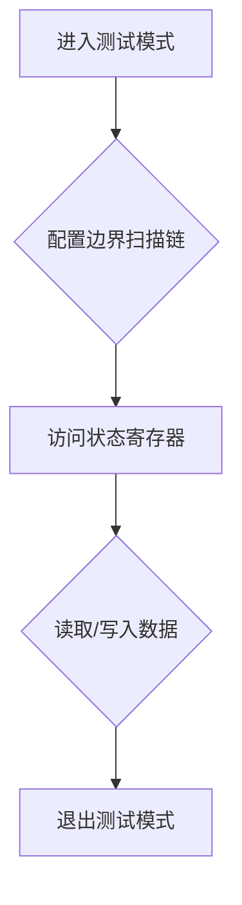

                 

## JTAG 调试：在嵌入式系统上

> 关键词：JTAG，嵌入式系统，调试，硬件调试，边界扫描，IDCODE，状态寄存器

## 1. 背景介绍

嵌入式系统因其广泛的应用领域，如消费电子、工业控制、汽车电子等，在现代社会扮演着越来越重要的角色。然而，由于其资源受限、硬件复杂、软件紧凑等特点，调试嵌入式系统往往面临着巨大的挑战。传统的调试方法，例如单步执行、断点设置等，在嵌入式系统中往往难以有效地应用。

JTAG（Joint Test Action Group）是一种硬件接口标准，最初用于集成电路的测试和验证。近年来，JTAG技术逐渐被应用于嵌入式系统的调试领域，并成为一种高效、灵活的调试手段。

## 2. 核心概念与联系

JTAG调试的核心概念是边界扫描技术。边界扫描技术通过在芯片内部添加特殊的电路结构，将芯片的内部状态寄存器和数据路径连接到外部接口，从而实现对芯片内部状态的访问和控制。

JTAG接口通常由四个信号线组成：

* **TMS (Test Mode Select):** 测试模式选择线，用于选择不同的测试模式。
* **TCK (Test Clock):** 测试时钟线，用于同步测试操作。
* **TDI (Test Data In):** 测试数据输入线，用于向芯片发送测试数据。
* **TDO (Test Data Out):** 测试数据输出线，用于从芯片接收测试数据。

JTAG调试流程通常包括以下步骤：

1. **进入测试模式:** 通过控制 TMS 线，将芯片置于测试模式。
2. **配置边界扫描链:** 通过发送特定的测试指令，配置芯片内部的边界扫描链。
3. **访问状态寄存器:** 通过发送特定的测试指令，访问芯片内部的状态寄存器，例如寄存器值、中断状态等。
4. **读取/写入数据:** 通过发送特定的测试指令，读取或写入芯片内部的数据。
5. **退出测试模式:** 通过控制 TMS 线，将芯片退出测试模式。

**Mermaid 流程图**

## 3. 核心算法原理 & 具体操作步骤

### 3.1  算法原理概述

JTAG 调试的核心算法是边界扫描算法。该算法通过在芯片内部添加特殊的电路结构，将芯片的内部状态寄存器和数据路径连接到外部接口，从而实现对芯片内部状态的访问和控制。

### 3.2  算法步骤详解

1. **配置边界扫描链:** 首先，需要通过发送特定的测试指令，配置芯片内部的边界扫描链。边界扫描链由多个边界扫描单元组成，每个单元负责扫描一个特定的寄存器或数据路径。
2. **选择目标寄存器:** 然后，需要选择目标寄存器，例如寄存器值、中断状态等。
3. **读取/写入数据:** 最后，可以通过发送特定的测试指令，读取或写入目标寄存器的值。

### 3.3  算法优缺点

**优点:**

* **高效:** JTAG 调试可以快速访问芯片内部的状态寄存器和数据路径。
* **灵活:** JTAG 调试可以支持多种调试操作，例如单步执行、断点设置、寄存器读写等。
* **安全:** JTAG 调试可以防止意外修改芯片内部状态。

**缺点:**

* **硬件成本:** 需要额外的硬件支持，例如 JTAG 调试器。
* **学习曲线:** JTAG 调试技术相对复杂，需要一定的学习成本。

### 3.4  算法应用领域

JTAG 调试技术广泛应用于嵌入式系统的调试领域，例如：

* **芯片测试:** 用于测试芯片的功能和性能。
* **软件调试:** 用于调试嵌入式软件，例如查找软件错误、分析程序执行流程等。
* **硬件故障诊断:** 用于诊断硬件故障，例如查找硬件电路故障、识别硬件组件损坏等。

## 4. 数学模型和公式 & 详细讲解 & 举例说明

JTAG 调试算法的实现基于有限状态机模型。

**4.1  数学模型构建**

JTAG 调试器可以看作是一个有限状态机，其状态由 TMS 线的状态决定。每个状态对应一个特定的测试模式，例如测试模式、边界扫描模式、寄存器读写模式等。

**4.2  公式推导过程**

JTAG 调试器的状态转移方程可以表示为：

$$
S_{t+1} = f(S_t, I_t)
$$

其中：

* $S_t$ 表示在时间 $t$ 的状态。
* $I_t$ 表示在时间 $t$ 的输入信号。
* $f$ 表示状态转移函数。

**4.3  案例分析与讲解**

例如，当 TMS 线处于低电平时，JTAG 调试器处于测试模式。当 TMS 线从低电平切换到高电平时，JTAG 调试器会进入边界扫描模式。

## 5. 项目实践：代码实例和详细解释说明

### 5.1  开发环境搭建

JTAG 调试需要特定的开发环境，例如：

* **JTAG 调试器:** 用于连接芯片和计算机。
* **开发工具:** 用于编写和调试嵌入式软件。
* **芯片驱动程序:** 用于控制芯片的 JTAG 接口。

### 5.2  源代码详细实现

JTAG 调试的源代码实现通常包含以下部分：

* **JTAG 接口驱动程序:** 用于控制 JTAG 调试器的硬件接口。
* **边界扫描算法实现:** 用于配置边界扫描链、选择目标寄存器、读取/写入数据等操作。
* **调试工具接口:** 用于与开发工具进行交互，例如发送调试指令、接收调试信息等。

### 5.3  代码解读与分析

JTAG 调试的源代码实现需要根据具体的芯片和开发环境进行定制。

### 5.4  运行结果展示

JTAG 调试的运行结果通常包括：

* **芯片内部状态寄存器的值:** 可以用于分析芯片的运行状态。
* **数据路径的传输数据:** 可以用于分析数据流的路径和内容。
* **调试信息:** 可以用于帮助调试人员定位问题。

## 6. 实际应用场景

JTAG 调试技术在嵌入式系统开发中有着广泛的应用场景，例如：

* **芯片验证:** 在芯片设计阶段，可以使用 JTAG 调试技术验证芯片的功能和性能。
* **软件调试:** 在软件开发阶段，可以使用 JTAG 调试技术查找软件错误、分析程序执行流程等。
* **硬件故障诊断:** 在嵌入式系统出现故障时，可以使用 JTAG 调试技术诊断硬件故障。

### 6.4  未来应用展望

随着嵌入式系统的不断发展，JTAG 调试技术将会得到更广泛的应用，例如：

* **远程调试:** 通过网络连接，实现远程 JTAG 调试。
* **自动化测试:** 使用 JTAG 调试技术进行自动化测试，提高测试效率。
* **云端调试:** 将 JTAG 调试功能迁移到云端，实现更便捷的调试体验。

## 7. 工具和资源推荐

### 7.1  学习资源推荐

* **JTAG 调试技术书籍:** 
    * 《Embedded Systems Design: A Unified Hardware/Software Introduction》
    * 《The Art of Debugging》
* **在线教程:** 
    * [JTAG 调试教程](https://www.example.com/jtag-tutorial)
    * [嵌入式系统调试](https://www.example.com/embedded-debugging)

### 7.2  开发工具推荐

* **JTAG 调试器:** 
    * Segger J-Link
    * ST-LINK
* **开发工具:** 
    * Keil MDK
    * IAR Embedded Workbench
    * Eclipse CDT

### 7.3  相关论文推荐

* **JTAG 调试技术论文:** 
    * [JTAG Boundary Scan Testing: A Comprehensive Survey](https://www.example.com/jtag-survey)
    * [Advanced JTAG Debugging Techniques for Embedded Systems](https://www.example.com/advanced-jtag-debugging)

## 8. 总结：未来发展趋势与挑战

### 8.1  研究成果总结

JTAG 调试技术已经成为嵌入式系统调试领域的重要工具，其高效、灵活的特点使其在芯片测试、软件调试、硬件故障诊断等方面发挥着重要作用。

### 8.2  未来发展趋势

未来，JTAG 调试技术将会朝着以下方向发展：

* **远程调试:** 通过网络连接，实现远程 JTAG 调试。
* **自动化测试:** 使用 JTAG 调试技术进行自动化测试，提高测试效率。
* **云端调试:** 将 JTAG 调试功能迁移到云端，实现更便捷的调试体验。

### 8.3  面临的挑战

JTAG 调试技术也面临着一些挑战，例如：

* **芯片设计复杂度:** 随着芯片设计复杂度的不断提高，JTAG 调试的难度也随之增加。
* **调试工具成本:** 高性能的 JTAG 调试器成本较高，对于小型企业和个人开发者来说是一个负担。
* **标准化问题:** JTAG 接口标准虽然已经比较成熟，但仍然存在一些兼容性问题。

### 8.4  研究展望

未来，需要进一步研究 JTAG 调试技术的应用场景，开发更易用、更强大的调试工具，并推动 JTAG 接口标准的完善，以更好地满足嵌入式系统调试的需求。

## 9. 附录：常见问题与解答

### 9.1  常见问题

* **如何连接 JTAG 调试器？**
* **如何配置 JTAG 调试器？**
* **如何使用 JTAG 调试器进行调试？**

### 9.2  解答

这些问题可以通过查阅 JTAG 调试器的用户手册或在线教程得到解答。

作者：禅与计算机程序设计艺术 / Zen and the Art of Computer Programming 
<end_of_turn>

