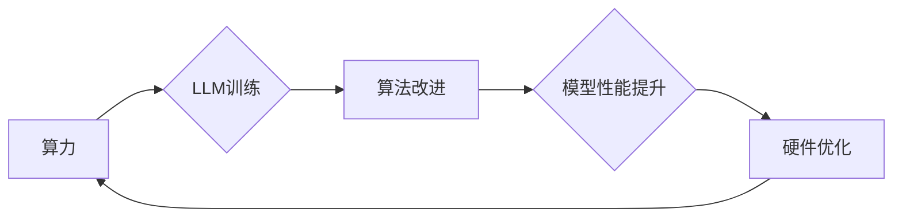

                 

## LLM 未来发展：摩尔定律的延续

> 关键词：LLM, 大语言模型, 深度学习, 算力, 算法, 硬件, 摩尔定律, 发展趋势, 应用场景

### 1. 背景介绍

自20世纪60年代以来，摩尔定律一直是推动计算机技术发展的核心驱动力。它指出，集成电路上的晶体管数量大约每18个月翻倍，计算能力随之指数级增长。然而，随着晶体管尺寸的不断缩小，摩尔定律的进展逐渐放缓，寻找新的突破点成为当务之急。

近年来，深度学习技术的兴起为人工智能领域带来了革命性的变革。其中，大语言模型（LLM）作为深度学习的代表，展现出强大的文本理解和生成能力，在自然语言处理、机器翻译、代码生成等领域取得了突破性进展。LLM的出现，为突破摩尔定律瓶颈提供了新的思路，其发展潜力与未来应用场景令人期待。

### 2. 核心概念与联系

LLM的核心概念是利用深度神经网络学习语言的模式和规律，从而实现对文本的理解和生成。其架构通常基于Transformer模型，该模型通过自注意力机制捕捉文本中的长距离依赖关系，有效提升了模型的表达能力。

LLM的发展与算力、算法、硬件三者紧密相连。

* **算力:** 训练大型语言模型需要海量数据和强大的计算能力。随着GPU和TPU等专用硬件的不断发展，算力水平不断提升，为LLM的训练和应用提供了基础保障。
* **算法:** Transformer模型的提出以及其后续改进，如BERT、GPT、T5等，为LLM的发展提供了强大的算法支撑。这些算法不断提升了模型的性能和效率，推动着LLM技术的进步。
* **硬件:** 硬件的进步不仅体现在算力提升上，还包括内存容量、数据传输速度等方面的提升。这些硬件改进为训练和运行大型语言模型提供了更强大的支持。

**Mermaid 流程图:**



### 3. 核心算法原理 & 具体操作步骤

#### 3.1  算法原理概述

LLM的核心算法是基于Transformer模型的深度神经网络。Transformer模型通过自注意力机制，能够捕捉文本中的长距离依赖关系，有效提升了模型的表达能力。

自注意力机制的核心思想是，每个单词在句子中都与其他单词存在着一定的关联性。通过计算每个单词与其他单词之间的注意力权重，模型能够更好地理解单词之间的语义关系，从而提升文本理解和生成能力。

#### 3.2  算法步骤详解

1. **词嵌入:** 将文本中的每个单词映射到一个低维向量空间中，每个单词都对应一个唯一的向量表示。
2. **多头自注意力:** 对每个单词进行多头自注意力计算，计算每个单词与其他单词之间的注意力权重，并将其加权求和，得到每个单词的上下文表示。
3. **前馈神经网络:** 对每个单词的上下文表示进行非线性变换，进一步提取文本特征。
4. **位置编码:** 将单词在句子的位置信息编码到其向量表示中，因为Transformer模型没有循环结构，无法直接捕捉单词的顺序信息。
5. **解码器:** 利用编码器输出的上下文表示，生成目标文本。解码器通常采用自回归的方式，逐个预测目标文本中的单词。

#### 3.3  算法优缺点

**优点:**

* 能够捕捉文本中的长距离依赖关系，提升文本理解和生成能力。
* 训练效率高，能够处理海量数据。
* 模型结构灵活，可以根据不同的任务进行调整。

**缺点:**

* 训练成本高，需要大量的计算资源和数据。
* 模型参数量大，部署成本较高。
* 对训练数据质量要求高，容易受到训练数据偏差的影响。

#### 3.4  算法应用领域

LLM在自然语言处理领域有着广泛的应用，例如：

* **机器翻译:** 将一种语言翻译成另一种语言。
* **文本摘要:** 将长篇文本压缩成短篇摘要。
* **问答系统:** 回答用户提出的问题。
* **对话系统:** 与用户进行自然语言对话。
* **代码生成:** 根据自然语言描述生成代码。

### 4. 数学模型和公式 & 详细讲解 & 举例说明

#### 4.1  数学模型构建

LLM的数学模型主要基于深度神经网络，其核心是Transformer模型。Transformer模型通过多层编码器和解码器结构，利用自注意力机制和前馈神经网络，实现对文本的理解和生成。

#### 4.2  公式推导过程

自注意力机制的核心公式是计算每个单词与其他单词之间的注意力权重。

$$
\text{Attention}(Q, K, V) = \text{softmax}\left(\frac{QK^T}{\sqrt{d_k}}\right)V
$$

其中：

* $Q$：查询矩阵，表示当前单词的向量表示。
* $K$：键矩阵，表示所有单词的向量表示。
* $V$：值矩阵，表示所有单词的向量表示。
* $d_k$：键向量的维度。
* $\text{softmax}$：softmax函数，将注意力权重归一化到0到1之间。

#### 4.3  案例分析与讲解

假设我们有一个句子：“The cat sat on the mat”。

* $Q$：表示“sat”单词的向量表示。
* $K$：表示所有单词的向量表示，包括“The”、“cat”、“sat”、“on”、“the”、“mat”。
* $V$：表示所有单词的向量表示。

通过计算$Q$与$K$之间的注意力权重，我们可以得到“sat”单词与其他单词之间的关联性。例如，注意力权重最高的单词可能是“cat”，因为“cat”是“sat”的直接主语。

### 5. 项目实践：代码实例和详细解释说明

#### 5.1  开发环境搭建

* Python 3.7+
* PyTorch 1.7+
* CUDA 10.2+

#### 5.2  源代码详细实现

```python
import torch
import torch.nn as nn

class Transformer(nn.Module):
    def __init__(self, vocab_size, embedding_dim, num_heads, num_layers):
        super(Transformer, self).__init__()
        self.embedding = nn.Embedding(vocab_size, embedding_dim)
        self.encoder_layers = nn.ModuleList([EncoderLayer(embedding_dim, num_heads) for _ in range(num_layers)])
        self.decoder_layers = nn.ModuleList([DecoderLayer(embedding_dim, num_heads) for _ in range(num_layers)])

    def forward(self, src, tgt, src_mask, tgt_mask):
        src = self.embedding(src)
        tgt = self.embedding(tgt)
        
        encoder_output = src
        for layer in self.encoder_layers:
            encoder_output = layer(encoder_output, src_mask)
        
        decoder_output = tgt
        for layer in self.decoder_layers:
            decoder_output = layer(decoder_output, encoder_output, tgt_mask)
        
        return decoder_output

class EncoderLayer(nn.Module):
    def __init__(self, embedding_dim, num_heads):
        super(EncoderLayer, self).__init__()
        self.self_attn = MultiHeadAttention(embedding_dim, num_heads)
        self.feed_forward = FeedForwardNetwork(embedding_dim)
        self.norm1 = nn.LayerNorm(embedding_dim)
        self.norm2 = nn.LayerNorm(embedding_dim)

    def forward(self, x, src_mask):
        attn_output = self.self_attn(x, x, x, src_mask)
        x = x + attn_output
        x = self.norm1(x)
        ffn_output = self.feed_forward(x)
        x = x + ffn_output
        x = self.norm2(x)
        return x

class DecoderLayer(nn.Module):
    def __init__(self, embedding_dim, num_heads):
        super(DecoderLayer, self).__init__()
        self.self_attn = MultiHeadAttention(embedding_dim, num_heads)
        self.encoder_attn = MultiHeadAttention(embedding_dim, num_heads)
        self.feed_forward = FeedForwardNetwork(embedding_dim)
        self.norm1 = nn.LayerNorm(embedding_dim)
        self.norm2 = nn.LayerNorm(embedding_dim)
        self.norm3 = nn.LayerNorm(embedding_dim)

    def forward(self, x, encoder_output, tgt_mask):
        attn_output = self.self_attn(x, x, x, tgt_mask)
        x = x + attn_output
        x = self.norm1(x)
        encoder_attn_output = self.encoder_attn(x, encoder_output, encoder_output)
        x = x + encoder_attn_output
        x = self.norm2(x)
        ffn_output = self.feed_forward(x)
        x = x + ffn_output
        x = self.norm3(x)
        return x

# ... 其他模块定义 ...

```

#### 5.3  代码解读与分析

* Transformer模型由编码器和解码器组成，分别负责处理源语言和目标语言。
* 编码器和解码器都由多层EncoderLayer和DecoderLayer组成，每层包含自注意力机制、前馈神经网络和层归一化操作。
* 自注意力机制能够捕捉文本中的长距离依赖关系，提升模型的表达能力。
* 前馈神经网络用于提取文本特征。
* 层归一化操作可以加速模型训练并提高模型性能。

#### 5.4  运行结果展示

训练好的LLM模型可以用于各种自然语言处理任务，例如机器翻译、文本摘要、问答系统等。

### 6. 实际应用场景

LLM在各个领域都有着广泛的应用场景，例如：

* **教育:** 智能辅导系统、个性化学习平台。
* **医疗:** 疾病诊断辅助系统、医疗记录分析。
* **金融:** 风险评估、欺诈检测。
* **法律:** 法律文件分析、合同审查。
* **娱乐:** 游戏剧本创作、虚拟助手。

#### 6.4  未来应用展望

随着LLM技术的不断发展，其应用场景将更加广泛，例如：

* **通用人工智能:** LLM可以作为通用人工智能的基石，实现更智能、更自然的交互。
* **个性化服务:** LLM可以根据用户的需求和喜好，提供个性化的服务，例如定制化新闻、个性化推荐等。
* **跨语言沟通:** LLM可以打破语言障碍，实现跨语言的沟通和交流。

### 7. 工具和资源推荐

#### 7.1  学习资源推荐

* **书籍:**
    * 《深度学习》
    * 《自然语言处理》
* **在线课程:**
    * Coursera: 自然语言处理
    * edX: 深度学习
* **博客:**
    * The Gradient
    * Towards Data Science

#### 7.2  开发工具推荐

* **框架:**
    * PyTorch
    * TensorFlow
* **库:**
    * Hugging Face Transformers
    * Gensim

#### 7.3  相关论文推荐

* Attention Is All You Need
* BERT: Pre-training of Deep Bidirectional Transformers for Language Understanding
* GPT-3: Language Models are Few-Shot Learners

### 8. 总结：未来发展趋势与挑战

#### 8.1  研究成果总结

LLM的发展取得了显著的成果，在文本理解和生成方面展现出强大的能力。

#### 8.2  未来发展趋势

* **模型规模的进一步扩大:** 更大的模型规模能够提升模型的性能，但同时也带来更高的训练成本和部署难度。
* **算法的不断改进:** 研究人员将继续探索新的算法和架构，提升模型的效率和表达能力。
* **多模态学习:** 将文本与其他模态数据（例如图像、音频）进行融合，实现更全面的理解和生成。

#### 8.3  面临的挑战

* **数据获取和标注:** 训练大型语言模型需要海量高质量的数据，数据获取和标注成本高昂。
* **模型可解释性:** LLM的决策过程难以理解，缺乏可解释性，这限制了其在一些关键领域的应用。
* **伦理和安全问题:** LLM可能被用于生成虚假信息、进行恶意攻击等，需要关注其伦理和安全问题。

#### 8.4  研究展望

未来，LLM的研究将继续朝着更强大、更安全、更可解释的方向发展。

### 9. 附录：常见问题与解答

* **什么是LLM？**

LLM是指大语言模型，是一种能够理解和生成人类语言的深度学习模型。

* **LLM的训练需要哪些资源？**

LLM的训练需要大量的计算资源、数据和时间。

* **LLM有哪些应用场景？**

LLM在各个领域都有着广泛的应用场景，例如机器翻译、文本摘要、问答系统、对话系统等。


作者：禅与计算机程序设计艺术 / Zen and the Art of Computer Programming<end_of_turn>

