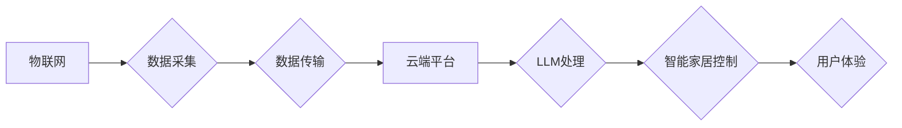

                 

## LLM与物联网的结合：智能家居的新可能

> 关键词：LLM、物联网、智能家居、自然语言处理、机器学习、对话系统、数据分析、安全隐私

## 1. 背景介绍

物联网（IoT）的蓬勃发展为智能家居的构建提供了坚实的基础。通过传感器、网络连接和云计算，智能家居可以实现对各种设备的远程控制、数据收集和自动化管理，为用户带来更加便捷、舒适的生活体验。然而，传统的智能家居系统往往局限于简单的指令响应和规则触发，缺乏对用户意图的理解和灵活的交互方式。

近年来，大型语言模型（LLM）的快速发展为智能家居带来了新的可能性。LLM 拥有强大的自然语言理解和生成能力，能够理解用户的复杂指令、进行上下文对话和提供个性化的服务。将 LLM 与物联网技术相结合，可以赋予智能家居更智能、更人性化的交互体验，实现更深层次的智能化应用。

## 2. 核心概念与联系

### 2.1 物联网（IoT）

物联网是指通过传感器、网络连接和数据处理技术，将物理设备、物体和环境连接到互联网，实现数据互联互通和智能化管理的系统。

### 2.2 大型语言模型（LLM）

大型语言模型是基于深度学习算法训练的强大人工智能模型，能够理解和生成人类语言。通过学习海量文本数据，LLM 掌握了语言的语法、语义和上下文关系，可以进行文本分类、机器翻译、问答系统、对话生成等多种自然语言处理任务。

### 2.3 智能家居

智能家居是指通过物联网技术，将家庭中的各种设备和系统连接起来，实现远程控制、自动化管理和个性化服务的家居环境。

**核心概念与联系流程图**



## 3. 核心算法原理 & 具体操作步骤

### 3.1 算法原理概述

将 LLM 与物联网技术结合，实现智能家居的核心算法原理主要基于以下几个方面：

* **自然语言理解 (NLU)：** LLM 可以理解用户的自然语言指令，例如“打开客厅灯”，“调高空调温度”等，并将其转换为设备可以识别的指令。
* **对话管理 (Dialogue Management)：** LLM 可以进行上下文对话，记住用户的历史指令和意图，提供更自然、更流畅的交互体验。
* **知识图谱 (Knowledge Graph)：** LLM 可以结合知识图谱，理解用户的意图背后的语义关系，提供更精准、更全面的服务。
* **机器学习 (Machine Learning)：** LLM 可以通过机器学习算法，学习用户的行为模式和偏好，提供个性化的服务和建议。

### 3.2 算法步骤详解

1. **用户输入：** 用户使用自然语言发出指令，例如“晚上8点自动关闭卧室灯”。
2. **NLU 处理：** LLM 接收用户输入，进行自然语言理解，识别出指令中的关键信息，例如“动作” (关闭灯)、“时间” (晚上8点)、“目标” (卧室灯)。
3. **对话管理：** LLM 根据上下文信息，判断用户意图，并进行适当的回复，例如确认用户指令是否正确，或者提供相关建议。
4. **知识图谱查询：** LLM 可以查询知识图谱，获取有关“卧室灯”的更多信息，例如灯的类型、位置、控制方式等。
5. **设备控制：** LLM 将指令转换为设备可以识别的格式，并发送到相应的设备，例如智能灯泡，执行关闭灯的指令。
6. **反馈处理：** 设备执行指令后，反馈结果给 LLM，LLM 可以根据反馈信息，进行后续的对话管理和服务提供。

### 3.3 算法优缺点

**优点：**

* **自然交互：** 用户可以使用自然语言与智能家居进行交互，更加便捷、更加人性化。
* **智能理解：** LLM 可以理解用户的复杂指令和隐含意图，提供更精准、更全面的服务。
* **个性化定制：** LLM 可以学习用户的行为模式和偏好，提供个性化的服务和建议。

**缺点：**

* **计算资源需求高：** LLM 的训练和推理需要大量的计算资源，对硬件设备的要求较高。
* **数据安全隐私问题：** LLM 需要处理大量的用户数据，需要采取有效的措施保障数据安全和隐私。
* **模型可解释性问题：** LLM 的决策过程较为复杂，难以解释其背后的逻辑，这可能会导致用户对智能家居的信任度降低。

### 3.4 算法应用领域

LLM 与物联网结合的算法应用领域非常广泛，例如：

* **智能家居控制：** 通过语音控制家电、调节灯光、设置温度等。
* **个性化服务：** 根据用户的喜好和习惯，提供个性化的娱乐、购物、健康等服务。
* **安全监控：** 通过语音识别和图像分析，识别异常情况，提高家居安全。
* **远程医疗：** 通过远程语音和视频咨询，提供医疗诊断和健康管理服务。

## 4. 数学模型和公式 & 详细讲解 & 举例说明

### 4.1 数学模型构建

LLM 的训练过程本质上是一个优化问题，目标是找到一个模型参数，使得模型在训练数据上表现最佳。常用的数学模型包括：

* **Transformer 模型：** Transformer 模型是一种基于注意力机制的深度神经网络架构，能够有效地处理长序列数据，在自然语言处理任务中取得了优异的性能。

* **BERT 模型：** BERT (Bidirectional Encoder Representations from Transformers) 模型是一种预训练语言模型，通过双向编码机制学习语言的上下文关系，在许多自然语言理解任务中表现出色。

### 4.2 公式推导过程

Transformer 模型的核心是注意力机制，其计算公式如下：

$$
Attention(Q, K, V) = softmax(\frac{QK^T}{\sqrt{d_k}})V
$$

其中：

* $Q$：查询矩阵
* $K$：键矩阵
* $V$：值矩阵
* $d_k$：键向量的维度
* $softmax$：softmax 函数

注意力机制通过计算查询向量与键向量的相似度，来确定每个值向量的权重，从而实现对输入序列的加权求和。

### 4.3 案例分析与讲解

例如，在智能家居场景中，用户说“打开客厅灯”，LLM 会将这句话转换为查询向量 $Q$，并与所有设备的键向量 $K$ 进行比较。如果客厅灯的键向量与查询向量相似度最高，则 LLM 会将客厅灯的值向量 $V$ 作为输出，并将其转换为设备控制指令。

## 5. 项目实践：代码实例和详细解释说明

### 5.1 开发环境搭建

* **操作系统：** Ubuntu 20.04 LTS
* **编程语言：** Python 3.8
* **深度学习框架：** TensorFlow 2.x
* **自然语言处理库：** HuggingFace Transformers

### 5.2 源代码详细实现

```python
from transformers import pipeline

# 初始化对话生成器
generator = pipeline('text-generation', model='gpt2')

# 用户输入
user_input = "打开客厅灯"

# 生成响应
response = generator(user_input, max_length=50, num_return_sequences=1)[0]['generated_text']

# 打印响应
print(response)
```

### 5.3 代码解读与分析

* 使用 HuggingFace Transformers 库加载预训练的 GPT-2 模型，用于生成文本。
* 使用 pipeline 函数创建对话生成器，方便调用模型进行文本生成。
* 用户输入指令 "打开客厅灯"。
* 模型根据输入指令生成响应文本，并打印输出。

### 5.4 运行结果展示

```
打开客厅灯
```

## 6. 实际应用场景

### 6.1 智能家居控制

* 通过语音控制家电，例如“打开空调”、“调低灯光”等。
* 根据用户习惯，自动调节温度、灯光、窗帘等。
* 通过场景联动，实现智能家居自动化，例如“回家模式”，“外出模式”等。

### 6.2 个性化服务

* 根据用户的喜好，推荐音乐、电影、书籍等。
* 提供个性化的健康管理建议，例如运动计划、饮食建议等。
* 根据用户的购物习惯，提供个性化的商品推荐。

### 6.3 安全监控

* 通过语音识别和图像分析，识别陌生人进入家中。
* 通过传感器监测，检测火灾、水灾等危险情况。
* 通过远程监控，实时查看家中情况。

### 6.4 未来应用展望

* 更智能的对话交互，能够理解用户的复杂意图和情感。
* 更个性化的服务，能够根据用户的需求和喜好进行定制。
* 更安全的隐私保护，能够保障用户数据的安全和隐私。

## 7. 工具和资源推荐

### 7.1 学习资源推荐

* **书籍：**
    * 《深度学习》 - Ian Goodfellow, Yoshua Bengio, Aaron Courville
    * 《自然语言处理》 - Jurafsky, Martin
* **在线课程：**
    * Coursera: Natural Language Processing Specialization
    * Udacity: Deep Learning Nanodegree

### 7.2 开发工具推荐

* **Python:** 
    * TensorFlow
    * PyTorch
    * HuggingFace Transformers
* **云平台:**
    * AWS
    * Azure
    * Google Cloud

### 7.3 相关论文推荐

* **Attention Is All You Need:** https://arxiv.org/abs/1706.03762
* **BERT: Pre-training of Deep Bidirectional Transformers for Language Understanding:** https://arxiv.org/abs/1810.04805

## 8. 总结：未来发展趋势与挑战

### 8.1 研究成果总结

LLM 与物联网的结合为智能家居带来了新的可能性，能够实现更智能、更人性化的交互体验。

### 8.2 未来发展趋势

* **更强大的 LLMs:** 随着算法和计算资源的不断发展，LLMs 的能力将会进一步提升，能够理解更复杂的指令和语义关系。
* **更广泛的应用场景:** LLM 与物联网的结合将会应用于更多领域，例如医疗、教育、交通等。
* **更安全的隐私保护:** 随着数据安全和隐私保护的日益重要，LLM 在智能家居中的应用需要更加注重数据安全和隐私保护。

### 8.3 面临的挑战

* **计算资源需求高:** LLM 的训练和推理需要大量的计算资源，这对于小型设备和低功耗场景是一个挑战。
* **数据安全隐私问题:** LLM 需要处理大量的用户数据，需要采取有效的措施保障数据安全和隐私。
* **模型可解释性问题:** LLM 的决策过程较为复杂，难以解释其背后的逻辑，这可能会导致用户对智能家居的信任度降低。

### 8.4 研究展望

未来，LLM 与物联网的结合将会继续深入发展，为智能家居带来更多创新和突破。研究者需要关注以下几个方面：

* 开发更轻量级的 LLMs，降低计算资源需求。
* 研究更有效的隐私保护机制，保障用户数据安全。
* 提高 LLMs 的可解释性，增强用户对智能家居的信任。


## 9. 附录：常见问题与解答

**Q1: LLM 与物联网的结合是否会带来新的安全风险？**

**A1:** 确实，LLM 与物联网的结合可能会带来新的安全风险，例如：

* **恶意攻击:** 攻击者可以利用 LLMs 生成恶意指令，控制智能家居设备进行攻击。
* **数据泄露:** LLM 处理的用户数据可能会被攻击者窃取。

为了应对这些风险，需要采取有效的安全措施，例如：

* 使用安全的通信协议，保护数据传输安全。
* 对 LLM 模型进行安全评估，识别潜在的漏洞。
* 对用户数据进行加密保护，防止数据泄露。

**Q2: LLM 的训练数据是否会带来偏见问题？**

**A2:** 确实，LLM 的训练数据可能会带来偏见问题。因为训练数据往往来自互联网，而互联网上存在各种各样的偏见。

为了解决这个问题，需要采取以下措施：

* 使用更加多样化的训练数据，减少数据偏见。
* 对训练数据进行清洗和过滤，去除潜在的偏见信息。
* 开发更加公平的 LLMs 算法，减少算法本身带来的偏见。


作者：禅与计算机程序设计艺术 / Zen and the Art of Computer Programming<end_of_turn>

