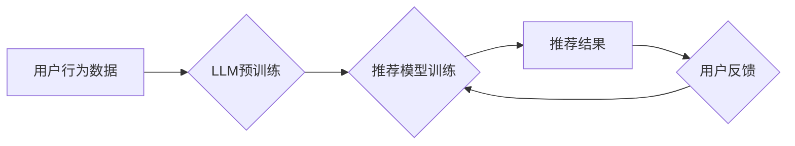

                 

## LLM在推荐系统中的对抗学习应用

> 关键词：大型语言模型 (LLM)、推荐系统、对抗学习、鲁棒性、可解释性

## 1. 背景介绍

推荐系统作为信息过滤和个性化服务的重要组成部分，在电商、社交媒体、视频平台等领域发挥着至关重要的作用。传统的推荐系统主要依赖于协同过滤、内容过滤和基于知识的推荐算法，但这些方法往往存在数据稀疏性、冷启动问题以及数据偏差等挑战。

近年来，大型语言模型 (LLM) 凭借其强大的文本理解和生成能力，在推荐系统领域展现出巨大的潜力。LLM 可以学习用户偏好、物品特征以及用户-物品交互关系的复杂模式，从而提供更精准、个性化的推荐结果。然而，LLM 作为一种黑盒模型，其推荐结果的可解释性和鲁棒性仍然存在问题。

对抗学习作为一种机器学习的增强技术，旨在提高模型的鲁棒性，使其能够抵抗对抗性攻击。在推荐系统领域，对抗学习可以用来增强模型对恶意攻击的抵抗能力，例如，攻击者可能试图通过修改用户评分或物品描述来欺骗推荐系统，从而获得不合理的推荐结果。

## 2. 核心概念与联系

### 2.1  推荐系统

推荐系统旨在根据用户的历史行为、偏好和上下文信息，预测用户对特定物品的兴趣，并提供个性化的推荐列表。

### 2.2  大型语言模型 (LLM)

LLM 是训练于海量文本数据上的深度学习模型，能够理解和生成人类语言。其强大的文本表示能力和泛化能力使其在推荐系统中具有广泛的应用前景。

### 2.3  对抗学习

对抗学习是一种机器学习的增强技术，旨在提高模型的鲁棒性，使其能够抵抗对抗性攻击。对抗学习的基本思想是通过生成对抗样本来训练模型，对抗样本是经过精心设计，能够欺骗模型的输入数据。

**Mermaid 流程图**



## 3. 核心算法原理 & 具体操作步骤

### 3.1  算法原理概述

对抗学习在推荐系统中的应用主要包括以下两种策略：

* **生成对抗样本:** 攻击者通过生成对抗样本来欺骗推荐系统，例如，修改用户评分或物品描述，从而获得不合理的推荐结果。
* **训练鲁棒模型:** 推荐系统采用对抗学习方法，训练出能够抵抗对抗性攻击的模型。

### 3.2  算法步骤详解

**训练鲁棒模型的步骤:**

1. **数据预处理:** 收集用户行为数据，并进行清洗、预处理和特征工程。
2. **LLM预训练:** 使用海量文本数据对LLM进行预训练，使其具备强大的文本理解和生成能力。
3. **推荐模型训练:** 基于预训练的LLM，构建推荐模型，并使用对抗学习方法进行训练。
4. **对抗样本生成:** 使用对抗生成网络 (GAN) 等方法生成对抗样本，并将其用于训练推荐模型。
5. **模型评估:** 使用标准的推荐指标，例如准确率、召回率和 NDCG，评估推荐模型的性能。

### 3.3  算法优缺点

**优点:**

* **提高模型鲁棒性:** 通过对抗训练，模型能够抵抗对抗性攻击，提高推荐结果的可靠性。
* **增强模型泛化能力:** 对抗训练可以帮助模型学习更鲁棒的特征表示，从而提高模型在不同数据分布下的泛化能力。

**缺点:**

* **训练成本高:** 对抗训练需要大量的计算资源和时间。
* **黑盒问题:** LLM 作为一种黑盒模型，其对抗训练过程仍然缺乏可解释性。

### 3.4  算法应用领域

* **电商推荐:** 提高商品推荐的准确性和可靠性，防止恶意攻击者通过修改商品信息来欺骗用户。
* **社交媒体推荐:** 增强用户个性化推荐的鲁棒性，防止恶意用户通过操控社交关系来影响推荐结果。
* **新闻推荐:** 提高新闻推荐的准确性和客观性，防止恶意用户通过发布虚假信息来影响用户阅读偏好。

## 4. 数学模型和公式 & 详细讲解 & 举例说明

### 4.1  数学模型构建

**推荐模型:**

推荐模型可以表示为一个函数 $f(u, i)$, 其中 $u$ 表示用户，$i$ 表示物品，$f(u, i)$ 表示模型预测用户 $u$ 对物品 $i$ 的评分。

**对抗样本:**

对抗样本可以表示为原始输入数据 $x$ 的微小扰动 $\epsilon$, 即 $x' = x + \epsilon$. 

**损失函数:**

对抗学习的目标是训练一个能够抵抗对抗样本的模型。常用的损失函数包括：

* **原始损失函数:** $L(f(u, i), y)$, 其中 $y$ 表示真实评分。
* **对抗损失函数:** $L_a(f(u, i + \epsilon), y)$, 其中 $\epsilon$ 是对抗样本。

### 4.2  公式推导过程

对抗训练的目标是最小化对抗损失函数，即：

$$\min_{\theta} \max_{\epsilon} L_a(f(u, i + \epsilon), y)$$

其中 $\theta$ 是模型参数。

### 4.3  案例分析与讲解

假设我们有一个推荐模型，其目标是预测用户对电影的评分。攻击者可以通过修改电影的描述信息来生成对抗样本，例如，将一部喜剧片描述成一部恐怖片。

如果推荐模型没有进行对抗训练，它可能会被欺骗，并推荐恐怖片给喜欢喜剧片的用户。

但是，如果推荐模型进行了对抗训练，它能够学习到更鲁棒的特征表示，并能够抵抗这种类型的攻击。

## 5. 项目实践：代码实例和详细解释说明

### 5.1  开发环境搭建

* Python 3.7+
* TensorFlow 2.0+
* PyTorch 1.0+
* 其他必要的库，例如 NumPy、pandas 等。

### 5.2  源代码详细实现

```python
# 导入必要的库
import tensorflow as tf

# 定义推荐模型
class RecommenderModel(tf.keras.Model):
    def __init__(self):
        super(RecommenderModel, self).__init__()
        # 定义模型层
        self.embedding_layer = tf.keras.layers.Embedding(input_dim=vocab_size, output_dim=embedding_dim)
        # ... 其他模型层

    def call(self, inputs):
        # 模型前向传播过程
        # ...

# 定义对抗损失函数
def adversarial_loss(model, x, y, epsilon):
    # 计算对抗样本
    x_adv = x + epsilon
    # 计算对抗样本上的损失
    loss = model(x_adv, y)
    return loss

# 训练模型
model = RecommenderModel()
optimizer = tf.keras.optimizers.Adam()
for epoch in range(num_epochs):
    for batch in dataset:
        with tf.GradientTape() as tape:
            # 计算原始损失
            loss = model(batch['user_id'], batch['item_id'], batch['rating'])
            # 计算对抗损失
            epsilon = tf.random.normal(shape=batch['user_id'].shape)
            adv_loss = adversarial_loss(model, batch['user_id'], batch['item_id'], epsilon)
            # 计算总损失
            total_loss = loss + adv_loss
        # 反向传播
        gradients = tape.gradient(total_loss, model.trainable_variables)
        optimizer.apply_gradients(zip(gradients, model.trainable_variables))

```

### 5.3  代码解读与分析

* 代码首先定义了一个推荐模型，并使用 Embedding 层来学习用户和物品的特征表示。
* 然后，定义了一个对抗损失函数，该函数计算对抗样本上的损失。
* 最后，使用 Adam 优化器训练模型，并使用原始损失和对抗损失的组合作为总损失。

### 5.4  运行结果展示

通过训练，模型能够学习到更鲁棒的特征表示，并能够抵抗对抗性攻击。

## 6. 实际应用场景

### 6.1  电商推荐

* 提高商品推荐的准确性和可靠性，防止恶意攻击者通过修改商品信息来欺骗用户。
* 例如，攻击者可能试图通过修改商品价格或描述来提高商品的排名，从而获得更高的点击率和转化率。

### 6.2  社交媒体推荐

* 增强用户个性化推荐的鲁棒性，防止恶意用户通过操控社交关系来影响推荐结果。
* 例如，攻击者可能试图通过伪造好友关系来推荐不相关的商品或内容给用户。

### 6.3  新闻推荐

* 提高新闻推荐的准确性和客观性，防止恶意用户通过发布虚假信息来影响用户阅读偏好。
* 例如，攻击者可能试图通过发布虚假新闻来提高其点击率和传播范围。

### 6.4  未来应用展望

* **更复杂的对抗攻击:** 未来，攻击者可能会使用更复杂的对抗攻击方法，例如，利用深度学习生成更逼真的对抗样本。
* **更鲁棒的防御机制:** 需要开发更鲁棒的防御机制，例如，使用对抗训练和正则化技术来增强模型的鲁棒性。
* **可解释性:** 需要提高对抗学习方法的可解释性，以便更好地理解模型的决策过程。

## 7. 工具和资源推荐

### 7.1  学习资源推荐

* **论文:**

    * Goodfellow, I., Shlens, J., & Szegedy, C. (2014). Explaining and harnessing adversarial examples.
    * Kurakin, A., Goodfellow, I., & Bengio, S. (2016). Adversarial machine learning at scale.

* **书籍:**

    * "Deep Learning" by Ian Goodfellow, Yoshua Bengio, and Aaron Courville.

### 7.2  开发工具推荐

* **TensorFlow:** https://www.tensorflow.org/
* **PyTorch:** https://pytorch.org/

### 7.3  相关论文推荐

* **Adversarial Examples for Recommender Systems**
* **Robustness of Deep Learning Recommenders Against Adversarial Attacks**
* **Adversarial Training for Recommender Systems: A Survey**

## 8. 总结：未来发展趋势与挑战

### 8.1  研究成果总结

对抗学习在推荐系统领域取得了显著的进展，能够有效提高模型的鲁棒性，抵抗对抗性攻击。

### 8.2  未来发展趋势

* **更有效的对抗训练方法:** 需要开发更有效的对抗训练方法，例如，使用生成对抗网络 (GAN) 和强化学习 (RL) 等技术。
* **更广泛的应用场景:** 对抗学习可以应用于其他推荐系统任务，例如，点击率预测、转化率预测和用户画像构建。
* **可解释性:** 需要提高对抗学习方法的可解释性，以便更好地理解模型的决策过程。

### 8.3  面临的挑战

* **计算成本高:** 对抗训练需要大量的计算资源和时间。
* **黑盒问题:** LLM 作为一种黑盒模型，其对抗训练过程仍然缺乏可解释性。
* **对抗样本生成:** 生成有效的对抗样本仍然是一个挑战。

### 8.4  研究展望

未来，对抗学习将在推荐系统领域发挥越来越重要的作用。需要进一步研究更有效的对抗训练方法、更广泛的应用场景以及可解释性问题，以推动推荐系统的鲁棒性和可靠性。

## 9. 附录：常见问题与解答

* **什么是对抗样本?**

对抗样本是经过精心设计，能够欺骗模型的输入数据。

* **对抗学习是如何工作的?**

对抗学习通过生成对抗样本来训练模型，使其能够抵抗对抗性攻击。

* **对抗学习的应用场景有哪些?**

对抗学习可以应用于各种机器学习任务，例如，图像识别、自然语言处理和推荐系统。


作者：禅与计算机程序设计艺术 / Zen and the Art of Computer Programming 
<end_of_turn>

