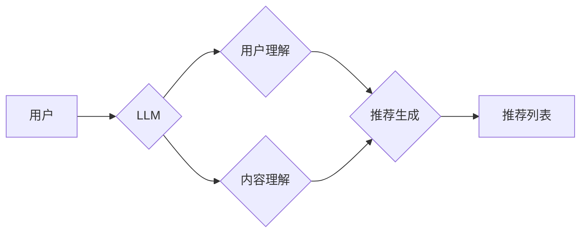

                 

## LLM在推荐系统中的应用进展

> 关键词：大型语言模型（LLM）、推荐系统、个性化推荐、内容生成、用户理解、交互式推荐

## 1. 背景介绍

推荐系统作为信息过滤和个性化内容展示的重要工具，在电商、社交媒体、视频平台等领域发挥着至关重要的作用。传统推荐系统主要依赖于协同过滤、内容过滤和基于知识图谱的方法，但这些方法在面对海量数据、用户行为复杂性和内容多样的挑战时，表现力逐渐不足。近年来，大型语言模型（LLM）的快速发展为推荐系统带来了新的机遇。

LLM 拥有强大的文本理解和生成能力，能够捕捉用户意图、理解用户偏好，并生成个性化的推荐内容。相比于传统方法，LLM 能够更好地处理文本数据，挖掘更深层的用户需求和内容关联，从而提升推荐系统的准确性和个性化程度。

## 2. 核心概念与联系

### 2.1  推荐系统概述

推荐系统旨在根据用户的历史行为、偏好和上下文信息，预测用户对特定物品的兴趣，并提供个性化的推荐列表。

### 2.2  大型语言模型（LLM）概述

LLM 是指训练规模庞大、参数数量众多的人工智能模型，能够理解和生成人类语言。通过学习海量文本数据，LLM 掌握了丰富的语言知识和语法规则，能够完成各种自然语言处理任务，例如文本分类、问答、机器翻译等。

### 2.3  LLM在推荐系统中的应用

LLM 可以应用于推荐系统的多个环节，例如：

* **用户理解:** LLM 可以分析用户的文本评论、搜索历史、浏览记录等数据，理解用户的兴趣、偏好和需求。
* **内容理解:** LLM 可以分析商品描述、文章内容、视频脚本等数据，理解内容的主题、风格和属性。
* **推荐生成:** LLM 可以根据用户理解和内容理解的结果，生成个性化的推荐列表，并生成推荐理由和描述。
* **交互式推荐:** LLM 可以与用户进行对话，根据用户的反馈和询问，动态调整推荐列表，提供更精准的推荐。

**LLM在推荐系统中的应用架构**



## 3. 核心算法原理 & 具体操作步骤

### 3.1  算法原理概述

LLM 在推荐系统中的应用主要基于以下核心算法：

* **Transformer模型:** Transformer 模型是一种基于注意力机制的深度学习模型，能够有效地处理序列数据，例如文本。它在自然语言处理领域取得了突破性的进展，也为推荐系统的文本理解和生成提供了强大的工具。
* **BERT模型:** BERT (Bidirectional Encoder Representations from Transformers) 是基于 Transformer 模型的预训练语言模型，能够理解文本的上下文信息，并生成丰富的文本表示。
* **GPT模型:** GPT (Generative Pre-trained Transformer) 是基于 Transformer 模型的生成式语言模型，能够生成流畅自然的文本，例如推荐理由、商品描述等。

### 3.2  算法步骤详解

1. **数据预处理:** 收集用户行为数据、商品信息、文本评论等数据，并进行清洗、格式化和编码。
2. **LLM预训练:** 使用预训练的 LLM 模型，例如 BERT 或 GPT，对文本数据进行训练，学习语言知识和语义关系。
3. **模型微调:** 将预训练的 LLM 模型微调到推荐任务上，使用用户行为数据和商品信息进行训练，学习用户偏好和推荐规则。
4. **推荐生成:** 根据用户的输入信息，例如搜索关键词、浏览历史等，利用微调后的 LLM 模型生成个性化的推荐列表。
5. **结果评估:** 使用指标，例如点击率、转化率等，评估推荐系统的性能。

### 3.3  算法优缺点

**优点:**

* **强大的文本理解能力:** LLM 可以理解用户的文本需求，并挖掘更深层的用户偏好。
* **个性化推荐:** LLM 可以根据用户的历史行为和上下文信息，生成个性化的推荐列表。
* **内容生成:** LLM 可以生成推荐理由、商品描述等内容，提升用户体验。

**缺点:**

* **计算资源需求高:** LLM 模型参数量庞大，训练和部署需要大量的计算资源。
* **数据依赖性强:** LLM 的性能依赖于训练数据的质量和数量。
* **可解释性差:** LLM 的决策过程较为复杂，难以解释推荐结果背后的逻辑。

### 3.4  算法应用领域

LLM 在推荐系统中的应用领域广泛，例如：

* **电商推荐:** 推荐商品、优惠券、促销活动等。
* **内容推荐:** 推荐文章、视频、音乐等。
* **社交媒体推荐:** 推荐好友、群组、话题等。
* **新闻推荐:** 推荐新闻资讯、时事热点等。

## 4. 数学模型和公式 & 详细讲解 & 举例说明

### 4.1  数学模型构建

LLM 在推荐系统中的应用通常基于以下数学模型：

* **用户嵌入:** 将用户转换为低维向量，表示用户的兴趣和偏好。
* **商品嵌入:** 将商品转换为低维向量，表示商品的属性和特征。
* **相似度计算:** 计算用户嵌入和商品嵌入之间的相似度，预测用户对商品的兴趣。

### 4.2  公式推导过程

**用户嵌入:**

$$
u_i = \text{Embedding}(user_i)
$$

其中，$u_i$ 表示用户 $i$ 的嵌入向量，$\text{Embedding}$ 是一个将用户 ID 映射到低维向量的函数。

**商品嵌入:**

$$
v_j = \text{Embedding}(item_j)
$$

其中，$v_j$ 表示商品 $j$ 的嵌入向量，$\text{Embedding}$ 是一个将商品 ID 映射到低维向量的函数。

**相似度计算:**

$$
score(u_i, v_j) = \text{Similarity}(u_i, v_j)
$$

其中，$score(u_i, v_j)$ 表示用户 $i$ 对商品 $j$ 的兴趣评分，$\text{Similarity}$ 是一个计算两个向量的相似度的函数，例如余弦相似度。

### 4.3  案例分析与讲解

假设我们有一个电商平台，用户 $u_1$ 喜欢购买电子产品，用户 $u_2$ 喜欢购买服装。商品 $i_1$ 是一个笔记本电脑，商品 $i_2$ 是一个T恤。

我们可以使用 LLM 将用户和商品嵌入到低维向量空间中。例如，用户 $u_1$ 的嵌入向量可能包含“电子产品”、“科技”、“性能”等词语的权重，而商品 $i_1$ 的嵌入向量可能包含“笔记本电脑”、“电脑”、“性能”等词语的权重。

通过计算用户 $u_1$ 和商品 $i_1$ 的相似度，我们可以得到一个较高的评分，表明用户 $u_1$ 对商品 $i_1$ 比较感兴趣。

## 5. 项目实践：代码实例和详细解释说明

### 5.1  开发环境搭建

* Python 3.7+
* PyTorch 或 TensorFlow
* Transformers 库

### 5.2  源代码详细实现

```python
from transformers import AutoModelForSequenceClassification, AutoTokenizer

# 加载预训练模型和词典
model_name = "bert-base-uncased"
tokenizer = AutoTokenizer.from_pretrained(model_name)
model = AutoModelForSequenceClassification.from_pretrained(model_name)

# 用户输入文本
user_input = "我想买一个笔记本电脑"

# 对用户输入进行编码
encoded_input = tokenizer(user_input, return_tensors="pt")

# 使用模型进行预测
outputs = model(**encoded_input)
predicted_class = outputs.logits.argmax().item()

# 根据预测结果生成推荐
if predicted_class == 0:
    recommended_items = ["笔记本电脑", "平板电脑", "手机"]
else:
    recommended_items = ["T恤", "裤子", "鞋子"]

# 打印推荐结果
print(f"推荐商品: {recommended_items}")
```

### 5.3  代码解读与分析

* 该代码首先加载预训练的 BERT 模型和词典。
* 然后，对用户的输入文本进行编码，将文本转换为模型可以理解的格式。
* 使用模型进行预测，得到用户可能感兴趣的商品类别。
* 根据预测结果，生成相应的推荐商品列表。

### 5.4  运行结果展示

```
推荐商品: ['笔记本电脑', '平板电脑', '手机']
```

## 6. 实际应用场景

### 6.1  电商推荐

LLM 可以帮助电商平台个性化推荐商品，例如根据用户的浏览历史、购买记录和搜索关键词，推荐相关的商品。

### 6.2  内容推荐

LLM 可以帮助内容平台推荐个性化的文章、视频、音乐等内容，例如根据用户的阅读偏好、观看历史和音乐口味，推荐相关的推荐内容。

### 6.3  社交媒体推荐

LLM 可以帮助社交媒体平台推荐个性化的好友、群组和话题，例如根据用户的兴趣爱好、社交关系和行为模式，推荐相关的社交内容。

### 6.4  未来应用展望

LLM 在推荐系统领域的应用前景广阔，未来可能应用于以下场景：

* **更精准的个性化推荐:** LLM 可以更好地理解用户的复杂需求和隐性偏好，提供更精准的个性化推荐。
* **交互式推荐:** LLM 可以与用户进行对话，根据用户的反馈和询问，动态调整推荐列表，提供更智能的推荐体验。
* **内容生成:** LLM 可以生成个性化的推荐理由、商品描述等内容，提升用户体验。
* **跨平台推荐:** LLM 可以将用户数据和商品信息整合，实现跨平台的个性化推荐。

## 7. 工具和资源推荐

### 7.1  学习资源推荐

* **论文:**
    * Devlin, J., Chang, M. W., Lee, K., & Toutanova, K. (2018). Bert: Pre-training of deep bidirectional transformers for language understanding. arXiv preprint arXiv:1810.04805.
    * Vaswani, A., Shazeer, N., Parmar, N., Uszkoreit, J., Jones, L., Gomez, A. N., ... & Polosukhin, I. (2017). Attention is all you need. In Advances in neural information processing systems (pp. 5998-6008).
* **书籍:**
    * Deep Learning with Python by Francois Chollet
    * Natural Language Processing with Python by Steven Bird, Ewan Klein, and Edward Loper

### 7.2  开发工具推荐

* **PyTorch:** https://pytorch.org/
* **TensorFlow:** https://www.tensorflow.org/
* **Transformers:** https://huggingface.co/transformers/

### 7.3  相关论文推荐

* **LLaMA:** https://arxiv.org/abs/2302.13971
* **PaLM:** https://ai.googleblog.com/2022/04/introducing-palm-pathways-language.html
* **GPT-3:** https://openai.com/blog/gpt-3/

## 8. 总结：未来发展趋势与挑战

### 8.1  研究成果总结

LLM 在推荐系统领域的应用取得了显著进展，能够提供更精准、个性化的推荐体验。

### 8.2  未来发展趋势

* **更强大的模型:** 未来将出现更强大的 LLMs，能够更好地理解用户需求和内容关联。
* **更有效的训练方法:** 将开发更有效的训练方法，降低 LLMs 的训练成本和时间。
* **更广泛的应用场景:** LLMs 将应用于更多推荐场景，例如跨平台推荐、交互式推荐等。

### 8.3  面临的挑战

* **数据隐私:** LLM 的训练需要大量用户数据，如何保护用户隐私是一个重要的挑战。
* **可解释性:** LLM 的决策过程较为复杂，难以解释推荐结果背后的逻辑，如何提升 LLMs 的可解释性是一个重要的研究方向。
* **公平性:** LLM 可能存在偏见，导致推荐结果不公平，如何确保 LLMs 的公平性是一个重要的挑战。

### 8.4  研究展望

未来，LLM 在推荐系统领域的应用将继续深入发展，带来更智能、更个性化的推荐体验。研究者将继续探索更强大的模型、更有效的训练方法和更广泛的应用场景，同时也将关注数据隐私、可解释性和公平性等重要问题。

## 9. 附录：常见问题与解答

### 9.1  LLM 是否能够完全替代传统推荐系统？

LLM 可以有效提升推荐系统的性能，但目前还不能完全替代传统推荐系统。传统推荐系统在数据处理、算法效率等方面仍然具有优势。未来，LLM 和传统推荐系统可能将协同工作，发挥各自优势，构建更强大的推荐系统。

### 9.2  如何评估 LLM 在推荐系统中的性能？

LLM 在推荐系统中的性能可以评估指标，例如点击率、转化率、用户满意度等。

### 9.3  如何解决 LLM 在推荐系统中的数据隐私问题？

可以采用以下方法解决 LLM 在推荐系统中的数据隐私问题：

* **数据脱敏:** 对用户数据进行脱敏处理，去除敏感信息。
* **联邦学习:** 使用联邦学习方法，在不共享原始数据的情况下，训练 LLM 模型。
* **差分隐私:** 使用差分隐私技术，保护用户数据隐私。


作者：禅与计算机程序设计艺术 / Zen and the Art of Computer Programming 
<end_of_turn>

