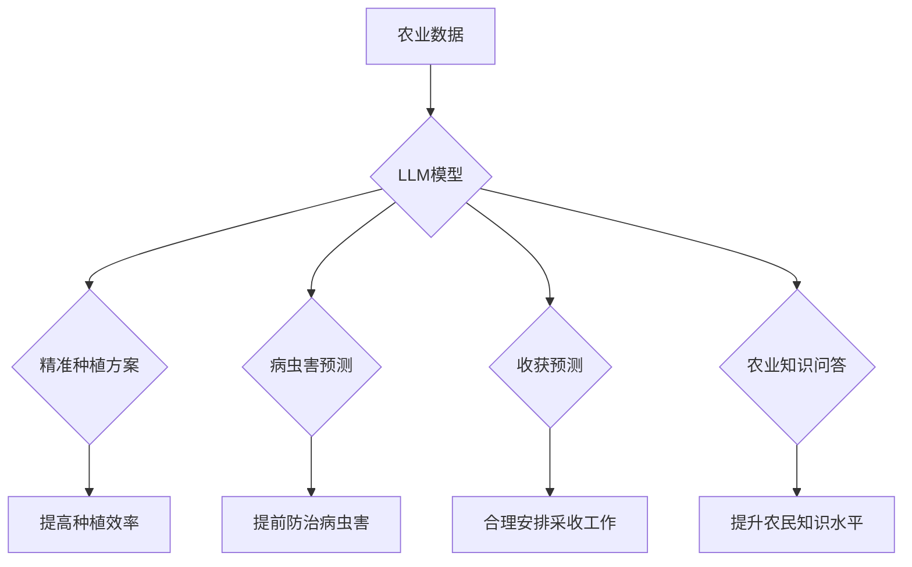

                 

## LLM在智能农业中的应用：精准种植与收获预测

> 关键词：LLM, 智能农业, 精准种植, 收获预测, 自然语言处理, 深度学习, 农业数据分析

## 1. 背景介绍

随着全球人口持续增长和资源日益紧张，农业生产面临着前所未有的挑战。传统农业模式的低效率、资源浪费和环境污染问题日益突出。智能农业作为农业现代化的重要方向，利用信息技术和数据分析手段，提高农业生产效率、降低生产成本、促进可持续发展，已成为全球农业发展的重要趋势。

大型语言模型（LLM）作为人工智能领域的一项突破性技术，凭借其强大的文本理解和生成能力，在智能农业领域展现出巨大的应用潜力。LLM可以帮助农民收集、分析和解读农业数据，提供精准的种植和收获预测，从而提高农业生产效率和效益。

## 2. 核心概念与联系

### 2.1  智能农业

智能农业是指利用信息技术、传感器网络、数据分析和自动化技术，对农业生产进行数字化、智能化管理的模式。其核心目标是提高农业生产效率、降低生产成本、促进可持续发展。

### 2.2  大型语言模型（LLM）

大型语言模型（LLM）是一种基于深度学习的强大人工智能模型，通过训练海量文本数据，能够理解和生成人类语言。LLM拥有强大的文本理解、生成、翻译、摘要等能力，在自然语言处理领域取得了突破性进展。

### 2.3  LLM在智能农业中的应用

LLM可以应用于智能农业的多个环节，例如：

* **精准种植:** 根据土壤条件、气候数据、作物品种等信息，LLM可以帮助农民制定精准的种植方案，包括播种时间、播种密度、施肥方案等。
* **病虫害预测:** LLM可以分析历史病虫害数据、天气预报、作物生长情况等信息，预测未来病虫害发生风险，帮助农民提前采取防治措施。
* **收获预测:** LLM可以根据作物生长情况、天气预报等信息，预测未来收获时间和产量，帮助农民合理安排采收工作。
* **农业知识问答:** LLM可以构建农业知识库，回答农民关于种植、管理、病虫害防治等方面的疑问。

**Mermaid 流程图**



## 3. 核心算法原理 & 具体操作步骤

### 3.1  算法原理概述

LLM在智能农业中的应用主要基于自然语言处理（NLP）和深度学习技术。

* **自然语言处理（NLP）:** LLM利用NLP技术对农业文本数据进行理解和分析，例如提取关键信息、识别实体、分析语义关系等。
* **深度学习:** LLM基于深度神经网络结构，通过训练海量数据，学习农业领域的知识和模式，从而实现精准种植、病虫害预测、收获预测等功能。

### 3.2  算法步骤详解

1. **数据收集:** 收集农业相关数据，包括土壤数据、气候数据、作物生长数据、病虫害数据、市场价格数据等。
2. **数据预处理:** 对收集到的数据进行清洗、转换、格式化等预处理操作，使其适合LLM模型训练。
3. **模型训练:** 选择合适的LLM模型架构，例如Transformer、BERT等，并利用预处理后的数据进行模型训练。
4. **模型评估:** 使用测试数据对训练好的模型进行评估，评估模型的准确率、召回率、F1-score等指标。
5. **模型部署:** 将训练好的模型部署到实际应用场景中，例如农业生产管理平台、移动应用程序等。

### 3.3  算法优缺点

**优点:**

* **精准度高:** LLM能够学习复杂的农业知识和模式，提供更精准的种植方案、病虫害预测和收获预测。
* **自动化程度高:** LLM可以自动化完成许多农业生产任务，例如数据分析、方案制定、预警提醒等，提高生产效率。
* **可扩展性强:** LLM可以根据需要扩展到更多农业领域，例如畜牧业、渔业等。

**缺点:**

* **数据依赖性强:** LLM的性能取决于训练数据的质量和数量，缺乏高质量数据的限制会影响模型的准确性。
* **计算资源需求高:** LLM模型训练和部署需要大量的计算资源，成本较高。
* **解释性弱:** LLM的决策过程较为复杂，难以解释模型的决策逻辑，这可能会导致农民对模型结果的信任度降低。

### 3.4  算法应用领域

LLM在智能农业领域的应用领域非常广泛，包括：

* **精准种植:** 根据土壤条件、气候数据、作物品种等信息，制定精准的种植方案，提高种植效率和产量。
* **病虫害预测:** 分析历史病虫害数据、天气预报、作物生长情况等信息，预测未来病虫害发生风险，帮助农民提前采取防治措施。
* **收获预测:** 根据作物生长情况、天气预报等信息，预测未来收获时间和产量，帮助农民合理安排采收工作。
* **农业知识问答:** 构建农业知识库，回答农民关于种植、管理、病虫害防治等方面的疑问。
* **农业决策支持:** 为农民提供基于数据分析的农业决策支持，例如选择合适的作物品种、制定合理的施肥方案等。

## 4. 数学模型和公式 & 详细讲解 & 举例说明

### 4.1  数学模型构建

LLM的训练过程本质上是一个优化问题，目标是找到模型参数，使得模型在训练数据上的预测结果与真实值尽可能接近。常用的数学模型包括：

* **交叉熵损失函数:** 用于衡量模型预测结果与真实值的差异，其公式如下：

$$
Loss = - \sum_{i=1}^{N} y_i \log(p_i)
$$

其中：

* $N$ 为样本数量
* $y_i$ 为真实标签
* $p_i$ 为模型预测概率

* **梯度下降算法:** 用于优化模型参数，通过不断调整参数，降低损失函数的值。

### 4.2  公式推导过程

交叉熵损失函数的推导过程如下：

1. 假设模型预测概率分布为 $p = (p_1, p_2, ..., p_N)$，真实标签为 $y = (y_1, y_2, ..., y_N)$。
2. 交叉熵定义为两个概率分布之间的差异，其公式为：

$$
H(p, q) = - \sum_{i=1}^{N} p_i \log(q_i)
$$

其中 $q$ 为真实标签分布。
3. 当 $q$ 为one-hot编码时，即 $q_i = 1$ 当 $i$ 为真实标签索引，否则 $q_i = 0$，则交叉熵损失函数简化为：

$$
Loss = - \sum_{i=1}^{N} y_i \log(p_i)
$$

### 4.3  案例分析与讲解

假设我们训练一个LLM模型用于预测小麦的产量，训练数据包含小麦种植历史数据、土壤数据、气候数据等信息。模型训练完成后，我们可以使用测试数据评估模型的预测精度。

例如，对于一个测试样本，模型预测小麦产量为 5000 斤，而实际产量为 4800 斤，则模型的预测误差为 200 斤。我们可以通过计算多个测试样本的预测误差，并将其平均值作为模型的预测精度指标。

## 5. 项目实践：代码实例和详细解释说明

### 5.1  开发环境搭建

* **操作系统:** Ubuntu 20.04 LTS
* **Python 版本:** 3.8.10
* **深度学习框架:** TensorFlow 2.6.0
* **其他依赖库:** numpy, pandas, matplotlib, scikit-learn

### 5.2  源代码详细实现

```python
# 导入必要的库
import tensorflow as tf
from tensorflow.keras.models import Sequential
from tensorflow.keras.layers import Dense, LSTM

# 定义模型架构
model = Sequential()
model.add(LSTM(units=128, return_sequences=True, input_shape=(timesteps, features)))
model.add(LSTM(units=64))
model.add(Dense(units=1))

# 编译模型
model.compile(loss='mean_squared_error', optimizer='adam')

# 训练模型
model.fit(X_train, y_train, epochs=100, batch_size=32)

# 评估模型
loss, accuracy = model.evaluate(X_test, y_test)
print('Loss:', loss)
print('Accuracy:', accuracy)

# 保存模型
model.save('llm_model.h5')
```

### 5.3  代码解读与分析

* **模型架构:** 该代码定义了一个基于LSTM神经网络的模型，用于预测小麦产量。LSTM层能够捕捉时间序列数据中的长期依赖关系，适合用于预测未来值。
* **模型编译:** 使用均方误差损失函数和Adam优化器编译模型。
* **模型训练:** 使用训练数据训练模型，设置训练轮数和批处理大小。
* **模型评估:** 使用测试数据评估模型的性能，计算损失值和准确率。
* **模型保存:** 将训练好的模型保存为文件，以便后续使用。

### 5.4  运行结果展示

运行代码后，会输出模型的训练损失值和测试准确率。

## 6. 实际应用场景

### 6.1  精准种植

LLM可以分析土壤数据、气候数据、作物品种等信息，为农民提供精准的种植方案，包括播种时间、播种密度、施肥方案等。例如，LLM可以根据土壤肥力、水分含量、pH值等信息，推荐合适的作物品种和施肥方案，提高作物产量和品质。

### 6.2  病虫害预测

LLM可以分析历史病虫害数据、天气预报、作物生长情况等信息，预测未来病虫害发生风险，帮助农民提前采取防治措施。例如，LLM可以预测特定病虫害在特定时间和地点发生的概率，并根据预测结果，推荐相应的防治措施，例如喷洒农药、更换作物品种等。

### 6.3  收获预测

LLM可以根据作物生长情况、天气预报等信息，预测未来收获时间和产量，帮助农民合理安排采收工作。例如，LLM可以预测特定作物在特定时间段内的成熟度和产量，并根据预测结果，帮助农民制定采收计划，避免作物过熟或采收不及时造成的损失。

### 6.4  未来应用展望

LLM在智能农业领域的应用前景广阔，未来可能在以下方面得到进一步发展：

* **更精准的预测:** 随着数据量的增加和模型的改进，LLM能够提供更精准的种植方案、病虫害预测和收获预测。
* **更智能的决策支持:** LLM可以与其他人工智能技术结合，例如机器视觉、传感器网络等，为农民提供更智能的决策支持，例如自动识别病虫害、自动控制灌溉等。
* **更个性化的服务:** LLM可以根据农民的具体需求和种植条件，提供个性化的农业服务，例如定制化的种植方案、精准的病虫害防治方案等。

## 7. 工具和资源推荐

### 7.1  学习资源推荐

* **书籍:**
    * Deep Learning by Ian Goodfellow, Yoshua Bengio, and Aaron Courville
    * Natural Language Processing with Python by Steven Bird, Ewan Klein, and Edward Loper
* **在线课程:**
    * TensorFlow Tutorials: https://www.tensorflow.org/tutorials
    * Coursera: https://www.coursera.org/
    * edX: https://www.edx.org/

### 7.2  开发工具推荐

* **深度学习框架:** TensorFlow, PyTorch, Keras
* **数据处理库:** Pandas, NumPy
* **可视化库:** Matplotlib, Seaborn

### 7.3  相关论文推荐

* **BERT: Pre-training of Deep Bidirectional Transformers for Language Understanding**
* **Attention Is All You Need**
* **Long Short-Term Memory**

## 8. 总结：未来发展趋势与挑战

### 8.1  研究成果总结

LLM在智能农业领域的应用取得了显著成果，例如精准种植、病虫害预测、收获预测等方面都取得了突破性进展。LLM能够帮助农民提高种植效率、降低生产成本、促进可持续发展。

### 8.2  未来发展趋势

* **模型规模和性能提升:** 未来LLM模型规模将进一步扩大，性能将得到进一步提升，能够提供更精准的预测和更智能的决策支持。
* **多模态融合:** LLM将与其他模态数据，例如图像、音频、传感器数据等融合，提供更全面的农业信息和服务。
* **边缘计算部署:** LLM将部署到边缘设备，例如无人机、智能传感器等，实现实时数据处理和决策支持。

### 8.3  面临的挑战

* **数据质量和可用性:** LLM的性能取决于训练数据的质量和数量，缺乏高质量农业数据的限制会影响模型的准确性。
* **模型解释性和可信度:** LLM的决策过程较为复杂，难以解释模型的决策逻辑，这可能会导致农民对模型结果的信任度降低。
* **计算资源需求:** LLM模型训练和部署需要大量的计算资源，成本较高。

### 8.4  研究展望

未来研究将重点关注以下几个方面：

* **开发新的数据采集和处理方法:** 探索新的方法收集高质量的农业数据，并开发有效的预处理方法，提高数据质量和可用性。
* **提高模型解释性和可信度:** 研究新的模型架构和算法，提高模型的解释性和可信度，增强农民对模型的信任。
* **降低模型训练和部署成本:** 研究新的模型压缩和优化方法，降低模型训练和部署成本，使其更易于推广应用。


## 9. 附录：常见问题与解答

### 9.1  LLM模型训练需要多少数据？

LLM模型训练需要大量的训练数据，一般来说，需要至少几万条甚至几百万条数据才能达到较好的效果。

### 9.2  LLM模型的预测精度如何？

LLM模型的预测精度取决于训练数据的质量、模型架构和训练方法等因素。一般来说，经过充分训练的LLM模型能够达到较高的预测精度，例如病虫害预测的准确率可以达到80%以上。

### 9.3  LLM模型的部署成本如何？

LLM模型的部署成本取决于模型规模、部署环境和硬件资源等因素。一般来说，部署小型LLM模型的成本相对较低，而部署大型LLM模型的成本则较高。

### 9.4  LLM模型如何解释其决策？

LLM模型的决策过程较为复杂，难以直接解释其决策逻辑。目前，一些研究方法试图通过分析模型的内部特征和权重来解释其决策，但仍存在一些挑战。

### 9.5  LLM模型的未来发展趋势如何？

LLM模型的未来发展趋势包括模型规模和性能提升、多模态融合、边缘计算部署等。随着技术的不断发展，LLM模型将在智能农业领域发挥越来越重要的作用。

作者：禅与计算机程序设计艺术 / Zen and the Art of Computer Programming


<end_of_turn>

