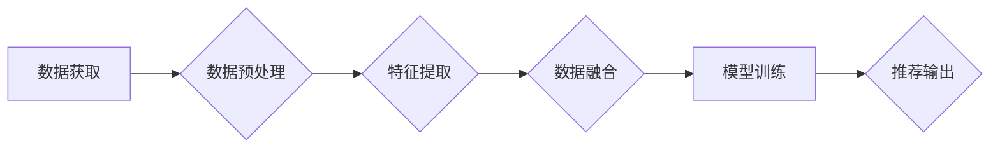

                 

## LLM推荐中的多源异构数据融合技术

> 关键词：LLM、推荐系统、多源数据融合、异构数据、数据预处理、特征工程、模型训练、性能评估

## 1. 背景介绍

近年来，大型语言模型（LLM）在自然语言处理领域取得了显著的进展，展现出强大的文本生成、理解和推理能力。LLM在推荐系统领域也逐渐得到应用，例如用于个性化内容推荐、商品推荐和用户画像构建等。然而，传统的推荐系统主要依赖于用户行为数据，而LLM的优势在于能够利用文本语义信息进行更深入的理解和分析。

多源异构数据融合技术可以有效地弥补传统推荐系统的不足，为LLM推荐系统提供更丰富、更全面的数据支持。异构数据是指来自不同来源、具有不同格式、结构和语义的数据，例如用户文本评论、商品描述、社交媒体数据等。将这些异构数据融合在一起，可以为LLM提供更全面的用户和商品信息，从而提升推荐系统的准确性和个性化程度。

## 2. 核心概念与联系

### 2.1  LLM推荐系统

LLM推荐系统是指利用大型语言模型的文本理解和生成能力构建的推荐系统。LLM可以对用户和商品的文本信息进行分析，提取关键特征和语义关系，从而进行更精准的推荐。

### 2.2  多源异构数据融合

多源异构数据融合是指从多个不同来源的数据中提取有用信息，并将其融合在一起，形成一个统一、完整的知识图谱。

### 2.3  数据融合架构

多源异构数据融合技术在LLM推荐系统中的应用架构通常包括以下几个步骤：

1. **数据获取:** 从多个数据源获取用户和商品相关信息，例如用户评论、商品描述、社交媒体数据等。
2. **数据预处理:** 对获取到的数据进行清洗、转换和格式化，使其能够被LLM模型理解和处理。
3. **特征提取:** 利用自然语言处理技术从预处理后的数据中提取关键特征，例如用户兴趣、商品属性、文本情感等。
4. **数据融合:** 将提取到的特征进行融合，形成一个综合的用户和商品表示。
5. **模型训练:** 利用融合后的数据训练LLM推荐模型，例如BERT、GPT等。
6. **推荐输出:** 根据训练好的模型，对用户进行个性化推荐。

**Mermaid 流程图**



## 3. 核心算法原理 & 具体操作步骤

### 3.1  算法原理概述

多源异构数据融合技术在LLM推荐系统中主要采用以下几种算法：

* **基于规则的融合:** 根据预先定义的规则，将不同数据源的信息进行组合和整合。
* **统计学习方法:** 利用统计学习模型，例如线性回归、支持向量机等，对不同数据源的信息进行权重分配和融合。
* **深度学习方法:** 利用深度神经网络，例如多层感知机、卷积神经网络等，对不同数据源的信息进行自动学习和融合。

### 3.2  算法步骤详解

以深度学习方法为例，具体操作步骤如下：

1. **数据预处理:** 对不同数据源的信息进行清洗、转换和格式化，使其能够被深度学习模型理解和处理。例如，将文本数据转换为词向量表示，将数值数据进行标准化处理等。
2. **特征提取:** 利用预训练的语言模型，例如BERT、RoBERTa等，对文本数据进行特征提取。
3. **数据融合:** 将不同数据源提取到的特征进行拼接或融合，形成一个综合的用户和商品表示。
4. **模型训练:** 利用融合后的数据训练深度学习推荐模型，例如多层感知机、Transformer等。
5. **模型评估:** 利用测试数据对训练好的模型进行评估，并根据评估结果进行模型调优。

### 3.3  算法优缺点

**优点:**

* 能够有效地利用多源异构数据，提升推荐系统的准确性和个性化程度。
* 深度学习方法能够自动学习数据之间的复杂关系，提升推荐效果。

**缺点:**

* 数据预处理和特征提取步骤较为复杂，需要专业知识和技术支持。
* 模型训练需要大量的计算资源和时间。

### 3.4  算法应用领域

多源异构数据融合技术在LLM推荐系统中具有广泛的应用领域，例如：

* **电商推荐:** 基于用户评论、商品描述、浏览历史等多源数据进行商品推荐。
* **内容推荐:** 基于用户阅读历史、兴趣标签、社交关系等多源数据进行内容推荐。
* **个性化广告推荐:** 基于用户画像、广告内容、广告投放历史等多源数据进行个性化广告推荐。

## 4. 数学模型和公式 & 详细讲解 & 举例说明

### 4.1  数学模型构建

假设我们有 $n$ 个用户和 $m$ 个商品，每个用户 $u$ 对商品 $i$ 的评分为 $r_{ui}$。我们的目标是构建一个数学模型，能够预测用户 $u$ 对商品 $i$ 的评分。

我们可以使用以下数学模型：

$$
\hat{r}_{ui} = \mathbf{w}_u \cdot \mathbf{v}_i + b
$$

其中：

* $\hat{r}_{ui}$ 是模型预测的用户 $u$ 对商品 $i$ 的评分。
* $\mathbf{w}_u$ 是用户 $u$ 的特征向量。
* $\mathbf{v}_i$ 是商品 $i$ 的特征向量。
* $b$ 是一个偏置项。

### 4.2  公式推导过程

我们可以使用梯度下降算法来训练模型参数 $\mathbf{w}_u$、$\mathbf{v}_i$ 和 $b$。目标函数是均方误差：

$$
L = \frac{1}{N} \sum_{u=1}^{n} \sum_{i=1}^{m} (r_{ui} - \hat{r}_{ui})^2
$$

其中 $N$ 是训练样本的数量。

梯度下降算法的更新规则如下：

$$
\mathbf{w}_u = \mathbf{w}_u - \alpha \frac{\partial L}{\partial \mathbf{w}_u}
$$

$$
\mathbf{v}_i = \mathbf{v}_i - \alpha \frac{\partial L}{\partial \mathbf{v}_i}
$$

$$
b = b - \alpha \frac{\partial L}{\partial b}
$$

其中 $\alpha$ 是学习率。

### 4.3  案例分析与讲解

假设我们有一个电商平台，用户对商品进行评分。我们可以使用上述数学模型和梯度下降算法来训练一个推荐模型，预测用户对商品的评分。

例如，我们可以将用户的购买历史、浏览记录、评论内容等信息作为用户特征向量 $\mathbf{w}_u$，并将商品的类别、价格、描述等信息作为商品特征向量 $\mathbf{v}_i$。

通过训练模型，我们可以得到用户和商品的特征向量，并利用这些特征向量预测用户对商品的评分。

## 5. 项目实践：代码实例和详细解释说明

### 5.1  开发环境搭建

* Python 3.7+
* PyTorch 1.7+
* TensorFlow 2.0+
* Numpy 1.18+
* Pandas 1.1.3+

### 5.2  源代码详细实现

```python
import torch
import torch.nn as nn

class RecommenderModel(nn.Module):
    def __init__(self, user_dim, item_dim, embedding_dim):
        super(RecommenderModel, self).__init__()
        self.user_embedding = nn.Embedding(user_dim, embedding_dim)
        self.item_embedding = nn.Embedding(item_dim, embedding_dim)
        self.fc = nn.Linear(embedding_dim * 2, 1)

    def forward(self, user_ids, item_ids):
        user_embeddings = self.user_embedding(user_ids)
        item_embeddings = self.item_embedding(item_ids)
        combined_embeddings = torch.cat((user_embeddings, item_embeddings), dim=1)
        predictions = self.fc(combined_embeddings)
        return predictions

# ... (其他代码，例如数据加载、模型训练、评估等)
```

### 5.3  代码解读与分析

* `RecommenderModel` 类定义了一个推荐模型，包含用户嵌入层、商品嵌入层和全连接层。
* `user_embedding` 和 `item_embedding` 是嵌入层，将用户 ID 和商品 ID 映射到低维向量空间。
* `fc` 是全连接层，将用户和商品的嵌入向量进行拼接，并输出评分预测。
* `forward` 方法定义了模型的正向传播过程。

### 5.4  运行结果展示

* 通过训练模型，我们可以得到用户和商品的嵌入向量，并利用这些向量进行评分预测。
* 我们可以使用评估指标，例如均方根误差 (RMSE) 和平均绝对误差 (MAE)，来评估模型的性能。

## 6. 实际应用场景

### 6.1  电商推荐

* 基于用户购买历史、浏览记录、评论内容等多源数据，推荐个性化商品。
* 利用商品描述、类别、价格等信息，进行商品分类和推荐。

### 6.2  内容推荐

* 基于用户阅读历史、兴趣标签、社交关系等多源数据，推荐个性化内容。
* 利用内容主题、作者、时间等信息，进行内容分类和推荐。

### 6.3  个性化广告推荐

* 基于用户画像、广告内容、广告投放历史等多源数据，推荐个性化广告。
* 利用广告类别、目标用户、广告效果等信息，进行广告投放优化。

### 6.4  未来应用展望

* 随着LLM技术的不断发展，多源异构数据融合技术在LLM推荐系统中的应用将更加广泛和深入。
* 未来，我们可以利用更先进的深度学习模型和数据分析方法，构建更精准、更个性化的推荐系统。

## 7. 工具和资源推荐

### 7.1  学习资源推荐

* **书籍:**
    * 《深度学习》 by Ian Goodfellow, Yoshua Bengio, and Aaron Courville
    * 《自然语言处理》 by Dan Jurafsky and James H. Martin
* **在线课程:**
    * Coursera: Deep Learning Specialization
    * Udacity: Natural Language Processing Nanodegree
* **博客和网站:**
    * Towards Data Science
    * Machine Learning Mastery

### 7.2  开发工具推荐

* **Python:** 
    * PyTorch
    * TensorFlow
    * Scikit-learn
* **数据处理工具:**
    * Pandas
    * Numpy
* **文本处理工具:**
    * SpaCy
    * NLTK

### 7.3  相关论文推荐

* **BERT:** Devlin, J., Chang, M. W., Lee, K., & Toutanova, K. (2018). BERT: Pre-training of deep bidirectional transformers for language understanding. arXiv preprint arXiv:1810.04805.
* **Transformer:** Vaswani, A., Shazeer, N., Parmar, N., Uszkoreit, J., Jones, L., Gomez, A. N., ... & Polosukhin, I. (2017). Attention is all you need. In Advances in neural information processing systems (pp. 5998-6008).

## 8. 总结：未来发展趋势与挑战

### 8.1  研究成果总结

多源异构数据融合技术在LLM推荐系统中取得了显著的进展，能够有效地提升推荐系统的准确性和个性化程度。

### 8.2  未来发展趋势

* **更先进的深度学习模型:** 
    * 利用更复杂的深度学习模型，例如Transformer变体、图神经网络等，进行数据融合和推荐。
* **更丰富的多源数据:** 
    * 探索更多类型的多源数据，例如用户行为数据、文本语义数据、图像数据等，丰富推荐系统的输入信息。
* **个性化推荐的增强:** 
    * 利用用户画像、兴趣偏好等信息，进行更精准的个性化推荐。
* **解释性推荐:** 
    * 研究如何解释LLM推荐系统的推荐结果，提高用户对推荐结果的信任度。

### 8.3  面临的挑战

* **数据质量和一致性:** 
    * 多源数据往往存在质量问题和格式不一致，需要进行有效的数据清洗和预处理。
* **数据融合方法的优化:** 
    * 如何有效地融合不同类型的数据，并提取出有价值的特征，仍然是一个挑战。
* **模型训练的效率:** 
    * 训练大型LLM模型需要大量的计算资源和时间，如何提高模型训练效率是一个重要的研究方向。

### 8.4  研究展望

未来，多源异构数据融合技术将继续在LLM推荐系统中发挥重要作用，并推动推荐系统的智能化和个性化发展。


## 9. 附录：常见问题与解答

**Q1: 多源异构数据融合技术有哪些常见的算法？**

**A1:** 常见的算法包括基于规则的融合、统计学习方法和深度学习方法。

**Q2: 如何评估多源异构数据融合技术的性能？**

**A2:** 可以使用均方根误差 (RMSE) 和平均绝对误差 (MAE) 等指标来评估模型的性能。

**Q3: 如何处理多源数据中的质量问题和格式不一致？**

**A3:** 可以使用数据清洗和预处理技术，例如数据标准化、缺失值处理、数据转换等，来解决这些问题。

**Q4: 如何提高模型训练的效率？**

**A4:** 可以使用分布式训练、模型压缩等技术来提高模型训练效率。


作者：禅与计算机程序设计艺术 / Zen and the Art of Computer Programming<end_of_turn>

